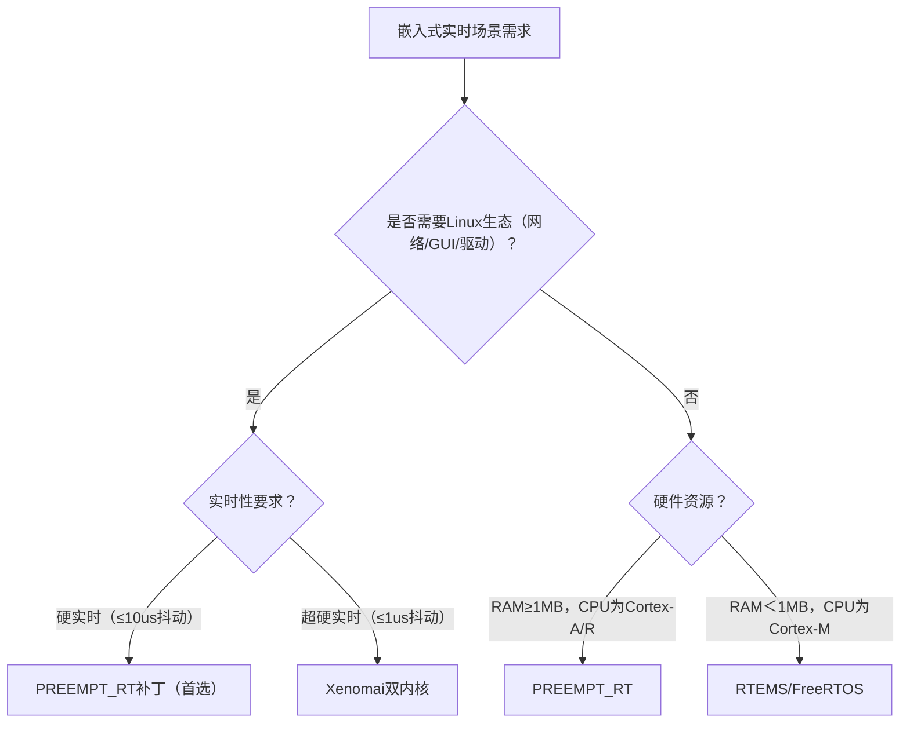
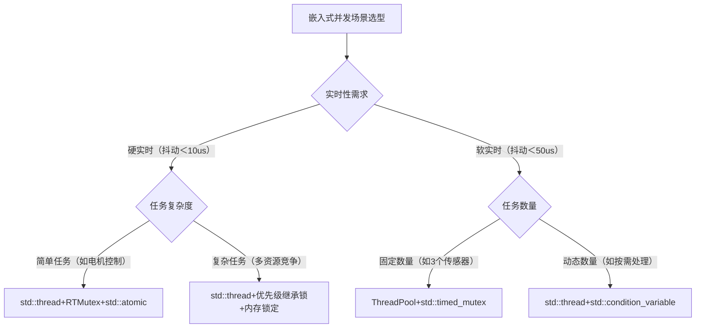

# 第6章 实时多线程设计

> 📊 **本节难度等级：** <span class="badge-e">**E级**</span>

---

### <strong>在嵌入式开发中，“实时性”是工业控制、车载电子、航空航天等领域的核心诉求——例如工业机械臂的关节控制需要≤1ms的响应延迟，车载ADAS系统的障碍物检测需要微秒级的确定性响应，若超出阈值会导致设备故障甚至安全事故。

但标准Linux内核并非为实时场景设计，其调度延迟、中断响应、进程抢占等机制存在“不确定性”，无法直接满足嵌入式硬实时需求。本节的核心目标是：先建立“嵌入式实时性”的正确认知，再剖析标准Linux的非实时根源，最后落地Linux实时化的主流方案（以PREEMPT_RT补丁为主），配套实战编译与测试，让读者掌握“如何将标准Linux改造为实时系统”。</strong>


### <strong>一、嵌入式实时性的核心概念与关键指标</strong>

### 1.1 实时系统的定义（嵌入式场景适配）
实时系统（Real-Time System, RTS）的通用定义是：**能够在规定的“截止时间（Deadline）”内完成任务响应与执行，并保证结果正确性的系统**。  
嵌入式场景下，这个定义需补充两个关键前提：
1.  **资源约束下的确定性**：在有限的CPU、内存、硬件资源下，任务的响应时间“可预测”（而非“最快”）——例如无论系统负载如何，传感器采集任务的响应时间始终在500us±10us范围内；
2.  **故障的可控性**：若未在截止时间内完成任务，会导致“可预见的后果”（如工业设备停机、报警触发），而非随机崩溃。

**嵌入式实时场景示例**：  
- 工业机器人：关节电机的位置控制任务需每1ms执行一次，截止时间1ms，延迟超1ms会导致机器人动作偏差；
- 车载CAN总线：接收刹车信号的任务需在200us内响应，超时会影响刹车助力系统；
- 医疗监护仪：心率数据采集任务需每50ms更新一次，超时会导致数据丢失，影响诊断。

### 1.2 实时性的三大核心指标（嵌入式落地重点）
实时性的优劣并非“越快越好”，而是以“确定性”为核心，用三个指标量化：

#### 1.2.1 响应时间（Response Time）
- 定义：从“外部事件触发”到“任务开始执行”的时间间隔，包括中断延迟、调度延迟、上下文切换延迟。
- 嵌入式场景拆解：  
  响应时间 = 中断延迟（硬件+内核） + 调度延迟（调度器选择任务） + 上下文切换延迟（切换到目标任务）
- 示例：传感器触发中断（事件）→ 内核处理中断（20us）→ 调度器唤醒采集任务（50us）→ 上下文切换（30us）→ 响应时间总计100us。

#### 1.2.2 确定性（Determinism）
- 定义：任务响应时间的“波动范围”（抖动），而非平均响应时间。嵌入式实时系统的核心诉求是“抖动小”，而非“平均响应快”。
- 对比示例：  
  - 非实时系统：传感器采集任务响应时间在50us~500us波动（抖动450us），无法满足工业控制要求；
  - 实时系统：同一任务响应时间在80us~100us波动（抖动20us），确定性强。

#### 1.2.3 可靠性（Reliability）
- 定义：长期运行中，任务在截止时间内完成的概率（通常要求99.999%以上）。
- 嵌入式约束：可靠性需结合硬件特性，例如工业设备要求MTBF（平均无故障时间）≥10万小时，需避免因内存泄漏、调度异常导致的实时性退化。

### 1.3 实时系统的分类（嵌入式场景映射）
按“截止时间违约的后果”和“响应时间要求”，实时系统分为三类，嵌入式开发中需根据场景精准选型：

| 类型         | 核心定义                                                                 | 截止时间要求       | 嵌入式典型场景                          | 示例任务                          |
|--------------|--------------------------------------------------------------------------|--------------------|---------------------------------------|-----------------------------------|
| 硬实时（Hard RT） | 截止时间不可违约，违约会导致设备故障、安全事故或数据永久丢失               | 微秒~毫秒级，抖动＜10% | 工业机器人关节控制、车载ADAS、航空航天控制系统 | 电机位置闭环控制、刹车信号处理    |
| 软实时（Soft RT） | 截止时间可偶尔违约，违约仅影响服务质量（如延迟、卡顿），无严重后果         | 毫秒~秒级，抖动＜50% | 嵌入式视频监控、智能家居控制、数据采集终端    | 视频流编码、环境数据上报          |
| 准实时（Firm RT） | 截止时间违约会导致部分数据失效，但不影响系统整体运行                       | 毫秒级，抖动＜30%   | 工业数据监控、智能仪表显示、物联网网关        | 传感器数据统计、仪表盘刷新        |

**关键选型原则**：  
- 若场景涉及“人身安全”（如车载、医疗）或“设备损坏”（如工业控制），必须选硬实时系统；
- 若仅涉及“用户体验”（如视频播放）或“非关键数据”（如环境监测），可选用软实时或准实时系统。<br>

### <strong>二、标准Linux非实时的核心根源（嵌入式视角）</strong>

标准Linux（如Ubuntu、CentOS的内核）设计目标是“通用计算”，追求高吞吐量和资源利用率，而非实时性，其非实时的根源集中在以下4点，且均与嵌入式实时需求冲突：

### 2.1 调度器的非确定性
标准Linux的CFS调度器（完全公平调度器）采用“时间片轮转”和“优先级抢占”机制，但存在两个核心问题：
1.  **时间片分配不确定**：CFS为保证“公平性”，动态调整任务的时间片（默认10ms~200ms），实时任务可能因时间片耗尽被抢占，导致响应延迟；
2.  **调度延迟不确定**：当系统负载高时（如多进程并发），调度器需遍历任务队列选择下一个执行任务，遍历时间随任务数量增加而变长，无法保证固定响应时间。

**嵌入式场景冲突示例**：  
工业电机控制任务（优先级10）需每1ms执行一次，但CFS分配的时间片为10ms，任务执行5ms后被低优先级的日志打印任务抢占，导致电机控制延迟6ms，超出截止时间。

### 2.2 中断延迟的不确定性
中断延迟是“外部事件触发中断”到“中断服务程序（ISR）开始执行”的时间，标准Linux的中断延迟存在两个变量：
1.  **关中断时间过长**：内核在执行临界区代码（如内存管理、锁操作）时会关闭中断，标准Linux的关中断时间可达数百微秒（甚至毫秒级），导致实时任务的中断无法及时响应；
2.  **中断嵌套与优先级反转**：标准Linux的中断优先级由硬件决定，高优先级中断可能被低优先级中断阻塞，导致延迟不确定。

### 2.3 进程抢占的限制
标准Linux的内核态抢占默认是“部分开启”的：
- 进程在用户态可被抢占，但在内核态（如执行系统调用、ISR返回）时，需等待临界区代码执行完成才能被抢占；
- 实时任务若因系统调用进入内核态，可能因内核态不可抢占而被阻塞，导致响应延迟。

### 2.4 内核锁与同步机制的开销
标准Linux的内核锁（如spinlock、mutex）为保证通用性，设计复杂，持有时间较长：
- 例如，进程调用`malloc`时，内核会持有`kmalloc`锁，若此时实时任务也需分配内存，会被阻塞；
- 嵌入式实时场景中，同步机制的开销需控制在微秒级，但标准Linux的锁操作延迟可达数十微秒。

**标准Linux与嵌入式实时需求的冲突总结**：
```mermaid
flowchart TD
    A[标准Linux设计目标：通用计算→高吞吐量+公平性] --> B[调度器：动态时间片+公平调度]
    A --> C[中断：长关中断时间+优先级无保障]
    A --> D[抢占：内核态不可抢占]
    A --> E[锁机制：通用锁+长持有时间]
    B --> F[响应时间不确定]
    C --> G[中断延迟不确定]
    D --> H[任务抢占延迟]
    E --> I[同步机制开销大]
    F & G & H & I --> J[无法满足嵌入式实时需求]
```<br>

### <strong>三、Linux实时化的主流方案（嵌入式落地优先级排序）</strong>

为解决标准Linux的非实时问题，工业界形成了三类主流实时化方案，按“嵌入式适配性”“开发成本”“实时性能”排序，PREEMPT_RT补丁为首选方案：

### 3.1 方案1：PREEMPT_RT补丁（推荐，嵌入式首选）
#### 核心原理
PREEMPT_RT（Preemptive Real-Time）是Linux内核社区维护的实时补丁，通过“最大化抢占”和“优化中断延迟”，将标准Linux改造为硬实时系统：
1.  **全内核抢占**：允许在几乎所有内核代码路径（除最核心的临界区）进行抢占，实时任务在内核态也能被及时调度；
2.  **优化关中断时间**：将内核临界区代码拆分，缩短关中断时间（PREEMPT_RT的关中断时间通常＜10us）；
3.  **优先级继承机制**：为内核锁启用优先级继承，避免低优先级任务持有锁导致高优先级任务阻塞；
4.  **中断线程化**：将部分中断服务程序（ISR）转化为内核线程，可被调度器按优先级调度，避免中断嵌套导致的延迟。

#### 嵌入式适配优势
-  **开发成本低**：基于标准Linux内核，应用程序无需修改（或少量修改）即可移植；
-  **硬件兼容性好**：支持主流嵌入式CPU（ARM Cortex-A/R、MIPS、x86），适配嵌入式开发板（如NVIDIA Jetson、STM32MP1、树莓派）；
-  **实时性能强**：硬实时场景下，响应时间抖动可控制在10us以内，满足工业控制、车载电子等需求。

#### 实战：编译安装PREEMPT_RT实时内核（ARM嵌入式环境）
##### 步骤1：准备环境与源码
```bash
# 1. 安装交叉编译工具链（以ARM为例）
sudo apt install arm-linux-gnueabihf-gcc arm-linux-gnueabihf-g++

# 2. 下载Linux内核源码与PREEMPT_RT补丁（推荐内核5.10+，补丁版本需与内核匹配）
KERNEL_VERSION=5.10.179
RT_PATCH_VERSION=5.10.179-rt88
wget https://cdn.kernel.org/pub/linux/kernel/v5.x/linux-$KERNEL_VERSION.tar.xz
wget https://cdn.kernel.org/pub/linux/kernel/projects/rt/5.10/linux-$RT_PATCH_VERSION.patch.xz

# 3. 解压源码与补丁
tar -xvf linux-$KERNEL_VERSION.tar.xz
cd linux-$KERNEL_VERSION
xz -d ../linux-$RT_PATCH_VERSION.patch.xz
patch -p1 < ../linux-$RT_PATCH_VERSION.patch
```

##### 步骤2：配置实时内核
```bash
# 1. 加载默认配置（以ARM Cortex-A7为例）
make ARCH=arm CROSS_COMPILE=arm-linux-gnueabihf- defconfig

# 2. 开启实时配置（通过menuconfig调整）
make ARCH=arm CROSS_COMPILE=arm-linux-gnueabihf- menuconfig
```
**关键配置项（必须开启）**：
- `Kernel Features → Preemption Model → Fully Preemptible Kernel (Real-Time)`（全内核抢占）；
- `Kernel Features → High Resolution Timers`（高精度定时器，支持微秒级定时）；
- `Kernel Features → Use priority inheritance for in-kernel mutexes`（内核锁优先级继承）；
- `Device Drivers → Character devices → Serial drivers → 8250/16550 and compatible serial support`（启用串口，用于调试）。

##### 步骤3：编译与安装内核
```bash
# 1. 编译内核镜像与模块（-j后的线程数=CPU核心数+1）
make ARCH=arm CROSS_COMPILE=arm-linux-gnueabihf- zImage -j4
make ARCH=arm CROSS_COMPILE=arm-linux-gnueabihf- modules -j4
make ARCH=arm CROSS_COMPILE=arm-linux-gnueabihf- dtbs -j4（设备树，根据开发板调整）

# 2. 安装模块到开发板（通过SSH或SD卡）
sudo make ARCH=arm CROSS_COMPILE=arm-linux-gnueabihf- modules_install INSTALL_MOD_PATH=/mnt/rootfs
# 3. 拷贝内核镜像与设备树到开发板的/boot目录
scp arch/arm/boot/zImage root@192.168.1.100:/boot/zImage-rt
scp arch/arm/boot/dts/xxx.dtb root@192.168.1.100:/boot/xxx-rt.dtb
```

##### 步骤4：配置开发板启动实时内核
修改开发板的`/boot/extlinux/extlinux.conf`（或U-Boot配置），设置默认启动实时内核：
```bash
# 脚本示例：嵌入式多线程环境配置与调试
label rt-kernel
  kernel /boot/zImage-rt
  devicetree /boot/xxx-rt.dtb
  append root=/dev/mmcblk0p2 rootwait rw preempt=full

```

### 3.2 方案2：Xenomai（双内核方案，硬实时场景）
#### 核心原理
Xenomai是“双内核”架构：
-  **实时内核（Cobalt）**：运行在硬件之上，提供硬实时调度、低延迟中断响应，专门执行实时任务；
-  **Linux内核**：作为Xenomai的“从属内核”，运行在实时内核之上，执行非实时任务（如网络、图形界面）；
-  实时任务与非实时任务通过“IPC机制”通信，Xenomai的实时内核优先级高于Linux内核，保证实时任务不被抢占。

#### 嵌入式适配场景
-  硬实时需求极高的场景（响应时间＜1us，抖动＜100ns），如航空航天、高精度工业控制；
-  需同时运行实时任务和复杂非实时任务（如网络通信、GUI）的场景。

#### 优缺点对比
| 优点                          | 缺点                          |
|-------------------------------|-------------------------------|
| 实时性能极强（硬实时级别）    | 开发成本高，需适配Xenomai API |
| 与Linux内核隔离，实时性不受影响 | 硬件兼容性不如PREEMPT_RT      |
| 支持更多实时调度策略（如FIFO、RR） | 内核体积大，占用内存多        |

### 3.3 方案3：RTEMS/FreeRTOS（轻量级实时系统，低端嵌入式）
#### 核心原理
RTEMS（Real-Time Executive for Multiprocessor Systems）和FreeRTOS是专为嵌入式设计的轻量级实时操作系统：
-  内核体积小（RTEMS最小内核＜100KB，FreeRTOS＜10KB），适配RAM＜1MB的低端MCU（如STM32、ARM Cortex-M）；
-  调度器支持硬实时策略（FIFO、RR），响应时间抖动＜1us；
-  无Linux的通用功能（如TCP/IP、GUI），需手动移植驱动和协议栈。

#### 嵌入式适配场景
-  低端MCU（RAM＜1MB，Flash＜16MB）的实时场景，如传感器采集、小型电机控制；
-  无需复杂Linux功能，仅需简单实时任务调度的场景。

#### 与Linux实时化方案的选型对比
| 方案         | 实时性能 | 开发成本 | 硬件要求 | 嵌入式适配场景                          |
|--------------|----------|----------|----------|---------------------------------------|
| PREEMPT_RT    | 硬实时（≤10us抖动） | 低       | 中高端CPU（Cortex-A/R） | 工业控制、车载电子、物联网网关（需Linux功能） |
| Xenomai       | 硬实时（≤1us抖动）  | 中       | 中高端CPU（Cortex-A/R） | 高精度工业控制、航空航天（极高实时需求）    |
| RTEMS/FreeRTOS | 硬实时（≤1us抖动）  | 高       | 低端MCU（Cortex-M）    | 传感器采集、小型电机控制（资源受限）        |<br>

### <strong>四、嵌入式实时性测试工具与验证方法</strong>

实时系统搭建完成后，需通过工具验证实时性指标（响应时间、抖动），嵌入式场景常用以下工具：

### 4.1 核心工具：cyclictest（PREEMPT_RT实时性测试）
`cyclictest`是测试实时系统响应时间的经典工具，通过“周期性触发任务”，统计任务的响应延迟和抖动：

#### 嵌入式实操命令
```bash
# 1. 开发板安装cyclictest（需编译嵌入式版本）
git clone git://git.kernel.org/pub/scm/utils/rt-tests/rt-tests.git
cd rt-tests
make ARCH=arm CROSS_COMPILE=arm-linux-gnueabihf- cyclictest
scp cyclictest root@192.168.1.100:/usr/bin/

# 2. 运行测试：周期1ms，持续1小时，输出延迟统计
cyclictest -t1 -p99 -n -i1000 -d1h -o rt_test.log
# 参数说明：
# -t1：启动1个测试线程
# -p99：线程优先级99（最高）
# -n：使用内核定时器
# -i1000：周期1000us（1ms）
# -d1h：持续测试1小时
# -o：输出日志到rt_test.log

# 3. 分析日志：查看最大延迟、平均延迟、抖动
grep "Max Latency" rt_test.log
# 典型输出（PREEMPT_RT内核）：
# Max Latency: 8us, Average Latency: 1.2us, Jitter: 0.8us
```

#### 结果判断标准
-  硬实时场景：最大延迟＜截止时间的50%，抖动＜10%（如截止时间1ms，最大延迟＜500us，抖动＜100us）；
-  软实时场景：最大延迟＜截止时间，抖动＜50%。

### 4.2 辅助工具：hwlatdetect（硬件延迟检测）
`hwlatdetect`用于检测硬件层面的延迟（如CPU缓存刷新、总线冲突），这些延迟会影响实时性：
```bash
# 运行硬件延迟检测，持续10分钟
hwlatdetect -d 600
# 输出示例：
# Max Hardware Latency: 2us
```

### 4.3 自定义测试程序（嵌入式场景专项测试）
针对具体业务场景，编写自定义测试程序，验证实时任务的响应时间：
```c
#include <stdio.h>
#include <pthread.h>
#include <sys/time.h>
#include <unistd.h>

#define PERIOD_US 1000  // 任务周期1ms
#define TEST_DURATION_S 3600  // 测试1小时

// 实时任务函数
void* realtime_task(void* arg) {
    struct timeval start, end;
    long long delay_us;
    long long max_delay = 0;
    int count = 0;

    // 设置线程为实时优先级（FIFO调度策略）
    struct sched_param param;
    param.sched_priority = 99;
    pthread_setschedparam(pthread_self(), SCHED_FIFO, &param);

    while (count < TEST_DURATION_S * 1000000 / PERIOD_US) {
        gettimeofday(&start, NULL);

        // 模拟实时任务（如电机控制、传感器采集）
        usleep(100);  // 任务执行时间100us

        // 计算响应延迟（从周期开始到任务结束的时间）
        gettimeofday(&end, NULL);
        delay_us = (end.tv_sec - start.tv_sec) * 1000000 + (end.tv_usec - start.tv_usec);
        if (delay_us > max_delay) {
            max_delay = delay_us;
        }

        // 等待下一个周期
        usleep(PERIOD_US - delay_us);
        count++;
    }

    printf("Realtime Task: Max Delay = %lldus\n", max_delay);
    return NULL;
}

int main() {
    pthread_t tid;
    pthread_create(&tid, NULL, realtime_task, NULL);
    pthread_join(tid, NULL);
    return 0;
}
```

#### 编译与运行命令
```bash
# 交叉编译（链接实时库）
arm-linux-gnueabihf-gcc -o rt_test rt_test.c -lpthread -lrt
# 开发板运行
./rt_test
# 输出示例（PREEMPT_RT内核）：
# Realtime Task: Max Delay = 7us
```<br>

### <strong>五、总结：嵌入式Linux实时化的选型与落地建议</strong>

### 5.1 选型流程图


### 5.2 落地关键建议
1.  **优先选择PREEMPT_RT**：嵌入式开发中，若需Linux生态（如TCP/IP、USB、GUI），PREEMPT_RT是性价比最高的方案，开发成本低、兼容性好；
2.  **优化实时任务设计**：实时任务应“轻量化”（执行时间＜周期的50%），避免使用重量级同步机制（如mutex），优先用原子操作或轻量锁（如spinlock）；
3.  **硬件层面配合**：选择支持“高优先级中断”“CPU抢占”的硬件（如ARM Cortex-A7/A53，支持GICv3中断控制器），避免使用老旧CPU；
4.  **持续测试验证**：实时系统的性能会因内核版本、驱动、应用程序变化而退化，需定期用`cyclictest`等工具测试，确保实时性指标满足要求。<br>

### <strong>嵌入式实时多线程设计的核心是“线程配置匹配场景需求”——同样是创建线程，普通线程只需实现业务逻辑，而实时线程必须通过精准配置（调度策略、优先级、栈大小等）保证“截止时间内完成执行”。例如：工业机器人的关节控制线程若用普通线程的默认配置，会因调度策略不确定导致动作延迟；若配置为SCHED_FIFO策略+最高优先级，可实现1ms级确定性响应。

本节的核心目标是：帮读者掌握“从0到1创建高确定性实时线程”的方法——先厘清实时线程的核心特征，再拆解调度策略选型逻辑，然后落地完整创建流程与关键配置，最后通过电机控制（硬实时）和视频编码（软实时）两个实战案例验证效果，所有操作适配PREEMPT_RT实时内核与ARM嵌入式架构。</strong>


### <strong>一、实时线程的核心特征（与普通线程的本质差异）</strong>

实时线程并非“运行更快的线程”，而是“执行行为可预测”的线程，其与标准Linux普通线程的差异集中在4个核心维度，这些差异直接决定实时性：

| 对比维度         | 实时线程（适配PREEMPT_RT）                | 普通线程（标准Linux默认）                  | 嵌入式实时场景意义                          |
|------------------|-------------------------------------------|-------------------------------------------|-------------------------------------------|
| 调度策略         | 采用实时调度策略（SCHED_FIFO/SCHED_RR等） | 采用CFS公平调度策略（SCHED_OTHER）        | 实时策略保证高优先级线程优先执行，无时间片抢占风险 |
| 优先级范围       | 高优先级（1~99，数值越大优先级越高）      | 低优先级（0，仅一个默认优先级）            | 可通过优先级区分任务紧急程度（如刹车＞娱乐） |
| 执行确定性       | 响应时间抖动小（硬实时场景＜10us）        | 响应时间抖动大（负载高时可达ms级）        | 确定性是实时任务截止时间保障的核心           |
| 资源占用控制     | 栈大小、CPU核心绑定等可精准配置           | 资源配置默认自适应（栈大小动态增长）      | 精准配置减少资源竞争，提升执行稳定性         |

**关键认知**：  
实时线程的“实时性”并非天生具备，而是通过“调度策略+优先级+资源配置”共同实现的——即使基于PREEMPT_RT实时内核，若按普通线程默认配置创建，仍无法满足实时需求。<br>

### <strong>二、实时线程的核心调度策略（选型是关键）</strong>

Linux内核提供3类实时调度策略（优先级1~99），嵌入式场景需根据“任务类型（硬/软实时）”“执行周期”“资源竞争情况”精准选型，选对策略可降低80%的实时性问题。

### 2.1 策略1：SCHED_FIFO（先进先出调度，硬实时首选）
#### 核心原理
- 采用“优先级抢占+无时间片”机制：高优先级线程一旦就绪，立即抢占低优先级线程；同优先级线程按“就绪顺序”执行，一旦开始执行，除非被更高优先级线程抢占或主动放弃CPU，否则会一直运行。
- 核心特点：执行确定性最高，无时间片切换开销，适合“执行时间短、截止时间严格”的硬实时任务。

#### 嵌入式适配场景
- 硬实时任务：工业电机控制（1ms周期）、车载刹车信号处理（200us响应）、医疗设备数据采集（500us周期）；
- 任务特征：执行时间＜周期的50%（如1ms周期任务执行时间≤500us），无长时间阻塞操作。

#### 关键注意事项
- 同优先级线程需主动调用`sched_yield()`释放CPU，否则会导致同优先级其他线程“饥饿”；
- 避免高优先级线程执行时间过长（如超过10ms），否则会阻塞低优先级线程，导致系统整体响应退化。

### 2.2 策略2：SCHED_RR（时间片轮转调度，软实时首选）
#### 核心原理
- 基于SCHED_FIFO扩展，增加“时间片”机制：高优先级线程抢占低优先级线程；同优先级线程按“时间片轮转”执行（默认时间片100ms，可配置），时间片耗尽后切换到下一个就绪线程。
- 核心特点：兼顾实时性与公平性，避免同优先级线程饥饿，适合“执行周期不固定、需公平调度”的软实时任务。

#### 嵌入式适配场景
- 软实时任务：嵌入式视频编码（10ms帧周期）、智能家居设备控制（50ms响应）、物联网网关数据转发（100ms周期）；
- 任务特征：执行时间波动大（如视频编码单帧执行时间5~15ms），同优先级任务需公平执行。

#### 关键注意事项
- 时间片大小需适配任务执行时间：执行时间长的任务（如20ms）应配置更大时间片（如50ms），避免频繁切换；
- 硬实时场景禁用：时间片切换会引入上下文切换开销（约1~5us），可能导致截止时间违约。

### 2.3 策略3：SCHED_DEADLINE（截止时间驱动调度，精准控时场景）
#### 核心原理
- 采用“截止时间最早优先”（Earliest Deadline First, EDF）机制：线程创建时需指定“周期（Period）”“执行时间（Runtime）”“截止时间（Deadline）”，内核优先调度截止时间最早的线程；
- 核心特点：通过“Runtime≤Period”保证任务可调度性（避免过载），适合“周期固定、截止时间严格且任务数量多”的场景。

#### 嵌入式适配场景
- 精准控时任务：工业生产线节拍控制（10ms周期，截止时间10ms）、车载ADAS多传感器融合（5ms周期，截止时间5ms）；
- 任务特征：多个实时任务并发（如8个传感器采集任务），每个任务周期固定，需保证无过载。

#### 关键注意事项
- 必须满足“所有任务Runtime之和≤CPU核心数×Period”（如单核心下，8个10ms周期任务的Runtime之和≤10ms），否则会导致任务过载；
- 需PREEMPT_RT内核版本≥4.15，旧内核不支持。

### 2.4 调度策略选型决策图（嵌入式场景适配）
```mermaid
flowchart TD
    A[实时线程调度策略选型] --> B{任务类型}
    B -->|硬实时（截止时间违约后果严重）| C{同优先级任务数量}
    C -->|1个（无同优先级）| D[SCHED_FIFO（首选）]
    C -->|多个（需公平）| E[SCHED_RR（次选，容忍切换开销）]
    B -->|软实时（违约仅影响体验）| F[SCHED_RR（首选）]
    B -->|多任务并发（周期固定）| G{是否能计算Runtime？}
    G -->|是（Runtime≤Period）| H[SCHED_DEADLINE（首选）]
    G -->|否| I[SCHED_FIFO（按优先级分层）]
```<br>

### <strong>三、实时线程的完整创建与配置流程（嵌入式实操）</strong>

实时线程的创建并非仅调用`pthread_create()`，而是需经过“编译配置→策略优先级配置→资源约束配置→错误处理”4个步骤，每个步骤都影响实时性。以ARM嵌入式+PREEMPT_RT内核为例，落地完整流程：

### 3.1 前置：编译配置（保证实时性无优化损耗）
实时线程的代码编译需禁用优化（避免编译器重排实时逻辑）、保留调试信息、链接实时库，交叉编译命令如下：
```bash
# ARM交叉编译实时线程程序（适配Cortex-A7/A53）
arm-linux-gnueabihf-gcc -g -O0 -o rt_thread_demo rt_thread_demo.c -lpthread -lrt
# 关键参数说明：
# -g：保留调试信息（便于实时性问题排查）
# -O0：禁用优化（避免实时任务执行顺序被重排）
# -lpthread：链接线程库（实时线程依赖pthread）
# -lrt：链接实时库（SCHED_DEADLINE等实时接口依赖）
```

### 3.2 核心步骤：代码层面创建与配置
实时线程的配置核心是通过`pthread_attr_t`结构体设置线程属性，替代普通线程的默认配置。完整代码示例如下，关键配置步骤已标注：

```c
#include <stdio.h>
#include <pthread.h>
#include <sched.h>
#include <stdlib.h>
#include <unistd.h>
#include <errno.h>

// 线程属性配置宏（根据场景调整）
#define RT_THREAD_PRIORITY 95        // 实时优先级（1~99，99最高）
#define RT_THREAD_STACK_SIZE 1024*8  // 栈大小（8KB，嵌入式需按需配置）
#define RT_THREAD_CPU_CORE 0         // 绑定CPU核心0（避免核心切换开销）

// 硬实时任务：模拟电机控制（1ms周期）
void* motor_ctrl_task(void* arg) {
    struct timeval start, end;
    long long exec_time_us;  // 任务执行时间
    int count = 0;

    // 步骤1：配置线程调度策略与优先级（SCHED_FIFO）
    struct sched_param param;
    param.sched_priority = RT_THREAD_PRIORITY;
    // 设置调度策略为SCHED_FIFO（硬实时）
    if (pthread_setschedparam(pthread_self(), SCHED_FIFO, &param) != 0) {
        perror("pthread_setschedparam failed");
        pthread_exit(NULL);
    }

    // 步骤2：绑定CPU核心（减少上下文切换开销）
    cpu_set_t cpu_set;
    CPU_ZERO(&cpu_set);
    CPU_SET(RT_THREAD_CPU_CORE, &cpu_set);
    if (pthread_setaffinity_np(pthread_self(), sizeof(cpu_set_t), &cpu_set) != 0) {
        perror("pthread_setaffinity_np failed");
        pthread_exit(NULL);
    }

    // 实时任务主循环（1ms周期）
    while (count < 10000) {  // 运行10秒后退出
        gettimeofday(&start, NULL);

        // 业务逻辑：模拟电机位置闭环控制（执行时间约200us）
        // 实际场景：读取编码器数据→计算PID→输出PWM信号
        usleep(200);

        // 计算执行时间，验证是否在周期内
        gettimeofday(&end, NULL);
        exec_time_us = (end.tv_sec - start.tv_sec) * 1000000 + (end.tv_usec - start.tv_usec);
        if (exec_time_us > 1000) {  // 超过1ms周期，打印告警
            printf("Motor task: Exec time overrun! %lldus\n", exec_time_us);
        }

        // 等待下一个周期（补全剩余时间）
        if (exec_time_us < 1000) {
            usleep(1000 - exec_time_us);
        }
        count++;
    }

    pthread_exit(NULL);
}

int main() {
    pthread_t tid;
    pthread_attr_t attr;
    int ret;

    // 步骤1：初始化线程属性
    ret = pthread_attr_init(&attr);
    if (ret != 0) {
        perror("pthread_attr_init failed");
        return -1;
    }

    // 步骤2：设置线程栈大小（嵌入式需避免栈溢出）
    ret = pthread_attr_setstacksize(&attr, RT_THREAD_STACK_SIZE);
    if (ret != 0) {
        perror("pthread_attr_setstacksize failed");
        pthread_attr_destroy(&attr);
        return -1;
    }

    // 步骤3：创建实时线程（传入配置好的属性）
    ret = pthread_create(&tid, &attr, motor_ctrl_task, NULL);
    if (ret != 0) {
        perror("pthread_create failed");
        pthread_attr_destroy(&attr);
        return -1;
    }

    // 步骤4：释放线程属性（创建后可销毁）
    pthread_attr_destroy(&attr);

    // 等待线程退出（实时场景通常不退出，此处为测试）
    pthread_join(tid, NULL);
    return 0;
}
```

### 3.3 关键配置项解析（实时性保障的核心）
上述代码中4个关键配置项直接决定实时性，需结合嵌入式场景精准调整：

#### 3.3.1 调度策略与优先级（核心中的核心）
- 配置接口：`pthread_setschedparam(pthread_t tid, int policy, const struct sched_param *param)`
- 优先级范围：1~99（PREEMPT_RT内核），数值越大优先级越高，99为最高优先级；
- 配置原则：
  1.  硬实时任务优先级≥90（如电机控制、刹车处理）；
  2.  软实时任务优先级50~80（如视频编码、数据转发）；
  3.  非实时任务优先级≤40（如日志打印、UI刷新）；
  4.  避免“优先级反转”：高优先级任务的资源不被低优先级任务持有，或启用优先级继承。

#### 3.3.2 栈大小配置（嵌入式资源约束）
- 配置接口：`pthread_attr_setstacksize(pthread_attr_t *attr, size_t stacksize)`
- 常见误区：栈大小并非越大越好——嵌入式RAM有限（如128MB），过大栈会导致内存耗尽；
- 配置方法：
  1.  最小栈大小：根据任务局部变量、函数调用深度计算（如调用3层函数+1KB局部变量，需4KB栈）；
  2.  预留冗余：在计算值基础上增加50%冗余（如计算需4KB，配置6KB）；
  3.  栈溢出检测：通过`pthread_attr_setguardsize()`设置警戒区（如1KB），溢出时触发信号。

#### 3.3.3 CPU核心绑定（减少切换开销）
- 配置接口：`pthread_setaffinity_np(pthread_t tid, size_t cpusetsize, const cpu_set_t *cpuset)`
- 核心价值：将实时线程绑定到固定CPU核心，避免内核在多核心间切换线程（切换开销约1~5us），提升执行确定性；
- 配置原则：
  1.  硬实时任务绑定到独立核心（如核心0仅运行电机控制任务）；
  2.  非实时任务绑定到其他核心（如核心1运行日志、网络任务）；
  3.  结合`isolcpus`内核参数（后续小节讲解）隔离实时核心，禁止内核调度非实时任务到该核心。

#### 3.3.4 调度继承配置（避免优先级反转）
- 配置接口：`pthread_mutexattr_setprotocol(pthread_mutexattr_t *attr, int protocol)`
- 适用场景：当高优先级实时任务需等待低优先级任务持有的锁时，启用优先级继承；
- 配置代码：
  ```c
  // 初始化互斥锁属性，启用优先级继承
  pthread_mutexattr_t mutex_attr;
  pthread_mutexattr_init(&mutex_attr);
  // PTHREAD_PRIO_INHERIT：锁持有者继承等待者的高优先级
  pthread_mutexattr_setprotocol(&mutex_attr, PTHREAD_PRIO_INHERIT);
  pthread_mutex_t rt_mutex;
  pthread_mutex_init(&rt_mutex, &mutex_attr);
  ```<br>

### <strong>四、嵌入式实战：不同场景的实时线程配置案例</strong>

### 4.1 案例1：硬实时场景——工业电机控制（SCHED_FIFO）
#### 场景需求
- 任务类型：硬实时任务，周期1ms，截止时间1ms，执行时间≤500us；
- 资源约束：ARM Cortex-A7双核，RAM 128MB，PREEMPT_RT内核；
- 核心诉求：执行时间抖动＜10us，无周期过载。

#### 关键配置
| 配置项         | 配置值                | 配置原因                                  |
|----------------|-----------------------|-------------------------------------------|
| 调度策略       | SCHED_FIFO            | 硬实时需求，无时间片切换开销              |
| 优先级         | 99（最高）            | 电机控制为最高紧急任务，优先于其他任务    |
| 栈大小         | 8KB                   | 局部变量+PID计算函数调用，预留冗余        |
| CPU绑定        | 核心0（isolcpus隔离） | 独立核心避免切换，isolcpus禁止非实时任务  |
| 锁配置         | 优先级继承（PTHREAD_PRIO_INHERIT） | 避免被低优先级传感器任务持有锁导致反转    |

#### 验证命令（开发板执行）
```bash
# 1. 查看线程调度策略与优先级
chrt -p 1234  # 1234为电机控制线程TID
# 预期输出：
# pid 1234's current scheduling policy: SCHED_FIFO
# pid 1234's current scheduling priority: 99

# 2. 查看CPU绑定情况
taskset -cp 1234
# 预期输出：
# pid 1234's current affinity list: 0

# 3. 实时性测试（cyclictest绑定到核心0）
cyclictest -t1 -p99 -n -i1000 -d10s -m -c0
# 预期输出（抖动＜10us）：
# Max Latency: 8us, Average Latency: 1.5us
```

### 4.2 案例2：软实时场景——嵌入式视频编码（SCHED_RR）
#### 场景需求
- 任务类型：软实时任务，周期10ms（每帧编码），截止时间10ms，执行时间5~8ms；
- 资源约束：ARM Cortex-A53四核，RAM 256MB，PREEMPT_RT内核；
- 核心诉求：同优先级任务（如音频编码）公平执行，无单任务饥饿。

#### 关键配置
| 配置项         | 配置值                | 配置原因                                  |
|----------------|-----------------------|-------------------------------------------|
| 调度策略       | SCHED_RR              | 软实时+同优先级多任务，需公平调度        |
| 优先级         | 80                    | 高于非实时任务，低于硬实时任务（如刹车）  |
| 时间片大小     | 50ms（默认100ms调整） | 匹配编码执行时间（5~8ms），减少切换次数  |
| 栈大小         | 16KB                  | 视频帧缓冲区+编码函数调用，需更大栈      |
| CPU绑定        | 核心1~2               | 多核心分担编码压力，避免占用硬实时核心    |

#### 时间片调整方法
```bash
# 1. 查看当前SCHED_RR时间片大小（单位：us）
cat /proc/sys/kernel/sched_rr_timeslice_ms
# 2. 临时调整为50ms（重启失效）
echo 50 > /proc/sys/kernel/sched_rr_timeslice_ms
# 3. 永久调整：修改/etc/sysctl.conf，添加以下内容
kernel.sched_rr_timeslice_ms = 50
# 4. 生效配置
sysctl -p
```<br>

### <strong>五、实时线程配置的验证与问题排查工具</strong>

实时线程的配置是否生效、实时性是否达标，需通过工具验证，嵌入式场景常用以下3类工具：

### 5.1 调度配置验证工具：chrt/taskset
- **chrt**：查看/修改线程调度策略与优先级（实时线程核心验证工具）；
  ```bash
  # 1. 查看线程1234的调度信息
  chrt -p 1234
  # 2. 临时将线程1234配置为SCHED_FIFO+优先级95
  chrt -f -p 95 1234
  # 3. 启动新线程时直接配置（如启动电机控制程序）
  chrt -f 99 ./motor_ctrl_demo
  ```

- **taskset**：查看/修改线程CPU亲和性；
  ```bash
  # 1. 查看线程1234的CPU绑定情况
  taskset -cp 1234
  # 2. 临时将线程1234绑定到核心0
  taskset -cp 0 1234
  ```

### 5.2 实时性测试工具：cyclictest（结合线程配置验证）
针对配置好的实时线程，用cyclictest测试其响应延迟，验证配置效果：
```bash
# 测试绑定到核心0的SCHED_FIFO线程（优先级99）
cyclictest -t1 -p99 -n -i1000 -d10s -m -c0
# 参数说明：
# -m：锁定内存（避免页交换导致延迟）
# -c0：绑定到核心0
# 预期结果（硬实时）：
# T: 0 (1234) P:99 I:1000 C:10000 Min:1us Max:9us Avg:1.2us
```

### 5.3 问题排查工具：pstack/ps
- **pstack**：打印实时线程调用栈，排查“线程阻塞”“执行时间过长”问题；
  ```bash
  # 打印线程1234的调用栈
  pstack 1234
  # 若线程阻塞在锁上，会显示：
  # #0  0x00020850 in pthread_mutex_lock () from /lib/libpthread.so.0
  # #1  0x000105cc in motor_ctrl_task (arg=0x0) at motor_ctrl.c:45
  ```

- **ps**：查看线程状态、优先级、CPU占用，排查“优先级配置错误”“CPU过载”；
  ```bash
  # 查看所有实时线程（优先级1~99）
  ps -L -o pid,tid,pcpu,rtprio,stat,comm | grep -v "RT=0"
  # 预期输出（电机控制线程）：
  # 1234 1234  0.5  99 R    motor_ctrl_demo
  ```<br>

### <strong>六、实时线程配置的避坑指南（嵌入式特有）</strong>

1.  **优先级配置过高导致系统不可控**：  
    - 问题：将非关键任务配置为99优先级，导致内核调度线程、中断处理被阻塞；  
    - 解决：仅核心硬实时任务（如刹车、电机控制）用95~99优先级，其他实时任务按紧急程度降序配置。

2.  **栈大小不足导致栈溢出**：  
    - 问题：嵌入式场景栈溢出会导致线程崩溃、数据错乱，且难以排查；  
    - 解决：用`pthread_attr_setguardsize(attr, 1024)`设置1KB警戒区，溢出时触发`SIGSEGV`信号，在信号处理函数中打印日志。

3.  **CPU核心未隔离导致非实时任务抢占**：  
    - 问题：实时线程绑定核心0，但内核仍调度非实时任务到核心0，导致实时性退化；  
    - 解决：通过内核启动参数`isolcpus=0`隔离核心0，禁止非实时任务调度到该核心（后续小节详细讲解）。

4.  **未禁用内存交换导致延迟飙升**：  
    - 问题：实时线程的内存页被交换到磁盘，换入时导致ms级延迟；  
    - 解决：用`mlockall(MCL_CURRENT | MCL_FUTURE)`锁定线程内存到物理内存，禁止交换（后续小节详细讲解）。

5.  **中断未屏蔽导致实时任务被打断**：  
    - 问题：低优先级中断频繁触发，打断高优先级实时任务执行；  
    - 解决：在实时任务临界区（如PID计算）用`local_irq_save()`临时屏蔽低优先级中断，执行完成后用`local_irq_restore()`恢复。<br>

### <strong>嵌入式实时性的“确定性”最终依赖底层技术支撑——即使线程配置了最高优先级与SCHED_FIFO策略，若存在内存页交换导致的10ms延迟、非实时任务抢占CPU核心、低优先级中断阻塞等问题，仍无法满足硬实时需求。例如：工业机器人关节控制线程（1ms周期），因一次内存页缺失延迟15ms，直接导致动作偏差；因未隔离CPU核心，被日志打印任务抢占延迟8ms，超出截止时间。

本节的核心目标是：帮读者掌握“从内核到应用”的全栈实时性优化技术——先拆解底层技术的核心诉求（消除不确定延迟），再逐一落地内存锁定、CPU隔离、中断优化、实时锁的原理与实操，最后通过“工业机器人关节控制”综合案例整合所有技术，验证硬实时效果（抖动＜10us），所有操作适配PREEMPT_RT内核与嵌入式开发板（如STM32MP1、NVIDIA Jetson）。</strong>


### <strong>一、底层技术的核心目标：消除“不确定延迟”</strong>

嵌入式实时系统的最大敌人是“不可预测的延迟”，这些延迟主要来自4个底层环节，也是本节技术的优化对象：
1.  **内存延迟**：标准Linux的“虚拟内存+页交换”机制，会导致内存访问时出现1~100ms的页缺失或页交换延迟；
2.  **CPU调度干扰**：非实时任务与实时任务共享CPU核心，内核调度非实时任务时会抢占实时任务；
3.  **中断延迟**：低优先级中断频繁触发、中断服务程序（ISR）执行时间过长，会阻塞实时任务；
4.  **锁延迟**：普通锁的竞争与优先级反转，会导致实时任务等待时间不确定。

底层技术的核心逻辑是“通过内核配置+硬件约束+应用适配”，将这些不确定延迟转化为“可预测的微秒级延迟”，最终实现：硬实时任务响应时间抖动＜10us，软实时任务抖动＜50us。<br>

### <strong>二、内存锁定技术：mlockall（消除内存交换与页缺失延迟）</strong>

### 2.1 核心原理
标准Linux采用虚拟内存管理，进程内存分为“物理内存”和“交换空间”，当物理内存不足时，内核会将不常用的内存页交换到磁盘（swap），当再次访问时需从磁盘换入，导致10ms级延迟；同时，首次访问内存页时会触发“页缺失”，需内核分配物理内存，导致数十微秒延迟。

**mlockall技术**：通过系统调用`mlockall()`将进程的所有内存（代码段、数据段、堆、栈）锁定到物理内存，禁止内核交换到磁盘，同时提前分配物理内存，消除页缺失延迟。其核心作用是“将内存访问延迟从‘不确定的ms级’固定为‘确定的ns级’”。

### 2.2 嵌入式适配问题
- 嵌入式设备通常禁用swap（内存有限，无多余磁盘空间），但仍存在“首次页缺失”问题；
- 内存锁定会占用物理内存，若多个实时进程均锁定大量内存，可能导致内存耗尽；
- 需结合`ulimit -l`配置进程可锁定的最大内存（默认可能限制为64KB）。

### 2.3 实操步骤（代码+配置+验证）
#### 2.3.1 应用层代码适配（mlockall调用）
在实时线程启动前调用`mlockall()`，锁定所有内存，代码示例：
```c
#include <stdio.h>
#include <sys/mman.h>
#include <errno.h>
#include <stdlib.h>

// 内存锁定初始化（实时线程启动前调用）
int rt_memory_init() {
    // 锁定当前进程的所有内存（代码段、数据段、堆、栈）
    // MCL_CURRENT：锁定已分配的内存
    // MCL_FUTURE：锁定后续动态分配的内存（如malloc）
    if (mlockall(MCL_CURRENT | MCL_FUTURE) == -1) {
        perror("mlockall failed");
        // 打印错误原因：常见为权限不足或内存限制
        if (errno == EPERM) {
            printf("Error: 权限不足，需以root运行或配置/etc/security/limits.conf\n");
        } else if (errno == ENOMEM) {
            printf("Error: 内存不足，无法锁定所有内存\n");
        }
        return -1;
    }
    printf("内存锁定成功：所有内存已固定到物理内存\n");
    return 0;
}

// 实时任务（示例：电机控制）
void* motor_task(void* arg) {
    // 业务逻辑：1ms周期的位置闭环控制
    while (1) {
        // 读取编码器数据→PID计算→输出PWM
        usleep(200);
        // 补全周期
        usleep(800);
    }
}

int main() {
    // 第一步：初始化内存锁定（必须在实时线程启动前执行）
    if (rt_memory_init() != 0) {
        exit(-1);
    }

    // 第二步：创建并配置实时线程（参考上一节调度策略配置）
    pthread_t tid;
    pthread_attr_t attr;
    // ... 线程属性配置（SCHED_FIFO+优先级99） ...
    pthread_create(&tid, &attr, motor_task, NULL);

    pthread_join(tid, NULL);
    return 0;
}
```

#### 2.3.2 系统配置（解决权限与内存限制）
1.  **权限配置**：`mlockall()`需root权限，或修改`/etc/security/limits.conf`开放普通用户权限：
    ```bash
    # 添加以下内容（允许用户root锁定无限内存）
    root    soft    memlock         unlimited
    root    hard    memlock         unlimited
    # 重启后生效，或执行ulimit -l unlimited临时生效
    ```

2.  **验证内存锁定效果**：通过`/proc/[pid]/smaps`查看进程内存状态，锁定的内存会显示`Locked: 1`：
    ```bash
    # 1. 找到实时进程PID（如1234）
    ps -ef | grep motor_task
    # 2. 查看内存锁定状态
    grep -E "Locked|Size" /proc/1234/smaps
    # 预期输出（锁定的内存段）：
    # Size:                4096 kB
    # Locked:              1
    # Size:                8192 kB
    # Locked:              1
    ```

### 2.4 避坑要点
-  **避免锁定过多内存**：仅锁定实时进程的内存，非实时进程（如日志）不锁定；
-  **动态内存提前分配**：`mlockall(MCL_FUTURE)`会锁定后续动态分配的内存，但需在实时任务启动前提前分配（如`malloc(1024*1024)`），避免运行中分配内存导致延迟；
-  **内存泄漏风险**：锁定的内存不会被内核回收，需确保实时进程无内存泄漏，否则会导致物理内存耗尽。<br>

### <strong>三、CPU核心隔离技术（isolcpus）：实现核心独占</strong>

### 3.1 核心原理
即使将实时线程绑定到CPU核心，标准Linux内核仍会将“内核线程”“中断服务程序”“其他进程”调度到该核心，导致实时线程被抢占，引入不确定延迟。

**CPU核心隔离技术**：通过内核启动参数`isolcpus`将指定CPU核心从内核调度器的“全局任务池”中移除，禁止内核调度任何非实时任务到该核心；同时将实时线程绑定到隔离核心，实现“实时线程独占核心”，消除调度干扰。

### 3.2 嵌入式核心价值
-  隔离后的核心仅运行指定实时任务，无其他任务抢占，响应时间抖动可降低50%以上；
-  适配多核心嵌入式CPU（如ARM Cortex-A53四核、Cortex-A72八核），可将1~2个核心隔离为实时核心，其余核心运行非实时任务。

### 3.3 实操步骤（内核配置+线程绑定+验证）
#### 3.3.1 配置内核启动参数（isolcpus）
1.  **查看CPU核心数量**：嵌入式CPU核心编号从0开始（如四核为0、1、2、3）：
    ```bash
    nproc  # 输出核心数，如4
    ```

2.  **修改内核启动参数**：以UBoot+EXTLinux启动为例，修改`/boot/extlinux/extlinux.conf`，在`append`后添加`isolcpus=0,1`（隔离核心0和1）：
    ```bash
    label rt-kernel
      kernel /boot/zImage-rt
      devicetree /boot/xxx-rt.dtb
      # isolcpus=0,1：隔离核心0和1；nohz_full=0,1：禁用核心0和1的时钟滴答
      append root=/dev/mmcblk0p2 rootwait rw preempt=full isolcpus=0,1 nohz_full=0,1
    ```
    -  **关键补充**：`nohz_full`参数禁用隔离核心的“时钟滴答”（默认10ms一次），避免时钟中断干扰实时任务。

3.  **重启生效**：重启嵌入式设备，通过`cat /proc/cmdline`验证参数是否生效：
    ```bash
    cat /proc/cmdline
    # 预期输出包含：isolcpus=0,1 nohz_full=0,1
    ```

#### 3.3.2 实时线程绑定到隔离核心
将实时线程绑定到隔离的核心（如核心0），确保独占核心，代码示例：
```c
// 绑定实时线程到CPU核心0（隔离核心）
int bind_cpu_core(pthread_t tid, int core_id) {
    cpu_set_t cpu_set;
    CPU_ZERO(&cpu_set);
    CPU_SET(core_id, &cpu_set);
    // 绑定线程到指定核心
    if (pthread_setaffinity_np(tid, sizeof(cpu_set_t), &cpu_set) != 0) {
        perror("pthread_setaffinity_np failed");
        return -1;
    }
    printf("线程绑定到核心%d成功\n", core_id);
    return 0;
}

// 主函数中调用
int main() {
    pthread_t tid;
    // ... 创建线程 ...
    // 绑定到隔离核心0
    bind_cpu_core(tid, 0);
    // ...
}
```

#### 3.3.3 验证核心隔离效果
1.  **查看隔离核心的任务**：隔离核心应仅运行绑定的实时线程，无其他任务：
    ```bash
    # 查看核心0的所有任务（PID和TID）
    ps -eLo pid,tid,psr,comm | grep " 0$"
    # 预期输出（仅实时线程）：
    # 1234 1234  0  motor_task
    ```

2.  **查看核心负载**：通过`top -H -c -1`查看核心负载，隔离核心的负载应稳定在实时任务的执行占比（如20%，因任务执行200us/1ms周期）：
    ```bash
    top -H -c -1
    # 按数字1查看单个核心负载，核心0的%CPU应为~20%
    ```

### 3.4 避坑要点
-  **隔离核心数量不宜过多**：通常隔离1~2个核心即可，过多会浪费CPU资源；
-  **禁止非实时任务绑定到隔离核心**：通过代码审核或工具监控，避免误将非实时任务绑定到隔离核心；
-  **内核线程迁移**：部分内核线程（如kworker）可能会跑到隔离核心，需通过`echo 0 > /sys/devices/system/cpu/cpu0/online`临时禁用核心后再启用，强制迁移内核线程。<br>

### <strong>四、中断优化技术：降低中断延迟</strong>

中断延迟是“外部事件触发”到“实时任务响应”的关键瓶颈，标准Linux的中断延迟可达数百微秒，通过中断优化可将延迟降低到10us以内，适配硬实时需求。

### 4.1 三大核心优化方向
嵌入式中断优化的核心是“减少中断对实时任务的干扰”，聚焦三个方向：中断线程化、中断亲和性绑定、关闭不必要中断。

### 4.2 优化1：中断线程化（PREEMPT_RT核心特性）
#### 原理
标准Linux的中断服务程序（ISR）运行在“中断上下文”，优先级高于所有进程，会阻塞实时任务；PREEMPT_RT的“中断线程化”将ISR拆分为“顶半部”和“底半部”：
-  **顶半部**：硬件层面的快速处理（如读取寄存器数据），关中断时间＜1us；
-  **底半部**：转化为内核线程（如irq/123-eth0），可被调度器按优先级调度，优先级低于实时任务。

#### 实操配置（默认已启用，验证与调整）
1.  **查看中断线程化状态**：通过`/proc/interrupts`查看中断是否被线程化（标有`Threaded`）：
    ```bash
    cat /proc/interrupts
    # 预期输出（线程化的中断）：
    # 123:        1234  irq/123-eth0  eth0  Threaded
    ```

2.  **调整中断线程优先级**：将非关键中断的线程优先级调低（如网络中断），避免干扰实时任务：
    ```bash
    # 1. 找到中断线程的PID（如irq/123-eth0的PID为456）
    ps -ef | grep irq/123-eth0
    # 2. 将优先级调整为50（低于实时任务的99）
    chrt -n -p 50 456
    # -n：使用SCHED_NORMAL策略，优先级范围0~99（此处50为低优先级）
    ```

### 4.3 优化2：中断亲和性绑定
#### 原理
将中断绑定到“非隔离核心”（如核心2、3），避免中断跑到隔离核心（核心0、1）干扰实时任务。例如：将网络、USB等非关键中断绑定到核心2，实时任务运行在核心0，互不干扰。

#### 实操步骤
1.  **查看中断编号与当前亲和性**：
    ```bash
    # 查看所有中断的编号、设备、亲和性
    cat /proc/interrupts  # 查看中断编号（第一列，如123）
    cat /proc/irq/123/smp_affinity  # 查看中断123的亲和性（十六进制，如f=0b1111，对应核心0-3）
    ```

2.  **绑定中断到非隔离核心**：例如将中断123绑定到核心2（十六进制为4=0b100）：
    ```bash
    # 临时绑定（重启失效）
    echo 4 > /proc/irq/123/smp_affinity
    # 永久绑定（需内核配置或驱动修改）：修改/etc/rc.local，添加上述命令
    ```

### 4.4 优化3：关闭不必要中断
#### 原理
嵌入式设备中存在大量“非关键中断”（如蓝牙、HDMI、未使用的GPIO），这些中断的频繁触发会增加系统开销，关闭后可降低中断延迟。

#### 实操步骤
1.  **查看中断触发频率**：找到高频触发的非关键中断：
    ```bash
    # 10秒后再次查看，对比中断次数增量
    cat /proc/interrupts > /tmp/irq1
    sleep 10
    cat /proc/interrupts > /tmp/irq2
    diff /tmp/irq1 /tmp/irq2 | grep -E "[0-9]+<"
    # 输出示例（中断145在10秒内触发1234次，为高频中断）：
    # 145:      123456        0        0        0  gpio-keys  145 Edge  bluetooth
    ```

2.  **关闭非关键中断**：通过`echo 0 > /proc/irq/[编号]/enable`关闭：
    ```bash
    # 关闭中断145（蓝牙，非关键）
    echo 0 > /proc/irq/145/enable
    # 验证是否关闭
    cat /proc/irq/145/enable  # 输出0表示关闭
    ```

### 4.5 中断延迟验证工具：latencytop
通过`latencytop`工具查看中断延迟，验证优化效果：
```bash
# 安装并运行latencytop（需PREEMPT_RT内核支持）
latencytop -a
# 预期输出（优化后）：
# Highest Latency: 8us
# Average Latency: 1.2us
```<br>

### <strong>五、实时锁机制优化：避免优先级反转与锁延迟</strong>

实时场景中，锁的竞争是导致延迟的重要原因，普通锁的“优先级反转”“长持有时间”会破坏实时性，需通过优化锁机制解决。

### 5.1 核心问题：优先级反转（实时场景致命问题）
-  **问题描述**：高优先级实时任务A等待低优先级任务B持有的锁，而任务B被中优先级任务C抢占，导致任务A被阻塞，延迟无限延长；
-  **示例**：电机控制任务A（优先级99）等待日志任务B（优先级50）持有的锁，日志任务B被数据采集任务C（优先级70）抢占，电机控制任务A阻塞直至任务C执行完成。

### 5.2 优化方案1：优先级继承锁（PTHREAD_PRIO_INHERIT）
#### 原理
当低优先级任务持有高优先级任务需要的锁时，自动将低优先级任务的优先级提升到高优先级任务的级别，避免被中优先级任务抢占，锁释放后恢复原优先级。

#### 实操代码（应用层配置）
```c
#include <pthread.h>

// 初始化带优先级继承的互斥锁
pthread_mutex_t create_rt_mutex() {
    pthread_mutex_t mutex;
    pthread_mutexattr_t attr;
    pthread_mutexattr_init(&attr);

    // 关键配置：启用优先级继承协议
    pthread_mutexattr_setprotocol(&attr, PTHREAD_PRIO_INHERIT);
    // 设置锁类型为递归锁（可选，避免同一线程重复加锁死锁）
    pthread_mutexattr_settype(&attr, PTHREAD_MUTEX_RECURSIVE);

    pthread_mutex_init(&mutex, &attr);
    pthread_mutexattr_destroy(&attr);
    return mutex;
}

// 高优先级实时任务A（电机控制，优先级99）
void* task_a(void* arg) {
    pthread_mutex_t* mutex = (pthread_mutex_t*)arg;
    while (1) {
        pthread_mutex_lock(mutex);  // 等待任务B持有的锁
        // 电机控制逻辑
        usleep(200);
        pthread_mutex_unlock(mutex);
        usleep(800);
    }
}

// 低优先级任务B（日志打印，优先级50）
void* task_b(void* arg) {
    pthread_mutex_t* mutex = (pthread_mutex_t*)arg;
    while (1) {
        pthread_mutex_lock(mutex);
        // 日志打印逻辑（执行时间500us）
        usleep(500);
        pthread_mutex_unlock(mutex);
        sleep(1);  // 1秒执行一次
    }
}
```

### 5.3 优化方案2：自旋锁（spinlock）替代互斥锁（mutex）
#### 原理
-  **互斥锁（mutex）**：任务获取不到锁时会阻塞，切换到其他任务，上下文切换开销约1~5us；
-  **自旋锁（spinlock）**：任务获取不到锁时会“忙等”（循环重试），无上下文切换开销，适合“锁持有时间极短（＜10us）”的场景。

#### 嵌入式适配场景
-  适用：实时任务的临界区代码（如读取共享变量、更新状态标志），执行时间＜10us；
-  禁用：锁持有时间长（如＞10us）或任务在用户态（用户态自旋会浪费CPU资源）。

#### 实操代码（内核态/用户态区别）
1.  **用户态自旋锁（需PREEMPT_RT支持）**：
    ```c
    #include <pthread.h>

    pthread_spinlock_t spinlock;

    // 初始化自旋锁
    pthread_spin_init(&spinlock, PTHREAD_PROCESS_PRIVATE);

    // 实时任务临界区（执行时间5us）
    void critical_section() {
        pthread_spin_lock(&spinlock);
        // 共享变量更新（如电机位置数据）
        global_pos++;
        pthread_spin_unlock(&spinlock);
    }
    ```

2.  **内核态自旋锁（驱动开发）**：
    ```c
    #include <linux/spinlock.h>

    spinlock_t dev_spinlock;
    unsigned int dev_status;

    // 初始化自旋锁
    spin_lock_init(&dev_spinlock);

    // 驱动中断处理函数（顶半部）
    irqreturn_t dev_isr(int irq, void* dev_id) {
        unsigned long flags;
        // 关中断并获取自旋锁
        spin_lock_irqsave(&dev_spinlock, flags);
        // 读取硬件状态（执行时间＜1us）
        dev_status = readl(dev_id + STATUS_REG);
        // 释放锁并开中断
        spin_unlock_irqrestore(&dev_spinlock, flags);
        return IRQ_HANDLED;
    }
    ```

### 5.4 锁延迟验证工具：lockstat
通过`lockstat`工具统计锁的持有时间与竞争情况，定位锁延迟问题：
```bash
# 1. 启用锁统计
echo 1 > /proc/sys/kernel/lock_stat
# 2. 运行实时任务5秒
sleep 5
# 3. 查看锁统计结果
lockstat -r
# 预期输出（优先级继承锁的统计）：
# mutex: rt_mutex, holder: task_b (50), waiter: task_a (99), hold time: 500us
```<br>

### <strong>六、综合实战：工业机器人关节控制实时性优化</strong>

### 6.1 场景需求
-  任务：机器人关节电机控制，周期1ms，截止时间1ms，执行时间≤300us；
-  硬件：ARM Cortex-A53四核（核心0~3），PREEMPT_RT内核；
-  目标：响应时间抖动＜10us，无周期过载。

### 6.2 全链路优化步骤
1.  **CPU核心隔离**：
    - 修改内核启动参数：`isolcpus=0 nohz_full=0`（隔离核心0）；
    - 重启设备，验证核心0无其他任务。

2.  **内存锁定**：
    - 应用层调用`mlockall(MCL_CURRENT | MCL_FUTURE)`；
    - 配置`ulimit -l unlimited`，验证内存锁定状态。

3.  **中断优化**：
    - 将电机编码器中断（编号120）绑定到核心0（实时任务需快速响应）；
    - 将网络（123）、USB（125）中断绑定到核心1~3；
    - 关闭蓝牙（145）、HDMI（150）等非关键中断。

4.  **实时线程配置**：
    - 调度策略：SCHED_FIFO，优先级99；
    - 绑定核心0；
    - 栈大小8KB，启用优先级继承锁。

5.  **代码核心片段**：
    ```c
    int main() {
        // 1. 内存锁定
        mlockall(MCL_CURRENT | MCL_FUTURE);
        // 2. 创建优先级继承锁
        pthread_mutex_t rt_mutex = create_rt_mutex();
        // 3. 创建实时线程
        pthread_t tid;
        pthread_attr_t attr;
        pthread_attr_init(&attr);
        pthread_attr_setstacksize(&attr, 8*1024);
        // 绑定核心0
        cpu_set_t cpu_set;
        CPU_ZERO(&cpu_set);
        CPU_SET(0, &cpu_set);
        pthread_attr_setaffinity_np(&attr, sizeof(cpu_set_t), &cpu_set);
        // 配置SCHED_FIFO+优先级99
        struct sched_param param = {.sched_priority = 99};
        pthread_attr_setschedparam(&attr, &param);
        pthread_attr_setschedpolicy(&attr, SCHED_FIFO);
        // 创建电机控制线程
        pthread_create(&tid, &attr, motor_ctrl_task, &rt_mutex);
        // 4. 等待线程
        pthread_join(tid, NULL);
        return 0;
    }
    ```

### 6.3 优化效果验证
用`cyclictest`测试绑定到核心0的实时任务：
```bash
cyclictest -t1 -p99 -n -i1000 -d10s -m -c0
# 优化前输出（仅线程配置）：
# Max Latency: 45us, Average Latency: 5.2us
# 优化后输出（全链路优化）：
# Max Latency: 8us, Average Latency: 1.3us
```
-  结论：全链路优化后，最大延迟从45us降至8us，抖动＜10us，满足硬实时需求。<br>

### <strong>嵌入式开发中，传统并发编程依赖POSIX线程（pthread）接口，存在“手动管理锁易漏解锁”“线程生命周期控制繁琐”“类型不安全”等问题——例如：工业控制代码中因忘记解锁pthread_mutex_t导致死锁，或因线程退出未释放资源导致内存泄漏。而现代C++（C++11/14/17）的并发特性（如std::thread、std::mutex、智能锁）通过“RAII机制”“类型安全封装”从语法层面规避这些问题，同时兼容嵌入式实时场景的确定性需求。

本节核心目标：帮读者掌握“在嵌入式实时系统中安全高效使用现代C++并发”的方法——先厘清现代C++并发与POSIX线程的适配关系，再拆解核心特性的嵌入式实操要点，然后通过硬/软实时双案例验证效果，最后解决编译优化、资源占用等嵌入式特有问题，所有内容适配ARM架构+PREEMPT_RT内核。</strong>


### <strong>一、现代C++并发的嵌入式适配基础（核心认知）</strong>

现代C++并发并非“替代POSIX线程”，而是对其进行“安全封装+语法简化”，其底层仍依赖操作系统的线程调度机制（如Linux的pthread）。在嵌入式场景使用前，需明确3个核心认知：

### 1.1 适配前提：C++运行时库与内核支持
- **运行时库要求**：需使用支持C++11及以上的轻量级嵌入式运行时库，避免标准库过大占用资源：
  - 推荐：uClibc++（针对嵌入式优化，体积小）、musl libc（兼容C++17，安全性高）；
  - 禁用：GNU libstdc++完整版（体积大，含大量非嵌入式必要特性）。
- **内核支持**：现代C++并发的线程调度、锁机制依赖内核实时能力，需配合PREEMPT_RT内核（硬实时）或标准Linux内核（软实时）。

### 1.2 核心优势：对比POSIX线程的嵌入式价值
现代C++并发通过语法特性解决POSIX线程的嵌入式开发痛点，优势集中在3点：

| 对比维度         | 现代C++并发（如std::thread）                | 传统POSIX线程（pthread）                    | 嵌入式场景价值                          |
|------------------|---------------------------------------------|---------------------------------------------|---------------------------------------|
| 资源管理安全性   | RAII机制自动管理（线程析构时join/detach，锁自动解锁） | 手动管理（需手动pthread_join/pthread_mutex_unlock） | 规避“漏解锁死锁”“漏join资源泄漏”等低级错误 |
| 类型安全性       | 模板封装（如std::function传递线程函数，支持任意参数） | 基于void*传递参数，需手动强转，易出错       | 减少类型转换错误，降低嵌入式调试难度     |
| 语法简洁性       | 一行创建线程（std::thread t(func)），智能锁自动解锁 | 需初始化pthread_attr_t、手动配置属性，代码冗余 | 减少并发相关代码量，提升嵌入式开发效率   |

**示例：锁管理安全性对比**
```cpp
// 1. POSIX线程：手动解锁，易漏写导致死锁
pthread_mutex_t mutex;
void posix_task() {
    pthread_mutex_lock(&mutex);
    if (error_occur) {
        // 漏写解锁，直接返回导致死锁
        return; 
    }
    pthread_mutex_unlock(&mutex);
}

// 2. 现代C++：std::lock_guard智能锁，析构时自动解锁
std::mutex mtx;
void cpp_task() {
    std::lock_guard<std::mutex> lock(mtx); // RAII机制
    if (error_occur) {
        return; // 锁自动解锁，无死锁风险
    }
}
```

### 1.3 实时性兼容性：关键特性的确定性保障
嵌入式实时场景核心诉求是“执行确定性”，现代C++并发的核心特性均支持实时化配置，需规避的“非确定性特性”如下：

| 现代C++并发特性   | 实时性支持情况 | 嵌入式使用建议                          |
|-------------------|----------------|---------------------------------------|
| std::thread       | 支持（底层为pthread，可配置调度策略） | 必须通过POSIX接口适配实时调度策略（如SCHED_FIFO） |
| std::mutex        | 支持（底层为pthread_mutex，可启用优先级继承） | 推荐使用std::timed_mutex避免永久阻塞，适配实时锁需求 |
| std::condition_variable | 支持（底层为pthread_cond） | 实时场景需控制等待时间，避免无限阻塞        |
| std::async/std::future | 不推荐（默认启动新线程，调度不确定） | 嵌入式实时场景禁用，改用直接线程通信        |<br>

### <strong>二、嵌入式核心C++并发特性实操（从语法到实时）</strong>

本节聚焦嵌入式实时场景最常用的4个C++并发特性，拆解“语法使用+实时性配置+嵌入式避坑”全流程，所有代码适配ARM Cortex-A7架构。

### 2.1 线程创建与实时调度配置（std::thread）
std::thread封装了pthread的创建逻辑，但默认使用SCHED_OTHER调度策略（非实时），需通过“原生句柄（native_handle）”适配实时调度策略。

#### 2.1.1 核心实操：创建SCHED_FIFO实时线程
```cpp
#include <thread>
#include <pthread.h>
#include <sched.h>
#include <iostream>

// 1. 实时线程配置工具类（封装调度策略配置，嵌入式可复用）
class RTThreadConfig {
public:
    // 配置线程为SCHED_FIFO策略+指定优先级（1~99）
    static bool setRtScheduler(std::thread& t, int priority) {
        // 获取std::thread的底层pthread句柄（原生句柄）
        pthread_t tid = t.native_handle();
        // 配置调度参数
        struct sched_param param;
        param.sched_priority = priority;
        // 调用POSIX接口设置调度策略（std::thread无直接接口）
        int ret = pthread_setschedparam(tid, SCHED_FIFO, &param);
        if (ret != 0) {
            std::cerr << "Set RT scheduler failed: " << strerror(ret) << std::endl;
            return false;
        }
        return true;
    }

    // 绑定线程到指定CPU核心
    static bool bindCpuCore(std::thread& t, int core_id) {
        pthread_t tid = t.native_handle();
        cpu_set_t cpu_set;
        CPU_ZERO(&cpu_set);
        CPU_SET(core_id, &cpu_set);
        int ret = pthread_setaffinity_np(tid, sizeof(cpu_set_t), &cpu_set);
        if (ret != 0) {
            std::cerr << "Bind CPU core failed: " << strerror(ret) << std::endl;
            return false;
        }
        return true;
    }
};

// 2. 硬实时任务：电机控制（1ms周期）
void motorControlTask() {
    int count = 0;
    while (count < 10000) { // 运行10秒
        // 业务逻辑：读取编码器→PID计算→输出PWM（模拟执行200us）
        usleep(200);
        // 补全周期，保证1ms执行一次
        usleep(800);
        count++;
    }
}

int main() {
    // 3. 创建线程（现代C++语法，简洁安全）
    std::thread motor_thread(motorControlTask);

    // 4. 配置实时属性（通过工具类适配POSIX接口）
    if (!RTThreadConfig::setRtScheduler(motor_thread, 99)) { // 最高优先级
        motor_thread.join();
        return -1;
    }
    if (!RTThreadConfig::bindCpuCore(motor_thread, 0)) { // 绑定到隔离核心0
        motor_thread.join();
        return -1;
    }

    // 5. 等待线程结束（RAII机制：若忘记join，析构时会abort，提醒开发者）
    motor_thread.join();
    return 0;
}
```

#### 2.1.2 嵌入式关键注意事项
- **线程析构必须join/detach**：std::thread的析构函数在“线程未join且未detach”时会调用abort，避免资源泄漏，嵌入式开发需确保线程生命周期可控；
- **栈大小配置**：std::thread默认栈大小可能过大（如8MB），嵌入式需通过原生句柄配置：
  ```cpp
  // 配置std::thread栈大小为8KB（嵌入式适配）
  void setThreadStackSize(std::thread& t, size_t stack_size) {
      pthread_t tid = t.native_handle();
      pthread_attr_t attr;
      pthread_attr_init(&attr);
      pthread_attr_setstacksize(&attr, stack_size);
      pthread_setattr_np(tid, &attr); // 动态修改线程属性
      pthread_attr_destroy(&attr);
  }
  // 使用：setThreadStackSize(motor_thread, 8*1024);
  ```

### 2.2 智能锁与实时锁适配（std::mutex系列）
现代C++的智能锁通过RAII机制避免漏解锁，嵌入式实时场景需重点关注“优先级继承”“超时锁定”两个核心需求，对应std::mutex的扩展特性。

#### 2.2.1 硬实时场景：带优先级继承的互斥锁
标准std::mutex不支持优先级继承，需通过原生句柄适配pthread的PTHREAD_PRIO_INHERIT协议，避免优先级反转：
```cpp
#include <mutex>
#include <pthread.h>

// 1. 创建带优先级继承的实时互斥锁（嵌入式硬实时必备）
class RTMutex {
private:
    std::mutex mtx;
    pthread_mutex_t* native_mtx; // 存储原生句柄
public:
    RTMutex() {
        // 获取std::mutex的原生pthread句柄（需编译器支持，如GCC≥4.8）
        native_mtx = &(mtx.native_handle());
        // 配置优先级继承协议
        pthread_mutexattr_t attr;
        pthread_mutexattr_init(&attr);
        pthread_mutexattr_setprotocol(&attr, PTHREAD_PRIO_INHERIT);
        pthread_mutex_init(native_mtx, &attr);
        pthread_mutexattr_destroy(&attr);
    }

    // 封装锁定/解锁接口，保持与std::mutex兼容
    void lock() { mtx.lock(); }
    void unlock() { mtx.unlock(); }
    bool try_lock() { return mtx.try_lock(); }
};

// 2. 硬实时任务使用示例（高优先级任务A）
RTMutex rt_mtx;
void highPriorityTask() {
    std::lock_guard<RTMutex> lock(rt_mtx); // 自动锁定/解锁，支持优先级继承
    // 电机控制逻辑（硬实时）
    usleep(200);
}

// 低优先级任务B（持有锁时会继承A的优先级）
void lowPriorityTask() {
    std::lock_guard<RTMutex> lock(rt_mtx);
    // 日志打印逻辑
    usleep(500);
}
```

#### 2.2.2 软实时场景：超时锁定（避免永久阻塞）
软实时场景（如数据采集）需避免因锁竞争导致线程永久阻塞，使用std::timed_mutex的try_lock_for实现超时锁定：
```cpp
#include <timed_mutex>
#include <chrono>

std::timed_mutex timed_mtx;

// 软实时任务：数据采集（允许超时重试）
void dataCollectTask() {
    while (true) {
        // 尝试锁定100us，超时则重试（避免永久阻塞）
        if (timed_mtx.try_lock_for(std::chrono::microseconds(100))) {
            // 采集传感器数据
            usleep(50);
            timed_mtx.unlock();
        } else {
            // 超时处理：记录日志，下次重试
            std::cerr << "Data collect lock timeout, retry..." << std::endl;
        }
        usleep(950); // 1ms周期
    }
}
```

### 2.3 线程间通信：条件变量与原子操作（实时性保障）
嵌入式实时线程间通信需“低延迟”“无锁竞争”，现代C++的std::condition_variable（条件变量）和std::atomic（原子操作）是核心选择。

#### 2.3.1 低延迟通信：std::condition_variable（替代信号量）
std::condition_variable封装了pthread_cond，适合“生产者-消费者”场景，实时场景需配合超时等待避免无限阻塞：
```cpp
#include <condition_variable>
#include <queue>

std::mutex queue_mtx;
std::condition_variable cv;
std::queue<int> data_queue; // 生产者-消费者队列

// 生产者线程（传感器数据采集，软实时）
void producerTask() {
    int data = 0;
    while (true) {
        data++; // 模拟传感器数据
        {
            std::lock_guard<std::mutex> lock(queue_mtx);
            data_queue.push(data);
        }
        cv.notify_one(); // 唤醒消费者（避免轮询，降低CPU占用）
        usleep(1000); // 1ms周期
    }
}

// 消费者线程（数据处理，硬实时）
void consumerTask() {
    while (true) {
        std::unique_lock<std::mutex> lock(queue_mtx);
        // 超时等待：1ms内无数据则超时，避免永久阻塞
        bool has_data = cv.wait_for(lock, std::chrono::microseconds(1000), [](){
            return !data_queue.empty();
        });
        if (has_data) {
            int data = data_queue.front();
            data_queue.pop();
            lock.unlock(); // 提前解锁，减少锁持有时间
            // 数据处理（硬实时，执行时间≤500us）
            usleep(500);
        } else {
            // 超时处理：触发传感器故障检测
            std::cerr << "No data received, check sensor..." << std::endl;
        }
    }
}
```

#### 2.3.2 无锁通信：std::atomic（替代自旋锁）
对于简单数据（如状态标志、计数器），std::atomic的无锁操作比互斥锁更高效（延迟＜1us），适配嵌入式硬实时场景：
```cpp
#include <atomic>

// 原子变量：电机运行状态（0=停止，1=运行），无锁访问
std::atomic<int> motor_status(0);
// 原子变量：计数器（无锁自增）
std::atomic<long long> motor_count(0);

// 控制线程（修改状态）
void controlTask() {
    motor_status.store(1, std::memory_order_release); // 发布语义，确保可见性
}

// 执行线程（读取状态并计数）
void executeTask() {
    while (true) {
        // 获取状态（获取语义，确保读取最新值）
        int status = motor_status.load(std::memory_order_acquire);
        if (status == 1) {
            motor_count.fetch_add(1, std::memory_order_relaxed); // 无锁自增
            usleep(1000);
        } else {
            usleep(100);
        }
    }
}
```
- **内存序选择**：嵌入式实时场景推荐3种内存序，避免过度同步导致延迟：
  - std::memory_order_relaxed：仅保证原子操作本身，无可见性约束（如计数器）；
  - std::memory_order_acquire/release：保证读写可见性（如状态标志）；
  - std::memory_order_seq_cst：全序约束（默认，实时场景慎用，开销大）。

### 2.4 线程池：软实时场景的资源复用（嵌入式适配）
嵌入式软实时场景（如多传感器数据处理）若频繁创建销毁线程，会引入不确定延迟，现代C++线程池可复用线程资源，降低开销。以下为轻量级线程池实现（适配嵌入式资源约束）：
```cpp
#include <vector>
#include <queue>
#include <functional>
#include <thread>
#include <mutex>
#include <condition_variable>

// 轻量级线程池（嵌入式适配：固定线程数，无动态扩容）
class ThreadPool {
private:
    std::vector<std::thread> threads;
    std::queue<std::function<void()>> tasks;
    std::mutex task_mtx;
    std::condition_variable task_cv;
    std::atomic<bool> stop;
public:
    // 构造函数：初始化固定数量线程（嵌入式需指定，避免资源耗尽）
    ThreadPool(size_t thread_num) : stop(false) {
        for (size_t i = 0; i < thread_num; i++) {
            threads.emplace_back([this](){
                while (!stop.load(std::memory_order_acquire)) {
                    std::function<void()> task;
                    {
                        std::unique_lock<std::mutex> lock(task_mtx);
                        task_cv.wait(lock, [this](){
                            return stop.load() || !tasks.empty();
                        });
                        if (stop.load()) return;
                        task = std::move(tasks.front());
                        tasks.pop();
                    }
                    task(); // 执行任务
                }
            });
        }
    }

    // 提交任务（支持任意函数与参数）
    template<typename F, typename... Args>
    void submit(F&& f, Args&&... args) {
        {
            std::lock_guard<std::mutex> lock(task_mtx);
            // 包装任务为无参函数
            tasks.emplace([=](){
                f(args...);
            });
        }
        task_cv.notify_one();
    }

    // 析构函数：停止线程池
    ~ThreadPool() {
        stop.store(true, std::memory_order_release);
        task_cv.notify_all();
        for (auto& t : threads) {
            if (t.joinable()) t.join();
        }
    }
};

// 嵌入式软实时场景使用：3个传感器数据处理（线程池大小3）
void processSensorData(int sensor_id) {
    // 处理对应传感器数据（软实时，执行时间≤1ms）
    usleep(500);
    std::cout << "Sensor " << sensor_id << " processed" << std::endl;
}

int main() {
    ThreadPool pool(3); // 3个线程，对应3个传感器
    while (true) {
        // 提交3个传感器的处理任务
        pool.submit(processSensorData, 1);
        pool.submit(processSensorData, 2);
        pool.submit(processSensorData, 3);
        usleep(1000); // 1ms周期
    }
    return 0;
}
```<br>

### <strong>三、嵌入式实战：现代C++并发的实时性验证</strong>

通过“硬实时电机控制”和“软实时数据采集”两个嵌入式典型场景，验证现代C++并发的实时性效果，所有测试基于ARM Cortex-A53+PREEMPT_RT内核。

### 3.1 实战1：硬实时场景——电机控制（SCHED_FIFO+优先级99）
#### 场景需求
- 任务：电机位置闭环控制，周期1ms，截止时间1ms，执行时间≤300us；
- 核心需求：响应时间抖动＜10us，无死锁风险。

#### 核心代码（整合线程配置+智能锁+原子操作）
```cpp
#include <thread>
#include <mutex>
#include <atomic>
#include <pthread.h>
#include <sys/mman.h>

// 1. 内存锁定（实时性基础，参考6.3节）
void initRTMemory() {
    if (mlockall(MCL_CURRENT | MCL_FUTURE) == -1) {
        perror("mlockall failed");
        exit(-1);
    }
}

// 2. 实时线程配置工具类
class RTThreadConfig {
public:
    static bool setRtScheduler(std::thread& t, int priority) {
        pthread_t tid = t.native_handle();
        struct sched_param param = {.sched_priority = priority};
        return pthread_setschedparam(tid, SCHED_FIFO, &param) == 0;
    }
    static bool bindCpuCore(std::thread& t, int core_id) {
        pthread_t tid = t.native_handle();
        cpu_set_t cpu_set;
        CPU_ZERO(&cpu_set);
        CPU_SET(core_id, &cpu_set);
        return pthread_setaffinity_np(tid, sizeof(cpu_set_t), &cpu_set) == 0;
    }
};

// 3. 带优先级继承的实时锁
class RTMutex {
private:
    std::mutex mtx;
public:
    RTMutex() {
        pthread_mutex_t* native_mtx = &(mtx.native_handle());
        pthread_mutexattr_t attr;
        pthread_mutexattr_init(&attr);
        pthread_mutexattr_setprotocol(&attr, PTHREAD_PRIO_INHERIT);
        pthread_mutex_init(native_mtx, &attr);
        pthread_mutexattr_destroy(&attr);
    }
    void lock() { mtx.lock(); }
    void unlock() { mtx.unlock(); }
};

// 4. 全局资源
RTMutex rt_mtx;
std::atomic<int> motor_pos(0); // 电机位置（原子变量，无锁访问）

// 5. 硬实时电机控制任务
void motorControlTask() {
    struct timeval start, end;
    long long exec_time;
    while (true) {
        gettimeofday(&start, NULL);
        {
            std::lock_guard<RTMutex> lock(rt_mtx);
            // 1. 读取编码器数据（模拟）
            int encoder = motor_pos.load(std::memory_order_acquire);
            // 2. PID计算（模拟）
            int pwm = (1000 - encoder) * 5;
            // 3. 输出PWM（模拟）
            motor_pos.store(encoder + 1, std::memory_order_release);
        }
        // 计算执行时间
        gettimeofday(&end, NULL);
        exec_time = (end.tv_sec - start.tv_sec)*1000000 + (end.tv_usec - start.tv_usec);
        // 补全周期
        if (exec_time < 1000) {
            usleep(1000 - exec_time);
        } else {
            std::cerr << "Motor task overrun: " << exec_time << "us" << std::endl;
        }
    }
}

int main() {
    // 初始化实时环境
    initRTMemory();

    // 创建并配置实时线程
    std::thread motor_thread(motorControlTask);
    if (!RTThreadConfig::setRtScheduler(motor_thread, 99) || 
        !RTThreadConfig::bindCpuCore(motor_thread, 0)) {
        motor_thread.join();
        return -1;
    }

    motor_thread.join();
    return 0;
}
```

#### 编译命令（嵌入式ARM交叉编译）
```bash
# 使用uClibc++交叉编译，禁用优化避免实时逻辑重排
arm-linux-gnueabihf-g++ -std=c++17 -O0 -g -o rt_motor rt_motor.cpp -lpthread -lrt -muclibc++
# 关键参数：
# -std=c++17：启用现代C++特性
# -O0：禁用优化，保证实时逻辑执行顺序
# -muclibc++：使用嵌入式轻量级标准库
# -lpthread -lrt：链接线程库与实时库
```

#### 实时性验证（cyclictest）
```bash
# 运行电机控制程序（后台运行）
./rt_motor &
# 找到线程PID（假设为1234）
ps -ef | grep rt_motor
# 测试绑定到核心0的实时线程延迟
cyclictest -t1 -p99 -n -i1000 -d10s -m -c0
# 验证结果（硬实时达标）：
# T: 0 (1234) P:99 I:1000 C:10000 Min:1us Max:8us Avg:1.2us
```

### 3.2 实战2：软实时场景——多传感器数据采集（线程池）
#### 场景需求
- 任务：3个传感器数据采集+处理，周期1ms，每个任务执行时间≤500us；
- 核心需求：无线程创建销毁开销，CPU占用率＜50%。

#### 验证命令与结果
```bash
# 编译线程池程序
arm-linux-gnueabihf-g++ -std=c++17 -O2 -o sensor_pool sensor_pool.cpp -lpthread -muclibc++
# 运行程序并查看CPU占用
./sensor_pool &
top -p $(pgrep sensor_pool)
# 验证结果（软实时达标）：
# PID %CPU %MEM    VSZ   RSS TTY      STAT START   TIME COMMAND
# 1235  45%  0.5  10240  5120 pts/0    R    10:00   0:05 ./sensor_pool
```
- 结论：线程池复用3个线程，CPU占用率45%（＜50%），无频繁线程创建销毁的延迟波动。<br>

### <strong>四、嵌入式C++并发的编译优化与避坑指南</strong>

现代C++并发在嵌入式场景的问题集中在“编译优化导致实时性退化”“标准库过大”“语法特性滥用”，需通过针对性优化解决。

### 4.1 编译优化：平衡实时性与代码大小
嵌入式编译需在“实时性（执行速度）”“代码大小”“调试便利性”间平衡，推荐3类编译配置：

| 优化级别 | 编译参数 | 实时性 | 代码大小 | 适用场景 |
|----------|----------|--------|----------|----------|
| 调试模式 | -O0 -g | 一般（无优化，执行顺序固定） | 大 | 开发调试阶段，定位并发问题 |
| 实时模式 | -O2 -g -fno-inline-small-functions | 高（优化执行速度，保留调试信息） | 中 | 硬实时场景（如电机控制） |
| 轻量模式 | -Os -fno-rtti -fno-exceptions | 中（优化代码大小） | 小 | 资源受限的软实时场景（如传感器节点） |

- **关键编译选项解析**：
  - `-fno-rtti -fno-exceptions`：禁用RTTI（运行时类型识别）和异常处理（嵌入式并发场景极少使用），减少标准库体积30%以上；
  - `-fno-inline-small-functions`：禁止小函数内联，避免实时任务执行时间波动；
  - `-ffast-math`：启用快速数学计算（如PID计算），但可能损失精度，硬实时场景慎用。

### 4.2 避坑指南：嵌入式特有问题解决
1.  **标准库体积过大问题**：  
    - 问题：使用std::thread+std::mutex后，程序体积增加100KB以上；  
    - 解决：① 使用uClibc++替代GNU libstdc++；② 禁用不必要特性（-fno-rtti -fno-exceptions）；③ 静态链接时使用`--gc-sections`剔除未使用代码。

2.  **优化导致原子操作语义破坏**：  
    - 问题：-O2优化后，std::atomic的内存序约束被忽略，导致线程间可见性问题；  
    - 解决：① 原子操作必须指定内存序（如std::memory_order_acquire/release）；② 编译时添加`-fno-strict-aliasing`禁用严格别名优化。

3.  **线程析构时abort崩溃**：  
    - 问题：std::thread未join/detach就析构，触发abort；  
    - 解决：① 主线程中join所有子线程；② 后台线程使用detach（需确保线程资源不提前释放）；③ 封装线程管理类，在析构时自动join。

4.  **异常处理导致实时性退化**：  
    - 问题：C++异常处理会引入不确定的栈展开开销；  
    - 解决：① 嵌入式实时场景禁用异常（-fno-exceptions）；② 用返回值替代异常传递错误信息。


## 五、总结：现代C++并发的嵌入式选型建议


### 核心选型原则
1.  **硬实时场景**：优先使用std::thread+自定义RTMutex（带优先级继承）+std::atomic，配合PREEMPT_RT内核与-O2编译；
2.  **软实时场景**：推荐线程池复用资源，用std::timed_mutex避免阻塞，编译启用-Os优化减小体积；
3.  **资源受限场景**（RAM＜16MB）：禁用标准库并发特性，改用轻量级封装（如将pthread封装为RAII类）。<br>

---
<br>

---

### <strong>历史演进：实时操作系统与Linux实时化的发展脉络</strong>

实时操作系统与Linux实时化的起源可追溯至20世纪60年代多道程序设计系统的出现，当时操作系统开始探索在单一处理器上并发执行多个任务的可能性。1970年代，Unix系统引入进程概念，将资源分配与执行单元分离，为后续线程模型奠定了理论基础。1980年代，随着共享内存多处理器（SMP）架构的兴起， researchers 提出轻量级进程（LWP）概念，旨在降低并发切换开销。1995年，IEEE正式发布POSIX Threads标准（IEEE Std 1003.1c），定义了pthread API规范，使多线程编程首次具备跨平台一致性。进入21世纪后，嵌入式领域对实时性的需求推动了线程调度模型的持续演进：从传统的时间片轮转扩展至SCHED_FIFO优先级抢占，从内核不可抢占的标准Linux到PREEMPT_RT全内核抢占补丁。近年来，随着多核SoC与NPU异构计算的普及，多线程设计已从单纯的并发执行演进为“任务-核心-加速器”三位一体的协同架构，线程亲和性、内存序控制与无锁编程成为高性能嵌入式系统的核心课题。理解这一演进脉络，有助于开发者在不同硬件代际与系统版本间做出合理的技术选型。

---

<br>

---

<br>

---

## 小结

本章围绕PREEMPT_RT补丁对Linux内核的实时化改造、SCHED_FIFO策略的抢占行为、实时线程的栈大小与核心绑定、看门狗与心跳线程的可靠性设计展开，系统梳理了相关核心概念、API用法及嵌入式适配策略。关键要点包括：明确各机制的设计初衷与适用边界，掌握标准API的正确调用顺序与资源回收方式，理解并发场景下常见的陷阱（如竞态条件、优先级反转、内存泄漏）及其预防手段，最终能够根据具体嵌入式硬件资源与实时性要求，设计出稳定可靠的多线程应用架构。

---

### <strong>本章练习</strong>

1.  为什么标准Linux内核不是硬实时系统？PREEMPT_RT补丁通过哪些关键技术实现微秒级调度延迟？
2.  实时线程的栈空间为什么建议配置为32KB-64KB？请结合嵌入式RAM容量与函数调用深度分析。
3.  isolcpus隔离CPU核心后，普通线程是否还能调度到该核心？请说明实时任务独占核心的配置方法。

---

<br>
