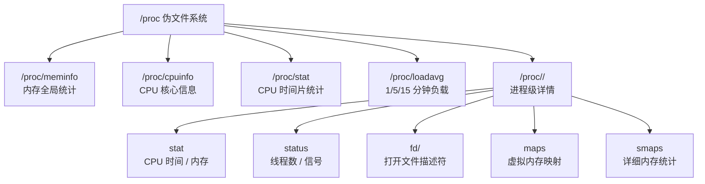
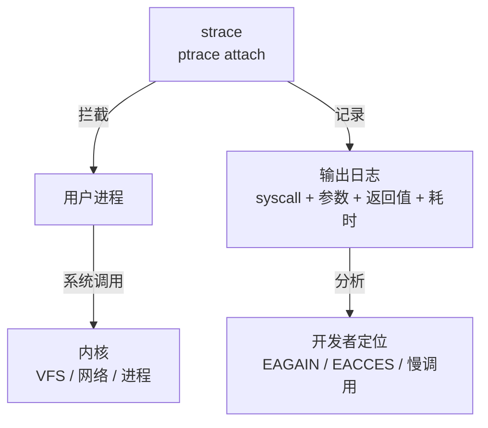

<span class="badge-i">[I]</span><span class="badge-e">[E]</span>

# 性能分析工具链入门

<span class="red">嵌入式系统资源受限，性能问题往往无法通过堆硬件解决。掌握系统级性能分析工具链，从进程级到系统级逐层定位瓶颈，是嵌入式工程师从调试迈向优化的分水岭。</span>

<br>

---

## 为什么需要性能分析

<span class="red">"感觉系统变慢了"是最糟糕的性能报告，没有量化数据就无法决策。性能分析的首要任务是建立可观测性，将延迟、吞吐量、资源占用转化为可度量的指标。</span>

### 性能维度矩阵

| 维度 | 指标 | 工具 | 关注点 |
|------|------|------|--------|
| CPU | 利用率、调度延迟、上下文切换 | top, perf, schedstat | 热点函数、调度公平性 |
| 内存 | RSS/VSS、缺页、OOM、碎片 | free, vmstat, /proc/meminfo | 泄漏、过度分配 |
| IO | IOPS、带宽、队列深度 | iostat, blktrace | 同步阻塞、DMA 效率 |
| 网络 | 吞吐、延迟、丢包 | ss, tcpdump, netstat | 缓冲区、拥塞控制 |
| 启动 | 内核解压到 init 执行时间 | dmesg, systemd-analyze | 关键路径 |

<span class="blue">关键结论：性能优化遵循"测量先行、热点优先、回归验证"三原则，未经基准测量的优化是伪优化。</span>

<br>

---

## procfs：内核的自述文件

<span class="red">/proc 是 Linux 内核向用户空间暴露运行时状态的核心接口，无需特殊权限即可读取大量系统级指标，是所有性能工具的底层数据源。</span>

### 关键 proc 节点速查



### 内存分析实战

```bash
# 解析 /proc/meminfo 理解内存去向
$ cat /proc/meminfo | grep -E "MemTotal|MemFree|MemAvailable|Buffers|Cached|Slab|SReclaimable|Shmem"
MemTotal:        2048000 kB
MemFree:          123456 kB
MemAvailable:     567890 kB
Buffers:           23456 kB
Cached:           345678 kB
Slab:              45678 kB
SReclaimable:      34567 kB
Shmem:             12345 kB
```

<span class="orange"><strong>MemAvailable 的意义</strong></span>：MemAvailable ≈ MemFree + Cached + Buffers - 不可回收部分，是评估系统真实可用内存的最佳指标，比 MemFree 更有意义。<br>

### 进程级分析

```bash
# 解析 /proc/<pid>/stat 的第 14/15/16 字段（utime, stime, cutime, cstime）
$ awk '{print "utime=" $14 " stime=" $15 " threads=" $20}' /proc/1/stat
utime=1234 stime=567 threads=45

# 统计某进程打开的文件描述符数量
$ ls /proc/<pid>/fd | wc -l
```

<span class="blue">关键结论：/proc 数据以 ASCII 文本暴露，解析开销极低，适合嵌入式系统的轻量化监控脚本直接读取。</span>

<br>

---

## top 与 htop：进程级实时概览

<span class="red">top 是所有 Unix 系统的标配，htop 是其交互增强版，两者都基于 /proc 轮询，提供 CPU、内存、进程状态的全局视图。</span>

### top 关键字段解读

| 字段 | 含义 | 异常信号 |
|------|------|---------|
| %CPU | 用户态 + 内核态 CPU 时间占比 | >80% 持续存在需排查热点 |
| %MEM | 物理内存 RSS 占比 | 持续攀升可能泄漏 |
| VIRT | 虚拟地址空间总量 | 过大不直接等于内存问题 |
| RES | 常驻内存 RSS | 实际物理内存占用 |
| SHR | 共享内存 | 包含库文件、匿名页 |
| S | 状态 (R/S/D/T/Z) | D=不可中断睡眠，可能 IO 阻塞 |
| TIME+ | 累计 CPU 时间 | 判断长期 CPU 消耗者 |

```bash
# top 批处理模式，采样 5 次，间隔 2 秒，输出到文件
$ top -b -n 5 -d 2 -p <pid> > top_report.txt

# 按 CPU 排序，只显示前 20
$ top -b -n 1 -o %CPU | head -n 30
```

### htop 增强功能

<span class="green">htop</span>提供树形视图、颜色编码的 CPU/内存条形图、进程筛选与信号发送，支持鼠标操作，是交互式排查的首选。<br>

```bash
# 在资源受限的嵌入式设备上编译 htop
$ ./configure --prefix=/usr --enable-unicode=no
$ make -j$(nproc)
$ make install
```

<span class="blue">关键结论：top/htop 适用于实时概览与粗略定位，精确到函数级的热点分析需要 perf 与火焰图工具。</span>

<br>

---

## strace：系统调用追踪

<span class="red">strace 通过 ptrace 机制拦截进程的系统调用与信号，是定位用户态程序与内核交互问题的利器，特别适合分析文件操作、网络连接、进程创建的异常行为。</span>

### strace 工作模型



### 常用模式

```bash
# 追踪指定进程的每个系统调用
$ strace -p <pid>

# 追踪并统计各系统调用的耗时与次数
$ strace -c -p <pid>
% time     seconds  usecs/call     calls    errors syscall
------ ----------- ----------- --------- --------- ----------------
 45.23    0.123456        1234       100           read
 30.12    0.082345        2058        40           openat
 15.67    0.042789        1069        40           close

# 只追踪文件相关调用，显示完整路径
$ strace -e trace=file -yy -p <pid>

# 追踪子进程（fork/clone 后自动 attach）
$ strace -f -o trace.log ./my_program
```

<span class="orange"><strong>开销警告</strong></span>：strace 通过 ptrace 逐条拦截，对目标进程有显著性能影响（可能降低 50% 以上吞吐量），生产环境谨慎使用，优先离线分析。<br>

<span class="blue">关键结论：strace 最擅长回答"程序卡在哪里"——若 strace 输出停滞在某系统调用，该调用即为阻塞点。</span>

<br>

---

## ltrace：库函数追踪

<span class="red">ltrace 与 strace 类似，但拦截的是动态链接库函数调用而非系统调用，适合分析第三方库的行为、内存分配模式与锁竞争。</span>

### ltrace 使用示例

```bash
# 追踪所有库函数调用
$ ltrace -f -o ltrace.log ./my_program

# 只追踪 malloc / free，统计次数
$ ltrace -e malloc+free -c ./my_program

# 追踪 pthread 锁操作
$ ltrace -e pthread_mutex_lock+pthread_mutex_unlock ./my_program
```

| 场景 | strace | ltrace | 选择建议 |
|------|--------|--------|---------|
| 程序无响应 | 看系统调用阻塞点 | 看库函数循环 | 先 strace |
| 内存泄漏 | 看 brk/mmap | 看 malloc/free | 先 ltrace |
| IO 性能差 | 看 read/write 耗时 | 看 fread/fwrite 缓冲 | 两者结合 |
| 启动慢 | 看文件加载顺序 | 看库初始化 | 两者结合 |

<span class="blue">关键结论：strace 与 ltrace 是互补工具，前者透视内核边界，后者透视库边界，组合使用可完整追踪从用户代码到硬件的数据流。</span>

<br>

---

## 历史演进

Linux 性能工具的发展与内核演进紧密耦合。1991 年 Linux 0.01 发布时，唯一的性能观测手段是 `ps` 命令与 `/proc` 目录下寥寥几个文件。1996 年 procfs 正式标准化，`/proc/stat`、`/proc/meminfo` 等节点成为系统监控的事实标准。1998 年 `strace` 从 SunOS 移植到 Linux，填补了系统调用追踪的空白。2003 年 `htop` 作为 top 的交互式替代品出现，Hisham Muhammad 用 ncurses 实现了彩色进程树。2008 年 `perf` 随 Linux 2.6.31 合入主线，标志着 Linux 性能分析进入硬件 PMU（Performance Monitoring Unit）时代。2010 年后，Brendan Gregg 将 DTrace 的方法论迁移到 Linux，推广了火焰图（Flame Graph）可视化范式，彻底改变了性能分析的工作流程——从阅读日志到看图定位。2015 年至今，BPF/eBPF 技术的成熟催生了新一代工具（BCC、bpftrace），允许在内核中安全执行自定义探针，将开销从毫秒级降到微秒级。

<br>

---

## 本章小结

| 要点 | 内容 |
|------|------|
| procfs | /proc/meminfo、/proc/stat、/proc/<pid>/* 是性能数据的底层来源 |
| top/htop | 实时进程级概览，htop 提供树形视图与交互筛选 |
| strace | ptrace 拦截系统调用，定位阻塞点与异常返回码 |
| ltrace | 拦截动态库函数，分析内存分配与库行为 |
| 使用原则 | 测量先行，strace/ltrace 有 ptrace 开销，生产环境谨慎 |

## 练习

1. 编写一个 Shell 脚本，从 /proc/<pid>/stat 提取进程的 utime、stime、rss 字段，计算该进程从上次采样到当前的 CPU 使用率与内存变化量。
2. 某程序运行缓慢，strace 显示大量 `nanosleep({tv_sec=0, tv_nsec=10000000}, NULL)` 调用，这说明了什么问题？进一步应使用什么工具确认根因？
3. 对比 strace 与 ltrace 的实现机制差异：ptrace 拦截的是进入内核前的哪个阶段？为什么 ltrace 需要 PLT 插桩而 strace 不需要？
