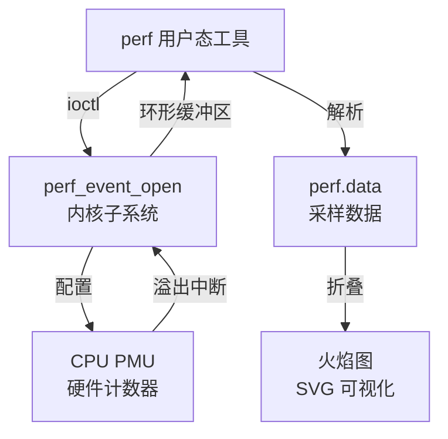
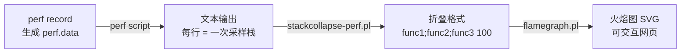

<span class="badge-i">[I]</span><span class="badge-e">[E]</span>

# perf 火焰图与热点分析

<span class="red">当系统变慢时，"哪个函数消耗了最多 CPU 时间"是最核心的诊断问题。perf 利用 CPU 硬件 PMU 以极低开销采样指令地址，结合火焰图可视化，可将性能热点从百万行代码中精准定位到具体函数甚至代码行。</span>

<br>

---

<span class="red">为什么本章内容对嵌入式开发至关重要？</span><br>
本节聚焦的议题，是嵌入式应用从"能跑"到"跑得稳"的关键跃迁。<br>
理解其背后的设计动机，才能在选型时做出正确决策。


## perf 事件与 PMU 基础

<span class="red">perf 是 Linux 内核内置的性能分析框架，直接操作 CPU 的 Performance Monitoring Unit，以硬件计数器方式统计指令执行、缓存命中、分支预测等微架构事件，开销远低于软件插桩。</span>

### PMU 事件分类

| 事件类型 | 典型事件 | 分析目标 |
|---------|---------|---------|
| 通用硬件 | cycles, instructions, cache-references, cache-misses | CPU 利用率、CPI |
| 缓存 | L1-dcache-loads, LLC-load-misses | 数据局部性、缓存压力 |
| 分支 | branch-instructions, branch-misses | 预测失败惩罚 |
| 总线 | bus-cycles, bus-lock:u | 锁竞争、总线争用 |
| 软件 | context-switches, page-faults | 调度开销、内存映射 |
| 追踪点 | tracepoint:sched:*, tracepoint:syscalls:* | 内核行为分析 |



### 基础采样命令

```bash
# 全局采样：记录 30 秒内的 CPU 周期事件
$ perf record -a -g -- sleep 30

# 针对单个进程采样
$ perf record -g -p <pid> -- sleep 30

# 查看采样结果摘要
$ perf report --stdio

# 只显示占比最高的 20 个函数
$ perf report --stdio | head -n 30
```

<span class="green">性能监控中断（PMI）</span>：PMU 计数器溢出时触发 NMI 或 PMI，perf 在内核中断上下文快速保存当前指令指针（IP）与调用栈，然后恢复执行，单次采样开销约 1-5μs。<br>

<span class="blue">关键结论：perf 的采样频率默认由内核自适应调节（`-F` 或 `perf_event_max_sample_rate`），过高频率会导致采样本身成为瓶颈，一般保持在 1000-4000Hz。</span>

<br>

---

## 调用栈采集与 -g 选项

<span class="red">仅知道热点函数名往往不够，火焰图的核心价值在于展示调用关系——一个慢函数是被谁调用的、调用了多少次，这些信息决定了优化策略。</span>

### 调用栈回溯机制

| 机制 | 原理 | 精度 | 开销 |
|------|------|------|------|
| frame pointer | 编译器保留 %rbp 链 | 高 | 寄存器占用 |
| DWARF unwind | 解析 .eh_frame 段 | 中 | 较高 |
| LBR (Last Branch Record) | 硬件记录最近分支 | 高 | 硬件支持 |
| ORC (x86_64) | 内核专用 unwind 表 | 高 | 低 |

```bash
# 编译时保留 frame pointer（GCC）
$ gcc -fno-omit-frame-pointer -O2 -o program program.c

# 检查二进制是否包含 frame pointer
$ readelf -s program | grep __libc_start_main

# perf 强制使用 DWARF 回溯（当 frame pointer 缺失时）
$ perf record -g --call-graph=dwarf -a -- sleep 30

# 限制 DWARF 回溯深度，减少开销
$ perf record -g --call-graph=dwarf,4096 -a -- sleep 30
```

### 内核调用栈

```bash
# 同时采集用户态与内核态调用栈
$ perf record -a -g --kernel-call-graph=lbr -- sleep 30

# 查看内核热点
$ perf report -g --kallsyms
```

<span class="orange"><strong>frame pointer 争议</strong></span>：GCC 默认 `-fomit-frame-pointer` 可释放一个寄存器提升性能，但导致调用栈回溯困难。性能分析场景建议保留，或依赖 DWARF/ORC。<br>

<span class="blue">关键结论：嵌入式系统常使用 musl libc 与静态链接，DWARF unwind 信息可能被 strip 掉，保留 frame pointer 是最可靠的方案。</span>

<br>

---

## 火焰图生成原理

<span class="red">火焰图由 Brendan Gregg 于 2011 年发明，将成千上万的采样调用栈折叠成层次矩形图，横轴表示采样占比，纵轴表示调用深度，颜色仅用于区分不同函数。</span>

### 数据流水线



### 一键生成脚本

```bash
#!/bin/bash
# gen_flamegraph.sh — 生成火焰图

DURATION=${1:-30}
OUTPUT=${2:-flamegraph.svg}

# 1. 采样
perf record -a -g -F 997 -- sleep $DURATION

# 2. 解析
perf script > out.perf

# 3. 折叠（需火焰图工具套件）
/opt/FlameGraph/stackcollapse-perf.pl out.perf > out.folded

# 4. 生成 SVG
/opt/FlameGraph/flamegraph.pl out.folded > $OUTPUT

echo "火焰图已生成: $OUTPUT"
```

### 火焰图阅读方法

| 视觉特征 | 含义 | 行动 |
|---------|------|------|
| 宽横条 | 采样占比高，热点函数 | 优先优化 |
| 深纵轴 | 调用链深 | 检查是否过度封装 |
| 平顶 | 递归或循环调用 | 检查算法复杂度 |
| 相同宽度多层 | 多个调用路径汇聚 | 检查通用库函数 |
| 突然变宽 | 某个分支异常耗时 | 深入展开分析 |

<span class="blue">关键结论：火焰图是"寻找最宽的横条"——宽度直接对应 CPU 时间占比，优化最宽的函数收益最大。</span>

<br>

---

## 热点定位实战

<span class="red">火焰图给出热点函数后，需要进一步定位到具体代码行，perf annotate 与 addr2line 将指令地址映射回源代码。</span>

### 行级热点定位

```bash
# 查看某函数的反汇编与采样占比
$ perf annotate -M intel --dsos=libcrypto.so.1.1 --symbol=sha256_block_data_order

# 直接定位到源代码行（需编译时带 -g）
$ perf annotate --stdio | grep -A 5 -B 5 "my_hot_function"

# 使用 addr2line 手动解析
$ addr2line -e ./my_program -f -C 0x00012345
my_hot_function
/path/to/source.c:127
```

### 嵌入式交叉编译场景

```bash
# 在宿主机分析目标机的 perf.data
# 1. 目标机采样
$ perf record -a -g -- sleep 30
$ perf archive  # 打包依赖库

# 2. 复制到宿主机
$ scp perf.data perf.data.tar.bz2 host:/analysis/

# 3. 宿主机分析（需目标机的 vmlinux 与符号表）
$ perf report --symfs=/path/to/target/rootfs \
              --kallsyms=/path/to/target/proc/kallsyms
```

### 常见优化模式对照

| 火焰图特征 | 根因 | 优化方向 |
|-----------|------|---------|
| 宽条在 memcpy/memset | 大块数据拷贝 | DMA、零拷贝、缓存对齐 |
| 宽条在 malloc/free | 频繁堆分配 | 内存池、栈分配、预分配 |
| 宽条在锁函数 | 临界区竞争 | 无锁结构、细粒度锁、RCU |
| 宽条在系统调用 | 用户态内核态切换 | 批量 IO、vDSO、mmap |
| 宽条在浮点运算 | 软浮点或数据转换 | NEON/SIMD、定点化、硬件 FPU |

<span class="blue">关键结论：嵌入式系统常见热点不在算法本身，而在 memcpy、锁竞争与系统调用，火焰图能快速验证这一假设。</span>

<br>

---

## 历史演进

CPU 性能计数器的历史可追溯至 1990 年代的 Pentium Pro，Intel 率先引入硬件 PMU 用于芯片调试。2004 年 OProfile 作为 Linux 首个系统级性能分析工具出现，但配置复杂、支持架构有限。2008 年 Ingo Molnar 提交 `perf_counter` 补丁集，后更名为 `perf_event`，于 Linux 2.6.31 合入主线，统一了 x86、ARM、PowerPC 等架构的事件接口。2011 年 Brendan Gregg 在 Joyent 工作期间，将 Solaris DTrace 的 `plockstat` 可视化思想迁移到 Linux，用 Perl 脚本实现了首个火焰图生成器，一经发布便成为性能分析领域的标准工具。2014 年后，ARM Cortex-A 系列全面支持 PMUv3，涵盖 L1/L2 缓存、TLB、分支预测等 50+ 事件，使 perf 在嵌入式 ARM SoC 上同样强大。2018 年至今，Rust、Go 等语言的火焰图工具链成熟，`pprof`、`cargo-flamegraph` 等工具将火焰图生成集成到构建流程中。

<br>

---

## 本章小结

| 要点 | 内容 |
|------|------|
| PMU 事件 | cycles、instructions、cache-misses 等硬件计数器 |
| perf record | 采样模式，`-g` 采集调用栈，`--call-graph=dwarf` 无 frame pointer |
| 火焰图 | stackcollapse + flamegraph.pl 流水线，横轴占比、纵轴调用深度 |
| annotate | 指令级/行级热点定位，交叉编译场景需符号表 |
| 优化模式 | memcpy→DMA、malloc→池化、锁→无锁、syscall→批量 |

## 练习

1. 某函数在火焰图中呈宽平顶状，但其自身代码非常简单，仅循环调用另一个函数，这说明了什么？如何利用火焰图判断是"被调用次数多"还是"单次执行慢"？
2. 在 ARM Cortex-A53 上运行 `perf record`，提示 "PMU not available"，可能的原因有哪些？如何验证 PMU 是否被内核启用？
3. 设计一个自动化脚本，在 CI 流水线中对基准测试采集火焰图，若某函数 CPU 占比超过阈值则告警，写出核心比较逻辑与报告格式。
