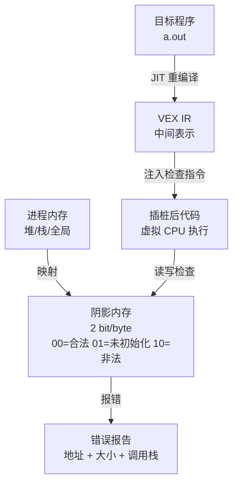

<span class="badge-i">[I]</span><span class="badge-e">[E]</span>

# Valgrind 与内存诊断

<span class="red">内存错误是嵌入式系统最隐蔽的故障来源之一，野指针访问、内存泄漏、未初始化变量可能在运行数小时甚至数天后才暴露。Valgrind 通过动态二进制插桩构建虚拟执行环境，在不修改源码的情况下检测几乎所有内存错误类别，是 C/C++ 程序的内存健康检查标准工具。</span>

<br>

---

## Valgrind 架构与原理

<span class="red">Valgrind 不是传统意义上的调试器，它通过 JIT 动态重编译目标程序的二进制指令，在虚拟 CPU 上执行，同时维护精确的内存状态阴影（Shadow Memory），追踪每字节内存的合法性与初始化状态。</span>

### 阴影内存模型



### 核心工具集

| 工具 | 功能 | 场景 | 典型开销 |
|------|------|------|---------|
| Memcheck | 内存错误检测（野指针、泄漏、越界） | 开发阶段 | 10-30x |
| Cachegrind | 缓存命中率与行级分析 | 缓存优化 | 10x |
| Callgrind | 函数调用图与代价分析 | 热点定位 | 20x |
| Massif | 堆内存使用曲线与峰值分析 | 内存预算 | 20x |
| Helgrind | 线程竞争与锁顺序检测 | 并发调试 | 30x |
| DRD | 线程错误检测（比 Helgrind 轻量） | 并发调试 | 10x |

<span class="blue">关键结论：Valgrind 的运行时开销极大（10-30 倍减速），仅用于离线测试与回归验证，不可用于生产环境实时监控。</span>

<br>

---

## Memcheck：内存错误检测

<span class="red">Memcheck 是 Valgrind 最经典的工具，它能检测使用未初始化内存、非法读写、双重释放、内存泄漏等错误，并将错误与源代码行精确关联。</span>

### 错误类别与检测能力

| 错误类型 | Memcheck 输出示例 | 严重程度 |
|---------|------------------|---------|
| 非法读写 | Invalid read of size 4 | 致命 |
| 未初始化值 | Conditional jump depends on uninitialised value | 严重 |
| 双重释放 | Invalid free() / double free | 致命 |
| 内存泄漏 | definitely lost: 1,024 bytes in 1 blocks | 严重 |
| 重叠拷贝 | Source and destination overlap in memcpy | 严重 |
| 系统调用传参错误 | Syscall param write(buf) points to uninitialised byte(s) | 严重 |

### 使用示例

```bash
# 基本检测命令
$ valgrind --tool=memcheck --leak-check=full --show-leak-kinds=all \
           --track-origins=yes ./my_program

# 只检测堆错误，忽略栈越界（加快速度）
$ valgrind --tool=memcheck --leak-check=summary ./my_program

# 生成 XML 报告供 CI 解析
$ valgrind --tool=memcheck --xml=yes --xml-file=valgrind.xml ./my_program
```

### 泄漏分类解读

```
==12345== LEAK SUMMARY:
==12345==    definitely lost: 1,024 bytes in 1 blocks      # 确认泄漏：指针完全丢失
==12345==    indirectly lost: 512 bytes in 2 blocks        # 间接泄漏：仅通过已泄漏块可达
==12345==      possibly lost: 256 bytes in 1 blocks        # 可能泄漏：指针指向块内部而非头部
==12345==    still reachable: 1,280 bytes in 10 blocks     # 可达未释放：程序结束前未 free
==12345==         suppressed: 0 bytes in 0 blocks            # 已抑制：符合抑制规则的不报
```

<span class="orange"><strong>track-origins</strong></span>：`--track-origins=yes` 会追踪未初始化值的传播路径，精确报告"这个值是从哪个变量开始未初始化的"，定位代价增加约 20%。<br>

<span class="blue">关键结论：`definitely lost` 必须清零，`still reachable` 在程序退出时通常无害但反映资源管理缺陷，`possibly lost` 需要人工审查指针偏移是否合法。</span>

<br>

---

## Cachegrind：缓存行为分析

<span class="red">现代 CPU 的性能高度依赖缓存层次结构，Cachegrind 模拟 L1i/L1d/L2/L3 缓存的行为，报告指令与数据的缓存命中率，指导代码布局与数据访问模式优化。</span>

### 缓存模拟参数

| 参数 | 默认值 | 含义 |
|------|--------|------|
| --I1 | 32768,8,64 | L1 指令缓存：32KB、8路、64B 行 |
| --D1 | 32768,8,64 | L1 数据缓存：32KB、8路、64B 行 |
| --LL | 8388608,16,64 | 末级缓存：8MB、16路、64B 行 |

### 运行与解析

```bash
# 模拟目标 SoC 的缓存配置
$ valgrind --tool=cachegrind \
           --I1=32768,8,64 --D1=32768,8,64 --LL=2097152,16,64 \
           ./my_program

# 查看结果
$ cg_annotate cachegrind.out.<pid>
```

### 输出解读

```
--------------------------------------------------------------------------------
Ir          I1mr         ILmr         Dr          D1mr        DLmr         <-- 事件类型
--------------------------------------------------------------------------------
4,567,890   123,456      45,678       2,345,678   234,567     89,012       <-- 总次数
--------------------------------------------------------------------------------
# 每函数详细分解
my_function
  456,789   12,345       4,567        234,567     23,456      8,901
  .         .            .            .           .           .
  1         .            .            .           .            .            <-- 行级注释
```

| 缩写 | 全称 | 优化含义 |
|------|------|---------|
| Ir | Instruction read | 总指令数 |
| I1mr | L1 instruction miss | L1 指令缓存未命中 |
| ILmr | LL instruction miss | 末级指令缓存未命中 |
| Dr | Data read | 数据读取次数 |
| D1mr | L1 data read miss | L1 数据读取未命中 |
| DLmr | LL data read miss | 末级数据读取未命中 |

<span class="blue">关键结论：L1 未命中惩罚约 10-20 周期，LL 未命中可达 100+ 周期，优化顺序应为 DLmr > ILmr > D1mr > I1mr。</span>

<br>

---

## Massif：堆内存分析

<span class="red">嵌入式系统的 RAM 往往只有几十到几百 MB，堆内存峰值直接决定系统能否稳定运行。Massif 记录程序生命周期中的堆内存使用曲线，精确到分配站点的峰值与快照。</span>

### 使用模式

```bash
# 采集堆内存使用曲线
$ valgrind --tool=massif --time-unit=B ./my_program

# 只看峰值快照
$ valgrind --tool=massif --peak-inaccuracy=0.0 ./my_program

# 分析结果
$ ms_print massif.out.<pid>
```

### 输出解读

```
--------------------------------------------------------------------------------
  n        time(B)         total(B)   useful-heap(B) extra-heap(B)   stacks(B)
--------------------------------------------------------------------------------
  0              0                0                0             0           0
  1        100,000          100,000           90,000        10,000           0
  2        500,000          500,000          480,000        20,000           0
  3      1,000,000          800,000          750,000        50,000           0   # 峰值
  4      2,000,000          600,000          550,000        50,000           0
```

| 列 | 含义 | 关注点 |
|----|------|--------|
| time(B) | 已分配字节数（分配序号） | 线性增长表示持续分配 |
| total(B) | 当前堆内存总量 | 峰值决定最小 RAM 需求 |
| useful-heap(B) | 用户请求的总大小 | 与 total 的差为碎片 |
| extra-heap(B) | 分配器元数据开销 | 过大的分配器粒度 |
| stacks(B) | 栈内存（可选追踪） | 递归深度、大局部变量 |

<span class="orange"><strong>嵌入式适配</strong></span>：交叉编译的 Valgrind 需要为目标架构构建，`--pages-as-heap=yes` 选项可将页级分配纳入统计，适合分析 mmap 大户。<br>

<span class="blue">关键结论：Massif 的峰值数据是嵌入式内存预算的核心输入，建议在 CI 中自动化对比各版本的峰值变化，防止回归。</span>

<br>

---

## 嵌入式场景与替代方案

<span class="red">Valgrind 的重量级特性使其难以直接在资源受限的嵌入式目标机上运行，交叉编译 Valgrind 或使用轻量级替代工具是常见策略。</span>

### 交叉编译 Valgrind

```bash
# 配置交叉编译
$ ./configure --host=arm-linux-gnueabihf \
              --prefix=/opt/valgrind-arm \
              CC=arm-linux-gnueabihf-gcc
$ make -j$(nproc)
$ make install

# 部署到目标机
$ rsync -av /opt/valgrind-arm/ root@target:/usr/local/
```

### 轻量级替代工具

| 工具 | 功能 | 开销 | 适用场景 |
|------|------|------|---------|
| ASan (AddressSanitizer) | 内存错误检测 | 2-3x | 开发阶段编译时启用 |
| UBSan | 未定义行为检测 | 1.2x | 整数溢出、对齐错误 |
| MSan | 未初始化内存检测 | 3x | 替代 Memcheck 的未初始化追踪 |
| dmalloc | 调试 malloc | 中等 | 替换 glibc malloc，检测泄漏 |
| mtrace | glibc 内置追踪 | 低 | 简单泄漏检测，无符号 |

```bash
# GCC 编译时启用 ASan
$ gcc -fsanitize=address -fno-omit-frame-pointer -g -o program program.c

# 运行后自动生成详细报告
$ ./program
==ERROR: AddressSanitizer: heap-buffer-overflow on address 0x... 
```

<span class="blue">关键结论：ASan 已成为现代 C/C++ 项目的标配，编译时开启 `-fsanitize=address` 即可在几乎不改变工作流的情况下获得接近 Valgrind Memcheck 的检测能力，且开销更低。</span>

<br>

---

## 历史演进

Valgrind 最初由 Julian Seward 于 2000 年在英国剑桥大学开发，名称源自北欧神话中英灵殿的入口"Valhalla"。首个工具 Memcheck 于 2002 年随 Valgrind 1.0 发布，迅速成为 Linux C/C++ 开发的标配。2005 年 Nicholas Nethercote 主导重写核心引擎，引入 VEX IR 中间表示，大幅提升了工具的可扩展性，Cachegrind、Callgrind、Massif 等工具陆续加入。2007 年 Valgrind 3.3 支持 AMD64，2010 年支持 ARMv7，使嵌入式 ARM Linux 也能使用。2011 年 Google 推出 AddressSanitizer（ASan），基于编译器插桩而非二进制重编译，以更低开销实现类似功能，对 Valgrind 形成有力补充。2013 年 LLVM/Clang 全面支持 ASan/MSan/UBSan，使内存检测成为编译器基础设施而非独立工具。2018 年至今，Valgrind 持续更新，支持 ARM64、RISC-V 等新架构，同时 ASan 与 Valgrind 形成互补：前者用于开发快速迭代，后者用于深度离线验证。

<br>

---

## 本章小结

| 要点 | 内容 |
|------|------|
| Memcheck | 检测非法读写、双重释放、泄漏、未初始化值 |
| Cachegrind | 模拟 L1/L2/L3 缓存，报告命中率与未命中次数 |
| Massif | 堆内存使用曲线与峰值分析，指导内存预算 |
| 泄漏分类 | definitely lost > possibly lost > still reachable |
| 替代方案 | ASan 编译时启用，开销更低，适合嵌入式交叉编译 |
| 使用原则 | 离线验证与 CI 回归，不用于生产实时监控 |

## 练习

1. Memcheck 报告 "Conditional jump depends on uninitialised value"，但程序运行结果似乎正确，为什么这仍然是严重错误？在什么条件下会导致不可预测行为？
2. Cachegrind 的 `D1mr` 很高但 `DLmr` 很低，这说明了什么？应优先优化数据布局还是访问模式？
3. 比较 ASan 与 Valgrind Memcheck 的实现机制差异：一个基于编译器插桩，一个基于 JIT 重编译，两者在检测精度、运行开销、平台支持上各有何优劣？
