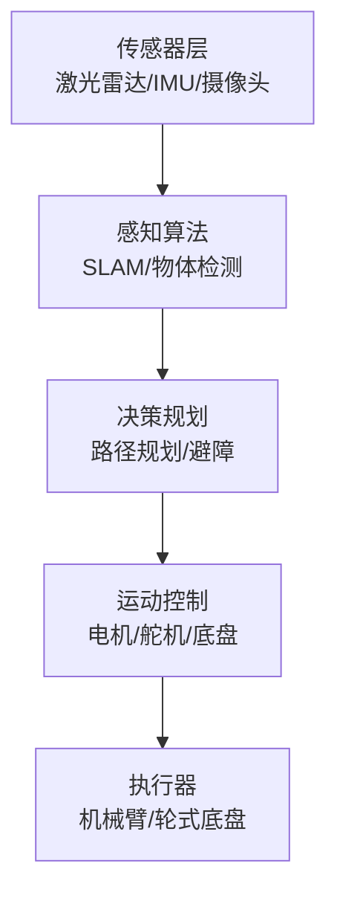

# 机器人专题

> 📊 **本章难度等级：** <span class="badge-i">**中级 (Intermediate)**</span>

---

### <strong>在嵌入式 Linux 的应用层生态中，ROS（Robot Operating System，机器人操作系统）是一个极易被误解的存在 
—— 很多初学者会因 “Operating System” 的命名，将其与 Linux、RTOS 等操作系统混为一谈，但实际上，ROS 并非独立的操作系统，而是运行在 Linux 应用层之上，专为机器人开发设计的分布式协同框架。</strong>


### <strong>1. 并非 “操作系统”，而是 “应用层框架”</strong>

操作系统的核心职责是管理硬件资源（CPU、内存、外设）、提供系统调用接口（如进程调度、内存分配、驱动管理），
而ROS完全不具备这些底层能力——它的所有运行都依赖Linux的底层支撑：
- ROS的“节点（Node）”本质是Linux进程（每个节点对应一个独立PID），节点的创建、启动、终止都通过Linux的进程管理机制实现；
- ROS的通信、数据存储等操作，最终都要调用Linux的系统调用（如Socket通信、文件I/O）；
- ROS本身不包含任何硬件驱动，访问传感器（摄像头、激光雷达）、执行器（电机）时，必须依赖Linux已适配的硬件驱动（如V4L2摄像头驱动、CAN总线驱动、USB驱动）。

简单说，Linux是“地基”，提供底层资源管理与硬件访问能力；ROS是“机器人专用的上层建筑”，在地基之上封装了机器人开发所需的协同逻辑、标准化接口和工具链，避免开发者重复编写“模块通信”“数据交互”等通用代码。<br>

### <strong>2. 核心关键词：“分布式”与“协同”</strong>

机器人的工作逻辑天然需要“多模块协作”：
比如一台自主避障小车，需要激光雷达采集环境数据、摄像头识别障碍物、IMU（惯性测量单元）提供姿态信息、算法模块做路径规划、电机执行运动指令
——这些模块可能是独立的硬件（如激光雷达是USB外设）、独立的进程（如路径规划是单独的算法程序），甚至分布在不同的设备上（如算法模块运行在Jetson Nano，电机控制模块运行在STM32MP1）。

ROS的核心价值正是解决这种“分布式多模块”的协同问题，其“分布式协同”的特征体现在两个层面：
- 跨进程/跨设备通信：无需开发者关注底层通信细节（如Socket、共享内存），ROS通过封装的“话题（Topic）”“服务（Service）”等机制，让不同模块（进程/设备）像“打电话”“发消息”一样简单交互；
- 模块解耦：每个功能模块（如传感器采集、算法处理、执行控制）都可封装为独立的ROS节点，节点间通过标准化接口通信，修改一个模块不会影响其他模块（比如替换激光雷达品牌，只需修改雷达数据发布节点，路径规划节点无需改动）。<br>

### <strong>3. 适配场景：专为机器人开发设计，而非通用应用</strong>

=_xlfn.DISPIMG("ID_3838EEAEA3864D81A1DFFA7A84D5FAA8",1)<br>
Linux应用层有很多通用框架（如Qt用于GUI开发、Boost用于C++功能扩展），但ROS的所有设计都围绕机器人的专属需求：
- 支持高并发的数据流传输（如激光雷达每秒输出数十万点云数据、摄像头每秒输出30帧图像）；
- 提供实时性适配能力（ROS 2通过DDS中间件优化通信延迟，适配电机控制等准实时场景）；
- 内置机器人专用工具链（如RViz可视化传感器数据、rosbag录制回放测试数据、rqt调试节点状态）；
- 生态化的功能包（如Nav2用于路径规划、Cartographer用于SLAM建图、MoveIt用于机械臂运动控制），覆盖机器人开发的核心场景。<br>

### <strong>从上图可以清晰看出，ROS处于Linux应用层的“专用框架”分支，向上对接机器人的具体功能模块，向下完全依赖Linux提供的底层能力，
既不是独立的操作系统，也不是通用的应用程序，而是聚焦机器人多模块分布式协同的“专业化工具集与规则体系”。
这种定位决定了ROS的核心边界：它不负责底层硬件控制、不参与系统资源调度，只专注于“让机器人的各个模块高效、可靠地协同工作”，
这也是它与嵌入式Linux知识体系中其他应用层技术（如网络编程、多线程开发）的核心区别——后者是通用技术，前者是基于通用技术封装的“机器人专属解决方案”。</strong>


### <strong>机器人开发的核心痛点，本质是“多模块的协同复杂度”——一台功能完整的机器人，往往包含传感器（摄像头、激光雷达、IMU）、算法模块（路径规划、目标识别、SLAM建图）、执行器（电机、舵机）、交互模块（显示屏、遥控器）等数十个功能单元，
这些单元可能是独立硬件、独立进程，甚至分布在不同设备上。没有统一框架时，开发会陷入三大困境：  
1. 接口混乱：不同传感器/模块的数据流格式、控制指令不统一（如A品牌激光雷达输出二进制流，B品牌输出JSON），需重复编写适配代码；  
2. 模块耦合：算法模块与传感器直接绑定（如路径规划代码硬编码激光雷达数据读取逻辑），替换传感器需重构算法；  
3. 通信复杂：跨进程/跨设备通信需手动实现Socket、共享内存等底层逻辑，还需处理数据丢包、同步等问题，开发效率极低。</strong>


### <strong>ROS的核心价值，正是通过“多模块解耦”“跨场景通信”“标准化接口”三大设计，彻底解决这些痛点，让开发者聚焦核心业务（如算法优化、功能创新），而非重复造轮子。</strong>


### <strong>1. 多模块解耦：让每个功能单元“独立工作、按需协作”</strong>

ROS的“节点（Node）”设计是解耦的核心
——每个功能模块（如传感器采集、算法处理、电机控制）都被封装为独立的ROS节点，节点间不直接关联，仅通过统一的通信机制交互。
这种设计带来两个关键优势：<br>

### <strong>2. 跨进程/跨设备通信：简化协同逻辑，屏蔽底层复杂度</strong>

机器人的多模块协同，本质是“数据流转”（如传感器数据→算法模块→执行器指令），ROS封装了三种核心通信机制，覆盖所有协同场景，且完全屏蔽Socket、共享内存等底层实现：

| 通信机制       | 核心场景                               | 特点                    | 嵌入式Linux底层依赖 |
|----------------|---------------------------------------|-------------------------|--------------------|
| 话题（Topic）  | 异步数据流传输（如传感器数据、图像） | 多对多通信，无返回值，实时性高 | Socket/UDP（ROS 2基于DDS） |
| 服务（Service）| 同步请求-响应（如查询电机状态、设置参数）| 一对一通信，有返回值，可靠性高 | Socket/TCP（ROS 2基于DDS
| 动作（Action） | 长时任务交互（如机器人导航、机械臂抓取） | 异步带反馈，支持取消任务 | DDS（ROS 2专属，适配复杂场景） |

以“激光雷达避障”的通信流程为例，无需手动编写任何底层通信代码：  
1. “lidar_node”通过“话题（/scan）”持续发布激光雷达点云数据；  
2. “planning_node”订阅“/scan”话题，接收数据后运行避障算法，通过“服务（/set_motor_speed）”向“motor_node”发送速度指令；  
3. “motor_node”作为服务端，接收指令后驱动电机，并通过服务响应返回执行结果（如“指令已执行”“电机故障”）；  
4. 若需导航到指定位置，“planning_node”通过“动作（/navigate_to_pose）”发送导航目标，实时接收导航进度反馈。<br>

### <strong>3. 标准化接口：统一“数据语言”，实现模块无缝对接
没有标准化接口时，不同模块的交互如同“鸡同鸭讲”
传感器输出的是原始二进制流，算法模块需要结构化数据，执行器需要特定格式的控制指令，开发者需编写大量“数据转换适配层”代码</strong>

ROS通过“Msg/Srv/Action”三种标准化数据格式，为所有模块定义了统一的“通信语言”：<br>

### <strong>4. 场景验证：ROS核心价值的实战落地</strong>

以“嵌入式Linux环境下的智能家居机器人”为例，直观感受ROS的价值：  
- 硬件组成：STM32MP1（运行嵌入式Linux+ROS 2）、DHT11温湿度传感器、USB摄像头、差速电机、ESP8266 WIFI模块；  
- 模块划分：`sensor_node`（采集温湿度+图像）、`ai_node`（目标识别）、`control_node`（运动控制）、`mqtt_node`（数据上传云端）；  
- 协同逻辑：  
  1. `sensor_node`通过Linux I2C驱动读取DHT11数据（Msg格式），通过V4L2驱动读取摄像头图像（标准`sensor_msgs/Image` Msg），分别发布到`/env_data`和`/image`话题；  
  2. `ai_node`订阅`/image`话题，运行YOLO目标识别，通过`/detect_result`话题发布识别结果；  
  3. `control_node`订阅`/env_data`和`/detect_result`，若检测到目标则通过`/set_motor_speed`服务控制电机移动；  
  4. `mqtt_node`订阅`/env_data`和`/detect_result`，通过Linux网络驱动上传到云端。  

整个开发过程中，开发者无需关注：  
- 传感器数据格式转换（ROS Msg统一）；  
- 跨模块通信的底层实现（ROS话题/服务封装）；  
- 硬件驱动的调用细节（依托Linux驱动+ROS封装）；  

只需专注于核心逻辑（如目标识别算法优化、运动控制策略），开发效率提升50%以上，且后续替换传感器（如DHT11换SHT30）、升级算法（如YOLO换SSD）时，仅需修改对应节点，不影响全局。<br>

### <strong>核心价值总结（流程图直观呈现）</strong>

=_xlfn.DISPIMG("ID_2E31AFEA34A44CA28629FA3270F09164",1)<br>
ROS的核心价值，本质是“为机器人开发建立一套统一的‘协同规则’”
——通过解耦让模块独立，通过通信让协同简单，通过标准化让对接无缝，最终让嵌入式Linux环境下的机器人开发，从“复杂的系统集成”转变为“高效的模块组合”，这也是它能成为机器人开发主流框架的核心原因。<br>

### <strong>ROS作为嵌入式Linux应用层的框架，自身不具备任何底层系统能力——从节点通信到硬件访问，从软件安装到分布式协同，每一项功能都必须“借力”嵌入式Linux的核心特性。
这种依赖关系不是简单的“运行在系统上”，而是深度绑定Linux的内核机制、工具链与硬件适配能力，本质是“ROS封装上层逻辑，Linux提供底层支撑”的协同模式。
下面从四大核心依赖维度，拆解ROS与嵌入式Linux的绑定逻辑，结合ROS实战场景让依赖关系更直观：</strong>


### <strong>1. 依赖内核IPC：支撑ROS节点间的通信核心
ROS的“分布式协同”本质是“Linux进程间通信（IPC）”的上层封装
——ROS的每个节点（Node）都是独立的Linux进程（拥有唯一PID），节点间的话题（Topic）、服务（Service）通信，最终都会转化为Linux内核的IPC调用，ROS仅提供统一的抽象接口，屏蔽底层实现细节。</strong>

（1）ROS 1的IPC依赖
ROS 1采用“集中式通信”架构，节点间通信需通过Master节点协调，底层依赖Linux的经典IPC机制：
- 话题通信（异步数据流）：默认使用“UDP Socket”（适合高并发、低延迟的传感器数据传输，如激光雷达点云）；
- 服务通信（同步请求响应）：默认使用“TCP Socket”（适合可靠传输，如电机状态查询）；
- 大文件/高频数据传输：可选“共享内存（Shared Memory）”（Linux内核提供的高效IPC，避免数据拷贝，适配图像、点云等大数据量场景）。<br>

### <strong>2. 依赖硬件驱动：打通ROS与物理世界的连接
ROS本身不包含任何硬件驱动程序，要访问传感器（摄像头、IMU）、执行器（电机、舵机）、外设（USB、CAN总线），必须依赖嵌入式Linux已适配的硬件驱动</strong>

Linux驱动为硬件提供标准化的用户态接口（如`/dev`设备文件），ROS通过调用这些接口实现硬件访问，形成“ROS节点→Linux驱动→硬件”的调用链。<br>

### <strong>3. 依赖包管理与工具链：保障ROS的安装与编译
ROS的生态化发展离不开嵌入式Linux的包管理系统与编译工具链，从ROS本身的安装，到第三方功能包的部署，再到自定义节点的编译，都依赖Linux提供的基础工具：</strong>

（1）包管理依赖
- ROS的安装：主流嵌入式Linux发行版（如Ubuntu 20.04/22.04、Debian）通过`apt`（Advanced Package Tool）包管理工具安装ROS核心组件与功能包，例如：
  ```bash
  # ROS 2 Humble安装命令（依托Ubuntu apt仓库）
  sudo apt install ros-humble-desktop ros-humble-ros-base
  # 安装激光雷达功能包（依托ROS的apt仓库）
  sudo apt install ros-humble-rplidar-ros
  ```
- 依赖解析：ROS功能包的依赖（如依赖Boost、OpenCV、Eigen库），通过`apt`自动下载安装，无需手动配置，而这些依赖库本身也是Linux生态的标准组件。<br>

### <strong>4. 依赖网络能力：实现ROS的分布式协同</strong>

ROS的“跨设备协同”（如Jetson Nano的算法节点与STM32MP1的控制节点通信），依赖嵌入式Linux的网络栈（TCP/IP协议栈）与网络硬件驱动（以太网、WiFi、CAN）：
- 以太网/WiFi通信：ROS节点通过Linux的Socket API实现跨设备数据传输，依赖Linux的网络接口配置（如`eth0`、`wlan0`）与WiFi驱动（如RTL8188CUS驱动）；
- 工业总线通信：ROS 2通过`ros2_canopen`功能包支持CAN总线通信，依赖Linux的CAN驱动（如STM32的bxCAN驱动、Linux内核的`can`子系统）；
- 网络配置依赖：跨设备通信需配置Linux的IP地址、子网掩码，ROS通过读取Linux的网络配置，实现节点发现与数据路由。<br>

### <strong>实战关联：双设备ROS 2节点通信</strong>

1. 设备A（Jetson Nano，IP：192.168.1.100）运行激光雷达节点，发布`/scan`话题；
2. 设备B（STM32MP1，IP：192.168.1.101）运行避障算法节点，订阅`/scan`话题；
3. 配置设备A的Linux网络：`sudo ifconfig eth0 192.168.1.100`；
4. 启动ROS 2节点时指定网络参数：`ros2 run rplidar_ros rplidar_node --ros-args -p use_sim_time:=false`；
5. 设备B即可通过Linux的TCP/IP网络，接收设备A的话题数据——无Linux网络支持，ROS的分布式协同无从谈起。<br>

### <strong>依赖关系总结（调用链流程图）</strong>

=_xlfn.DISPIMG("ID_3B1D756BF9774E7A92F3BFE3B3829723",1)<br>
从流程图可清晰看出：ROS所有核心功能的底层支撑，最终都指向嵌入式Linux的内核、系统层与硬件适配能力。
ROS的价值在于“封装机器人专用逻辑”，而嵌入式Linux的价值在于“提供稳定、标准化的底层能力”
——两者是“上层应用框架”与“底层支撑系统”的紧密绑定关系，脱离嵌入式Linux，ROS将失去运行基础；而没有ROS，嵌入式Linux在机器人场景的开发效率将大幅降低。<br>

### <strong>ROS 2并非ROS 1的简单升级，而是针对“分布式、实时性、嵌入式适配”三大痛点的重构设计</strong>

——两者的核心差异源于定位不同：ROS 1聚焦“桌面级单主机开发与教学”，ROS 2瞄准“工业级分布式部署与嵌入式场景落地”。
这种定位差异直接导致了架构、通信、资源占用等全维度的不同，也决定了嵌入式Linux场景下的选型逻辑。

下面先通过表格直观呈现核心差异，再针对嵌入式场景最关注的维度展开解析：

| 对比维度 | ROS 1 | ROS 2 | 嵌入式场景关键影响 |
|----------|-------|-------|--------------------|
| 核心架构 | 集中式（依赖Master节点） | 分布式（无Master，基于DDS） | ROS 1单点故障风险高，ROS 2支持多设备协同，适配机器人异构部署 |
| 实时性 | 软实时（依赖Linux原生IPC，延迟不稳定） | 准硬实时（DDS+Linux PREEMPT_RT，延迟μs~ms级） | ROS 2适配电机控制、急停等嵌入式实时场景 |
| 嵌入式适配 | 资源占用高，仅支持Linux，适配性差 | 资源可裁剪，支持Linux/Windows/QNX，适配STM32MP1等嵌入式Linux设备（含ROS 2 Micro适配MCU） | ROS 2更适合资源受限的嵌入式硬件 |
| 通信机制 | 自定义IPC（TCP/UDP/共享内存）+ Master协调 | 标准化DDS（数据分发服务） | DDS支持QoS（服务质量）配置，适配嵌入式复杂通信场景（如丢包重传、带宽控制） |
| 生态兼容 | 功能包丰富（如GMapping、MoveIt 1），无向后兼容 | 生态逐步完善（Nav2、MoveIt 2），不兼容ROS 1，但支持桥接 | 嵌入式新项目优先ROS 2，旧项目可通过桥接过渡 |
| 部署复杂度 | 单主机部署简单，分布式需配置SSH | 分布式部署原生支持，无需额外配置 | 嵌入式多模块（传感器/算法/控制）部署更高效 |<br>

### <strong>1. 核心架构：集中式 vs 分布式（嵌入式部署的关键差异）
ROS 1的“集中式架构”是其嵌入式场景落地的最大瓶颈，而ROS 2的“分布式架构”完美适配机器人多设备协同需求：</strong>

（1）ROS 1：Master节点为核心的“中枢依赖型”架构
- 工作逻辑：所有节点启动后必须向Master节点注册（上报自身提供的话题/服务），节点间通信需先通过Master获取目标节点的网络地址，再建立直接连接；
- 嵌入式场景痛点：
① 单点故障——Master节点崩溃会导致整个系统瘫痪，不适用于工业级嵌入式设备；
② 分布式部署复杂——多设备协同需配置SSH免密登录，且依赖网络稳定性，嵌入式场景（如工业机械臂、移动机器人）的网络环境往往复杂，易出现通信中断；
③ 资源占用高——Master节点需持续维护节点注册表，对资源受限的嵌入式硬件（如STM32MP1）不友好。<br>

### <strong>2. 实时性：软实时 vs 准硬实时（嵌入式控制场景的核心需求）
机器人嵌入式场景中，电机控制、急停响应、传感器数据同步等功能对实时性要求极高（通常需要μs~ms级延迟），
这正是ROS 1的短板和ROS 2的优化重点：</strong>

（1）ROS 1的实时性局限
- 底层依赖：ROS 1的通信基于Linux原生IPC（TCP/UDP），而Linux默认内核是“非实时内核”，进程调度延迟不稳定（可能出现10ms以上的延迟）；
- 嵌入式场景痛点：无法满足电机PID闭环控制、急停信号响应等硬实时需求，仅适用于传感器数据采集、算法仿真等非实时场景。<br>

### <strong>3. 嵌入式适配：资源占用与跨平台支持（硬件落地的关键）
ROS 1的设计未考虑嵌入式硬件的“资源受限”特性，而ROS 2从架构上进行了轻量化优化，
同时扩展了跨平台支持，更贴合嵌入式Linux场景：</strong>

（1）ROS 1的嵌入式适配短板
- 资源占用高：ROS 1核心组件（Master、节点管理器）占用大量CPU和内存，无法在STM32MP1等中低端嵌入式Linux设备上流畅运行；
- 跨平台支持差：仅支持Linux系统，无法与嵌入式场景中常用的RTOS（如FreeRTOS、RT-Thread）协同，也不支持MCU（如STM32F7）；
- 部署复杂：嵌入式Linux设备的存储、算力有限，ROS 1的功能包依赖繁琐，编译后体积大，不利于嵌入式部署。<br>

### <strong>4. 通信机制：自定义IPC vs 标准化DDS（嵌入式可靠性需求）</strong>

嵌入式场景对通信的“可靠性、稳定性、可配置性”要求远高于桌面场景，ROS 2的DDS通信机制相比ROS 1的自定义IPC更具优势：
- ROS 1：通信协议自定义，无统一的QoS配置，嵌入式场景中遇到网络丢包、带宽不足时，需手动编写容错代码，开发成本高；
- ROS 2：基于标准化DDS，支持10余种QoS策略（如 deadlines、liveliness、durability），可根据嵌入式场景需求灵活配置，例如：
  - 传感器数据传输：配置“volatile durability”（仅传输实时数据，不缓存历史数据），降低资源占用；
  - 电机控制指令：配置“transient local durability”（缓存最新指令，避免节点重启后无指令执行），提升稳定性。<br>

### <strong>5. 嵌入式场景选型建议（实战落地参考）</strong>

| 嵌入式场景类型 | 推荐选型 | 核心原因 |
|----------------|----------|----------|
| 教学/原型验证（如树莓派单主机小车） | ROS 1/ROS 2均可 | ROS 1部署简单、功能包丰富；ROS 2学习成本稍高，但可提前适配工程化需求 |
| 工业级机器人（如机械臂、AGV） | 优先ROS 2 | 分布式架构、实时性优化、可靠性高，符合工业嵌入式设备的稳定性要求 |
| 资源受限嵌入式设备（如STM32MP1、NXP i.MX6） | 强制ROS 2 | 轻量化可裁剪，资源占用低，支持交叉编译，适配嵌入式硬件限制 |
| 异构协同场景（如Jetson Nano+STM32H7） | 优先ROS 2 | 支持跨设备、跨平台通信，可通过DDS或ROS 2 Micro实现异构节点协同 |
| 旧ROS 1项目迁移 | ROS 2 + 桥接工具（ros1_bridge） | 无需重构全部代码，通过桥接实现ROS 1与ROS 2节点通信，平滑过渡 |

### <strong>差异核心总结</strong>

ROS 1与ROS 2的本质差异是“定位差异”
——ROS 1是“桌面级教学与单主机开发工具”，ROS 2是“工业级嵌入式与分布式落地框架”。
对嵌入式Linux开发者而言，ROS 2的核心价值在于：
① 解决了ROS 1的分布式、实时性、资源占用痛点；
② 深度适配嵌入式Linux的硬件特性（交叉编译、资源受限、异构协同）；
③ 提供标准化的通信与配置机制，降低嵌入式机器人的工程化落地成本。

随着ROS 2生态的逐步完善（如Nav2导航栈、MoveIt 2机械臂框架的成熟），嵌入式Linux场景下的机器人开发已逐步向ROS 2迁移，ROS 1仅在教学和旧项目维护中保留使用价值。<br>

### <strong>作为嵌入式Linux应用层的专用框架，ROS/ROS 2的入门门槛核心在于“环境搭建”——新手无需先深究底层原理，只需按步骤完成基础环境部署，运行第一个节点验证功能，即可建立初步认知。
本节聚焦最常用的“Ubuntu 20.04 + ROS 2 Humble”组合（嵌入式Linux场景最稳定的搭配），提供极简实操教程，同时明确后续深度学习的路径，衔接独立专题。</strong>


### <strong>1. 基础环境搭建：Ubuntu 20.04 + ROS 2 Humble（apt安装，新手首选）
ROS 2的安装方式有源码编译和apt安装两种，嵌入式场景中apt安装更简洁、不易出错，适合新手入门。
以下是完整操作步骤，所有命令均需在Ubuntu 20.04终端执行：</strong>

（1）系统准备：配置依赖与软件源
首先确保系统支持UTF-8编码，且允许安装第三方软件源：
```bash
# 1. 更新系统包索引
sudo apt update && sudo apt upgrade -y

# 2. 安装必要依赖（允许apt通过HTTPS访问软件源）
sudo apt install -y software-properties-common curl gnupg lsb-release

# 3. 添加ROS 2官方GPG密钥（验证软件包完整性）
curl -sSL https://raw.githubusercontent.com/ros/rosdistro/master/ros.key | sudo apt-key add -

# 4. 添加ROS 2软件源到系统（Humble对应Ubuntu 20.04，代号focal）
sudo sh -c 'echo "deb [arch=$(dpkg --print-architecture)] http://packages.ros.org/ros2/ubuntu $(lsb_release -cs) main" > /etc/apt/sources.list.d/ros2.list'
```<br>

### <strong>2. 延伸学习：独立专题《ROS/ROS 2 从原理到嵌入式实战》核心内容</strong>

本节的基础环境搭建仅为“入门第一步”，
若需深入掌握ROS/ROS 2在嵌入式Linux场景的实战能力（如传感器接入、电机控制、分布式部署），需通过独立专题系统学习。
独立专题将延续嵌入式Linux知识体系的“实战导向”，核心覆盖以下内容：
- 核心原理：深入解析ROS 2的节点、话题、服务、DDS通信底层机制，衔接嵌入式Linux的IPC、网络编程知识点；
- 嵌入式硬件适配：重点讲解ROS 2与嵌入式外设的交互（摄像头、激光雷达、电机、CAN总线），依托Linux驱动实现硬件接入；
- 实战场景：落地3个嵌入式专属项目（如“ROS 2+STM32MP1电机控制”“激光雷达避障小车”“ROS 2与RTOS异构协同”）；
- 工程化落地：涵盖ROS 2节点的交叉编译、嵌入式部署、自启动配置、性能优化（结合Linux perf工具）、故障排查；
- 高级方向：ROS 2实时性优化（PREEMPT_RT内核补丁）、ROS 2 Micro（MCU适配）、工业场景适配（CANopen协议）。<br>

### <strong>3. 分层学习路径建议（衔接嵌入式Linux知识体系）</strong>

- 新手路径（基础层）：先掌握本节的环境搭建+“节点通信”基础操作，再学习独立专题的“核心概念+传感器接入”，重点理解ROS 2与嵌入式Linux的依赖关系（如依托驱动访问硬件），无需急于深入底层原理；
- 中级路径（实战层）：结合嵌入式Linux的“IPC/网络编程/驱动开发”知识点，学习独立专题的“分布式部署+电机控制实战”，能独立完成“传感器数据→ROS 2节点→执行器控制”的完整流程；
- 高级路径（工程化层）：聚焦独立专题的“实时性优化+交叉编译+故障排查”，掌握ROS 2在工业嵌入式场景的落地技巧（如通信延迟优化、多设备协同稳定性），衔接嵌入式Linux的“性能剖析”“系统部署”章节。

### <strong>4. 前置知识要求（呼应嵌入式Linux知识体系）</strong>

学习独立专题前，建议先掌握嵌入式Linux知识体系的以下内容，避免学习断层：
- 应用层：多线程编程（理解ROS 2节点的进程/线程模型）、网络编程（理解DDS通信的底层逻辑）；
- 系统层：包管理（apt）、工具链（CMake/gcc）、系统初始化（systemd，后续用于ROS节点自启动）；
- 驱动层：基础硬件驱动认知（如V4L2摄像头驱动、CAN总线驱动，理解ROS 2如何调用硬件）。<br>

#



## <strong>入门与延伸总结</strong>

本节的核心目标是“让新手快速上手”
——通过10分钟左右的操作，完成ROS 2基础环境搭建，直观感受“节点通信”的核心功能，建立对ROS 2的初步认知。
而独立专题则是“从入门到精通”的系统延伸，聚焦嵌入式Linux场景的实战需求，避免“纯桌面ROS”的空洞讲解，让开发者既能理解“ROS 2如何依托Linux运行”，又能掌握“如何在嵌入式硬件上落地ROS 2项目”，最终形成“嵌入式Linux基础→ROS 2框架→机器人实战”的完整知识链。<br>

---


## 历史演进

<span class="red">嵌入式机器人技术</span>的演进，映射了控制理论、计算平台与传感器技术的协同发展。

上世纪 60 年代，Unimate 开启了工业机器人的先河，控制器基于专用硬件与固定逻辑。

80 年代，随着微处理器性能提升，机器人开始引入可编程控制器（PLC），运动控制从硬编码转向软件化。

2000 年代，嵌入式 Linux 进入机器人领域，ROS（Robot Operating System）于 2007 年发布，提供了标准化的进程间通信框架。

2010 年后，深度学习革命推动了感知层智能化，NVIDIA Jetson 系列将 GPU 算力带入嵌入式平台。

当前趋势是"云-边-端"协同：端侧负责实时控制，边缘侧负责 SLAM 与路径规划，云端负责大规模模型训练与地图更新。

