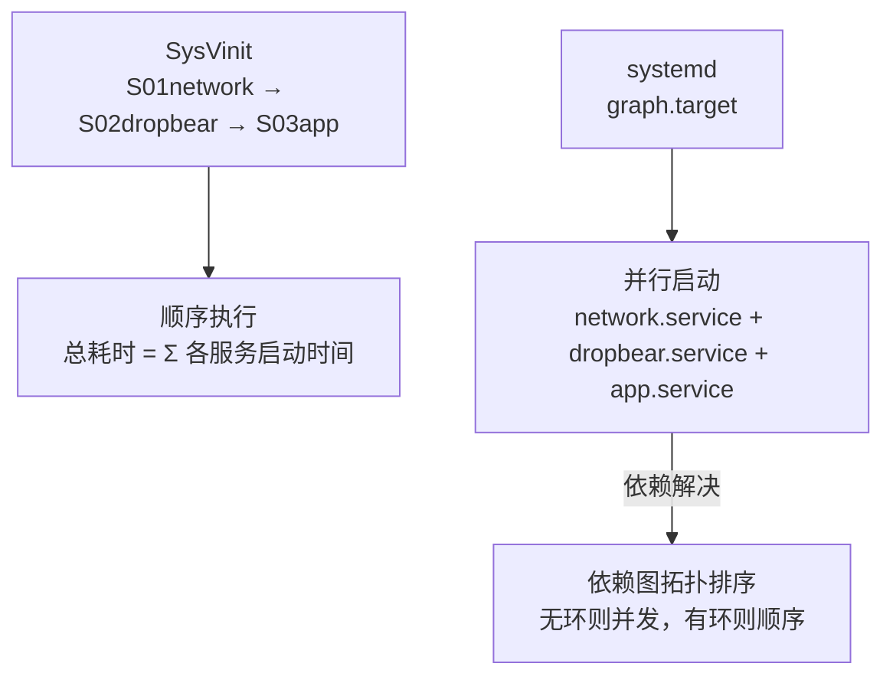
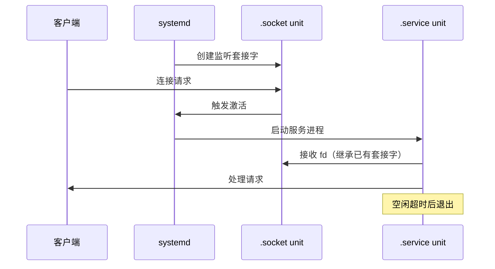

<span class="badge-i">[I]</span>

# systemd 守护进程管理

<span class="red">嵌入式 Linux 系统从传统的 SysVinit 或 BusyBox init 迁移到 systemd 已成为主流趋势。systemd 不仅接管进程启动顺序，还通过 unit 文件统一了服务、定时器、套接字、挂载点等系统资源的描述与管理，为嵌入式系统提供了声明式、依赖驱动的初始化框架。</span>

<br>

---

## 为什么需要 systemd

<span class="red">传统 init 脚本以顺序执行 Shell 脚本的方式启动服务，启动时间长、依赖关系隐式表达、故障恢复能力弱。systemd 将启动流程转化为依赖图，并行启动无依赖的服务，并通过 cgroup 实现严格的资源隔离。</span>

### SysVinit vs systemd 对比

| 维度 | SysVinit | systemd |
|------|----------|---------|
| 启动方式 | 顺序执行 /etc/init.d/Sxx* | 依赖图并行启动 |
| 依赖表达 | 数字前缀暗示顺序 | Unit 文件 `After=`/`Wants=` 显式声明 |
| 进程监控 | 无，需外部看门狗 | `Restart=` 自动重启策略 |
| 日志管理 | syslog/rsyslog | journald 结构化二进制日志 |
| 资源隔离 | 无 | cgroup 自动挂载，CPU/内存/IO 限制 |
| 启动时间 | 数十秒级 | 秒级（并行 + 按需启动） |
| 嵌入式适配 | BusyBox init 极简 | systemd 可裁剪（systemd-boot） |



<span class="blue">关键结论：启动时间是嵌入式产品用户体验的关键指标，systemd 的并行启动对 UI 优先的设备（如车载信息娱乐系统）收益显著。</span>

<br>

---

## Unit 文件结构与类型

<span class="red">systemd 的核心抽象是 unit，每个系统资源（服务、设备、挂载点、套接字）对应一个 unit 文件，以声明式语法描述属性、依赖与生命周期行为。</span>

### Unit 类型矩阵

| 类型 | 后缀 | 用途 | 嵌入式典型场景 |
|------|------|------|--------------|
| service | .service | 守护进程管理 | 应用主服务、传感器采集进程 |
| socket | .socket | 套接字激活 | 按需启动网络服务、节省内存 |
| timer | .timer | 定时任务 | 周期性数据采集、日志轮转 |
| target | .target | 启动目标聚合 | multi-user.target、custom-boot.target |
| mount | .mount | 文件系统挂载 | /data 分区自动挂载 |
| device | .device | udev 设备触发 | 外设插入后启动对应驱动服务 |
| path | .path | 路径监控 | 配置文件变更自动重载 |

### service unit 完整示例

```ini
# /etc/systemd/system/sensor-daemon.service
[Unit]
Description=Environmental Sensor Data Acquisition Daemon
After=network-online.target i2c-bus.service
Wants=network-online.target

[Service]
Type=notify                    # 服务启动后向 systemd 发送 READY=1
ExecStart=/usr/bin/sensor-daemon -c /etc/sensor.conf
ExecReload=/bin/kill -HUP $MAINPID
Restart=on-failure             # 异常退出自动重启
RestartSec=5
StartLimitInterval=60s         # 60 秒内最多重启 3 次
StartLimitBurst=3
WatchdogSec=30                 # 看门狗超时 30 秒
NotifyAccess=all               # 允许子进程发送 sd_notify
CPUQuota=50%                   # 限制 CPU 使用率
MemoryMax=64M                  # 内存硬上限
StandardOutput=journal         # 输出到 journald
StandardError=journal

[Install]
WantedBy=multi-user.target
```

<span class="orange"><strong>Notify 类型服务</strong></span>：`Type=notify` 要求服务在初始化完成后调用 `sd_notify(0, "READY=1")`，systemd 在此之前认为服务尚未就绪，后续依赖的服务不会启动，避免了传统 fork 型服务"进程已存在但尚未就绪"的竞争窗口。<br>

<span class="blue">关键结论：嵌入式服务应优先使用 `Type=notify` 或 `Type=simple`，避免 `Type=forking` 的 PID 文件追踪开销与竞态条件。</span>

<br>

---

## socket 激活与按需启动

<span class="red">嵌入式系统内存宝贵，不需要常驻内存的服务可通过 socket 激活实现"有请求时才启动"，启动完成后若空闲超时则自动退出，实现零常驻内存开销。</span>

### Socket 激活模型



### socket + service 配对示例

```ini
# /etc/systemd/system/telemetry.socket
[Unit]
Description=Telemetry Service Socket

[Socket]
ListenStream=8080
BindIPv6Only=both
Accept=no                    # 将整个套接字传给服务（非每个连接一个实例）

[Install]
WantedBy=sockets.target
```

```ini
# /etc/systemd/system/telemetry.service
[Unit]
Description=Telemetry Reporting Service
Requires=telemetry.socket
After=telemetry.socket

[Service]
Type=simple
ExecStart=/usr/bin/telemetryd
StandardInput=socket         # 从继承的套接字读取
StandardOutput=journal
```

<span class="orange"><strong>空闲超时退出</strong></span>：配合 `ExecStopPost=` 或独立 timer unit，可实现服务在最后一个客户端断开且空闲 N 秒后自动退出。<br>

<span class="blue">关键结论：socket 激活将"监听套接字"与"业务进程"解耦，systemd 作为超级守护进程持有套接字，是嵌入式系统节省内存的经典模式。</span>

<br>

---

## timer 定时任务管理

<span class="red">嵌入式系统中大量任务具有周期性特征：传感器轮询、日志上传、状态上报。systemd timer 替代传统 cron，提供依赖感知、日志集成、失败重试与抖动控制等现代特性。</span>

### timer 与 cron 对比

| 特性 | cron | systemd timer |
|------|------|---------------|
| 依赖管理 | 无 | `After=` 依赖其他 unit |
| 日志集成 | 需外部 syslog | 原生 journald 结构化日志 |
| 失败通知 | 邮件（通常未配置） | `OnFailure=` 触发告警 unit |
| 精度 | 分钟级 | 微秒级（`AccuracySec=`） |
| 唤醒控制 | 无 | `WakeSystem=` 支持 RTC 唤醒 |
| 持久化 | 无 | `Persistent=true` 补执行错过的任务 |

### timer unit 示例

```ini
# /etc/systemd/system/data-uploader.timer
[Unit]
Description=Periodic Data Upload Timer
Requires=network-online.target

[Timer]
OnBootSec=2min               # 启动后 2 分钟首次执行
OnUnitActiveSec=15min        # 上次执行后 15 分钟再次执行
AccuracySec=1min             # 允许 1 分钟内合并唤醒，节省电量
Persistent=true              # 若关机期间错过执行，开机后补执行

[Install]
WantedBy=timers.target
```

```ini
# /etc/systemd/system/data-uploader.service（配套 service）
[Unit]
Description=Upload Sensor Data to Cloud

[Service]
Type=oneshot                   # 执行一次即退出
ExecStart=/usr/bin/uploader --batch /var/data/buffer/
CPUQuota=20%                   # 上传时限制 CPU，不影响主业务
```

<span class="orange"><strong>RTC 唤醒与低功耗</strong></span>：`WakeSystem=true` 允许 timer 在系统 Suspend 时通过 RTC 唤醒执行，执行完成后重新 Suspend，是电池供电设备实现周期性任务的关键机制。<br>

<span class="blue">关键结论：systemd timer 的 `AccuracySec` 参数允许多个 timer 在同一时间窗口合并唤醒，避免频繁进出 C-state 的能耗损失，是低功耗嵌入式系统的重要优化点。</span>

<br>

---

## 嵌入式裁剪与 bootchart

<span class="red">完整 systemd 体积约数十 MB，远超许多嵌入式系统的根文件系统预算。systemd 提供模块化编译选项，只编译必要的组件，配合 bootchart 可视化启动流程，精准定位耗时环节。</span>

### 裁剪编译选项

```bash
# meson 配置裁剪编译
$ meson setup build \
    -Dmode=release \
    -Dsysvinit=false \
    -Dutmp=false \
    -Dhibernate=false \
    -Dldconfig=false \
    -Dresolve=false \           # 不需要 DNS 解析
    -Dnss-systemd=false \
    -Dfirstboot=false \
    -Drandomseed=false \
    -Dbacklight=false \
    -Drfkill=false \
    -Dhwdb=false \              # 无热插拔设备时禁用
    -Dman=false \
    -Dhtml=false

$ ninja -C build
```

### bootchart 分析启动时间

```bash
# 在 kernel cmdline 中添加 systemd 启动图
$ systemd-analyze plot > boot.svg

# 文字报告
$ systemd-analyze blame
$ systemd-analyze critical-chain

# 查看单个 unit 的依赖链耗时
$ systemd-analyze critical-chain sensor-daemon.service
```

<span class="blue">关键结论：嵌入式 systemd 裁剪的关键是关闭无用功能（DNS、蓝牙、 backlight），保留核心（service、timer、socket、cgroup），体积可控制在 5MB 以内。</span>

<br>

---

## 历史演进

Unix 系统的初始化机制经历了数次革命。1975 年 AT&T Unix V6 引入 `/etc/rc` 脚本，成为 SysVinit 的雏形。1983 年 System V Release 2 确立 runlevel 概念与 `/etc/init.d/` 目录结构，沿用近三十年。1996 年 BusyBox 为嵌入式 Linux 提供极简 init，但功能受限。2006 年 Ubuntu 的 Upstart 首次尝试事件驱动启动，用 `initctl` 替代顺序脚本。2010 年 Lennart Poettering 发布 systemd，将 Upstart 的事件驱动思想与 Solaris SMF 的服务管理模型结合，引入并行启动、socket 激活、cgroup 资源控制等特性。2015 年 systemd 成为 Debian、Fedora、RHEL 等主流发行版的默认 init，同时推出 systemd-boot 与 systemd-networkd，逐步替代传统组件。2018 年至今，systemd 在嵌入式领域持续渗透，Yocto 与 Buildroot 均提供 systemd 构建选项，裁剪后的 systemd 已能在 32MB RAM 的设备上运行。

<br>

---

## 本章小结

| 要点 | 内容 |
|------|------|
| unit 类型 | service、socket、timer、target、mount、device、path |
| service 配置 | Type=notify 推荐，Restart=on-failure 自动恢复 |
| socket 激活 | 按需启动，零常驻内存，systemd 持有监听套接字 |
| timer 定时 | AccuracySec 合并唤醒，WakeSystem RTC 唤醒，Persistent 补执行 |
| 裁剪编译 | meson 选项关闭无用功能，体积可压至 5MB 以内 |
| 启动分析 | systemd-analyze blame/plot/critical-chain |

## 练习

1. 对比 `Type=simple`、`Type=forking` 与 `Type=notify` 三种服务类型的适用场景与风险点。为什么嵌入式系统推荐 `Type=notify`？
2. 设计一个 systemd timer 配置，要求每天 02:00-04:00 之间每 30 分钟执行一次日志压缩上传，但仅在网络可用时触发，写出 timer 与配套 service 的完整配置。
3. systemd 的 socket 激活与经典的 xinetd/inetd 超级守护进程模式有何异同？从资源开销、启动延迟、并发能力三个维度比较。
