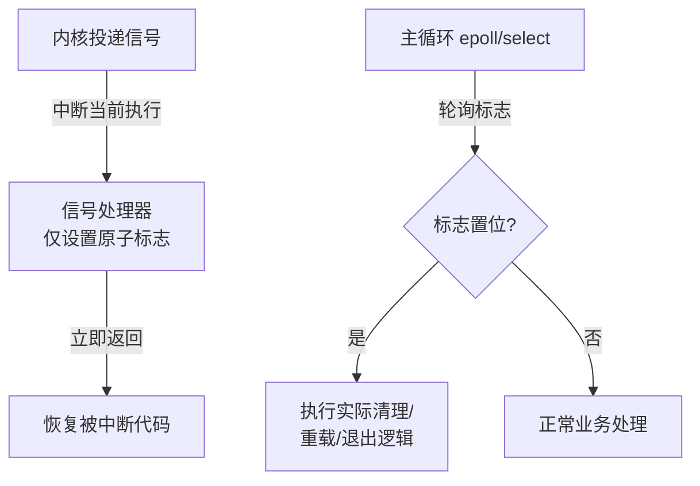
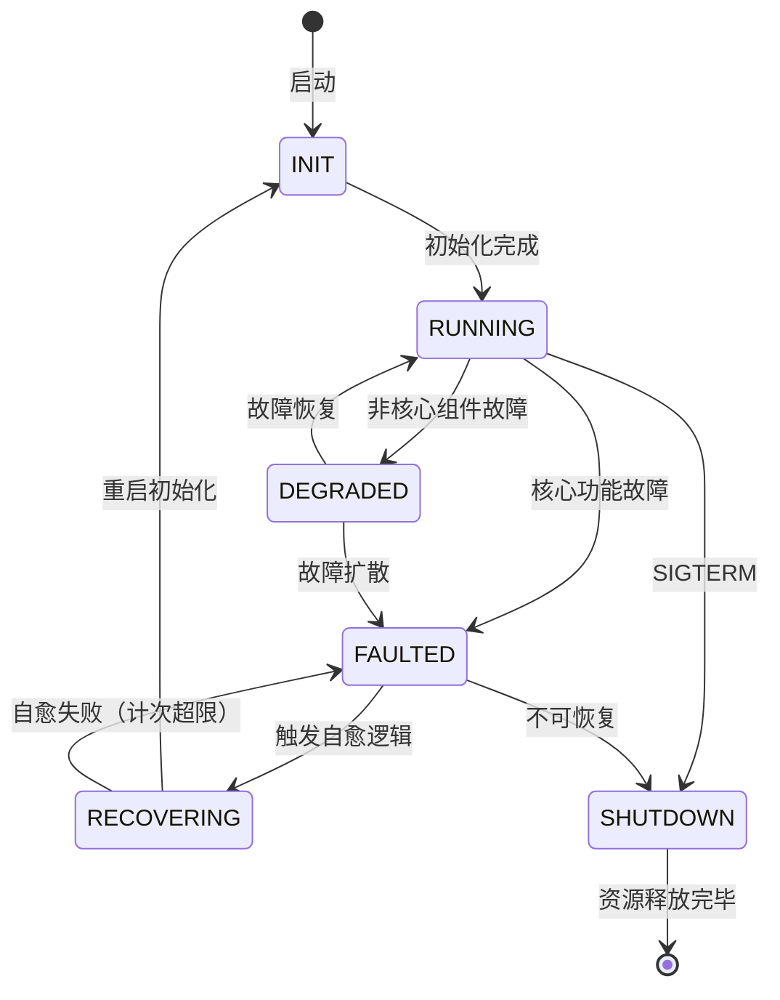

<span class="badge-i">[I]</span>

# 嵌入式服务化设计

<span class="red">将嵌入式应用设计为长期运行的守护进程（Daemon），而非一次性命令行程序，是系统服务化的核心思想。守护进程需要处理信号、管理日志、应对故障、优雅退出，这些机制构成了嵌入式系统可靠运行的软件骨架。</span>

<br>

---

<span class="red">为什么本章内容对嵌入式开发至关重要？</span><br>
本节聚焦的议题，是嵌入式应用从"能跑"到"跑得稳"的关键跃迁。<br>
理解其背后的设计动机，才能在选型时做出正确决策。


## 守护进程设计原则

<span class="red">守护进程脱离控制终端，在后台持续运行，需要显式设计进程生命周期：脱离终端、重定向标准流、设置工作目录、创建 PID 文件、处理信号。</span>

### 经典守护进程化流程

```mermaid
flowchart TD
    MAIN["main() 入口"] --> FORK1["fork() 第一次<br>父进程退出，子进程被 init 接管"]
    FORK1 --> SETSID["setsid()<br>创建新会话，脱离控制终端"]
    SETSID --> FORK2["fork() 第二次<br>防止重新获取控制终端"]
    FORK2 --> CHDIR["chdir(\"/\") or /var/run<br>防止占用挂载点"]
    CHDIR --> UMASK["umask(0)<br>清除文件模式掩码"]
    UMASK --> CLOSE["关闭 fd 0/1/2<br>重定向到 /dev/null 或日志"]
    CLOSE --> PIDFILE["写 PID 文件<br>/var/run/mydaemon.pid"]
    PIDFILE --> SIGNAL["注册信号处理器<br>SIGTERM/SIGHUP/SIGINT"]
    SIGNAL --> MAINLOOP["进入主循环<br>事件驱动 / 定时轮询"]
```

### 最小化守护进程骨架

```c
// daemon_skeleton.c — 嵌入式守护进程最小模板
#include <stdio.h>
#include <stdlib.h>
#include <unistd.h>
#include <signal.h>
#include <sys/types.h>
#include <sys/stat.h>
#include <fcntl.h>
#include <string.h>

#define PIDFILE "/var/run/mydaemon.pid"

static volatile int g_running = 1;
static volatile int g_reload = 0;

static void signal_handler(int sig) {
    if (sig == SIGTERM || sig == SIGINT) {
        g_running = 0;        // 标记退出，主循环优雅关闭
    } else if (sig == SIGHUP) {
        g_reload = 1;         // 标记重载配置
    }
}

static void daemonize(void) {
    pid_t pid = fork();
    if (pid < 0) exit(EXIT_FAILURE);
    if (pid > 0) exit(EXIT_SUCCESS);  // 父进程退出

    if (setsid() < 0) exit(EXIT_FAILURE);

    signal(SIGHUP, SIG_IGN);
    pid = fork();
    if (pid < 0) exit(EXIT_FAILURE);
    if (pid > 0) exit(EXIT_SUCCESS);  // 第二次 fork 父进程退出

    chdir("/var/run");
    umask(0);

    // 重定向标准流
    int devnull = open("/dev/null", O_RDWR);
    dup2(devnull, STDIN_FILENO);
    dup2(devnull, STDOUT_FILENO);
    dup2(devnull, STDERR_FILENO);
    close(devnull);
}

static void write_pidfile(void) {
    FILE *f = fopen(PIDFILE, "w");
    if (f) {
        fprintf(f, "%d\n", getpid());
        fclose(f);
    }
}

int main(int argc, char *argv[]) {
    daemonize();
    write_pidfile();

    struct sigaction sa;
    memset(&sa, 0, sizeof(sa));
    sa.sa_handler = signal_handler;
    sigemptyset(&sa.sa_mask);
    sigaction(SIGTERM, &sa, NULL);
    sigaction(SIGINT, &sa, NULL);
    sigaction(SIGHUP, &sa, NULL);

    while (g_running) {
        if (g_reload) {
            g_reload = 0;
            // 重载配置文件逻辑
        }
        // 主业务逻辑：轮询 / 事件等待
        sleep(1);
    }

    unlink(PIDFILE);
    return 0;
}
```

<span class="orange"><strong>信号选择</strong></span>：SIGTERM 请求优雅退出，SIGKILL 强制终止（不可捕获），SIGHUP 传统上表示"重载配置"，SIGUSR1/SIGUSR2 供应用自定义。<br>

<span class="blue">关键结论：两次 fork 的经典模式在现代 Linux 中仍有效，但若使用 systemd 管理，`Type=simple` 服务无需手动 daemonize，systemd 已处理终端脱离与重定向。</span>

<br>

---

## 信号处理与并发安全

<span class="red">信号是异步事件，信号处理器中调用非异步安全函数可能导致死锁或数据损坏。嵌入式守护进程需要采用"信号触发标志位 + 主循环处理"模式，确保所有实际工作在主线程的安全上下文中执行。</span>

### 异步信号安全



### 信号安全函数白名单

| 安全 | 不安全 | 原因 |
|------|--------|------|
| write() | printf() | 不可重入的缓冲区锁 |
| _exit() | exit() | 触发 atexit 钩子与 stdio 刷新 |
| kill() | malloc() | 可能持有堆锁 |
| sigaction() | pthread_mutex_lock() | 可能死锁 |

```c
// 信号安全的最小退出处理
static volatile sig_atomic_t g_signo = 0;

static void safe_signal_handler(int sig) {
    g_signo = sig;  // 仅写入 sig_atomic_t 变量
}

// 主循环中处理
while (1) {
    if (g_signo == SIGTERM) {
        // 调用 exit() 是安全的，因为不在信号上下文
        cleanup_resources();
        exit(EXIT_SUCCESS);
    }
    // ...
}
```

<span class="green">sig_atomic_t</span> 是 C 标准保证读写的原子类型，但仅保证"单个操作原子"，不保证"读-改-写"原子。复杂状态应使用 `sigprocmask` 阻塞信号后在主循环处理。<br>

<span class="blue">关键结论：信号处理器越短越好，最佳实践是"设置标志立即返回"，主循环或独立线程完成所有副作用操作。</span>

<br>

---

## 日志轮转与分级输出

<span class="red">嵌入式系统的存储空间有限（eMMC/Flash/NOR），日志若无限制增长会导致文件系统写满、设备死机。日志系统必须具备分级过滤、异步缓冲、自动轮转与远程上报能力。</span>

### 日志分级模型

| 级别 | 宏 | 使用场景 | 生产环境默认 |
|------|-----|---------|-------------|
| DEBUG | LOG_DEBUG | 开发调试 | 关闭 |
| INFO | LOG_INFO | 正常事件 | 开启 |
| WARN | LOG_WARN | 可恢复异常 | 开启 |
| ERROR | LOG_ERR | 功能受损 | 开启 |
| FATAL | LOG_EMERG | 系统即将崩溃 | 开启 |

### 轻量级日志轮转实现

```c
// log_rotate.h — 嵌入式日志轮转头文件
#ifndef LOG_ROTATE_H
#define LOG_ROTATE_H

#include <stdio.h>
#include <stdint.h>
#include <time.h>

struct log_ctx {
    FILE *fp;
    char path[256];
    char path_bak[256];
    size_t max_size;       // 单文件最大字节
    uint32_t max_files;    // 保留历史文件数
    size_t cur_size;
};

int log_open(struct log_ctx *ctx, const char *path, size_t max_size, uint32_t max_files);
int log_write(struct log_ctx *ctx, int level, const char *fmt, ...);
void log_close(struct log_ctx *ctx);

#endif
```

```c
// log_rotate.c — 核心轮转逻辑
#include "log_rotate.h"
#include <stdarg.h>
#include <string.h>
#include <unistd.h>

int log_write(struct log_ctx *ctx, int level, const char *fmt, ...) {
    if (!ctx->fp) return -1;

    // 检查是否需要轮转
    if (ctx->cur_size >= ctx->max_size) {
        fclose(ctx->fp);
        // 删除最老的备份，依次移位
        char old_path[512], new_path[512];
        for (int i = ctx->max_files - 1; i >= 1; i--) {
            snprintf(old_path, sizeof(old_path), "%s.%d", ctx->path, i);
            snprintf(new_path, sizeof(new_path), "%s.%d", ctx->path, i + 1);
            rename(old_path, new_path);
        }
        snprintf(new_path, sizeof(new_path), "%s.1", ctx->path);
        rename(ctx->path, new_path);
        ctx->fp = fopen(ctx->path, "w");
        ctx->cur_size = 0;
    }

    // 写入时间戳 + 级别 + 消息
    time_t now = time(NULL);
    struct tm *tm = localtime(&now);
    int n = fprintf(ctx->fp, "[%04d-%02d-%02d %02d:%02d:%02d] ",
                    tm->tm_year + 1900, tm->tm_mon + 1, tm->tm_mday,
                    tm->tm_hour, tm->tm_min, tm->tm_sec);

    va_list args;
    va_start(args, fmt);
    n += vfprintf(ctx->fp, fmt, args);
    va_end(args);
    n += fprintf(ctx->fp, "\n");
    fflush(ctx->fp);

    ctx->cur_size += n;
    return n;
}
```

<span class="orange"><strong>日志落盘策略</strong></span>：嵌入式 Flash 有擦写寿命限制（通常 10K-100K 次），频繁小量写日志会加速磨损。建议采用"内存缓冲 + 批量刷盘"或"ring buffer"模式，配合日志级别过滤减少写入量。<br>

<span class="blue">关键结论：生产环境日志应默认关闭 DEBUG，使用异步写入避免阻塞业务线程，定期 `fsync` 或依赖系统刷盘策略平衡一致性与性能。</span>

<br>

---

## 故障恢复与状态机

<span class="red">守护进程不可能永无故障，设计良好的恢复机制将局部故障限制在可控范围内，通过状态机明确各状态的行为与转移条件，实现"故障隔离、自动恢复、优雅降级"。</span>

### 守护进程状态机



### 故障恢复策略矩阵

| 故障类型 | 检测方式 | 恢复策略 | 最大重试 |
|---------|---------|---------|---------|
| 外设通信超时 | 看门狗 / 心跳 | 复位外设 + 重新初始化 | 3 次 |
| 配置文件损坏 | JSON/XML 解析失败 | 回退默认配置 + 告警 | 1 次 |
| 内存分配失败 | malloc 返回 NULL | 释放缓存 + 降级运行 | 持续 |
| 网络断开 | 连接超时 / 心跳丢失 | 指数退避重连 | 无限 |
| 数据库损坏 | 校验和失败 | 切换到备份副本 | 1 次 |

```c
// 故障恢复框架伪代码
enum state { INIT, RUNNING, DEGRADED, FAULTED, RECOVERING, SHUTDOWN };

struct fault_mgr {
    enum state state;
    int fault_count;
    int max_retries;
    uint64_t last_fault_ts;
};

void handle_fault(struct fault_mgr *fm, int fault_code) {
    fm->fault_count++;
    fm->last_fault_ts = get_monotonic_ms();

    if (fm->fault_count > fm->max_retries) {
        fm->state = FAULTED;      // 进入不可恢复态，触发告警/重启
        return;
    }

    switch (fault_code) {
    case FAULT_PERIPH_TIMEOUT:
        reset_periph();           // 复位外设
        fm->state = RECOVERING;
        break;
    case FAULT_NET_DISCONNECT:
        backoff_reconnect(1000 * fm->fault_count);  // 指数退避
        fm->state = DEGRADED;
        break;
    case FAULT_OOM:
        trim_cache();             // 释放缓存
        fm->state = DEGRADED;
        break;
    }
}
```

<span class="orange"><strong>指数退避（Exponential Backoff）</strong></span>：网络重连时，首次等待 1s，第二次 2s，第三次 4s... 上限 60s，避免故障时产生连接风暴压垮服务端。<br>

<span class="blue">关键结论：故障恢复不是"无限重试"，必须设定重试上限与退避策略，超过上限后进入 FAULTED 态触发外部干预（systemd Restart、看门狗复位）。</span>

<br>

---

## 历史演进

守护进程的概念起源于 1970 年代的 Unix 系统，名称由 MIT 的 Fernando Corbató 在 1963 年的 CTSS 系统中创造，指那些"不知疲倦地在后台工作"的程序。1980 年代的 BSD Unix 确立了 daemon 的标准行为：两次 fork、setsid、关闭标准流。1990 年代 SysVinit 通过 `/etc/init.d/` 脚本管理守护进程生命周期，但缺乏进程监控能力。2000 年 Ubuntu 的 Upstart 首次尝试事件驱动的守护进程管理。2004 年 daemontools 由 D.J. Bernstein 发布，提出"监控进程监督被监控进程"的监督者模型（supervision），成为 s6、runit 等现代监督者工具的先驱。2010 年 systemd 将监督者模型、socket 激活、cgroup 资源控制合为一体，成为事实标准。2018 年至今，容器化与 Kubernetes 重新定义了"守护进程"的边界——Pod 内的主进程替代传统 daemon，systemd 则退化为节点级基础设施管理器。

<br>

---

## 本章小结

| 要点 | 内容 |
|------|------|
| 守护进程化 | 两次 fork + setsid + chdir + umask + 重定向 + PID 文件 |
| 信号处理 | 处理器仅设标志，主循环执行实际逻辑，保证异步信号安全 |
| 日志系统 | 分级过滤 + 异步缓冲 + 自动轮转 + Flash 寿命保护 |
| 故障恢复 | 状态机驱动，指数退避重试，超限进入 FAULTED 态 |
| 现代替代 | systemd Type=simple 服务可替代手动 daemonize |
| 核心原则 | 故障隔离、自动恢复、优雅降级、外部干预兜底 |

## 练习

1. 两次 fork 守护进程化中，第二次 fork 的目的是什么？在什么条件下可以省略第二次 fork？
2. 信号处理器中调用 `malloc()` 可能导致什么后果？从 glibc 内部锁机制角度解释，并给出安全的替代方案。
3. 设计一个嵌入式守护进程的状态机框架，支持 INIT、RUNNING、DEGRADED、FAULTED、RECOVERING、SHUTDOWN 六种状态，写出状态转移表与核心状态机循环代码。
