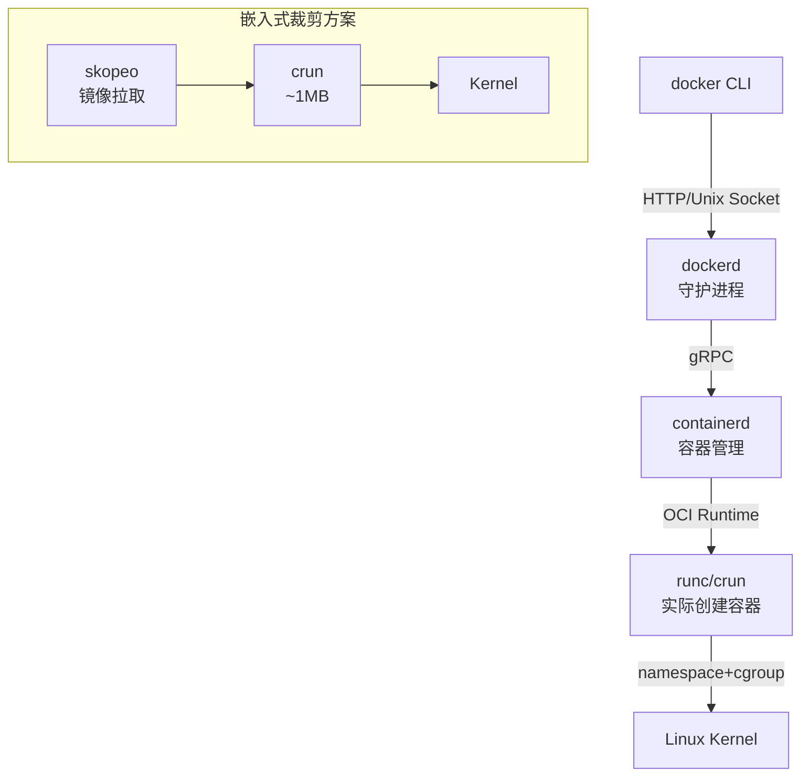
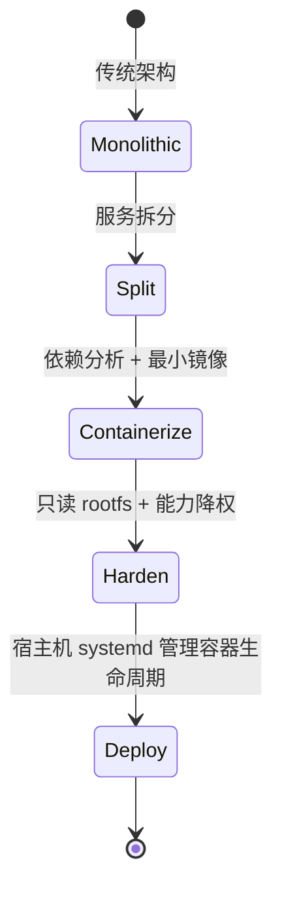

# Docker 在嵌入式中的裁剪与应用

<span class="badge-i">[I]</span> <span class="badge-e">[E]</span>

---

### Docker 架构与嵌入式适配

<span class="red">Docker 采用客户端-服务端架构，`dockerd` 守护进程统一管理镜像、容器、网络和存储，客户端通过 REST API 或 Unix Socket 发送命令。这种集中式设计在服务器端高效统一，但在资源受限的嵌入式设备上显得臃肿。</span><br>

标准 Docker 安装包含 containerd、runc、dockerd 和 CLI 工具链，体积超过 100MB，远超多数嵌入式 rootfs 的容量规划。<br>
嵌入式适配的核心策略是剥离非必要组件，保留最小可用的运行时和构建工具链。<br>



---

### 嵌入式 Docker 裁剪策略

<span class="red">嵌入式 Docker 裁剪需从守护进程、存储驱动、网络模型和镜像体积四个维度下手，将总开销控制在目标设备可接受的范围内。</span><br>

<span class="orange"><strong>守护进程裁剪</strong></span>：以 containerd + crun 替代完整的 dockerd，containerd 仅需 ~15MB，crun 仅需 ~1MB，两者合计不足 Docker 套件的十分之一。<br>
<span class="orange"><strong>存储驱动选择</strong></span>：overlay2 是默认驱动，但需内核支持（4.0+）。老旧内核使用 aufs 或 vfs，vfs 性能差但兼容性最好。嵌入式场景可接受 vfs 的性能损失以换取兼容性。<br>
<span class="orange"><strong>网络简化</strong></span>：默认 bridge 网络需 iptables 和 bridge 内核模块，嵌入式中改用 host 网络（`--net=host`）或 none 网络，消除虚拟网卡和 NAT 开销。<br>
<span class="orange"><strong>镜像体积压缩</strong></span>：多阶段构建 + Alpine/BusyBox 基础镜像 + 静态链接，将应用镜像控制在 10MB 以内。<br>

```bash
# 使用 crun 替代 runc，显著减小运行时体积
$ mkdir -p /etc/containers
$ cat > /etc/containers/containers.conf <<EOF
[engine]
runtime = "crun"
EOF
```

<span class="blue">关键认知：嵌入式 Docker 不是"运行完整 Docker"，而是提取 Docker 的容器化思想（镜像、隔离、分层），用更轻量的工具链实现等价功能。</span><br>

---

### 多阶段构建：最小化镜像体积

<span class="red">多阶段构建（Multi-stage Build）是 Docker 的核心优化技术，通过在一个 Dockerfile 中定义多个构建阶段，仅将编译产物复制到最终镜像，排除编译器、头文件和中间文件。</span><br>

嵌入式交叉编译场景下，第一阶段使用完整的交叉编译工具链镜像（如 `arm32v7/gcc`）编译目标程序；第二阶段使用最小基础镜像（如 `scratch` 或 `busybox:glibc`），仅复制二进制文件。<br>

```dockerfile
# 第一阶段：交叉编译环境
FROM arm32v7/gcc:latest AS builder
WORKDIR /src
COPY hello.c .
RUN arm-linux-gnueabihf-gcc -static -o hello hello.c

# 第二阶段：最小运行时镜像
FROM scratch
COPY --from=builder /src/hello /hello
ENTRYPOINT ["/hello"]
```

```bash
# 构建并检查镜像体积
$ docker build -t embedded-hello .
$ docker images embedded-hello
# REPOSITORY       TAG       IMAGE ID       SIZE
# embedded-hello   latest    xxxxxxxx       1.23MB
```

<span class="blue">关键结论：多阶段构建可将嵌入式应用镜像从数百 MB 压缩到数 MB。`scratch` 空镜像配合静态链接是体积最小化的终极方案，但需确保无动态库依赖。</span><br>

---

### 静态链接与 musl libc

<span class="red">glibc 静态链接会引入大量未使用符号，体积膨胀；<span class="green">musl libc</span> 是专为静态链接设计的轻量 C 库，比 glibc 静态链接产物小 50% 以上，是嵌入式容器镜像的首选基础。</span><br>

Alpine Linux 基于 musl libc 和 BusyBox，基础镜像仅 5MB，安装包数量庞大但体积极小。<br>
交叉编译时，使用 `musl-cross-make` 工具链生成静态链接的 ARM 二进制，可在任何 Linux 内核上运行，无需关心目标系统的 libc 版本。<br>

```dockerfile
# 使用 Alpine + musl 构建超小嵌入式镜像
FROM alpine:latest AS builder
RUN apk add --no-cache gcc musl-dev
WORKDIR /src
COPY sensor_daemon.c .
RUN gcc -Os -static -o sensor_daemon sensor_daemon.c

FROM scratch
COPY --from=builder /src/sensor_daemon /sensor_daemon
COPY --from=builder /etc/ssl/certs/ca-certificates.crt /etc/ssl/certs/
ENTRYPOINT ["/sensor_daemon"]
```

<span class="blue">易错点：musl 与 glibc 在部分行为上有差异（如 DNS 解析线程安全、`pthread_cancel` 语义），迁移前需验证应用兼容性。NSS 相关功能在 musl 中行为不同。</span><br>

---

### rootfs 容器化：从完整系统到应用容器

<span class="red">传统嵌入式系统使用单一 rootfs 镜像，所有应用和服务共处同一文件系统。容器化改造将每个服务拆分为独立容器，共享宿主机内核，各自携带最小依赖。</span><br>

改造流程：<br>
<span class="orange"><strong>服务拆分</strong></span>：将 monolithic rootfs 中的 Web 服务器、数据采集、网络代理拆分为三个独立容器。<br>
<span class="orange"><strong>依赖分析</strong></span>：用 `ldd` 分析每个服务的动态依赖，仅打包所需 so 文件和配置文件。<br>
<span class="orange"><strong>只读根文件系统</strong></span>：容器根文件系统以只读方式挂载（`--read-only`），可写数据通过 volume 映射到宿主机持久存储。<br>
<span class="orange"><strong>能力降权</strong></span>：通过 `--cap-drop=ALL --cap-add=NET_BIND_SERVICE` 仅保留必要权限，遵循最小权限原则。<br>

```bash
# 嵌入式设备上以只读方式运行应用容器
$ crun run -b /var/lib/containers/webapp     --read-only     --cap-drop=ALL     --cap-add=NET_BIND_SERVICE     --net=host     webapp
```

<span class="blue">关键认知：rootfs 容器化不是简单地"把 rootfs 装进容器"，而是重新思考服务边界，每个容器应只运行一个主进程，遵循单职责原则。</span><br>



---

### 容器镜像仓库与 OTA 更新

<span class="red">嵌入式设备的 OTA 更新可借鉴 Docker 镜像分层机制，仅传输差异层（layer），而非完整 rootfs，显著降低流量消耗和更新时间。</span><br>

Docker 镜像由多层只读层叠加而成，每层对应 Dockerfile 的一条指令。<br>
更新时，仅需下载变更的层，未变更的层通过内容寻址（content-addressable，sha256 校验）复用本地缓存。<br>
嵌入式设备可运行精简的镜像仓库客户端（如 `skopeo` 或 `containers-storage`），从私有仓库拉取更新。<br>

```bash
# 使用 skopeo 拉取嵌入式镜像（无需守护进程）
$ skopeo copy docker://registry.local/embedded/app:v2     containers-storage:embedded-app:v2

# 检查本地镜像层复用情况
$ skopeo inspect containers-storage:embedded-app:v2
```

<span class="blue">易错点：分层更新要求底层基础镜像稳定不变。若更换基础镜像（如 Alpine 3.16 → 3.17），所有层重新下载，失去增量更新优势。嵌入式应锁定基础镜像版本。</span><br>

---

**学习路径提示**：<br>
- <span class="badge-i">[I]</span> 读者：掌握多阶段构建、Alpine/musl 基础镜像和镜像体积优化策略。<br>
- <span class="badge-e">[E]</span> 读者：关注 crun 替代方案、rootfs 容器化改造流程、能力降权和 OTA 增量更新。<br>

---

<span class="red">为什么本章内容对嵌入式开发至关重要？</span><br>
本节聚焦的议题，是嵌入式应用从"能跑"到"跑得稳"的关键跃迁。<br>
理解其背后的设计动机，才能在选型时做出正确决策。


## 历史演进与发展趋势

Docker 由 dotCloud 公司于 2013 年开源，Solomon Hykes 团队将 LXC（Linux Containers）封装为易用的镜像和仓库体系，引发云原生计算的范式转变。2014 年 Docker 1.0 发布，引入联合文件系统（UnionFS）和镜像分层，奠定了容器存储的基础模型。2015 年，Docker 将容器运行时部分捐赠给 OCI，催生 runc 标准；同时推出 containerd 作为独立守护进程，解耦 Docker 与底层运行时。2016 年，Alpine Linux 成为 Docker 官方推荐的最小基础镜像，musl libc 走进主流视野。2017 年，Docker 推出多阶段构建（Multi-stage Build），从根本上解决了镜像体积膨胀问题。2019 年，RedHat 推动 Podman 和 Buildah，证明无守护进程的容器化在技术上完全可行。2020 年后，嵌入式领域开始吸收容器化成果：NVIDIA Jetson 平台官方支持 Docker，Yocto 的 meta-virtualization 层提供容器工具链，Buildroot 增加 containerd 支持。未来趋势上，嵌入式容器正走向"单应用单容器"的极致精简方向，配合 systemd 的容器管理（systemd-nspawn/machinectl），形成不依赖 Docker 生态的独立容器化体系。

---

## 本章小结

| 要点 | 内容 |
|------|------|
| 架构裁剪 | containerd + crun 替代 dockerd，体积从 100MB+ 降至 ~16MB |
| 多阶段构建 | 编译阶段用完整工具链，运行阶段用 scratch/Alpine，排除编译依赖 |
| musl libc | 比 glibc 静态链接体积小 50%+，Alpine 基础镜像仅 5MB |
| rootfs 容器化 | 服务拆分 → 依赖分析 → 只读 rootfs → 能力降权 |
| OTA 更新 | 镜像分层增量传输，锁定基础镜像版本以保持增量优势 |
| 网络简化 | 嵌入式用 `--net=host` 消除 bridge/iptables 开销 |

## 练习

1. 编写一个多阶段 Dockerfile：第一阶段使用 `arm32v7/alpine` 交叉编译一个静态链接的 C 程序，第二阶段使用 `scratch` 作为基础镜像，最终镜像体积控制在 2MB 以内。使用 `docker history` 分析每层贡献的体积。
2. 对比 glibc 和 musl libc 静态链接同一程序的体积差异，用 `ldd` 和 `nm` 分析符号数量差异。说明在什么场景下 musl 不兼容 glibc 程序。
3. 设计一个嵌入式设备的容器化 OTA 方案：设备运行三个服务容器（Web、采集、上报），每个容器独立版本化。画出 OTA 流程图，说明如何利用镜像分层实现仅更新变更容器的最小流量更新。
