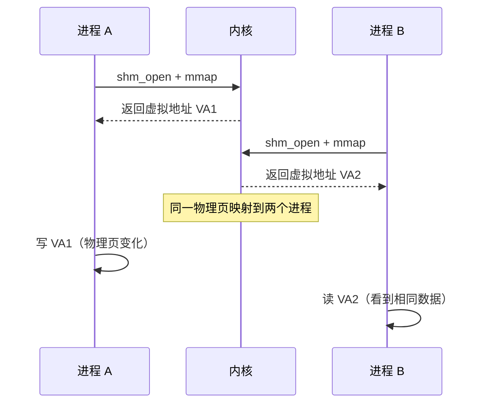

# IPC 基础认知与通信模型

<span class="badge-i">[I]</span>

---

### 为什么需要进程间通信

<span class="red">现代操作系统采用进程隔离模型，每个进程拥有独立的虚拟地址空间，彼此不能直接访问对方的内存。</span><br>
当多个进程需要协作完成任务时，必须通过内核提供的机制交换数据，这就是 <span class="green">进程间通信（Inter-Process Communication，IPC）</span>。<br>
嵌入式系统中，传感器采集进程、数据处理进程、网络上传进程通常分离运行，IPC 是系统架构的粘合剂。<br>

类比：同一办公楼的多个独立公司——<br>
每家公司有自己的办公室（进程地址空间），不能随意进入对方办公室。<br>
需要收发文件时，只能通过大楼的传达室（内核）传递，或者租用公共会议室（共享内存）碰头。<br>

---

### IPC 分类与通信模型

Linux 提供的 IPC 机制按数据传输方式可分为两大类：<br>

<span class="orange"><strong>消息传递型</strong></span>：数据通过内核中转，进程发送消息后由接收方读取。<br>
<span class="orange"><strong>共享内存型</strong></span>：内核映射同一块物理内存到多个进程地址空间，进程直接读写，无需内核介入数据传输。<br>

| 机制 | 类型 | 数据方向 | 内核介入 | 典型场景 |
|------|------|----------|----------|----------|
| 管道（Pipe） | 消息传递 | 单向 | 每次读写 | 父子进程间命令传递 |
| FIFO | 消息传递 | 单向 | 每次读写 | 无亲缘关系进程间 |
| 消息队列 | 消息传递 | 单向/双向 | 每次读写 | 异步消息分发 |
| 信号量 | 同步 | 无数据 | 仅 P/V 操作 | 资源计数与互斥 |
| 共享内存 | 共享内存 | 双向 | 仅初始映射 | 大数据量高速交换 |
| Unix Domain Socket | 消息传递 | 双向 | 每次读写 | 本地可靠通信 |

<span class="blue">关键认知：消息传递型 IPC 安全可靠但存在数据拷贝开销；共享内存型 IPC 性能最高但需要额外的同步机制保护数据一致性。</span><br>

---

### 管道：最原始的 IPC

<span class="red">管道（Pipe）是 Unix 系统最早的 IPC 机制，由 Doug McIlroy 于 1973 年在 Unix V3 中引入，奠定了"一切皆文件"的设计哲学。</span><br>

管道通过 `pipe()` 系统调用创建，返回两个文件描述符：`pipefd[0]` 用于读，`pipefd[1]` 用于写。<br>
数据在内核的环形缓冲区中流转，遵循 FIFO 顺序，容量通常为 64KB（Linux 2.6.11 后可通过 `/proc/sys/fs/pipe-max-size` 调整）。<br>

```c
// 创建匿名管道并在父子进程间通信
#include <unistd.h>
#include <stdio.h>

int pipefd[2];
pipe(pipefd);                  // 创建管道，pipefd[0]=读端, pipefd[1]=写端

pid_t pid = fork();
if (pid == 0) {
    close(pipefd[1]);          // 子进程关闭写端
    char buf[64];
    read(pipefd[0], buf, 64);  // 从读端接收数据
    printf("child: %s\n", buf);
    close(pipefd[0]);
} else {
    close(pipefd[0]);          // 父进程关闭读端
    write(pipefd[1], "hello", 5); // 向写端发送数据
    close(pipefd[1]);
}
```

<span class="blue">易错点：管道是半双工的，双向通信需要两个管道；未关闭未使用的端会导致 EOF 无法触发，读端永久阻塞。</span><br>

---

### FIFO：有名管道突破亲缘限制

<span class="red">FIFO（First In First Out，命名管道）在管道基础上增加了文件系统路径，使无亲缘关系的进程也能通过路径名找到同一管道进行通信。</span><br>

FIFO 通过 `mkfifo()` 创建，本质是一个特殊类型的文件（`p` 权限位）。<br>
一个进程以只写方式打开 FIFO 会阻塞，直到另一个进程以只读方式打开；反之亦然。<br>

```c
// 创建 FIFO 并进行跨进程通信
#include <sys/types.h>
#include <sys/stat.h>
#include <fcntl.h>

mkfifo("/tmp/my_fifo", 0666);   // 创建命名管道文件

// 进程 A：写端
int fd = open("/tmp/my_fifo", O_WRONLY);
write(fd, "data", 4);
close(fd);

// 进程 B：读端
int fd = open("/tmp/my_fifo", O_RDONLY);
char buf[64];
read(fd, buf, 64);
close(fd);
```

<span class="blue">关键结论：FIFO 适用于本地无亲缘进程间的一次性数据交换，但仍然是字节流而非消息边界，需要应用层自行设计帧格式。</span><br>

---

### System V 与 POSIX IPC 体系

<span class="red">Linux 支持两套 IPC 接口：System V IPC 源自 AT&T Unix，历史久远；POSIX IPC 是 IEEE 标准化接口，设计更现代。</span><br>

| 特性 | System V IPC | POSIX IPC |
|------|-------------|-----------|
| 消息队列 | `msgget/msgsnd/msgrcv` | `mq_open/mq_send/mq_receive` |
| 信号量 | `semget/semop` | `sem_init/sem_wait/sem_post` |
| 共享内存 | `shmget/shmat` | `shm_open/mmap` |
| 标识方式 | 整数键值（key_t） | 文件路径名 |
| 持久化 | 内核持久（需显式删除） | 可选文件系统持久 |
| 可移植性 | 较广 | POSIX 标准，更规范 |

<span class="green">消息队列</span> 在内核中维护消息链表，发送方将消息追加到队列尾部，接收方按类型或 FIFO 顺序读取。<br>
<span class="green">信号量</span> 本身不传输数据，仅用于进程间同步，通过 P（wait，减一）和 V（signal，加一）操作控制资源访问。<br>
<span class="green">共享内存</span> 将同一块物理页映射到多个进程页表，是最快的 IPC 方式，但必须配合信号量或互斥锁防止竞态。<br>

```mermaid
flowchart TD
    P1["进程 A<br>用户空间"] -->|write| K1["内核消息队列<br>消息链表"]
    K1 -->|read| P2["进程 B<br>用户空间"]
    P1 .-.->|mmap| SM["共享内存<br>物理页映射"]
    P2 .-.->|mmap| SM
    SM -->|sem_wait/sem_post| SEM["信号量<br>同步保护"]
```

---

### 消息队列与信号量的工作原理

<span class="red">System V 消息队列通过 `msgget()` 创建或获取队列标识符，内核为每个队列维护一个消息链表，每条消息附带类型字段实现选择性接收。</span><br>

```c
// System V 消息队列发送示例
#include <sys/msg.h>

struct msgbuf {
    long mtype;          // 消息类型，接收方可选择性读取
    char mtext[128];     // 消息正文
};

int msgid = msgget(0x1234, IPC_CREAT | 0666);
struct msgbuf msg = { .mtype = 1 };
strcpy(msg.mtext, "sensor data");
msgsnd(msgid, &msg, strlen(msg.mtext), 0);   // 发送消息到队列
```

<span class="red">System V 信号量以集合（semaphore set）形式存在，一个集合可包含多个信号量，通过 `semop()` 原子执行一组 P/V 操作。</span><br>

```c
// System V 信号量 P/V 操作
#include <sys/sem.h>

int semid = semget(0x5678, 1, IPC_CREAT | 0666);
semctl(semid, 0, SETVAL, 1);   // 初始化信号量值为 1（二值信号量）

struct sembuf op = { 0, -1, SEM_UNDO };  // 第0个信号量，P操作
semop(semid, &op, 1);          // 进入临界区
// ... 访问共享资源 ...
op.sem_op = 1;                 // V操作
semop(semid, &op, 1);          // 离开临界区
```

<span class="blue">易错点：System V IPC 资源是内核持久的，`ipcs` 可查看当前资源，`ipcrm` 可手动清理残留。程序异常退出未清理会导致资源泄漏。</span><br>

---

### 共享内存：零拷贝的高速通道

<span class="red">共享内存通过将同一块物理内存页映射到多个进程的虚拟地址空间，实现进程间的零拷贝数据共享，是 Linux 上性能最高的 IPC 机制。</span><br>

POSIX 共享内存使用 `shm_open()` 创建内存对象，配合 `mmap()` 映射到进程地址空间。<br>
`ftruncate()` 设置共享区域大小，映射后进程像访问普通内存一样读写，无需系统调用。<br>

```c
// POSIX 共享内存创建与映射
#include <sys/mman.h>
#include <fcntl.h>

int fd = shm_open("/myshm", O_CREAT | O_RDWR, 0666);
ftruncate(fd, 4096);                    // 设置共享内存大小为 4KB

char *ptr = mmap(NULL, 4096, PROT_READ | PROT_WRITE, MAP_SHARED, fd, 0);
strcpy(ptr, "shared data");             // 进程 A 写入
// 进程 B 通过相同路径映射后可读取 "shared data"
munmap(ptr, 4096);
shm_unlink("/myshm");                   // 删除共享内存对象
```

<span class="blue">关键认知：共享内存本身不提供同步，必须配合 POSIX 无名信号量、文件锁或 `pthread_mutexattr_setpshared()` 设置的进程间互斥锁使用。</span><br>



---

**学习路径提示**：<br>
- <span class="badge-i">[I]</span> 读者：理解 IPC = 消息传递 + 共享内存两大类，管道适合简单场景，共享内存适合高性能场景。<br>

---

## 历史演进与发展趋势

IPC 机制的历史与 Unix 操作系统的发展紧密交织。1973 年，Doug McIlroy 在 Unix V3 中引入管道机制，成为第一个广泛使用的 IPC 方案，催生了 Shell 管道过滤器的编程范式。1983 年，AT&T 在 System V 中推出消息队列、信号量和共享内存组成的 System V IPC 套件，首次在商用 Unix 中提供完整的进程间通信能力。1993 年，POSIX.1b 标准定义了 POSIX IPC 接口，使用文件路径替代整数键值，语义更清晰、接口更统一。2001 年，POSIX 消息队列和共享内存进入 Linux 2.6 内核，逐渐取代 System V IPC 成为新项目首选。2003 年，D-Bus 作为桌面环境 IPC 总线出现，填补了传统 IPC 在动态发现、广播通知方面的空白。2010 年后，随着多核处理器普及，共享内存配合无锁数据结构（Lock-Free Queue）成为高性能 IPC 的主流方向。在嵌入式领域，由于资源受限，轻量级 IPC 如 Pipe、POSIX Message Queue 仍是首选，而共享内存则在实时视频流传输、传感器数据融合等场景中不可或缺。

---

## 本章小结

| 要点 | 内容 |
|------|------|
| 通信模型 | 消息传递型（管道、FIFO、消息队列、Socket）与共享内存型（mmap、shm） |
| 管道 | `pipe()` 创建匿名管道，单向字节流，适用于父子进程 |
| FIFO | `mkfifo()` 创建命名管道，以文件路径标识，适用于无亲缘进程 |
| System V IPC | `msgget/semget/shmget` 基于键值标识，内核持久，历史悠久 |
| POSIX IPC | `mq_open/sem_init/shm_open` 基于路径标识，接口统一，现代推荐 |
| 共享内存 | 零拷贝最高性能，但必须配合信号量或互斥锁实现同步 |
| 选型原则 | 简单场景用管道，大数据量用共享内存，异步消息用消息队列 |

## 练习

1. 管道和 FIFO 的本质区别是什么？为什么说管道只能用于亲缘进程，而 FIFO 可以用于任意进程？请从文件描述符和文件系统两个角度分析。
2. System V IPC 和 POSIX IPC 在接口设计、资源标识方式和持久化行为上有哪些核心差异？在新建项目中应优先选择哪一套接口，原因是什么？
3. 共享内存被称为"零拷贝" IPC，为什么它还需要配合信号量或互斥锁？如果不加同步保护，多个进程同时读写共享内存会出现什么问题？请画出时序图说明竞态条件。
