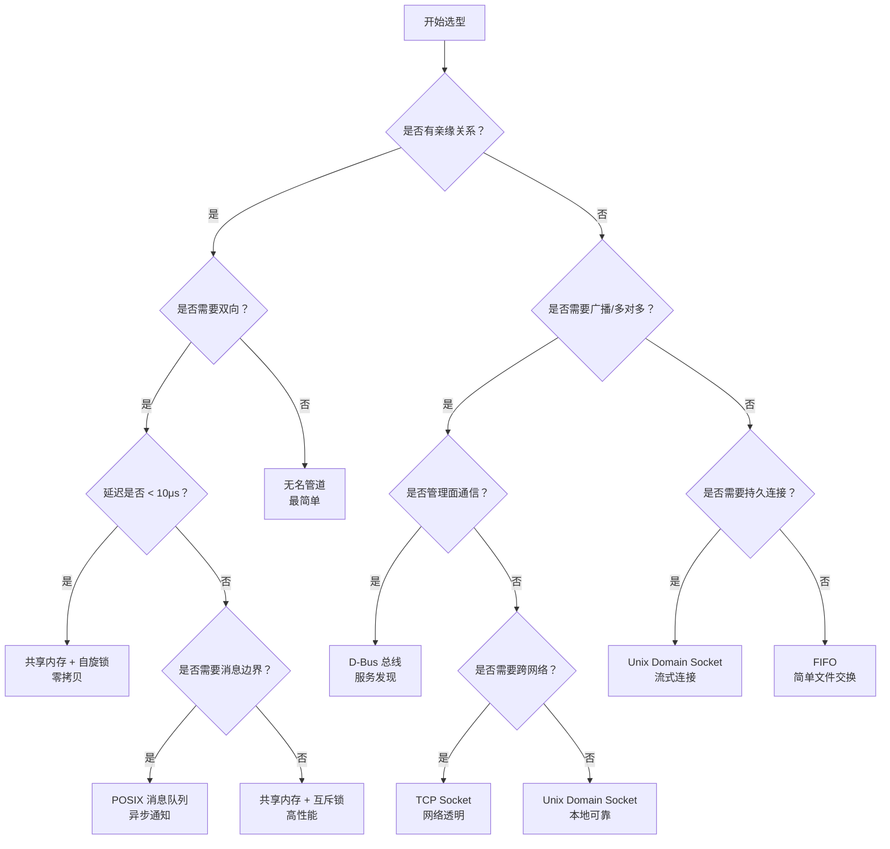
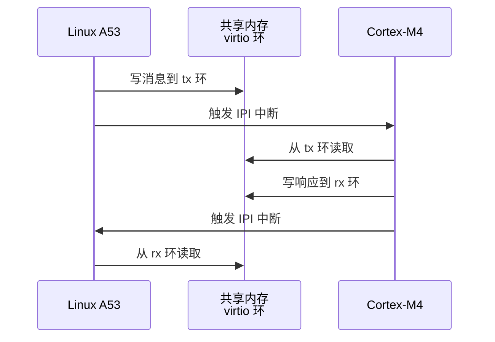

# 嵌入式 IPC 选型与实战

<span class="badge-i">[I]</span>

---

### 嵌入式 IPC 需求特征

<span class="red">嵌入式系统与通用服务器在 IPC 选型上有本质差异：资源受限（内存 MB 级）、实时性要求高（毫秒甚至微秒级）、掉电场景频繁、跨核通信常见。</span><br>

通用服务器追求吞吐量和弹性扩展，嵌入式系统追求确定性延迟和资源可控。<br>
一颗 128MB RAM 的工业网关无法为每条消息分配大缓冲区；一个电机控制循环周期为 1ms，IPC 延迟必须控制在百微秒级。<br>

| 维度 | 通用服务器 | 嵌入式系统 |
|------|-----------|-----------|
| 内存预算 | GB 级 | MB 级 |
| 延迟要求 | 毫秒级可接受 | 微秒至百微秒 |
| 实时性 | 尽力而为 | 硬实时或准硬实时 |
| 掉电处理 | 日志恢复 | 数据持久化或原子操作 |
| 跨核通信 | 较少 | AMP/SMP 架构常见 |
| 认证加密 | TLS/SSL 标准 | 轻量级或硬件加速 |

<span class="blue">关键认知：嵌入式 IPC 选型不能照搬服务器经验，必须从延迟、内存、实时性和可靠性四个维度综合评估。</span><br>

---

### IPC 实时性量化对比

<span class="red">实时性评估需关注端到端延迟（发送方调用到接收方读到的总时间）和延迟抖动（最大延迟与最小延迟之差），而非单纯的平均吞吐。</span><br>

在 Linux 3.10、ARM Cortex-A9 @ 1GHz 平台上的典型测量数据：<br>

| IPC 机制 | 单次延迟 | 延迟抖动 | 数据拷贝次数 | 适用优先级 |
|----------|----------|----------|-------------|-----------|
| 共享内存 + 自旋锁 | <1μs | <0.5μs | 0 | 硬实时 |
| 共享内存 + 互斥锁 | 2~5μs | 1~3μs | 0 | 准硬实时 |
| Unix Domain Socket | 10~30μs | 5~15μs | 2 | 软实时 |
| POSIX 消息队列 | 15~50μs | 10~20μs | 2 | 软实时 |
| FIFO / 管道 | 20~60μs | 10~30μs | 2 | 非实时 |
| D-Bus | 100~500μs | 50~200μs | 多次序列化 | 非实时 |
| TCP 回环 | 50~200μs | 20~100μs | 多次 | 非实时 |

<span class="blue">关键结论：硬实时场景（如电机控制、传感器融合）必须选择共享内存 + 自旋锁/互斥锁；软实时场景（如状态上报、配置下发）可用消息队列或 UDS；D-Bus 仅适合非时间关键的管理面通信。</span><br>

---

### 选型决策树

<span class="red">面对十余种 IPC 机制，嵌入式工程师可通过决策树快速缩小范围，避免过度设计或性能不足。</span><br>



---

### 跨核 IPC：AMP 与 RPMsg

<span class="red">异构多核嵌入式系统（如 Linux + RTOS 的 AMP 架构）中，核间通信不经过 Linux 的常规 IPC，而是通过共享内存和门铃中断实现硬件级数据交换。</span><br>

<span class="green">RPMsg（Remote Processor Messaging）</span> 是 Linux 内核中的核间通信框架，基于 virtio 环形缓冲区，通过共享内存和处理器间中断（IPI）在 Linux 主核与远程从核之间传递消息。<br>
从核端（如 FreeRTOS/Zephyr）运行 `rpmsg-lite` 或 OpenAMP 库，与 Linux 端的 `rpmsg` 驱动对接。<br>



```c
// Linux 端：rpmsg 发送消息到远程处理器
#include <linux/rpmsg.h>

static int rpmsg_cb(struct rpmsg_device *rpdev, void *data,
                    int len, void *priv, u32 src) {
    // 接收从核的响应
    printk("recv from M4: %.*s\n", len, (char *)data);
    return 0;
}

static int rpmsg_probe(struct rpmsg_device *rpdev) {
    rpmsg_send(rpdev->ept, "hello M4", 8);   // 向端点发送消息
    return 0;
}
```

<span class="blue">关键认知：RPMsg 的延迟通常在 10~50μs 级别，远低于网络 IPC，是异构 SoC 上实时任务与 Linux 控制面交互的标准方案。</span><br>

---

### 共享内存环形缓冲区：无锁设计

<span class="red">在硬实时场景中，即使是互斥锁的上下文切换开销也不可接受，<span class="green">无锁环形缓冲区（Lock-Free Ring Buffer）</span> 通过原子操作和内存序保证，实现单生产者单消费者（SPSC）场景下的零阻塞通信。</span><br>

环形缓冲区维护读指针和写指针，生产者通过原子操作更新写指针，消费者通过原子操作更新读指针。<br>
单生产者单消费者模型下，读写指针各自仅被一个线程修改，无需锁保护，仅需保证指针更新的内存可见性。<br>

```c
// 无锁环形缓冲区：单生产者单消费者
#include <stdatomic.h>
#include <stdint.h>

#define RING_SIZE 1024

struct ring_buffer {
    _Atomic uint32_t write_idx;
    _Atomic uint32_t read_idx;
    uint8_t buf[RING_SIZE];
};

// 生产者
uint32_t w = atomic_load_explicit(&rb->write_idx, memory_order_relaxed);
uint32_t r = atomic_load_explicit(&rb->read_idx, memory_order_acquire);
if ((w + 1) % RING_SIZE != r) {          // 检查满条件
    rb->buf[w] = data;
    atomic_store_explicit(&rb->write_idx,
                          (w + 1) % RING_SIZE,
                          memory_order_release);
}

// 消费者
uint32_t r = atomic_load_explicit(&rb->read_idx, memory_order_relaxed);
uint32_t w = atomic_load_explicit(&rb->write_idx, memory_order_acquire);
if (r != w) {                            // 检查空条件
    data = rb->buf[r];
    atomic_store_explicit(&rb->read_idx,
                          (r + 1) % RING_SIZE,
                          memory_order_release);
}
```

<span class="blue">关键结论：无锁环形缓冲区是嵌入式实时系统中最高效的 IPC 形式，但仅适用于 SPSC 场景。多生产者多消费者仍需锁或原子队列（如 Michael-Scott 队列）。</span><br>

---

### 掉电安全与数据持久化

<span class="red">嵌入式设备频繁断电或异常复位，IPC 中的飞行中数据可能丢失，需通过持久化队列或双缓冲策略保证关键消息不丢失。</span><br>

<span class="orange"><strong>双缓冲（Double Buffering）</strong></span>：维护主缓冲区和影子缓冲区，写操作先更新影子缓冲区，完成后原子切换指针。<br>
<span class="orange"><strong>持久化消息队列</strong></span>：将消息队列映射到 battery-backed SRAM 或 NOR Flash，掉电后数据保留，上电后恢复消费。<br>

```c
// 基于 mmap 的掉电安全环形缓冲区
#include <sys/mman.h>

struct persistent_queue {
    uint32_t magic;          // 校验魔数，检测是否首次初始化
    uint32_t write_idx;
    uint32_t read_idx;
    uint8_t data[QUEUE_SIZE];
};

int fd = open("/dev/mem", O_RDWR);   // 或 battery-backed SRAM 设备
struct persistent_queue *pq = mmap(NULL, sizeof(*pq),
                                   PROT_READ | PROT_WRITE,
                                   MAP_SHARED, fd, SRAM_OFFSET);
if (pq->magic != MAGIC_VALID) {
    // 首次初始化或数据损坏
    pq->magic = MAGIC_VALID;
    pq->write_idx = 0;
    pq->read_idx = 0;
}
// 正常读写，掉电后数据保留在 SRAM 中
```

<span class="blue">易错点：Flash 有擦写寿命限制（通常 10 万次），频繁更新的 IPC 缓冲区不应直接映射到 Flash。需用 SRAM 或 DRAM + 电容维持方案。</span><br>

---

**学习路径提示**：<br>
- <span class="badge-i">[I]</span> 读者：掌握 IPC 实时性对比数据、选型决策树、RPMsg 跨核通信和无锁环形缓冲区设计。<br>

---

## 历史演进与发展趋势

嵌入式 IPC 的发展与处理器架构的演进密切相关。1990 年代的单片机系统没有操作系统，进程间通信的概念尚不存在，任务间交换数据通过全局变量和中断标志完成。2000 年后，μC/OS-II 和 FreeRTOS 等实时操作系统引入消息队列和信号量，嵌入式 IPC 初具形态，但受限于单核架构，机制相对简单。2005 年 Linux 进入嵌入式领域（ARM9/ARM11 时代），带来了 System V IPC 和 POSIX IPC 的完整能力，管道和消息队列成为应用标配。2010 年后，多核 ARM Cortex-A9 和异构 big.LITTLE 架构普及，核间通信需求催生 OpenAMP 和 RPMsg 框架。2015 年，Zephyr RTOS 推出统一的 IPC 抽象层，支持管道、消息队列和共享内存的统一 API。2020 年后，RISC-V 多核 SoC 兴起，TileLink 总线作为片内互联标准，其一致性缓存机制为核间共享内存提供了硬件级同步基础。未来趋势上，eBPF 正在改变嵌入式 IPC 的边界——内核态 eBPF 程序可直接读写用户态共享内存，实现应用层与内核态的零拷贝协同，而 io_uring 则为异步 IPC 提供了新的批处理和零拷贝接口。

---

## 本章小结

| 要点 | 内容 |
|------|------|
| 嵌入式特征 | 资源受限、实时性高、掉电频繁、跨核通信常见 |
| 实时性排序 | 共享内存+自旋锁 < 互斥锁 < UDS < 消息队列 < 管道 < D-Bus |
| 选型决策树 | 亲缘→管道；低延迟→共享内存；广播→D-Bus；跨核→RPMsg |
| 跨核通信 | RPMsg 基于 virtio 共享内存 + IPI，AMP 架构标准方案 |
| 无锁队列 | SPSC 原子指针环形缓冲区，零阻塞，硬实时首选 |
| 掉电安全 | Battery-backed SRAM 双缓冲，校验魔数检测一致性 |

## 练习

1. 根据给定的嵌入式场景（ARM Cortex-A7 双核，Linux + FreeRTOS AMP，1ms 控制周期，需交换 256 字节传感器数据），用选型决策树分析应选用哪种 IPC，并说明理由。
2. 实现一个基于原子操作的无锁环形缓冲区，支持单生产者单消费者。编写测试程序验证在 100 万次读写中无数据丢失和竞争条件。
3. 设计一个掉电安全的持久化消息队列方案：使用 battery-backed SRAM，上电时检测数据完整性，若发现半条消息则丢弃并恢复队列一致性。请画出状态图说明初始化、正常读写和掉电恢复三种状态。
