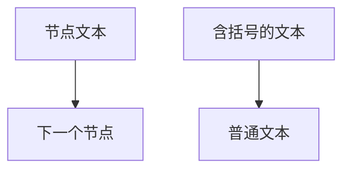

# 嵌入式Linux知识体系 — 写作规范与模板手册

> 版本：V2026.05.02
> 适用范围：全体写作组员
> 原则：**框架跟xlsx来，内容自己发挥，质量自己把关**

---

## 一、项目定位与目录结构

### 1.1 八大模块体系

| 编号 | 模块名 | 难度 | 定位 |
|------|--------|------|------|
| 01 | 硬件层 | B→E | 硬件基础 |
| 02 | Bootloader与启动 | B→E | 启动流程 |
| 03 | Linux内核与驱动 | I→M | **原理讲解**（内核子系统） |
| 04 | 系统构建与部署 | I→E | 交叉编译、固件更新 |
| 05 | 驱动开发 | B→M | **工程实战**（写代码、调试） |
| 06 | 内核调试与性能优化 | I→M | 崩溃分析、追踪 |
| 07 | 应用层 | B→E | 多线程、网络、容器 |
| 08 | 总线协议 | B→M | 片内/板级/工业总线 |

**03 vs 05 边界：**
- 03讲**原理**（驱动模型、中断机制、内存映射怎么工作）
- 05讲**实战**（怎么写字符设备驱动、怎么调ioctl、怎么排死锁）
- 03已有原理的，05不重复，直接上代码

### 1.2 目录命名规则

```
docs/
├── 01-硬件层/
│   ├── README.md              ← 模块概览（地图）
│   ├── CPU架构/
│   │   └── 23-01-CPU架构基础认知.md
│   └── ...
├── 03-Linux内核与驱动/
│   ├── README.md
│   ├── 进程管理/
│   ├── 内存管理/
│   ├── 驱动模型/
│   └── ...
└── stylesheets/
    └── extra.css
```

- 模块目录：`0N-模块名`（带编号前缀）
- 知识点子目录：**中文名，不用编号**
- 文件：`编号-标题.md`
- 编号规则：前两位=模块号，中间=知识点序号

---

## 二、排版硬标准（违反即打回）

### 2.1 核心公式

```
窄栏 + 短句 + <br> + --- 分隔 + 短语上色 = 呼吸感
```

| 元素 | 规则 | 示例 |
|------|------|------|
| **段落长度** | ≤4行，超出必须拆段 | 不行就拆 |
| **行内换行** | 用 `<br>` 标签 | `第一行<br>第二行` |
| **段落分隔** | 用 `---`（水平线） | 每节之间加 |
| **章标题** | `# 标题` **不加序号** | `# 进程管理` |
| **节标题** | `## 标题` **不加序号** | `## 核心定义` |
| **小标题** | `### <strong>标题</strong>` | `### <strong>调度器</strong>` |
| **子标题** | 不用 `####`，用 `<strong>` | `<strong>子点</strong>` |
| **表格** | 纯Markdown，**严禁 `<span>`** | `| 列1 | 列2 |` |
| **代码块** | 带语言标识，内部真实换行 | ` ```c ` |
| **ASCII框图** | **全部替换为 Mermaid** | ` ```mermaid ` |
| **引用块** | 只用于BIEM徽章行 | `> 📊 难度等级` |

### 2.2 绝对禁止

- ❌ 用 `**加粗**` 代替 `<span class="red">`（颜色标签才是语义化）
- ❌ 一段里标多个红色（每段只标1次核心概念）
- ❌ 表格内放 `<span>` 标签（表格纯文本）
- ❌ 代码块内用 `<br>`（代码块用 `\n` 换行）
- ❌ 正文中用 `>` 引用块（正文用普通段落+`<br>`）
- ❌ 加装饰性emoji（🔥🔵🟢等，一律换成span标签）
- ❌ 标题加序号（`## 1. xxx` 不允许）
- ❌ 口语化表达（"说白了""你可能会问"）

---

## 三、四色标记系统

### 3.1 颜色语义（必须严格遵守）

```html
<span class="red">核心概念</span>     ← 本段核心架构实体，每段只标1次，段首
<span class="green">技术术语/API</span>  ← 函数名、工具、协议、寄存器、命令
<span class="blue">关键结论/金句</span>  ← 过渡句、定义句、承上启下
<span class="orange">列表项标题</span>    ← 编号列表每个item开头
```

**关键规则：**
- `red`：每段最多1次，标在段首核心概念
- `green`：技术术语首次出现时标
- `blue`：关键结论句、金句、过渡句
- `orange`：有序列表的每个项标题（`<strong>1. xxx：</strong>`）
- **表格内严禁任何 `<span>` 标签**
- **代码块内严禁任何 `<span>` 标签**

### 3.2 CSS样式定义（extra.css中必须存在）

```css
/* === 亮色模式 === */
.md-typeset .red { color: #e53935 !important; font-weight: 600; }
.md-typeset .green { color: #2e7d32 !important; font-weight: 600; }
.md-typeset .blue { color: #1565c0 !important; font-weight: 600; }
.md-typeset .orange { color: #ef6c00 !important; font-weight: 600; }

/* === 暗色模式 === */
[data-md-color-scheme="slate"] .md-typeset .red { color: #ff8a80 !important; }
[data-md-color-scheme="slate"] .md-typeset .green { color: #69f0ae !important; }
[data-md-color-scheme="slate"] .md-typeset .blue { color: #82b1ff !important; }
[data-md-color-scheme="slate"] .md-typeset .orange { color: #ffd180 !important; }
```

---

## 四、BIEM难度分级系统

### 4.1 四级定义

```html
<span class="badge-b">**入门 (Beginner)**</span>    ← B
<span class="badge-i">**中级 (Intermediate)**</span>  ← I
<span class="badge-e">**高级 (Expert)**</span>         ← E
<span class="badge-m">**大师 (Master)**</span>          ← M
```

**用法位置：**
1. 每章开头（# 标题 后面第一行）
2. 每个小节开头（### <strong>xxx</strong> 下面）

### 4.2 CSS样式

```css
.md-typeset .badge-b { background: #e3f2fd; color: #1565c0; padding: 2px 8px; border-radius: 4px; font-size: 0.85em; }
.md-typeset .badge-i { background: #e8f5e9; color: #2e7d32; padding: 2px 8px; border-radius: 4px; font-size: 0.85em; }
.md-typeset .badge-e { background: #fff3e0; color: #ef6c00; padding: 2px 8px; border-radius: 4px; font-size: 0.85em; }
.md-typeset .badge-m { background: #f3e5f5; color: #7b1fa2; padding: 2px 8px; border-radius: 4px; font-size: 0.85em; }
```

---

## 五、章节结构模板

### 5.1 标准章节骨架

```markdown
# 章节标题

> 📊 **本章难度等级：** <span class="badge-i">**中级 (Intermediate)**</span>

---

## 核心定义与价值 [B→I]

---

### <strong>什么是xxx</strong>

<span class="badge-b">B</span><br>
<span class="red">核心概念</span>是...<br>
定义解释...<br>

<span class="blue">关键洞察：xxx是yyy的基石。</span><br>

---

## 核心机制原理解析 [I→E]

---

### <strong>机制一：xxx</strong>

<span class="badge-i">I</span><br>
<span class="red">机制名称</span>的工作流程...<br>

<span class="orange"><strong>1. 步骤一：</strong></span><br>
* <span class="green">术语/API</span> 解释...<br>

<span class="orange"><strong>2. 步骤二：</strong></span><br>
* 继续...<br>

```c
// 代码块带语言标识
// 文件路径：drivers/xxx/xxx.c
// 行号：123
void function_name(void) {
    // 逐行注释
}
```

<span class="blue">结论：xxx机制确保了yyy。</span><br>

---

## 技术教学与实战 [I]

---

### <strong>实战场景一：xxx</strong>

<span class="badge-i">I</span><br>
场景描述...<br>

```bash
# 命令示例
$ cat /proc/xxx
```

---

## 嵌入式专属实战场景 [I→E]

---

### <strong>场景一：xxx</strong>

<span class="badge-e">E</span><br>
嵌入式专属内容...<br>

---

## 历史演进与前沿 [E]

---

### <strong>xxx</strong>

<span class="badge-e">E</span><br>
历史和未来趋势...<br>
```

### 5.2 密度规则

| 密度 | 内容类型 | 目标 |
|------|----------|------|
| 高密度 | 命令、log、寄存器、配置项 | 精确到文件名和字段 |
| 中密度 | 代码片段、数据流、状态机 | 带读注释 |
| 低密度 | 架构图、设计思想、趋势 | 讲透设计理念 |

---

## 六、八条红线（质量自检）

生成文件后逐条打钩：

- [ ] **推导优先于结论** — 先讲"为什么需要"，再讲"是什么"
- [ ] **代码必须带读** — 文件路径 + 函数名 + 行号 + 逐行注释
- [ ] **严禁口语化** — 不用"说白了""你可能会问"
- [ ] **类比是盐不是主食** — 最多1次/小点，定义之后才能类比
- [ ] **术语首次出现必须解释** — 不能假设读者已知
- [ ] **深度优先，字数不设上限** — 讲清楚为止
- [ ] **认知递进**：场景 → 操作 → 原理 → 深挖 → 高级
- [ ] **每段只标1次红色核心概念**

---

## 七、Mermaid图表规范

### 7.1 使用场景

- 架构图 → `flowchart TD` 或 `flowchart LR`
- 时序图 → `sequenceDiagram`
- 状态机 → `stateDiagram-v2`
- 数据流 → `flowchart`

### 7.2 语法要点

```markdown

```

**关键规则：**
- 节点文本含中文括号、冒号、逗号时，必须加**双引号**
- `subgraph` 名称含特殊字符时加引号
- 不用 `~` 符号连接（部分版本不支持）

---

## 八、mkdocs.yml 维护规范

### 8.1 导航结构

```yaml
nav:
  - "首页": index.md
  - 3. Linux内核与驱动 [I→M]:
      - "概览": 03-Linux内核与驱动/README.md
      - 进程管理:
          - "03-01-文件.md": 03-Linux内核与驱动/进程管理/03-01-文件.md
```

### 8.2 YAML语法红线

- ❌ 禁止 `!!python/object:*` 和 `!!python/name:*` tag
- ❌ 文件名含中文冒号 `：` 或 `&` 时，导航项**必须加引号**
- ❌ `copyright` 行含 `&copy;` 时必须加引号
- ✅ 简单字符串不加引号，复杂字符串加引号

### 8.3 导航层级控制

- 每个模块一级子目录**不超过12个**
- 03模块精简后保留11个：linux简介、进程管理、内存管理、虚拟文件系统、设备树、驱动模型、中断子系统、时间子系统、电源管理框架、网络子系统、内核安全机制
- 05模块4个：设备驱动框架、用户态-内核态交互、中断处理DMA编程、并发与竞态

---

## 九、三栏布局CSS规范

### 9.1 布局目标

- 左侧导航栏 → **贴最左边缘**
- 右侧目录栏 → **贴最右边缘**，宽度240px+
- 中间正文 → **自动拉满**剩余宽度

### 9.2 关键CSS

```css
/* 整体容器宽度释放 */
.md-grid { max-width: 100% !important; margin: 0 !important; }

/* 左侧导航贴左 */
.md-sidebar--primary { width: 260px !important; left: 0 !important; }

/* 右侧目录贴右加宽 */
.md-sidebar--secondary { width: 240px !important; right: 0 !important; }

/* 中间正文拉满 */
.md-content { flex: 1 1 auto !important; max-width: none !important; }
```

---

## 十、常见错误对照表

| 错误 | 正确做法 |
|------|---------|
| 表格内放 `<span class="red">` | 表格内纯文本，颜色标在表格外 |
| 一段标3个红色 | 每段只标1个，位置在段首 |
| 用 `**加粗**` 代替颜色 | 用 `<span class="red">` 等语义标签 |
| 代码块内用 `<br>` | 代码块内用真实换行 `\n` |
| 用 🔵 emoji 代替颜色 | 用 `<span class="blue">` |
| 标题加序号 `## 1. xxx` | 标题不加序号 `## xxx` |
| 正文用 `>` 引用块 | 正文用普通段落+`<br>` |
| 类比每段都有 | 最多1次/小点，定义之后 |
| "说白了"/"你可能问" | 改为"本质上"/"核心差异在于" |
| 先给结论再推导 | 先讲痛点，再推导，最后给结论 |
| 文件名和路径对不上mkdocs.yml | 要么改文件名，要么改mkdocs.yml |
| Mermaid节点文本含括号不加引号 | 节点文本加双引号 `"文本"` |

---

## 十一、部署检查清单

每次交付前确认：

- [ ] mkdocs.yml 导航和实际文件路径一致
- [ ] extra.css 已替换最新版
- [ ] `mkdocs serve` 构建无错误
- [ ] 页面三栏布局正常
- [ ] 四色标记渲染正常（亮色+暗色模式）
- [ ] BIEM徽章显示正常
- [ ] Mermaid图表无红字报错
- [ ] 移动端（<960px）自动折叠正常

---

## 十二、从xlsx提取数据生成骨架

### 12.1 为什么要用xlsx

xlsx是知识体系的**唯一数据源**，包含8大模块的全部知识点、难度等级、内容方向。写作前必须读取xlsx确认：
- 知识点标题（第2列）
- 难度等级（BIEM）
- 内容正文（第8-10列，不同sheet活跃列不同）
- 颜色标记（哪些文字需要标红/绿/蓝/橙）

### 12.2 手动读取流程

**步骤1：定位目标sheet**

xlsx有多个sheet，每个模块对应一个sheet：
- `硬件层` → 01模块
- `Bootloader` → 02模块
- `Linux内核` → 03模块
- `系统构建` → 04模块
- `驱动开发` → 05模块
- `调试与优化` → 06模块
- `应用层` → 07模块
- `总线协议` → 08模块

用Excel或WPS打开xlsx，切换到对应sheet。

**步骤2：读取目录结构**

xlsx的前几列是目录骨架：
| 列 | 内容 | 用途 |
|----|------|------|
| Col0 | H1 章节标题 | 生成 `## 标题` |
| Col1 | H2 子章节 | 生成 `### <strong>标题</strong>` |
| Col2 | 知识点标题 | 生成文件标题 |

**步骤3：读取正文内容**

正文分散在多个列，不同sheet不同：
- 有的sheet正文在Col8
- 有的在Col9、Col10
- 需要逐行检查哪列有内容

**步骤4：处理格式**

xlsx里的格式不能直接复制到md：
- Excel里的换行符 → md里用 `<br>`
- Excel里的颜色 → 用 `<span class="red/green/blue/orange">` 替代
- Excel里的表格 → 纯Markdown表格，不加 `<span>`
- Excel里的代码 → md代码块，用真实换行

### 12.3 自动化脚本

xlsx目录下有多个辅助脚本：

| 脚本 | 用途 |
|------|------|
| `preview_xlsx.py` | 预览指定sheet的结构 |
| `extract_chapter3_v2.py` | 提取完整章节数据到JSON/Markdown |
| `generate_from_xlsx.py` | 自动生成md文件 |
| `run_colorize.py` | 批量上色 |

**标准操作流程**：

```bash
cd xlsx/

# 1. 预览sheet结构
python preview_xlsx.py

# 2. 提取数据
python extract_chapter3_v2.py

# 3. 生成骨架md
python generate_from_xlsx.py

# 4. 人工填充内容（这是你的主要工作）

# 5. 跑格式检查
python check_format.py "docs/目标目录/"

# 6. 批量上色
python run_colorize.py
```

### 12.4 注意事项

- xlsx里的 `<br>` 标签不能无脑复制，要换成真实换行
- xlsx里的 `<span class="xxx">` 在表格内要换成 `/* color */` 注释
- 有些sheet正文很空（只有标题没有内容），需要自主发挥
- 颜色标记在xlsx里是单元格背景色，转md时要手动加 `<span>` 标签

---

## 十三、驱动模型6方向示例

这是03模块驱动模型章节的完整示例，展示从骨架到成品的全过程。

### 13.1 6个方向划分

驱动模型按"认知流"分为6个文件：

| 编号 | 方向 | 内容重点 | 难度 |
|------|------|----------|------|
| 01 | 基础认知 | 是什么、为什么需要、核心概念 | B |
| 02 | 原理解析 | 数据结构、注册流程、匹配机制 | I |
| 03 | 技术教学 | 怎么写设备树、怎么注册驱动 | I |
| 04 | 实战场景 | GPIO-LED、UART、I2C传感器 | E |
| 05 | 进阶优化 | 热插拔、电源管理、设备链接 | M |
| 06 | 历史演进 | sysfs → devtmpfs → udev | M |

### 13.2 文件命名

```
docs/03-Linux内核与驱动/驱动模型/
├── 01-驱动模型基础认知.md
├── 02-核心驱动模型原理解析.md
├── 03-驱动开发核心技术教学.md
├── 04-软硬件实战场景.md
├── 05-驱动模型进阶与优化.md
└── 06-驱动模型历史演进与生态.md
```

### 13.3 典型段落示例（02-原理解析）

```markdown
# 核心驱动模型原理解析

> <span class="badge-i">**中级**</span>
> 理解设备、驱动、总线三者的关系，掌握注册与匹配的内核机制。

---

## <strong>核心定义</strong>

<span class="red">Linux驱动模型</span>用统一的框架管理所有硬件设备。

三要素缺一不可：
- <span class="green">device</span> — 描述硬件属性
- <span class="green">driver</span> — 描述操作逻辑
- <span class="green">bus</span> — 负责匹配

---

## <strong>数据结构</strong>

### <strong>device结构体</strong>

```c
// include/linux/device.h
struct device {
    struct device       *parent;        /* 父设备 */
    struct bus_type     *bus;           /* 所属总线 */
    struct device_driver *driver;       /* 绑定驱动 */
    void                *platform_data; /* 设备树数据 */
    // ... 更多字段
};
```

关键点：platform_data存放设备树解析后的数据。
```

### 13.4 交付检查

写完6个文件后，逐项确认：
- [ ] 每个文件开头有BIEM徽章行
- [ ] 每段只标1个红色核心概念
- [ ] 代码块带文件路径注释
- [ ] 代码块内用真实换行，不用 `<br>`
- [ ] Mermaid图表节点文本加双引号
- [ ] 表格内无 `<span>` 标签
- [ ] mkdocs serve 构建无报错

---

*总纲完。按此执行，质量自证。*

---

*本手册为项目唯一规范来源，按此执行，不再反复。*
