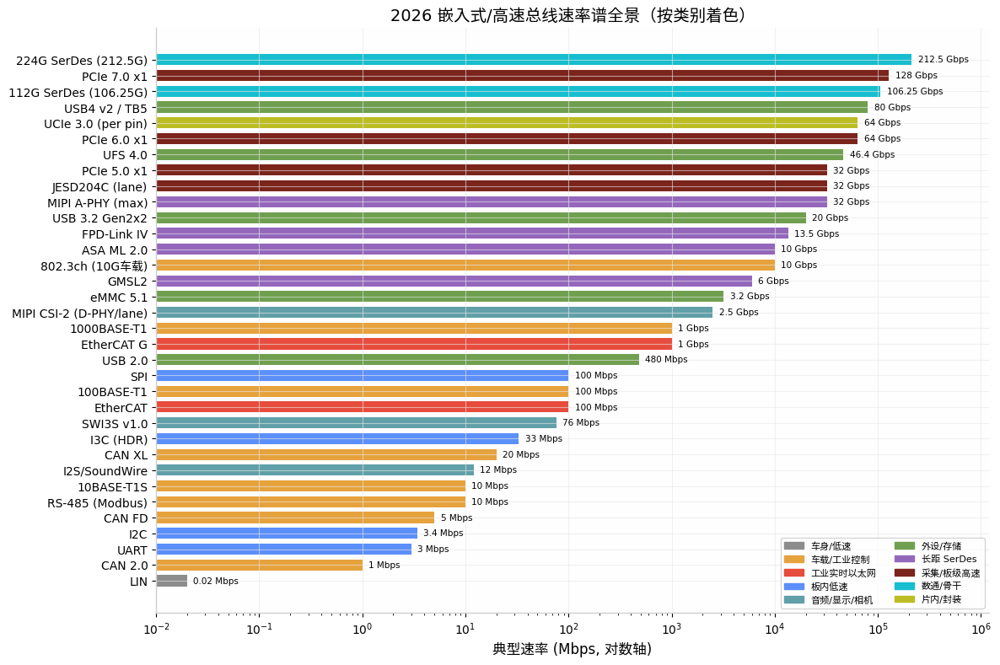
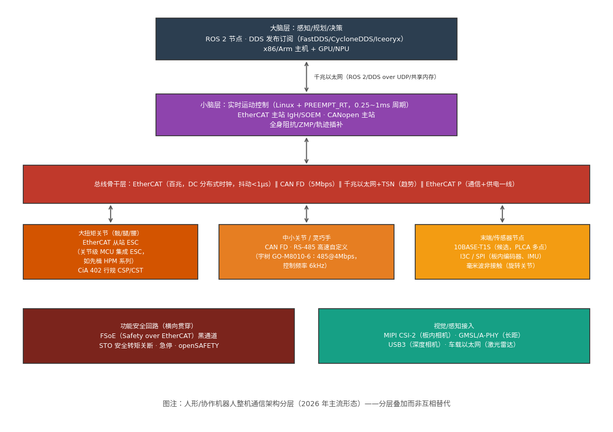

# 嵌入式 Linux 工程师的总线协议全景——2026 深度调研与 B 扩展重构写作大纲 v3

> 版本：v3（2026-08-13） | 前序版本：v2（用户上传大纲）
>
> 定位：本文同时回答三件事——(1) 2026 年嵌入式/高速领域哪些总线协议是前沿且必须掌握的；(2) 从数通仪器仪表、PCIe 卡行业转向机器人行业，总线协议知识怎么用、价值在哪；(3) B 扩展《总线协议》的重构写作大纲（在 v2 基础上的修订与增补）。
>
> 相对 v2 的主要变化：**机器人专项调研完成**（v2 中因搜索引擎 403 受阻、标注"待复核"的第 2.4 节，本轮已获得 2026 年 5-7 月的一手行业来源验证与大幅扩充）；PCIe/CXL/UCIe、车载、JESD204C 等方向复核到 2026 年最新状态；新增"总线协议知识构成方法论"一章，回答"总线协议到底包含哪些领域的内容"。

---

## TL;DR：核心结论（十句话版）

1. 2026 年总线协议的主旋律是**"PAM4 化 + 以太网化 + 分层化"**：高速侧 PCIe 6.0 进入正式合规验证阶段 [^80^]，低速侧 10BASE-T1S 开始从边缘节点收编 CAN/LIN/RS-485 [^90^]，中间层的专用现场总线被进一步挤压但不会消亡。
2. 对嵌入式 Linux 工程师，**"低速三板斧"（I2C/SPI/UART）仍是日常**，但要向 I3C 演进认知；**"高速三支柱"（PCIe/SerDes/以太网）决定身价上限**。
3. 机器人行业的总线真相是**分层叠加，不是单一总线**：EtherCAT 主干 + CAN FD/RS-485 末端 + 千兆以太网/TSN 上行 + ROS 2/DDS 软件层 [^54^][^28^]。
4. 2026 机器人关节通信的选型口诀已被行业总结为：**成本敏感选 CAN FD，精度优先选 EtherCAT，末端轻量化看 10BASE-T1S，原型验证用 RS-485** [^54^]。
5. EtherCAT 正在向关节侧下沉——关节级 MCU 已直接集成 ESC（EtherCAT 从站控制器），"一网到底"架构开始出现 [^54^][^67^]。
6. PCIe 卡行业读者要补的不是"更快的 PCIe"，而是**机制换代**：PAM4 + FLIT + FEC 三件套让 Gen6 成为 PCIe 二十年变化最大的一代 [^86^]，且 FLIT 模式一旦启用、降速也不退出 [^87^]。
7. CXL 在 2026 年进入规模化部署起点：三星 CXL 3.1 CMM-D 内存模组 Q3 出样、Q4 量产 [^71^]，三大原厂集体放弃自研控制器转向外购 [^79^]。
8. 数通仪器仪表行业的隐藏主线是 **JESD204C（采集主通道）+ 112G/224G SerDes（物理地基）+ CMIS（管理面）**，这三样恰好都是总线协议 [^107^][^109^][^141^]。
9. 车载方向五标准并存的 SerDes 战国时代已经定型：GMSL（开源化为 OpenGMSL）、FPD-Link、A-PHY、ASA、HSMT（中国标准），国产芯片 2026 年出货迈向千万级 [^93^][^97^]。
10. 总线协议对岗位的最大价值不在"会写驱动"，而在**排查话语权**：出问题时的第一排查手段、原理图评审的选型发言权、与硬件/FPGA 同事的共同语言。

---

## 第一部分：总线协议"包含什么内容"——一个方法论框架

在展开调研结论之前，先回答"总线协议到底包含哪些领域的内容"。这是列大纲之前的元问题。一个总线协议拆开看，永远是**五层内容的叠加**，任何一篇总线文章的深度都可以用这五个维度衡量：

| 维度 | 内容 | 典型问题 | 对应岗位能力 |
|---|---|---|---|
| **电气/物理层** | 电平标准、单端/差分、编码（NRZ/PAM3/PAM4/DME）、均衡（FFE/CTLE/DFE）、阻抗与拓扑 | 示波器上眼图为什么闭合？为什么要端接？ | 看懂原理图、配合 SI 工程师定位信号问题 |
| **链路/协议层** | 帧格式、仲裁、握手、流控、错误检测与重传（CRC/FEC/NAK） | CAN 仲裁怎么无损？PCIe FLIT 为什么要固定 256B？ | 逻辑分析仪/协议分析仪抓包定性 |
| **设备模型层** | 枚举/寻址、寄存器/对象字典、状态机 | CiA 402 控制字 0x6040 怎么驱动状态机？CMIS 的 Page 切换？ | 读得懂 datasheet，写得出初始化序列 |
| **软件/驱动层** | Linux 子系统归属（i2c/spi/can/pci 子系统）、设备树描述、DMA 与中断 | compatible 匹配到哪个驱动？MSI-X 怎么分？ | 驱动开发与内核调试 |
| **系统/应用层** | 选型 trade-off、实时性预算、拓扑设计、功能安全 | 这台机器人为什主干用 EtherCAT 而不是 CAN FD？ | 架构评审发言权、跨团队沟通 |

**这五层也是 B 扩展每篇文章的隐含骨架**：B 扩展讲前三层半（物理/协议/设备模型+应用场景），D 扩展讲第四层（Linux 驱动写法）——v2 大纲中"协议归 B、写法归 D"的分工原则在此得到方法论解释。

第二个元结论是**总线的分类轴**。2026 年看总线不再按"快/慢"一维分类，而是按**五个生态位**分类，每个生态位有自己的技术逻辑和玩家：

1. **片内/封装内**：AMBA（APB/AHB/AXI/CHI）、TileLink、UCIe —— 设计者视角，驱动工程师只需认知。
2. **板内低速**：I2C/I3C、SPI、UART、GPIO/PWM —— 嵌入式日常，I3C 是演进方向 [^125^]。
3. **板级高速**：PCIe/CXL、USB、JESD204、MIPI CSI/DSI —— 吞吐与采集主通道。
4. **设备间/现场**：CAN 家族、RS-485/Modbus、EtherCAT、PROFINET、车载以太网、LIN —— 实时性、可靠性、抗干扰优先。
5. **长距/背板/光**：车载 SerDes（GMSL/A-PHY 等）、112G/224G SerDes、以太网光口 —— 信号完整性主导。

下图给出 2026 年主要总线的速率谱全景（对数轴），可以直观看到各生态位的速率跨度和重叠竞争区：

重叠区即"战场"：10Mbps 档 10BASE-T1S 与 CAN FD 贴身竞争 [^90^]；百兆到千兆档 EtherCAT 与车载/工业以太网（TSN）竞争；32Gbps 档 JESD204C、PCIe 5.0、A-PHY 共用同一代 SerDes 技术。

---

## 第二部分：2026 前沿调研结论（六大方向复核）

### 2.1 板级高速互连：PCIe 6.0 落地元年、CXL 产品化、UCIe 3.0 规模应用

**PCIe 6.0 的行业阶段判断**：PCI-SIG DevCon 2026 的共识是，行业已经从讨论"要不要做"进入讨论"怎么验证"——2022~2024 年是 PHY 与 PAM4 bring-up 阶段，2024~2025 年是大规模互操作验证阶段，2026 年正式进入**合规验证（Compliance）阶段**，测试设备（如 SerialTek Kodiak）已获得 PCI-SIG Gold Suite 认证 [^80^][^77^]。机制层面的三个关键变化必须成体系地讲：

- **PAM4 取代 NRZ**：每符号 2 bit，相同波特率带宽翻倍，代价是 SNR 容忍度下降约 9dB、眼高压缩为 NRZ 的 1/3，对 PCB 阻抗、连接器插损、电源完整性的要求全面收紧 [^78^]。
- **FLIT 固定包**：256 字节 FLIT 成为标准传输单元（242B 载荷 + 8B CRC + 6B FEC），因为 FEC 只能作用于定长包；**FLIT 模式一旦协商启用，即使链路降速也不会退出 FLIT 模式**——这意味着 PCIe 6.0 设备的所有低速率回退路径也跑 FLIT [^84^][^87^][^85^]。
- **轻量 FEC + CRC + 重放**：首误码率（FBER）放宽到 10⁻⁶，靠 3 路交织 FEC 先纠、CRC 后检、NAK 触发 FLIT 粒度重放兜底，目标 FIT 约 5×10⁻¹⁰；实测平均错误恢复延迟降低 40% 以上 [^85^][^78^]。

对软件工程师的一个直接事实：**Linux 内核 5.18+ 才有初步 PCIe 6.0 支持，`lspci -vvv` 尚不能完整解析 6.0 专属寄存器字段**，一线排障仍要依赖厂商 SDK 或 PCI-SIG 合规套件 [^78^]——这正是 PCIe 卡行业读者的日常痛点。

**路线图**：PCIe 7.0（128 GT/s，x16 双向 512 GB/s）规范已发布，Cadence 等已推出 PCIe 6.0/7.0 + CXL 3.2 全栈 IP；**PCIe 8.0（256 GT/s，x16 约 1TB/s）预计 2026 年推出 0.5 版本规范、2027 年升级 1.0** [^82^][^83^][^86^]。PCIe 7.0 还首次引入光学工作组方向的研究 [^86^]。

**CXL 产品化时间线**（2026 年关键转折）：

| 时期 | 版本/事件 | 能力 |
|---|---|---|
| 2025 及以前 | CXL 1.1/2.0 | 直连内存扩展、一级池化（机架内 4-5 台服务器） |
| 2026 Q3-Q4 | 三星 CXL 3.1 CMM-D 出样→量产（单通道 72GB/s、容量至 1TB） | Fabric、P2P、4K 节点 [^71^][^74^] |
| 2026 年 7 月 | 三星/SK 海力士/美光集体放弃自研 CXL 控制器商业化，转向外购（澜起等独立芯片商受益） | 2026 是规模化部署起点，2027 为规模商用元年 [^79^] |
| CXL 3.2（规范已发布） | CHMU 热范围监控单元，把页面访问跟踪卸载到内存设备 | OS 级内存分级管理 [^81^] |
| 2027 以后 | CXL 4.0 规划 | 多机架池化、1.5TB/s [^74^] |

**UCIe 3.0**（2025-08 发布，2026 进入规模应用）：每 pin 速率 32→48/64 GT/s（靠 16GHz 基频 + 90° 相位偏移的 QDR 信令实现）、支持运行时重校准、边带信号延伸至 100mm、早期固件下载 [^73^][^75^]。3nm UCIe 3.0 PHY/Controller IP 预计 2026 上半年出样、2027 首批商用芯片出货 [^76^]。同时**中国首批芯粒国家标准 GB/T 46280.1~.5-2025 已于 2026 年 3 月 1 日实施**（HiPi 联盟牵头，海思、中兴微等 33 家参编） [^76^]。

层级分工定论（v2 结论复核成立）：**UCIe = 封装内连廊、PCIe = 板级公路、CXL = 一致性交通规则、NVLink = GPU 私有通道**。

### 2.2 SerDes 公共地基：112G 当下、224G 门口、CPO 上量

- **112G PAM4**（有效 106.25Gbps）是当前 51.2T 交换芯片（Tomahawk 5、Spectrum-4）的标配，支撑 800G 以太网（802.3df，8×112G） [^113^][^109^]。
- **224G PAM4**：Nyquist 频率 56GHz，IEEE 802.3dj 覆盖 1.6T 与二代 800G（4×200G），预计 2026 年冻结、2028 年商用 [^113^][^120^]。PCB 层面标准 FR4 直接出局，Megtron 7 级超低损耗板材（Df≤0.002）、背钻 stub ≤8mil、差分阻抗公差 ±5% 成为强制要求 [^110^][^122^]。
- **CPO 共封装光学**：2026 年 OFC 上已有 212.5Gbps PAM4 SerDes 线速的光引擎产品（Lightmatter Passage L20，单向 6.4Tbps，2026 年底出样） [^112^]；CPO 可使功耗降 30%、密度提升 2 倍 [^120^]。
- **均衡三件套**（FFE/CTLE/DFE）是所有 PAM4 高速总线（PCIe 6/7、224G 以太网、JESD204C 高速档）的共用技术——这就是为什么 B 扩展需要一篇独立的"SerDes 通识"作为地基篇 [^78^][^107^]。

### 2.3 高速采集主通道：JESD204C 定稿格局，204D 已在视野内

JESD204C 相对 204B 的变化清单（写作时可直接作骨架） [^107^][^114^][^108^]：

| 维度 | JESD204B | JESD204C |
|---|---|---|
| 通道速率上限 | 12.5 Gbps | **32 Gbps** |
| 编码 | 8b/10b（20% 开销） | **64b/66b**（约 3% 开销，另有 64b/80b 选项） |
| 同步信号 | SYNC~ 拉低请求 + K.28 CGS + ILAS | **取消 SYNC~**，同步头/扩展多块同步用 32 位同步字，错误报告移交应用层软件 |
| 确定性延迟 | SYSREF 对齐 LMFC，子类 0/1/2 | SYSREF 对齐 **LEMC**，64 位模式下仅子类 1 |
| 链路稳健性 | 无 FEC | 可选 FEC（法尔码，可纠 9bit 突发错误）、物理层分 B/C 类（C 类再分 C-S/C-M/C-R） |

工程调试心法（来自一线实践，适合直接入篇）："先时钟、后数据；先低速、后高速；先单通道、后多通道"；确定性延迟不固定时按 SYSREF 抖动→LEMC 复位→弹性缓冲区 RBD 的顺序排查 [^108^]。国产 IP 侧已有 16/28Gbps 的 JESD204B/C PHY+Controller 完整方案 [^115^][^107^]。注意 **JESD204D 已被提及为下一版本** [^108^]，写作时应留好版本演进接口。

### 2.4 车载总线：CAN XL 入标、10BASE-T1S 上位、SerDes 五标准定型

**CAN 家族三代同堂**（2026 年状态）：

| 代际 | 速率/载荷 | 2026 状态 |
|---|---|---|
| CAN FD / CAN SIC | 数据段 5-8Mbps、64B | 当前量产主力；SIC 收发器解决振铃、支持复杂拓扑 [^103^] |
| CAN XL | **20Mbps、2048B 载荷**、可承载以太网帧、CANsec 可选安全 | **已进入 ISO 11898-2:2026**；NXP/英飞凌/ST/瑞萨/Bosch 均有 MCU/收发器布局；2025-02 已有 ASIL-B CAN XL IP 授权给国际车企 [^103^][^106^][^104^] |

CAN XL 的战略定位：结合 CAN 的成本与以太网的载荷能力，跑 TCP/IP、支持面向服务通信，是 Zonal 架构下低速网的候选方案 [^96^]。

**10BASE-T1S（IEEE 802.3cg）**：10Mbps、单对双绞线、多点 25 米至少 8 节点、DME 编码、**PLCA 物理层冲突避免**（时分轮询、无冲突半双工） [^105^][^90^]。2026 年的产业信号非常密集：Microchip 披露其 10BASE-T1S 方案**已在现代汽车下一代平台完成验证**；TI/ADI/英飞凌/NXP/安森美全部有产品 [^90^]。三条产品路线值得入篇——Microchip/TI 的 MAC-PHY 一体（SPI 接口，低端 MCU 不换芯即上网，如 LAN8650/DP83TD555J-Q1）、ADI 的 E2B（边缘节点**去掉本地 MCU**，软件集中到区域控制器）、英飞凌/NXP 的交换机集成与 ASIL-B 功能安全路线 [^90^][^92^]。行业判断：**RS-485 阵地比 CAN 更可能率先被 T1S 收编**（协议碎片化、无原生安全） [^90^]。

**TSN 子协议族**（车载与工业共用）：802.1AS（gPTP，P2P 逐跳测量，MAC 硬件时间戳精度 4ns，全网偏差 <100ns）、802.1Qbv（TAS 时间感知整形，门控列表）、802.1Qbu（帧抢占，高优先级帧中断低优先级帧全程 <10μs）、802.1CB（帧复制消除冗余）、802.1Qci（逐流过滤管制） [^3^][^1^][^12^]。2026 年的新现象是 **TSN 自动化设计工具链产品化**（仿真→配置→硬件在环测试闭环），说明 TSN 正从研究走向量产工程 [^6^][^2^]。

**车载 SerDes 五标准格局**（复核 v2，结论成立且有新数据）：

| 标准 | 主导方 | 2026 状态 |
|---|---|---|
| GMSL → **OpenGMSL** | ADI（2025 开源） | CES 2026 上已有第三方芯片与 ADI GMSL2 互通演示 [^99^] |
| FPD-Link | TI | 私有协议存量最大 |
| MIPI A-PHY | MIPI 联盟 | 最高 32Gbps/15m，超 7 家硅供应商，Sony/豪威推进传感器内集成 [^100^] |
| ASA Motion Link | 宝马/丰田等 | 2.0 非对称（下行 10G/上行 100M） |
| HSMT | 中国行业标准 | 瑞发科已量产 20+ 款、累计出货超 1700 万颗 [^93^] |

国产替代是 2026 年的显著变量：首传微 VL77XX 系列（2G-16G）同时兼容 A-PHY/HSMT/OpenGMSL 三大公有协议，领克 06 量产上车后，第二款吉利系车型（银河星愿）已量产 [^93^][^99^]。吉利汽车 2026 年发布的车载 SerDes 白皮书把格局明确为"1 私有 + 5 开放"（含 IEEE P802.3dm） [^97^]。

**LIN**：车身低速网事实标准（20Kbps 级），短期内与 CAN 一起在极低成本节点保留 [^89^][^90^]——B 扩展补 LIN 篇的判断不变。

### 2.5 低速板级与消费接口：I3C 接棒、USB4 v2/雷电 5、SoundWire I3S

- **I3C**：12.5MHz SDR / HDR 模式最高约 33-100Mbps、动态寻址、带内中断（IBI）、热接入、推挽驱动降功耗，向下兼容 I2C（10bit 扩展地址除外） [^125^][^126^][^130^]。除传感器外，**SSD 内部管理总线也在转向 I3C**（替代 I2C/SPI/UART 的板内管理角色） [^130^]。写作定位：I2C 四篇不动，I3C 三篇扩充"为什么取代 I2C/SPI"的系统性论证。
- **USB4 v2 / 雷电 5**：80Gbps 对称、120/40Gbps 非对称，采用 **PAM-3**（每符号约 1.58bit）而非 PAM-4——消费级 USB-C 连接器与热插拔场景下三电平是"够快但不让铜线崩溃"的精算妥协 [^129^]。雷电 5 把 USB4 v2 的选配项全部强制化（80G 对称起步、必须支持 120G 非对称、PCIe 隧道保底 64Gbps、240W 供电） [^129^][^132^][^128^]。隧道化架构（PCIe/DP/USB3 共线）是嵌入式读者要理解的唯一重点，设备端一般不会自行实现整套协议栈 [^124^]。
- **音频接口**：MIPI **SWI3S v1.0**（SoundWire I3S，2025 年通过）统一控制与数据传输、双线差分、76 MSymbol/s，定位移动/消费/汽车音频，IP 已开始授权 [^148^][^163^]——B-D.13 音频三篇补 SoundWire 小节时以此为最新内容。

### 2.6 数通管理面（用户当前岗位直接相关）：CMIS 是"藏在光模块里的总线"

数通仪器/测试行业读者每天打交道但未必意识到是"总线协议"的东西：**SFP/QSFP 的管理接口统一是 I2C/SMBus 之上的寄存器规范**——SFP/SFP+ 用 SFF-8472（地址 0x50/0x51）、QSFP 用 SFF-8436/8636、QSFP28/QSFP-DD/OSFP 用 **CMIS**（地址 0x50 + Page 切换） [^137^][^141^]。CMIS 5.x 已从简单内存映射演进为**带状态机的管理体系**（Low Power→Ready→Application Selected），并扩展到 CPO/ELSFP 共封装器件的管理 [^139^][^143^]。一线事实：99% 的"模块不兼容"不是光学问题，而是 I2C/CMIS 管理面校验（Vendor/PN/白名单/Application Code/状态机）失败 [^137^]。这类内容在 v2 大纲中没有对应篇目，**v3 建议新增**（见第四部分大纲）。

---

## 第三部分：机器人行业总线地图（v2 缺口补完，本轮重点）

> v2 说明"机器人专项检索被拒，基于领域知识撰写待复核"。本轮已获得 2026 年 5-7 月的行业一手来源，以下结论均有出处。

### 3.1 关节模组通信：六种方案的真实格局

芯查查 2026-05 的关节模组通信方案横评给出当前主流候选：**SPI/UART、I2C/I3C、RS-485、CAN FD、EtherCAT、10BASE-T1S**，并明确"分层叠加使用"是实际产品形态——主干 EtherCAT、末端关节 CAN FD、关节内部编码器 SPI [^54^]。

四种主力方案的工程画像：

| 方案 | 实时/同步能力 | 成本 | 典型用途 | 代表事实 |
|---|---|---|---|---|
| **RS-485 高速自定义** | 一主多从轮询、无仲裁开销、带宽利用率极高；但无硬件防冲突，从机"抢话"即总线崩溃，靠主控超时重发兜底 | 最低 | 四足/人形关节、原型验证 | 宇树 GO-M8010-6：高速 485 @ **4Mbps**、控制频率 **6000Hz** [^48^][^43^] |
| **CAN FD（+自有协议或 CANopen）** | 硬件仲裁无损、抗突发电磁干扰强；仲裁 ID + 校验开销大，1kHz 级强同步场景力不从心 | 低 | 协作臂、AGV 舵轮、灵巧手 | AGV 驱动器普遍 CANopen（DS301+DS402） [^31^][^38^] |
| **EtherCAT** | 飞读飞写 + DC 分布式时钟，多轴 μs 级同步抖动，250μs~1ms 控制周期 | 高（ESC 成本） | 高端关节主干、大扭矩关节 | 关节级 MCU 已集成 ESC，双 PHY 单硬件同时支持 EtherCAT/CAN FD/RS-485（匠芯创 M76H06） [^67^] |
| **10BASE-T1S** | 10Mbps 多点 + PLCA 无冲突轮询，原生 IP | 中 | 末端/传感器节点（候选，2027 年起量产整机可见） | ADI/TI 已在人形机器人白皮书推荐用于末端节点 [^54^] |

**三条已观测到的演进趋势**（可直接作为大纲中"前沿判断"小节） [^54^]：

1. **EtherCAT 向关节侧下沉**：先楫半导体 HPM500 系列等关节级 MCU 直接集成 ESC，编码器接口向 EtherCAT P（通信+供电一线）发展，"一网到底"成为可能。
2. **10BASE-T1S 从汽车迁移到机器人末端**：汽车 Tier 1 进入人形机器人赛道带来量产技术积累，预计 2027 年起出现在量产整机。
3. **毫米波非接触通信进入持续旋转关节**：解决腰部等旋转关节的线束缠绕/触点磨损，支持 EtherCAT/CAN FD/USB/RS-485 双向透传，最高可扩至 3Gbps（深圳德氪微等已有展示）。

量产背景：TrendForce 预估 2026 年中国人形机器人产量同比增长 **94%**，头部企业出货从数千台跃升至万台以上——关节模组厂商被迫用"一套硬件覆盖多总线"来压缩 SKU（如 M76H06 双 PHY 方案） [^67^]。

### 3.2 整机架构：一台人形机器人的通信分层

以宇树 H2 官方接口文档为标本：机身关节电机用 **485 和 CAN**，视觉链路有 **GMSL** 视频输入，算力单元之间是**千兆以太网**，外设 USB3.0，灵巧手接口标配 **RS-485 + USB2.0**（可选百兆以太网） [^44^]。这印证了分层模型：

- **大脑层**：ROS 2 节点 + DDS 发布订阅。DDS 中间件实测延迟：共享内存方案 Iceoryx 2.4μs、FastDDS 3.95μs，网络方案 CycloneDDS 7.35μs；硬实时系统中**延迟可预测性比绝对值更重要** [^41^]。
- **小脑层（实时控制层）**：Linux + **PREEMPT_RT** 实时内核上跑 EtherCAT 主站（IgH/SOEM），执行全身阻抗/ZMP/轨迹插补，控制周期 250μs~1ms [^28^]。
- **总线骨干层**：EtherCAT（主导多轴同步）或 CAN FD，趋势是千兆以太网 + TSN 构成确定性骨干 [^28^][^54^]。
- **关节/末端层**：见 3.1 四方案格局。
- **功能安全回路（横向贯穿）**：FSoE（Safety over EtherCAT）黑通道原则——安全帧与标准通信共存于同一介质，急停/STO 不依赖主控软件；工业侧另有 openSAFETY。
- **视觉/感知接入**：MIPI CSI-2（板内）、GMSL/A-PHY（长距相机）、USB3（深度相机）、车载以太网（激光雷达） [^44^]。

### 3.3 必须掌握的两个"行规级"知识块

**CiA 402 驱动行规**（伺服控制的普通话）：起源于 CANopen，被 EtherCAT（CoE）、POWERLINK 等广泛采用，是 IEC 61800-7 的组成部分 [^5^][^8^][^10^]。核心三件套：

- **对象字典**：通信参数 + 制造商参数 + 行规参数；0x6040 控制字（发命令）、0x6041 状态字（读状态）、0x6060 操作模式（位置/速度/转矩） [^4^]。
- **状态机**：Switch on disabled → Ready to switch on → Switched on → Operation enabled（+Quick stop/Fault），控制字命令 0x06/0x07/0x0F/0x02/0x80 驱动迁移，**顺序不可乱** [^8^][^10^]。
- **运行模式**：轮廓位置/速度/转矩 + 周期同步模式（CSP/CSV/CST，机器人关节主用 CSP/CST）+ 回零 [^9^]。

**EtherCAT 主从开发生态**：主站侧 IgH（开源、Linux/PREEMPT_RT）与 SOEM（轻量开源）是机器人行业事实标准，商用有 TwinCAT 3、Acontis EC-Master [^9^][^28^]；从站侧 Beckhoff SSC 从站栈（含 ETG.6010 的 CiA402 示例）+ ESC 芯片/集成 ESC 的 MCU [^22^]。EtherCAT 状态机 Init→Pre-Op→Safe-Op→Op 与邮箱协议族（CoE/EoE/FoE/SoE/AoE）是排障时的第一地图 [^14^][^21^]。

### 3.4 对转行者的学习次序建议

1. **先 CAN FD + CANopen/CiA 402**（两周可上手，AGV/协作臂面试必问）；
2. **再 EtherCAT 原理 + IgH/SOEM 主站实操**（用 SOEM + 廉价从站开发板跑通 Op 态与 DC 同步，这是机器人嵌入式岗的硬通货）；
3. **并行建立 ROS 2/DDS 与实时 Linux 认知**（理解"大脑-小脑"分界与 QoS 策略 [^27^][^41^]）；
4. **最后补 TSN 与 10BASE-T1S**（判断行业风向用，2027 前不是上岗刚需）。

---

## 第四部分：岗位价值分析——总线协议在三个行业怎么用

| 岗位场景 | 日常打交道的总线 | 总线知识变现为价值的具体方式 |
|---|---|---|
| **数通仪器仪表（当前）** | JESD204C、PCIe、I2C/SMBus（CMIS/SFF-8472）、SPI、112G SerDes、Aurora/自定义 FPGA 链路 | JESD204C 链路调试（同步字/LEMC/确定性延迟 [^108^]）；光模块"不兼容"定位到 CMIS 管理面而非光学面 [^137^]；SPI 降速保加载等现场救急；看懂 SerDes 眼图与均衡参数 |
| **PCIe 卡行业（当前/并行）** | PCIe Gen4/5/6、CXL、I2C（带外管理）、SMBus | 枚举/配置空间排障；Gen6 FLIT 模式"降速不退出"等行为差异定位 [^87^]；`lspci` 解析不了的寄存器用厂商 SDK 兜底 [^78^]；LTSSM 状态机定位链路训练失败；CXL Type 2/3 设备形态认知抓住产品窗口 [^71^][^79^] |
| **机器人行业（目标）** | EtherCAT、CAN FD/CANopen、RS-485、10BASE-T1S、MIPI CSI-2/GMSL、千兆以太网/TSN | EtherCAT 主站搭建与 DC 抖动分析（面试硬通货）；CiA 402 对象字典/状态机调试伺服；关节通信选型评审发言权（成本选 CAN FD、精度选 EtherCAT [^54^]）；FSoE 安全回路认知；视觉传感器接入 |
| **通用元能力** | 全部 | 原理图评审定调；逻辑分析仪/示波器时序定性；问题快速分层（电气/协议/驱动/业务）；与硬件、FPGA、测试同事的同语言沟通 |

一条贯穿三行业的观察：**低速管理总线（I2C/SMBus）在每个行业都是"隐形主战场"**——数通里是 CMIS/SFF-8472，PCIe 卡里是带外管理，机器人里是编码器/IMU 的 SPI/I3C。高速总线决定产品性能上限，低速总线决定调试效率下限。

---

## 第五部分：B 扩展重构写作大纲 v3

### 5.1 相对 v2 大纲的修订点

| # | v2 状态 | v3 修订 | 依据 |
|---|---|---|---|
| 1 | 第 2.4 节机器人内容为领域知识、待复核 | **已复核并扩充**为本文第三部分：关节四方案格局、三条演进趋势、H2 整机标本、CiA 402/EtherCAT 生态均获 2026 年来源支撑 | [^54^][^44^][^67^][^48^] |
| 2 | B-E.15.3 机器人关节总线篇 | 内容清单扩充：新增"关节级 MCU 集成 ESC（双 PHY 一硬件三协议）"、"10BASE-T1S 末端迁移（2027 量产预判）"、"毫米波非接触旋转关节"三个前沿小节 | [^54^][^67^] |
| 3 | B-F.16.2 当代 PCIe 篇 | 新增"行业阶段"框架（bring-up→互操作→**合规验证**，2026 定位）与 PCIe 7.0/8.0 路线图（8.0 规范 0.5 版预计 2026） | [^80^][^82^] |
| 4 | B-F.16.3 CXL 篇 | 补充 2026 产品化时间线（三星 CXL 3.1 CMM-D Q3 出样/Q4 量产；原厂弃自研控制器）与 CXL 3.2 CHMU | [^71^][^79^][^81^] |
| 5 | B-A.1.3 Chiplet 篇 | 补充 UCIe 3.0 的 QDR 信令机制与中国芯粒国标 GB/T 46280（2026-03 实施） | [^73^][^76^] |
| 6 | B-D.14.1 车载以太网与 TSN 篇 | 补充 TSN 工具链产品化现象、802.1Qbu 帧抢占 <10μs 实测量级、gPTP 4ns 硬件时间戳 | [^6^][^3^] |
| 7 | B-D.14.3 CAN XL 篇 | 更新状态：**CAN XL 已进入 ISO 11898-2:2026**，可据此从"前瞻"改为"入标待量产"口径 | [^103^] |
| 8 | B-D.14.4 车载 SerDes 篇 | 补充国产替代数据（瑞发科 HSMT 超 1700 万颗、首传微三协议单芯片、CES 2026 OpenGMSL 互通）与吉利白皮书"1 私有+5 开放"格局 | [^93^][^99^][^97^] |
| 9 | B-F.16.4 JESD204C 篇 | 补充一线调试心法（先时钟后数据等三原则、确定性延迟排查顺序）、国产 IP 现状；标注 JESD204D 已在视野内 | [^108^][^115^] |
| 10 | B-F.16.5 USB4 篇 | 补充 PAM-3 选型逻辑（为何不用 PAM-4）、雷电 5"选配变强制"对照表 | [^129^][^128^] |
| 11 | B-D.13 音频篇 SoundWire 小节 | 以 SWI3S v1.0（2025 通过，76 MSymbol/s、双线差分）为最新内容 | [^148^] |
| 12 | **新增篇目** | 见 5.3 新增表第 17-19 篇 | 本轮调研新发现 |

### 5.2 存量篇目处置（沿用 v2，不重列）

54 篇存量的处置表（风格重写 + 定点扩写）维持 v2 第 3.2 节不变。v2 的三条总原则（存量保留骨架逐篇重写、协议归 B 写法归 D、编号连续补断档）继续有效。每篇格式规范沿用 v2 第 3.5 节五件套 + "第一排查手段"锚点，并建议把本文第一部分的"五层维度表"作为每篇自查的隐含骨架。

### 5.3 新增篇目清单 v3（16+3 = 19 篇）

**B-C 补缺口（5 篇，沿用 v2，内容按 5.1 修订刷新）**

| 编号 | 篇目 | 难度 | 核心内容（v3 刷新版） |
|---|---|---|---|
| B-D.12.1 | 工业以太网总览与选型地图 | [I] | EtherCAT/PROFINET/EtherNet-IP/Powerlink/Modbus-TCP 定位；实时等级轴；EtherCAT 在机器人行业的统治现状 [^54^] |
| B-D.14.1 | 车载以太网与 TSN | [E] | 100/1000BASE-T1、10BASE-T1S 多点与 PLCA [^90^][^105^]、802.1AS/Qbv/Qbu/CB/Qci 族 [^1^][^3^]、Zonal 架构、TSN 工具链 [^6^] |
| B-D.14.2 | LIN 总线 | [B] | 主从轮询、调度表、车身定位；在 T1S 收编趋势下的保留逻辑 [^89^] |
| B-D.14.3 | CAN XL 与功能安全总线 | [E] | CAN XL 帧格式/20Mbps/2048B/以太网承载/CANsec；**已入 ISO 11898-2:2026** [^103^][^104^]；FSoE 黑通道与 openSAFETY |
| B-D.14.4 | 车载 SerDes：GMSL/FPD-Link/A-PHY/ASA/HSMT | [E] | 长距非对称原理；五标准格局与开放化（OpenGMSL/HSMT） [^97^]；国产化数据 [^93^][^99^]；机器人视觉链路复用（H2 的 GMSL 输入 [^44^]） |

**B-D 扩编（2 篇，沿用 v2 + 修订 5）**

| 编号 | 篇目 | 难度 | 核心内容 |
|---|---|---|---|
| B-A.1.2 | AXI 深入与 NoC 认知 | [M] | AXI4 五通道、outstanding/乱序、QoS；NoC 拓扑；对驱动开发者的可见面 |
| B-A.1.3 | 缓存一致性互连与 Chiplet：ACE/CHI/UCIe | [M] | 一致性为什么需要；UCIe 3.0（48/64G、QDR、运行时重校准） [^73^]；中国芯粒国标 [^76^]；CXL 内存语义的前提 |

**B-F 高速互连与 SerDes 前沿（6 篇，沿用 v2 + 修订 3/4/9/10）**

| 编号 | 篇目 | 难度 | 核心内容 |
|---|---|---|---|
| B-F.16.1 | SerDes 通识：PAM4、均衡与信号链 | [E] | NRZ→PAM4（SNR 代价 9dB [^78^]）、FFE/CTLE/DFE、眼图、FEC 取舍、112G→224G 路线图与 PCB 材料约束 [^109^][^122^]、CPO 认知 [^112^] |
| B-F.16.2 | 当代 PCIe：Gen4/5/6 演进与行业阶段 | [E] | PAM4/FLIT/FEC/L0p；FLIT 降速不退出 [^87^]；合规验证阶段的测试生态 [^80^]；PCIe 7.0/8.0 路线图 [^82^]；Linux 5.18+ 支持现状与 lspci 局限 [^78^] |
| B-F.16.3 | CXL：内存语义互连 | [M] | io/cache/mem 三协议、Type 1/2/3、池化与 P2P；2026 产品化时间线 [^71^][^79^]；CXL 3.2 CHMU [^81^] |
| B-F.16.4 | JESD204C：高速采集主通道 | [M] | 64b/66b 与同步字、SYSREF/LEMC、多芯片同步；调试三原则与故障表 [^108^]；仪器采集链路全景（ADC→204C→FPGA→PCIe→主机） |
| B-F.16.5 | USB4 与隧道化 | [I→E] | 隧道化架构、PAM-3 逻辑 [^129^]、雷电 5 强制项对照 [^128^]、对嵌入式的有限影响 |
| B-F.16.6 | 板间与 FPGA 互连：Aurora 与自定义 SerDes 协议 | [M] | Aurora 8B/10B·64B/66B、FPGA GT 收发器、数通测试产品自定义链路设计模式 |

**B-E 机器人专题扩编（3 篇，沿用 v2 + 本轮实证素材）**

| 编号 | 篇目 | 难度 | 核心内容 |
|---|---|---|---|
| B-E.15.3 | 人形机器人关节总线：EtherCAT 主从实战 | [M] | IgH/SOEM 主站、ESC 从站、CiA 402 对象字典与状态机 [^4^][^8^]、DC 同步实测；关节通信四方案格局与"一网到底"趋势 [^54^][^67^] |
| B-E.15.4 | 机器人整机通信架构设计 | [E] | 分层选型（关节/视觉/骨干） [^44^]；实时域与非实时域隔离；ROS 2/DDS 与底层总线衔接（中间件延迟实测 [^41^]）；10BASE-T1S 与毫米波的前瞻判断 [^54^] |
| B-E.15.5 | 数通测试仪器内部总线架构 | [M] | 流量测试仪标本：前面板 100G MAC/SerDes、FPGA 间 Aurora、JESD204C 采集、管理面 I2C/CMIS 全景拆解 |

**v3 全新增（3 篇，本轮调研新发现驱动）**

| 编号 | 篇目 | 难度 | 核心内容 | 立项理由 |
|---|---|---|---|---|
| B-D.17.1 | 光模块管理面总线：SFF-8472/SFF-8636/CMIS | [I] | I2C/SMBus 之上的寄存器规范、地址与 Page 机制、CMIS 状态机（LowPower→Ready→AppSel）、DDM 诊断、"模块不兼容 = 管理面问题"定位法 [^137^][^141^][^143^] | 数通仪器/PCIe 卡读者每日必用，现有 54 篇零覆盖；是"低速总线隐形主战场"论断的标本篇 |
| B-E.17.2 | 实时 Linux 与总线的衔接：PREEMPT_RT 实战 | [I] | PREEMPT_RT 补丁模型、IRQ 线程化、抖动测量（cyclictest）、EtherCAT 主站周期压榨 1ms→250μs、网卡驱动 NAPI/中断亲和性对总线周期的影响 | 机器人转行者的第二块拼图（总线协议之外的"确定性"地基）；衔接 D 扩展内核内容 [^28^] |
| B-B.17.3 | I3C 深化：从传感器总线到系统管理总线 | [I] | IBI/动态寻址/HDR 模式/热接入；I3C 在 SSD 内部管理的应用 [^130^]；与 10BASE-T1S MAC-PHY（SPI 接口）组合形态 [^90^] | 现有 I3C 三篇偏协议本身，缺"为什么全行业在迁移"的系统论证 |

### 5.4 写作顺序建议 v3（按读者价值密度）

1. **第一波（转行直接服务）**：B-D.12.1 工业以太网总览、B-E.15.3 机器人关节总线实战、B-E.15.4 整机架构、B-E.17.2 PREEMPT_RT
2. **第二波（当前岗位增值）**：B-D.17.1 CMIS 管理面、B-F.16.1 SerDes 通识、B-F.16.2 当代 PCIe、B-F.16.4 JESD204C
3. **第三波（存量重写）**：B-A/B-B/CAN/EtherCAT/PCIe 基础篇风格重写（批量化）
4. **第四波（深水区与收尾）**：B-D.14.x 四篇、B-D 扩编、B-F.16.3/16.5/16.6、B-E.15.5、B-B.17.3、B.99 知识图谱重写

---

## 附录 A：本轮检索记录（2026-08-13）

| 主题 | 状态 | 主要来源 |
|---|---|---|
| 机器人关节通信/整机架构 | ✅ 本轮补完 | 芯查查 2026-05、宇树 H2 官方文档 2026-07、与非网 2026-05、CSDN 2026-05 |
| CiA 402 / EtherCAT 生态 | ✅ 已检索 | CSDN 2026-03、DARRA、Beckhoff SSC |
| ROS 2/DDS 实时性 | ✅ 已检索 | 古月居 2026-03（中间件延迟实测）、腾讯云 2025-11 |
| PCIe 6.0/7.0/8.0、FLIT/FEC | ✅ 已复核 | Saniffer/PCI-SIG DevCon 2026 观察、Synopsys、EET-China 2026-04 |
| CXL 3.x 产品化 | ✅ 已复核 | 新浪财经 2026-05（三星 CMM-D）、36氪 2026-07、Introl 2026-03 |
| UCIe 3.0 / 芯粒国标 | ✅ 已复核 | 与非网 2026-02/03、CSDN 2026-03 |
| CAN XL / 10BASE-T1S / TSN | ✅ 已复核 | TI 应用报告（ISO 11898-2:2026）、投资界 2026-02、21ic 2026-05、EET-China 2026-04 |
| 车载 SerDes | ✅ 已复核 | 腾讯新闻/163 2026-02、吉利白皮书 2026-05、semiconductor-digest |
| JESD204C | ✅ 已复核 | eetrend 2026-04、CSDN 2026-07、Macnica/ADI |
| 112G/224G SerDes、CPO | ✅ 已复核 | 千家网 2026-02、fibermall 2026-01、腾讯云 OFC 2026 |
| I3C / USB4 v2 / 雷电5 / SWI3S | ✅ 已复核 | 北京半导体协会 2025-07、GQ 2026-08、KTC 2026-05、搜狐 2025-10 |
| CMIS/光模块管理面 | ✅ 新增检索 | CSDN 2025-12（CMIS 5.2）、唐领科技、OIF CMIS 5.3 |
| EtherCAT G/P、FSoE 专项 | ⚠️ 检索词被拦截 | 以领域知识保留，已在文中标注，建议人工复核时效 |

---

[^1^]: https://blog.csdn.net/weixin_44290938/article/details/141032576
[^2^]: http://www.consenstartech.com/?list_25/426.html
[^3^]: https://www.21ic.com/a/1004558.html
[^4^]: https://blog.csdn.net/weixin_29280219/article/details/158904279
[^5^]: https://blog.csdn.net/qq_18677445/article/details/150529934
[^6^]: https://www.eet-china.com/mp/a486575.html
[^8^]: https://ethercat.darra.xyz/doc/ethercat/device-profiles/cia402
[^9^]: https://e.dangdang.com/products/1901263136.html?point=comment_point
[^10^]: https://www.nimotion.cn/support/problems/detail/28
[^12^]: https://www.h3c.com/cn/Service/Document_Software/Document_Center/Switches/Catalog/IE_Industry/IE4320/Learn_Technologies/White_Paper/TSN_WP_Long/?CHID=543951
[^14^]: https://blog.51cto.com/u_16213684/14138500
[^21^]: http://bbs.plcjs.com/thread-508330-1-1.html
[^22^]: https://www.beckhoff.com.cn/zh-cn/products/i-o/ethercat-development-products/etxxxx-software/et9300.html
[^27^]: https://blog.csdn.net/m0_63007797/article/details/152177259
[^28^]: https://developer.cloud.tencent.com/article/2591110
[^31^]: https://chinese.alibaba.com/product-detail/Zltech-Modbus-RS845-Canopen-3phase-24V-1600427187533.html
[^38^]: https://developer.cloud.tencent.com/search/article-%E4%BC%BA%E6%9C%8D%E7%94%B5%E6%9C%BA
[^41^]: https://www.guyuehome.com/wap/detail?id=2038447788192198657
[^43^]: https://blog.csdn.net/2401_84909212/article/details/161183939
[^44^]: https://support.unitree.com/home/zh/H2_developer
[^48^]: https://www.unitree.com/cn/mobile/go1/motor
[^54^]: https://www.xcc.com/news/detail/5575242
[^67^]: https://www.eefocus.com/article/2010766.html
[^71^]: https://finance.sina.com.cn/tech/roll/2026-05-13/doc-inhxtvfh0756576.shtml
[^73^]: https://blog.csdn.net/weixin_43618242/article/details/159680484
[^74^]: https://introl.com/zh/blog/cxl-4-0-infrastructure-planning-guide-memory-pooling-2025
[^76^]: https://www.eefocus.com/e/1959574.html
[^77^]: https://openeuler.csdn.net/69fe9b360a2f6a37c5a8a888.html
[^78^]: https://bbs.csdn.net/weixin_29184371/article/details/100237402
[^79^]: https://eu.36kr.com/zh/p/3911907793998984
[^80^]: https://blog.csdn.net/Saniffer/article/details/160914018
[^81^]: http://mp.weixin.qq.com/s?__biz=MzI2NzU4OTExOA==&mid=2247493701&idx=1&sn=d83f82b0b5412a0b15c077379099375f
[^82^]: https://www.eet-china.com/news/202603318972.html
[^83^]: https://www.eet-china.com/info/74768.html
[^84^]: https://www.synopsys.com/zh-cn/designware-ip/technical-bulletin/pcie-6-designs.html
[^85^]: https://www.eagletek.com.tw/post/pcie6-tech-movement
[^86^]: http://mp.weixin.qq.com/s?__biz=MzIyMjY5NDMyNQ==&mid=2247552277&idx=1&sn=a4ceadb50fb7135643e20539185201ca
[^87^]: https://pcisig.com/blog/pcie%C2%AE-60-specification-webinar-qa-deeper-dive-flit-mode-pam4-and-forward-error-correction-fec
[^89^]: https://blog.csdn.net/weixin_49393016/article/details/159773916
[^90^]: https://news.pedaily.cn/202602/561093.shtml
[^92^]: https://www.analog.com/cn/resources/media-center/videos/6366101012112.html
[^93^]: https://www.163.com/dy/article/KKMDH3LK05560IU8.html
[^96^]: http://mp.weixin.qq.com/s?__biz=MzA4NTcwMDQwMg==&mid=2650833318&idx=1&sn=7dcc1d341e5d6e0ae4d602ff4bb1ecff
[^97^]: http://www.sohu.com/a/1022157528_121834073?scm=10001.325_13-325_13.0.0-0-0-0-0.5_1334
[^99^]: https://baike.baidu.com/item/%E9%A6%96%E4%BC%A0%E5%BE%AE%E7%94%B5%E5%AD%90%EF%BC%88%E5%B8%B8%E5%B7%9E%EF%BC%89%E6%9C%89%E9%99%90%E5%85%AC%E5%8F%B8/64992583
[^100^]: https://www.semiconductor-digest.com/who-will-win-the-automotive-connectivity-chip-race/
[^103^]: https://www.ti.com.cn/cn/lit/pdf/zhda185
[^104^]: http://mp.weixin.qq.com/s?__biz=MzkwNTU3ODczMw==&mid=2247523785&idx=1&sn=655dc4a6563999bebf80e9b56b40ae80
[^105^]: https://www.takemind.com/10base-t1s/
[^106^]: https://www.eet-china.com/mp/a428498.html
[^107^]: https://fpga.eetrend.com/content/2026-04/5b302243-e6be-48ff-ac6d-f43e27766717-100600353.html
[^108^]: https://bbs.csdn.net/weixin_28278377/article/details/100221942
[^109^]: https://www.qianjia.com/html/2026-02/03_422913.html
[^110^]: https://www.pcbkr.com/224g-pam4-pcb-guide/
[^112^]: https://cloud.tencent.com/developer/article/2650053
[^113^]: https://www.fibermall.com/blog/analysis-report-on-800g-switches.htm
[^114^]: https://www.macnicacytech.com/apac/cytech/zh/technical-articles/introduction-jesd204c-based-adi-and-intel-fpga/
[^115^]: https://www.kniulink.com/index/index/details?nid=55&sid=3
[^120^]: https://www.sohu.com/a/979230037_378752
[^122^]: https://www.pcbkr.com/224g-pam4-pcb-guide/
[^124^]: https://blog.csdn.net/weixin_39072720/article/details/157977836
[^125^]: http://mp.weixin.qq.com/s?__biz=MzU4ODU1NjQyMg==&mid=2247538095&idx=4&sn=5530d07e683254ecfc32243bceb38ba0
[^126^]: https://www.eefocus.com/article/1876740.html
[^128^]: https://us.ktcplay.com/blogs/product-comparisons/thunderbolt-5-vs-usb4-v2
[^129^]: https://www.gq.com.tw/article/eusb4-version-2-%E4%BB%8B%E7%B4%B9
[^130^]: https://www.starblaze.com/lists/content/id/410.html
[^132^]: https://www.intel.cn/content/www/cn/zh/architecture-and-technology/thunderbolt/overview.html
[^137^]: https://rbq.ai/archives/FZO9472d
[^139^]: https://www.te-lead.com/Datacenter/46.html
[^141^]: https://blog.csdn.net/renyinquan/article/details/156004208
[^143^]: https://www.c-fol.net/m/news/view.php?id=20240919230137
[^148^]: https://m.sohu.com/a/944728847_455142/
[^163^]: https://mobile.iotworld.com.cn/View.aspx/News-56c6a5b48a38bbb1
