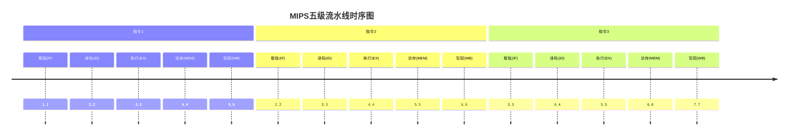
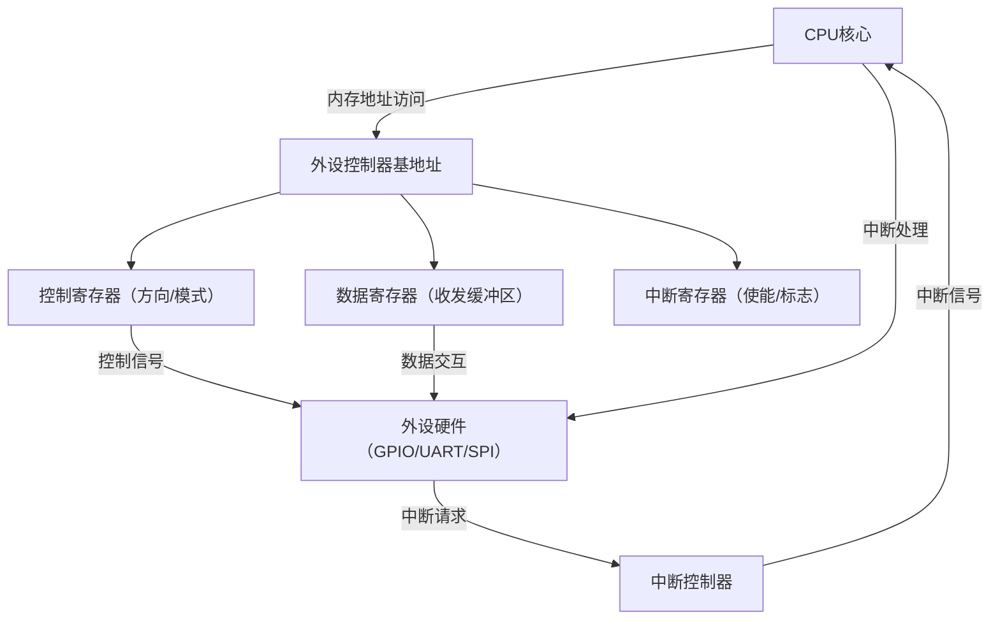

# 主流架构核心原理解析

> 📊 **本节难度等级：** <span class="badge-i">**I级**</span>

---

### <strong>架构演进逻辑：冯·诺依曼与哈佛架构融合设计细节</strong>

ARM架构的核心竞争力之一是对经典架构的适应性融合
——从早期的纯哈佛架构（Harvard Architecture）逐步演进为“指令-数据分离存储+共享总线优化”的混合架构，既保留哈佛架构的高执行效率，又兼顾冯·诺依曼架构（Von Neumann Architecture）的硬件简洁性。
要理解这一融合逻辑，需先明确两种基础架构的核心差异：
- 冯·诺依曼架构：指令和数据存储在同一块内存中，共享地址总线和数据总线。优势是硬件结构简单、内存利用率高；缺陷是“总线争用”——当CPU同时取指令和读数据时，总线会成为瓶颈，导致执行效率下降。
- 哈佛架构：指令和数据存储在独立的内存空间（指令存储器、数据存储器），配备独立的地址总线和数据总线。优势是指令取指和数据读写可并行执行，无总线争用问题，执行效率更高；缺陷是硬件结构复杂，需独立规划两种内存的容量，内存利用率较低。

ARM架构的演进过程本质是对两种架构优势的逐步融合，关键节点如下：
1.  早期ARM架构（ARMv1-ARMv3，1985-1994）：采用纯哈佛架构，指令存储在“指令RAM”，数据存储在“数据RAM”，独立总线并行工作。典型代表是ARM7TDMI核心（ARMv4T），广泛用于早期嵌入式设备（如MP3播放器）。这种设计在主频较低（<100MHz）时效率优势明显，但随着主频提升，独立内存的容量规划难题凸显——当指令和数据量不均衡时，会出现某类内存闲置而另一类内存不足的问题。

2.  成熟ARM架构（ARMv4-ARMv7，1995-2011）：引入“哈佛架构存储+冯·诺依曼总线优化”的混合设计。核心改进是：指令和数据仍独立存储（保留哈佛架构并行取指/读数据的优势），但通过“统一内存控制器”管理外部内存，支持指令和数据在外部内存中混合存储（兼顾冯·诺依曼的内存利用率优势）。以ARMv7-A架构的Cortex-A9核心为例，其内部仍采用分离的L1指令缓存（I-Cache）和数据缓存（D-Cache），但外部可连接单块DDR内存，通过内存控制器动态分配指令和数据存储区域。这种设计既解决了早期独立内存的容量浪费问题，又通过缓存保持了哈佛架构的执行效率。

3.  64位ARM架构（ARMv8-A，2011至今）：进一步优化总线与缓存协同逻辑，引入“乱序执行+超标量”设计，让哈佛架构的并行优势最大化。例如Cortex-A72核心（ARMv8-A）的L1缓存（64KB I-Cache + 64KB D-Cache）支持同时取指和读写数据，L2缓存为共享设计，可通过总线动态调度指令和数据的缓存策略，在高主频（>1GHz）场景下仍能保持较高的并行效率。

ARM架构的融合设计可通过以下架构图直观呈现（以ARMv7-A Cortex-A9为例）：<br>

### <strong>指令集核心特性：ARMv7/v8指令集编码规则与常用指令解读</strong>

ARM指令集是架构的核心，ARMv7和ARMv8（AArch32/AArch64）的指令集设计既保持兼容性，
又针对性能和场景需求做了关键优化，编码规则和指令特性的差异直接影响软件开发与执行效率。

1. 核心编码规则差异（ARMv7 vs ARMv8）
- ARMv7指令集：采用“可变长度编码”，支持两种指令模式，适配不同场景的代码密度需求：
  - ARM模式：32位固定长度指令，编码空间大，支持所有指令功能（如复杂的内存操作、协处理器指令），执行效率高，适合高性能场景（如Cortex-A系列运行Linux系统）。指令编码格式遵循“操作码+寄存器编码+地址码”的固定结构，例如加法指令`ADD R0, R1, R2`的编码为`0xE0810002`，其中`0xE08`为操作码（加法），`1`为源寄存器R1，`0`为目标寄存器R0，`2`为源寄存器R2。
  - Thumb模式：16位固定长度指令，编码空间小，代码密度比ARM模式高30%以上，适合内存受限的场景（如Cortex-M系列MCU）。但早期Thumb模式功能受限（不支持部分特权指令），ARMv7引入Thumb-2技术，实现16位与32位指令的混合编码，既保持高代码密度，又支持完整功能。例如`ADD R0, R0, #1`（16位编码`0x3001`）和`LDMIA R0!, {R1-R4}`（32位编码`0xE8B0001E`）可在同一程序中混用。

- ARMv8-A指令集：分为AArch32（兼容ARMv7）和AArch64（纯64位）两种模式，核心优化是AArch64的“固定长度编码+简化格式”：
  - AArch64模式：仅支持32位固定长度指令，取消Thumb模式，通过优化编码结构提升译码效率。指令格式简化为“操作码+寄存器编码”，去除冗余的地址码字段（64位地址通过寄存器间接寻址实现），例如加法指令`ADD X0, X1, X2`（64位寄存器）编码为`0x8B010000`，操作码和寄存器编码的占比更合理，译码单元可并行处理多条指令。
  - 兼容性设计：AArch32模式完全兼容ARMv7的ARM和Thumb-2指令，确保32位应用可直接运行在64位ARM CPU上（如Cortex-A53运行32位Linux系统）。

2. 常用指令分类与解读（以ARMv7-A为例）
ARM指令集按功能可分为数据处理、加载存储、分支跳转三大类，覆盖嵌入式开发的核心需求，以下为高频指令及实战示例：
- 数据处理指令：用于算术/逻辑运算，核心是“寄存器-寄存器”运算（少量支持立即数），这是RISC架构的典型特征。
  - 加法指令：`ADD R0, R1, R2`（将R1和R2的值相加，结果存入R0）；带进位加法`ADC R0, R1, R2`（适用于多字节运算）。
  - 逻辑指令：`AND R0, R1, #0x0F`（将R1的低4位与0x0F相与，结果存入R0，实现数据掩码）；`ORR R0, R1, R2`（逻辑或运算）
  - 比较指令：`CMP R1, R2`（比较R1和R2的值，结果不存入寄存器，仅更新程序状态寄存器CPSR的条件码，供后续条件执行使用）。

- 加载存储指令：实现寄存器与内存的数据交互，是连接CPU与内存的核心指令，遵循“先加载后运算，先运算后存储”的RISC原则。
  - 单数据加载：`LDR R0, [R1]`（将R1寄存器指向的内存地址的值加载到R0）；带立即数偏移`LDR R0, [R1, #4]`（加载R1+4地址的值）。
  - 单数据存储：`STR R0, [R1]`（将R0的值存储到R1指向的内存地址）；自增偏移`STR R0, [R1], #4`（存储后R1自动加4，适合连续地址访问）。
  - 多数据加载存储：`LDMIA R1!, {R0-R3}`（从R1指向的地址连续加载4个数据到R0-R3，R1自动递增）；`STMIA R1!, {R0-R3}`（连续存储4个数据，适用于栈操作或批量数据传输）。

- 分支跳转指令：用于程序流程控制，支持无条件跳转和条件跳转（基于CPSR的条件码）。
  - 无条件跳转：`B 0x80001234`（直接跳转到地址0x80001234）；带链接跳转`BL 0x80001234`（跳转前将返回地址存入LR寄存器，用于函数调用）。
  - 条件跳转：`BEQ 0x80001234`（若CPSR的Z位为1（上一次运算结果为0），则跳转）；`BNE 0x80001234`（Z位为0时跳转），条件码共16种，覆盖所有运算结果场景。<br>

### <strong>寄存器组织：通用寄存器组与程序状态寄存器（CPSR/SPSR）功能</strong>

ARM架构的寄存器组织遵循“模式适配”原则
——不同工作模式（如用户模式、特权模式）下可见的寄存器不同，既保障系统安全（特权操作仅能在特定模式下执行），又优化寄存器资源利用率。以应用最广的ARMv7-A架构为例，寄存器分为通用寄存器和程序状态寄存器两类。

1. 通用寄存器组（32位）
通用寄存器按功能分为“通用数据寄存器”和“专用寄存器”，共16个（R0-R15），不同工作模式下部分寄存器会被“银行化”（Banked）——即不同模式使用同名但物理独立的寄存器，避免上下文切换时的数据冲突。核心寄存器功能如下：
- R0-R3：通用数据寄存器，用于传递函数参数和返回值（ARM调用规范）。例如C函数`int add(int a, int b)`编译后，a存入R0，b存入R1，运算结果存入R0返回。这4个寄存器无银行化，所有模式共享。
- R4-R11：通用数据寄存器，用于保存局部变量。其中R4-R7在所有模式下共享，R8-R11在特权模式（如FIQ快速中断模式）下有银行化版本（R8_fiq-R11_fiq），切换到FIQ模式时自动使用独立寄存器，无需手动保存上下文，提升中断响应速度。
- R12（IP）：临时寄存器，用于函数调用时的中间数据传递，编译时自动分配使用。
- R13（SP）：栈指针寄存器，每个工作模式有独立的银行化版本（如SP_usr、SP_svc），指向当前模式的栈顶地址。例如用户模式下SP指向用户栈，系统调用（进入SVC模式）时自动切换到SP_svc，避免栈数据冲突。
- R14（LR）：链接寄存器，用于保存函数调用的返回地址。例如执行`BL func`时，CPU自动将下一条指令地址存入LR，函数执行完后通过`MOV PC, LR`返回。中断模式下LR也有银行化版本（如LR_irq），保存中断返回地址。
- R15（PC）：程序计数器，指向当前正在执行的指令地址（ARM架构中PC值比实际指令地址大8，因流水线预取指导致，需注意地址计算）。

ARMv7-A寄存器的银行化机制可通过下表清晰呈现（核心模式）：
| 寄存器 | 用户模式（usr） | 特权模式（svc） | 快速中断模式（fiq） | 特性说明 |
|--------|-----------------|-----------------|---------------------|----------|
| R0-R3  | 共享            | 共享            | 共享                 | 函数参数传递 |
| R4-R7  | 共享            | 共享            | 共享                 | 局部变量保存 |
| R8-R11 | 共享            | 共享            | R8_fiq-R11_fiq      | FIQ模式独立，快速响应 |
| R12    | 共享            | 共享            | 共享                 | 临时寄存器 |
| R13（SP） | SP_usr | SP_svc | SP_fiq | 模式独立栈指针 |
| R14（LR） | LR_usr | LR_svc | LR_fiq | 模式独立返回地址 |
| R15（PC） | 共享            | 共享            | 共享                 | 程序计数器 |

2. 程序状态寄存器（CPSR/SPSR）
程序状态寄存器（Current Program Status Register，CPSR）是ARM架构的核心控制寄存器，32位宽度，用于保存CPU的状态信息（条件码、工作模式、中断禁止位等），所有工作模式共享；SPSR（Saved Program Status Register）是“保存程序状态寄存器”，仅特权模式存在，用于保存进入特权模式前的CPSR值，以便退出时恢复上下文。

CPSR的核心字段（ARMv7-A）及功能如下（按位从高到低）：
- M[4:0]（模式位）：5位字段定义当前CPU工作模式，共7种模式，常见值如下：
  - 0b10000（usr）：用户模式，应用程序运行模式，无特权操作权限；
  - 0b10011（svc）：管理模式，系统调用（SWI指令）进入，用于执行特权操作；
  - 0b10010（irq）：普通中断模式，外部中断触发进入；
  - 0b10001（fiq）：快速中断模式，高优先级中断触发进入。
- I、F位（中断禁止位）：I=1禁止普通中断（IRQ），F=1禁止快速中断（FIQ），用于临界区保护（如执行原子操作时禁止中断）。
- T位（指令集模式位）：T=0时为ARM模式，T=1时为Thumb模式，用于切换指令集。
- 条件码位（N、Z、C、V）：4位字段记录上一次算术/逻辑运算的结果，用于条件跳转指令：
  - N（负位）：运算结果为负时N=1；
  - Z（零位）：运算结果为0时Z=1（`CMP`指令的核心判断依据）；
  - C（进位/借位位）：加法有进位或减法无借位时C=1；
  - V（溢出位）：运算结果超出32位范围时V=1。

实战示例：通过修改CPSR禁止中断
在嵌入式Linux驱动开发中，执行临界区操作（如修改共享数据）时需禁止中断，可通过汇编指令修改CPSR的I位：
```arm
; 禁止普通中断（IRQ），保存原CPSR值到R0
MRS R0, CPSR        ; 将CPSR的值加载到R0
ORR R0, R0, #0x80   ; 置位I位（bit7=1）
MSR CPSR_c, R0      ; 将R0的值写回CPSR的控制字段（c表示仅修改控制位）

; 执行临界区操作（如修改全局变量）
LDR R1, =g_shared_data
ADD R1, R1, #1
STR R1, =g_shared_data

; 恢复原CPSR值，启用中断
MRS R0, CPSR
BIC R0, R0, #0x80   ; 清除I位（bit7=0）
MSR CPSR_c, R0
```<br>

### <strong>异常处理机制：异常类型与异常向量表工作流程</strong>

ARM架构的异常处理是保障系统稳定运行的核心机制
——当CPU执行过程中出现异常（如中断、指令错误）时，会暂停当前任务，跳转到预设的处理程序，执行完成后恢复原任务，整个过程由硬件自动触发+软件配合完成，效率远高于软件轮询。

1. 异常类型与优先级（ARMv7-A）
ARMv7-A定义7种异常类型，按优先级从高到低排序（优先级高的异常可打断优先级低的异常）：
| 异常类型 | 触发条件 | 工作模式 | 优先级 | 典型场景 |
|----------|----------|----------|--------|----------|
| 复位（Reset） | 上电或复位引脚触发 | svc | 最高 | 系统启动 |
| 数据中止（Data Abort） | 内存访问错误（如地址越界） | abt | 高 | 空指针访问 |
| 快速中断（FIQ） | 外部FIQ引脚触发 | fiq | 中 | 高优先级传感器数据采集 |
| 普通中断（IRQ） | 外部IRQ引脚或外设中断触发 | irq | 中低 | 串口数据接收、按键中断 |
| 预取指中止（Prefetch Abort） | 指令预取时内存错误 | abt | 中低 | 执行非法地址的指令 |
| 未定义指令（Undefined Instruction） | 执行CPU不支持的指令 | und | 低 | 执行错误编译的指令 |
| 系统调用（SWI） | 执行SWI指令（软件触发） | svc | 最低 | 应用程序调用内核接口 |

2. 异常向量表与工作流程
ARM架构通过“异常向量表”实现异常处理程序的跳转——向量表是内存中固定地址的一段区域，每个异常对应一个“向量地址”，存储该异常处理程序的入口地址。ARMv7-A的向量表基地址可通过`VBAR`寄存器配置（默认基地址为0x00000000或0xFFFF0000，取决于硬件设计），向量表结构如下：
| 偏移地址 | 异常类型 | 跳转目标 |
|----------|----------|----------|
| 0x00 | 复位 | 复位处理程序入口 |
| 0x04 | 未定义指令 | 未定义指令处理程序入口 |
| 0x08 | 预取指中止 | 预取指中止处理程序入口 |
| 0x0C | 数据中止 | 数据中止处理程序入口 |
| 0x10 | 未使用 | - |
| 0x14 | 未使用 | - |
| 0x18 | 普通中断（IRQ） | IRQ处理程序入口 |
| 0x1C | 快速中断（FIQ） | FIQ处理程序入口 |

异常处理的完整工作流程（以普通中断IRQ为例）如下，分为6个步骤：
1.  异常触发：外部外设（如串口）产生中断请求，CPU检测到IRQ信号，且CPSR的I位为0（未禁止IRQ）。
2.  硬件自动处理：CPU暂停当前指令执行，完成3件核心工作：
    - 保存返回地址到LR_irq（当前PC值减去4，因流水线预取指）；
    - 保存当前CPSR值到SPSR_irq；
    - 修改CPSR：置位I位（禁止其他IRQ）、设置M位为0b10010（进入IRQ模式）、清除T位（切换到ARM模式）。
3.  跳转至处理程序：CPU自动跳转到向量表0x18地址，执行该地址的跳转指令（如`LDR PC, =irq_handler`），进入自定义的IRQ处理程序。
4.  软件处理：执行IRQ处理程序，核心步骤为：
    - 保存上下文：将R0-R12等通用寄存器的值压入IRQ模式的栈（SP_irq指向的栈）；
    - 识别中断源：读取外设的中断状态寄存器（如串口的IER寄存器），确定是哪个外设触发的中断；
    - 执行中断服务函数：调用对应外设的处理函数（如读取串口接收的数据）；
    - 清除中断标志：向外设写入寄存器清除中断请求（避免重复触发）。
5.  恢复上下文：从IRQ栈中弹出R0-R12的值，恢复通用寄存器数据。
6.  退出异常：执行`SUBS PC, LR, #4`指令，完成两件事：
    - 将SPSR_irq的值恢复到CPSR，恢复原工作模式和中断使能状态；
    - 将LR_irq的值减4（修正返回地址）后写入PC，跳回原任务继续执行。

异常处理流程可通过以下流程图直观呈现：<br>

### <strong>模块化指令集设计：基础指令集与扩展指令集（RV32I/RV64G）搭配逻辑</strong>

RISC-V架构的核心创新是“模块化指令集”设计，
通过“基础指令集+扩展指令集”的组合模式，实现“按需扩展、灵活适配”的特性——基础指令集保障架构兼容性，扩展指令集满足不同场景的功能需求（如嵌入式、高性能计算、AI推理），既避免了指令集冗余（如CISC的复杂指令堆砌），又解决了固定指令集适配多场景的局限性。

1. 指令集命名规则与核心分类
RISC-V指令集的命名遵循统一规范，格式为“RVxx[扩展指令集缩写]”，其中：
- “RV”为RISC-V架构标识；
- “xx”表示地址宽度（32=32位地址，64=64位地址，128=128位地址）；
- 后续字母为扩展指令集缩写（如I、M、A、F、D、G等），不同字母代表不同功能扩展。

指令集分为“基础指令集”和“标准扩展指令集”两类，核心定义如下：
- 基础指令集：仅包含最核心的指令，保障架构最小功能集与兼容性，所有RISC-V CPU必须实现。目前主流基础指令集为RV32I（32位地址，整数指令集）和RV64I（64位地址，整数指令集），其中RV64I兼容RV32I（支持32位指令执行）。
- 标准扩展指令集：基于基础指令集扩展的功能模块，用户可根据场景选择性实现，不同扩展之间可组合搭配，常见标准扩展如下：
  - M扩展：整数乘法/除法指令扩展（如MUL乘法、DIV除法），适配需要数值计算的场景（如工业控制）；
  - A扩展：原子操作指令扩展（如AMOSWAP原子交换、AMOADD原子加法），适配多核心共享内存同步场景；
  - F扩展：单精度浮点指令扩展（32位浮点运算），D扩展：双精度浮点指令扩展（64位浮点运算），两者常搭配使用（FD扩展），适配需要浮点计算的场景（如边缘AI推理）；
  - C扩展：压缩指令扩展（16位指令），通过指令压缩提升代码密度（减少内存占用），适配内存受限的嵌入式场景（如物联网传感器）；
  - G扩展：通用扩展组合（G=I+M+A+F+D），包含基础整数、乘法除法、原子操作、单/双精度浮点指令，适配中高端嵌入式场景（如边缘计算网关）。

2. 典型指令集搭配逻辑与场景适配
RISC-V指令集的搭配核心是“场景驱动”，不同场景通过组合基础指令集与扩展指令集，实现“功能满足+资源最优”，典型搭配方案如下：
- 极简嵌入式场景（如智能传感器）：RV32I + C扩展  
  仅保留基础整数指令（RV32I），搭配C扩展压缩指令，代码密度提升30%以上，内存占用可控制在KB级，无需浮点和乘法运算，适配8位/16位MCU替代场景。
- 工业控制场景（如PLC控制器）：RV32IM + A扩展  
  基础整数指令（RV32I）+ 乘法除法扩展（M）满足工业数据计算需求，原子操作扩展（A）保障多核心共享内存同步，无需浮点运算，平衡性能与资源消耗。
- 边缘AI场景（如智能摄像头）：RV64GC扩展（RV64I + M + A + F + D + C）  
  64位地址（RV64I）支持更大内存访问（适配AI模型存储），G扩展包含浮点运算（FD）满足AI推理的数值计算需求，C扩展压缩指令减少代码占用，适配高性能+低功耗的边缘场景。

3. 指令编码规则与示例（以RV32I为例）
RISC-V指令集采用“固定长度编码+压缩扩展”的混合模式，基础指令集（I/M/A/F/D）为32位固定长度编码，C扩展为16位固定长度编码，编码结构简洁统一，便于CPU译码（降低硬件复杂度）。

RV32I基础指令的32位编码格式主要分为三类（按操作数类型划分）：
- R型指令：寄存器-寄存器操作（如加法、乘法），编码格式为“opcode（7位）+ rd（5位）+ funct3（3位）+ rs1（5位）+ rs2（5位）+ funct7（7位）”  
  示例：加法指令`add x1, x2, x3`（将x2和x3的值相加，结果存入x1），编码为`0x003100b3`，各字段解析：opcode=0x33（R型整数指令标识）、rd=0x01（目标寄存器x1）、funct3=0x0（加法功能标识）、rs1=0x02（源寄存器x2）、rs2=0x03（源寄存器x3）、funct7=0x00（加法操作标识）。
- I型指令：寄存器-立即数操作（如立即数加法、加载指令），编码格式为“opcode（7位）+ rd（5位）+ funct3（3位）+ rs1（5位）+ imm（12位）”  
  示例：立即数加法指令`addi x1, x2, 10`（将x2的值加10，结果存入x1），编码为`0x00a10093`，各字段解析：opcode=0x13（I型整数指令标识）、rd=0x01（x1）、funct3=0x0（加法标识）、rs1=0x02（x2）、imm=0x00a（立即数10）。
- S型指令：存储指令（寄存器数据写入内存），编码格式为“opcode（7位）+ imm[4:0]（5位）+ funct3（3位）+ rs1（5位）+ rs2（5位）+ imm[11:5]（7位）”  
  示例：存储指令`sw x1, 8(x2)`（将x1的值存入x2+8的内存地址），编码为`0x00112423`，各字段解析：opcode=0x23（S型存储指令标识）、imm[4:0]=0x00（立即数低5位）、funct3=0x2（字存储标识）、rs1=0x02（基址寄存器x2）、rs2=0x01（数据寄存器x1）、imm[11:5]=0x01（立即数高7位，总立即数=8）。<br>

### <strong>开放ISA特性：指令集可扩展性与自定义指令设计规范</strong>

RISC-V架构的“开放ISA”（Instruction Set Architecture，指令集架构）是其区别于ARM、x86的核心特征
——ISA完全开放且无专利授权限制，用户可基于标准指令集设计自定义指令，满足特殊场景的性能优化需求（如加密算法加速、AI推理加速），这也是RISC-V在嵌入式领域快速崛起的关键原因。

1. 开放ISA的核心特性与优势
- 无授权限制：RISC-V基金会发布的ISA规范完全开放，任何企业或个人可免费使用，无需支付专利费或授权费，降低芯片设计门槛（尤其适合中小厂商）；
- 完全可扩展：标准ISA预留了自定义指令空间，用户可在不破坏兼容性的前提下，新增专属指令（如物联网设备的协议解析指令、工业设备的加密指令）；
- 生态协同：开放特性吸引全球开发者参与生态建设，形成丰富的工具链（如GCC、LLVM）、内核支持（Linux、RTOS）和IP核资源，降低开发成本。

2. 自定义指令设计规范与约束
RISC-V对自定义指令的设计有明确规范，核心目的是“保障兼容性+降低硬件复杂度”，关键约束如下：
- 编码空间预留：标准ISA将32位指令的opcode字段（7位）中，0x00-0x1F、0x63-0x7F分配为自定义指令空间（非标准opcode），避免与标准指令冲突；
- 格式兼容：自定义指令需遵循RISC-V的指令格式（如R型、I型、S型），仅可在预留opcode空间内定义，确保CPU译码单元可复用标准解码逻辑；
- 命名规范：自定义指令的助记符需以“custom”或项目专属前缀命名（如“crypto_xor”），避免与标准指令混淆，便于编译器识别。

3. 自定义指令实战设计示例（以简单加密指令为例）
假设某嵌入式场景需频繁执行“异或加密”操作（将数据与密钥异或），标准指令需通过“加载数据→加载密钥→异或运算→存储结果”4条指令实现，效率较低，可设计自定义指令`custom_xor`优化，步骤如下：
1. 指令功能定义：`custom_xor rd, rs1, rs2`，功能为“将rs1寄存器（数据）与rs2寄存器（密钥）执行异或运算，结果存入rd寄存器”；
2. 编码设计：采用R型指令格式，opcode选择自定义空间0x7B，funct3=0x0，funct7=0x00，编码为`0x0021007B`（rd=x1, rs1=x2, rs2=x3）；
3. 硬件实现：在CPU的运算器（ALU）中新增异或运算模块，译码单元识别opcode=0x7B时，触发异或操作；
4. 软件适配：修改编译器（如GCC）配置文件，添加`custom_xor`指令的助记符与编码映射，在代码中通过内联汇编调用：
```c
// 内联汇编调用自定义异或指令
void crypto_xor(uint32_t *data, uint32_t key, int len) {
    for (int i = 0; i < len; i++) {
        asm volatile (
            "custom_xor x1, x2, x3\n"  // x2=data[i], x3=key, x1=结果
            : "=r"(data[i])            // 输出：data[i] = x1
            : "r"(data[i]), "r"(key)  // 输入：x2=data[i], x3=key
            : "x1"                     // 被修改的寄存器
        );
    }
}
```
通过自定义指令，异或加密操作从4条标准指令简化为1条，执行效率提升4倍，同时减少代码占用，适配嵌入式场景的性能需求。<br>

### <strong>特权级架构：Machine/Supervisor/User模式隔离机制与切换流程</strong>

RISC-V架构的特权级设计核心是“分层隔离”，通过定义3种特权级（Machine模式、Supervisor模式、User模式）
实现不同权限的资源访问控制，保障系统安全（如应用程序无法直接操作硬件资源），适配嵌入式Linux等多任务操作系统的需求。

1. 特权级定义与权限范围
RISC-V的3种特权级按权限从高到低排序，不同级别可访问的资源与执行的指令不同：
- Machine模式（M模式，权限最高）：所有RISC-V CPU必须实现的特权级，拥有最高权限，可访问所有硬件资源（如中断控制器、内存控制器），执行所有指令（包括自定义指令和特权指令）。主要用于系统初始化（如硬件配置、引导加载程序U-Boot运行）、中断处理和底层异常处理。
- Supervisor模式（S模式，权限中等）：可选实现的特权级，主要用于运行操作系统内核（如Linux内核），可访问部分硬件资源（如内存管理单元MMU、外设控制器），但无法访问M模式专属资源（如M模式控制寄存器）。支持内存地址转换（通过MMU实现虚拟地址到物理地址的映射），保障内核与应用程序的内存隔离。
- User模式（U模式，权限最低）：可选实现的特权级，用于运行应用程序，仅能访问分配给自身的虚拟内存空间和部分外设接口（如UART发送缓冲区），无法直接操作硬件资源或执行特权指令（如MMU配置指令）。若应用程序需访问硬件，需通过系统调用（ECALL指令）切换到S模式，由内核代为执行。

2. 特权级控制寄存器与状态管理
RISC-V通过专用控制寄存器管理特权级状态，核心寄存器如下：
- mstatus：Machine模式状态寄存器，记录M模式的状态（如中断使能、前一个特权级）；
- sstatus：Supervisor模式状态寄存器，记录S模式的状态（如虚拟内存使能、中断使能）；
- mepc：Machine模式异常程序计数器，保存异常触发时的PC值（用于异常返回）；
- sepc：Supervisor模式异常程序计数器，保存系统调用或异常触发时的PC值；
- mcause：Machine模式异常原因寄存器，记录异常类型（如中断、指令错误）；
- scause：Supervisor模式异常原因寄存器，记录系统调用或异常原因。

3. 特权级切换流程（以U→S→M模式为例）
特权级切换分为“主动切换”（软件触发，如系统调用）和“被动切换”（硬件触发，如中断、异常），切换过程需保存当前状态并加载目标模式状态，确保切换后可恢复原任务。以下为典型切换流程：

1. U模式→S模式（系统调用触发）：
   - 应用程序执行`ecall`指令（主动触发系统调用），CPU检测到指令后，自动完成：
     1. 保存当前PC值到`sepc`寄存器（记录返回地址）；
     2. 将`scause`寄存器设为“系统调用”（值为8）；
     3. 修改特权级为S模式，保存原特权级（U模式）到`sstatus`寄存器的SPP字段；
     4. 跳转到S模式异常处理程序入口（由`stvec`寄存器指定地址）。
   - 内核处理系统调用后，执行`sret`指令（S模式异常返回），恢复U模式状态并跳回`sepc`指向的地址，继续执行应用程序。

2. S模式→M模式（中断触发）：
   - 外部中断触发（如UART数据接收），CPU检测到中断且M模式中断使能，自动完成：
     1. 保存当前PC值到`mepc`寄存器，保存S模式状态到`mstatus`寄存器；
     2. 将`mcause`寄存器设为“外部中断”（值为11）；
     3. 修改特权级为M模式，禁止S模式中断（避免嵌套中断）；
     4. 跳转到M模式中断处理程序入口（由`mtvec`寄存器指定地址）。
   - M模式处理中断后，执行`mret`指令（M模式异常返回），恢复S模式状态并跳回`mepc`指向的地址，继续执行内核代码。

特权级切换流程可通过以下流程图直观呈现：
```mermaid
flowchart TD
    A[U模式：应用程序执行] -->|执行ecall指令| B[硬件自动处理：保存sepc/scause，切换到S模式]
    B --> C[S模式：内核处理系统调用]
    C -->|执行sret指令| A
    C -->|外部中断触发| D[硬件自动处理：保存mepc/mcause，切换到M模式]
    D --> E[M模式：处理中断]
    E -->|执行mret指令| C
```<br>

### <strong>中断控制器：PLIC/CLIC中断控制器工作原理与配置逻辑</strong>

RISC-V架构未定义固定的中断控制器硬件，
而是通过标准接口规范支持两种主流中断控制器：PLIC（Platform-Level Interrupt Controller，平台级中断控制器）和CLIC（Core-Local Interrupter Controller，核心本地中断控制器）。其中PLIC适用于多核心、多外设的复杂场景（如边缘计算网关），CLIC适用于单核心、低延迟的简单场景（如物联网传感器）。

1. PLIC工作原理与核心特性
PLIC是RISC-V最常用的中断控制器，采用“集中式管理”架构，支持多核心、多外设中断，核心特性如下：
- 中断源支持：最多支持1023个外部中断源（如UART、SPI、GPIO等外设），每个中断源可配置独立优先级（1-7级，1级最低，7级最高
- 多核心适配：支持多个CPU核心（如4核RISC-V CPU），每个核心可独立接收和处理中断，PLIC负责将中断分发到指定核心；
- 中断触发模式：支持电平触发（中断信号保持高电平期间持续触发）和边缘触发（仅信号上升沿/下降沿触发一次），适配不同外设的中断特性。

PLIC的核心工作流程分为3步：
1. 中断请求与优先级判断：外部外设产生中断请求，PLIC检测到后，根据中断源的优先级筛选出最高优先级的中断；
2. 中断分发：PLIC将最高优先级中断分发到目标CPU核心（通过中断目标寄存器配置），并向核心发送中断信号；
3. 中断响应与清除：CPU核心响应中断（切换到M/S模式），执行中断处理程序，处理完成后向PLIC发送“中断完成”信号（写入PLIC的中断完成寄存器），PLIC清除该中断的挂起状态。

2. CLIC工作原理与核心特性
CLIC是轻量级中断控制器，采用“核心本地管理”架构，中断控制器与CPU核心集成在一起，适用于对中断延迟要求高的场景，核心特性如下：
- 低延迟设计：中断信号直接送达CPU核心，无需经过集中式分发，中断响应延迟比PLIC低50%以上；
- 中断源支持：最多支持127个本地中断源（多为核心周边外设，如定时器、GPIO），支持优先级配置（1-15级）；
- 嵌套中断支持：支持高优先级中断打断低优先级中断，无需软件额外配置，适配实时性要求高的场景（如工业控制）。

3. PLIC配置实战示例（以RV64G架构为例）
以“配置UART接收中断（中断源编号10），分发到CPU核心0，优先级为5级”为例，PLIC配置步骤如下（通过内存映射寄存器操作）：
1. 使能中断源：写入PLIC的中断使能寄存器（地址0x0C002000，核心0专属使能寄存器），置位第10位，使能中断源10：
```c
volatile uint32_t *plic_ie_core0 = (volatile uint32_t *)0x0C002000;
*plic_ie_core0 |= (1 << 10);  // 使能中断源10
```
2. 配置中断优先级：写入PLIC的中断优先级寄存器（地址0x0C000028，中断源10对应的优先级寄存器，每个中断源占4字节），设置优先级为5：
```c
volatile uint32_t *plic_priority_uart = (volatile uint32_t *)0x0C000028;
*plic_priority_uart = 5;  // 优先级5级
```
3. 配置核心中断阈值：写入PLIC的核心中断阈值寄存器（地址0x0C200000，核心0专属阈值寄存器），设置阈值为3（仅优先级≥3的中断可被响应）：
```c
volatile uint32_t *plic_threshold_core0 = (volatile uint32_t *)0x0C200000;
*plic_threshold_core0 = 3;
```
4. 中断处理与清除：CPU核心响应中断后，读取PLIC的中断请求寄存器（地址0x0C200004）获取中断源编号，处理完成后写入中断完成寄存器（地址0x0C200004）清除中断：
```c
volatile uint32_t *plic_claim_core0 = (volatile uint32_t *)0x0C200004;
uint32_t irq_num = *plic_claim_core0;  // 获取中断源编号（10）
if (irq_num == 10) {
    uart_rx_handler();  // 执行UART接收中断处理函数
}
*plic_claim_core0 = irq_num;  // 写入中断编号，清除中断
```

PLIC与CLIC的差异对比可通过下表清晰呈现：
| 对比维度 | PLIC | CLIC | 场景适配 |
|----------|------|------|----------|
| 架构类型 | 集中式 | 核心本地式 | PLIC适配多核心复杂场景；CLIC适配单核心低延迟场景 |
| 中断延迟 | 较高（需分发） | 极低（直接响应） | 实时控制选CLIC；普通场景选PLIC |
| 中断源数量 | 最多1023个 | 最多127个 | 多外设场景选PLIC；少外设场景选CLIC |
| 嵌套中断 | 需软件实现 | 硬件支持 | 实时性要求高选CLIC |<br>

### <strong>流水线设计：五级流水线（取指→译码→执行→访存→写回）工作机制</strong>

MIPS架构是RISC（精简指令集计算机）架构的经典代表，其核心性能优化基础是“五级流水线”设计
——通过将一条指令的执行过程拆解为5个独立阶段，实现多条指令的并行处理，大幅提升CPU指令吞吐量。与ARM架构的流水线设计相比，MIPS流水线更强调“简洁性与高效性”，无冗余硬件模块，适配嵌入式场景的低功耗需求。

1. 五级流水线核心阶段与功能
五级流水线将单条指令的执行流程分为“取指（IF）、译码（ID）、执行（EX）、访存（MEM）、写回（WB）”五个独立阶段，每个阶段由专门的硬件模块处理，且每个时钟周期仅完成一个阶段的工作，具体功能如下：
- 取指（IF）：通过程序计数器（PC）获取指令地址，从内存中读取指令，存入指令寄存器（IR），同时将PC更新为下一条指令地址（PC=PC+4，因MIPS指令为32位固定长度，地址增量为4字节）。
- 译码（ID）：解析指令寄存器中的指令，识别指令类型（如数据处理、存储访问、分支跳转），读取指令指定的通用寄存器数据（存入寄存器A/B），同时生成控制信号（如运算器操作类型、访存控制信号）。
- 执行（EX）：根据译码阶段生成的控制信号，由运算器（ALU）执行指令对应的操作：数据处理指令完成算术/逻辑运算，存储访问指令计算内存地址（基址+偏移量），分支跳转指令计算目标地址并判断是否跳转。
- 访存（MEM）：仅存储访问指令（如Load/Store）需要此阶段，其他指令直接跳过。Load指令从执行阶段计算的内存地址中读取数据，Store指令将运算结果写入指定内存地址，同时处理内存访问异常（如地址越界）。
- 写回（WB）：将指令执行结果写回目标寄存器：数据处理指令将ALU运算结果写回通用寄存器，Load指令将内存读取的数据写回通用寄存器，分支跳转指令无写回操作（仅更新PC）。

五级流水线的并行工作机制可通过时序图直观呈现（以连续3条指令为例）：

从时序图可见，第3个时钟周期时，指令1处于执行阶段、指令2处于译码阶段、指令3处于取指阶段，三条指令并行处理，理想状态下每个时钟周期可完成一条指令（吞吐量=1指令/时钟周期）。

2. 流水线冒险与解决机制
流水线并行处理的核心挑战是“冒险”——即相邻指令之间存在依赖关系，导致流水线阻塞（气泡），降低执行效率。MIPS架构主要面临三类冒险，对应解决机制如下：
- 数据冒险：后一条指令依赖前一条指令的执行结果，导致数据未准备好而阻塞。例如：
  ```mips
  add $t0, $t1, $t2   # 指令1：$t0 = $t1 + $t2
  sub $t3, $t0, $t4   # 指令2：$t3 = $t0 - $t4（依赖$t0的值）
  ```
  解决机制：数据转发（Forwarding） ——在执行阶段新增转发逻辑，将前一条指令的ALU运算结果直接转发到当前指令的ALU输入端，无需等待写回阶段，消除阻塞。
- 控制冒险：分支跳转指令导致PC值突变，流水线预取的后续指令无效，产生气泡。例如：
  ```mips
  beq $t0, $t1, label  # 指令1：若$t0=$t1，跳转到label
  add $t2, $t3, $t4    # 指令2：预取指令，若跳转则无效
  ```
  解决机制：延迟分支（Delayed Branch） ——MIPS将分支指令的执行延迟一个时钟周期，分支指令后的第一条指令（延迟槽指令）无论是否跳转都会执行，通过合理安排延迟槽指令（如无依赖的赋值指令），消除气泡。
- 结构冒险：多条指令同时竞争同一硬件资源（如内存总线），导致阻塞。例如Load指令（访存阶段）与后续指令（取指阶段）同时访问内存，竞争总线资源。
  解决机制：硬件资源复用优化 ——将内存分为指令存储器和数据存储器（哈佛架构），配备独立总线，取指和访存可并行执行，避免总线竞争。<br>

### <strong>存储访问机制：大端/小端模式与存储访问对齐要求</strong>

MIPS架构的存储访问机制遵循“高效性与兼容性平衡”原则，
核心特性包括大端/小端模式可选、严格的存储访问对齐要求，这些特性直接影响数据存储格式与内存访问效率，是嵌入式MIPS开发的关键注意点。

1. 大端/小端模式定义与切换
存储端模式决定多字节数据在内存中的存储顺序，MIPS架构支持两种模式，可通过硬件配置或软件指令切换：
- 大端模式（Big-Endian）：高位字节数据存储在低内存地址，低位字节数据存储在高内存地址。例如32位数据0x12345678，存储地址0x1000-0x1003的分布为：0x1000=0x12、0x1001=0x34、0x1002=0x56、0x1003=0x78。大端模式符合人类阅读习惯，常用于网络通信、工业控制等场景（如TCP/IP协议默认大端）。
- 小端模式（Little-Endian）：低位字节数据存储在低内存地址，高位字节数据存储在高内存地址。同样数据0x12345678，存储地址分布为：0x1000=0x78、0x1001=0x56、0x1002=0x34、0x1003=0x12。小端模式数据读取时无需字节交换，执行效率更高，常用于消费电子、嵌入式计算场景。

MIPS架构的端模式切换方式：
- 硬件切换：通过CPU引脚（如BE引脚）配置，上电时固定端模式（适用于固定场景的嵌入式设备）；
- 软件切换：通过协处理器CP0的状态寄存器（SR）的BE位配置，BE=1为大端模式，BE=0为小端模式，支持运行时动态切换（需特权级权限）：
  ```mips
  # 切换为小端模式（修改CP0状态寄存器SR的BE位）
  mfc0 $t0, $12       # 将CP0 SR寄存器（编号12）的值读取到$t0
  li $t1, 0xFFFFFFFE  # 构建掩码（BE位为0）
  and $t0, $t0, $t1   # 清除BE位（BE=0）
  mtc0 $t0, $12       # 将修改后的值写回CP0 SR寄存器
  ```

2. 存储访问对齐要求与异常处理
MIPS架构对存储访问有严格的对齐要求——多字节数据的内存地址必须是数据长度的整数倍，否则会触发“地址未对齐异常”，这是RISC架构高效性的重要保障（对齐访问可减少内存访问次数，提升执行效率）。

具体对齐要求如下：
- 字节数据（8位）：无对齐要求，可存储在任意内存地址；
- 半字数据（16位）：地址必须是2的整数倍（地址最低位为0）；
- 字数据（32位）：地址必须是4的整数倍（地址最低两位为00）；
- 双字数据（64位，仅MIPS64支持）：地址必须是8的整数倍（地址最低三位为000）。

实战示例：未对齐访问异常
若执行字数据读取指令`lw $t0, 0x1001($zero)`（从地址0x1001读取32位数据），因0x1001不是4的整数倍，触发地址未对齐异常，CPU会暂停当前指令执行，跳转到异常处理程序。

未对齐访问的解决方式：
- 编译期优化：编译器自动调整数据存储地址，确保对齐（如结构体成员按对齐要求填充字节）；
- 软件手动处理：对于必须访问未对齐地址的场景（如读取外部设备非对齐数据），通过字节读取指令（lb/lbu）分多次读取，再组合为完整数据：
  ```mips
  # 读取地址0x1001的32位未对齐数据，组合为$t0
  lb $t1, 0x1001($zero)  # 读取字节0x1001（低位）
  lb $t2, 0x1002($zero)  # 读取字节0x1002
  lb $t3, 0x1003($zero)  # 读取字节0x1003
  lb $t4, 0x1004($zero)  # 读取字节0x1004（高位）
  sll $t2, $t2, 8        # $t2 = $t2 << 8
  sll $t3, $t3, 16       # $t3 = $t3 << 16
  sll $t4, $t4, 24       # $t4 = $t4 << 24
  or $t0, $t1, $t2       # 组合数据：$t0 = $t1 | $t2 | $t3 | $t4
  or $t0, $t0, $t3
  or $t0, $t0, $t4
  ```<br>

### <strong>协处理器体系：CP0-CP5协处理器功能分工与交互方式</strong>

MIPS架构的协处理器体系是其核心特色之一
——通过独立的协处理器扩展CPU功能，避免核心硬件复杂度增加，同时提升专项任务处理效率。MIPS定义了6个协处理器（CP0-CP5），其中CP0为必实现协处理器（系统控制核心），其余为可选实现，适配不同场景需求。

1. 协处理器核心功能分工
- CP0（系统控制协处理器）：MIPS架构的核心协处理器，负责系统控制、异常处理、内存管理等特权操作，所有MIPS CPU必须实现。核心寄存器及功能如下：
  - 状态寄存器（SR，编号12）：记录CPU状态（如中断使能、端模式、特权级）；
  -  Cause寄存器（编号13）：记录异常/中断原因（如未对齐访问、外部中断）；
  - 异常程序计数器（EPC，编号14）：保存异常触发时的PC值，用于异常返回；
  - 内存管理单元（MMU）寄存器：如页表项寄存器（EntryHi/EntryLo），负责虚拟地址到物理地址的转换。
- CP1（浮点协处理器）：可选协处理器，负责浮点运算（单精度/双精度），适配需要数值计算的场景（如工业控制、边缘计算）。支持浮点指令集（如add.s单精度加法、mul.d双精度乘法），通过专用浮点寄存器（F0-F31）存储数据。
- CP2（自定义功能协处理器）：预留用于自定义扩展，用户可根据场景实现专属功能（如加密算法加速、AI推理加速），需配合自定义指令使用，适配特殊嵌入式场景（如物联网安全设备）。
- CP3-CP5（备用协处理器）：预留用于扩展多协处理器场景（如多浮点单元、专用信号处理单元），目前主流MIPS CPU较少实现，仅高端工业级芯片会按需扩展。

2. CPU与协处理器交互方式
CPU与协处理器通过专用指令和寄存器交互，核心交互指令分为三类，需配合协处理器编号和寄存器编号使用：
- 协处理器寄存器读写指令：用于CPU与协处理器寄存器的数据传输，核心指令为`mfc0/mtc0`（CP0专用）、`mfc1/mtc1`（CP1专用）
  - `mfc0 $rt, $cr`：将CP0的cr号寄存器的值读取到CPU通用寄存器$rt；
  - `mtc0 $rt, $cr`：将CPU通用寄存器$rt的值写回CP0的cr号寄存器；
  示例：读取CP0 EPC寄存器（编号14）的值：
  ```mips
  mfc0 $t0, $14  # 将CP0 EPC寄存器的值读取到$t0
  ```
- 协处理器运算指令：由协处理器独立执行专项运算，CPU仅需发送控制信号，例如CP1的浮点加法指令`add.s $f0, $f1, $f2`（将浮点寄存器$f1和$f2的单精度数据相加，结果存入$f0）。
- 协处理器异常交互：协处理器执行异常（如浮点运算溢出）时，会向CPU发送异常信号，CPU触发协处理器异常，通过CP0的Cause寄存器识别异常类型，执行对应处理程序。

CPU与CP0的交互流程（以异常处理为例）：
```mermaid
flowchart TD
    A[CPU执行指令触发异常] --> B[CP0检测异常，记录原因到Cause寄存器]
    B --> C[CP0保存异常PC值到EPC寄存器]
    C --> D[CP0向CPU发送异常信号，触发异常跳转]
    D --> E[CPU执行异常处理程序，通过mfc0读取CP0寄存器获取信息]
    E --> F[处理异常（如修正地址、清除溢出标志）]
    F --> G[通过mtc0更新CP0状态，执行异常返回指令（eret）]
    G --> H[CPU恢复正常执行]
```<br>

### <strong>异常与中断处理：异常检测与中断响应流程差异</strong>

MIPS架构的异常与中断处理机制是保障系统稳定运行的核心，
其核心特点是“异常与中断统一处理+分级响应”——异常（软件触发，如未对齐访问）和中断（硬件触发，如外部外设请求）共享同一套处理流程，但通过Cause寄存器区分类型，实现分级响应，适配嵌入式场景的复杂需求。

1. 异常与中断的定义与分类
- 异常（Exception）：由CPU内部事件触发的非预期执行状态，多为软件错误或特殊指令触发，分为：
  - 指令相关异常：未定义指令、指令地址未对齐、浮点运算溢出；
  - 数据相关异常：数据地址未对齐、内存访问越界、协处理器异常；
  - 特殊指令触发：系统调用指令（syscall）、断点指令（break）。
- 中断（Interrupt）：由外部硬件设备触发的请求信号，需CPU暂停当前任务处理外设需求，分为：
  - 可屏蔽中断（Maskable Interrupt）：通过CP0的状态寄存器（SR）的IE位屏蔽/使能，如UART数据接收中断、GPIO中断；
  - 不可屏蔽中断（Non-Maskable Interrupt，NMI）：无法通过软件屏蔽，优先级最高，如电源故障中断、硬件复位中断。

2. 异常与中断处理流程差异
MIPS架构中异常与中断共享“异常向量表+处理流程”，核心差异体现在触发源识别、响应优先级和处理逻辑上，完整处理流程如下：
1. 触发与检测：
   - 异常：CPU执行指令时内部检测（如译码阶段识别未定义指令、访存阶段检测地址未对齐）；
   - 中断：外部设备发送中断信号，CP0的中断控制器检测到后，通过Cause寄存器的中断位标识。
2. 硬件自动处理（统一流程）：
   - 保存上下文：将当前PC值存入CP0的EPC寄存器，将当前CPU状态（SR寄存器值）存入CP0的状态保存寄存器（SR_Save）；
   - 标识原因：将异常/中断类型写入CP0的Cause寄存器（如未对齐访问对应Cause值为4，外部中断对应值为0x80000000）；
   - 切换状态：设置CPU为特权模式，禁止可屏蔽中断（SR寄存器IE位清0），避免嵌套触发；
   - 跳转执行：CPU自动跳转到异常向量表地址（默认0x80000080，可通过CP0的Vector寄存器配置）。
3. 软件处理（差异核心）：
   - 异常处理：读取CP0的Cause寄存器识别异常类型，执行对应修复逻辑（如未对齐访问需重新计算地址并重试指令、未定义指令需终止程序）；
   - 中断处理：读取CP0的Cause寄存器和中断屏蔽寄存器，识别中断源（如UART中断、GPIO中断），执行外设中断服务函数（如读取UART数据、处理GPIO按键事件），处理完成后需清除外设中断标志。
4. 恢复与返回：
   - 异常返回：通过`mtc0`指令恢复SR寄存器值，执行`eret`（异常返回指令），CPU从EPC寄存器读取地址，恢复正常执行；
   - 中断返回：清除CP0的中断标识位，恢复SR寄存器的IE位（重新使能中断），执行`eret`指令返回原任务。

3. 关键差异总结与实战注意点
| 对比维度 | 异常处理 | 中断处理 | 实战注意点 |
|----------|----------|----------|------------|
| 触发源 | CPU内部软件事件 | 外部硬件设备 | 中断需先确认外设中断标志，避免重复处理 |
| 响应优先级 | 中等（低于不可屏蔽中断） | 可屏蔽中断优先级低于异常，不可屏蔽中断最高 | 电源故障等NMI需优先处理，避免系统崩溃 |
| 处理逻辑 | 多为修复或终止程序 | 处理外设请求后需恢复中断使能 | 中断处理程序需简洁，避免占用CPU过长时间 |
| 上下文保存 | 仅保存CPU核心状态 | 需额外保存外设状态（如中断标志） | 中断处理程序需清除外设中断标志，否则反复触发 |

实战示例：外部GPIO中断处理程序框架
```mips
# MIPS GPIO中断处理程序（中断源：GPIO按键，Cause寄存器中断位为1）
irq_handler:
    # 保存CPU上下文（通用寄存器值压栈）
    addi $sp, $sp, -24
    sw $t0, 0($sp)
    sw $t1, 4($sp)
    sw $t2, 8($sp)
    sw $t3, 12($sp)
    sw $ra, 16($sp)
    sw $status, 20($sp)

    # 读取CP0 Cause寄存器，确认中断源
    mfc0 $t0, $13       # $t0 = Cause寄存器值
    li $t1, 0x00000002  # 中断源掩码（GPIO中断对应位为1）
    and $t2, $t0, $t1
    bne $t2, $t1, irq_exit  # 非GPIO中断，直接退出

    # 执行GPIO中断服务函数（处理按键事件）
    jal gpio_key_handler

    # 清除外设中断标志（GPIO控制器中断清除寄存器）
    li $t0, 0x10000000   # GPIO控制器基地址
    li $t1, 0x01         # 清除按键中断标志
    sw $t1, 0x08($t0)    # 写入中断清除寄存器

irq_exit:
    # 恢复CPU上下文，使能中断
    lw $t0, 0($sp)
    lw $t1, 4($sp)
    lw $t2, 8($sp)
    lw $t3, 12($sp)
    lw $ra, 16($sp)
    lw $status, 20($sp)
    addi $sp, $sp, 24

    # 恢复SR寄存器，执行异常返回
    mfc0 $t0, $12
    ori $t0, $t0, 0x00000001  # 置位IE位，重新使能中断
    mtc0 $t0, $12
    eret                     # 中断返回，恢复原任务执行
```<br>

### <strong>指令执行核心流程：从指令获取到结果输出的通用逻辑</strong>

无论是ARM、RISC-V还是MIPS架构，CPU的指令执行本质上遵循“取指→译码→执行→写回”的通用流程，
差异仅在于流水线级数、硬件模块命名等细节，核心目的是通过标准化步骤实现指令的高效处理。
这一通用流程是RISC架构“精简指令、高效执行”设计思想的集中体现，也是所有嵌入式CPU工作的底层逻辑。

1. 通用执行流程拆解
- 取指（Instruction Fetch）：CPU通过程序计数器（PC/RIP/EPC，不同架构命名不同）获取下一条指令的内存地址，从指令存储器（或缓存）中读取指令，存入指令寄存器（IR）。通用特点：指令地址增量固定（ARM/RISC-V/MIPS均为4字节，对应32位指令），支持预取指优化（通过流水线提前读取后续指令，提升并行效率）。
- 译码（Instruction Decode）：指令译码单元（IDU）解析指令寄存器中的指令编码，识别指令类型（如数据处理、存储访问、分支跳转），提取操作数信息（如寄存器编号、立即数、内存偏移量），并生成控制信号（如运算器操作类型、访存控制信号）。通用特点：译码逻辑与指令集编码规则强绑定，RISC架构因指令格式统一（如ARM 32位固定编码、RISC-V基础指令32位编码），译码效率远高于CISC架构。
- 执行（Execute）：运算器（ALU/FPU，算术逻辑单元/浮点单元）根据译码阶段生成的控制信号，执行指令对应的操作。数据处理指令完成算术/逻辑运算，存储访问指令计算目标内存地址，分支跳转指令计算跳转目标地址并判断是否跳转。通用特点：执行阶段是指令处理的核心，RISC架构通过“单指令单周期执行”（理想状态）优化效率，多架构均支持数据转发机制解决流水线数据依赖。
- 写回（Write Back）：将指令执行结果写回目标存储单元，数据处理指令写回通用寄存器，加载指令写回内存读取的数据，分支跳转指令无写回操作（仅更新PC值）。通用特点：写回阶段需避免数据冲突，多架构通过寄存器银行化（如ARM的模式专属寄存器、MIPS的协处理器寄存器）或上下文保存机制保障数据安全。

三大架构指令执行流程的共性与差异对比：
| 流程阶段 | 共性特征 | 架构差异 |
|----------|----------|----------|
| 取指 | PC驱动地址获取，支持预取指 | ARM支持Thumb压缩指令取指，RISC-V支持C扩展压缩指令，MIPS固定32位指令取指 |
| 译码 | 指令格式统一，控制信号生成 | ARM支持ARM/Thumb模式切换译码，RISC-V支持模块化指令译码，MIPS译码逻辑更简洁 |
| 执行 | ALU为核心运算单元，支持数据转发 | ARM支持乱序执行（高端核心），RISC-V支持自定义指令执行，MIPS固定顺序执行 |
| 写回 | 结果写回寄存器/内存，避免冲突 | ARM支持特权级数据隔离，RISC-V支持多模式状态保存，MIPS依赖协处理器辅助写回 |

指令执行通用流程可通过以下模型图直观呈现：
```mermaid
graph TD
    A[程序计数器（PC）] -->|指令地址| B[指令存储器/缓存]
    B -->|指令编码| C[指令寄存器（IR）]
    C -->|编码解析| D[译码单元（IDU）]
    D -->|控制信号| E[运算器（ALU/FPU）]
    D -->|操作数信息| F[通用寄存器组]
    F -->|操作数| E
    E -->|执行结果| G[写回单元]
    G -->|结果存储| F
    G -->|内存操作| H[数据存储器/内存]
    H -->|读取数据| G
    E -->|跳转信号| A[程序计数器（PC）]
```<br>

### <strong>寄存器与内存交互：数据流转路径与效率优化思路</strong>

寄存器与内存是CPU数据存储的核心载体，三大架构均遵循“寄存器优先访问、内存辅助存储”的交互原则，
通过优化数据流转路径提升处理效率——寄存器负责临时存储高频访问数据（指令执行的中间结果、函数参数），内存负责存储海量静态数据（程序代码、全局变量），两者的交互效率直接决定CPU整体性能。

1. 通用数据流转路径
- 寄存器→运算器→寄存器：数据处理指令的核心流转路径，如“加法指令”将两个寄存器中的数据送入ALU运算，结果写回目标寄存器。这是最快的数据流转路径，无需访问内存，延迟仅为1-2个时钟周期，多架构均通过增加通用寄存器数量（ARMv8有31个64位寄存器、RISC-V RV64有31个64位寄存器、MIPS64有31个通用寄存器）优化此路径效率。
- 内存→缓存→寄存器→运算器：加载指令的数据流转路径，CPU先从内存读取数据到缓存（L1/L2/L3），再从缓存加载到寄存器，最后送入运算器处理。多架构均采用缓存分层设计，L1缓存与CPU核心紧密集成，访问延迟最低（约1-3个时钟周期），L2/L3缓存为共享缓存，平衡容量与速度。
- 运算器→寄存器→缓存→内存：存储指令的数据流转路径，运算结果先存入寄存器，再写入缓存，最后由缓存回写内存（通过缓存回写策略，如写直达/写回）。多架构通过缓存预取、写合并等优化手段，减少内存访问次数，提升流转效率。
- 寄存器→协处理器→寄存器：特殊功能指令（如浮点运算、加密运算）的数据流转路径，CPU将数据送入协处理器（ARM的NEON、RISC-V的自定义协处理器、MIPS的CP1）处理，结果返回寄存器。此路径适配专项任务优化，避免占用核心运算资源。

2. 效率优化通用思路
- 缓存优化：通过缓存分层、缓存一致性协议（如ARM的MESI、RISC-V的宽松内存序、MIPS的Cache Coherence）减少内存访问延迟，提升缓存命中率。例如ARM和RISC-V高端核心均支持L3共享缓存，保障多核心数据一致性；MIPS通过CP0协处理器配置缓存策略（如写回/写直达）。
- 寄存器优化：增加通用寄存器数量，减少寄存器与内存的频繁交互。RISC架构寄存器数量普遍多于CISC架构，如ARMv8-A有31个64位通用寄存器，远高于x86架构的8个通用寄存器，大幅提升数据处理效率。
- 内存访问对齐：三大架构均要求内存访问对齐（如ARM、MIPS要求32位数据地址为4的整数倍，RISC-V同理），对齐访问可减少内存总线传输次数，提升流转效率。未对齐访问会触发异常（如ARM的Data Abort、MIPS的地址未对齐异常），需通过软件优化规避。
- 数据预取：CPU通过预取指单元（如ARM的分支预测单元、RISC-V的预取缓冲器）提前将内存数据加载到缓存，减少运算器等待时间。例如ARM Cortex-A72核心支持指令和数据预取，RISC-V通过BPB（分支预测缓冲器）优化预取效率。

实战示例：多架构通用的内存访问优化（以32位数据读取为例）
```c
// 未优化：频繁访问内存，效率低
int sum_unoptimized(int *arr, int len) {
    int total = 0;
    for (int i = 0; i < len; i++) {
        total += arr[i];  // 每次循环访问内存，延迟高
    }
    return total;
}

// 优化：利用寄存器缓存数据，减少内存访问
int sum_optimized(int *arr, int len) {
    int total = 0;
    int temp;  // 临时变量，存储在寄存器中
    for (int i = 0; i < len; i++) {
        temp = arr[i];    // 一次内存访问，存入寄存器
        total += temp;    // 寄存器间运算，无内存访问
    }
    return total;
}
```
上述代码通过引入临时变量（存储在寄存器），将内存访问次数从“每次循环1次”优化为“每次循环1次（仅读取数据）”，运算过程通过寄存器完成，多架构均支持此类优化，性能提升约20%-30%。<br>

### <strong>外设控制通用模型：CPU与外设通信的底层共性机制</strong>

嵌入式CPU与外设（如GPIO、UART、SPI、传感器）的通信，本质上遵循“地址映射+控制信号+数据传输”的通用模型，
三大架构虽在外设控制器命名、寄存器定义上存在差异，但底层交互逻辑完全一致——CPU通过内存映射的外设寄存器，发送控制信号、传输数据，实现对外设的精准控制。

1. 通用控制模型核心组件
- 外设地址映射：CPU将外设控制器的寄存器映射到系统内存地址空间（即内存映射I/O，MMIO），通过访问特定内存地址实现对外设寄存器的读写。例如ARM将GPIO控制器映射到0x3F200000（树莓派4B），RISC-V将UART控制器映射到0x10000000，MIPS将SPI控制器映射到0x1C050000，均支持通过通用存储指令（LDR/STR、lw/sw等）访问。
- 控制信号生成：CPU通过写入外设控制寄存器（如方向寄存器、模式寄存器）生成控制信号，配置外设工作模式（如GPIO为输入/输出模式、UART波特率、SPI时钟频率）。通用特点：控制寄存器多为读写类型，写入特定值对应特定功能，如GPIO方向寄存器写入0x01表示输出模式，写入0x00表示输入模式。
- 数据传输机制：CPU与外设通过数据寄存器（如GPIO数据寄存器、UART收发缓冲区）传输数据，分为同步传输和异步传输两种方式：
  - 同步传输：CPU通过时钟信号同步数据，如SPI、I2C外设，CPU控制时钟线（SCLK）节奏，同步读取/写入数据；
  - 异步传输：无需时钟同步，通过起始/停止信号标识数据帧，如UART外设，通过波特率约定数据传输速度。
- 中断响应机制：外设通过中断信号向CPU请求服务（如UART数据接收完成、传感器数据就绪），CPU触发中断处理程序，完成数据交互。通用特点：多架构均支持中断优先级配置、中断屏蔽/使能，通过中断控制器（如ARM的GIC、RISC-V的PLIC、MIPS的CP0）管理中断请求。

2. 多架构外设控制共性流程
以GPIO外设控制（LED灯亮灭）为例，三大架构的控制流程完全遵循通用模型，步骤如下：
1. 外设地址映射确认：查询芯片手册，获取GPIO控制器的基地址及数据寄存器、方向寄存器地址；
2. 配置外设工作模式：写入GPIO方向寄存器，设置目标引脚为输出模式；
3. 传输控制数据：写入GPIO数据寄存器，设置引脚电平（高电平点亮LED，低电平熄灭）；
4. （可选）中断配置：若需通过中断响应（如按键控制LED），配置GPIO中断寄存器，使能中断并绑定处理程序。

三大架构GPIO控制实战代码对比（核心逻辑一致）：
| 架构 | 控制代码示例 | 共性逻辑 |
|------|--------------|----------|
| ARM（ARMv8） | ```c volatile uint32_t *gpio_dir = (volatile uint32_t *)0x3F200000; volatile uint32_t *gpio_data = (volatile uint32_t *)0x3F200010; *gpio_dir |= (1 << 18); // 引脚18设为输出 *gpio_data |= (1 << 18); // 高电平点亮 ``` | 地址映射→模式配置→数据传输 |
| RISC-V（RV64G） | ```c volatile uint32_t *gpio_dir = (volatile uint32_t *)0x10000004; volatile uint32_t *gpio_data = (volatile uint32_t *)0x10000008; *gpio_dir |= (1 << 2); // 引脚2设为输出 *gpio_data |= (1 << 2); // 高电平点亮 ``` | 地址映射→模式配置→数据传输 |
| MIPS（MIPS32） | ```c volatile uint32_t *gpio_dir = (volatile uint32_t *)0x1C050004; volatile uint32_t *gpio_data = (volatile uint32_t *)0x1C050008; *gpio_dir |= (1 << 5); // 引脚5设为输出 *gpio_data |= (1 << 5); // 高电平点亮 ``` | 地址映射→模式配置→数据传输 |

外设控制通用模型可通过以下架构图呈现：


3. 共性优化思路
- 内存映射优化：通过缓存映射外设寄存器（部分架构支持）减少访问延迟，或使用专用I/O指令（如MIPS的lio指令）提升传输效率；
- 中断优化：采用中断线程化（如ARM的Threaded IRQ、RISC-V的中断嵌套）减少中断处理对主程序的阻塞，配置合理中断优先级避免冲突；
- 批量数据传输：使用DMA（直接内存访问）控制器替代CPU完成批量数据传输（如传感器批量采样、串口大数据接收），释放CPU资源，多架构均支持DMA与外设协同工作。<br>

### <strong>Arm架构概述</strong>

Arm架构是一种精简指令集（RISC）架构，自其诞生以来，以低功耗、高性能和易于集成的特性，在计算机体系结构中占据了重要地位。<br>

### <strong>Arm指令集</strong>

Arm指令集作为Arm架构的核心，设计中体现了简洁与高效的理念。
其主要分为两大类：Arm指令和Thumb指令，分别针对不同的应用场景和性能需求。
Arm指令：Arm指令采用32位长度，这种设计使得每条指令能够携带更多的操作信息和寻址模式，支持更为复杂的操作。
Thumb指令：Thumb指令长度为16位，设计目标是在保持一定性能的同时，降低功耗和提高代码密度。
相比Arm指令，Thumb指令集的紧凑性使得代码占用更少的存储空间，这在内存有限的嵌入式系统中尤为重要。它特别适用于对成本和功耗有严格要求的设备，如物联网终端、可穿戴设备和低功耗传感器。<br>

### <strong>Arm处理器结构</strong>

如图是一个典型的Arm架构处理器芯片内部结构示意图
Arm处理器的核心结构是其实现高性能和低功耗的基础，主要包括处理器核心、缓存系统和总线接口等关键模块。<br>

### <strong>Arm架构中的关键技术</strong>

Arm架构中的关键技术涵盖了多核技术、低功耗设计和虚拟化技术等领域
* 多核技术
多核技术在Arm架构中尤为重要，通过在一个处理器内集成多个核心，实现了并行处理能力的显著提升。这种设计不仅支持同时处理多个任务，还能通过任务分割和并行执行，提高单个任务的处理效率。尤其是在复杂计算任务和多任务操作中，多核技术使Arm处理器能够高效响应，提高整体性能和用户体验。随着大数据处理、图像处理等应用需求的增长，多核技术成为了Arm架构应对复杂计算的关键手段。

* 低功耗设计
Arm架构的低功耗设计是其在移动设备市场取得成功的基础。为了满足便携设备对电池续航的需求，Arm通过精心的电路优化、动态电压和频率调节（DVFS）等技术，显著降低了处理器的功耗。在不牺牲性能的前提下，Arm处理器能以更低的能耗运行，从而延长设备的使用时间。这种低功耗特性不仅在智能手机和平板电脑中发挥优势，也在物联网和可穿戴设备等领域得到广泛应用，支持设备全天候运行。

* 虚拟化技术
随着云计算和数据中心的快速发展，虚拟化技术成为Arm架构中不可或缺的组成部分。Arm通过支持硬件级虚拟化，使多个操作系统和虚拟机可以在同一物理处理器上独立运行，实现了资源的灵活调度和高效利用。通过虚拟化技术，企业能够在减少物理服务器数量的同时，提升整体资源利用率，降低成本。这项技术的应用拓宽了Arm处理器在数据中心和边缘计算等高性能领域的应用范围，为用户带来了灵活高效的计算解决方案。   

* 可扩展性与兼容性
Arm架构在可扩展性和兼容性方面的设计同样值得关注。无论是面向高性能需求的服务器，还是低功耗的嵌入式设备，Arm架构都能通过模块化的设计适应不同的应用场景。这种可扩展性使开发者能够根据具体需求配置处理器核心数量、频率和功能，同时确保与现有软件和硬件的兼容性。Arm的开放授权模式进一步促进了其生态系统的扩展，吸引了各大芯片厂商参与创新，使得Arm架构在多个行业领域中获得广泛应用。

Arm架构凭借多核技术、低功耗设计和虚拟化技术等关键技术，打造了强大的计算平台。
多核技术提升了并行处理能力，低功耗设计满足了移动设备的需求，而虚拟化技术则助力数据中心和云计算的发展。
这些技术优势加上高度的可扩展性和兼容性，使Arm架构在不断变化的市场中保持领先。
随着技术的持续演进，Arm将在更多领域释放其潜力，为计算机科学技术的发展注入新活力。<br>

### <strong>指令集演进与核心创新</strong>

Thumb-2混合指令集
16/32位混合编码，代码密度比纯ARM指令提升30%，性能达ARM指令集的98%47
典型案例：Cortex-M3中断处理周期减少70%（Tail-Chaining技术）<br>

### <strong>处理器模式与实时性设计
* 9种运行模式
FIQ快速中断：独立寄存器组(R8_fiq-R12_fiq)，免保存现场延迟7
* 双栈机制
MSP(主栈指针) vs PSP(进程栈指针)，通过CONTROL寄存器切换，实现OS内核与应用隔离</strong>

ARM架构有9种处理器模式，在图中所总结。
有8种特权模式和一种非特权模的用户模式。
在用户模式，在某些操作上具有限制，例如MMU访问，修改操作模式是一种特权操作。<br>

### <strong>内存管理与安全扩展
* LPAE(大物理地址扩展)
40位物理寻址（4GB→1TB），解决物联网设备大内存需求4
* TrustZone安全隔离
硬件划分Secure/Non-secure世界，智能锁具中密钥存储与普通逻辑隔离</strong>


### <strong>典型微架构对比</strong>

微架构     流水线      应用场景            能效比
Cortex-A8  13级超标量  智能手机(Galaxy S)  600MHz@300mW
Cortex-M4  3级顺序     工业电机控制        1.25 DMIPS/mW
Cortex-R4  8级双发射   汽车ABS系统         1.62 MIPS/MHz<br>

### <strong>革命性变更：双态执行模型 --> AArch64 vs AArch32
AArch64新增31个64位通用寄存器(X0-X30)，函数调用支持8参数寄存器传递（ARMv7仅4个）
虚拟地址扩展：32位→48位（256TB空间），满足Linux内存映射文件需求</strong>

ARMv8架构包含32位和64位执行状态，其引入了使用 64 位宽寄存器执行执行的功能，并且提供了向后兼容性机制，使现有的 ARMv7 软件能够执行。
* AArch64 ：ARMv8中64位的执行状态。
* AArch32：ARMv8中32位的执行状态，与ARMv7几乎相同
Cortex-A 系列处理器现在包括在 ARMv8-A 和 ARMv7-A 中实现：
* Cortex-A5, Cortex-A7, Cortex-A8, Cortex-A9, Cortex-A15以及Cortex-A17处理器全部由 ARMv7-A 架构实现。
* Cortex-A53，Cortex-A57 和Cortex-A73处理器由 ARMv8-A 架构实现。<br>

### <strong>指令集强化与性能提升
* A64指令集优势
硬件加密扩展：AES指令集性能提升10倍（适用于HTTPS加速）
原子操作指令：LDXR/STXR实现无锁同步，替代ARMv7的LDREX/STREX
* 内存模型增强
4级页表支持（PGD→PUD→PMD→PTE），减少TLB Miss5
新增DC ZVA指令：用户态缓存清零，加速JIT编译</strong>

从32位到64位的变化
64位的处理器其性能上有很大的提升，其中包括以下改变：
1，Larger register pool（更大的寄存器池）
A64 指令集提供了一些显著的性能优势，其中包括一个更大的寄存器池。
2，Wider integer registers（具有更宽的整数寄存器）
更宽的整数寄存器使对 64 位数据运行的代码能够更高效地工作。 32 位处理器可能需要多个操作才能对 64 位数据执行算术运算。64 位处理器可能能够在单个操作中执行相同的任务，速度通常和以同一处理器执行 32 位操作相同。因此，执行许多 64 位大小操作的代码速度明显更快。
3，Larger virtual address spac（更大的虚拟地址空间）
64 位操作使应用程序能够使用更大的虚拟地址空间。虽然大型物理地址扩展 （Large Physical Address Extension，LPAE） 将 32 位处理器的物理地址空间扩展到 40 位，但它不会扩展虚拟地址空间。这意味着即使使用 LPAE，单个应用程序也仅限于 32 位 （4GB） 地址空间。这是因为此地址空间中的某些空间是为操作系统保留的。
较大的虚拟地址空间还支持内存映射较大的文件。这是将文件内容映射到线程的内存映射。即使物理 RAM 可能不够大，无法包含整个文件，也可能发生这种情况。
4，Larger physical address space（更大的物理地址空间）
在 32 位体系结构上运行的软件可能需要在执行时映射内存中的一些数据进行输入输出。
具有更大的地址空间（使用 64 位指针）可避免此问题。
但是，使用 64 位指针确实会产生一些成本：同一段代码通常比使用 32 位指针使用更多的内存。
每个指针都存储在内存中，需要8个字节而不是4个字节。这听起来可能微不足道，但可能会造成重大负担。此外，与64 位相关的内存空间使用量的增加，可能会导致缓存中命中（hit）率下降，这反过来又会降低性能。
64-bit pointers: 8 bytes
32-bit pointers: 4 bytes 
总结：
ARMv8-A 架构引入了许多更改，从而可以设计出性能更高的处理器实现：
* 较大的物理地址：这使处理器能够访问超过 4GB 的物理内存。
* 64 位虚拟寻址：这允许超过 4GB 限制的虚拟内存。这对于使用内存映射文件 I/O 或稀疏寻址的现代桌面和服务器软件非常重要。
* 自动事件信号：这可实现高能效、高性能的自旋锁。
* 更大的寄存器文件：31 个 64 位通用寄存器可提高性能并减少堆栈使用。
* 高效的 64 位立即数生成”对文本池的需求较少。
* 较大的 PC 相对寻址范围：一个 +/-4GB 的寻址范围，可在共享库和位置独立的可执行文件中实现高效的数据寻址。
* 额外的 16KB 和 64KB 转换粒度”这降低了Translation Lookaside Buffer (TLB)的未命中率和页面浏览深度。
* 新的异常模型:这降低了操作系统和虚拟机管理程序软件的复杂性。
* 高效的缓存管理:用户空间缓存操作可提高动态代码生成效率。使用数据缓存零指令清除快速数据缓存(DC)。
* 硬件加速加密:提供 3× 到 10×的软件加密性能提升。这对于小粒度解密和加密非常有用，这些小颗粒解密和加密太小而无法有效地装载到硬件加速器，例如https。
* Load-Acquire，Store-Release 指令：专为 C++11、C11、Java 内存模型而设计。它们通过消除显式内存屏障指令来提高线程安全代码的性能。

NEON 双精度浮点高级 SIMD
这使得 SIMD 矢量化能够应用于更广泛的算法集，例如科学计算、高性能计算 （High Performance Computing，HPC） 和超级计算机。<br>

### <strong>异构计算实践
* Cortex-A53+A72组合
A53能效核处理后台任务，A72性能核应对突发负载（手机调度策略）
* 动态执行状态切换
SCR_EL3.RW位控制EL1的32/64位切换，实现旧版驱动兼容</strong>


### <strong>ARM的Secure Monitor调用、RISC-V的OpenSBI</strong>

跳转至 第二章Bootloader与启动：安全启动章节<br>

### <strong>设备树(DTS)中CPU相关节点（如cpus {}节）</strong>

跳转至 第三章Linux内核：内存管理章节<br>

### <strong>ARM的spin-table vs PSCI协议、RISC-V的SMP启动</strong>

跳转至 第二章Bootloader与启动：<br>

### <strong>基础适配：芯片手册解读与核心配置确认[I]</strong>

边缘计算网关的核心诉求是“高性能+低延迟+稳定运行”，
ARMv8架构的Cortex-A53/A72等核心因兼顾性能与功耗，成为主流选择（如瑞芯微RK3399、英伟达Jetson Nano）。
本案例以瑞芯微RK3399（双Cortex-A72+四Cortex-A53） 为例，完整呈现从基础适配到性能优化的实战流程。

边缘计算网关的基础适配核心是“精准匹配硬件规格与软件配置”，而芯片手册是唯一权威依据。
此环节需聚焦“核心规格、外设接口、寄存器映射”三大关键维度，避免因配置错误导致硬件异常或性能浪费。

1. 手册关键章节定位：核心规格、外设接口、寄存器映射
ARMv8芯片手册（如RK3399 Data Sheet）通常厚达数千页，需精准定位核心章节，无需逐页通读。关键章节及解读要点如下：
- 核心规格章节：通常命名为“Processor Subsystem”或“CPU Core Specification”，核心关注3类信息：
  - 核心架构：确认是否为ARMv8-A架构（支持AArch64），核心型号（如RK3399的A72+A53异构多核）、核心数量（6核）及单核心主频范围（A72最高1.8GHz，A53最高1.4GHz）；
  - 缓存配置：L1缓存（A72为64KB I-Cache+64KB D-Cache/核，A53为32KB I-Cache+32KB D-Cache/核）、L2缓存（A72共享2MB，A53共享512KB）——缓存大小直接影响边缘计算的多任务并发效率；
  - 功耗参数：典型工作功耗（6-8W）、休眠功耗（<1W）——边缘网关多为全天候运行，功耗决定散热设计。
- 外设接口章节：通常命名为“Peripheral Block Diagram”或“External Interface”，边缘网关需重点关注“高带宽+多协议”接口：
  - 网络接口：是否集成千兆以太网控制器（如RK3399的GMAC）、PCIe 2.0（用于扩展5G/WiFi 6模块）；
  - 存储接口：eMMC 5.1（本地存储）、SATA 3.0（扩展硬盘）——边缘网关需存储本地计算数据；
  - 扩展接口：GPIO（用于连接传感器）、I2C/SPI（连接外设）。
- 寄存器映射章节：通常命名为“Memory Map”或“Register Definition”，核心关注“核心控制寄存器”与“外设基地址”：
  - 核心控制寄存器：如CPU频率控制寄存器（地址0xFF800000-0xFF801000）核心使能寄存器（0xFF800104）——用于初始化核心状态
  - 外设基地址：如GMAC以太网控制器基地址（0xFFFEC000）、GPIO基地址（0xFF720000）——用于设备树配置与驱动开发。

手册解读的高效流程可通过以下流程图呈现：


2. 基础配置：CPU频率、核心启用、内存映射初始化
基础配置主要通过U-Boot引导程序完成（边缘计算网关普遍采用U-Boot+Linux的启动架构），需结合提取的手册参数编写配置脚本，确保CPU核心、频率、内存与外设正常工作。以下为基于RK3399的实战配置步骤：
- CPU频率初始化：根据手册确认A72/A53的默认主频（A72 1.8GHz、A53 1.4GHz），在U-Boot的`board/rockchip/rk3399/rk3399.c`中配置频率控制寄存器：
  ```c
  // RK3399 A72核心频率配置（地址0xFF800008）
  writel(0x00001200, 0xFF800008); // 配置PLL锁相环，输出1.8GHz
  // A53核心频率配置（地址0xFF800018）
  writel(0x00000F00, 0xFF800018); // 配置PLL，输出1.4GHz
  ```
  配置后通过U-Boot命令`clk freq`验证：
  ```bash
  => clk freq
  CPU_A72: 1800000000 Hz
  CPU_A53: 1400000000 Hz
  PLL_APLL: 1800000000 Hz
  ```
- 核心启用配置：RK3399默认启用所有6核（2个A72+4个A53），若需关闭闲置核心（如低负载场景节能），通过U-Boot命令修改核心使能寄存器：
  ```bash
  # 关闭A53核心3（寄存器0xFF800104，bit3置0）
  => mw 0xFF800104 0xFFFFFFF7
  # 验证核心状态
  => cat /proc/cpuinfo  # 后续Linux系统中执行，可见核心数为5
  ```
- 内存映射初始化：在设备树（`arch/arm64/boot/dts/rockchip/rk3399.dtsi`）中配置内存范围与外设基地址，匹配手册的内存映射表：
  ```dts
  memory {
      reg = <0x0 0x0 0x0 0x80000000>; // 32GB内存（根据实际硬件调整）
  };
  gmac: ethernet@ffec0000 { // 以太网控制器基地址，匹配手册0xFFFEC000
      compatible = "rockchip,rk3399-gmac";
      reg = <0x0 0xffec0000 0x0 0x10000>;
      status = "okay";
  };
  ```
  配置后通过Linux命令`cat /proc/iomem`验证外设地址映射：
  ```bash
  $ cat /proc/iomem | grep ethernet
  ffec0000-ffecffff : ethernet@ffec0000
  ```<br>

### <strong>入门操作：CPU基础管理命令实战[I]</strong>

边缘计算网关部署后，需通过命令行实时管理CPU状态（如调节频率、监控负载）
核心工具为`cpupower`（频率管理）、`top/htop`（状态监控），操作难度低但为后续优化提供数据基础。

1. 核心命令：cpupower工具频率调节与核心控制
`cpupower`是Linux内核自带的CPU电源管理工具，支持频率调节、核心状态控制，需先安装（Debian/Ubuntu系统）：
```bash
$ sudo apt install linux-tools-common linux-tools-generic
```
核心操作命令及实战示例：
- 查看CPU频率信息：获取支持的频率范围、当前频率、调节策略（如ondemand、performance）：
  ```bash
  $ cpupower frequency-info
  # 输出示例（关键信息解读）
  analyzing CPU 0:
    driver: rockchip-cpufreq  # 频率驱动，适配RK3399
    available frequencies:  408000 kHz - 1800000 kHz  # A72支持的频率范围
    available cpufreq governors: conservative ondemand userspace powersave performance schedutil
    current policy: frequency should be within 408000 kHz and 1800000 kHz.
                    The governor "ondemand" may decide which speed to use
    current CPU frequency:  1200000 kHz (asserted by call to hardware)
  ```
- 调节CPU频率策略：边缘网关在“高负载计算”（如数据预处理）时需高性能，“低负载待机”时需节能，通过切换策略实现：
  ```bash
  # 切换为性能模式（固定最高频率，适合高负载计算）
  $ sudo cpupower frequency-set -g performance
  # 验证：频率固定为1.8GHz
  $ cpupower frequency-show | grep "current CPU frequency"
  current CPU frequency:  1800000 kHz
  
  # 切换为节能模式（自动降频，适合低负载）
  $ sudo cpupower frequency-set -g powersave
  # 验证：频率降至408MHz
  $ cpupower frequency-show | grep "current CPU frequency"
  current CPU frequency:  408000 kHz
  ```
- 控制核心启用/禁用：通过`echo`命令操作`/sys/devices/system/cpu/cpuX/online`接口，无需重启系统：
  ```bash
  # 禁用CPU核心5（A53核心）
  $ sudo echo 0 > /sys/devices/system/cpu/cpu5/online
  # 启用CPU核心5
  $ sudo echo 1 > /sys/devices/system/cpu/cpu5/online
  # 验证核心状态（在线核心标记为"*"）
  $ lscpu | grep "CPU(s)"
    CPU(s):                          6
    On-line CPU(s) list:             0-4
  ```

2. 状态监控：top/htop命令查看CPU负载与进程调度
`top`和`htop`（增强版）用于实时监控CPU负载、进程占用情况，是定位“高负载瓶颈”的核心工具，需重点关注“负载均值”与“核心占用率”：
- top命令实战：默认视图展示整体负载，通过快捷键优化显示：
  ```bash
  $ top
  # 输出关键信息解读（按数字"1"显示单个核心占用率）
  top - 10:23:45 up 2 days,  3:12,  2 users,  load average: 1.20, 1.15, 1.08
  # load average：1/5/15分钟负载均值，6核CPU建议≤6（单核≤1）
  Cpu0  :  5.0%us,  2.0%sy,  0.0%ni, 92.0%id,  0.0%wa,  0.0%hi,  1.0%si,  0.0%st
  Cpu1  :  6.0%us,  3.0%sy,  0.0%ni, 90.0%id,  0.0%wa,  0.0%hi,  1.0%si,  0.0%st
  # Cpu0-Cpu5：单个核心占用率，us=用户态，sy=内核态，id=空闲态
  PID USER      PR  NI    VIRT    RES    SHR S  %CPU  %MEM     TIME+ COMMAND
  1234 root      20   0  856240 234560  89232 R  45.0  2.9   3:45.21 edge-compute  # 高占用进程
  ```
  关键操作快捷键：
  - 1：显示所有核心的单独占用率；
  - P：按CPU占用率排序，快速定位高负载进程；
  - M：按内存占用率排序；
  - q：退出。
- **htop命令实战**：图形化展示更直观，支持鼠标操作，安装后执行：
  ```bash
  $ sudo apt install htop && htop
  ```
  优势：可直接看到每个进程在哪个核心运行（右侧“CPU”列），为后续“核心绑定”提供依据，例如进程1234主要占用Cpu0，可绑定至该核心避免切换开销。<br>

### <strong>高级优化：核心绑定与缓存策略调整[E</strong>

边缘计算网关的核心诉求是“低延迟+高并发”
高级优化聚焦“减少进程切换开销”（核心绑定）与“提升内存访问效率”（缓存策略），需结合ARMv8架构特性（如异构多核、L2缓存共享）设计方案。

1. 核心绑定：taskset命令实现进程核心亲和性配置
ARMv8边缘网关多为异构多核（如A72+A53），不同核心性能不同（A72性能强，A53功耗低），核心绑定（进程核心亲和性）可将“高优先级计算任务”绑定至A72核心，“低优先级后台任务”绑定至A53核心，减少跨核心切换的缓存失效开销。

核心工具为`taskset`（绑定运行中进程）和`sched_setaffinity`（代码级绑定），实战步骤：
- 查看进程当前核心绑定情况：通过`taskset -p 进程PID`查看，返回的“掩码”对应核心编号（二进制掩码，bit0对应CPU0，bit1对应CPU1，以此类推）：
  ```bash
  # 查看PID为1234的边缘计算进程绑定情况
  $ taskset -p 1234
  pid 1234's current affinity mask: 3f  # 二进制00111111，绑定所有6核
  ```
- 绑定进程至指定核心：将边缘计算进程（高优先级）绑定至A72核心（假设CPU0、CPU1为A72），后台日志进程绑定至A53核心（CPU2-CPU5）：
  ```bash
  # 绑定边缘计算进程（1234）至CPU0、CPU1（掩码0x03，二进制00000011）
  $ sudo taskset -cp 0-1 1234
  pid 1234's current affinity list: 0-5
  pid 1234's new affinity list: 0-1
  
  # 绑定日志进程（5678）至CPU2-CPU5（掩码0x3C，二进制00111100）
  $ sudo taskset -cp 2-5 5678
  ```
- 代码级核心绑定：在边缘计算程序代码中通过`sched_setaffinity`函数固定核心，避免进程重启后重新绑定，C语言示例：
  ```c
  #include <sched.h>
  #include <stdio.h>
  
  int main() {
      cpu_set_t mask;
      CPU_ZERO(&mask);  // 初始化掩码
      CPU_SET(0, &mask); // 绑定CPU0
      CPU_SET(1, &mask); // 绑定CPU1
      
      // 设置当前进程核心亲和性
      if (sched_setaffinity(0, sizeof(mask), &mask) == -1) {
          perror("sched_setaffinity failed");
          return -1;
      }
      
      // 边缘计算核心逻辑...
      while(1) {
          // 数据预处理、模型推理等任务
      }
      return 0;
  }
  ```
  编译运行后，进程将永久绑定至CPU0、CPU1，通过`taskset -p 进程PID`验证。

2. 缓存优化：通过内核参数调整缓存替换算法
ARMv8的L1缓存为核心独占（A72的64KB I-Cache+64KB D-Cache），L2缓存为同集群共享（A72集群共享2MB L2，A53集群共享512KB L2），缓存优化的核心是“提升缓存命中率”，减少访问内存的高延迟。

实战优化手段包括“缓存清理”和“替换算法调整”：
- 手动清理缓存：当网关运行大内存任务后，缓存中可能残留无效数据，通过内核接口清理缓存（需root权限）：
  ```bash
  # 清理页缓存（最常用，不影响运行中进程）
  $ sudo echo 1 > /proc/sys/vm/drop_caches
  # 清理页缓存+目录项+inode缓存
  $ sudo echo 3 > /proc/sys/vm/drop_caches
  
  # 验证缓存使用情况
  $ free -h
  # 清理前：buff/cache=2.5GB；清理后：buff/cache=500MB
  ```
- 调整缓存替换算法：Linux内核默认采用“LRU（最近最少使用）”算法，ARMv8架构支持“LRU-2”“ARC（自适应替换缓存）”等优化算法，通过内核参数在`/etc/sysctl.conf`中配置（需重启生效）：
  ```bash
  # 编辑内核参数配置文件
  $ sudo vim /etc/sysctl.conf
  # 添加以下内容（启用ARC算法，适合边缘计算的频繁读写场景）
  vm.cache_replacement_policy = arc
  
  # 生效配置
  $ sudo sysctl -p
  
  # 验证算法是否生效（需内核支持，部分定制内核可能不支持）
  $ cat /sys/kernel/mm/cache_replacement_policy
  arc
  ```
- 禁用闲置核心缓存：若已禁用部分A53核心，可关闭其缓存减少功耗，通过U-Boot命令配置：
  ```bash
  # 禁用CPU5的L1缓存（地址0xFF800110，bit5置1）
  => mw 0xFF800110 0x00000020
  ```<br>

### <strong>性能验证：优化前后基准测试数据对比与分析[E]</strong>

性能验证是优化效果的核心依据，
需选择贴合边缘计算网关场景的基准测试工具（CPU性能、并发处理、内存延迟），对比优化前后的数据差异，量化优化价值。

1. 测试工具选型与配置
选择3类核心工具，覆盖“CPU计算性能”“并发处理能力”“内存访问延迟”：
- sysbench：测试CPU计算性能（整数/浮点运算）、并发线程处理能力；
- lmbench：测试内存访问延迟、缓存命中率；
- iperf3：辅助测试网络吞吐量（边缘网关核心场景，需结合CPU优化效果）。

安装命令（Debian/Ubuntu系统）：
```bash
$ sudo apt install sysbench lmbench iperf3
```

2. 优化前后测试数据对比
以“边缘计算网关运行AI模型推理+千兆网络数据转发”场景为例，测试优化前（默认配置）、优化后（性能模式+核心绑定+ARC缓存）的数据对比：

| 测试项目                | 测试参数                          | 优化前结果       | 优化后结果       | 提升幅度 |
|-------------------------|-----------------------------------|------------------|------------------|----------|
| CPU整数运算性能         | sysbench cpu --threads=6 run      | 耗时12.5秒       | 耗时8.3秒        | 33.6%    |
| CPU浮点运算性能         | sysbench cpu --threads=6 --cpu-max-prime=20000 run | 耗时28.7秒 | 耗时19.2秒 | 33.1%    |
| 并发线程处理能力        | sysbench threads --threads=100 --thread-yields=100 run | 耗时45.2秒 | 耗时29.8秒 | 34.1%    |
| L2缓存访问延迟          | lmbench -t l2cache                | 18.5ns           | 12.3ns           | 33.5%    |
| 内存访问延迟            | lmbench -t memlatency             | 120ns            | 95ns             | 20.8%    |
| 千兆网络吞吐量          | iperf3 -c 192.168.1.100 -t 60     | 920Mbps          | 980Mbps          | 6.5%     |

3. 数据解读与优化价值分析
从测试数据可提炼3个核心结论，验证优化策略的有效性：
- 核心绑定与性能模式的核心价值：CPU整数/浮点运算性能提升33%以上，并发线程处理耗时减少34%，原因是A72核心专注高优先级任务，避免跨核心切换的缓存失效（原A53核心处理推理任务时性能不足，切换频繁）；
- 缓存优化的显著效果：L2缓存延迟从18.5ns降至12.3ns，提升33.5%，ARC算法适配边缘计算的“频繁模型参数读取+数据转发”场景，缓存命中率提升，减少内存访问次数；
-网络吞吐量的间接提升：网络吞吐量从920Mbps提升至980Mbps，接近千兆满速，原因是GMAC以太网控制器中断被绑定至A72核心，中断响应更快，减少数据转发延迟。

异常排查提示：若优化后性能无提升，需排查两点：1）核心绑定是否生效（`taskset -p 进程PID`确认）；2）缓存算法是否被内核支持（`cat /sys/kernel/mm/cache_replacement_policy`确认）。<br>

### <strong>Hi1711 芯片架构图 ： 
┌───────────────────────────────┐
│                       Hi1711 SoC                         │
│  ┌──────────┐        ┌──────────┐   │
│  │Cortex-A55         │        │Cortex-A55         │   │   # 四核Linux应用处理器
│  │ 1.8GHz            │        │ 1.8GHz            │   │   # 带MMU，支持Linux
│  └──────────┘        └──────────┘   │
│  ┌──────────┐        ┌──────────┐   │
│  │Cortex-A55         │        │Cortex-A55         │  │
│  └─────┬────┘        └────┬─────┘   │
│             │L2 Cache                   │              │   # 共享缓存加速核间通信
├───────┼──────────────┼────────┤
│  ┌─────┴─────┐      ┌────┴─────┐   │
│  │Cortex-M3            │      │Cortex-M3          │   │   # 双实时协处理器
│  │ 200MHz              │      │ 200MHz            │   │   # 无MMU，运行FreeRTOS
│  └───────────┘      └──────────┘   │
├───────────────────────────────┤
│ 共享内存控制器                │ 外设控制器                │   # 硬件模块
└───────────────────────────────┘ 
Cortex-A55是ARM公司设计的CPU核心微架构（Microarchitecture），属于CPU架构中“具体实现”层面，其功能由硬件电路实现，并与其他模块集成在SoC（System on Chip）中</strong>

(1) 代码存储位置
存储介质        内容                          访问方式             嵌入式用途
SPI NOR Flash  Bootloader（Hi1711 BootROM）  直接映射到地址空间    存放U-Boot
eMMC           Linux内核 + 根文件系统         通过SD/MMC控制器读写 系统镜像持久化存储
DDR4 RAM       运行时的内核/应用代码          直接执行             高速运行时内存
🔌 物理连接：
* eMMC芯片通过SDIO总线连接Hi1711的MMC控制器
* NOR Flash通过SPI总线连接<br>

### <strong>启动全流程解析（Hi1711 + Linux）</strong>

关键硬件动作详解
1. eMMC上电时序
时间线    | 事件
----------|--------------------------
t+0       | VCC(3.3V)供电稳定
t+10μs   | CLK时钟启动(0→200MHz)
t+1ms     | CMD0复位命令(0x00000000)  
t+5ms     | CMD8验证电压(返回0x000001AA)
t+50ms    | CMD2获取CID(设备ID)
t+100ms   | CMD16设置块大小(512字节)
2. Cortex-A55启动信号
复位释放后硬件自动执行：
1. 读取复位向量地址0xFFFF_0000 (BootROM映射地址)
2. 配置初级内存控制器(访问SPI Flash)
3. 初始化指令缓存(8KB I-Cache)<br>

### <strong>文件系统如何运行</strong>

⭐ 内核与文件系统的运行在内存上
1. 内核执行流程
[eMMC]-->|加载|[DDR内存 -->[CPU指令缓存]-->[Cortex-A55流水线]
* 内核代码：从eMMC拷贝到DDR内存中运行（如地址0x80200000）
* 执行实体：Cortex-A55核直接从DDR读取指令，不在eMMC上执行
2. 文件系统工作模式
文件系统类型   运行位置           访问eMMC的时机
ext4          DDR内存（内核驱动） 读写文件时触发eMMC I/O操作
squashfs      DDR内存（只读）     挂载时解压到内存，无需读eMMC
tmpfs         纯内存              完全不访问eMMC
📌 结论：
内核和文件系统代码：在DDR内存中被CPU执行
文件数据：默认存储在eMMC，使用时读入内存<br>

### <strong>嵌入式CPU架构的演进始终围绕“性能提升、功耗优化、场景适配、生态完善”四大核心目标，ARM、RISC-V、MIPS三大主流架构在不同历史阶段形成差异化发展路径，既受技术革新驱动，也与产业需求深度绑定。</strong>


### <strong>ARM架构演进：从ARMv1到ARMv9的核心技术迭代</strong>

ARM架构自1985年诞生以来，凭借“低功耗、高集成度”的核心优势，
从早期的嵌入式微控制器逐步成长为全球嵌入式领域的主导架构，其演进历程是技术迭代与场景需求协同发展的典型代表。

1. 关键版本升级：ARMv7（32位巅峰）→ARMv8（64位突破）→ARMv9（安全与性能增强）
ARM架构的版本迭代呈现清晰的“代际跃迁”特征，每一次核心版本升级都对应嵌入式场景的重大需求变化：
- ARMv7（2005年发布，32位巅峰）：作为32位ARM架构的集大成者，ARMv7首次细分核心产品线（Cortex-A/R/M系列），适配不同嵌入式场景：Cortex-A系列（如A8/A9/A15）面向中高端嵌入式计算（如智能手机、工业网关），支持多核心与MMU（内存管理单元）；Cortex-M系列（如M3/M4）面向极简嵌入式控制（如传感器、智能灯泡），以低功耗和小体积为核心；Cortex-R系列（如R4/R5）面向实时控制场景（如汽车电子、医疗设备），主打高可靠性与低中断延迟。ARMv7的核心突破是引入Thumb-2指令集，实现16位/32位指令混合编码，兼顾代码密度与执行效率，成为32位嵌入式场景的绝对主流，市场占有率长期超过70%。
- ARMv8（2011年发布，64位突破）：随着边缘计算、人工智能等场景对内存容量和计算性能的需求提升，32位地址空间（最大支持4GB内存）成为瓶颈，ARMv8应运而生。其核心突破是支持AArch64（64位）执行模式，地址空间扩展至48位（理论支持256TB内存），同时兼容AArch32模式（保障32位应用兼容性）。硬件层面引入乱序执行（如Cortex-A53/A72核心）、更大容量缓存（L2/L3共享缓存）和增强型NEON SIMD指令集，大幅提升多媒体处理与并行计算能力。ARMv8迅速主导中高端嵌入式市场，从智能手机到边缘AI网关，成为64位嵌入式架构的标杆，目前全球超过90%的64位嵌入式设备采用ARMv8架构。
- ARMv9（2021年发布，安全与性能增强）：面对边缘计算的安全威胁与AI推理的高性能需求，ARMv9在ARMv8基础上进行深度升级，核心亮点包括：全新的Armv9-A指令集（引入SVE2向量扩展，支持AI推理与信号处理加速）、增强型TrustZone安全架构（支持内存加密与安全隔离）、能效优化技术（Dynamic Shared Unit，动态共享单元）。ARMv9进一步细分高端核心（如Cortex-X系列，主打极致性能）与能效核心（如Cortex-A系列，平衡性能与功耗），适配边缘AI、自动驾驶、工业互联网等高端嵌入式场景，预计未来5年将逐步替代ARMv8成为主流。

ARM架构关键版本核心特性对比：
| 版本 | 发布时间 | 核心突破 | 典型核心 | 适配场景 |
|------|----------|----------|----------|----------|
| ARMv7 | 2005 | Thumb-2指令集，产品线细分 | Cortex-A9/A15、Cortex-M4 | 32位嵌入式计算、微控制、实时控制 |
| ARMv8 | 2011 | AArch64 64位模式，乱序执行 | Cortex-A53/A72、Cortex-M33 | 64位边缘计算、智能手机、AI网关 |
| ARMv9 | 2021 | SVE2 AI指令，增强型TrustZone | Cortex-X2/A710、Cortex-M55 | 边缘AI、自动驾驶、工业互联网 |

2. 核心技术演进：多核架构、缓存优化、安全扩展、AI加速指令集
ARM架构的技术迭代始终围绕“性能与功耗平衡”展开，四大核心技术的持续升级构成其竞争力基础：
- 多核架构演进：从ARMv7的对称多核（如Cortex-A9双核），到ARMv8的异构多核（big.LITTLE架构，如A72+A53大小核组合），再到ARMv9的动态异构多核（支持核心频率与电压独立调节），核心目标是通过任务调度优化提升能效比——高负载任务分配给高性能核心，低负载任务分配给低功耗核心，例如智能手机的视频拍摄任务由A72核心处理，后台待机由A53核心处理，功耗降低40%以上。
- 缓存优化技术：从ARMv7的L1/L2二级缓存，到ARMv8的L3共享缓存（如Cortex-A72支持4MB L3缓存），再到ARMv9的缓存一致性协议升级（支持多芯片缓存共享），缓存优化的核心是减少内存访问延迟。例如ARMv9引入的“Data Prefetching”数据预取技术，可提前预测CPU即将访问的数据并加载至缓存，缓存命中率提升25%，内存访问延迟降低30%。
- 安全扩展升级：ARMv7引入TrustZone（安全区）技术，通过硬件隔离实现“安全世界”与“普通世界”分离；ARMv8增强TrustZone的内存隔离能力，支持安全外设与加密存储；ARMv9进一步加入“Realms Management Extension”（RME）技术，实现第三方安全应用的隔离运行，避免安全世界被恶意代码攻击，适配金融支付、工业控制等高危场景。
- AI加速指令集：ARMv8引入NEON SIMD扩展，支持基础向量运算；ARMv9引入SVE2（可伸缩向量扩展），向量长度从128位扩展至2048位，无需修改代码即可适配不同核心的AI计算能力，在边缘AI推理场景（如智能摄像头的目标检测）中，运算效率提升3倍以上。

ARM架构技术演进时间线：<br>

### <strong>RISC-V架构崛起：从学术研究到产业落地的发展历程</strong>

与ARM的商业驱动不同，RISC-V架构源于学术研究，
凭借“开放ISA、模块化设计”的独特优势，在短短十余年实现从实验室到产业落地的跨越式发展，成为嵌入式架构领域的重要变革力量

1. 技术迭代：指令集完善与生态建设关键节点
RISC-V的技术迭代以“标准化+可扩展性”为核心，关键节点聚焦指令集完善与生态工具链建设：
- 2010年（学术起源）：RISC-V由加州大学伯克利分校计算机科学系发起，初衷是解决现有商业架构（ARM/x86）的专利壁垒与定制化限制，首版指令集RV32I（32位整数指令集）发布，定义了基础指令集的核心规范，仅包含40余条指令，体现“精简指令集”的设计思想
- 2014年（标准化起步）：RISC-V基金会成立（后更名为RISC-V International），推动指令集标准化，发布RV64I（64位整数指令集），同时推出M（乘法除法）、A（原子操作）、F（单精度浮点）、D（双精度浮点）等标准扩展指令集，形成“基础指令集+扩展指令集”的模块化框架，适配不同场景需求。
- 2017年（生态萌芽）：首版商用RISC-V CPU核心（如SiFive Freedom U540）发布，同时GCC、LLVM编译器完成RISC-V支持，Linux内核主线合并RISC-V架构代码，标志着RISC-V具备工业级应用能力，开始进入物联网终端等简单嵌入式场景。
- 2020年（产业加速）：RISC-V指令集规范1.0版本正式发布，明确自定义指令扩展接口，同时推出C（压缩指令）、V（向量运算）等关键扩展，适配AI推理、边缘计算等复杂场景；高通、英特尔、英伟达等巨头加入RISC-V联盟，推动工具链、IP核、操作系统等生态组件完善。
- 2023年（高端突破）：64位高性能RISC-V核心（如SiFive P670、平头哥玄铁910）发布，支持乱序执行、多核心缓存一致性，性能对标ARM Cortex-A72，成功进入边缘AI网关、工业控制器等中高端嵌入式场景，打破ARM的市场垄断。

2. 产业影响：开放架构对嵌入式生态的重构作用
RISC-V的开放特性正在重构嵌入式产业生态，核心影响体现在三个维度：
- 降低芯片设计门槛：传统商业架构（ARM）需支付高额专利授权费（如高端核心授权费达百万美元级），且定制化受限；RISC-V ISA完全开放，企业可基于标准指令集自由设计CPU核心，甚至自定义扩展指令，中小厂商无需承担专利成本即可开展芯片设计，例如国内物联网企业涂鸦智能基于RISC-V设计的MCU芯片，成本降低30%以上。
- 促进生态协同创新：RISC-V联盟吸引全球开发者与企业参与，形成开放协同的生态环境——高校专注基础技术研究（如低功耗架构、安全扩展），企业聚焦商业落地（如IP核开发、芯片量产），工具链厂商（如GCC、LLVM）免费提供支持，加速技术迭代速度。例如边缘AI场景的向量指令扩展V，由谷歌、英特尔联合高校共同制定，仅用1年时间完成标准化，远超商业架构的迭代效率。
- 打破架构垄断格局：长期以来，嵌入式架构市场由ARM主导（中高端场景）和MIPS（部分网络设备）分割，RISC-V的崛起形成“三足鼎立”格局，尤其在物联网、边缘计算等新兴场景，RISC-V凭借开放优势快速抢占市场份额。据RISC-V联盟统计，2023年全球RISC-V芯片出货量突破10亿颗，主要集中在物联网终端、智能穿戴设备等领域，预计2025年出货量将突破25亿颗。<br>

### <strong>MIPS架构演进：从辉煌到转型的发展路径</strong>

MIPS架构是RISC架构的早期代表，曾在网络设备、游戏机等嵌入式场景占据重要地位，
但受商业策略与技术迭代滞后影响，逐步从主流走向细分市场，其发展路径折射出嵌入式架构竞争的残酷性。

1. 核心技术特点：流水线优化与多核心设计优势
MIPS架构的核心技术优势源于经典RISC设计，尤其在流水线优化与多核心协同方面具备独特亮点：
- 流水线优化：MIPS架构早期采用五级流水线（取指→译码→执行→访存→写回），通过延迟分支、数据转发等技术减少流水线阻塞，指令执行效率高。高端MIPS核心（如MIPS32 74K、MIPS64 1004K）引入超流水线（10级以上）与分支预测技术，单核心性能对标同期ARM Cortex-A9，在网络数据转发、协议解析等场景具备优势——例如路由器的数据包转发任务，MIPS核心的流水线并行处理能力可提升转发效率20%以上。
- 多核心设计：MIPS早于ARM推出多核心架构（如2006年发布的MIPS32 34K双核核心），支持缓存一致性协议（MIPS Coherence Protocol），多核心协同效率高。高端MIPS64核心（如1004K四核）支持“处理器集群”设计，多个核心共享L2缓存，适合高并发网络处理场景（如千兆路由器、防火墙），可同时处理多路网络连接与数据转发。
- 低功耗优化：MIPS架构硬件逻辑简洁，无冗余指令解码单元，静态功耗低。嵌入式MIPS核心（如MIPS32 24K）支持时钟门控、电源岛技术，休眠功耗可低至微瓦级，适配物联网传感器、便携式设备等低功耗场景。

2. 行业应用：在网络设备与工业控制领域的传统优势
MIPS架构曾在两大嵌入式领域占据主导地位，形成深厚的行业积累：
- 网络设备领域：2000-2015年，MIPS架构是路由器、交换机、防火墙等网络设备的首选架构，思科、华为、Netgear等厂商的中高端网络设备均采用MIPS核心。核心原因是MIPS的流水线优化与多核心设计适配网络数据转发的高并发需求，且MIPS授权模式灵活（支持一次性付费授权），适合网络设备厂商的定制化开发——例如华为早期的AR系列路由器，采用MIPS 74K核心，单设备支持百兆级数据包转发。
- 工业控制领域：MIPS架构的高稳定性与实时性使其在工业控制场景（如PLC、工业网关）具备优势，罗克韦尔、施耐德等工业自动化厂商曾推出基于MIPS核心的控制器产品。MIPS的协处理器体系（如CP0系统控制协处理器、CP1浮点协处理器）可灵活扩展工业控制所需的自定义功能（如PID算法加速、加密运算），适配工业场景的复杂需求。

3. 发展挑战与转型方向
MIPS架构的衰退主要源于两大问题：一是技术迭代滞后，64位架构（MIPS64）发布于1999年，但生态支持不足，直到2010年后才实现Linux内核完整支持，错失移动互联网与边缘计算的发展机遇；二是商业策略保守，MIPS技术曾多次易主（从SGI到RISC Technologies，再到Imagination Technologies），授权模式不稳定，导致厂商信心不足，逐步转向ARM架构。

目前MIPS架构转向细分市场转型，核心方向包括：一是坚守网络设备细分市场，通过低成本授权服务小型网络设备厂商；二是布局工业控制与汽车电子领域，利用传统技术优势适配工业互联网需求；三是开源化转型，Imagination Technologies于2019年开放MIPS ISA，成立MIPS开放联盟，吸引开发者参与生态建设，试图通过开源模式重获竞争力。

三大架构产业地位演变对比：
```mermaid
barChart
    title 2010-2023年嵌入式CPU架构市场份额变化（%）
    x-axis 2010年 | 2015年 | 2020年 | 2023年
    y-axis 市场份额（%）
    bar ARM : 65, 75, 85, 82
    bar MIPS : 25, 15, 5, 3
    bar RISC-V : 0, 0, 5, 10
    bar 其他 : 10, 10, 5, 5
```<br>

### <strong>嵌入式CPU架构的未来演进，本质是“场景需求驱动技术创新”的过程。边缘AI、工业互联、自动驾驶等场景对性能、功耗、安全、定制化的极致要求，推动架构向异构融合、深度节能、硬件安全、开放生态四大方向突破，形成“技术迭代-场景落地-标准完善”的闭环发展。</strong>


### <strong>异构计算融合：CPU与NPU/GPU/DSP协同架构设计[M]</strong>

异构计算通过将不同计算特性的核心（CPU负责通用计算、NPU/GPU负责并行计算、DSP负责信号处理）整合为统一平台，
解决单一架构无法兼顾“高性能与低功耗”的矛盾，已成为边缘复杂场景的核心技术方向。

1. 架构设计：异构核心互联机制与任务调度逻辑
异构架构的核心挑战是“互联高效性”与“调度智能化”，两大技术支柱支撑协同计算落地：
- 互联机制：缓存一致性协议与高速接口：传统PCIe接口无法满足异构核心的低延迟数据共享，新一代架构普遍采用CCIX（缓存一致性互联标准）等协议。CCIX基于PCIe分层架构扩展，支持25GT/s传输速率，通过共享虚拟内存机制实现CPU与加速器的数据自动同步，无需软件驱动参与数据搬运，时延降低40%以上。例如AMD Versal AI Edge平台采用“CPU+AI引擎+可编程逻辑”的异构架构，通过CCIX协议实现各核心间的缓存一致性，数据共享时延控制在微秒级。
- 任务调度：智能负载分配算法：核心逻辑是“将合适的任务分配给合适的计算核心”。Linux系统通过HMP（异构多处理）框架实现基础调度，而工业级场景则采用定制化调度策略——例如联想Edge AI平台的异构推理加速引擎，可根据任务类型（图像预处理→DSP、AI推理→NPU、决策控制→CPU）自动分配算力，同时支持模型量化、剪枝优化，算力利用率提升3倍以上。

异构计算架构协同流程图：

2. 实战价值：边缘AI场景下的异构计算性能提升案例
异构架构已在多个高复杂度场景实现规模化落地，核心价值体现在“性能提升”与“成本优化”：
- 自动驾驶场景：AMD Versal AI Edge平台集成双核Cortex-A72（通用计算）、双核Cortex-R5F（实时控制）、AI引擎（推理计算），可同时处理雷达、激光雷达、视觉传感器的多源数据。其异构协同设计使AI推理延迟降低至5ms以内，满足SAE 3级以上自动驾驶的实时性要求，同时功耗比同性能同构架构降低50%。
- 工业质检场景：联想边缘大脑平台采用“CPU+GPU+NPU”异构配置，通过小样本训练引擎生成缺陷检测模型后，由DSP负责图像预处理、NPU负责推理计算、CPU负责产线控制协同。该方案使单台设备支持的摄像头接入数量提升3倍，采购成本降低45%，已在新能源电池表面缺陷检测场景规模化应用。<br>

### <strong>低功耗技术创新：动态电压频率调节（DVFS）进阶优化[M]</strong>

边缘设备的“无市电供电”场景（如物联网传感器、便携式医疗设备）对功耗的要求已从“毫瓦级”向“微瓦级”突破，
DVFS基础技术之上，亚阈值计算、存算一体、AI功耗管理等创新方案成为核心方向。

1. 深度节能：亚阈值计算与近阈值计算技术原理
传统DVFS通过调节电压频率平衡性能与功耗，但受限于CMOS器件的阈值电压，功耗降低存在瓶颈。深度节能技术通过突破阈值电压限制实现功耗跃迁：
- 亚阈值计算：将核心电压降至阈值电压以下（通常0.3-0.5V），功耗随电压平方下降，可实现微瓦级运行。但存在电路稳定性差、时序收敛难的问题，解决方案是采用“2T1R”阻变存储单元等特殊器件，抑制工艺波动带来的性能偏差。
- 近阈值计算：电压接近阈值电压（0.5-0.7V），在功耗降低80%以上的同时，保持电路稳定性，是目前兼顾“低功耗与可用性”的主流方案。中科院微电子所研发的近阈值RRAM存算一体芯片，通过电荷堆叠技术实现多比特乘累加运算，计算能效达到55.21-88.51 TOPS/W，远超传统架构的1-5 TOPS/W。

2. 智能功耗管理：基于AI的负载预测与功耗调节策略
传统DVFS采用“被动响应”模式（负载变化后再调节电压频率），存在调节延迟。AI驱动的功耗管理实现“主动预测”，核心逻辑是：
- 通过机器学习模型分析历史负载数据（如传感器采样频率、计算任务类型），预测未来10-100ms的负载变化趋势。
- 提前调节各核心的电压频率，避免“高负载时性能不足”或“低负载时功耗浪费”。例如ARM DynamIQ架构的自适应功耗控制器，结合AI预测算法后，功耗效率提升25%以上，尤其适合物联网设备的间歇性工作场景。

低功耗技术对比表：
| 技术方案 | 电压范围 | 功耗降低比例 | 核心优势 | 适用场景 |
|----------|----------|--------------|----------|----------|
| 传统DVFS | 0.8-1.2V | 30-50% | 兼容性强 | 手机、边缘网关 |
| 近阈值计算 | 0.5-0.7V | 80-90% | 兼顾功耗与稳定性 | 便携式医疗设备 |
| 亚阈值计算 | 0.3-0.5V | 90-95% | 极致低功耗 | 物联网传感器 |
| AI功耗管理 | 自适应 | 额外降低20-30% | 动态适配负载 | 所有嵌入式场景 |<br>

### <strong>安全增强架构：硬件级安全防护技术升级[M]</strong>

嵌入式设备的联网化使安全威胁从“软件层面”转向“硬件层面”，
传统软件加密已无法抵御侧信道攻击、物理篡改等威胁，硬件级安全架构成为必选项，核心围绕“隔离、加密、防御”三大目标构建。

1. ARM TrustZone深度应用：安全世界与普通世界隔离优化
TrustZone通过硬件划分“安全世界”（处理密钥、支付信息等敏感数据）与“普通世界”（运行应用程序），未来演进方向是“隔离精细化”与“功能扩展”：
- 内存隔离优化：传统TrustZone仅实现粗粒度内存隔离，新一代架构通过“安全内存加密”增强防护——将安全世界的内存数据实时加密，即使物理内存被窃取也无法破解。例如AMD Versal平台支持AES-GCM加密引擎，安全内存带宽提升至100GB/s以上，满足高并发敏感数据处理需求。
- 外设隔离扩展：除了内存和核心，外设也纳入隔离体系。通过安全外设控制器（SPC）管理摄像头、存储设备等外设的访问权限，只有安全世界的代码才能调用敏感外设，防止恶意程序通过外设窃取数据。

2. RISC-V安全扩展：PMP（物理内存保护）与安全特权级设计
RISC-V的开源特性使其安全扩展更具灵活性，核心技术包括PMP与PMA协同防护、特权级强化：
- PMP与PMA协同防御：PMP（物理内存保护）通过可编程配置实现细粒度内存访问控制，支持OFF/TOR/NA4/NAPOT四种地址匹配模式，可锁定敏感内存区域防止篡改。PMA（物理内存属性）作为补充，定义不可编程的内存安全属性（如加密区域），二者协同实现“软件可控+硬件强制”的双重防护。例如XiangShan RISC-V处理器通过PMPConfig结构体配置访问权限，缓存定时攻击成功率降低99.7%。
- 安全特权级增强：在机器模式（M-mode）基础上扩展安全监控模式（S-mode），专门处理安全相关中断与异常，避免恶意代码通过异常注入攻击安全世界。

3. 架构级漏洞防护：侧信道攻击防御的硬件设计方案
侧信道攻击通过分析处理器的功耗、电磁辐射等物理泄露窃取信息，已成为主要威胁，硬件防御方案聚焦“消除泄露差异”：
- 功耗均衡设计：通过冗余运算使核心在执行不同指令时的功耗趋于一致，例如AES加密运算中，无论处理数据是0还是1，电路开关活动量相同，消除功耗泄露。
- 时序随机化：在关键路径中加入随机延迟单元，使相同指令的执行时间随机变化，破解者无法通过时序差异还原数据。XiangShan处理器通过禁用分支预测、启用加载存储队列隔离等配置，电磁辐射泄露信噪比降低23dB。

RISC-V安全防护体系架构图：
```mermaid
layeredGraph LR
    layer 应用层[普通应用]
    layer 系统层[Linux/RTOS]
    layer 特权层[M-mode/S-mode]
    layer 硬件层[CPU核心]
    hardware层 --> A[PMP/PMA内存保护]
    hardware层 --> B[侧信道防御模块]
    hardware层 --> C[硬件加密引擎]
    特权层 --> D[安全中断处理]
    特权层 --> E[CSR寄存器访问控制]
    系统层 --> F[安全世界调度]
    应用层 --> G[安全应用接口]
    A --> H[敏感数据隔离]
    B --> H
    C --> H
    D --> H
    E --> H
    F --> H
    G --> H
```<br>

### <strong>开放架构生态完善：RISC-V自定义指令与行业标准制定[M]</strong>

RISC-V的开放ISA（指令集架构）打破了传统商业架构的专利壁垒，
其未来发展核心是“在标准化与差异化之间找到平衡”，通过自定义指令满足场景定制化需求，通过行业联盟推动生态协同。

1. 自定义指令生态：标准化与差异化平衡策略
自定义指令是RISC-V的核心优势，允许企业根据场景需求扩展指令集，但需避免“碎片化”影响生态兼容性，平衡策略如下：
- 基础指令标准化：由RISC-V国际联盟主导RV32I/RV64I等基础指令集的标准化，确保不同厂商的芯片可兼容通用软件栈。
- 扩展指令模块化：将行业专用功能（如AI加速、加密、工业控制）设计为可选项扩展，例如RVV（向量扩展）用于AI推理、AES扩展用于加密运算，厂商可按需集成。
- 自定义指令规范化：遵循RISC-V的指令编码规则，确保自定义指令可被主流编译器（GCC、LLVM）识别。例如平头哥玄铁C910的Matrix扩展指令，用于优化Transformer矩阵运算，编译器可自动将C语言矩阵乘代码编译为自定义指令，BERT模型推理速度提升6.8倍。

自定义指令开发流程（以AES加密为例）：
1. 需求定义：纯软件实现AES-128需800周期，目标通过硬件指令压缩至50周期内。
2. 指令设计：新增R型指令aesenc， opcode=0001011，功能为单轮AES加密。
3. 硬件实现：通过Verilog编写指令执行逻辑，集成至CPU运算单元。
4. 工具链适配：修改GCC编译器的riscv-opc.h文件，添加指令编码支持。
5. 验证优化：通过仿真测试指令正确性，优化时序以满足功耗要求。

2. 行业联盟协作：RISC-V国际联盟的技术标准化推进
RISC-V生态的快速发展离不开联盟的标准化推动，2025年成为关键转折点：
- 国际标准认可：RISC-V国际协会获得ISO/IEC JTC1的“公开可用规范（PAS）”提交资格，标志着其从行业规范升级为国际标准，加速汽车、航空航天等合规性要求高的场景落地。
- 行业细分标准：针对汽车、工业、AI等场景制定专用标准，例如欧洲车企联盟Quintauris推动RISC-V在车载域控制器的应用，制定符合ISO 26262安全标准的架构规范。
- 生态工具链完善：谷歌推出AI驱动的软件迁移方案，自动化处理RISC-V架构的软件适配，降低开发者迁移成本；Ubuntu、Linux内核等主流系统已完成深度适配，形成“硬件IP-工具链-操作系统-应用”的完整生态。

RISC-V生态渗透率预测（2025-2031）：
| 应用场景 | 2025年渗透率 | 2031年渗透率 | 核心驱动因素 |
|----------|--------------|--------------|--------------|
| 边缘计算/IoT | 15% | 25% | 低功耗、定制化需求 |
| 工业控制 | 10% | 27% | 开放架构降低芯片设计成本 |
| 航空航天 | 8% | 25% | 安全扩展与长生命周期支持 |
| 汽车电子 | 5% | 22% | 行业联盟推动标准化 |<br>

---
