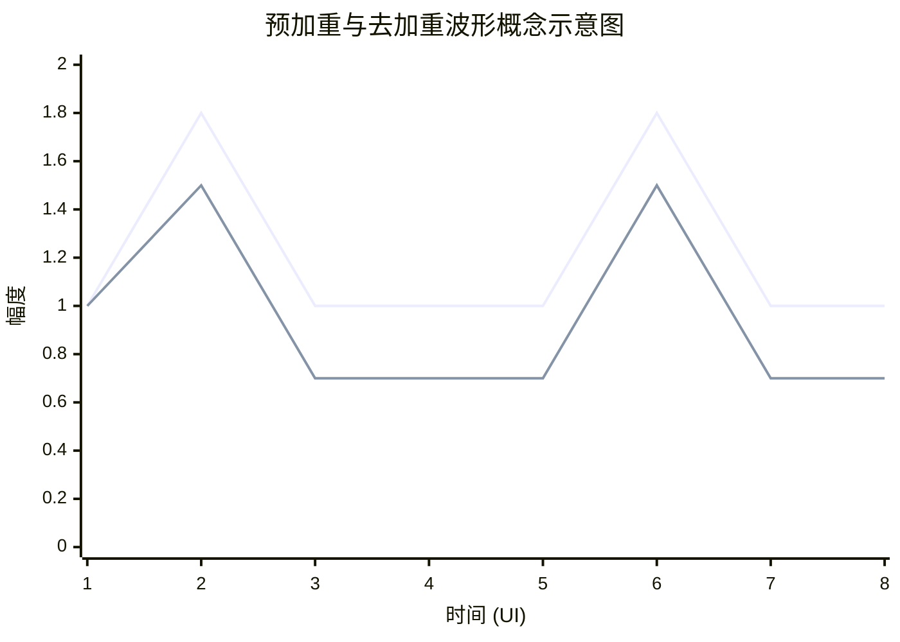

# PCIe

> 📊 **本章难度等级：** **中级 (Intermediate)**

---

### <strong>从PCI到PCIe：为什么需要并行到串行的转变？
要理解这场变革，我们首先要回到过去，看看曾经的王者-并行总线，它遇到了什么无法逾越的障碍。</strong>

一、 并行总线的“黄金时代”与内在缺陷
早期的计算机总线，如PCI（Peripheral Component Interconnect），是典型的并行总线。它的设计思想非常简单直接：“人多力量大”。

⚪ 工作原理：它通过几十根甚至上百根数据线（例如，32位PCI有32根数据线）同时传输一个数据字的每一位。在时钟信号的同步下，一次可以传输32位（4字节）或64位（8字节）的数据。这就像组织一个大型方阵队伍，指挥员（时钟）喊一次“齐步走”，整个方阵（所有数据位）就同时前进一步。
· 优点：在低频率下，原理简单，易于实现和控制。
· 缺点：这种方式的弊端会随着频率（速度）的提升而急剧放大。

并行总线的主要瓶颈可以概括为三个“不一致”：
1. 时序同步的不一致（时钟扭曲 - Clock Skew）
· 问题：当时钟频率越来越高时，电信号在PCB板不同走线上的传播速度会产生微小的差异。这导致时钟信号到达不同数据线的时间有细微差别。同时，数据信号本身也会因为走线长度和负载的不同而产生延迟差异。
· 比喻：还是那个方阵，当“齐步走”的口令下达时，因为队伍太庞大，边缘的人听到口令会晚一点点。大家步伐本身也有快慢。在慢速行走时，这点差异看不出来。但当口令下达得飞快（高频时钟），要求大家以百米冲刺的速度“齐步走”时，队伍必然变得混乱不堪——有的人已经迈出了下一步，有的人上一步还没走完。
· 结果：接收端在采样时，无法准确捕获所有数据线在同一时刻的值，导致数据错误。这是并行总线频率难以提升的最核心物理瓶颈。
2. 信号完整性的不一致（串扰 - Crosstalk）
· 问题：密密麻麻的并行数据线紧密排列，在高频下，每根线都相当于一个天线，会相互产生电磁干扰，这就是串扰。一根线上的信号跳变会“污染”其相邻线上的信号。
· 比喻：在一個非常拥挤、嘈杂的房间里（电路板），很多人（数据线）在同时大声喊话（传输信号）。你很难听清旁边的人具体在说什么，因为其他人的声音会干扰你。
· 结果：信号质量下降，误码率增加。为了减少串扰，需要增加线间距，但这会增大布板面积和成本，与集成电路小型化的趋势背道而驰。
3. 布线复杂性与成本的不一致
· 问题：庞大的数据线、地址线、控制线队伍，使得PCB（印刷电路板）的设计非常复杂，需要更多的布线层，驱动这些线路也需要更多的引脚和更大的功耗。
· 比喻：修建一条拥有32条车道的平行高速公路（并行总线），其占地面积、建材成本、维护成本无疑远高于一条双向2车道的公路（串行总线）。
· 结果：系统成本高昂，布局受限，功耗大，尤其在空间和功耗极度敏感的嵌入式设备中，这是不可接受的。 

### <strong>PCIe历代演进（Gen1-Gen6）：速率、编码与关键特性
PCIe的演进是一部典型的“速度与激情”，每一代都不仅提升了速率，更引入了诸多关键特性来提升效率、可靠性和扩展性。右图提供了一个一目了然的纵向对比，后续我们会详细解读其中的关键点。</strong>

逐代详解与技术深挖
1. PCIe Gen1 & Gen2：奠基时代
* 核心任务：证明串行架构的可行性与优越性，替代AGP和PCI-X。
* 编码：8b/10b
 · 原理：每8位有效数据被编码成10位传输。
 · 目的：
    1.直流平衡：保证传输的0和1数量基本一致，便于接收端CDR电路工作。
    2.提供足够跳变：10位编码中包含足够的信号跳变（0->1, 1->0），确保时钟恢复。
    3.控制字符：一些特殊的10位码字用作包分隔、时钟补偿等控制功能。
  · 代价：20%的带宽开销。例如，Gen1的2.5 GT/s（Giga Transfers per second）速率，实际有效数据速率是 2.5 GT/s * (8/10) = 2.0 Gbps per Lane。
* 嵌入式视角：Gen1/Gen2因速率较低，对PCB材料（如FR-4即可满足）、连接器和布线要求相对宽松，成本较低，至今仍在大量对带宽要求不高的嵌入式工控设备中使用。

2. PCIe Gen3：效率革命
* 核心提升：在提升速率的同时，攻克了编码效率的瓶颈。
* 编码：128b/130b
  · 原理：将128位数据封装成一个块，只添加2位的同步头（Sync Header），用于块锁定和区分控制块。
  · 优势：开销仅为 2/130 ≈ 1.5%，编码效率从80%跃升至98.5%！这是Gen3性能提升远超频率提升幅度的关键。
  · 如何保证信号完整性：放弃了依赖编码保证DC平衡的思路，转而采用加扰（Scrambling）。用一个伪随机序列对数据流进行异或操作，打乱长串的0或1，使其随机化，从而实现直流平衡。
* 嵌入式视角：Gen3开始，信号完整性（SI）变得至关重要。设计时需要采用更精确的仿真工具，关注损耗、反射和串扰。高性能嵌入式系统（如AI计算盒、高端网络设备）开始广泛采用Gen3。 

### <strong>PCIe协议栈三层模型（Transaction/Data Link/Physical）概述</strong>

PCIe协议采用了一个高度结构化的分层架构。这种设计借鉴了网络通信的OSI七层模型思想，将复杂的功能分解到不同的层次中，每一层只专注于自己的核心任务，并通过标准的接口与上下层交互。这样做的好处是职责清晰、易于扩展和维护。

对于嵌入式工程师而言，理解这个模型至关重要：
· 驱动开发者主要与事务层打交道。
· 硬件开发者主要关注物理层的实现。
· 系统工程师需要通盘理解三层如何协同工作以诊断问题。

PCIe协议栈主要由以下三个层次构成，如下图所示，数据流从上到下（发送）或从下到上（接收）穿越这些层次：
      +-----------------------------------------------------------------+
      |                   应用程序/设备核心                             |
      +-----------------------------------------------------------------+
      |                     事务层 (Transaction Layer)                  |
      |    +-----------------------------+-----------------------------+ |
      |    |           TLP生成           |           TLP消费           | |
      |    +-----------------------------+-----------------------------+ |
      +--------------+----------------------------+----------------------+
      |              |       数据链路层 (Data Link Layer)               |
      |              | +-------------------------+--------------------+ |
      |              | | 序列号, LCRC, Ack/Nak   |   流量控制        | |
      |              | +-------------------------+--------------------+ |
      +--------------+--------------+-------------------+--------------+
      |                             |  物理层 (Physical Layer)         |
      |                             | +-----------------+------------+ |
      |                             | | 逻辑子块       | 电气子块   | |
      |                             | +-----------------+------------+ |
      +-----------------------------+---------------------------------+
（↑ 这是一个简化的层次模型图，展示了数据流和核心功能）

现在，我们自底向上，逐一详解每一层的功能。 

### <strong>关键概念入门：TLP、DLLP、链路、通道、LANE、Switch结构、BDF、BAR</strong>

Group 1: 物理结构概念 (硬件如何连接)
1. LANE (通道)
⚪ 定义： PCIe物理连接的最基本、最小单位。每个Lane由两对差分信号线组成：
· 一对用于发送 (TX+ / TX-)
· 一对用于接收 (RX+ / RX-)
⚪ 要点：
· 这是一种全双工的串行连接，发送和接收可以同时进行。
· PCIe设备的连接速度（Gen1, Gen2, Gen3, Gen4, Gen5）是以每个Lane的速率来定义的（如 Gen3 的每个 Lane 速率为 8 GT/s）。
⚪ 类比： 一条单向车道。要实现双向通车，就需要两条这样的车道（一对TX，一对RX）。

2. LINK (链路)
⚪ 定义： 连接两个PCIe设备的物理通信管道。一条Link由1个、2个、4个、8个、12个、16个或32个Lane（通常是2的幂）捆绑（Bonded） 而成。
⚪ 要点：
· 链路的总带宽 = 单个Lane的速率 × Lane的数量。
· 例如：一条 x4 （读作“by 4”）的 PCIe 3.0 链路的总带宽 = 8 GT/s × 4 = 32 GT/s（再考虑编码开销，约为 3.94 GB/s）。
⚪ 类比： 一条高速公路。x1是单车道公路，x4是四车道公路，x16就是十六车道的超级高速公路。车道（Lane）越多，同时能跑的车（数据）就越多，总通行能力（带宽）就越大。

3. Switch结构 (交换机)
⚪ 定义： 用于扩展PCIe系统连接性的设备，允许多个设备共享一个上游端口。
⚪ 结构：
· 一个Switch有一个上游端口（Upstream Port），通常连接到Root Complex（RC）或另一个Switch。
· 有多个下游端口（Downstream Ports），可以连接Endpoint（EP）或其他Switch。
· 内部基于包交换技术，分析到来的TLP目标地址，并将其转发到正确的下游端口。
⚪ 要点：
· 它像网络交换机一样工作，但专为PCIe协议设计。
· 它使PCIe架构从传统的共享总线变为点对点互连，这是性能飞跃的关键。
⚪ 类比： 网络交换机或交通立交桥。数据包从一条路进来，Switch根据地址决定让它从哪条路出去。 

### <strong>嵌入式系统中PCIe的常见应用形态（RC、EP、Switch）
在PCIe的世界里，设备角色是严格定义的，不像以太网那样所有节点可以对等。理解这三种角色是理解整个PCIe系统拓扑的钥匙。</strong>

一、 核心角色定义
首先，我们明确三个核心角色的职责：

1. 根复合体 (Root Complex, RC)
* 角色定位：系统的“大脑”和“中心”。它是PCIe拓扑结构的根，是CPU/Chipset与PCIe架构之间的接口。
* 核心功能：
  · 生成CPU的存储器和I/O请求，并将其转换为PCIe的事务层包（TLP）。
  · 接收来自PCIe设备的TLP，并将其转换为CPU能理解的格式。
  · 包含一个或多个PCIe端口（Port），每个端口可以连接一个EP或一个Switch。
  · 负责系统的枚举过程，在启动时扫描并配置所有下游设备。
* 在嵌入式系统中的形态：在嵌入式SoC（System on Chip）中，RC通常被集成在芯片内部。例如，一颗基于ARM Cortex-A系列的应用处理器（如NXP i.MX8、TI Jacinto7、NVIDIA Jetson Orin）通常会包含一个或多个PCIe控制器，这些控制器在作为主机（Host） 时，其PCIe端口就工作在RC模式。
* 比喻：RC就像一个家庭的“总电闸箱”，电力公司（CPU）的电从这里接入，并分配到各个分支电路（下游设备）。

2. 端点设备 (Endpoint, EP)
* 角色定位：功能的“执行者”。它是PCIe拓扑中的叶子节点，是提供具体功能的设备。
* 核心功能：
  · 实现特定的功能（如网络、存储、图像采集、加速计算）。
  · 响应来自RC的配置读写请求。
  · 向RC发起存储器读写请求（DMA操作）和中断（MSI/MSI-X）。
* 在嵌入式系统中的形态：
  · 外插卡：如M.2接口的NVMe SSD、4G/5G模组。
  · 板载设备：如通过PCIe接口连接的千兆以太网控制器（Intel I211）、Wi-Fi/蓝牙模组。
  · FPGA：FPGA可以配置为一个复杂的EP，实现自定义的硬件加速功能。
* 比喻：EP就像家里的各个“电器”，如电视、冰箱、空调。它们从电闸箱（RC）获取电力，并执行自己的特定功能。

3. 交换器 (Switch)
* 角色定位：网络的“交换机”。它用于扩展PCIe端口数量，将一个上游端口（Upstream Port）连接到多个下游端口（Downstream Ports）。
* 核心功能：
  · 在多个下游端口之间路由TLP包。
  · 对TLP包进行仲裁，管理上下游的流量。
  · 通常支持多种路由方式（基于地址、ID等）。
* 在嵌入式系统中的形态：通常是一颗独立的芯片。当SoC自带的PCIe端口数量不足时，就需要通过PCIe Switch来扩展。
* 比喻：Switch就像一个“插线板”或“网络交换机”，它将总闸（RC）出来的一路电（一个端口）扩展成多路（多个端口），从而可以连接更多的电器（EP）。 

### <strong>物理层内部划分：逻辑子块与电气子块
PCIe物理层（PHY）是一个复杂且精密的模块，为了便于设计和理解，其内部被清晰地划分为两大功能子块：逻辑子块和电气子块。这两者通过一个关键的内部接口——PIPE接口进行通信。</strong>

一、 逻辑子块 (Logical Sublayer)
逻辑子块是PHY中靠近数据链路层的数字逻辑部分，它处理的是并行数据。
*  核心功能：
    1.  与数据链路层的接口：通过PIPE接口接收来自数据链路层的并行发送数据，并向其传递接收到的并行数据。PIPE接口定义了数据、控制信号以及时钟（通常为核心时钟，如`PCLK`）的标准。
    2.  数字信号处理：
        *   编码/解码 (Encode/Decode)：实施如8b/10b或128b/130b编码 scheme。发送路径上将数据编码，接收路径上将其解码。
        *   加扰/解扰 (Scramble/Descramble)：对数据流进行加扰以实现直流平衡和解扰以恢复原始数据。
        *   弹性缓冲 (Elastic Buffer)：在接收路径上，用于补偿本地参考时钟与从串行数据流中恢复出的时钟之间的微小频率差异。
        *   字节对齐 (Byte Alignment)：识别输入数据流中的特殊字符（如COM符号），以确定正确的字节边界。

*   工作域：并行数据域、数字逻辑、由核心时钟（PCLK）驱*。
*   嵌入式视角：逻辑子块的行为通常可以通过PHY的配置寄存器进行控制（如设置速率、使能加扰等），这部分通常由Bootloader或操作系统中的驱动程序完成。问题多表现为配置错误或兼容性问题。 

### <strong>差分信号与S参数基础：深入理解插入损耗、回波损耗</strong>

一、 差分信号 (Differential Signaling)：抗干扰的利器
1. 是什么？
差分传输使用两根线（D+和D-）来传送一个信号。这两根线承载着幅度相等、相位相反的信号。接收端通过检测两根线之间的电压差（Vdiff = V_D+ - V_D-）来判定逻辑状态（例如，Vdiff > 0 为逻辑1，Vdiff < 0 为逻辑0）。

2. 为什么在高速系统中不可或缺？
它主要解决了单端信号在高速下的两大痛点：
*   抗共模噪声 (Common-Mode Noise Rejection)：
    *   问题：外部来源的电磁干扰（EMI），如电机、电源噪声，会几乎同等地耦合到两根相邻的走线上。
    *   解决：由于噪声（V_noise）在两根线上是相同的，计算电压差时会被抵消：`Vdiff = (V_D+ + V_noise) - (V_D- + V_noise) = V_D+ - V_D-`。接收器对这个“同步”的噪声不敏感。
    *   比喻：就像在嘈杂的工厂里（噪声环境），两个人用方言一唱一和地说反话（差分信号）。你可能听不清每个字（绝对电压），但很容易听懂他们说的是不是相反（电压差）。
*   更低电磁辐射 (Lower EMI)：
    *   问题：单端信号的回流路径是地平面，环路面积较大，如同天线，辐射较强。
    *   解决：差分信号的回流路径主要是另一根信号线。两根线产生的磁场方向相反，相互抵消，从而显著降低了对外辐射。
*   对嵌入式设计的挑战：
    *   严格等长 (Length Matching)：两根差分线的长度必须尽可能相等。长度不匹配会导致相位差，使信号到达时间不同，电压差被破坏，共模噪声抑制能力下降，从而产生“差分噪声”。
    *   严格等距 (Impedance Matching)：必须严格控制差分阻抗（通常为100Ω或85Ω）。阻抗突变会导致信号反射。 

### <strong>发送端技术：预加重、去加重、摆动控制
在高频下，PCB通道更像一个**低通滤波器**，会优先衰减信号的高频分量（对应信号的快速跳变边沿），导致信号“模糊不清”。发送端均衡技术的目标就是**预先补偿**这种失真。</strong>

#### **一、 核心概念：什么是“加重”？**

想象一位老人听力下降，尤其听不清高音（高频损耗）。你跟他说话有兩種方式：
1.  **正常说话**：他说“听不清”。
2.  **刻意提高声调（预加重）**：你用比正常更尖的嗓音开始每个词，然后恢复正常音调。虽然他听到的声音还是会衰减，但最终听到的整体效果更接近你正常说话的初衷。

第二种方法就是“加重”（Emphasis）的思想：**在发送端预先对信号进行整形，以抵消通道将要造成的失真。**

#### **二、 预加重 (Pre-emphasis) 与 去加重 (De-emphasis)**

这是同一枚硬币的两面，都是通过增强跳变比特来对抗ISI。

*   **预加重 (Pre-emphasis)**：
    *   **做法**：在信号发生电平**跳变**的瞬间，**增大**驱动电流，使跳变边沿变得更加陡峭。
    *   **效果**：补偿通道对高频分量的衰减，使接收端能更清晰地识别跳变发生的时刻。
    *   **波形特征**：跳变处的电压幅值会**超过**正常的稳态电压（`Vmax`）。

*   **去加重 (De-emphasis)**：
    *   **做法**：在信号电平**保持不变**的比特周期内，**减小**驱动电流。
    *   **另一种视角**：可以理解为只在跳变时使用“正常”幅值发送，而在非跳变期主动“降低”幅值。两者的最终效果是等价的。
    *   **波形特征**：跳变后的第一个比特之后，电压幅值会**下降**到一个较低的稳态值。
    *   **优势**：相比预加重，去加重**更省功耗**（大部分时间在低功率驱动），且EMI更小。

**预加重与去加重的对比示意图：**

*（上图：蓝色线示意了预加重，在跳变点有过冲；橙色线示意了去加重，在非跳变期有幅度下降）*

**如何量化？**
加重的大小通常用**分贝（dB）** 来表示。
`De-emphasis = 20 * log10(V_non-toggle / V_toggle)`
例如，-3.5 dB的去加重意味着非跳变期的电压幅度是跳变期电压幅度的 ~67%。 

### <strong>接收端技术：CTLE、DFE、CDR时钟数据恢复原理
信号经过PCB通道后，高频分量严重衰减，符号间干扰（ISI）使其变得“模糊不清”。接收端的任务就是对这个失真的信号进行“修复”和“重建”。</strong>

#### **一、 CTLE (Continuous Time Linear Equalizer) - 连续时间线性均衡器**

*   **角色**：**“图形均衡器”**。像一个音频播放器上的均衡器，专门提升被通道衰减的高频分量。
*   **工作原理**：
    *   它是一个**模拟高通滤波器**。其传递函数在频域上与通道的衰减特性（S参数中的插入损耗）大致相反。
    *   通过放大信号的高频部分（快速跳变边沿），同时保持低频部分不变，CTLE可以有效地“打开”被闭合的眼图，使波形变得更为清晰锐利。
*   **特性**：
    *   **线性**：处理方式与信号幅度无关。
    *   **会放大噪声**：在放大高频信号的同时，也会放大高频噪声，这是它的主要缺点。
    *   **可配置**：通常有多个增益档位（Peaking Gain），在链路训练期间由接收端自动选择最佳档位。
*   **嵌入式意义**：CTLE是接收端均衡的第一道、也是必不可少的一道工序。它为后续更精细的均衡（DFE）做好了准备。

#### **二、 DFE (Decision Feedback Equalizer) - 判决反馈均衡器**

*   **角色**：**“精准预测与修正”**。这是一个更强大、更智能的非线性均衡器。
*   **工作原理**：
    1.  **判决**：一个比较器（ slicer ）对经过CTLE初步均衡的信号进行采样，做出“0”或“1”的初步判决。
    2.  **反馈**：DFE的核心在于它有一个**抽头（Tap）** 电路。这些抽头记住了**之前几个比特**的判决结果。
    3.  **预测与抵消**：DFE知道之前比特的ISI会对当前比特产生多少干扰。它生成一个与这个干扰**大小相等、方向相反**的校正量。
    4.  **叠加**：将这个校正量叠加到当前比特的输入信号上，从而**抵消**掉由之前比特引起的ISI。
    *   公式概念：`当前比特校正后电压 = 输入电压 + (a1 * 前1bit) + (a2 * 前2bit) + ...`
*   **特性**：
    *   **非线性**：它的操作依赖于对数据的判决结果。
    *   **不放大噪声**：这是相对于CTLE的巨大优势。因为它只产生抵消信号，而不放大输入信号本身。
    *   **因果律**：它只能消除**先前符号**产生的ISI，无法消除后续符号产生的ISI（需要更复杂的均衡器）。
*   **嵌入式意义**：DFE是应对严重ISI的“杀手锏”。Gen3及以上速率的高度依赖DFE。抽头的数量（如5-tap DFE）和系数调整算法直接决定了接收端的性能上限。 

### <strong>编码机制：8b/10b, 128b/130b, PAM4 (Gen6) 编码详解与开销分析</strong>

#### **1. 为什么需要编码？**

在深入具体编码方案之前，我们必须先理解：为什么要在物理层对原始数据进行如此复杂的变换？直接发送‘0’和‘1’不是最简单吗？

答案是否定的。物理链路（PCB走线、连接器、电缆）并非理想通道，直接传输原始数据会遇到三大核心挑战：

1.  **直流平衡（DC Balance）**：如果数据流中长时间出现连续的‘1’或‘0’，会导致信号的平均电压（DC分量）发生偏移。接收端的交流耦合电容会阻挡这个DC分量，造成**基线漂移（Baseline Wander）**，严重时会使接收器误判‘0’和‘1’，导致误码。
2.  **时钟恢复（Clock Recovery）**：接收端没有独立的时钟线来告诉它何时采样数据。它必须从数据流本身的变化（跳变边沿）来提取时钟信号。如果数据流中出现长串的连续‘0’或‘1’（无跳变），接收端的时钟数据恢复（CDR）电路就会失去参考，导致**时钟漂移**，最终采样出错。
3.  **控制字符嵌入**：物理层需要一种方法来传输诸如“数据包开始”、“数据包结束”、“空闲”、“电气空闲”等控制信息，而这些信息必须与普通数据区分开来。

编码，就是为了解决这三大问题而生的**信号调理**过程。它通过在原始数据中插入额外的“冗余”比特，赋予数据流特定的物理特性。

---

#### **2. PCIe Gen1/2: 8b/10b 编码**

这是PCIe 1.0和2.0时代使用的编码方案，非常经典。

*   **原理**：将原始的8位数据（一个字节）转换成一个10位的**符号（Symbol）**。这个10位的符号不是随意选择的，它必须满足以下规则：
    *   **跳变丰富**：保证连续‘0’或‘1’的数量不超过5个（即“游程长度”受限），为CDR提供充足的时钟参考。
    *   **直流平衡**：每个10位符号中，‘1’的数量和‘0’的数量之差（称为“不均等性”，**Disparity**）控制在±1以内。长期来看，‘1’和‘0’的数量基本相等，维持DC平衡。

*   **如何实现**：编码过程由一个查找表定义，将256个可能的8位数据值（`0x00`-`0xFF`）映射到两部分10位码：
    *   **数据字符（Data Characters）**：`D.x.y`，例如 `D10.2`（`0x4A`）。
    *   **控制字符（Control Characters）**：`K.x.y`，例如 `K28.5`（`COM`逗号符），用于同步和标识特殊状态。控制字符的编码通常无法在数据部分出现，便于接收端区分。

*   **开销分析**：
    *   **带宽开销**：每传输8比特有效数据，需要在线路上传输10比特物理信号。
    *   **效率**：**8 / 10 = 80%**。这意味着标称 5.0 GT/s（Giga Transfers per second）的Gen2链路，其有效数据速率是 `5.0 GT/s * 80% = 4.0 Gbps`（ per lane）。

*   **嵌入式设计挑战**：
    *   **频率要求**：80%的效率意味着物理SerDes电路必须工作在高出数据速率25%的频率上，对硬件设计提出了更高要求。
    *   **功耗**：较高的波特率（Baud Rate）带来更高的动态功耗。

--- 

### <strong>加扰(Scrambling)原理与作用</strong>

#### **一、 问题根源：为什么需要加扰？**

在介绍复杂的编码之前，我们先看一个不加扰的、原始的NRZ数据流可能遇到的问题：

1.  **直流平衡（DC Balance）问题**：如果数据流中出现长串连续的“0”或“1”，信号的直流分量会发生偏移。这会给交流耦合电容的充电带来压力，并可能使接收端放大器饱和，导致基线漂移，增加误码风险。
2.  **电磁干扰（EMI）问题**：重复性的数据模式（如周期性的`0xFFFF`或`0x0000`）会在频域上产生巨大的能量尖峰，就像一个个强大的无线电发射器，极易超出EMI认证标准，并干扰板上其他电路。
3.  **接收端时钟恢复（CDR）问题**：CDR电路依赖数据跳变（0->1, 1->0）来锁定相位。长串无跳变的数据会使CDR失去参考，可能导致时钟漂移和失锁。

加扰就是为了从根本上**随机化**数据流，从而解决以上所有问题。

#### **二、 加扰原理：用伪随机序列“打乱”数据**

加扰的核心思想非常简单：**在发送端，用一个已知的伪随机二进制序列（PRBS）与原始数据流进行异或（XOR）运算；在接收端，用相同的PRBS序列再次进行异或运算，即可恢复出原始数据。**

*   **发送端（Scrambling）**：
    `加扰后数据 = 原始数据 XOR PRBS序列`

*   **接收端（Descrambling）**：
    `原始数据 = 加扰后数据 XOR PRBS序列`

**关键在于这个PRBS序列**：它由一个**线性反馈移位寄存器（LFSR）** 产生。LFSR由一组寄存器和反馈抽头组成，在时钟驱动下会产生一个看似随机、但周期非常长且确定可重复的比特序列。

*   **PCIe Gen1/2**：使用一个16位的LFSR，多项式为 `x^16 + x^5 + x^4 + x^3 + 1`。
*   **PCIe Gen3+**：使用一个23位的LFSR，多项式更长，随机性更好。 

### <strong>LTSSM状态机完整解析：Detect, Polling, Configuration, L0, Recovery
(重要)</strong>

第3.1节 LTSSM状态机完整解析：从物理连接到高速传输的握手之旅
引言：为什么需要复杂的“链路训练”？
想象一下，两个说不同语言、听力灵敏度不同、且完全不知道对方存在的人，突然被要求进行高速、无误的对话。他们需要先互相发现，统一语速和音量，确认彼此都能听清，然后才能开始正式交流。

PCIe链路两端的设备（Root Complex和Endpoint）在上电之初就是这样的“陌生人”。
它们面临一系列必须解决的物理层不确定性：
· 对方是否存在？ （链路检测）
· 对方能跑多快？ （速率协商）
· 我们之间连了几条“车道”（Lane）？ （链路宽度协商）
· 信号经过传输线后失真了，怎么补偿？ （通道均衡）
· 线接反了怎么办？ （极性反转）

LTSSM (Link Training and Status State Machine)，即链路训练与状态状态机，就是为解决这些问题而设计的一套精密、自动化的握手协议。它是PCIe物理层的“大脑”，负责管理链路从断开、初始化、激活到电源管理的全过程。

LTSSM概览：十一状态乾坤
LTSSM是一个庞大的状态机，包含11个主要状态。
但其核心流程可以概括为一条主线：检测 -> 协商 -> 配置 -> 传输。右图描绘了其核心状态转换流程： 

### <strong>训练序列（TS1/TS2）格式与信息字段详解</strong>

一、 训练序列的角色与目的
在链路训练过程中，相连的两个设备（例如RC和EP）并不知道对端的任何信息。它们通过反复向对方发送一种特殊的数据包——训练序列（Training Sequence, TS）——来交换信息、协商参数、并调整自身设置。

训练序列主要有两个有序集（Ordered-Set）：
*   TS1 (Training Sequence 1)：用于初始握手、传递核心训练参数。
*   TS2 (Training Sequence 2)：用于确认TS1协商的参数，完成最终配置。

它们就像两个人在一片漆黑中试图握手：
1.  先大声喊：“你好！我是左撇子，我想用这个速度握手！”（发送TS1）
2.  听到对方同样的喊话后，确认道：“好的！我也是左撇子，就按这个速度来！”（发送TS2）
3.  然后双方成功握手（进入L0状态）。

二、 TS1/TS2 的通用格式
每个TS1或TS2有序集由一个特定的16符号（16-symbol）模式组成。其通用结构如下：
 符号位置 字段名      | 描述 
 0        COM        | 通信符号（K28.5）。标志着一個有序集的开始，用于符号锁定和字节对齐。 
 1-2      Link Number| 链路号。标识该训练序列属于哪个逻辑链路（在多端口设备中很重要）。 
 3        Lane Number| 通道号。标识该训练序列是由哪个物理Lane发送的。这是训练初期最关键字段之一。 
 4-12     N_FTS等等  | 这些字段承载了训练所需交换的各种信息。其具体含义因上下文（状态机状态）而异。 
 13-14    Data Stream| 在某些状态下用于传递特定信息（如Deemphasis值），在其他状态下可能是固定值。 
 15       CRC-5      | 5位循环冗余校验码，用于检测TS1/TS2包在传输过程中的错误。 
（注意：Gen4及以上速率，格式有扩展，但核心思想不变) 

### <strong>速率协商与通道均衡（Equlization）过程深度剖析</strong>

一、 问题根源：为什么需要均衡？
随着PCIe速率一代代提升，信号频率越来越高，信道损耗（Channel Loss） 和符号间干扰（ISI）成为最大的敌人。
1.  信道损耗：PCB板材的介质损耗和导体的趋肤效应导致信号的高频分量衰减远大于低频分量。其结果是一个理想的方波信号经过长距离传输后，会变成一个幅度衰减、边沿圆滑的波形，像“融化”了一样。
2.  符号间干扰（ISI）：由于高频分量丢失，一个比特的“尾巴”（拖尾振荡）会拖得很长，从而干扰到后续比特的判决点，导致接收端无法正确识别当前比特是0还是1。

均衡（Equalization） 的目的就是充当一个“反向滤波器”，有针对性地放大被衰减的高频分量，补偿信道损耗，让眼图重新张开，从而保证数据的正确传输。

二、 速率协商（Link Rate Negotiation）
在开始复杂的均衡之前，设备需要先确定他们能共同工作的最高速率。
*   过程：
    1.  广播能力：在链路训练的Polling状态，双方设备通过发送TS1序列中的Data Rate Identifier字段，来广播自己支持的PCIe世代（如Gen1, Gen2, Gen3, Gen4, Gen5）。
    2.  求交集：双方设备会查看对方支持的最高速率，并选择双方都支持的最高共同速率作为训练目标。 

### <strong>通道操作：极性反转、通道反转、通道屏蔽
在链路训练的 `Configuration` 状态中，相连的两个设备会通过交换TS1和TS2序列，自动检测并协商解决三种可能的物理连接差异。这些操作完全由硬件自动完成，对软件和操作系统透明。</strong>

一、 极性反转 (Polarity Inversion)
*   是什么？
    物理上将差分信号对的 `D+` 和 `D-` 两根线接反了。
*   为什么会发生？
    这通常是一个无意的PCB布线错误。在设计密集的板卡时，差分对在穿过连接器或绕过障碍物时，设计人员可能不小心将D+和D-交叉了。
*   如何解决？
    PCIe接收端硬件具备自动检测和纠正极性错误的能力。
    1.  检测：接收端会监测进来的差分信号。它会寻找TS序列中特定的控制字符（如COM符号）。如果极性正确，解码这些字符会得到预期值；如果极性反了，解码结果将是错误的。
    2.  纠正：一旦检测到极性错误，接收端可以在其内部简单地通过逻辑交换对D+和D-信号的解释。也就是说，它会把实际连接的`D+`线当作`D-`来处理，把`D-`线当作`D+`来处理。
    3.  协商：接收端会在其发出的TS序列中设置 `Polarity Inverted` 比特位，告知对端自己已启用极性反转校正。
*   嵌入式意义：
    *   设计容错：这是一项“救命”的功能。即使犯了低级的布线错误，链路仍然能够正常工作，无需修改PCB，避免了昂贵的重新打样费用。
    *   布线灵活性：在某种程度上，设计师无需过分担心差分对的交叉问题，降低了布线难度。 

### <strong>链路层电源管理状态：L0s, L1, L2/L3 Ready
PCIe链路电源管理是一套精细的状态机，其核心设计哲学是：在尽可能低的功耗下，提供尽可能快的恢复速度。不同的状态在功耗和恢复延迟之间提供了不同的权衡。</strong>

一、 状态详解
1. L0 状态 (Active State)
*   描述：全功率工作状态。链路被完全激活，所有差分收发器都正常工作，可以传输数据包（TLP、DLLP）和训练序列（TS）
*   功耗：最高。
*   恢复延迟：不适用（已是活动状态）。
*   嵌入式场景：设备正在 actively 进行数据传输，如SSD正在读写，网卡正在收发数据包。
2. L0s 状态 (低恢复延迟休眠状态 - `L0 standby`)
*   描述：“瞬间唤醒”的微休眠。这是为短时间空闲设计的超低功耗状态。关键特点是TX和RX可以独立、异步地进入各自的L0s状态。
    *   当一方（如EP）发送完数据后，可以立即关闭自己的TX电路，进入`TX_L0s`，即使对方（RC）的RX还在活动。
    *   同样，当一方停止接收数据时，可以关闭自己的RX电路，进入`RX_L0s`。
*   功耗：显著低于L0（主要节省了模拟SerDes PHY的功耗）。
*   恢复延迟：极低（纳秒级）。恢复不需要发送复杂的训练序列，只需发送几个快速退出序列（FTS, Fast Training Sequence）即可重新同步。
*   嵌入式场景：处理突发流量时的理想状态。例如，网络设备在数据包间隙、处理器访问外设寄存器之间的空闲时间。这是优化能耗的关键状*。
3. L1 状态 (休眠状态)
*   描述：更深度的休眠。链路的双方同步进入此状态。常见的子状态：
    *   软件发起的L1 (ASPM L1)：由链路电源管理策略（如Linux的ASPM）在预测到较长空闲时自动进入。
    *   硬件自主的L1 (L1.0)：在某些条件下由硬件自动触发。
    *   L1.1/L1.2：更先进的子状态（需协议支持），可以关闭更多电路（如PLL锁相环），进一步省电，但恢复延迟更长。
*   功耗：比L0s更低（ common clock 架构下，参考时钟可能被关闭）。
*   恢复延迟：较高（微秒级）。需要重新进行部分链路训练（如重新锁PLL、发送TS1/TS2序列）。
*   嵌入式场景：适用于系统轻度空闲或进入低功耗模式前的准备状态。例如，手机屏幕关闭后，连接到处理器的各种外围设备可以进入L1状态。
4. L2/L3 Ready 状态 (过渡状态)
*   描述：这不是一个真正的低功耗状态，而是一个握手确认状态。当系统软件决定将PCIe设备切换到完全断电状态（L2/L3）时，会发起一个请求。
*   过程：
    1.  软件发出请求。
    2.  链路进入`L2/L3 Ready`状态，双方完成最后的握手，确认所有未完成的事务已处理完毕。
    3.  一旦握手完成，就意味着“链路已准备好断电”，随后主电源 (`Vcc`) 和参考时钟 (`REFCLK`)可以被移除，链路进入真正的L2或L3状态。
*   功耗：与L1类似。
*   恢复延迟：不适用，因为下一步是彻底断电。
*   嵌入式场景：系统进入睡眠（Suspend-to-RAM）或关机流程的一部分。
5. L2/L3 状态 (完全断电状态)
*   描述：链路断电。`Vcc`主电源和`REFCLK`参考时钟被关闭。仅保留辅助电源 (`Vaux`)为设备的基本功能供电，如唤醒事件检测。
*   功耗：极低（仅`Vaux`域的漏电功耗）。
*   恢复延迟：非常长（毫秒级）。需要经历完整的上电、复位、链路训练过程，相当于一次冷启动。
*   嵌入式场景：系统深度睡眠或软关机状态。 

### <strong>高级电源管理：ASPM机制与时钟功率管理</strong>

一、 ASPM (Active State Power Management) 机制详解
ASPM是一种硬件自主的、基于链路的电源管理机制。它的核心特点是：无需操作系统或驱动程序频繁干预，由PCIe链路两端的物理层和数据链路层硬件根据链路活跃度自动协商进入低功耗状态。
1. ASPM 的两个核心子状态：
| 特性     | ASPM L0s                                         | ASPM L1 |
| 口号     | “瞬间打盹”                                      | “安心小睡” |
| 触发机制 | 硬件自动，由空闲计时器触发。TX和RX可独立、异步进入。 | 可由硬件自动（L1.0）或软件策略（基于更长空闲时间的预测）触发。需要双方同步进入。 |
| 功耗     | 中等节省。主要关闭SerDes模拟电路（功耗大户），数字部分和时钟仍运行。 | 深度节省。可关闭PLL锁相环和公共时钟逻辑，电压可降低。 |
| 恢复延迟 | 极低（纳秒级）。只需发送少量FTS（快速训练序列）重新同步。 | 较高（微秒级）。需要重新激活PLL、进行部分链路训练。 |
| 应用场景 | 数据包之间的短暂空闲（微秒级）。是节能的第一道和最主要防线。 | 较长的空闲期（毫秒级）。在性能和功耗间取得较好平衡。 |

2. ASPM 的工作流程（以L1为例）：
1.  空闲检测：链路处于L0状态一段时间（由硬件计数器或软件策略决定）。
2.  请求进入：一方（如Endpoint）通过发送PM_Enter_L1 DLLP数据链路层包，向另一方（Root Complex）请求进入L1。
3.  确认与同步：RC回复PM_Request_ACK DLLP，双方同步切断活动。
4.  进入状态：双方关闭协议约定的电路模块，进入L1状态。
5.  唤醒事件：当有新的TLP需要传输或收到唤醒信号时，双方执行反向流程，通过发送TS1序列进行训练，恢复至L0状态。

3. 嵌入式系统中的ASPM配置与调试：
*   启用：ASPM需*BIOS/UEFI固件和操作系统共同正确配置才能生效。在Linux中，可以通过内核参数（如`pcie_aspm=force`）或运行时调节（`/sys/module/pcie_aspm/parameters/policy`）来控制系统策略。
*   查看状态：使用 `lspci -vv` 命令。输出中的 `LnkCtl` 行显示ASPM是否启用，`LnkSta` 行显示当前状态。
*   常见问题：
    *   兼容性问题：旧设备或Switch可能不支持ASPM，会导致整个链路ASPM被禁用。
    *   稳定性问题：如果信号完整性差或时钟有抖动，在ASPM状态切换时容易发生链路掉线或性能下降。此时可能需要在内核中禁用ASPM。 

### <strong>事务类型：Memory, IO, Config, Message, AtomicOp
事务层是PCIe协议栈的“最高层”，它最接近软件和处理器核心。它的主要任务是将CPU的请求（对设备内存空间的读写）和设备的响应（中断消息、完成状态）打包和解包，并管理这些数据包的传输质量（QoS）</strong>

4.1 事务类型：PCIe能做什么？
PCIe协议定义了多种事务类型，以适应不同的通信需求。你可以把它们理解为不同的“快递服务类型”。

1. Memory事务（Memory Read / Write）
· 目的： 这是最核心、最常用的事务类型，用于CPU与设备之间或设备与设备之间（在Peer-to-Peer模式下）传输大量数据。
· 发起者： 通常是CPU（发起读/写请求）或DMA控制器（设备发起读/写请求）。
· 应用场景：
  · CPU将数据写入设备的显存或缓冲区（Memory Write）。
  · CPU从设备读取状态寄存器或数据缓冲区（Memory Read）。
  · 网卡通过DMA将收到的网络包数据写入主内存（Memory Write）。
  · 显卡通过DMA从主内存读取纹理数据（Memory Read）。
· 特点： 需要Completion（完成包）来回应Read请求，确认数据已返回。对于Write请求，协议本身不要求回应，但设备可以通过其他方式（如中断）告知完成。

2. IO事务（IO Read / Write）
· 目的： 用于访问设备的IO端口空间。这是一个为了兼容古老的PCI/ISA设备而保留的机制。
· 现状： 在现代的PCIe设备和x86-64架构中，IO空间已经很少使用。几乎所有的设备都将其寄存器映射到更大的内存空间（通过BAR）来访问。ARM架构甚至根本不支持IO端口空间。
· 特点： 类似于Memory事务，Read需要Completion，Write可选。 

### <strong>TLP包结构精讲：Header格式、Digest、ECRC</strong>

4.2 TLP包结构精讲：数据包的“信封”里有什么？
TLP（Transaction Layer Packet）是事务层的数据包单元。
它就像一封信，包含了信封（Header）、信纸（Data Payload） 和封条（Digest/ECRC）。
一个TLP由三个主要部分组成：
· TLP前缀（可选） - 本文不深入探讨，如MR-IOV等高级功能使用。
· TLP核心（必选） - 包含Header和Data。
· TLP后缀（可选） - 包含ECRC。
┌─────────┬───────────────┬─────────┐
│   TLP Prefix    │          TLP Core          │   TLP Suffix    │
│   (Optional)    ├───────┬───────┤    (Optional)   │
│                 │  TLP Header │   TLP Data  │                 │
│                 │  (3-4 DW)   │  (0-N DW)   │                 │
└─────────┴───────┴───────┴─────────┘ 

### <strong>路由机制：地址路由、ID路由、隐式路由</strong>

4.3 路由机制：数据包如何找到路？
在复杂的PCIe拓扑（可能存在多个Switch）中，TLP必须依靠Header中的信息来决定自己的路径。
PCIe定义了三种路由方式：
1. 基于地址的路由（Address-Based Routing）
· 适用对象： Memory 和 IO 事务请求。
· 工作原理：
  · 每个设备（Endpoint和Switch）都通过其BAR或配置空间，知道自己“响应”的地址范围。
  · Switch内部有一张地址映射表。当它收到一个TLP时，会检查TLP Header中的目标地址。
  · 如果地址落在某个下游端口所连接的设备的地址范围内，Switch就将TLP转发到该端口。
  · 如果地址不属于任何下游设备，Switch就将其转发到上游端口（朝向RC）。
  · Root Complex 是地址路由的终点。它要么将请求转发给CPU/内存控制器，要么拒绝它。
简单理解： 就像快递根据收件地址来分拣和配送包裹。 

### <strong>流量类别（TC）与虚拟通道（VC）：原理与仲裁</strong>

1. 核心概念：为什么需要 QoS？
想象一个简单的嵌入式系统：一个摄像头通过PCIe将视频流发送给处理器，同时一个固态硬盘（SSE）在进行大量的数据读写。如果没有优先级区分，庞大的SSD读写流量可能会阻塞摄像头的数据包，导致视频帧丢失或延迟，影响计算机视觉算法的实时性。
PCIe的服务质量（QoS, Quality of Service）机制就是为了解决这个问题而生的。它的核心思想是：为不同类型的数据流量分配不同的优先级和独立的传输资源，从而避免“劣质”流量阻塞“优质”流量。

流量类别（TC, Traffic Class） 和 虚拟通道（VC, Virtual Channel）就是实现PCIe QoS的两大基石。
*   TC (Traffic Class)：这是一个标签，一个存在于TLP头部的3比特字段。这意味着每个TLP都可以被标记为8个（0-7）优先级中的一个。TC值越高，优先级越高。TC是由事务的发起者（例如CPU、GPU、网卡）根据数据的重要性来分配的。
    *   例如：摄像头可以将视频数据标记为`TC7`（最高优先级），将配置信息标记为`TC0`（普通优先级）。
*   VC (Virtual Channel)：这是一个资源，是一套独立的物理传输资源，包括独立的流量控制信用（Flow Control Credit）缓冲区和独立的仲裁器。你可以将每个VC想象成一条独立的虚拟车道。不同VC中的TLP是物理上隔离的，不会相互阻塞。
核心关系：TC是“需求”，VC是“供给”。系统设计者需要建立一套映射规则，将带有不同TC标签的数据包，映射到不同的VC“车道”中去传输。
2. TC：事务的优先级标签
*   实现机制：在TLP的Header中，有一个3位的`TC`字段。发送端设备在创建TLP时，就需要根据数据类型为其赋予一个TC值。
*   谁来设置：
    *   CPU发起的事务：通常由Root Complex根据内存地址范围或软件配置来分配TC。
    *   Endpoint发起的事务：Endpoint设备本身必须具备根据其内部流量类型设置TC的能力。这在嵌入式设备驱动开发中是需要配置的关键点。
*   嵌入式应用：在Linux驱动中，可以通过`pci_set_master()`和配置DMA掩码等操作间接影响TC的分配，但更精细的控制往往依赖于硬件本身的设置或BIOS/FPGA的逻辑设计。 

### <strong>排序规则与生产者-消费者模型</strong>

一、 为什么需要排序规则？
在一个复杂的系统中，多个主设备（如CPU、GPU、网卡、存储控制器）通过PCIe总线并发地访问内存，如果事务完全乱序完成，会导致灾难性的后果：
*   数据一致性破坏：CPU要求外设先更新数据结构中的`data`字段，再更新`flag`字段表示数据就绪。如果更新`flag`的写请求先于`data`到达，CPU将看到旧的数据和新的标志。
*   死锁：缺乏规则的乱序可能在某些情况下导致依赖循环，进而引发死锁。

PCIe协议定义了一套严谨的排序规则（Ordering Rules）和宽松排序（Relaxed Ordering）机制，旨在保证正确性的前提下，尽可能提升性能。

二、 核心规则概述
PCIe的排序规则基于两个核心概念：地址和类型。其基本规则可以概括为以下几条：
1.  同方向事务保持顺序：
    *   对同一地址的写操作必须保持程序顺序。即：如果请求者先发Wr A，后发Wr B，那么对A的写操作必须在B之前对系统可见。
    *   读操作之间不保证顺序。请求者可以重新排序两个读请求以优化性能。

2.  不同方向事务的排序：
    *   读操作不能越过写操作（Read-After-Write Hazard）：一个对地址X的读操作，必须发生在一个对X的写操作之后。这保证了读操作能拿到最新的数据。
    *   写操作不能越过读操作（Write-After-Read Hazard）：一个对地址X的写操作，必须发生在一个对X的读操作之后。这保证了读操作拿到的是旧数据。
    *   写操作不能越过写操作（Write-After-Write Hazard）：见规则1。 

### <strong>事务处理中的错误处理：Poisoned TLP</strong>

1. 核心思想：什么是“中毒”？
想象一下，一个PCIe设备（例如一个网络控制器）正在执行DMA操作，将一块网络数据包写入主内存。在读取自身内部内存时，它检测到了一个不可纠正的ECC错误（意味着数据已经损坏）。设备该怎么办？
*   选项一：静默丢弃错误。这是最坏的选择，会导致数据丢失且系统无从知晓。
*   选项二：发送数据并在TLP中设置错误标志。接收方看到这个标志，就知道“这个包里的数据是坏的，不能使用”。

Poisoned TLP（中毒TLP） 就是第二种方案。它是一种主动的、协作式的错误报告机制。发送端设备在知道数据已经损坏的情况下，仍然选择发送这个TLP，但会在TLP Header中设置一个特殊的位*EP (Poisoned) Bit）来标记该TLP为“中毒”。
关键比喻：这就像运送一箱水果。如果箱子在运输途中损坏（相当于链路传输CRC错误），快递员会直接拒送（请求重传）。但如果发货人（发送端设备）自己就知道水果在箱子里已经腐烂了，他仍然会发货，但会在箱子上贴一个巨大的“有毒！勿食！”的标签（设置EP位）。收货人（接收端）收到后，不会吃水果，但会知道发货环节出了问题。

2. Poisoned TLP的产生：谁在“投毒”？
Poisoned TLP通常由事务的发起者（Completer for Write, Requester for Read）在以下情况下产生：
| 产生场景       | 说明                                                      | 示例 
| 1. 数据源错误  | 发送端设备在读取自己的数据时发现不可纠正错误。            | RAM / Flash的ECC错误、传感器数据校验失败、硬件逻辑错误。 
| 2. 高级错误传递| 中间设备（如Switch）接收到一个Poisoned TLP，并将其向前传递| Switch从EP收到一个中毒的TLP，在转发给RC时，会保持其EP位设置
| 3. 软件触发    | 设备驱动或诊断工具故意设置EP位，用于测试系统的错误处理路径| 用于注入错误，验证系统健壮性。 

特别注意：Poisoned TLP不是用于报告TLP在传输过程中发生的错误（如数据链路层的CRC错误或重传失败）。那些错误由数据链路层和物理层自己的机制（如DLLP的Nak、Link Down）来处理。 

### <strong>概述</strong>

平时的一次 ioread32() / writel() 就是一次 TLP，
但拼包、加 Seq、算 LCRC、加 STP/END 全部由 PCIe IP 硬核 在 事务层→数据链路层→物理层 流水线完成，CPU 只负责给 地址+数据。 

### <strong>DLLP类型与作用：Ack/Nak, Flow Control, Power Management</strong>

1. DLLP 概述：链路的“管理员”
DLLP是数据链路层生成和消费的专用数据包，只在相邻的两个PCIe设备之间传输（例如CPU和Switch之间，Switch和Endpoint之间），绝不会穿越多个设备。它们就像是设备间专用的内部对讲机，用于管理链路本身的状态。
*   与TLP的区别：
    | 特性   | TLP (事务层包)                       |*DLLP (数据链路层包)
    | 作用域 | 端到端 (From Requester to Completer) | 链路到链路 (Link-by-Link) 
    | 内容   | 读写数据、配置信息、消息等            | 确认、流量控制信用、电源管理命令 
    | 路由   | 基于地址、ID等复杂路由                | 无需路由，直接发给对端设备 
    | CRC    | 使用ECRC (端到端CRC)                 | 使用LCRC (链路CRC)，用于保护DLLP自身 

DLLP主要有三大功能，对应三种核心类型：Ack/Nak、Flow Control、Power Management。

2. Ack/Nak DLLP：可靠的保证
这是数据链路层最核心的功能，通过自动重传请求（ARQ）机制确保TLP的可靠传递。
*   工作原理（由浅入深）：
    1.  发送序列号：发送端每发送一个TLP，都会为其附加一个唯一的序列号（Sequence Number）。同时，它会在本地缓存一份该TLP的副本。
    2.  接收端检查：接收端收到TLP后，会进行LCRC校验。如果校验通过，它会检查序列号是否连续。
        *   如果校验通过且序列号连续：接收端会向发送端回送一个Ack DLLP，其中包含它期望收到的下一个序列号（即确认收到之前的所有TLP）。
        *   如果LCRC校验失败或序列号不连续：接收端会回送一个Nak DLLP，其中也包含它期望收到的下一个序列号（即指出从哪里开始丢失了）。
    3.  发送端响应：
        *   收到Ack：发送端会释放在此序列号之前的所有已发送TLP的缓存副本。
        *   收到Nak：发送端会从Nak中指出的序列号开始，重传所有缓存的TLP。
*   嵌入式意义：
    *   错误恢复：Ack/Nak机制在物理层错误之上提供了一个强大的*链路级错误恢复层，对上层软件透明。软件无需关心物理链路偶尔的比特错误。
    *   性能影响：重传会引入延迟（Latency）。在追求极致实时性的嵌入式系统中（如运动控制、自动驾驶），需要确保链路质量（良好的SI设计）以减少Nak触发，从而获得更稳定可预测的延迟。 

### <strong>序列号与LCRC：保证链路级数据完整性
数据链路层位于物理层和事务层之间。物理层负责传输比特流，但可能因噪声、干扰等原因产生比特错误。数据链路层的使命就是：侦测并纠正这些错误，向上层（事务层）提供一条近乎完美的、无差错的数据通道</strong>

一、 角色与分工：哨兵与卫兵
我们可以用一个比喻来理解：
*   事务层包（TLP）：就像一列装满重要物资的火车。
*   数据链路层：就像是管理铁路的调度系统。
*   序列号（SN）：就像是贴在每列火车上的唯一编号。调度员用它来检查是否所有发出的火车都按顺序到达了，有没有哪一列丢了。
*   LCRC：就像是火车出发时贴上的高强度密封条。接收方检查密封条是否完好，来判断这列火车在运输过程中内容有没有被损坏。

二、 发送端：封装与保护
当数据链路层从事务层收到一个要发送的TLP时，它会执行以下步骤，为TLP增添“保护层”：
1.  添加序列号（Sequence Number）：
    *   发送端维护一个序列号计数器。
    *   每发送一个TLP，就为该TLP分配一个当前计数器的值，然后将计数器加1（模4096，因为SN是12位的）。
    *   这个序列号被添加到TLP的头部，形成 `Data Link Layer Prefix`。
2.  计算并添加LCRC：
    *   对整个原始的TLP（包括Header、Data Payload、以及可选的ECRC）计算一个32位的循环冗余校验码。
    *   这个LCRC值被添加到TLP的尾部，作为 `Data Link Layer Suffix`。
    *   LCRC是一种非常强大的错误检测码，能够检测出几乎所有可能的比特错误（包括突发性错误）。
经过数据链路层封装后的包结构如左图所示，清晰地展示了序列号和LCRC的位置：
这个完整的帧随后被送往物理层进行发送。 

### <strong>Ack/Nak协议与重传机制</strong>

1. 核心目标：在不可靠的物理链路上构建可靠传输
物理层（电气信号）不可避免地会受到噪声、串扰和损耗的影响，导致比特错误。数据链路层（DLL）的Ack/Nak协议的核心使命就是在这一不可靠的物理基础之上，为上层（事务层）构建一条可靠的数据传输通道。它实现了经典的自动重传请求（ARQ） 机制。

核心思想：确认（Acknowledgement）与 否定确认 + 重传（Negative Acknowledgement + Retransmission）。

2. 协议参与方与核心组件
该协议仅在两个直接相连的PCIe设备之间运行（点对点）。其主要组件如下：
1.  发送端 (Transmitter)：
    *   序列号计数器 (SEQ_NUM)：一个12位的计数器，为每个发出的TLP分配一个唯一的序列号（从0到4095）。
    *   重传缓冲区 (Replay Buffer)：一个大小固定的FIFO缓冲区，用于缓存所有已发送但尚未被确认的TLP。
    *   重传定时器 (Replay Timer)：一个硬件定时器，用于检测潜在的数据包丢失（即Ack/Nak DLLP丢失的情况）。
2.  接收端 (Receiver)：
    *   下一个预期序列号 (NEXT_RCV_SEQ)：一个12位的计数器，记录期望收到的下一个TLP的序列号。任何接收到的TLP序列号必须等于此值，否则视为错误。
    *   校验电路 (LCRC Check)：对接收到的TLP进行链路CRC校验。
    *   Ack/Nak生成逻辑：根据校验和序列号检查结果，决定发送Ack还是Nak DLLP。
3.  信令载体：Ack和Nak DLLP
    *   这两种DLLP都非常小（仅6字节），其中最关键字段是 `AckNak_SEQ_NUM`。这个字段并不确认单个包，而是累积确认所有序列号小于该值的TLP。
    *   例如：接收端发送`AckNak_SEQ_NUM = 100`，意味着它已正确收到序列号为0到99的所有TLP。 

### <strong>流量控制初始化和更新机制</strong>

一、 核心概念：为什么需要流量控制？
想象一个水流系统：如果水泵（发送端）的功率远大于下水道（接收端）的排水能力，且中间没有缓冲水池，那么水必然会溢出，造成丢失。
PCIe链路也是如此：
*   发送端（Transmitter）可能以极高的速率发送TLP。
*   接收端（Receiver）可能因为处理能力、内部拥塞或暂时繁忙而来不及处理。
*   如果没有流量控制，接收端的缓冲区（Buffer）将会溢出，导致TLP被丢弃。而由于TLP可能承载着DMA写内存数据，丢包意味着数据损坏或系统宕机。

流量控制就是为了解决这个问题。它的本质是一种基于信用（Credit-Based）的预授权机制：
> 接收端通过授予“信用（Credit）”来告诉发送端：“我这里有X个单位的缓冲区空间，你最多只能发这么多数据给我。”
发送端只有拥有足够的信用时，才能发送相应大小的TLP。这完美地防止了接收端缓冲区溢出。

二、 流量控制的粒度：VC、TC和类型
PCIe的流量控制非常精细，为不同性质的数据流提供了独立的控制通道。
1.  虚拟通道（VC）：PCIe链路可以配置多个虚拟通道，每个VC有独立的缓冲区资源和流量控制。这用于实现服务质量（QoS）。在嵌入式系统中，通常只使用默认的VC0。
2.  流量类别（TC）：每个TLP都带有一个TC标签（0-7），标识其优先级。流量信用是基于每个VC、每个TC进行维护的。
3.  报文类型：流量控制还对**三种类型的TLP**进行独立管理：
    *   Posted (P)： 主要是Memory Write请求。它不需要完成包，因此一旦发出，发送端就可以释放相关资源。
    *   Non-Posted (NP)： 主要是Memory Read和I/O Write/Read请求。它需要等待一个完成包（Completion）返回。
    *   Completion (CPL)： 对Non-Posted请求的响应包。
因此，系统为每个VC、每个TC、每种报文类型（P/NP/CPL）都维护着一组独立的信用计数器。 

### <strong>数据链路层错误处理与报告</strong>

1. 核心哲学：分层与协同的错误管理
PCIe的错误处理是一个分层、协作的体系。数据链路层的错误处理聚焦于链路本身的问题，它与物理层（低级错误）和事务层（端到端错误）的错误处理既有分工又有合作。

*   物理层：处理最底层的电气特性问题，如链路训练失败。
*   数据链路层（本节重点）：处理TLP传输、确认、流控过程中的协议性错误。
*   事务层：处理TLP内容、路由、ECC等高层错误（如Poisoned TLP）。

数据链路层的错误处理目标不仅是检测和记录错误，更重要的是尝试恢复链路至正常状态，并在无法恢复时向上层报告，避免系统静默失败。

2. 错误分类：可纠正 vs. 不可纠正
与大多数可靠系统一样，PCIe将DLL错误分为两类，以采取不同的处理策略：

| 错误类型    | 处理策略                                          | 示例 |
| 可纠正错误  | 自动恢复，通常不会中断正常操作，但需要记录以供诊断。 | DLLP CRC (LCRC) 错误、重传定时器超时。 |
| 不可纠正错误| 无法自动恢复，可能导致链路功能受损。需要立即记录并可能触发中断，进行系统级干预。 | 多次重传失败、意外的Ack/Nak序列号、Flow Control DLLP CRC错误。 | 

### <strong>概念</strong>

1. 什么是配置空间 (Configuration Space)
⚪  核心定义： 配置空间是PCI/PCIe设备内部一个标准化的、可寻址的寄存器集合。它是系统软件（BIOS、操作系统）用来发现、识别、配置和控制设备的唯一窗口。
⚪  关键特性：
· 大小： 每个PCI/PCIe功能（Function）都有256字节的基本配置空间。PCIe将其扩展到了4096字节，额外的空间用于存放扩展能力（Extended Capabilities） 结构。
· 作用： 它就像是每个PCIe设备的“身份证”和“控制面板”。系统通过读取它来知道“你是什么？”，通过写入它来告诉你“你该怎么做”。
· 访问方式： 系统通过一种特殊的总线周期——配置事务（Configuration Transaction） 来访问它。在x86架构上，最初使用 CF8h/CFCh 端口，现代系统普遍使用 ECAM (Enhanced Configuration Access Mechanism)，即一段映射到内存的物理地址区域，通过访问特定内存地址来发起配置读写请求。
⚪  配置空间里有什么？（前64字节头区域是标准的）
· 设备标识： Vendor ID, Device ID （系统靠读这两个ID来发现设备）
· 状态与控制： Command Register, Status Register
· 分类代码： Class Code （标识设备类型，如网卡、显卡、桥设备）
· 资源申请： BAR0-BAR5 （这是重中之重，下面详细讲）
· 中断信息： Interrupt Line, Interrupt Pin
· 扩展能力指针： 指向PCIe扩展功能列表（如MSI、MSI-X、PCIe Capability结构等）的链表头。 

### <strong>Type 0与Type 1配置空间头格式逐字段详解</strong>

4.1 Type 0与Type 1配置空间头格式逐字段详解
PCIe设备的配置空间是一个4096字节的标准化结构，用于系统识别、配置和控制设备。
其前64字节称为配置空间头区，对于Endpoint和Root Port等设备，该头区格式为Type 0；对于Bridge（如Switch）设备，该头区格式为Type 1。

BAR（Base Address Register）的位置：
BAR寄存器位于配置空间头区的第4到第9个双字（DW， 即16到27字节）的位置。通常最多有6个BAR（BAR0至BAR5）。

BAR的位定义与解码：
BAR的本质是一个双向寄存器：
1. 对系统软件（枚举器）：它用于声明设备需要多大的地址空间以及空间类型。
2. 对设备硬件：当系统软件写入分配好的基地址后，它用于解码来自PCIe总线的访问，判断其目标地址是否落在自己的范围内。

关键位域（对于32位BAR）：
位域          含义      说明
Bit 0         类型位    0 -> Memory Space
                        1 -> I/O Space (现已罕用)
Bits 2:1      Locatable 对于Memory BAR：
                        00 -> 任何32位地址
                        10 -> 任何64位地址
                        01 -> 任何地址（保留）
                        11 -> 保留
Bit 3      Prefetchable 1：该内存区域是可预取的（如SDRAM）。写入可能被合并，读取可能被预取。
                        0：不可预取（如设备寄存器），每次访问必须严格执行。
Bits 31:4     基地址    对于32位不可预取Memory BAR，这些是可写的地址位。 

### <strong>传统配置空间机制（CF8/CFC）与ECAM机制</strong>

CPU需要通过某种方式访问设备的配置空间。PCIe定义了两种机制：
1. 传统配置机制（CF8/CFC）
· 原理： 通过x86架构的两个I/O端口 0xCF8 (CONFIG_ADDRESS) 和 0xCFC (CONFIG_DATA) 来间接访问。
· 流程：
  1. CPU将要访问的 Bus， Device， Function，和 Register Number 组合成一个32位值，写入 0xCF8 端口。
  2. CPU对 0xCFC 端口进行读或写操作。
  3. Host Bridge (RC) 会捕获对这两个端口的访问，并将其转换为一个指向目标设备的配置读写TLP。
· 特点： 源于PCI，有性能瓶颈，且与非x86架构不兼容。

2. ECAM（Enhanced Configuration Access Mechanism）
· 原理： 将整个PCIe配置空间映射到一段系统内存地址（MMIO）中。这是现代PC和嵌入式系统（包括ARM）的标准方法。
· 流程：
  1. 系统固件（ACPI）会告知操作系统ECAM映射的基地址（PCICFGBase）。
  2. 要访问某个设备（B， D， F）的某个配置寄存器（R），CPU只需计算一个地址： Address = PCICfgBase + (B << 20) | (D << 15) | (F << 12) | R。
  3. CPU对该地址发起一个普通的内存读写访问。
  4. Root Complex会识别出这个地址落在ECAM范围内，并将其自动转换为一个配置读写TLP发送到对应的设备。
· 特点： 更快、更通用，是访问PCIe配置空间（包括BAR）的首选和现代方式。

ECAM机制的硬件实现：
当CPU执行 value = readl(ecam_base + offset);：
1. CPU在系统总线上产生一个对物理地址ecam_base + offset的内存读请求。
2. Root Complex 的地址解码器识别出该地址落在预定义的ECAM范围内。
3. Root Complex直接将内存请求的地址分解，转换成对应的 Configuration Read TLP。
· Offset[27:20] -> Bus Number
· Offset[19:15] -> Device Number
· Offset[14:12] -> Function Number
· Offset[11:2] -> Register Number
4. TLP通过PCIe链路发出，目标设备响应

ECAM的优势：
· 性能： 将一次I/O操作（两条指令）变为一次内存操作（一条指令），速度更快。
· 原子性： 内存访问本身是原子的，而 CF8/CFC 是两个独立的I/O操作，在多核系统上需要额外的锁来保护。
· 架构通用性： ARM、RISC-V等架构没有 in/out 指令，ECAM是其访问PCIe配置空间的唯一标准方式。 

### <strong>Capabilities结构链表与“特殊BAR”</strong>

Capabilities结构链表：
配置空间头区之后是一个可扩展的能力结构链表。每个Capability结构都有一个唯一的ID和指向下一个能力的指针。这使得PCIe设备可以声明支持各种高级功能。

“特殊BAR” - 以SR-IOV为例：
“特殊BAR”通常指并非在标准BAR0-BAR5中定义，而是通过扩展能力结构（Extended Capabilities） 来定义的BAR。
SR-IOV (Single Root I/O Virtualization)
· 目的： 允许一个物理设备虚拟出多个虚拟功能（VF） 给多个虚拟机使用。
· 挑战： 每个VF都需要自己独立的配置空间、BAR和中断。标准的6个BAR远远不够。
· 解决方案：
  1. 物理功能（PF）的配置空间中有一个 SR-IOV Extended Capability 结构。
  2. 该结构中包含 SR-IOV BAR 寄存器（例如，为VF0到VFn定义BAR0-BAR2）。
  3. 这些 SR-IOV BAR 寄存器本身也是BAR。系统软件需要像探测普通BAR一样，向它们写入全1来探测每个VF需要多大的地址空间。
  4. 然后，系统软件为所有VF分配一块连续的物理内存，并将这块内存的基地址写入PF的 SR-IOV BAR 寄存器中。
  5. 每个VF的特定地址通过 基地址 + VF号 * 偏移 来计算。
因此，要发现设备的所有BAR（包括标准BAR和通过Capability定义的“特殊BAR”），系统软件必须遍历整个标准Capability链表和Extended Capability链表。

“特殊BAR” - SR-IOV的VF BARs:
SR-IOV Capability结构（ID 0x16）中包含多个 VF BAR 寄存器（通常是3个，VFBAR0 - VFBAR2）。这些寄存器在PF的配置空间中，但它们不代表PF自己的内存区域，而是为每个VF模板。
1. 系统软件使能SR-IOV (TotalVFs > 0)。
2. 软件像对待普通BAR一样，向 VFBAR0 写入 0xFFFFFFFF 并读回，探测单个VF的BAR0所需的空间大小。
3. 假设读回值表明每个VF的BAR0需要 size_vf0 字节。
4. 软件计算 所有VF的BAR0所需的总空间 = num_vfs * size_vf0。
5. 软件在物理内存中分配一块连续的、大小为 num_vfs * size_vf0 的空间。
6. 软件将这块内存的基地址写入PF的 VFBAR0 寄存器。
7. 现在，第 n 个VF的BAR0的地址 = VFBAR0_Base_Address + (n * size_vf0)。
8. 当系统或Hypervisor访问第 n 个VF的配置空间时，其BAR0中显示的值就是这个计算出的地址。

这个过程完全由系统软件（内核或Hypervisor）管理，对VF的驱动是透明的。VF驱动看到的是一个看起来完全独立的、已经分配好地址的BAR。这就是“特殊BAR”的工作原理——它们不是直接映射，而是作为地址计算模板，由PF的配置来批量定义所有VF的地址空间。 

### <strong>特殊BAR的访问：以SR-IOV为例</strong>

1. 什么是特殊BAR？ 
普通BAR： 在标准的Type 0配置空间头中定义的BAR0-BAR5，用于物理功能（PF） 自身使用。
特殊BAR (以SR-IOV为例)： 位于 SR-IOV Extended Capability 结构中的 VF BAR0 至 VF BAR5 寄存器。
  - 它们不是给PF自己用的，而是为每个虚拟功能（VF） 定义地址空间的模板。
  - 系统软件需要为所有VF的BAR批量分配一大块连续的物理地址空间，并将基地址写入PF的这些 VF BAR 寄存器。 

### <strong>Extended Capabilities结构：ACS, ATS, PRI, SR-IOV等</strong>

引言：为何需要“扩展的”扩展能力？

标准Capabilities链表因其位于前256字节的局限，无法满足PCIe协议日益增长的复杂需求。Extended Capabilities（ECAP）机制应运而生，它占据了配置空间中**0x100至0xFFF**这片广阔区域，为定义功能更复杂、数据量更大的高级特性提供了标准化的容器。
所有Extended Capability结构都遵循一个统一的头部格式（第一个DWORD）：

31——————————————20 |19————16|15——————0
Next Capability Offset         |  Ver       |Capability ID
*   Capability ID (16 bits): 唯一标识扩展能力的类型。
*   Version (4 bits): 该能力结构的版本号。
*   Next Capability Offset (12 bits):指向下一个**Extended Capability结构的偏移量（以双字DWORD为单位）。该字段为`0`表示这是链表中的最后一项。

遍历ECAP链表的代码与标准Capability链表截然不同，如下所示：
// 获取第一个Extended Capability的ID
u32 header = pci_read_config_dword(pdev, 0x100);
u16 cap_id = header & 0xFFFF;

// 遍历所有Extended Capabilities
u32 next_offset = 0x100; // 从0x100开始

while (next_offset) {
    header = pci_read_config_dword(pdev, next_offset);
    cap_id = header & 0xFFFF;
    u8 ver = (header >> 16) & 0xF;
    u32 next_cap_ptr = (header >> 20) & 0xFFF; // 下一个结构的DWORD偏移

    switch (cap_id) {
        case PCI_EXT_CAP_ID_ERR: // 高级错误报告
            /* 处理AER */
            break;
        case PCI_EXT_CAP_ID_ACS: // 访问控制服务
            /* 处理ACS */
            break;
        // ... 其他能力
    }
    next_offset = next_cap_ptr * 4; // 将DWORD偏移转换为字节偏移，用于下次读取
} 

### <strong>如何通过lspci -vvv输出解读配置空间</strong>

PC机上lspci -vvv举例
01:00.0 Ethernet controller: Realtek Semiconductor Co., Ltd. RTL8111/8168/8211/8411 PCI Express Gigabit Ethernet Controller (rev 15)
        Subsystem: Hewlett-Packard Company Device 8b3c
        Control: I/O+ Mem+ BusMaster+ SpecCycle- MemWINV- VGASnoop- ParErr- Stepping- SERR- FastB2B- DisINTx+
        Status: Cap+ 66MHz- UDF- FastB2B- ParErr- DEVSEL=fast >TAbort- <TAbort- <MAbort- >SERR- <PERR- INTx-
        Latency: 0, Cache Line Size: 64 bytes
        Interrupt: pin A routed to IRQ 0
        Region 0: I/O ports at 4000
        Region 2: Memory at 84104000 (64-bit, non-prefetchable)
        Region 4: Memory at 84100000 (64-bit, non-prefetchable)
        Capabilities: [40] Power Management version 3
                Flags: PMEClk- DSI- D1+ D2+ AuxCurrent=375mA PME(D0+,D1+,D2+,D3hot+,D3cold+)
                Status: D0 NoSoftRst+ PME-Enable+ DSel=0 DScale=0 PME-
        Capabilities: [50] MSI: Enable- Count=1/1 Maskable- 64bit+
                Address: 0000000000000000  Data: 0000
        Capabilities: [70] Express (v2) Endpoint, MSI 01
                DevCap: MaxPayload 128 bytes, PhantFunc 0, Latency L0s <512ns, L1 <64us
                        ExtTag- AttnBtn- AttnInd- PwrInd- RBE+ FLReset- SlotPowerLimit 10.000W
                DevCtl: Report errors: Correctable+ Non-Fatal+ Fatal+ Unsupported-
                        RlxdOrd+ ExtTag- PhantFunc- AuxPwr- NoSnoop-
                        MaxPayload 128 bytes, MaxReadReq 2048 bytes
                DevSta: CorrErr- UncorrErr- FatalErr- UnsuppReq- AuxPwr+ TransPend-
                LnkCap: Port #0, Speed 2.5GT/s, Width x1, ASPM L0s L1, Exit Latency L0s unlimited, L1 <64us
                        ClockPM+ Surprise- LLActRep- BwNot- ASPMOptComp+
                LnkCtl: ASPM L1 Enabled; RCB 64 bytes Disabled- CommClk+
                        ExtSynch- ClockPM+ AutWidDis- BWInt- AutBWInt-
                LnkSta: Speed 2.5GT/s, Width x1, TrErr- Train- SlotClk+ DLActive- BWMgmt- ABWMgmt-
                DevCap2: Completion Timeout: Range ABCD, TimeoutDis+, LTR+, OBFF Via message/WAKE#
                DevCtl2: Completion Timeout: 50us to 50ms, TimeoutDis-, LTR+, OBFF Disabled
                         AtomicOpsCtl: ReqEn-
                LnkCtl2: Target Link Speed: 2.5GT/s, EnterCompliance- SpeedDis-
                         Transmit Margin: Normal Operating Range, EnterModifiedCompliance- ComplianceSOS-
                         Compliance De-emphasis: -6dB
                LnkSta2: Current De-emphasis Level: -6dB, EqualizationComplete-, EqualizationPhase1-
                         EqualizationPhase2-, EqualizationPhase3-, LinkEqualizationRequest-
        Capabilities: [b0] MSI-X: Enable+ Count=4 Masked-
                Vector table: BAR=4 offset=00000000
                PBA: BAR=4 offset=00000800 

### <strong>系统启动流程：从PERST#释放到链路训练</strong>

第一幕：硬件主导的“自举”阶段 (纯硬件自动化)
1. 【平台加电】：您按下开机键。主板供电，时钟发生器开始工作，输出稳定的参考时钟(REFCLK)给所有组件。PERST#信号被拉低，所有PCIe设备处于复位状态。
2. 【发令枪响】：平台确认电源和时钟稳定后，释放PERST#信号（拉高）。这是整个过程的绝对起点。
3. 【硬件自主训练】：PERST#释放的瞬间，一个精密的硬件自动化过程开始了：
  · PCIe设备内部的LTSSM（链路训练与状态状态机） 立即开始工作。
  · 它严格按照PCIe协议，依次经历 Detect -> Polling -> Configuration -> L0 状态。
  · 在这个过程中，差分线对、重定时器、均衡器等物理器件协同工作，通过交换TS1/TS2序列，自动协商出链路的速度、宽度和最佳补偿参数。
4. 【通道就绪】：当链路成功进入 L0状态，意味着一条高质量的、双向的、物理层的串行通信通道已经准备就绪。此时，设备内部的一个硬件状态位 LinkUp 被置起。

【关键点1】：到此为止，CPU还没有执行一条指令。内存是空的。这个过程不依赖任何代码，是硬件设计好的逻辑，就像通了电的灯泡会亮一样自然。 这就回答了您的疑问“系统没起来，怎么训练？”——链路训练是硬件自举的一部分，它恰恰是“系统能起来”的前提。 

### <strong>BIOS/UEFI固件枚举算法：深度优先搜索（DFS）</strong>

我们深入探讨 BIOS/UEFI固件枚举算法：深度优先搜索（DFS）。
这是系统启动过程中最精巧的“寻宝游戏”，固件需要在不清楚地图的情况下，自己绘制出整个PCIe世界的拓扑图。
为了直观地理解这一过程，左图以一个典型拓扑为例，展示了DFS枚举的完整步骤与流程

现在，我们结合左图，详细讲解算法中的每一个精妙之处。
BIOS/UEFI固件枚举算法：深度优先搜索（DFS）
1. 算法的核心目标与挑战
· 目标： 发现系统中所有PCI/PCIe设备，构建拓扑树，并为每个设备分配其所需的资源（内存地址、I/O地址、中断号）。
· 核心挑战： PCI/PCIe总线是枚举型总线。这意味着：
  1. 系统在启动前不知道总线上挂了什么设备。
  2. 设备没有预设的总线号（Bus Number）和设备号（Device Number）。这些ID必须由系统在枚举过程中动态分配。
  3. 必须有一种系统化的方法來探索可能包含桥（Bridge） 的层次结构，桥的后面可能连接着更多的设备和其他桥。
DFS算法完美地解决了这个挑战。 

### <strong>BAR资源探测原理（写全1读回算法）与分配策略</strong>

BAR资源探测原理（写全1读回算法）
1. 目标：询问设备的需求
每个PCIe设备通过BAR（Base Address Register）来向系统申请一段专属的内存或I/O空间，用于映射其内部的寄存器或缓冲区。系统软件（BIOS/UEFI）在枚举时，需要完成两个任务：
1. 探测（Probe）：弄清楚这个设备每个BAR需要多大的空间，以及有什么属性（是内存还是I/O？32位还是64位？可否预取？）。
2. 分配（Allocate）：在系统的地址空间中找一块合适的地方分配给它，并把分配到的基地址写回BAR。
“写全1读回”算法解决了第一个任务。

2. 算法的硬件基础：只读位
PCIe规范规定，BAR中用于表示地址值的位是可读写的，而用于表示类型和属性的位是只读的。更重要的是，规范要求硬件实现必须满足：当软件向BAR写入全1后，读回的值中，那些表示实际地址大小的低位必须为0。

3. 算法步骤详解
第1步：保存原始状态
original_value = readl(BARn); // 读取BAR的原始值，通常是0
第2步：发出“询问” - 写入全1
writel(0xFFFFFFFF, BARn); // 向BAR写入全1
第3步：解读“回答” - 读回值并计算
probed_value = readl(BARn); // 立即读回BAR的值
第4步：分析读回值
判断类型：
  · 如果 probed_value & 0x01 == 1，这是一个 I/O BAR。
  · 如果 probed_value & 0x01 == 0，这是一个 Memory BAR。
  · 对于Memory BAR，(probed_value >> 1) & 0x03 判断是32位还是64位。
计算大小：
  · 原理： 读回值中，从低位开始连续的0的个数，定义了地址掩码，也决定了空间的大小和对齐方式。
  · 公式： size = (~(probed_value & ~0xf)) + 1 
  · 更直观的方法：
    1.屏蔽掉低4位（类型属性位）。
    2.对剩余的值进行按位取反。
    3.然后加一。这实际上是计算了一个负数补码的绝对值。

示例1：32位Memory BAR
写入 0xFFFFFFFF。
读回 0xFFFF0000。 // 硬件将低位驱动为0
计算：
  屏蔽低4位：0xFFFF0000 & ~0xF = 0xFFFF0000
  取反：~0xFFFF0000 = 0x0000FFFF
  加一：0x0000FFFF + 1 = 0x00010000 -> 64 KB
或者：低16位是0，2^16 = 64 KB。

示例2：64位Memory BAR
  这是一个特殊情况，需要两个连续的BAR（BARn和BARn+1）来表示。
  向BARn写入 0xFFFFFFFF，读回 0x00000000。 // 表明它申请64位空间，低32位地址将由BARn+1决定。
  向BARn+1写入 0xFFFFFFFF，读回 0xFFFFFFFF。 // 计算出的size会非常大。
  实际大小是 (size_of_BARn+1 << 32) | size_of_BARn。

第5步：恢复原状（至关重要！）
writel(original_value, BARn); // 将原始值写回BAR
为什么必须恢复？ 因为有些设备可能对写1到BAR敏感，可能会触发内部状态改变或错误。这是一个安全的编程实践。 

### <strong>操作系统（Linux/Windows）的重枚举过程</strong>

1. 为什么需要重枚举？
BIOS/UEFI 已经完成了完整的枚举和资源分配，那么为什么 Linux 内核还要“多此一举”呢？主要原因如下：

不信任与健壮性 (Distrust & Robustness): 内核设计哲学倾向于不信任任何引导加载程序或固件。早期的 BIOS 实现可能存在错误或非标准的枚举行为。重枚举可以确保内核从一个已知的、干净的状态开始管理所有设备，避免了继承潜在的固件错误。

灵活性与控制力 (Flexibility & Control): 内核需要建立自己内部、更精细的数据结构（如 struct pci_dev, struct pci_bus）来跟踪设备状态、驱动绑定、电源管理等，这远比 BIOS 简单的分配地址要复杂。

支持高级功能 (Advanced Features): BIOS 可能无法正确初始化或根本不支持某些 PCIe 高级功能，如：

SR-IOV (Single Root I/O Virtualization)

ACS (Access Control Services)

ATS (Address Translation Services)

MSI-X (Message Signaled Interrupts eXtended) 的重映射
内核需要重新配置这些功能以满足操作系统的需求。

热插拔 (Hotplug): 内核的 PCI 子系统必须能够处理运行时设备的添加和移除，而这不仅仅是启动时的一次性操作。重枚举过程与热插拔的发现机制共享大部分代码。

虚拟化 (Virtualization): 在虚拟化环境中，Hypervisor 需要向 Guest OS 呈现一个可能完全虚拟化的或部分透传的 PCI 拓扑，这需要强大的重枚举能力作为基础。 

### <strong>PCIe设备树在系统中的表示</strong>

1. 内核内部的数据结构 (The Internal View)
Linux 内核使用一系列精心设计的数据结构来在内存中构建一个完整的 PCI 总线设备模型。
struct pci_bus： 代表一条 PCI 总线。
struct pci_dev： 代表一个 PCI 设备（或一个多功能设备中的某个功能）。
struct pci_driver： 代表一个 PCI 设备驱动程序。

内核如何构建这棵树？
在启动时（或热插拔时），内核的 PCI 核心（drivers/pci/probe.c 等）会执行枚举过程。它：
1. 扫描物理总线。
2. 为每个发现的设备和桥创建 struct pci_dev。
3. 为每条总线创建 struct pci_bus。
4. 通过 parent、children、devices 等指针，将这些数据结构连接成一棵与物理拓扑完全对应的逻辑树。 

### <strong>Legacy INTx中断与虚拟线（Virtual Wire）传递</strong>

### <strong>MSI中断机制：原理、Capability结构、多消息实现</strong>

### <strong>MSI-X中断机制：更优的扩展性和灵活性</strong>

### <strong>中断处理流程：从设备断言到操作系统交付</strong>

### <strong>在Linux驱动中申请和实现MSI/MSI-X中断</strong>

### <strong>处理器域地址与PCIe域地址</strong>

### <strong>地址转换：IOMMU/SMMU与ATS机制</strong>

### <strong>散射聚集列表（Scatter-Gather List）与DMA操作</strong>

### <strong>使用PRI（Page Request Interface）的I/O页故障处理</strong>

### <strong>嵌入式系统中无IOMMU的DMA注意事项</strong>

### <strong>SR-IOV虚拟化：PF, VF, 及其配置</strong>

### <strong>ACS：Access Control Services与隔离</strong>

### <strong>LTR：Latency Tolerance Reporting</strong>

### <strong>L1 PM Substates</strong>

### <strong>Precision Time Measurement (PTM)</strong>

### <strong>Linux PCI子系统核心结构体分析（pci_dev, pci_driver, pci_ops）
Linux PCI 子系统是一个极其复杂和成熟的框架，其核心是围绕三个关键结构体构建的：
struct pci_dev， struct pci_driver 和 struct pci_ops。它们分别代表了设备、驱动和访问方法。</strong>

1. struct pci_dev - 设备的软件抽象
这个结构体代表了一个具体的 PCI/PCIe 设备（或功能）。内核在枚举总线时，会为每一个发现的物理设备创建并填充一个 pci_dev 实例。它是驱动开发者最常打交道的对象。

定义位置： include/linux/pci.h
核心字段解析：
struct pci_dev {
    // 1. 全局链表和总线结构
    struct list_head bus_list;  /* Node in per-bus list */ 
    struct pci_bus *bus;        /* Bus this device is on */
    struct pci_bus *subordinate; /* Bus this device bridges to, if it's a bridge */

    // 2. 设备标识 (BDF & ID)
    unsigned int devfn;         /* Encoded Device & Function number */
    unsigned short vendor;      /* Vendor ID */
    unsigned short device;      /* Device ID */
    unsigned short subsystem_vendor;
    unsigned short subsystem_device;
    unsigned int class;         /* 3-byte class code */

    // 3. 设备资源：这是驱动关注的绝对核心！
    struct resource resource[DEVICE_COUNT_RESOURCE]; /* I/O and memory regions + expansion ROM */
    resource_size_t fw_addr[DEVICE_COUNT_RESOURCE];  /* Firmware's address for the resource */

    // 4. 驱动信息
    struct pci_driver *driver;  /* Which driver has allocated this device */
    
    // 5. 设备配置信息
    u32 pcie_flags_reg;         /* Cached PCIe Capabilities Register */
    unsigned int is_enabled:1;  /* pci_enable_device has been called */
    unsigned int is_busmaster:1; /* Device is busmaster (set by pci_set_master) */
    
    // 6. DMA相关
    u16 acpi_handle;            /* ACPI handle */
    int numa_node;              /* NUMA node this device is close to */
    
    // ... 还有许多其他字段，与中断、错误处理、电源管理、VPD等相关
}; 

### <strong>驱动探测（Probe）函数详解：资源映射、中断注册</strong>

驱动探测（Probe）函数详解
当内核的 PCI 子系统发现一个设备的 vendor ID 和 device ID 与驱动 id_table 中注册的条目匹配时，它会调用驱动的 probe 函数。这个函数的职责是初始化设备，使其处于可工作状态。

Probe 函数模板与步骤解析
以下是一个功能齐全的 probe 函数模板，它展示了标准的初始化流程和最佳实践。
#include <linux/pci.h>
#include <linux/interrupt.h>
#include <linux/io-64-nonatomic-lo-hi.h>

// 驱动私有数据结构，用于存储设备实例的软状态
struct my_device_priv {
    void __iomem *bar0_base;    // BAR0 映射后的内核虚拟地址
    void __iomem *bar2_base;    // BAR2 的地址（可能是64位BAR的一部分）
    int irq_num;                // 分配的中断号
    struct pci_dev *pdev;       // 回指pci_dev
    // ... 其他设备特定状态，如DMA缓冲区、锁、队列等
};

static int my_pci_probe(struct pci_dev *pdev, const struct pci_device_id *id)
{
    struct my_device_priv *priv;
    int ret = 0;
    u32 val;

    /* --- 第1步：启用PCI设备 --- */
    // 唤醒设备，可能分配PCI资源（如BARs），并开启设备响应总线周期
    ret = pci_enable_device(pdev);
    if (ret) {
        dev_err(&pdev->dev, "Failed to enable PCI device\n");
        goto err_enable_device;
    }

    /* --- 第2步：请求设备所占的所有资源（IORESOURCE_IO, IORESOURCE_MEM）--- */
    // 这会阻止其他驱动访问这些资源。驱动卸载时会自动释放。
    ret = pci_request_regions(pdev, "My PCIE Driver");
    if (ret) {
        dev_err(&pdev->dev, "Failed to request PCI regions\n");
        goto err_request_regions;
    } 

### <strong>实现设备的MMIO读写和DMA操作
在PCIe驱动开发中，MMIO（Memory-Mapped I/O）和DMA（Direct Memory Access）是两种核心的数据传输机制。
MMIO用于小规模、控制型的寄存器访问，DMA用于大规模、高效的数据传输</strong>

1. MMIO 读写
MMIO允许CPU通过内存访问指令直接访问设备的寄存器。
在Linux内核中，有一组专门的函数用于进行MMIO操作。 
1.1 MMIO读写API
#include <linux/io.h>

/* 8位读写 */
u8 ioread8(const volatile void __iomem *addr);
void iowrite8(u8 value, volatile void __iomem *addr);

/* 16位读写 */
u16 ioread16(const volatile void __iomem *addr);
void iowrite16(u16 value, volatile void __iomem *addr);

/* 32位读写 */
u32 ioread32(const volatile void __iomem *addr);
void iowrite32(u32 value, volatile void __iomem *addr);

/* 64位读写（需要硬件支持） */
u64 ioread64(const volatile void __iomem *addr);
void iowrite64(u64 value, volatile void __iomem *addr);

/* 内存屏障版本，确保读写顺序 */
u32 ioread32_rep(const volatile void __iomem *addr, void *buffer, unsigned int count);
void iowrite32_rep(volatile void __iomem *addr, const void *buffer, unsigned int count); 

### <strong>用户空间与内核空间的数据交互（ioctl, mmap）
在PCIe驱动开发中，与用户空间应用程序进行数据交互是常见需求。
Linux提供了多种机制来实现这种交互，其中最常用的是ioctl和mmap。
此外，sysfs也提供了一种简单的配置接口。</strong>

1. ioctl 
ioctl是设备驱动中实现自定义命令的标准方法，
适用于控制操作和小量数据传输 
1.1 基本ioctl实现
首先，需要在驱动中定义ioctl命令和数据结构：
#include <linux/ioctl.h>
#include <linux/fs.h>

/* 定义魔术字 - 每个驱动应该使用唯一的字母 */
#define MY_PCI_IOC_MAGIC 'p'

/* 定义ioctl命令 */
#define MY_PCI_IOCTL_RESET _IO(MY_PCI_IOC_MAGIC, 0)
#define MY_PCI_IOCTL_GET_CONFIG _IOR(MY_PCI_IOC_MAGIC, 1, struct my_pci_config)
#define MY_PCI_IOCTL_SET_CONFIG _IOW(MY_PCI_IOC_MAGIC, 2, struct my_pci_config)
#define MY_PCI_IOCTL_START_DMA _IOWR(MY_PCI_IOC_MAGIC, 3, struct my_dma_transfer)

/* 定义最大命令数 */
#define MY_PCI_IOC_MAXNR 3

/* 定义数据结构 */
struct my_pci_config {
    u32 mode;
    u32 timeout;
    u64 dma_addr;
};

struct my_dma_transfer {
    void __user *user_buffer;  /* 用户空间缓冲区地址 */
    size_t size;               /* 传输大小 */
    dma_addr_t dma_handle;     /* DMA地址（由内核填充） */
};
接下来，实现ioctl处理函数：
static long my_pci_ioctl(struct file *filp, unsigned int cmd, unsigned long arg)
{
    struct my_device_priv *priv = filp->private_data;
    int ret = 0;
    
    /* 检查命令是否有效 */
    if (_IOC_TYPE(cmd) != MY_PCI_IOC_MAGIC) {
        return -ENOTTY; /* 不是我们的命令 */
    }
    if (_IOC_NR(cmd) > MY_PCI_IOC_MAXNR) {
        return -ENOTTY; /* 命令编号超出范围 */
    }
    
    /* 检查访问权限 */
    if (_IOC_DIR(cmd) & _IOC_READ) {
        ret = !access_ok((void __user *)arg, _IOC_SIZE(cmd));
    } else if (_IOC_DIR(cmd) & _IOC_WRITE) {
        ret = !access_ok((void __user *)arg, _IOC_SIZE(cmd));
    }
    if (ret) {
        return -EFAULT;
    } 

### <strong>驱动调试技巧与日志管理</strong>

1. 打印调试：printk 
1.1 日志级别 (Log Levels)
printk 允许指定消息的严重级别，这决定了它是否被打印到控制台以及存储在何处。
#include <linux/kern_levels.h>
printk(KERN_EMERG   "System is on fire! Unable to continue.\n");    // 0 - 最高级别，系统不可用
printk(KERN_ALERT   "Action required immediately.\n");             // 1 - 需要立即处理
printk(KERN_CRIT    "Critical condition detected.\n");             // 2 - 严重错误
printk(KERN_ERR     "DMA controller error occurred.\n");           // 3 - 错误条件（最常用）
printk(KERN_WARNING "Unexpected register value.\n");               // 4 - 警告条件
printk(KERN_NOTICE  "Device probe started successfully.\n");       // 5 - 正常但重要的事件
printk(KERN_INFO    "Device found at MMIO address %p\n", base);    // 6 - 信息性消息（常用）
printk(KERN_DEBUG   "Entering interrupt handler, status=0x%x\n", status); // 7 - 调试级消息（常用）

// 常用的简写形式（默认使用KERN_DEFAULT级别）
pr_emerg("System is on fire!\n");
pr_alert("Action required!\n");
pr_crit("Critical error!\n");
pr_err("DMA error: %d\n", error_code);      // 最常用于错误报告
pr_warn("Unexpected value: 0x%x\n", value); // 常用于警告
pr_notice("Device initialized\n");
pr_info("MMIO mapped at %p\n", base);       // 常用于信息报告
pr_debug("ISR called, data=0x%x\n", data);  // 用于调试，默认不显示 

### <strong>FPGA作为PCIe端点（Endpoint）实现硬件加速功能，x86或ARM CPU作为Root Complex运行应用程序，通过驱动与FPGA进行高速数据交换。</strong>

1. 通过系统调用直接访问 (read/write/ioctl) 
这是最直接的方式，适用于控制命令和小批量数据传输。
驱动侧需要实现文件操作：
// 驱动中实现基本的文件操作
static const struct file_operations my_fops = {
    .owner = THIS_MODULE,
    .open = my_open,
    .release = my_release,
    .read = my_read,
    .write = my_write,
    .unlocked_ioctl = my_ioctl,
    .mmap = my_mmap, // 后续会用到
};

// 示例：write函数，用于向FPGA发送配置数据
static ssize_t my_write(struct file *filp, const char __user *buf, 
                       size_t count, loff_t *f_pos)
{
    struct my_device *dev = filp->private_data;
    char kernel_buf[256];
    int ret;
    
    if (count > sizeof(kernel_buf))
        return -EINVAL;
        
    // 从用户空间拷贝数据到内核空间
    if (copy_from_user(kernel_buf, buf, count))
        return -EFAULT;
        
    // 将数据写入FPGA的配置寄存器
    for (int i = 0; i < count; i += 4) {
        u32 value = *(u32*)&kernel_buf[i];
        iowrite32(value, dev->bar0 + CFG_REG_OFFSET + i);
    }
    
    return count;
} 

### <strong>PCIe IP核选型与配置（Xilinx / Intel FPGA）</strong>

✨ PCIe IP核的核心价值与类型
PCIe IP核是FPGA与PCIe总线之间的桥梁，它负责处理复杂的物理层、数据链路层和事务层协议。其选择直接影响系统的性能、功能、成本和开发难度。

IP核的两种主要形式
1.  硬核 (Hard IP)：固定在硅片上的硬件模块，性能高、功耗低、资源占用少。通常与FPGA的SerDes收发器紧密耦合。例如，Xilinx UltraScale+的PCIe Gen4/5核或Intel Stratix 10的PCIe硬核。
2.  软核 (Soft IP)：用FPGA通用逻辑资源（如LUT、RAM）实现的核，灵活性高，可根据需求配置，但性能较低，占用大量逻辑资源。多见于旧系列或特殊配置。

🔍 Xilinx FPGA PCIe IP核选型
Xilinx（AMD）主要的PCIe解决方案是XDMA (DMA Subsystem for PCI Express)IP核。它是一个功能丰富且相对易于使用的DMA解决方案。

Xilinx IP核选型要点
*   FPGA系列与支持：确保所选IP核支持你使用的Xilinx FPGA系列（如7系列、UltraScale/+、Versal）。
*   Lane宽度与速率：根据带宽需求选择IP核支持的Lane宽度（x1, x2, x4, x8, x16）和PCIe代次（如Gen2, Gen3, Gen4）。Gen3（8GT/s）和Gen4（16GT/s）常见于当前项目。
*   功能模式：IP核需支持Endpoint（默认）或Root Port模式。嵌入式设备通常为Endpoint。
*   接口类型：选择IP核与用户逻辑的接口类型至关重要。
    *   AXI4：推荐大多数应用使用。适用于基于内存映射的DMA传输，易于连接AXI外设（如DDR控制器）。
    *   AXI4-Stream：适用于需要极高吞吐量的流式数据应用（如视频流、网络数据包）。延迟通常更低。
    *   AXI4-Lite：用于控制寄存器的读写，通常与AXI4或AXI4-Stream主接口配合使用。
*   DMA能力：如果IP核集成DMA控制器（如XDMA），可显著减轻用户逻辑负担，简化设计。需关注其DMA通道数（H2C/C2H）、性能及可配置性。
*   高级功：根据应用需求考虑IP核是否支持SR-IOV、MSI/MSI-X中断、ECRC、ARI等高级功能。

以下是Xilinx常见PCIe IP核的对比，供您参考：
| IP核名称        | 主要特点                               | 适用场景                                | 典型FPGA平台           
| DMA for PCIe (XDMA) | 集成DMA控制器；提供AXI4-Master或AXI4-Stream接口；支持MSI/MSI-X中断；配置相对简单  | 通用高速数据传输；需要简化设计的应用                 | 7系列及以上            
| PCIe Integrated Block | 硬核；高性能低延迟；支持Endpoint/Root Port模式；需用户实现应用逻辑和数据传输（如DMA）  | 需要极致性能或自定义DMA/应用逻辑的场景     | UltraScale/+、Versal   
| AXI Memory Mapped to PCI Express | 较旧的软核；灵活性高；但性能资源和功耗可能不如硬核优化  | 旧项目维护；特殊配置需求     | 7系列及更早 

### <strong>AXI Stream接口与PCIe IP核集成</strong>

一、 为什么选择AXI Stream？
在FPGA的数据路径设计中，AXI-Stream (AXIS) 协议因其简单性和高效性，成为高速流数据传输的绝对首选。它与PCIe的传输模式天然契合：
*   无地址概念：类似于一个无限延伸的“水管”，数据从一端流入，另一端流出。这完美匹配PCIe TLP包的数据载荷传输。
*   高性能与低开销：协议信号简单，无需地址译码和复杂握手，可以实现极高的吞吐率和低延迟。
*   流式处理：非常适合视频、网络包、传感器数据流、以及大批量DMA传输等场景。

二、 AXI Stream接口关键信号解析
理解AXIS接口是成功集成的基础。其核心信号可分为三类：
| 信号名称 | 方向 (主->从) | 描述 
| `ACLK`   | -            | 全局时钟，所有信号在此时钟沿采样。 
| `ARESETn`| -            | 全局复位，低电平有效。 
| `TVALID` | M -> S       | 主设备驱动，表示当前周期`TDATA`等信号上的数据有效。 
| `TREADY` | S -> M       | 从设备驱动，表示从设备已准备好接收数据。 
| `TDATA`  | M -> S       | 实际的数据总线，宽度必须是字节的整数倍（如8, 16, 32, 64, 128, 256, 512位）。 
| `TLAST`  | M -> S       | 帧结束标志。非常重要，用于标识一个数据包的最后一个数据。 
| `TKEEP`  | M -> S       | 字节使能。用于指示`TDATA`中哪些字节是有效数据（特别是在非对齐传输或最后一拍数据时）

握手规则：只有在`TVALID`和`TREADY`同时为高的时钟上升沿，数据传输才发生。这构成了AXIS的背压（Backpressure） 机制：从设备可以通过拉低`TREADY`来告知主设备“暂停发送”。 

### <strong>设计一个简单的PCIe Endpoint FPGA逻辑
本小节将引导你完成一个基础但功能完整的PCIe端点设计。该端点能够响应主机的内存读写请求，并具备通过DMA向主机传输数据的能力。</strong>

一、 设计目标与功能定义
我们的简单Endpoint将实现以下核心功能：
1.  PCIe枚举：能够被主机正确发现、配置，并分配BAR空间。
2.  存储器读写：响应主机对BAR地址空间的读写操作，用于控制状态寄存器（CSR）的访问。
3.  中断生成：能够向主机发送MSI或MSI-X中断，以通知事件完成（如DMA完成）。
4.  DMA读写：能够作为主设备，通过DMA方式读写主机内存。

二、 系统架构与模块划分
整个FPGA逻辑设计可分为以下几个关键模块，其数据流和交互关系如下图所示：
以下是各核心模块的详细说明：
*   PCIe IP核 (PCIe IP Core)：
    *   这是厂商提供的硬核或软核（如Xilinx的XDMA或Integrated Block）。
    *   角色：处理所有物理层、数据链路层和事务层协议。它将输入的串行比特流转换为并行的数据包（TLP），并将输出的TLP转换为串行比特流。
    *   接口：提供AXI4-Stream接口与用户逻辑交互。`m_axis_*`用于接收来自主机的TLP（如存储器写请求），`s_axis_*`用于向主机发送TLP（如完成包、存储器读请求）。
*   TLP解码与路由模块 (TLP Decoder/Router)：
    *   功能：解析输入的TLP包头，根据地址判断TLP的目的地。
    *   路由：
        *   如果地址落在BAR0空间，则将TLP路由到控制寄存器模块。
        *   如果TLP是配置周期类型，可以路由到IP核内部处理，或由用户逻辑响应（取决于IP核配置）。
        *   其他地址或类型的TLP可视为错误。
*   控制与状态寄存器 (CSR - Control & Status Register) 模块：
    *   功能：为主机提供控制和状态查询接口。这是主机与FPGA逻辑“对话”的窗口。
    *   实现：通常实现为AXI4-Lite从设备或简单的寄存器组。
    *   典型寄存器：
        *   `DMA_SRC_ADDR`：主机源内存地址 (Write by Host)
        *   `DMA_DST_ADDR`：主机目标内存地址 (Write by Host)
        *   `DMA_LENGTH`：传输长度 (Write by Host)
        *   `DMA_CONTROL`：控制寄存器 (Write by Host)
            *   `bit 0` : `START` (Write 1 to trigger DMA)
            *   `bit 1` : `DIR` (0: Host to FPGA, 1: FPGA to Host)
            *   `bit 2` : `IRQ_EN` (Enable interrupt on completion)
        *   `DMA_STATUS`：状态寄存器 (Read by Host)
            *   `bit 0` : `DONE`
            * `bit 1` : `BUSY`
        *   `IRQ_ACK`：中断应答寄存器 (Write by Host to clear interrupt)
*   DMA引擎 (DMA Engine)：
    *   功能：这是设计的核心，负责执行实际的数据搬运工作。
    *   工作流程：
        1.  主机配置好源/目标地址和长度后，写入`DMA_CONTROL.START`位。
        2.  DMA引擎读到START信号后，将状态置为`BUSY`。
        3.  FPGA -> Host (DMA Write)：
            *   从外部接口（如FIFO）读取数据。
            *   向PCIe IP核发起存储器写TLP（通过`AXI4-Stream`接口），将数据写入主机内存的`DMA_DST_ADDR`。
        4.  Host -> FPGA (DMA Read)：
            *   向PCIe IP核发起存储器读TLP，请求从主机内存的`DMA_SRC_ADDR`读取数据。
            *   接收主机返回的完成包（Completion with Data, CplD），将数据写入外部FIFO。
        5.  传输完成后，清除`BUSY`位，置位`DONE`位。
        6.  如果中断使能 (`IRQ_EN`)，则触发中断控制器。
*   中断控制器 (Interrupt Controller)：
    *   功能：管理中断的生成与发送。
    *   实现：当收到DMA引擎的中断请求时，该模块会组装一个MSI或MSI-X TLP，并通过`AXI4-Stream`接口发送给PCIe IP核，最终送达主机。
    *   注意：需要正确配置PCIe设备的MSI/MSI-X Capability结构，主机才会分配中断向量并应答。
*   应用逻辑/数据源宿 (Application Logic)：
    *   功能：这是你的特定应用逻辑，如图像处理、数据采集、加密引擎等。
    *   接口：通常通过FIFO或AXI4-Stream与DMA引擎接口，作为数据的生产者（FPGA->Host）或消费者（Host->FPGA）。 

### <strong>仿真与调试：Vivado/Quartus工具链使用
FPGA设计，尤其是复杂的PCIe设计，绝不能依赖“烧录看现象”的调试方法。必须遵循“先仿真，后上板”的原则。本节将为你构建一个高效的仿真与调试工作流。</strong>

一、 仿真 (Simulation)
仿真是通过软件模拟设计的行为，验证其逻辑正确性，是发现和修复Bug成本最低的阶段。
1. 仿真层次与策略：
*   单元仿真 (Unit Simulation)：对独立模块（如你的DMA控制器、中断控制器）进行测试。使用简单的Testbench提供激励，验证其内部状态机和逻辑。
*   系统级仿真 (System-Level Simulation)：将整个PCIe设计（包括PCIe IP核、用户逻辑）一起仿真。这是验证模块间集成、TLP包处理流程的关键。
2. 必备的仿真组件：
*   Testbench：测试平台的顶层文件，用于实例化你的设计（DUT, Design Under Test）。
*   PCIe BFMs (Bus Functional Models) / VIP (Verification IP)：
    *   是什么：由Xilinx/Intel提供的仿真模型，用于模拟主机RC的行为。它可以响应Endpoint发出的TLP，并生成发起配置读写、存储器读写等请求。
    *   重要性：没有BFM/VIP，你几乎无法进行有意义的PCIe系统仿真。 它是你与DUT交互的唯一桥梁。
    *   如何使用：在Vivado/Quartus中生成PCIe IP核时，通常会附带选项生成相应的仿真模型。你需要将这些模型文件编译到你的仿真库中。
*   激励生成器 (Stimulus Generator)：在Testbench中，你需要编写任务（Task）来通过BFM模拟主机操作，例如：
    *   发起配置写，设置BAR地址空间。
    *   发起对BAR空间的读写操作，模拟CPU访问寄存器。
    *   响应Endpoint发出的DMA读请求（CplD）和MSI中断。
*   响应监控器 (Response Monitor)：监控Endpoint发出的TLP（如存储器写TLP、MSI TLP），检查其格式、地址、数据是否正确。

3. 仿真流程（以Vivado为例）：
    1.  生成仿真模型：在配置PCIe IP核时，确保勾选“Generate Simulation Resources”。
    2.  编译仿真库：将Xilinx的仿真库（如`unisims_ver`, `secureip`, `xilinx_vip`）编译到你的仿真工具（如Vivado Simulator, Questasim, VCS）中。
    3.  编写Testbench：实例化DUT和PCIe BFM，编写激励序列。
    4.  运行仿真并分析波形：使用仿真器的图形化界面查看信号波形，debug设计行为。
4. 查看关键波形：
仿真时，你需要重点关注以下信号的时序关系：
*   AXI4-Stream接口：`tvalid`, `tready`, `tlast`, `tdata`。确保握手正确，数据包边界清晰。
*   TLP包内容：展开`tdata`总线，以十六进制或总线格式查看，并尝试解析TLP包头字段（Fmt, Type, Length, Address等），这是深层次调试的必备技能。
*   控制信号：你的DMA状态机状态、寄存器读写信号、中断触发信号等。 

### <strong>信号完整性（SI）与电源完整性（PI）设计要点
PCIe Gen3及以上速率的设计已进入微波射频领域。成功的SI/PI设计不再是“优选项”，而是“必选项”。</strong>

一、 信号完整性（SI）设计要点
目标：确保从TX芯片引脚发送出的信号，经过PCB通道传输后，到达RX芯片引脚时仍能被正确识别。
1. 阻抗控制（Impedance Control）
   *   要求：严格控制差分阻抗。PCIe要求差分阻抗为100Ω ±10%
   *   实：
       *   与PCB厂商沟通，明确指定阻抗控制要求。
       *   使用SI9000等阻抗计算工具，根据PCB的叠层结构（材料、层厚）、线宽、线间距（Differential Pair Spacing）、到参考平面的距离等参数计算出合适的走线几何尺寸。
       *   参考平面：差分线必须有一个完整、无分割的参考平面（通常是GND，也可以是电源层）。严禁跨分割。
2. 损耗控制（Loss Control） - 对付“融化的眼图”
   *   问题：介质损耗（Dielectric Loss, Df）和导体损耗（Skin Effect）随频率升高而加剧，导致信号高频分量衰减，眼图闭合。
   *   对策：
       *   选择低损耗板材：这是最有效的方法。对于Gen3及以上速率，标准FR-4可能无法满足长距离传输。优先选择Mid-Loss或Low-Loss板材（如Panasonic Megtron 4/6/7, Isola FR408HR等）。虽然成本增加，但能降低设计风险。
       *   缩短走线长度：在满足布局要求的前提下，尽可能短。进行链路预算，确保总损耗在接收端均衡器（EQ）的可补偿范围内。
       *   表面处理：选择表面粗糙度更小的处理工艺（如ENEPIG），以减少导体损耗。
3. 反射控制（Reflection Control）- 对付“重影”
   *   问题：阻抗不连续点会引起信号反射，造成过冲/下冲和振铃，干扰后续比特。
   *   对策：
       *   保持阻抗连续：避免线宽突变、急弯（使用45°或圆弧拐角）。
       *   优化过孔（Vias）：这是高速设计中最常见的阻抗不连续点。
           * 使用背钻（Backdrill）：绝对关键！ 去除无用的过孔残桩（Stub），残桩会形成谐振腔，严重破坏信号完整性
           *   使用小尺寸过孔：更小的钻孔和焊盘。
           *   增加反焊盘（Anti-Pad）：加大过孔在电源/地层上的隔离孔，减小寄生电容。
       *   连接器：选择专门为高速信号优化的高速连接器，并遵循其layout指南。
4. 串扰控制（Crosstalk Control）
   *   问题：相邻信号线间的电磁耦合。
   *   对策：
       *   3W原则：确保差分对边缘到另一对边缘的间距≥ 3倍线宽（3W）。
       *   隔离：在敏感的高速信号线（如PCIe、时钟）与其他较慢信号（如GPIO）之间进行必要的隔离。
5. 拓扑与端接
   *   点对点连接：PCIe是严格的点对点拓扑。严禁使用T型分支或多点连接。
   *   交流耦合电容：
       *   位于TX端附近，典型值为100nF ~ 200nF (如 0.1uF, 0402/0201封装)。
       *   选择高频特性好的电容（如NP0/C0G材质）。
       *   放置时电容布线不能有桩线（Stub），推荐使用“双通孔”设计。 

### <strong>使用lspci, setpci, devmem等软件工具
这些工具无需编写任何代码，即可直接与PCI配置空间交互，提供了一种快速、强大的底层诊断手段。</strong>

一、 lspci - 列出PCI设备信息
`lspci` 是你了解系统PCI拓扑结构和设备状态的首要工具。它的输出分为几个信息层次。
1. 基本用法与系统拓扑查看：
$ lspci
00:00.0 Host bridge: Intel Corporation Device 9b53 (rev 05)
00:01.0 PCI bridge: Intel Corporation Device 9b55 (rev 05)
00:02.0 VGA compatible controller: Intel Corporation Device 9bca (rev 04)
01:00.0 Ethernet controller: Realtek Semiconductor Co., Ltd. RTL8111/8168/8411 PCI Express Gigabit Ethernet Controller (rev 15)
02:00.0 Non-Volatile memory controller: Samsung Electronics Co Ltd NVMe SSD Controller SM981/PM981/PM983
*   解读：每一行代表一个PCI设备或桥。
*   格式：`[Bus]:[Device].[Function] [Class]: [Vendor] [Device] ( [Revision] )`
*   `[Bus]:[Device].[Function]` 被称为 BDF，是设备在PCI总线上的唯一标识。
2. 详细模式 (`-v` / `-vv` / `-vvv`)：
这是最关键的诊断选项，用于查看设备的详细配置。
lspci -vvv -s 01:00.0
在详细输出中，嵌入式工程师需要重点关注以下核心字段：
*   `LnkCap` / `LnkSta` (链路能力与状态)：
    LnkCap: Port #0, Speed 8GT/s, Width x1, ASPM L0s L1, Exit Latency L0s <1us, L1 <4us
    LnkSta: Speed 8GT/s (downgraded), Width x1 (downgraded)
    *   `LnkSta` 显示了链路的实际运行状态。
    *   `Speed` 和 `Width` 后的 `(downgraded)` 是重要警告！表明链路未能以最高能力训练，已降速或降宽。这强烈暗示信号完整性（SI）问题或硬件故障。
*   `Capabilities` (能力结构)：
    *   `MSI` / `MSI-X`：中断机制是否启用。
        Capabilities: [40] MSI: Enable+ Count=1/1 Maskable- 64bit+
        `Enable+` 表示MSI已成功启用。`Enable-` 则表示启用失败，可能 fallback 到传统的INTx中断。
    *   `Express (v2)`：PCIe能力结构，包含链路宽度、速度、BAR信息等。
    *   `Power Management`：电源管理能力与状态。
*   `Region` (BAR空间)：
    Region 0: I/O ports at 3000 [size=256]
    Region 2: Memory at 91500000 (64-bit, non-prefetchable) [size=64K]
    *   这告诉你该设备的寄存器被映射到了主机物理地址`0x91500000`，大小为64KB。
    *   这个地址是后续使用 `devmem` 或编写驱动进行 `ioremap` 的关键。
3. 其他实用选项：
*   `-t`：以树形视图显示设备拓扑，清晰展示桥接关系。
*   `-nn`：同时显示设备的编号和名称，便于脚本处理。
*   `-x`：以十六进制导出配置空间的前64字节（标准头部），用于原始数据分析。 

### <strong>Linux内核事件追踪（FTrace）与性能分析（perf）</strong>

1. 工具哲学：分层视角与协同使用
在深入细节之前，必须理解这两个工具的核心定位：

*   Ftrace (Function Tracer)：是一个内置的跟踪（Tracing）框架。它深入内核，以极高的精度记录内核运行时发生的特定事件（函数调用、中断、调度等）。它回答的是“发生了什么？顺序是怎样的？耗时多少？”这类问题。优点是开销极低、无需额外工具链；缺点是数据量大，需要深入内核知识来解读。
*   perf：是一个强大的性能分析（Profiling）工具。它通过采样（Sampling）来统计代码中热点（Hotspots）的分布。它回答的是“CPU时间主要花在哪里？有哪些缓存未命中？”这类问题。优点是开销相对较低，能给出宏观的性能视图；缺点是缺乏精确的事件序列和时序细节。

协同使用：通常，先用`perf`定位大概的性能瓶颈区域（例如，发现`pcieport`驱动耗时巨大），然后再用`Ftrace`深入该区域，精确追踪函数调用流和耗时，找出根本原因。 

### <strong>协议分析仪（Protocol Analyzer）工作原理与抓包解读</strong>

一、 协议分析仪是什么？
协议分析仪是一种专用的硬件设备，它像网络抓包工具Wireshark一样，但针对的是PCIe协议。它的核心功能是非侵入式地捕获、记录、解码和分析PCIe链路中传输的所有数据包，包括TLP、DLLP（数据链路层包）和有序集（Ordered Sets）。

二、 工作原理：如何“窃听”高速链路？
1. 连接方式 (Interposition)：
协议分析仪通常通过插卡式或互连板（Interposer） 的方式接入待测系统。
*   插卡式：插入主板的一个PCIe插槽中，只能捕获该插槽的流量。
*   互连板（Interposer）：这是最常见和强大的方式。将一块精密的电路板插在CPU（Root Complex）和设备（Endpoint）之间。设备的PCIe金手指插到Interposer上，Interposer再插到主板的PCIe插槽上。
    Interposer内部有高速开关和重驱动芯片，能无中断、无损伤地“窃听”所有通信，同时对原始信号的影响极小。

2. 捕获与存储：
*   分析仪内部的FPGA和ASIC实时解析物理层和数据链路层的原始比特流。
*   它将解析出的TLP/DLLP加上高精度时间戳后，通过高速线缆（如SFP+）流式传输到分析仪主机（一台PC或工作站）进行海量存储。
*   高级分析仪带有深度缓存，可以捕获长时间的流量，或由触发器（Trigger）控制只在特定事件发生时开始捕获。

3. 解码与分析：
分析仪附带的软件是价值所在。它能够：
*   将原始的二进制数据解析成人类可读的格式（如：Memory Write TLP, Address: 0x8000_0000, Length: 128 Bytes, Data: ...）。
*   按时间轴、总线拓扑、事务类型等多种视图展示数据。
*   提供搜索、过滤、统计和高级脚本功能，从海量数据中找到关键信息。 

### <strong>常见问题诊断：链路降速、枚举失败、DMA错误、中断丢失
PCIe问题诊断遵循一个核心原则：**从软到硬，从宏观到微观**。首先使用软件工具定位大致方向，再逐步缩小范围，最终结合硬件测量确定问题根源。下图展示了一个通用的PCIe问题诊断流程，可应用于下文所述的所有问题类型：</strong>

1. 链路降速 (Link Degradation)
*   现象：设备本应在PCIe Gen3 x4运行，但实际运行在Gen1 x1或Gen2 x2等低速模式。性能远低于预期。
*   根因分析：链路训练（LTSSM）失败后的一种降级保护机制。物理层无法在更高速率或更多通道数上建立稳定连接。
*   诊断步骤与解决思路：
| 怀疑对象           | 诊断方法 | 可能原因与解决方案 |
| 1. 软件/配置       | `lspci -vvv` 查看设备的 `LnkSta` 和 `LnkCtl` 字段。确认当前速度/宽度和最大支持速度/宽度 | BIOS设置错误：在BIOS中禁用了某些通道或强制降速。检查BIOS中PCIe相关设置。驱动限制：极少数情况下驱动可能配置错误。 |
| 2. 物理连接        | 物理检查。 | 连接器问题：金手指污染、磨损、连接器未插紧。PCB问题：过孔 stub、线长不匹配、参考层不完整。 |
| 3. 信号完整性 (SI) | 终极手段：示波器进行眼图扫描。 | 插入损耗过大：PCB材料差（Df值高）、走线过长。反射严重：阻抗不连续（线宽突变、连接器、端接不当）。串扰：线间距不足。解决方案：改进PCB设计，使用更优质板材，缩短走线，优化叠层和端接策略。 |
| 4. 电源完整性 (PI) | 使用示波器测量电源网络噪声（ ripple ）。 | 电源噪声：SerDes的PLL电源或核心电源噪声过大，导致时钟抖动（Jitter）超标。解决方案：优化电源电路（增加去耦电容、使用更稳定的LDO/PMIC），改善电源平面设计。 |
| 5. 参考时钟        | 使用示波器测量参考时钟的幅值、频率、抖动。 | 时钟质量差：参考时钟的抖动过大，导致CDR无法锁定。解决方案：更换更高质量的时钟源，优化时钟走线（全程参考地平面，差分走线）。 | 

### <strong>性能优化技巧：TLP大小、读写比例、缓存对齐、预取
PCIe的性能优化是一个系统工程，涉及主机软件、设备驱动、FPGA硬件逻辑设计的协同配合。其核心目标是：最大化有效数据吞吐量，最小化传输延迟和系统开销</strong>

一、 最大化TLP有效载荷（Maximizing TLP Payload）
原理：
每个TLP都包含一个头部（Header，通常是3或4个DW）。头部是开销。有效载荷（Payload）是有效数据。因此，TLP的有效载荷越大，开销占比就越小，传输效率就越高。
*   示例计算：
    *   一个传输1 DW（4 Byte）数据的MWr TLP，其效率为 `4 Bytes / (4 Header + 4 Data) Bytes = 50%`。
    *   一个传输128 DW（512 Byte）数据的MWr TLP，其效率为 `512 Bytes / (4 Header + 512 Data) Bytes ≈ 99.2%`
如何实现：
1.  软件/驱动侧：在可能的情况下，使用分散-聚集（Scatter-Gather）DMA。驱动程序将多个物理上不连续的数据缓冲区组装成一个大的TLP进行传输，而不是为每个小缓冲区生成一个小TLP。
2.  FPGA/DMA引擎侧：
    *   将DMA引擎的描述符中的`Max Payload Size` 设置为IP核和支持的最大值（通常为256或512字节）。
    *   在FPGA逻辑中，设计一个数据打包缓冲区。收集足够多的数据后，再组装成一个大的TLP发出，而不是收到一点数据就立刻发出一个小TLP。

嵌入式考量：平衡延迟与吞吐量。对于实时性要求极高的控制信令，小TLP低延迟是优点。对于大批量数据迁移，大TLP高吞吐是目标。

二、 优化读写比例（Read/Write Ratio）
原理：
存储器写（MWr） 和存储器读（MRd） 事务的性能特征截然不同：
*   MWr (Posted)：它是“发射后不管”的。RC收到后即完成事务，效率极高。
*   MRd (Non-Posted)：它需要等待一个完成包（CplD） 返回。这引入了往返延迟（Round-Trip Latency），在此期间，请求者会被阻塞。

优化策略：
1.  优先使用写操作：在设计通信协议时，尽量让数据流向采用“写”模式。例如，FPGA作为数据采集卡，应使用DMA写(MWr) 到主机内存；而不是主机不断发MRd请求来“轮询”读取FPGA的数据。
2.  批量读请求：如果必须进行读操作，应使用一次发起多个MRd请求的方式。这相当于“打包”了往返延迟。PCIe支持基于ID的排序，来自不同请求的CplD可以乱序返回，从而更好地利用链路带宽。
3.  使用预取（下文详述）：将多个单独的读请求合并为一个大的连续读请求。 

### <strong>CXL（Compute Express Link）协议与PCIe的关系</strong>

一、 诞生的背景：为什么需要CXL？
在CPU与加速器（GPU、FPGA、ASIC）协同工作的异构计算时代，传统的以PCIe为基础的“主从设备”模型遇到了瓶颈：
1.  内存墙：加速器需要处理海量数据，但这些数据主要存放在主机内存中。每次运算，加速器都需要通过PCIe进行DMA读写，需要驱动介入，产生大量延迟和开销。
2.  资源浪费：加速器自身也有内存，但主机CPU无法直接访问，造成资源孤岛。同时，主机内存和设备内存之间频繁拷贝数据，效率低下。
3.  一致性难题：CPU和加速器各自缓存了数据，需要复杂的软件协议来维护缓存一致性，否则会读到旧数据，编程模型极其复杂

CXL的诞生就是为了解决异构计算中的内存语义和缓存一致性问题。

二、 CXL与PCIe的关系：共生与进化
可以用一句话概括CXL与PCIe的关系：
> CXL建立在PCIe的物理层和电气层之上，但扩展了全新的事务层协议，引入了缓存一致性内存访问能力。
这是一种典型的“站在巨人的肩膀上”的创新。它们的关系具体体现在三个层面：
| 特性        | PCIe              | CXL
| 物理/电气层 | 自有物理层         | 完全重用PCIe 5.0+的物理层和电气层（电缆、连接器、插槽） 
| 链路层      | 自有链路层         | 完全重用PCIe的链路层（可靠性、数据完整性、流量控制） 
| 事务层      | IO语义（读写操作） | 内存语义（加载、存储） + IO语义 + 缓存一致性 

这意味着什么？
*   物理兼容性：一个符合CXL标准的设备可以插入标准的PCIe 5.0插槽中。对于不支持CXL的主机，它可以降级为标准的PCIe设备正常工作，保证了向后兼容性。
*   协议革新：在物理连接建立后，支持CXL的主机和设备会进行“CXL协商”。成功后，它们之间就会使用CXL协议进行通信，开启内存一致性的新功能。如果协商失败，则 fallback 到标准PCIe模式。

下面的图示清晰地展示了CXL与PCIe在协议栈上的共享与扩展关系： 

### <strong>PCIe在数据中心和AI加速中的应用（NVLink, CCIX）</strong>

1. 核心驱动力：超越“通用”，追求“极致”
传统的PCIe设计目标是成为一个通用的、连接各种外设的I/O总线。然而，在数据中心和AI领域，工作负载发生了根本性变化：
*   AI/ML训练：需要在CPU与多个加速器（GPU、TPU、NPU） 之间，以及加速器与加速器之间，实现极低延迟、高带宽的海量数据交换（模型参数、梯度）。
*   异构计算：计算任务在CPU、GPU、FPGA、专用ASIC等不同架构的处理器之间动态调度和迁移，需要它们共享统一的内存空间，像在一个系统内一样协同工作，而不是像传统的主从设备关系。
*   分解式架构 (Disaggregated Architecture)：将计算、内存、存储、加速器等资源池化，通过网络按需组合。这要求互联技术不仅速度快，还要支持高级内存语义（如缓存一致性）。

PCIe的瓶颈：
尽管PCIe自身也在飞速发展(速率提升)，但其基于主从模型和I/O语义的设计本质，在处理上述场景时存在固有延迟和效率问题
1.  内存访问延迟： accelerator (如GPU) 访问CPU内存或另一个GPU的内存，必须通过CPU发起DMA操作，或者通过驱动程序拷贝，产生了不必要的软件开销和延迟。
2.  缓存一致性： 多个处理器各自拥有缓存，但PCIe不提供硬件级的缓存一致性机制。维护数据一致性需要软件介入，开销巨大
3.  协议开销： 虽然128b/130b编码效率很高，但TLP包头、事务层协议等仍然带来了一定的开销。

为了解决这些问题，两种重要的替代/增强技术应运而生：NVLink 和 CCIX。它们都旨在构建一个更紧密耦合的异构计算系统。

2. NVLink：NVIDIA的超级互连
*   定位：NVLink是NVIDIA为其GPU计算平台设计的专属、高性能、片间互连技术。其核心目标是消除多GPU系统及CPU-GPU系统中的数据交换瓶颈。
*   核心特性与优势：
    | 特性 | 描述 | 与PCIe的对比 |
    | 高带宽 | 从NVLink 1.0到NVLink 4.0，单链路带宽远超同期PCIe标准。NVSwitch可连接多个GPU，形成巨大的交换网络 | 带宽更高：NVLink 4.0 单方向可达 50 GB/s (每链路)，而PCIe 5.0 x16 为 64 GB/s (双向)。但NVLink通常为GPU提供多个链路，聚合带宽惊人。 |
    | 一致性协议 | 支持GPU与GPU之间以及GPU与支持NVLink的CPU（如IBM POWER9, NVIDIA Grace）之间的缓存一致 | 语义增强：PCIe是非一致性的I/O协议。NVLink是支持缓存一致性的对称一致性协议，允许CPU直接访问GPU显存，GPU直接访问CPU内存，且硬件自动维护缓存一致性，无需软件参与。 |
    | 网状连接 | 通过NVSwitch芯片，实现多个GPU之间的全互联（Any-to-Any），避免传统PCIe切换器带来的带宽瓶颈和延迟 | 拓扑优化：PCIe是树状拓扑，Root Complex是根。NVLink+NVSwitch是网状拓扑，更适用于加速器间的横向通信。 |
    | 降低延迟 | 硬件级一致性、更简单的协议栈和直接的物理连接，带来了比PCIe更低的访问延迟。 | 延迟更低：避免了通过PCIe控制器和驱动程序的额外路径。 |
*   应用形态：
    *   DGX系统：NVIDIA的AI服务器，其内部GPU之间通过NVLink高速互联，是AI训练的终极平台。
    *   NVIDIA Grace CPU：与Hopper GPU通过NVLink-C2C芯片级互连，提供900GB/s的极致带宽，用于新一代AI和HPC。
*   嵌入式启示：NVLink展示了为特定领域（AI） 和特定生态（NVIDIA） 定制互联技术的巨大性能优势。但在通用嵌入式领域，其封闭性和成本使其难以普及。 

### <strong>PCIe 6.0/7.0前瞻：PAM4、FEC、FLIT模式
PCIe的发展史是一部在速率、效率和复杂度之间不断权衡的史诗。Gen3的128b/130b编码是一次效率革命，而PCIe 6.0/7.0则是一次更为彻底的范式转换。</strong>

一、 PAM4：在不增加频率的前提下翻倍
1. 问题：香农极限的挑战
传统的NRZ（不归零）编码每个符号周期（UI）只能表示1比特（0或1）。要提升速率，就必须提高符号速率（频率）。但频率的提升会遇到物理通道的香农极限——损耗和衰减呈指数级增长，使得PCB设计和材料成本变得无法承受。
2. 解决方案：PAM4（4-Level Pulse Amplitude Modulation）
PAM4通过在每个符号周期内编码2比特信息来解决此问题。它使用4个不同的电压电平（而非NRZ的2个）来代表00, 01, 10, 11
*   优势：在不增加符号速率（带宽）的情况下，将数据吞吐量提升了一倍。PCIe 6.0的64 GT/s使用与PCIe 5.0 NRZ相同的32 GHz带宽即可实现。
*   代价：
    *   信噪比（SNR）要求极高：三个电平需要被清晰区分，判断门限变得更窄，对噪声、抖动和通道损耗极其敏感。
    *   更高功耗：需要更复杂的模拟前端电路来处理多电平信号。
3. 对嵌入式设计的挑战：
*   PCB材料：必须使用Very-Low-Loss级别的板材，普通Low-Loss板材可能也无法满足长距离传输的要求。
*   设计裕量：几乎无任何设计裕量可言。布线长度、过孔数量、连接器性能都必须极其优化。
*   测试与调试：需要更昂贵的测试设备（支持PAM4的示波器）和更深入的信号完整性分析 expertise。

二、 FEC：PAM4的“守护神”
1. 为什么需要FEC？
PAM4的低信噪比导致其原始误码率（Raw BER）非常差，可能高达1e-6或更差，远不能达到系统要求的1e-12 BER目标。单靠接收端均衡（CTLE/DFE）已无法纠正如此多的错误。
2. 解决方案：前向纠错（Forward Error Correction, FEC）
FEC是一种在传输端添加冗余校验数据，在接收端利用这些数据自动检测和纠正错误的编码技术。
*   PCIe 6.0的FEC：采用轻量级的FLIT模式下基于循环冗余校验的FEC（CRC-based FEC）。它在每个FLIT（见下文）包尾添加FEC校验码。
*   工作流程：接收端收到数据后，先进行FEC解码，在传输给数据链路层之前就纠正绝大多数错误。这相当于为PAM4链路提供了一个“保护罩”，将其有效BER提升到可接受的水平。
*   代价：引入固定延迟。FEC编解码计算需要时间。虽然PCIe 6.0的FEC延迟经过优化（约2ns），但对于超低延迟应用仍需考量。 

### <strong>PCIe在汽车、工业等嵌入式领域的新趋势</strong>

🚗 汽车电子：向“轮子上的服务器”演进

汽车电子电气架构正从分布式走向域控制再到中央集中式架构。这种转变意味着需要更强大的中央计算单元和高速互联网络，PCIe因其高带宽和灵活性成为支撑这一变革的关键。

1.  智能驾驶与ADAS系统：L3及以上自动驾驶车辆装备了大量传感器（摄像头、激光雷达、雷达），产生的数据量巨大。PCIe用于连接中央计算平台与传感器接口模块、AI加速器，确保海量数据能够实时、低延迟地传输和处理，满足功能安全（FuSa）要求。
2.  车载信息娱乐系统（IVI）与数字驾驶舱：现代IVI系统支持多屏显示、高清视频、AR导航、视频游戏等，对存储带宽和图形处理能力要求很高。PCIe NVMe SSD正逐步取代eMMC/UFS，提供更快的系统启动和应用加载速度。
3.  车载网络与连接：随着功能增加，车载PCIe网络开始采用交换架构（PCIe Switch），实现不同域控制器间的互连。PCIe over Optical Fiber（车载光传输）是新兴趋势，它利用光纤解决高速信号长距离传输的衰减和电磁干扰问题，为车辆布局提供更大灵活性。
4.  功能安全与信息安全：汽车电子对安全要求极高。PCIe的完整性及数据加密（IDE） 功能可对传输中的数据包进行硬件级加密和完整性检查，帮助满足诸如联合国UN R155网络安全法规等要求，防止关键数据被篡改或窃取。 

---
