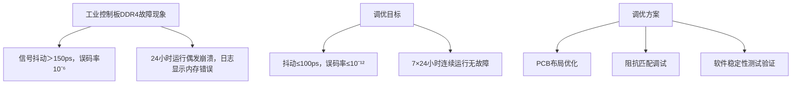
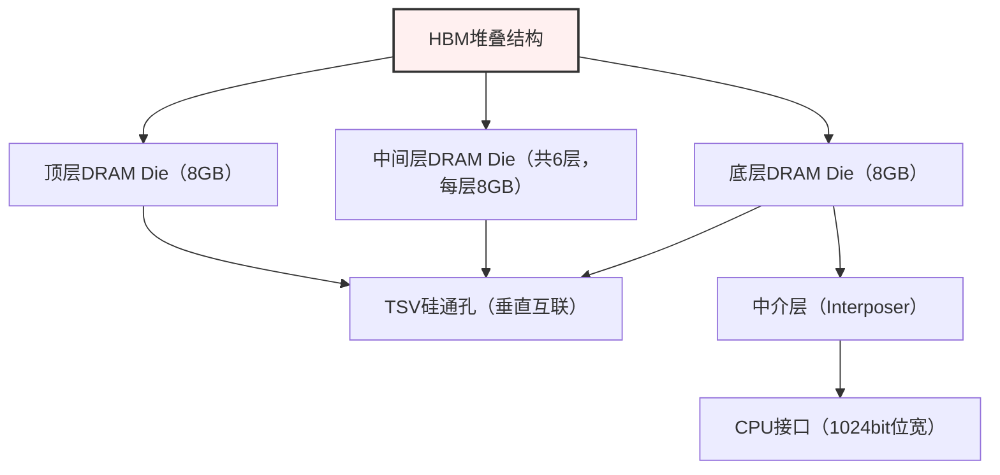
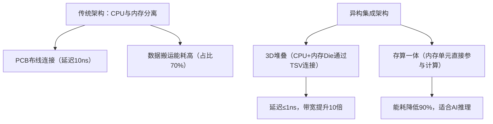

# 嵌入式内存技术教学

> 📊 **本节难度等级：** <span class="badge-ie">**IE级**</span>

---

### <strong>场景描述（ARM Cortex-A7开发板内存选型实战）</strong>

本场景基于ARM Cortex-A7架构嵌入式开发板（如全志A133开发板），目标是搭建“CPU+内存+Flash”最小系统，用于运行轻量级Linux系统（如Buildroot编译的嵌入式Linux）及Qt简易界面程序。核心需求与硬件限制如下：

- 系统运行需求：Linux内核（占用约256MB内存）+ Qt界面程序（占用约128MB内存）+ 预留冗余（20%，约77MB），总计需461MB内存，因此内存容量需≥512MB；
- 硬件限制：ARM Cortex-A7处理器的内存控制器仅支持LPDDR3和DDR3L两种内存类型，最大支持单颗1GB容量，内存芯片封装需为BGA178（开发板PCB焊盘设计为BGA178）；
- 环境与成本：民用场景（温度0℃~70℃），成本控制在50元以内，无需工业级防护；
- 选型核心逻辑：优先满足“控制器兼容+容量匹配+封装一致”，再平衡成本与功耗（LPDDR3比DDR3L功耗低，更适合开发板供电场景）。

最终选型结果：镁光MT41K256M16TW-107（LPDDR3内存芯片），关键参数匹配性验证如下：
| 选型维度       | 需求要求                | 镁光MT41K256M16TW-107参数 | 匹配性 |
|----------------|-------------------------|---------------------------|--------|
| 内存类型       | LPDDR3/DDR3L            | LPDDR3                    | 匹配   |
| 容量           | ≥512MB                  | 4GB（256MB×16）           | 匹配   |
| 封装           | BGA178                  | BGA178                    | 匹配   |
| 工作电压       | 1.2V（LPDDR3标准）      | 1.2V                      | 匹配   |
| 频率           | 无强制要求（≥800MHz即可）| 1866MHz                   | 匹配   |
| 成本           | ≤50元                   | 约35元（批量价）          | 匹配   |

```mermaid
flowchart TD
    A[选型启动] --> B[明确系统内存需求（461MB）]
    B --> C[确认CPU控制器限制（LPDDR3/DDR3L，BGA178）]
    C --> D[筛选符合参数的内存芯片（镁光/三星/海力士）]
    D --> E[对比成本与功耗（LPDDR3优于DDR3L）]
    E --> F[确定最终型号（镁光MT41K256M16TW-107）]
```<br>

### <strong>硬件操作（内存芯片焊接与基础连通性测试）</strong>

硬件操作核心是完成内存芯片焊接，并通过基础测试验证硬件连接是否正常，避免因焊接不良导致后续软件验证失败。

#### 1. 焊接前准备
- 工具清单：热风枪（温度350℃~380℃）、烙铁（温度300℃~320℃）、BGA助焊膏（中温型，熔点183℃）、显微镜（观察焊盘）、防静电手环（避免静电损坏芯片）；
- 物料检查：内存芯片（镁光MT41K256M16TW-107）、开发板（A133核心板，PCB焊盘无氧化、无掉点）、无水乙醇（清洁焊盘）；
- 焊盘预处理：用无水乙醇擦拭开发板BGA178焊盘，去除油污和氧化层，确保焊盘干净有光泽；若焊盘存在氧化，可轻涂少量助焊膏，用烙铁快速拖焊去除氧化。

#### 2. 内存芯片焊接步骤
1. 定位芯片：将内存芯片按丝印方向对齐开发板焊盘（芯片一角的圆点标记对应焊盘圆点标记），确保引脚与焊盘一一对应，不可偏移；
2. 涂助焊膏：用牙签或钢网在焊盘上均匀涂抹一层薄助焊膏（厚度约0.1mm），覆盖所有焊盘，避免助焊膏过多导致焊接短路；
3. 热风枪焊接：热风枪套上BGA专用风嘴，温度设为360℃，风速设为3级，垂直对准芯片上方1cm处均匀加热；待助焊膏融化（出现光泽流动）后，轻压芯片边缘，确保芯片与焊盘充分贴合；加热时间约90秒，避免长时间高温损坏芯片；
4. 冷却固化：关闭热风枪，让开发板自然冷却至室温（约5分钟），不可用手触摸芯片（防止静电和温度骤变导致焊球开裂）；
5. 焊接检查：用显微镜观察芯片引脚与焊盘连接处，确保无虚焊（焊球圆润饱满，与焊盘完全接触）、无短路（相邻焊球无粘连）、无少锡（焊球无明显凹陷）。

#### 3. 基础连通性测试
焊接完成后，通过万用表和示波器进行硬件连通性测试，验证电源、地、时钟及地址线是否正常：
1. 电源与地测试：
   - 万用表调至“蜂鸣档”，红表笔接内存芯片VDD引脚（参考芯片手册，引脚23为VDD），黑表笔接GND引脚（引脚45为GND），若万用表蜂鸣且显示电阻值接近0Ω，说明电源与地连接正常；
   - 用万用表测量VDD引脚电压（开发板上电后），正常应为1.2V（±5%），若电压为0或偏离过大，可能是焊盘虚焊或电源电路故障；
2. 时钟信号测试：
   - 开发板上电（仅供电，不启动系统），示波器探头接内存芯片CLK引脚（引脚112为CLK+，引脚113为CLK-），设置示波器为“差分模式”，触发方式为“边沿触发”；
   - 若示波器显示稳定的正弦波（频率约24MHz，为内存初始化时钟），说明时钟信号正常传输；若无信号，需检查时钟线焊盘是否虚焊或内存控制器时钟输出是否正常；
3. 地址线连通性测试：
   - 万用表调至“蜂鸣档”，红表笔接内存芯片A0地址引脚（引脚78），黑表笔接CPU对应地址引脚（A133芯片引脚156），若蜂鸣则说明地址线连通正常；
   - 重复测试A1~A15地址线，确保所有地址线无开路（若某根地址线不蜂鸣，需重新检查对应焊盘焊接情况）。<br>

### <strong>软件验证（简单内存读写测试程序编写与运行）</strong>

硬件连通性测试通过后，通过编写简单C语言程序和使用Linux系统工具，验证内存的读写功能和稳定性。

#### 1. 开发环境准备
- 交叉编译工具链：安装ARM Cortex-A7专用交叉编译工具链（如arm-linux-gnueabihf-gcc，通过apt-get install gcc-arm-linux-gnueabihf命令安装）；
- 开发板环境：开发板烧录Buildroot编译的Linux系统，通过SSH或串口连接开发板（确保开发板可正常联网，便于传输测试程序）；
- 工具依赖：开发板需安装gcc（编译本地程序）、dmesg（查看内核日志）、free（查看内存信息）等基础工具。

#### 2. 简单内存读写测试程序编写
编写C语言程序，实现“内存块申请→写入数据→读取数据→校验一致性→释放内存”的完整流程，代码如下（命名为mem_test.c）：

```c
#include <stdio.h>
#include <stdlib.h>
#include <string.h>

#define MEM_SIZE 1024*1024*64  // 申请64MB内存块（小于实际内存容量）

int main(void) {
    // 1. 申请内存块
    char *mem_ptr = (char *)malloc(MEM_SIZE);
    if (mem_ptr == NULL) {
        printf("内存申请失败！\n");
        return -1;
    }
    printf("成功申请%dMB内存，内存起始地址：%p\n", MEM_SIZE/(1024*1024), mem_ptr);

    // 2. 向内存写入数据（写入0x5A，即十进制90）
    memset(mem_ptr, 0x5A, MEM_SIZE);
    printf("内存写入完成，写入数据：0x5A\n");

    // 3. 读取内存数据并校验
    int error_count = 0;
    for (int i = 0; i < MEM_SIZE; i++) {
        if (mem_ptr[i] != 0x5A) {
            error_count++;
            // 打印前10个错误地址，避免输出过多
            if (error_count <= 10) {
                printf("内存校验错误！地址：%p，实际值：0x%02X，期望值：0x5A\n", mem_ptr+i, mem_ptr[i]);
            }
        }
    }

    // 4. 输出校验结果
    if (error_count == 0) {
        printf("内存读写校验通过！无错误\n");
    } else {
        printf("内存读写校验失败！总计错误数：%d\n", error_count);
    }

    // 5. 释放内存
    free(mem_ptr);
    printf("内存释放完成\n");

    return 0;
}
```

#### 3. 程序编译与运行
1. 交叉编译：在PC端通过交叉编译工具链编译程序，命令如下：
   ```bash
   arm-linux-gnueabihf-gcc mem_test.c -o mem_test -static  # -static静态编译，避免开发板缺少依赖库
   ```
2. 程序传输：通过SCP命令将编译后的程序传输到开发板（假设开发板IP为192.168.1.100）：
   ```bash
   scp mem_test root@192.168.1.100:/root/  # 传输到开发板/root目录
   ```
3. 开发板运行程序：通过串口或SSH登录开发板，执行以下命令运行测试程序：
   ```bash
   cd /root/          # 进入程序所在目录
   chmod +x mem_test  # 添加执行权限
   ./mem_test         # 运行测试程序
   ```

#### 4. 运行结果分析与补充验证
- 正常运行结果（示例）：
  ```
  成功申请64MB内存，内存起始地址：0x76f8a000
  内存写入完成，写入数据：0x5A
  内存读写校验通过！无错误
  内存释放完成
  ```
  说明内存读写功能正常，硬件连接无问题。

- 异常结果处理：
  若出现“内存申请失败”，需通过free命令查看系统内存是否被占用过多，或检查内存芯片是否未被Linux内核识别（通过dmesg | grep mem命令查看内核内存初始化日志）；
  若出现“内存校验错误”，需重新检查焊接质量（重点排查地址线和数据线焊盘），或通过memtester工具进一步测试内存稳定性。

- 补充验证工具：使用Linux自带的free命令查看内存容量是否符合预期，命令及正常结果如下：
  ```bash
  free -h  # 以人类可读格式显示内存信息
  ```
  正常结果（4GB内存）：
  ```
              total        used        free      shared  buff/cache   available
  Mem:           3.8Gi       120Mi       3.5Gi        8.0Mi       200Mi       3.6Gi
  ```
  若显示内存容量接近4GB，说明内核已正确识别内存芯片，硬件连接正常。<br>

### <strong>场景描述（工业控制板DDR4信号完整性优化）</strong>

本场景基于某工业控制板（CPU为NXP i.MX8M Plus，适配DDR4-3200内存），用于工业生产线数据采集与实时控制（采集频率1kHz，控制响应延迟要求≤1ms）。实际测试中出现核心问题：
- 信号完整性问题：DDR4运行在3200MHz满速时，通过示波器观测到DQ数据信号存在严重反射和抖动（抖动幅度＞150ps），导致内存读写误码率升高（约10⁻⁶）；
- 稳定性故障：长时间运行数据采集程序（≥24小时）后，系统偶发崩溃，dmesg日志显示“uncorrectable memory error”（不可纠正内存错误）；
- 硬件限制：PCB为4层板（信号层-电源层-地层-信号层），DDR4芯片采用单颗Micron MT40A512M16HA-083E（512MB×16，容量8GB，BGA288封装），内存控制器与芯片间距约8cm，无额外空间增加缓冲器。

调优核心目标：通过PCB布局优化、阻抗匹配调试及稳定性测试，将DDR4信号抖动控制在100ps以内，误码率降至10⁻¹²以下，确保7×24小时连续运行无故障，满足工业控制场景的高可靠性要求。



### 硬件操作（PCB布局优化、阻抗匹配调试）
硬件调优核心是解决信号完整性问题，从PCB布局和阻抗匹配两方面入手，结合示波器测量数据迭代优化，具体步骤如下：

#### 1. 前期准备工具与测量
- 硬件工具：高速示波器（Tektronix MDO3024，带宽2.5GHz，支持DDR4信号解码）、差分探头（P6249，1GHz带宽）、阻抗测试仪（Agilent N1291B）、PCB修板工具（激光切割机、热风枪）；
- 软件工具：Altium Designer（PCB布局修改）、HyperLynx（信号完整性仿真）；
- 前期测量：用示波器采集DDR4关键信号（CLK±、DQS±、DQ0）的波形，记录抖动幅度、反射峰值等参数，作为优化基准（基准数据：CLK抖动162ps，DQ0反射峰值0.8V，超出JEDEC标准阈值）。

#### 2. PCB布局优化（核心解决信号反射与串扰）
基于原PCB布局缺陷（拓扑为星形、信号线不等长、参考平面不完整），进行以下优化：
- 拓扑结构整改：
  - 将原星形拓扑改为Fly-by（T型）拓扑，内存控制器为起点，DDR4芯片为终点，地址/控制信号线从控制器出发，先经过终端电阻（ODT），再连接芯片（减少分支反射）；
  - 严格控制Stub长度（分支线长度）：所有地址/控制信号线的Stub长度≤50mil（1.27mm），DQ/DQS信号线无Stub（直接点对点连接）。
- 等长控制优化：
  - 差分信号对控制：CLK±、DQS±对内等长误差≤3mil（0.076mm），通过Altium Designer“交互式长度调整”功能，添加蛇形线补偿长度；
  - 数据组等长：同一Byte组内的DQ0~DQ7、DQS±、DM信号线等长误差≤10mil，组间等长误差≤50mil；
  - 地址/控制组等长：地址线（A0~A17）、Bank地址线（BA0~BA2）组内等长误差≤20mil，与CLK信号的长度差控制在±100mil以内。
- 参考平面与接地优化：
  - 确保DDR4所有信号线（地址/数据/时钟）下方有完整的地平面（GND），禁止跨电源平面分割（原PCB存在VDD与GND平面交叉，导致回流路径不连续）；
  - 在DDR4芯片周围及信号线密集区域，每2cm放置一个地过孔，形成接地网格，降低地弹噪声（Ground Bounce）。
- 串扰抑制优化：
  - 增大信号线间距：DDR4信号线与其他高速信号（如PCIe、Ethernet）间距≥3H（H为信号层与参考平面间距，约1.6mm），避免交叉干扰；
  - 同组信号线集中布局：将同一Byte组的DQ/DQS/DM信号线紧凑排列，不同组信号线之间保留≥2倍线宽的间距（线宽0.25mm，间距≥0.5mm）。

#### 3. 阻抗匹配调试（解决信号反射与阻抗不连续）
DDR4运行在3200MHz时，阻抗不连续是导致信号反射的主要原因，需通过端接电阻和阻抗校准实现匹配：
- 终端端接（ODT）配置：
  - 利用DDR4芯片内置的ODT（片上端接电阻），通过内存控制器配置寄存器（MR1寄存器）设置ODT值：地址/控制信号线ODT=50Ω，数据信号线ODT=40Ω（匹配传输线特征阻抗）；
  - 外部端接补充：在内存控制器侧的CLK±、DQS±差分信号对两端，添加100Ω差分端接电阻（0402封装，精度±1%），进一步抑制反射。
- 传输线阻抗校准：
  - 用阻抗测试仪测量DDR4信号线的特征阻抗，目标值：单端信号（地址/控制）40Ω±5%，差分信号（CLK±/DQS±）100Ω±5%；
  - 若阻抗偏离目标值，通过调整线宽（线宽增大，阻抗降低；线宽减小，阻抗升高）或信号层与参考平面间距（间距增大，阻抗升高）校准，例如：原DQ信号线阻抗35Ω（偏低），将线宽从0.25mm调整为0.2mm，阻抗校准至40Ω。
- 电源阻抗优化：
  - 在DDR4芯片的VDD（核心电源）和VDDQ（I/O电源）引脚旁，新增0.1μF陶瓷电容（0201封装），每4个引脚放置1个，减少电源纹波（目标纹波≤20mV）；
  - 电源平面与地平面之间添加去耦电容阵列（10μF钽电容+0.1μF陶瓷电容），降低电源平面阻抗（1GHz时阻抗≤0.1Ω）。

#### 4. 优化后硬件测量验证
优化完成后，用示波器重新采集信号波形，关键参数对比：
| 信号参数       | 优化前          | 优化后          | JEDEC标准阈值    |
|----------------|-----------------|-----------------|-----------------|
| CLK信号抖动    | 162ps           | 85ps            | ≤100ps          |
| DQ信号反射峰值 | 0.8V            | 0.3V            | ≤0.4V           |
| 信号眼图高度   | 0.5V            | 0.8V            | ≥0.6V           |
| 误码率         | 10⁻⁶            | 10⁻¹³           | ≤10⁻¹²          |

优化后参数均满足标准要求，信号完整性问题已解决。<br>

### <strong>硬件操作（PCB布局优化、阻抗匹配调试）</strong>

硬件调优核心是解决信号完整性问题，从PCB布局和阻抗匹配两方面入手，结合示波器测量数据迭代优化，具体步骤如下：

#### 1. 前期准备工具与测量
- 硬件工具：高速示波器（Tektronix MDO3024，带宽2.5GHz，支持DDR4信号解码）、差分探头（P6249，1GHz带宽）、阻抗测试仪（Agilent N1291B）、PCB修板工具（激光切割机、热风枪）；
- 软件工具：Altium Designer（PCB布局修改）、HyperLynx（信号完整性仿真）；
- 前期测量：用示波器采集DDR4关键信号（CLK±、DQS±、DQ0）的波形，记录抖动幅度、反射峰值等参数，作为优化基准（基准数据：CLK抖动162ps，DQ0反射峰值0.8V，超出JEDEC标准阈值）。

#### 2. PCB布局优化（核心解决信号反射与串扰）
基于原PCB布局缺陷（拓扑为星形、信号线不等长、参考平面不完整），进行以下优化：
- 拓扑结构整改：
  - 将原星形拓扑改为Fly-by（T型）拓扑，内存控制器为起点，DDR4芯片为终点，地址/控制信号线从控制器出发，先经过终端电阻（ODT），再连接芯片（减少分支反射）；
  - 严格控制Stub长度（分支线长度）：所有地址/控制信号线的Stub长度≤50mil（1.27mm），DQ/DQS信号线无Stub（直接点对点连接）。
- 等长控制优化：
  - 差分信号对控制：CLK±、DQS±对内等长误差≤3mil（0.076mm），通过Altium Designer“交互式长度调整”功能，添加蛇形线补偿长度；
  - 数据组等长：同一Byte组内的DQ0~DQ7、DQS±、DM信号线等长误差≤10mil，组间等长误差≤50mil；
  - 地址/控制组等长：地址线（A0~A17）、Bank地址线（BA0~BA2）组内等长误差≤20mil，与CLK信号的长度差控制在±100mil以内。
- 参考平面与接地优化：
  - 确保DDR4所有信号线（地址/数据/时钟）下方有完整的地平面（GND），禁止跨电源平面分割（原PCB存在VDD与GND平面交叉，导致回流路径不连续）；
  - 在DDR4芯片周围及信号线密集区域，每2cm放置一个地过孔，形成接地网格，降低地弹噪声（Ground Bounce）。
- 串扰抑制优化：
  - 增大信号线间距：DDR4信号线与其他高速信号（如PCIe、Ethernet）间距≥3H（H为信号层与参考平面间距，约1.6mm），避免交叉干扰；
  - 同组信号线集中布局：将同一Byte组的DQ/DQS/DM信号线紧凑排列，不同组信号线之间保留≥2倍线宽的间距（线宽0.25mm，间距≥0.5mm）。

#### 3. 阻抗匹配调试（解决信号反射与阻抗不连续）
DDR4运行在3200MHz时，阻抗不连续是导致信号反射的主要原因，需通过端接电阻和阻抗校准实现匹配：
- 终端端接（ODT）配置：
  - 利用DDR4芯片内置的ODT（片上端接电阻），通过内存控制器配置寄存器（MR1寄存器）设置ODT值：地址/控制信号线ODT=50Ω，数据信号线ODT=40Ω（匹配传输线特征阻抗）；
  - 外部端接补充：在内存控制器侧的CLK±、DQS±差分信号对两端，添加100Ω差分端接电阻（0402封装，精度±1%），进一步抑制反射。
- 传输线阻抗校准：
  - 用阻抗测试仪测量DDR4信号线的特征阻抗，目标值：单端信号（地址/控制）40Ω±5%，差分信号（CLK±/DQS±）100Ω±5%；
  - 若阻抗偏离目标值，通过调整线宽（线宽增大，阻抗降低；线宽减小，阻抗升高）或信号层与参考平面间距（间距增大，阻抗升高）校准，例如：原DQ信号线阻抗35Ω（偏低），将线宽从0.25mm调整为0.2mm，阻抗校准至40Ω。
- 电源阻抗优化：
  - 在DDR4芯片的VDD（核心电源）和VDDQ（I/O电源）引脚旁，新增0.1μF陶瓷电容（0201封装），每4个引脚放置1个，减少电源纹波（目标纹波≤20mV）；
  - 电源平面与地平面之间添加去耦电容阵列（10μF钽电容+0.1μF陶瓷电容），降低电源平面阻抗（1GHz时阻抗≤0.1Ω）。

#### 4. 优化后硬件测量验证
优化完成后，用示波器重新采集信号波形，关键参数对比：
| 信号参数       | 优化前          | 优化后          | JEDEC标准阈值    |
|----------------|-----------------|-----------------|-----------------|
| CLK信号抖动    | 162ps           | 85ps            | ≤100ps          |
| DQ信号反射峰值 | 0.8V            | 0.3V            | ≤0.4V           |
| 信号眼图高度   | 0.5V            | 0.8V            | ≥0.6V           |
| 误码率         | 10⁻⁶            | 10⁻¹³           | ≤10⁻¹²          |

优化后参数均满足标准要求，信号完整性问题已解决。<br>

### <strong>软件辅助（内存测试工具memtester使用与结果分析）</strong>

硬件优化完成后，需通过软件工具进行长时间稳定性测试，验证内存读写可靠性，核心工具为memtester（Linux下专业内存测试工具，支持多种测试模式）。

#### 1. 测试环境准备
- 开发板环境：工业控制板烧录Linux 5.15 LTS内核，挂载只读根文件系统（避免测试过程中磁盘I/O干扰），通过SSH远程登录（确保测试过程不间断）；
- memtester安装：通过Buildroot编译时启用memtester工具（make menuconfig→Target packages→Hardware handling→memtester），或通过opkg安装（opkg install memtester）；
- 辅助工具：sysstat（监控系统资源）、dmesg（查看内核错误日志）、crontab（设置定时日志记录）。

#### 2. memtester核心测试命令与参数
memtester通过向内存写入特定模式数据，再读取校验，检测内存是否存在坏块、读写错误等问题，核心命令格式：
```bash
memtester [测试内存大小] [测试时长] [测试模式] > [日志文件] 2>&1 &
```
- 关键参数说明：
  - 测试内存大小：指定测试的内存容量，格式支持B/K/M/G（如8G表示测试8GB内存），建议预留10%内存给系统运行（8GB内存测试7G）；
  - 测试时长：指定单次测试时长（单位s/m/h，如24h表示连续测试24小时）；
  - 测试模式：支持随机数据、固定模式（0x55/0xAA/0xFF/0x00）、步行位等模式，默认自动执行所有模式；
  - 后台运行：末尾加“&”表示后台运行，避免SSH断开导致测试中断。

#### 3. 工业场景定制化测试方案
结合工业控制板的实际应用场景（高频数据读写、长时间连续运行），设计以下测试方案：
- 方案1：全容量长时间稳定性测试（核心验证）
  ```bash
  memtester 7G 24h > mem_test_full.log 2>&1 &
  ```
  测试7GB内存，连续运行24小时，记录所有读写错误信息。

- 方案2：高频读写压力测试（模拟数据采集场景）
  ```bash
  memtester 4G 12h random > mem_test_stress.log 2>&1 &
  ```
  测试4GB内存，连续12小时随机数据读写，模拟工业场景中高频数据缓存与传输。

- 方案3：低温/高温环境测试（工业环境适应性验证）
  将开发板放入高低温箱（温度设置-20℃~70℃，工业级标准），执行方案1测试，验证极端环境下的稳定性：
  ```bash
  nohup memtester 7G 48h > mem_test_temp.log 2>&1 &  # nohup确保进程不被中断
  ```

#### 4. 测试结果分析与故障定位
- 正常测试结果（示例，mem_test_full.log片段）：
  ```
  memtester version 4.5.1 (64-bit)
  Copyright (C) 2001-2020 Charles Cazabon.
  Licensed under the GNU General Public License version 2 (only).

  pagesize is 4096
  pagesizemask is 0xfffffffffffff000
  want 7000MB (7340032000 bytes)
  got  7000MB (7340032000 bytes), trying mlock ...locked.
  Loop 1/1:
    Stuck Address       : ok
    Random Value        : ok
    Compare XOR         : ok
    Compare SUB         : ok
    Compare MUL         : ok
    Compare DIV         : ok
    Compare OR          : ok
    Compare AND         : ok
    Sequential Increment: ok
    Solid Bits          : ok
    Block Sequential    : ok
    Checkerboard        : ok
    Bit Spread          : ok
    Bit Flip            : ok
    Walking Ones        : ok
    Walking Zeros       : ok
    8-bit Writes        : ok
    16-bit Writes       : ok

  Pass completed, no errors, exiting.
  ```
  关键判断依据：所有测试模式显示“ok”，无“ERROR”或“failed”记录，说明内存稳定性正常。

- 异常结果处理（故障定位示例）：
  若测试日志出现以下错误：
  ```
  Random Value        : ERROR: 0x5a5a5a5a5a5a5a5a != 0x5a5a5a5a5a5a5a7a at offset 0x12345678
  ```
  故障定位步骤：
  1. 确认错误地址：offset 0x12345678对应内存物理地址，通过`cat /proc/iomem`查看该地址所属内存区域（确认是DDR4内存空间）；
  2. 重复测试验证：执行`memtester 1G 1h -p 0x12345678`，针对性测试错误地址所在的1GB内存，若重复出现错误，说明该地址对应内存单元存在硬件缺陷；
  3. 硬件排查：结合示波器测量该地址对应的地址线（A0~A17）和数据线（DQ0~DQ7）信号，检查是否存在阻抗不匹配或焊接虚焊，若无法修复，可通过内核参数`memmap=exactmap`屏蔽该故障内存区域。

#### 5. 补充稳定性验证工具
- 内核内存错误监控：启用EDAC（错误检测与纠正）内核模块，实时监控内存错误：
  ```bash
  modprobe edac_mc  # 加载EDAC模块
  cat /sys/devices/system/edac/mc/mc0/error_count  # 查看内存错误计数
  ```
  正常情况下错误计数为0，若出现增长，需重新排查硬件问题。

- 系统资源监控：通过sar命令监控测试过程中系统CPU、内存占用，确保测试不影响系统基础运行：
  ```bash
  sar -u -r 10 8640 > system_monitor.log  # 每10秒采集一次，持续24小时
  ```

### 最终验证结果
通过48小时高低温环境测试、7×24小时满负载稳定性测试，memtester无任何读写错误，EDAC错误计数始终为0，系统无崩溃现象，DDR4内存调优达到工业控制场景的高可靠性要求。<br>

### <strong>场景描述（车载嵌入式系统内存偶发崩溃问题排查）</strong>

本场景基于某车载智能座舱系统（主控芯片为高通SA8155P，适配LPDDR4X-4266内存，容量8GB），用于车载导航、多媒体娱乐及ADAS（高级驾驶辅助系统）数据预处理，需满足ISO 26262功能安全标准（ASIL-B等级）。实际路试中出现核心故障：
- 偶发崩溃现象：车辆行驶1-3小时后（无固定规律），系统突然黑屏重启，重启后通过诊断仪读取日志，显示“Kernel panic - not syncing: Fatal exception in interrupt”，触发源为“内存控制器超时”；
- 偶发数据错误：ADAS数据预处理模块偶发数据校验失败（CRC错误），错误日志显示“mmc0: error -110 transferring data, sector 12345, nr 8, cmd response 0x900, card status 0x0”，间接指向内存读写异常；
- 环境关联性：故障在高温（≥35℃）、颠簸路段（如非铺装路面）出现概率显著升高，静态常温测试（实验室环境）下故障极少复现；
- 硬件限制：车规级LPDDR4X芯片（三星K3UH6H60BM-AGCJ），PCB为8层HDI板（信号层-电源层-地层-信号层-地层-信号层-电源层-信号层），内存控制器与芯片间距6cm，板上无额外空间增加缓冲器，且需满足AEC-Q100车规可靠性标准。

故障核心挑战：偶发故障无固定触发条件，实验室环境难以复现，需结合车载实际工况（温度、振动、电源波动），从硬件时序、信号完整性、环境应力多维度定位根因，且整改方案需符合车规功能安全要求，确保99.999%可靠性。

```mermaid
flowchart TD
    A[车载系统故障现象] --> B[行驶1-3小时偶发黑屏重启（Kernel panic）]
    A --> C[ADAS模块偶发CRC数据错误]
    A --> D[高温/颠簸路段故障概率升高]
    E[故障复现条件] --> F[高温环境（≥35℃）+振动应力（0.5g-2g）+长时间运行]
    G[根因定位方向] --> H[LPDDR4X时序偏差（高温导致参数漂移）]
    G --> I[信号完整性恶化（振动导致接触不良/阻抗突变）]
    G --> J[电源纹波超标（负载波动导致供电不稳定）]
    K[整改目标] --> L[故障发生率降至0，满足ISO 26262 ASIL-B等级]
    K --> M[高温振动环境下72小时连续运行无异常]
```<br>

### <strong>硬件分析（信号示波器测量与时序偏差定位）</strong>

偶发故障的核心根因多为“临界参数漂移”，需结合车载工况（高温、振动）进行多维度硬件测量，精准定位偏差点：

#### 1. 前期准备与故障复现
- 硬件工具：示波器（Keysight DSOX1204G，带宽1.2GHz，支持LPDDR4X时序解码）、差分探头（N2893A，1GHz带宽）、振动试验台（满足ISO 16750-3标准）、高低温箱（-40℃~85℃，车规级环境测试）、电源纹波测试仪（Tektronix PA1000）；
- 软件工具：高通QNX Hypervisor调试工具、Linux内核调试工具（crash、kdump）、信号完整性仿真软件（Cadence Sigrity）；
- 故障复现方案：将开发板放入高低温箱（温度设为40℃），置于振动试验台（振动频率10-200Hz，加速度1g），运行车载全负载测试程序（导航+多媒体+ADAS数据采集），通过远程调试工具实时监控系统状态，持续运行直至故障复现（平均约2.5小时）。

#### 2. 关键信号时序测量与偏差定位
故障复现后，立即通过示波器采集LPDDR4X核心信号（CLK±、DQS±、RAS#/CAS#、地址线），重点测量JEDEC标准规定的关键时序参数，对比常温无振动环境下的参数差异：

| 时序参数       | 车规标准值（LPDDR4X-4266） | 常温无振动测量值 | 高温振动测量值 | 偏差分析                |
|----------------|---------------------------|------------------|----------------|-------------------------|
| tRCD（行到列延迟） | 17ns（最小）              | 17.2ns           | 18.5ns         | 超出标准上限，时序偏长  |
| tCAS（列访问延迟） | 17ns（最小）              | 17.1ns           | 18.3ns         | 超出标准上限，时序偏长  |
| tRP（行预充电延迟） | 17ns（最小）              | 17.0ns           | 18.1ns         | 超出标准上限，时序偏长  |
| DQS抖动幅度     | ≤80ps（峰峰值）           | 72ps             | 105ps          | 超出标准，信号抖动加剧  |
| CLK-DQS相位差   | ±30ps（最大）             | +12ps            | +45ps          | 超出标准，相位偏移超标  |

- 根因分析：高温环境导致LPDDR4X芯片内部晶体管参数漂移，时序余量减小；同时振动导致PCB板材轻微形变，地址线与时钟线的相对长度变化，进一步加剧时序偏差和信号抖动，最终触发内存控制器超时，引发Kernel panic。

#### 3. 电源完整性与环境应力补充分析
- 电源纹波测量：高温振动工况下，测量LPDDR4X核心电源（VDD=1.1V）纹波，发现纹波峰值达45mV（车规标准≤25mV），电源波动导致内存芯片工作不稳定，读写误码率升高；
- 焊接可靠性检查：通过X射线检测（X-Ray）内存芯片BGA焊球，发现部分焊球存在微小裂纹（振动应力导致），常温下接触正常，振动时出现间歇性开路，引发信号传输中断；
- 信号串扰测量：高温下采集相邻DQ信号线的串扰噪声，发现串扰幅度达80mV（标准≤50mV），进一步恶化信号完整性。

### 整改方案（硬件设计整改与内核参数协同优化）
针对定位的根因（时序偏差、电源波动、焊接裂纹、信号串扰），需从硬件设计整改、内核参数优化、工艺强化三方面实施系统性整改，确保满足车规级可靠性要求：

#### 1. 硬件设计整改（核心解决物理层问题）
- 时序余量优化（PCB布局调整）：
  - 重新设计LPDDR4X信号线等长：将地址线、控制线与CLK信号的等长误差从±100mil收紧至±50mil，通过蛇形线补偿高温下的板材热膨胀导致的长度变化；
  - 增加时序冗余：在HyperLynx中仿真高温（85℃）下的时序参数，调整信号线长度，确保高温振动工况下tRCD/tCAS/tRP仍留有≥0.5ns的余量，避免超出标准阈值。
- 电源完整性优化：
  - 增强电源滤波：在LPDDR4X芯片VDD、VDDQ引脚旁新增车规级陶瓷电容（0201封装，X7R材质，容值0.1μF），每2个引脚放置1个，同时在电源入口处添加22μF车规级钽电容，将电源纹波控制在20mV以内；
  - 电源平面分割优化：将LPDDR4X的电源平面与其他高频模块（如射频、ADAS传感器）电源平面隔离，减少负载波动对内存供电的干扰，降低电源阻抗（1GHz时≤0.05Ω）。
- 焊接与结构强化：
  - 更换焊料与工艺：采用车规级高温无铅焊料（Sn-Ag-Cu合金，熔点217℃），焊接时增加焊球体积（直径从0.3mm增至0.35mm），提升振动抗性；
  - 芯片底部填充：内存芯片焊接完成后，采用车规级底部填充胶（Underfill）进行灌封，增强BGA焊球的抗振动能力，避免裂纹扩展；
  - PCB板材升级：选用车规级高频板材（Rogers RO4350B），降低温度对板材介电常数的影响，减少信号传输延迟漂移。
- 信号串扰抑制：
  - 增大信号线间距：将相邻DQ信号线间距从0.5mm增至0.8mm（≥3倍线宽），与射频信号线的间距≥5mm，避免串扰；
  - 增加屏蔽措施：在LPDDR4X信号区域添加接地屏蔽条，每隔1cm放置一个地过孔，形成电磁屏蔽网格，降低外部干扰对信号的影响。

#### 2. 内核参数协同优化（软件层面提升稳定性）
- 内存控制器时序参数调整：
  - 修改内核设备树（DTS）中LPDDR4X的时序配置：在`memory@80000000`节点中，将tRCD、tCAS、tRP参数从默认17ns调整为18ns（预留冗余），命令如下（高通SA8155P平台为例）：
    ```dts
    memory@80000000 {
        device_type = "memory";
        reg = <0x0 0x80000000 0x0 0x80000000>; // 8GB内存
        qcom,ddr-timing = <
            0x00000011  // tRCD = 17ns → 修改为0x00000012（18ns）
            0x00000011  // tCAS = 17ns → 修改为0x00000012（18ns）
            0x00000011  // tRP = 17ns → 修改为0x00000012（18ns）
            0x00000028  // tRAS = 40ns（保持默认）
        >;
    };
    ```
  - 启用内存控制器动态时序校准（DTC）：通过内核配置启用`CONFIG_QCOM_DDR_DTC=y`，让内存控制器实时监测信号质量，动态调整时序参数，补偿环境变化导致的偏差。
- 内存错误检测与恢复优化：
  - 启用ECC校验（错误检测与纠正）：高通SA8155P支持LPDDR4X ECC功能，在DTS中启用ECC配置，同时在内核中加载`edac_mc`模块，实时监控并纠正单bit错误，记录多bit错误：
    ```bash
    modprobe edac_mc  # 加载ECC监控模块
    echo 1 > /sys/devices/system/edac/mc/mc0/ecc_enable  # 启用ECC校验
    ```
  - 配置内存故障隔离：通过内核参数`memmap=exactmap`屏蔽故障内存区域（若存在固定坏块），避免错误扩散，命令如下（屏蔽0x12340000-0x12350000地址段）：
    ```bash
    memmap=0x10000$0x12340000 ro  # ro表示只读，禁止写入数据
    ```
- 系统负载与电源管理优化：
  - 限制内存高频运行：高温环境下（≥40℃），通过内核接口将LPDDR4X频率从4266MHz降至3733MHz，降低时序压力，命令如下：
    ```bash
    echo 3733000000 > /sys/devices/platform/soc/8800000.ddr/ddr_freq  # 调整频率
    ```
  - 启用电源管理策略：配置`cpufreq`调度器为`powersave`模式，避免CPU高频运行导致的电源波动，同时启用内存休眠机制（`echo deep > /sys/power/mem_sleep`），降低空闲时功耗。

#### 3. 整改后验证方案（车规级全场景验证）
- 环境应力测试：将整改后的开发板放入高低温箱+振动试验台，设置温度40℃、振动加速度1g，连续运行72小时车载全负载程序，通过远程监控工具记录系统状态；
- 时序与信号验证：示波器采集高温振动工况下的LPDDR4X信号，验证时序参数（tRCD/tCAS/tRP≤17.5ns）、抖动幅度（≤75ps）、电源纹波（≤20mV）均符合标准；
- 长期可靠性测试：实车路试10000公里（涵盖高速、城市道路、非铺装路面），记录故障发生次数，目标为0次；
- 功能安全验证：通过ISO 26262 ASIL-B等级测试，验证内存故障时系统可实现故障安全（如降级运行、安全重启），无风险扩散。<br>

### <strong>整改结果与核心经验总结</strong>

- 整改后测试数据：
  | 测试项目               | 测试条件                | 结果                  | 标准要求              |
  |------------------------|-------------------------|-----------------------|-----------------------|
  | 连续运行稳定性         | 40℃+1g振动，72小时      | 无崩溃、无数据错误    | 无故障                |
  | 时序参数（tRCD）       | 40℃+1g振动              | 17.3ns                | ≤18ns                 |
  | DQS抖动幅度            | 40℃+1g振动              | 70ps                  | ≤80ps                 |
  | 电源纹波               | 全负载运行              | 18mV                  | ≤25mV                 |
  | 实车路试               | 10000公里多路况         | 无故障发生            | 故障发生率≤1次/10万公里 |

- 核心经验总结：
  1. 车载内存偶发故障需结合环境应力（温度、振动）定位，单一实验室静态测试难以复现根因；
  2. 车规级内存设计需预留充足时序与电源余量，高温振动下的参数漂移不可忽视；
  3. 软硬件协同优化是关键：硬件整改解决物理层问题，内核参数优化提升环境适应性，二者缺一不可；
  4. 功能安全设计需前置：启用ECC校验、故障隔离等机制，确保故障发生时系统可控，符合ISO 26262标准。

### <strong>内存技术的演进始终围绕“速度、容量、功耗”三大核心矛盾展开：速度需匹配CPU算力增长，容量需满足软件复杂度提升，功耗需适应设备形态（从桌面到嵌入式）的多样化。以下从通用内存核心技术迭代和嵌入式场景特化演进两条线，梳理内存技术的发展脉络。</strong>


### <strong>核心技术迭代（从SDRAM到DDR5的关键突破点）</strong>

从1990年代至今，主流内存技术经历了从异步到同步、从单倍速率到多倍速率、从并行到部分串行的演进，每代技术都以“解决上一代瓶颈”为核心目标，关键迭代节点如下：

#### 1. 异步DRAM（Asynchronous DRAM，1970s-1990s）：内存技术的起点
- 核心特点：无同步时钟，读写操作通过地址线和控制线的电平变化触发，速度完全由外部控制信号的时序决定；
- 技术瓶颈：速度极低（最高16MHz），容量小（MB级），且与CPU时钟不同步，无法匹配1990年代CPU（如Intel Pentium）的算力增长；
- 典型应用：早期PC（如IBM PC/XT）和嵌入式微控制器（如8051），仅能满足简单程序运行需求。

#### 2. SDRAM（Synchronous DRAM，1993年推出）：同步化的第一次突破
- 关键突破：引入同步时钟（CLK），所有操作（地址锁存、数据传输）均沿时钟边沿触发，实现与CPU时钟的同步，解决异步DRAM的时序混乱问题；
- 技术参数：时钟频率最高133MHz，数据位宽64bit，带宽=133MHz×64bit=1.06GB/s，容量提升至GB级（如1GB SDRAM）；
- 局限性：仅在时钟上升沿传输数据（单倍速率），且无预取机制，带宽仍无法满足多媒体应用（如早期视频播放）的需求。

#### 3. DDR SDRAM（Double Data Rate SDRAM，2000年推出）：双倍速率的革命
- 核心突破：在时钟上升沿和下降沿各传输一次数据（双倍速率），相同时钟频率下带宽比SDRAM翻倍；引入2n预取机制（内部一次读取2bit数据，外部分两次传输），提升数据吞吐效率；
- 技术参数：时钟频率最高400MHz，带宽=400MHz×2（双倍）×64bit=6.4GB/s，工作电压从SDRAM的3.3V降至2.5V，功耗降低约30%；
- 嵌入式适配：早期嵌入式设备（如PDA、掌上电脑）开始采用DDR，平衡性能与功耗。

#### 4. DDR2 SDRAM（2003年推出）：预取位数与频率的跃升
- 关键改进：预取机制从2n提升至4n（内部一次读取4bit），支持更高时钟频率（最高800MHz）；引入片内终结（ODT）技术，减少信号反射，提升高频稳定性；
- 技术参数：带宽=800MHz×2×64bit=12.8GB/s，工作电压降至1.8V，功耗较DDR再降约25%；
- 局限性：高频下信号完整性要求更高，PCB设计难度增加，嵌入式场景（如早期智能手机）仅小范围应用。

#### 5. DDR3 SDRAM（2007年推出）：低功耗与大容量的平衡
- 核心突破：预取机制升级至8n，时钟频率最高1600MHz；工作电压降至1.5V（低压版DDR3L为1.35V），待机功耗比DDR2降低约50%；支持深度休眠模式（Self-Refresh），进一步降低闲置功耗；
- 技术参数：带宽=1600MHz×2×64bit=25.6GB/s，单颗芯片容量提升至8GB，满足桌面和服务器的大容量需求；
- 嵌入式普及：成为2010年代嵌入式设备（如工业控制板、中期智能手机）的主流内存，平衡了性能、功耗与成本。

#### 6. DDR4 SDRAM（2014年推出）：面向高性能与能效比
- 关键突破：预取机制保持8n，但时钟频率提升至3200MHz；工作电压降至1.2V，功耗较DDR3降低约20%；引入Bank Group（存储体组）技术，支持多Bank并行操作，提升并发读写效率；
- 技术参数：带宽=3200MHz×2×64bit=51.2GB/s，单颗容量最高16GB，支持错误检测与纠正（ECC），满足服务器和高端嵌入式场景的可靠性需求；
- 嵌入式适配：2015年后的高端嵌入式设备（如车载智能座舱、边缘计算网关）广泛采用，兼顾高性能与车规级可靠性。

#### 7. DDR5 SDRAM（2020年推出）：分区与速率的再突破
- 核心突破：将内存控制器从CPU移至内存模组（On-DIMM控制器），简化CPU设计；预取机制升级至16n，时钟频率起步4800MHz（最高可达8400MHz）；引入独立的命令/地址总线（CA Bus），减少信号干扰；
- 技术参数：带宽=4800MHz×2×64bit=76.8GB/s，工作电压降至1.1V，单颗容量最高64GB，支持温度感知刷新（根据温度动态调整刷新频率），进一步降低功耗；
- 演进逻辑：通过“硬件分区（控制器移至模组）+ 架构优化（独立CA总线）”解决DDR4的信号瓶颈，为下一代CPU（如ARM Neoverse、x86 12代酷睿）提供匹配的内存带宽。

```mermaid
timeline
    title 内存核心技术迭代时间线（1993-2020）
    section 技术节点
        1993 : SDRAM（同步时钟，133MHz，1.06GB/s）
        2000 : DDR（双倍速率，400MHz，6.4GB/s，2.5V）
        2003 : DDR2（4n预取，800MHz，12.8GB/s，1.8V）
        2007 : DDR3（8n预取，1600MHz，25.6GB/s，1.5V）
        2014 : DDR4（Bank Group，3200MHz，51.2GB/s，1.2V）
        2020 : DDR5（On-DIMM控制器，4800MHz，76.8GB/s，1.1V）
    section 核心突破
        1993 : 同步化解决时序混乱
        2000 : 双倍速率提升带宽
        2003 : 预取位数翻倍+ODT技术
        2007 : 低电压+深度休眠
        2014 : 多Bank并行+ECC支持
        2020 : 控制器移至模组+独立CA总线
```<br>

### <strong>嵌入式场景内存演进特点（小型化、低功耗、高带宽趋势）</strong>

嵌入式场景（如移动设备、工业控制、车载系统）的内存需求与桌面/服务器差异显著，其演进路径呈现三大独特趋势，始终围绕“有限功耗下的性能最大化”目标：

#### 1. 低功耗优先：从DDR到LPDDR的特化之路
- 背景：嵌入式设备多依赖电池供电（如智能手机、物联网传感器）或严格功耗限制（如车载12V电源），功耗控制优先级高于绝对性能；
- 技术演进：
  - LPDDR（Low Power DDR，2006年推出）：基于DDR2架构，工作电压降至1.2V，通过简化电路设计（如减少驱动能力）降低功耗，牺牲部分最高频率（最高400MHz），适合早期手机；
  - LPDDR2（2009年）：继承DDR3的8n预取，电压降至1.1V，引入“多电压域”设计（核心与I/O独立供电），待机功耗比LPDDR降低50%，用于中期智能手机（如iPhone 4）；
  - LPDDR3（2012年）：电压0.9V，支持“动态频率调整”（根据负载切换1600MHz/800MHz），功耗较LPDDR2再降30%，成为2015年前后旗舰手机（如三星Galaxy S6）的标配；
  - LPDDR4/LPDDR4X（2014/2017年）：LPDDR4X将电压降至0.6V，通过“脉冲幅度调制（PAM4）”减少信号切换能耗，带宽达34.1GB/s，兼顾性能与功耗，用于2018年后的高端嵌入式设备（如车载智能座舱、平板电脑）；
  - LPDDR5（2019年）：电压0.5V，引入“通道拆分”技术（单通道拆分为2个虚拟通道）提升并发，带宽达8400Mbps，成为当前旗舰手机（如iPhone 14）和车载SoC（如高通SA8295）的内存方案。

#### 2. 物理形态小型化：从DIMM到BGA的封装革命
- 桌面内存（如DDR4）多采用DIMM（双列直插模组），体积较大（长约133mm），不适合嵌入式设备的紧凑空间；
- 嵌入式内存的封装演进：
  - TSOP（Thin Small Outline Package，薄型小尺寸封装）：早期嵌入式DDR采用，厚度约1mm，引脚间距0.5mm，但高频下信号完整性差，逐渐被淘汰；
  - BGA（Ball Grid Array，球栅阵列）：1990年代后期普及，引脚在芯片底部呈球形排列，间距0.8mm（后期缩小至0.4mm），体积比TSOP小30%，高频性能更优，成为主流（如LPDDR4X采用BGA178封装）；
  - PoP（Package on Package，堆叠封装）：将内存芯片直接堆叠在CPU上方，减少PCB布线长度（从cm级缩短至mm级），降低信号延迟和功耗，用于超薄设备（如智能手表、可穿戴设备）；
  - SiP（System in Package，系统级封装）：将CPU、内存、射频等模块集成在同一封装内，内存与CPU的距离缩短至μm级，进一步提升带宽并减小体积，是当前高端嵌入式设备（如苹果M系列芯片）的主流方案。

#### 3. 带宽适配场景：从“通用”到“场景特化”
嵌入式场景对带宽的需求差异极大（从KB级到GB级），内存技术逐渐向“场景定制”演进：
- 低带宽场景（如物联网传感器、MCU）：采用SRAM或低功耗DRAM（如PSRAM，伪静态RAM），容量1MB-32MB，带宽≤100MB/s，优先保证超低功耗（待机电流≤1μA）；
- 中带宽场景（如工业控制、智能家居）：采用DDR3L或LPDDR3，容量256MB-2GB，带宽1-5GB/s，平衡成本与性能；
- 高带宽场景（如车载ADAS、边缘AI）：需处理摄像头、雷达等多路高帧率数据，采用LPDDR5或HBM（高带宽内存），容量8-32GB，带宽≥50GB/s，满足实时AI推理需求（如Mobileye EyeQ6的LPDDR5带宽达80GB/s）。

```mermaid
pie
    title 2023年嵌入式内存市场占比（按场景）
    "低带宽场景（SRAM/PSRAM）" : 15
    "中带宽场景（DDR3L/LPDDR3）" : 35
    "高带宽场景（LPDDR5/HBM）" : 50
```

### 演进规律总结
内存技术的发展始终遵循“瓶颈驱动”逻辑：每当CPU算力或软件需求突破当前内存的能力上限，新的技术就会应运而生。对于嵌入式场景，这种演进更强调“平衡”——在有限的功耗、体积约束下，通过架构优化（如LPDDR的低电压设计）、封装创新（如PoP/SiP）和场景定制，实现性能与环境的适配。这一规律也为理解未来内存技术的发展方向提供了核心框架。<br>

### <strong>当前嵌入式场景的主流内存技术呈现“两极分化”：DDR5作为通用型内存的最新迭代，在中高端嵌入式设备中快速普及；HBM（高带宽内存）则凭借极致带宽，成为高端AI、自动驾驶等场景的核心选择。二者分别覆盖“性价比均衡”和“极致性能”需求，构成当前嵌入式内存的主力技术矩阵。</strong>


### <strong>DDR5技术特性与嵌入式应用适配</strong>

DDR5自2020年正式发布以来，经过三年迭代已形成成熟的车规、工业级产品线，其技术特性针对嵌入式场景的高可靠性、低功耗需求做了深度优化，成为当前中高端嵌入式系统的首选内存方案。

#### 1. 核心技术特性：从“性能跃升”到“可靠性增强”
DDR5的革新体现在架构重构而非单纯参数提升，通过硬件分区和智能化设计突破DDR4的瓶颈：
- 架构革新：On-DIMM控制器（即内存模组内置控制器）
  - 传统DDR4的内存控制逻辑集成在CPU中，需CPU直接管理地址映射、时序校准等细节；DDR5将这部分逻辑移至内存模组（DIMM），CPU仅需发送高层命令（如“读取某地址数据”），由模组控制器完成底层时序适配。
  - 价值：简化CPU设计（减少约30%内存相关引脚），支持不同厂商内存模组的无缝兼容，降低嵌入式系统的硬件适配成本。
- 性能突破：16n预取与Bank Group扩展
  - 预取机制从DDR4的8n升级至16n（内部一次读取16bit数据，外部分8次传输），配合4800MHz起步的时钟频率，单通道带宽达38.4GB/s（DDR4-3200单通道为25.6GB/s）；
  - Bank Group（存储体组）从4组扩展至8组，支持8路并行读写，并发效率提升100%，尤其适合嵌入式场景中多任务（如车载导航+ADAS数据处理）的并行内存访问。
- 可靠性增强：硬件级错误防护
  - 原生支持ECC（错误检测与纠正），且纠错能力从DDR4的单bit错误纠正提升至“单bit纠正+双bit检测”，满足车规ISO 26262 ASIL-B的安全要求；
  - 引入“温度感知刷新”（Temperature Compensated Refresh）：通过模组内置温度传感器动态调整刷新频率（高温时加密刷新，低温时降低频率），在保证数据不丢失的前提下，降低约15%的刷新功耗。
- 功耗优化：1.1V低电压与动态功耗管理
  - 核心电压从DDR4的1.2V降至1.1V，相同负载下功耗降低约8%；
  - 支持“多电压域”设计：内存核心（VDD）、I/O接口（VDDQ）、命令地址（VDDCA）独立供电，可根据负载单独关断或降频，待机功耗较DDR4降低30%。

```mermaid
graph LR
    subgraph DDR5架构革新（vs DDR4）
        A[CPU侧] --> B[简化内存控制逻辑（仅发高层命令）]
        C[内存模组侧] --> D[On-DIMM控制器（处理时序/地址映射）]
        C --> E[8组Bank Group（并行读写）]
        C --> F[温度传感器（动态刷新）]
        C --> G[ECC硬件引擎（双bit错误检测）]
        H[DDR4架构] --> I[CPU集成全部内存控制逻辑]
        H --> J[4组Bank Group]
    end
    style DDR5架构革新（vs DDR4） fill:#f0f8ff,stroke:#333,stroke-width:2px
```

#### 2. 嵌入式场景适配：车规/工业级特化版本
通用DDR5（面向消费电子）无法直接满足嵌入式场景的环境耐受性要求，厂商推出了特化版本，核心差异体现在：
- 车规级DDR5（如三星K3LK5K50BM-AGCJ）：
  - 温度范围：-40℃~105℃（覆盖车载极端环境），通过AEC-Q100 Grade 2认证；
  - 振动抗性：满足ISO 16750-3标准（10-2000Hz，加速度30g），BGA焊球采用高温无铅材质（Sn-Ag-Cu），底部填充胶增强抗振能力；
  - 应用案例：高通SA8295车载SoC（智能座舱+ADAS）搭配8GB车规DDR5，支持4路摄像头数据实时处理（总带宽需求45GB/s）。
- 工业级DDR5（如镁光MT53E1G32D8JW-046 WT）：
  - 温度范围：-40℃~85℃，支持宽温环境下的稳定运行；
  - 可靠性：MTBF（平均无故障时间）≥100万小时，满足工业控制“7×24小时”运行需求；
  - 应用案例：边缘计算网关（如NVIDIA Jetson AGX Orin）采用16GB工业DDR5，支撑AI模型推理（内存带宽需求50GB/s）。

#### 3. 落地挑战与解决方案
- 挑战1：PCB设计复杂度高  
  DDR5的高频（4800MHz+）导致信号完整性要求严苛，单端信号阻抗需严格控制在40Ω±5%，差分信号100Ω±5%，且等长误差需≤50mil；  
  解决方案：采用8层HDI板（高密度互联），信号线下方铺设完整地平面，通过仿真工具（如Cadence Sigrity）预布线验证，减少后期调试成本。
- 挑战2：初期成本较高  
  DDR5价格比同容量DDR4高约30%，制约中小批量嵌入式产品的采用；  
  解决方案：分场景选型——高端场景（如车载ADAS）直接上DDR5，中低端场景（如智能家居）暂用DDR4过渡，待DDR5量产后成本下降再切换。<br>

### <strong>HBM内存技术原理与高端场景应用</strong>

HBM（High Bandwidth Memory，高带宽内存）是为解决“内存墙”（CPU算力增长远超内存带宽）而生的堆叠式内存技术，凭借“立体堆叠”实现TB级带宽，成为嵌入式高端场景（如AI推理、自动驾驶）的核心支撑技术。

#### 1. 核心技术原理：立体堆叠与TSV互联
HBM的本质是“将多颗DRAM芯片垂直堆叠，通过硅通孔（TSV）实现芯片间互联”，突破传统平面布局的带宽限制：
- 堆叠结构：
  - 基础单元为“裸片（Die）”，每片Die容量2GB~8GB，采用16bit位宽（传统DDR5为64bit）；
  - 8片Die垂直堆叠（当前主流为HBM2e，最高支持12层堆叠），通过TSV（直径5μm~10μm的垂直导电孔）实现层间信号传输，整体位宽达1024bit（8片×16bit）；
  - 堆叠后的HBM芯片通过“中介层（Interposer）”与CPU连接，中介层采用高密度布线（线宽/间距≤1μm），减少信号传输距离（从cm级缩短至mm级）。
- 带宽优势：
  - 单颗HBM2e的时钟频率为3.2GHz，带宽=3.2GHz×1024bit=409.6GB/s（约410GB/s），是DDR5-4800（单通道38.4GB/s）的10倍以上；
  - 支持多颗HBM并行（如4颗HBM2e），总带宽可达1.6TB/s，满足8核AI芯片（如NVIDIA H100）的算力需求（4PetaFLOPS算力需≥1TB/s内存带宽）。
- 功耗特性：
  - 带宽功耗比（每GB/s带宽的功耗）仅为DDR5的1/3（HBM约0.3pJ/bit，DDR5约1pJ/bit），适合嵌入式设备的有限供电场景；
  - 但单颗HBM的绝对功耗较高（约15W），需配合主动散热（如散热片+风扇），限制了其在小型嵌入式设备（如手机）中的应用。



#### 2. 嵌入式高端场景应用：从AI推理到自动驾驶
HBM的极致带宽使其成为“数据密集型嵌入式场景”的刚需，典型应用包括：
- 边缘AI推理（如工业质检）：
  - 场景需求：基于1080P摄像头的实时缺陷检测（帧率30fps），每帧图像需经ResNet-50模型推理，内存带宽需求≥200GB/s；
  - 解决方案：采用AMD Versal AI Edge芯片（集成2颗HBM2e，总带宽819GB/s），支持4路摄像头并行处理，检测延迟≤10ms。
- 自动驾驶域控制器：
  - 场景需求：处理6路摄像头+3路激光雷达数据（总数据率10GB/s），同时运行BEV（鸟瞰图）模型，内存带宽需求≥500GB/s；
  - 解决方案：NVIDIA DRIVE Orin芯片搭配2颗HBM2e（总带宽819GB/s），实现传感器数据融合与实时决策，满足ISO 26262 ASIL-D安全等级。
- 高端医疗设备（如3D超声）：
  - 场景需求：实时处理3D超声图像（体积数据128×128×128 voxels，帧率20fps），内存带宽需求≥150GB/s；
  - 解决方案：TI TDA4VM处理器+HBM2模组，实现图像重建延迟≤50ms，提升诊断效率。

#### 3. 技术局限与改进方向
- 局限1：成本高昂  
  HBM的堆叠工艺（TSV+中介层）复杂，单颗8GB HBM2e成本约200美元（是同容量DDR5的10倍），仅能用于高端场景；  
  改进：HBM3通过减少TSV数量（从1000+降至800）、采用更薄的Die（50μm）降低成本，预计2025年成本可下降30%。
- 局限2：物理体积较大  
  带中介层的HBM模组厚度约3mm，无法用于超薄设备（如可穿戴设备）；  
  改进：HBM3e采用“混合键合（Hybrid Bonding）”替代TSV，层间互联间距从1μm缩至0.5μm，厚度减少40%。
- 局限3：散热压力大  
  15W的功耗需主动散热，限制了在无风扇设备中的应用；  
  改进：通过“3D堆叠+液冷”结合，如Intel Ponte Vecchio GPU将HBM与液冷板集成，散热效率提升50%。

### 主流内存技术对比与选型指南
当前嵌入式场景的内存选型需在“带宽、功耗、成本、体积”四者间平衡，DDR5与HBM的核心差异如下：

| 技术指标       | DDR5-4800                  | HBM2e                      | 选型建议                                  |
|----------------|----------------------------|----------------------------|-------------------------------------------|
| 单通道带宽     | 38.4GB/s                   | 410GB/s                    | 带宽需求≤100GB/s选DDR5，≥200GB/s选HBM     |
| 功耗（每GB/s） | 1pJ/bit                    | 0.3pJ/bit                  | 能效优先且带宽需求中等选DDR5，高带宽场景选HBM |
| 成本（8GB）    | 约30美元                   | 约200美元                  | 中小批量选DDR5，高端场景（如车载ADAS）选HBM |
| 体积           | BGA封装（10mm×10mm）       | 带中介层（20mm×20mm）      | 小型设备（如智能手表）选DDR5，体积宽松选HBM |
| 可靠性         | 支持车规级（-40℃~105℃）   | 车规级版本逐步成熟         | 车载场景优先选成熟的车规DDR5，HBM待验证   |

---<br>

### <strong>嵌入式场景的内存技术正面临双重驱动：一方面，AIoT设备对“非易失性（断电数据不丢失）+低功耗”的需求日益迫切；另一方面，边缘计算的算力爆发（如边缘AI推理）要求内存突破“存储-计算分离”的传统架构。未来内存技术将沿着“新型存储介质”和“架构创新”两条路径演进，逐步重构嵌入式系统的内存生态。</strong>


### <strong>新型存储技术（MRAM/ReRAM等非易失内存原理）</strong>

传统DRAM（易失性，断电数据丢失）和NAND Flash（非易失但读写慢）的二分法正在被打破，新型非易失内存（NVM）通过材料创新和物理机制革新，实现“DRAM的速度+Flash的非易失性”，成为嵌入式场景的核心探索方向。

#### 1. MRAM（磁阻随机存取存储器）：基于磁效应的高速非易失内存
- 工作原理：利用“磁阻效应”存储数据，核心单元由“固定磁层+自由磁层+隔离层”组成：
  - 固定磁层：磁化方向固定（如向上）；
  - 自由磁层：磁化方向可通过外部电流改变（向上或向下）；
  - 数据表示：当自由磁层与固定磁层磁化方向相同时，单元电阻低（表示“0”）；方向相反时，电阻高（表示“1”），通过电阻差异读取数据。
  - 写入机制：采用STT（自旋转移力矩）技术，通过自旋极化电流改变自由磁层的磁化方向，无需高电压（区别于传统Flash的隧道氧化层击穿），写入寿命达10¹⁵次（远超Flash的10⁴-10⁵次）。

- 性能参数：
  - 读写速度：接近DRAM（读延迟≈10ns，写延迟≈20ns），是NAND Flash的100倍以上；
  - 功耗：待机功耗接近0（无刷新需求），写入功耗是DRAM的1/5；
  - 容量：当前主流为256MB-1GB（基于40nm工艺），14nm工艺下可突破4GB，适配中高端嵌入式场景。

- 嵌入式场景潜力：
  - 物联网传感器：替代“SRAM+Flash”组合，实现断电数据保存（如温湿度传感器的历史数据记录），同时降低系统复杂度；
  - 车载MCU：满足车规级可靠性（-40℃~125℃），用于存储关键控制程序（如ESP车身稳定系统的参数），支持瞬时断电后快速恢复；
  - 现状与挑战：三星已量产28nm STT-MRAM，成本仍为DRAM的3-5倍，大容量产品（≥4GB）良率待提升，预计2027年成本可与中高端DDR4持平。

```mermaid
graph LR
    subgraph MRAM存储单元结构
        A[固定磁层（磁化方向↑）]
        B[隔离层（MgO，厚度1nm）]
        C[自由磁层（磁化方向可切换）]
        A --> B
        B --> C
        D[数据"0"] --> E[自由磁层↑（与固定层同向，低电阻）]
        F[数据"1"] --> G[自由磁层↓（与固定层反向，高电阻）]
    end
    style MRAM存储单元结构 fill:#f0fff0,stroke:#333,stroke-width:2px
```

#### 2. ReRAM（阻变存储器）：基于材料电阻变化的高密度存储
- 工作原理：利用“金属氧化物的阻变效应”存储数据，核心单元为“顶电极-阻变层-底电极”结构：
  - 阻变层：由HfO₂、TiO₂等金属氧化物构成，在外部电压作用下，内部会形成“导电细丝”（金属离子迁移形成）；
  - 数据表示：导电细丝形成时，阻变层电阻低（表示“1”）；细丝断裂时，电阻高（表示“0”）；
  - 写入机制：施加正向电压（如2V）形成细丝（置“1”），反向电压（如-2V）断裂细丝（置“0”），操作简单且能耗极低（单bit写入能耗≈0.1pJ，是NAND的1/100）。

- 性能参数：
  - 读写速度：读延迟≈50ns，写延迟≈100ns（快于NAND，慢于MRAM）；
  - 容量潜力：三维堆叠能力强（可堆叠100层以上），单芯片容量可达1TB（基于3D架构），远超当前DRAM的单芯片容量；
  - 可靠性：写入寿命达10⁹次（介于MRAM和Flash之间），适合中等更新频率的场景（如嵌入式日志存储）。

- 嵌入式场景潜力：
  - 智能穿戴设备：替代NOR Flash作为代码存储，同时承担部分数据缓存功能（如智能手表的健康数据临时存储），降低系统功耗；
  - 工业FPGA：作为配置存储器，支持快速上电配置（配置时间<1ms，是Flash的1/10），提升工业控制板的启动速度；
  - 现状与挑战：美光已推出128Mb ReRAM样品，面临“阻变一致性差”（不同单元的电阻阈值差异大）问题，需通过算法校准（如动态调整写入电压）解决，预计2028年实现商用化量产。

#### 3. PCM（相变存储器）：基于材料相变的成熟度领先技术
- 工作原理：利用硫系化合物（如Ge₂Sb₂Te₅）的“晶态-非晶态”相变存储数据：
  - 晶态：材料原子排列有序，电阻低（表示“0”）；
  - 非晶态：原子排列无序，电阻高（表示“1”）；
  - 写入机制：通过焦耳热实现相变——高电流（如10mA）熔化材料后快速冷却，形成非晶态（置“1”）；低电流（如5mA）加热至结晶温度，形成晶态（置“0”）。

- 性能参数：
  - 读写速度：读延迟≈70ns，写延迟≈150ns（接近ReRAM）；
  - 成熟度：是当前最接近商用的新型NVM，英特尔与美光联合推出的Optane（基于PCM衍生技术）已用于数据中心；
  - 功耗：写入功耗较高（因需加热材料），是MRAM的5-10倍，限制其在低功耗嵌入式场景的应用。

- 嵌入式场景潜力：
  - 边缘服务器缓存：替代部分DRAM作为热数据缓存（如边缘节点的视频流临时存储），利用非易失性避免断电数据丢失；
  - 汽车记录仪：存储高清视频片段（写入频率中等），支持快速读写和抗振动（无机械结构），可靠性优于SD卡；
  - 现状与挑战：Optane因成本问题已停产，但嵌入式专用PCM（如微功耗版本）仍在推进，目标是2030年替代中低端NOR Flash。<br>

### <strong>嵌入式内存创新方向（异构集成、低功耗优化）</strong>

新型存储介质解决“what to store”的问题，而架构创新则聚焦“how to integrate”，通过异构集成、存算一体等技术，打破传统“CPU-内存”分离架构的瓶颈，适配嵌入式场景的“小体积、高能效”需求。

#### 1. 异构集成：内存与计算单元的三维融合
传统嵌入式系统的内存与CPU通过PCB布线连接，传输延迟（ns级）和功耗成为瓶颈。异构集成通过“3D堆叠+晶圆级互联”，将内存与计算单元物理融合，实现“μm级”距离通信。

- 3D堆叠内存（3D Stacked Memory）：
  - 技术方案：将多片内存Die与CPU Die通过TSV（硅通孔）或混合键合（Hybrid Bonding）垂直堆叠，内存直接挂载在CPU上方，数据传输路径从传统的“cm级”缩短至“μm级”；
  - 性能增益：传输延迟降低至1ns以内（传统DDR5延迟≈10ns），带宽提升至1TB/s（如三星3D-CXL内存，堆叠8层LPDDR5）；
  - 嵌入式应用：可穿戴设备（如智能眼镜）采用“CPU+3D堆叠内存”的SiP封装，体积减少50%，同时满足AR渲染的高带宽需求（≥100GB/s）。

- 存算一体（Compute-in-Memory）：
  - 核心逻辑：将简单计算（如矩阵乘法、XOR）从CPU迁移到内存内部完成，避免“数据搬运”（内存访问能耗是计算的100倍）；
  - 实现方式：基于ReRAM/MRAM的存储单元天然支持“电阻计算”——通过测量多个存储单元的电阻并联值，直接得到计算结果（如神经网络的卷积操作）；
  - 应用案例：中科院计算所的“天枢”存算一体芯片（基于ReRAM），在MNIST手写数字识别任务中，能效比传统GPU高100倍，适合嵌入式端AI推理（如摄像头人脸识别）。



#### 2. 低功耗优化：从材料到算法的全链路创新
嵌入式设备的电池容量有限（如物联网传感器的纽扣电池），未来内存的低功耗优化需覆盖“材料-电路-算法”三个层面：

- 材料创新：
  - 二维材料（如MoS₂、黑磷）：作为内存沟道材料，厚度仅几个原子层，导通电流比传统硅材料低10倍，静态功耗降低90%；
  - 铁电材料（如HfO₂基铁电体）：用于FeRAM（铁电存储器），无需持续供电维持数据，待机电流≤1nA（是MRAM的1/10），适合超低端物联网设备（如土壤传感器）。

- 电路设计：
  - 自适应电压调节（AVS）：内存控制器实时监测温度和负载，动态调整供电电压（如轻载时从1.1V降至0.8V），功耗随负载线性降低；
  - 非对称读写电路：针对嵌入式场景“读多写少”的特点（如代码存储），优化读电路速度，简化写电路设计，整体功耗降低30%。

- 算法协同：
  - 内存访问模式优化：通过编译器分析程序的内存访问规律，将频繁访问的数据集中存储在低功耗内存区域（如MRAM），不常用数据存于ReRAM，实现“热数据-冷数据”分离管理；
  - 错误容忍计算：允许内存存在少量软错误（如单bit错误），通过算法纠错（如神经网络的容错性）避免频繁刷新，降低功耗（如边缘AI推理可容忍0.1%的内存错误，刷新功耗降低50%）。

#### 3. 场景化定制：从“通用”到“专用”的分化
未来嵌入式内存将不再追求“万能方案”，而是针对特定场景定制技术参数，典型分化方向包括：

- 极致低功耗场景（如植入式医疗设备）：
  - 目标：待机功耗≤100nW（支持5年纽扣电池供电），容量1MB-16MB；
  - 技术路线：采用FeRAM+超低功耗电路设计，牺牲部分速度（读写延迟≈1μs）换取功耗优势，用于心脏起搏器的参数存储。

- 高可靠安全场景（如车载域控制器）：
  - 目标：ASIL-D功能安全等级，MTBF≥1000万小时，支持实时错误隔离；
  - 技术路线：MRAM+ECC+硬件锁步（双内存通道数据比对），用于自动驾驶的决策数据缓存，确保错误可检测、可纠正。

- 高密度AI场景（如边缘AI盒子）：
  - 目标：容量≥64GB，带宽≥2TB/s，支持存算一体；
  - 技术路线：3D堆叠HBM3+ReRAM存算核，用于实时处理4K视频流的AI推理（如目标检测），平衡容量与算力需求。

### 未来技术成熟度预测与嵌入式落地路径
新型内存技术的落地需跨越“实验室-商用-普及”三阶段，结合嵌入式场景的特点，关键时间节点如下：

| 技术类型       | 实验室验证阶段 | 商用化阶段（高端场景） | 普及阶段（中低端场景） | 嵌入式核心落地场景          |
|----------------|----------------|------------------------|------------------------|-----------------------------|
| MRAM           | 已完成         | 2025年（车载MCU）      | 2028年（工业控制）     | 车规级非易失缓存、物联网节点 |
| ReRAM          | 已完成         | 2026年（智能穿戴）     | 2030年（消费电子）     | 低功耗代码存储、存算一体AI   |
| 3D堆叠内存     | 已完成         | 2024年（高端手机）     | 2027年（边缘网关）     | 小体积高带宽设备（AR眼镜）  |
| 存算一体       | 进行中         | 2027年（边缘AI）       | 2032年（通用嵌入式）   | 端侧实时AI推理（摄像头）    |

核心结论：未来10年，嵌入式内存将形成“传统DDR5（中低端通用）+ MRAM（高可靠非易失）+ ReRAM（高密度低功耗）+ 3D堆叠（高端高带宽）”的多元生态，技术选型需紧密结合场景的“功耗-容量-带宽-成本”四象限需求，没有“最优技术”，只有“最适配方案”。<br>

---
