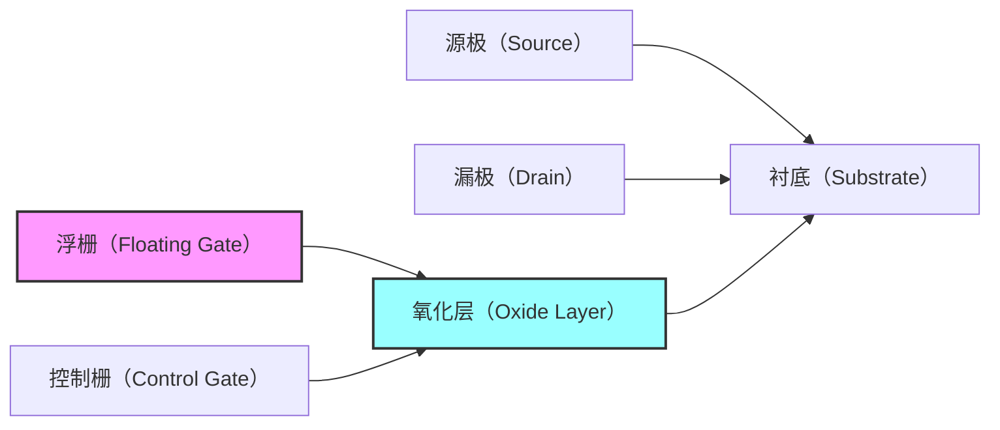
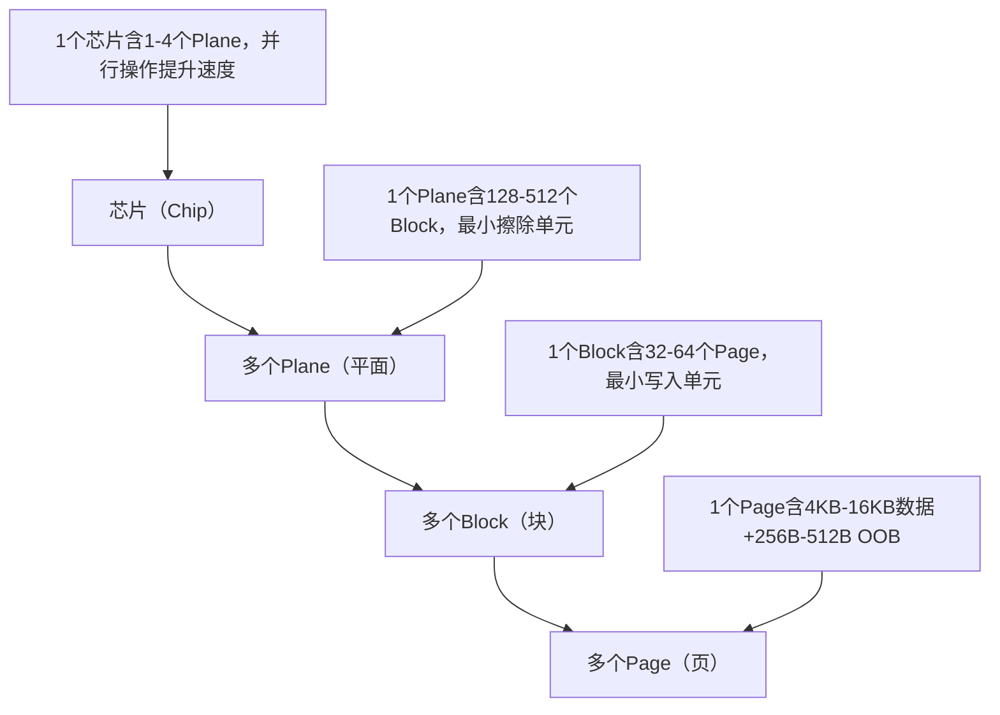
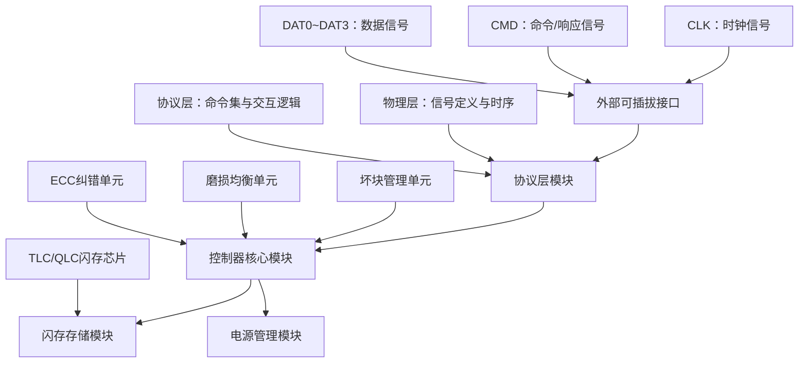
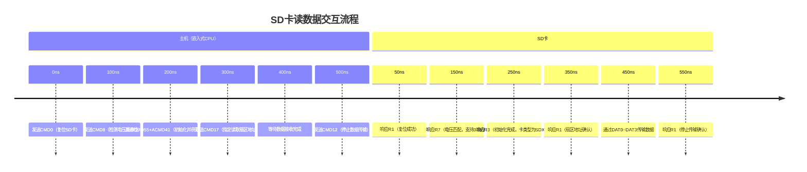

# 2. 硬件原理与物理结构

> 📊 **本节难度等级：** <span class="badge-i">**I级**</span>

---

### <strong>闪存（Flash Memory）是嵌入式非易失性存储的核心载体，NOR Flash和NAND Flash是其两大主流分支。中级工程师理解闪存底层机制的核心价值，在于“知其然且知其所以然”——比如为什么NOR能就地执行（XIP）而NAND不能？为什么TLC NAND比SLC可靠性差？为什么闪存必须“先擦后写”？这些问题的答案，都藏在浮栅晶体管的结构和工作机制中。</strong>


### <strong>存储单元核心：浮栅晶体管的电荷存储原理</strong>

闪存的最小存储单元是“浮栅晶体管（Floating Gate Transistor）”，其核心创新是“用浮栅存储电荷”，从而实现数据的非易失性保存。新手可能对晶体管结构感到陌生，我们可以用“带锁的电子陷阱”来类比：浮栅就像一个封闭的“陷阱”，电子（负电荷）一旦进入并被锁住，就能长期留存；数据的“0”和“1”，本质就是浮栅中“有电子”和“无电子”的状态差异。

#### 1. 浮栅晶体管的核心结构
浮栅晶体管的结构基于MOSFET（金属-氧化物-半导体场效应晶体管），但增加了一层“浮栅（Floating Gate）”，关键结构包括5个部分（结合图示理解更直观）：



- 源极（Source）：提供电子的“起点”，读写擦除时电子从这里流出或流入；
- 漏极（Drain）：接收电子的“终点”，形成电流通路以判断存储状态；
- 衬底（Substrate）：晶体管的基底，通常为P型半导体，构成电流通路的基础；
- 浮栅（Floating Gate）：核心存储部件，由多晶硅制成，被氧化层完全包裹，与外部无电气连接——这是“电荷留存”的关键：氧化层（通常是SiO₂）绝缘性极强，电子进入后无法轻易泄漏；
- 控制栅（Control Gate）：施加电压的“开关”，通过电压变化控制电子的注入（写入）或泄放（擦除）。

#### 2. 电荷存储与数据表示逻辑
闪存通过“浮栅中是否存在电子”来表示二进制数据“0”和“1”，核心逻辑如下：
- 数据“1”：浮栅中**无电子**。此时控制栅施加正向电压后，源极和漏极之间会形成导电沟道，电流流通，判断为“1”；
- 数据“0”：浮栅中**有电子**。电子在浮栅中会产生负电场，抵消控制栅的正向电压，导致源漏极之间无法形成有效沟道，电流截止，判断为“0”。

这里要注意：闪存的“初始状态”（未写入数据时）浮栅中无电子，默认存储“1”；写入数据的过程，本质是将电子注入浮栅的过程。

#### 3. 电子的“注入”与“泄放”：写入与擦除的底层机制
浮栅被绝缘氧化层包裹，电子无法直接进入或流出，必须通过特殊物理效应实现，这也是闪存“写”和“擦”操作的核心：

- 写入（Program）：将电子注入浮栅，对应数据“0”的写入。
  主流实现方式是**热电子注入（Hot Electron Injection, HEI）** ：在控制栅施加高正向电压（约10-12V），源极接地，漏极施加中等电压。此时源极的电子被电场加速，获得足够能量后，突破氧化层的能垒，注入到浮栅中并被“锁住”。
  另一种方式是**FN隧穿效应（Fowler-Nordheim Tunneling）** ：在控制栅施加高电压，氧化层两端形成强电场，电子通过量子隧穿效应穿过氧化层进入浮栅，这种方式功耗更低，常用于NAND Flash的写入。

- 擦除（Erase）：将浮栅中的电子泄放出去，恢复初始状态“1”。
  几乎所有闪存都采用**FN隧穿效应**：在衬底施加高正向电压，控制栅接地，氧化层两端形成反向强电场，浮栅中的电子通过隧穿效应泄放到衬底中，完成擦除。
  关键注意点：擦除操作必须“按块进行”，无法单独擦除一个页——这是由浮栅晶体管的阵列结构决定的：一个块内的所有晶体管共享衬底电压，施加擦除电压时，整个块的浮栅电子都会泄放。<br>

### <strong>NOR Flash：XIP就地执行的硬件基础与分块擦除机制</strong>

NOR Flash的核心特性是“支持XIP（就地执行）”和“随机读取速度快”，这些特性都源于其独特的“地址线直接映射”结构；而“擦除速度慢”“容量成本高”的短板，也同样由结构决定。

#### 1. XIP就地执行的硬件基础
XIP的本质是“CPU可以直接通过地址总线访问Flash中的代码，无需先加载到内存（DDR）”，其硬件基础是NOR Flash的“字节级随机访问能力”，核心结构设计如下：

- 地址线与存储单元的“一对一映射”：NOR Flash的每个字节（或半字）都有独立的地址线和数据线，CPU发出的地址信号会通过片内地址译码器，直接定位到某个具体的存储单元，无需经过“块-页”的多级寻址；
- 片内缓存与访问时序优化：NOR Flash集成了简单的片内缓存和地址锁存器，能快速响应CPU的随机地址请求，访问延迟通常在几十纳秒，与内存延迟接近；
- 与CPU总线的兼容性：NOR Flash的接口时序与CPU的地址总线、数据总线完全匹配，无需额外的控制器转换，CPU可像访问内存一样访问NOR Flash。

举个实际场景：嵌入式设备上电后，CPU首先通过地址总线发出“读取Bootloader起始地址”的指令，NOR Flash直接将该地址的代码通过数据总线返回给CPU，CPU立即执行——这个过程无需加载到内存，实现了XIP。正因为如此，NOR Flash常被用作“启动介质”，存储Bootloader或小型内核。

#### 2. 分块擦除机制与特性局限
NOR Flash的擦除机制源于其“并联式存储阵列”结构，每个存储块（Block）是最小擦除单元，其核心特点如下：

- 块结构与擦除原理：NOR Flash的存储块通常较大（早期为64KB-128KB，现代可达1MB），每个块包含数百个页（Page，通常256B-4KB）。擦除时，对整个块的衬底施加高电压，通过FN隧穿效应泄放所有浮栅中的电子——由于块体积大，需要更长时间积累电荷，导致擦除速度慢（通常每个块擦除需几十毫秒）。

- 读写擦特性对比：
  - 读取：随机访问速度快（几十纳秒/字节），支持字节级读取，适合代码执行；
  - 写入：需先擦除块再写入，写入速度慢（几十微秒/字节），且只能按页写入；
  - 擦除：块级操作，速度最慢（几十毫秒/块），且块越大，擦除时间越长。

这种特性决定了NOR Flash的应用局限：不适合高频写入或大容量数据存储——比如频繁写入日志数据的工业设备，用NOR Flash会因擦除速度慢导致效率低下；而大容量存储场景（如32GB以上），NOR Flash的单位成本是NAND的3-5倍，完全不具备性价比。

#### 3. NOR Flash的结构与NAND Flash的核心差异（补充对比，强化理解）
为了更清晰理解NOR的特性，我们用表格对比其与NAND Flash的核心结构差异：

| 结构特性         | NOR Flash                          | NAND Flash                          |
|------------------|------------------------------------|-------------------------------------|
| 地址映射方式     | 字节级独立地址线，直接映射        | 块-页多级寻址，无独立字节地址线    |
| 存储阵列结构     | 并联式，每个单元独立连接地址线    | 串联式，多个单元共享位线           |
| 最小擦除单元     | 块（Block，64KB-1MB）              | 块（Block，128KB-4MB）              |
| 访问延迟         | 随机读取快（几十ns），擦除慢       | 随机读取慢（几十μs），顺序读写快    |
| 接口复杂度       | 地址线+数据线，引脚多（30-40pin）  | 少量I/O线（8-16pin），时序复杂      |<br>

### <strong>NAND Flash：SLC/MLC/TLC/QLC电荷等级差异与可靠性关联（关联6.1节寿命预测）</strong>

NAND Flash的核心优势是“高容量、低成本、顺序读写快”，其底层逻辑是“串联式存储阵列”和“多比特存储技术”；而SLC/MLC/TLC/QLC的差异，本质是“浮栅中存储的电荷等级数量”不同，这直接决定了其容量、耐久性和可靠性。

#### 1. 串联式存储阵列：高容量低成本的基础
NAND Flash采用“串联式存储阵列”，多个浮栅晶体管串联在一条位线（Bit Line）上，共享地址译码器和控制电路——这种结构的最大优势是“存储密度高”：相同芯片面积下，NAND的存储单元数量是NOR的5-10倍，单位容量成本大幅降低。

但串联结构也带来了“随机访问速度慢”的短板：CPU访问NAND时，需先通过命令选中块，再选中页，最后读取页内数据，无法像NOR那样直接访问单个字节；且页内数据需通过“页缓冲器”批量传输，随机访问延迟可达几十微秒，远高于NOR。因此，NAND Flash更适合“顺序读写”的场景（如存储根文件系统、业务数据），不支持XIP。

#### 2. 电荷等级与多比特存储技术：SLC/MLC/TLC/QLC的核心差异
NAND Flash的“多比特存储”是通过“区分浮栅中的电荷数量”实现的——浮栅中注入的电子数量不同，会产生不同的阈值电压（控制栅导通所需的电压），通过检测阈值电压的差异，就能识别出多个数据状态，从而实现一个单元存储多个比特。

我们用“水杯装水”来类比：浮栅是水杯，电子是水，不同的水位（电荷数量）对应不同的比特状态：

- SLC（Single-Level Cell，单级单元）：每个单元只存1位数据，只有“空杯（无电子，数据1）”和“满杯（有电子，数据0）”两种状态，电荷等级差异大（阈值电压差明显）。
  优势：P/E周期可达10万-100万次，可靠性最高，读写速度最快（无需区分多个电荷等级）；
  劣势：存储密度最低，单位容量成本最高。

- MLC（Multi-Level Cell，多级单元）：每个单元存2位数据，有“空杯、1/3满、2/3满、满杯”四种电荷等级，对应00、01、10、11四种数据状态。
  优势：存储密度是SLC的2倍，成本降低约50%；
  劣势：P/E周期降至1万-10万次，可靠性下降——电荷等级差异变小，容易受温度、电压波动影响，读写时需要更复杂的阈值检测电路。

- TLC（Triple-Level Cell，三级单元）：每个单元存3位数据，有8种电荷等级（2³=8），对应8种数据状态。
  优势：存储密度是SLC的3倍，成本极低；
  劣势：P/E周期仅1000-3000次，可靠性进一步下降——电荷等级差异极小，误码率显著升高，必须依赖更强大的ECC（纠错码）技术（关联6.2节）。

- QLC（Quad-Level Cell，四级单元）：每个单元存4位数据，有16种电荷等级（2⁴=16）。
  优势：存储密度最高，单位容量成本最低；
  劣势：P/E周期仅几百次，可靠性最差，读写速度最慢——电荷等级的区分难度极大，仅适用于写入频率极低的场景（如数据中心冷存储），嵌入式场景极少使用。

#### 3. 电荷等级与可靠性、寿命的关联逻辑（关联6.1节寿命预测）
为什么电荷等级越多，可靠性越差、寿命越短？核心原因有两点：

- 电荷泄漏与干扰风险：多电荷等级对“电荷留存”的要求极高——浮栅中的电子会随时间缓慢泄漏（尤其是高温环境下），多等级的电荷差异容易被泄漏抹平，导致数据错误；同时，相邻单元的电荷会产生电场干扰，多等级场景下这种干扰的影响更显著。

- 擦写过程的损耗加剧：每次擦写都会对浮栅的氧化层造成轻微损伤（电子注入和泄放时的能量冲击）。多比特存储需要更精确的电荷控制，擦写时的电压变化更复杂，氧化层的损耗速度更快，导致P/E周期大幅缩短。

这一关联直接决定了嵌入式场景的选型逻辑：
- 工业控制、医疗设备等“高可靠、高频写入”场景，必须选SLC NAND，确保10年以上寿命；
- 消费电子、普通IoT设备等“中可靠、中低频写入”场景，可选MLC/TLC NAND，平衡成本和寿命；
- QLC NAND因寿命太短，几乎不用于嵌入式设备——除非是一次性使用或写入频率极低的场景（如物流标签）。

我们用Mermaid图直观展示电荷等级与特性的关系：
```mermaid
graph TD
    A[SLC（1位/单元）] -->|电荷等级2种| B[P/E周期10万+，可靠性最高]
    C[MLC（2位/单元）] -->|电荷等级4种| D[P/E周期1万-10万，可靠性中等]
    E[TLC（3位/单元）] -->|电荷等级8种| F[P/E周期1千-3千，可靠性较低]
    G[QLC（4位/单元）] -->|电荷等级16种| H[P/E周期几百次，可靠性最差]
    B --> I[成本最高，存储密度最低]
    D --> J[成本中等，存储密度中等]
    F --> K[成本较低，存储密度较高]
    H --> L[成本最低，存储密度最高]
```<br>

### <strong>集成化存储（eMMC/UFS）是嵌入式场景的主流选择，其核心价值是“将分散的NAND闪存、控制器、固件集成于单一芯片”，解决了传统离散NAND“需外部控制器、驱动复杂、可靠性低”的痛点。理解其架构的关键，在于看清“各模块的分工协作”——控制器是“管理者”，NAND闪存是“存储载体”，固件是“智能大脑”，接口是“通信桥梁”，三者协同实现高效、稳定的存储访问。</strong>


### <strong>eMMC内部组成：控制器+NAND闪存+固件的一体化设计</strong>

eMMC（嵌入式多媒体卡，embedded MultiMediaCard）的本质是“NAND闪存+集成控制器+固化固件”的Turnkey解决方案，其一体化设计让硬件工程师无需关注NAND底层的坏块管理、磨损均衡等复杂细节，只需通过标准化接口即可使用，极大降低了嵌入式系统的存储设计门槛。

#### 1. 核心组成模块与分工
eMMC的内部架构可分为三大核心模块，各模块各司其职、协同工作，形成完整的存储系统：

```mermaid
graph TB
    A[外部接口模块] --> B[控制器核心模块]
    C[NAND闪存阵列] --> B
    D[固件与缓存模块] --> B
    B --> E[电源管理模块]
    子模块1[CMD线：命令传输] --> A
    子模块2[DATA线：数据传输] --> A
    子模块3[CLK线：时钟同步] --> A
    子模块4[坏块管理单元] --> B
    子模块5[磨损均衡单元] --> B
    子模块6[ECC纠错单元] --> B
    子模块7[读写调度单元] --> B
    子模块8[片内SRAM缓存] --> D
    子模块9[固化固件（FW）] --> D
```

- 外部接口模块：提供标准化的MMC接口，包括1根CMD线（传输命令和响应）、4/8根DATA线（传输数据）、1根CLK线（时钟同步）和电源/地线，接口引脚数量仅10-16个，占用PCB空间极小；
- 控制器核心模块：eMMC的“中枢大脑”，负责解析外部命令、管理NAND闪存访问，核心子单元包括：
  - 坏块管理单元：自动检测NAND闪存的坏块，用片内备用块替换，屏蔽坏块对用户的影响（用户无需感知坏块存在）；
  - 磨损均衡单元：通过算法将写入操作均匀分配到所有NAND块，避免部分块因过度擦写提前老化，延长整体使用寿命；
  - ECC纠错单元：对读写数据进行BCH或LDPC纠错（关联6.2节），修复NAND闪存的位错误，提升数据可靠性；
  - 读写调度单元：优化读写时序，支持多任务并发访问，比如同时处理“系统读取根文件系统”和“应用写入业务数据”；
- NAND闪存阵列：存储数据的核心载体，通常由1-4片NAND闪存芯片组成（支持多通道并行访问），可选用SLC/MLC/TLC类型，容量从几百MB到数TB不等；
- 固件与缓存模块：固件（FW）是固化在eMMC内部的驱动程序，负责控制控制器的所有功能；片内SRAM缓存（通常几MB到几十MB）用于临时存储读写数据，提升连续读写速度（比如读取大文件时，缓存预加载后续数据）；
- 电源管理模块：集成低压差稳压器（LDO）和电源状态机，支持多种功耗模式（待机、休眠、深度休眠），适配嵌入式设备的低功耗需求。

#### 2. 一体化设计的核心优势
eMMC的一体化架构相比传统“离散NAND+外部控制器”方案，优势体现在四个关键维度：

- 降低设计复杂度：硬件工程师无需设计NAND控制器电路、无需调试复杂的NAND驱动，只需按照MMC标准接口布线，Linux内核自带eMMC驱动，上电即可识别使用；
- 提升可靠性：固件内置的坏块管理、ECC纠错、磨损均衡功能，比外部控制器的软件实现更高效、更稳定——比如ECC纠错在硬件层面完成，延迟仅微秒级，而软件纠错需毫秒级；
- 优化成本与空间：单一eMMC芯片集成所有功能，相比“NAND+控制器”的双芯片方案，PCB空间减少30%以上，量产成本降低20%-40%；
- 标准化兼容性：eMMC接口遵循JEDEC标准，不同厂商的eMMC芯片可无缝替换（比如三星和镁光的eMMC 5.1芯片，引脚定义和时序完全一致），降低供应链风险。

#### 3. 典型工作流程示例（读数据）
eMMC的工作流程由“命令-响应-数据”三个阶段组成，以“读取根文件系统中的内核镜像”为例，具体流程如下：
1. CPU通过CMD线向eMMC发送“读取指定地址数据”的命令（含块地址、数据长度等参数）；
2. eMMC控制器解析命令后，通过固件调用坏块管理单元，确认目标块是否为坏块（若为坏块则切换到备用块）；
3. 控制器向NAND闪存阵列发送读取指令，NAND闪存将目标块的页数据读出，传输至ECC纠错单元；
4. ECC单元检测并修复数据中的位错误，将正确数据存入片内SRAM缓存；
5. 控制器通过DATA线，将缓存中的数据批量传输至CPU，同时返回“读取成功”的响应；
6. 若数据长度超过缓存容量，控制器会分批次读取NAND数据，直至完成全部传输。<br>

### <strong>UFS串行接口优势与BGA/CSP/POP嵌入式封装特性</strong>

UFS（通用闪存存储，Universal Flash Storage）是为“高性能嵌入式场景”设计的集成化存储，其核心优势源于“串行接口协议”和“更先进的架构设计”，封装特性则适配了不同嵌入式设备的空间需求。

#### 1. 串行接口的核心优势（对比eMMC并行接口）
UFS采用基于PCIe和SCSI的串行接口协议，与eMMC的并行MMC接口相比，在速度、功耗、灵活性上实现了质的飞跃，核心差异如下表：

| 接口特性         | UFS（串行接口）                          | eMMC（并行接口）                          | 优势体现场景                          |
|------------------|------------------------------------------|-------------------------------------------|---------------------------------------|
| 传输模式         | 全双工（读写可同时进行）                  | 半双工（读写不能同时进行）                | AI边缘设备同时加载模型（读）和存储数据（写） |
| 数据通道         | 2/4通道，每通道速率达11.6Gbps（UFS 3.1） | 4/8通道，每通道速率达200Mbps（eMMC 5.1）  | 4K视频采集、大模型加载等高速场景      |
| 信号完整性       | 差分串行传输，抗干扰能力强                | 单端并行传输，易受串扰影响                | 工业设备、车载场景等强干扰环境        |
| 功耗控制         | 支持动态功耗管理（链路休眠、通道关闭）    | 功耗随通道数量线性增加                    | 电池供电的便携式嵌入式设备（无人机、手持终端） |
| 协议扩展性       | 兼容PCIe 4.0/5.0，支持NVMe协议扩展        | 仅支持MMC协议，扩展性有限                  | 未来高性能存储需求的升级适配          |

关键技术解析：
- 全双工传输：UFS的发送通道（Tx）和接收通道（Rx）相互独立，可同时进行读取和写入操作——比如边缘AI设备在通过UFS读取10GB模型文件的同时，能将实时采集的视频数据写入UFS，而eMMC只能先读完再写，效率提升一倍以上；
- 差分串行信号：UFS的每对通道采用差分信号传输（P/N线），信号电压摆幅仅0.2V-0.4V，相比eMMC的1.8V单端信号，抗电磁干扰（EMI）能力更强，PCB布线时无需严格的长度匹配，降低硬件设计难度；
- 协议栈优化：UFS的协议栈基于SCSI架构，支持“命令队列”（最多32个命令），控制器可批量处理多个读写请求，优化调度顺序（比如将相邻地址的读取请求合并），进一步提升访问效率。

#### 2. BGA/CSP/POP嵌入式封装特性
UFS的封装形式针对嵌入式设备的“小体积、高密度”需求设计，主流封装包括BGA、CSP、POP三种，各有适配场景：

- BGA（球栅阵列封装，Ball Grid Array）：最主流的封装形式，芯片底部布满球形焊点（引脚），通过焊点与PCB板连接。UFS的BGA封装尺寸通常为11.5mm×13mm（UFS 3.1）或更小，焊点间距0.5mm-0.8mm，适合大多数嵌入式设备（工业控制器、AI边缘模块）。优势是散热性好、机械稳定性强，批量焊接良率高；
- CSP（芯片级封装，Chip Scale Package）：封装尺寸与芯片裸片尺寸接近（仅大10%-20%），引脚采用焊盘形式，直接贴装在PCB上。UFS的CSP封装尺寸可缩小至8mm×10mm以下，适合空间极度紧张的设备（如微型传感器、可穿戴设备）。优势是体积最小、重量最轻，劣势是散热性稍差，对PCB工艺要求更高；
- POP（堆叠封装，Package on Package）：将UFS芯片直接堆叠在CPU或DDR内存芯片上方，共享PCB空间。UFS的POP封装可使存储与CPU的互连距离缩短至几毫米，减少信号延迟，同时节省PCB面积30%以上，适合高端嵌入式设备（如旗舰级边缘计算模块、车载智能座舱）。优势是集成度最高、信号延迟最低，劣势是设计复杂度高、维修难度大。

#### 3. UFS与eMMC的架构差异补充（强化理解）
除了接口，UFS的内部架构也比eMMC更先进：
- 多NAND通道并行：UFS控制器支持4-8个NAND通道，每个通道可独立访问一片NAND闪存，并行读写速度比eMMC（最多2个通道）提升2-3倍；
- 独立的读写缓存：UFS分离了读缓存和写缓存，避免读写操作抢占缓存资源，比如写缓存用于临时存储待写入数据，读缓存用于预加载读取数据，并发性能更优；
- 更强大的固件功能：UFS固件支持“温度监控”“健康状态上报”“安全加密”等高级功能，比如固件可实时监测NAND温度，温度过高时自动降速保护，提升极端环境下的可靠性。<br>

### <strong>Page/Block/Plane三级组织结构与硬件访问约束（关联4.1节分区设计）</strong>

无论是eMMC还是UFS，其内部NAND闪存的存储层级均遵循“Plane→Block→Page”的三级结构，这一结构直接决定了硬件访问的“最小操作单元”和“时序约束”，也是后续分区设计（关联4.1节）必须遵循的底层规则。

#### 1. 三级组织结构的核心定义与关系
三级结构是NAND闪存的物理组织形式，每一级对应不同的硬件操作单元，关系如下：



- Plane（平面）：NAND闪存的最高层级，是并行操作的基本单元。每个Plane包含独立的页缓冲器和控制电路，多个Plane可同时执行读写操作（比如2个Plane同时读取不同Block的Page），从而提升整体速度。eMMC通常含1-2个Plane，UFS含2-4个Plane，Plane数量越多，并行性能越强；
- Block（块）：NAND闪存的最小擦除单元，也是磨损均衡和坏块管理的基本单元。每个Block的大小通常为128KB-1MB（由Page数量决定，比如64个16KB Page组成1MB Block）。核心约束：写入数据前必须先擦除Block，且擦除操作只能按Block执行，无法单独擦除某个Page；
- Page（页）：NAND闪存的最小写入单元，也是数据存储的基本单元。每个Page的大小分为“主数据区（Data Area）”和“OOB区（Out-of-Band Area）”：主数据区用于存储用户数据（4KB-16KB），OOB区用于存储ECC校验码、坏块标记、磨损计数等元数据（256B-512B）。核心约束：写入数据只能按Page执行，且只能写入“已擦除的Block中的空白Page”，无法直接覆盖已有数据。

#### 2. 硬件访问的核心约束（直接影响分区设计）
三级组织结构带来了三个关键硬件约束，这些约束是后续4.1节“分区设计”的核心依据，必须严格遵循：

- 约束1：分区必须按“Block对齐”——用户在设计存储分区时（比如划分Bootloader分区、根文件系统分区），分区的起始地址和大小必须是Block大小的整数倍。原因：若分区跨Block边界，擦除某个Block时可能会误删相邻分区的数据；同时，控制器的坏块管理和磨损均衡功能也以Block为单位，对齐后能避免管理混乱。示例：若Block大小为1MB，根文件系统分区大小应设为32MB、64MB等1MB的整数倍，起始地址设为0x100000（1MB）、0x200000（2MB）等；

- 约束2：写入操作的“Page粒度”与“顺序性”——写入数据时，必须按Page顺序写入（先写Block中的第0页，再写第1页，直至写满Block），不能跳页写入；且写满一个Block后，需擦除该Block才能重新写入。这一约束导致NAND闪存的“随机写入速度慢”——随机写入时需要频繁擦除Block，而擦除速度远慢于写入速度；

- 约束3：OOB区的“只读保护”——OOB区由eMMC/UFS的固件管理，用于存储元数据，用户无法直接访问或修改。若用户强行修改OOB区数据，可能导致ECC纠错失效、坏块标记丢失，进而引发数据错误或存储设备故障。

#### 3. 三级结构的并行访问优势（补充解析）
多个Plane的存在为“并行访问”提供了硬件基础，以UFS的2个Plane为例，并行读取流程如下：
1. 控制器同时向Plane 0和Plane 1发送“读取指定Page”的指令；
2. Plane 0读取Block 0的Page 0，Plane 1读取Block 1的Page 0；
3. 两个Plane的页缓冲器同时将数据传输至控制器的读缓存；
4. 控制器将合并后的数据传输至外部CPU，整体速度接近单个Plane的2倍。

这种并行访问机制是UFS速度优于eMMC的重要原因之一，也解释了“为什么Plane数量越多，存储性能越强”——更多Plane意味着能同时执行更多读写操作，并行效率更高。<br>

### <strong>辅助存储介质是嵌入式系统“主存储”的重要补充，核心作用是“灵活扩展容量”和“实现数据可迁移”，最典型的代表是SD卡（含Micro SD）。与eMMC/UFS等内置集成存储不同，辅助存储的核心特点是“可插拔性”和“通用性”，但其底层仍基于闪存技术，因此既继承了闪存的共性约束（如坏块），又因可插拔特性衍生出独特的总线协议设计。理解本小节的核心价值，在于掌握“辅助存储如何通过协议适配实现容量扩展”以及“如何应对其硬件约束保障数据可靠”——这对IoT设备的日志存储、工业设备的现场数据导出等场景至关重要。</strong>


### <strong>SD卡总线协议与容量扩展逻辑</strong>

SD卡的普及核心依赖于“标准化总线协议”和“灵活的容量升级机制”：总线协议确保不同厂商的SD卡可与任意嵌入式设备兼容，容量扩展逻辑则支撑其从早期几百MB升级至如今的数TB。其技术本质是“在闪存集成化架构基础上，增加可插拔接口和标准化通信协议”，核心解析重点是“协议的分层架构”和“容量升级的关键技术”。

#### 1. SD卡的内部架构与协议分层
SD卡的内部架构与eMMC类似，均为“闪存芯片+控制器+固件”的集成设计，但增加了可插拔的物理接口和标准化协议栈，架构如下：



- 外部可插拔接口：采用标准化物理接口（如Micro SD的9pin接口），核心信号包括1根CLK（时钟同步）、1根CMD（命令与响应传输）、4根DAT（数据传输，支持单通道/四通道切换），部分高速SD卡增加DAT4~DAT7实现八通道传输；
- 协议层模块：SD卡协议栈分为物理层和协议层，是实现“跨设备兼容”的核心：
  - 物理层：定义信号的电气特性（如3.3V供电、信号电平范围）和时序参数（如时钟频率，SDHC支持25MHz，SDXC支持50MHz）；
  - 协议层：定义标准化命令集（如CMD0用于复位、CMD8用于电压检测、CMD55+ACMD23用于设置预擦除块数）和“命令-响应-数据”的交互流程，所有厂商的SD卡必须遵循该命令集；
- 控制器核心模块：功能与eMMC控制器类似，集成坏块管理、磨损均衡、ECC纠错等功能，屏蔽闪存底层细节，对外提供标准化数据访问接口；
- 闪存存储模块：采用TLC或QLC闪存芯片（成本低、容量大，适配辅助存储的大容量需求），部分工业级SD卡采用MLC闪存提升可靠性；
- 电源管理模块：支持热插拔时的电源稳定控制，避免插拔过程中电压波动损坏芯片。

#### 2. 总线协议的核心交互流程
SD卡与嵌入式设备的通信严格遵循“命令-响应-数据”的三段式流程，以“读取SD卡中某段日志数据”为例，具体交互逻辑如下：



关键协议细节说明：
- 命令分类：SD卡命令分为“基础命令”（直接以CMD开头，如CMD0）和“应用特定命令”（需先发送CMD55激活，再发送ACMD开头的命令，如ACMD41），前者用于基础初始化，后者用于高级功能配置；
- 响应格式：SD卡的响应分为R1~R7等多种格式，包含“命令执行状态”（如是否成功、是否有错误）和“卡信息”（如电压范围、卡类型），主机通过解析响应判断下一步操作；
- 数据传输模式：支持“单块传输”（如CMD17读取单个扇区）和“多块传输”（如CMD18连续读取多个扇区），多块传输时需用CMD12终止，可大幅提升连续读写效率（如导出大量日志数据时）。

#### 3. 容量扩展逻辑：从SD到SDHC再到SDXC的升级关键
SD卡的容量从早期的几百MB（SD卡）扩展至如今的2TB（SDXC卡），核心并非单纯依赖闪存芯片密度提升，更关键的是“寻址方式”和“文件系统”的协同升级，不同代际的核心差异如下表：

| 卡类型   | 容量范围       | 寻址方式       | 总线速度       | 文件系统要求   | 核心升级点                     |
|----------|----------------|----------------|----------------|----------------|--------------------------------|
| SD卡     | 16MB~2GB       | 字节寻址       | 最高12.5MB/s   | FAT16          | 基础字节寻址，适配小容量存储   |
| SDHC卡   | 4GB~32GB       | 扇区寻址（512B）| 最高25MB/s     | FAT32          | 改用扇区寻址，突破2GB容量限制 |
| SDXC卡   | 64GB~2TB       | 扇区寻址（512B/4KB）| 最高104MB/s  | exFAT          | 支持4KB扇区，优化大容量管理   |
| SDUC卡   | 4TB~128TB      | 扇区寻址（4KB）| 最高312MB/s    | exFAT/NTFS     | 扩展扇区寻址范围，提升总线速度 |

容量扩展的核心技术解析：
- 寻址方式升级：早期SD卡采用“字节寻址”，地址线仅支持32位，最大寻址空间为2^32字节=4GB，但受限于FAT16文件系统，实际最大容量仅2GB；SDHC卡改为“扇区寻址”（1个扇区=512字节），地址表示“扇区编号”，32位地址可表示2^32×512B=2TB，从硬件层面突破容量限制；
- 文件系统适配：寻址方式升级后，需文件系统协同支持——FAT16最大仅支持2GB分区，SDHC卡强制使用FAT32（最大支持32GB），SDXC卡强制使用exFAT（最大支持128PB），文件系统通过“簇大小优化”减少大容量存储的管理开销；
- 总线速度优化：高容量SD卡需更高总线速度匹配数据传输需求，SDXC卡支持“UHS-I”总线模式，时钟频率提升至50MHz，四通道传输时速度达104MB/s，满足高清视频录制、大量日志导出等场景。<br>

### <strong>存储介质核心硬件约束：坏块产生根源与纠错必要性（关联6.2节纠错技术）</strong>

SD卡、eMMC、UFS等基于闪存的存储介质，均存在“坏块”这一核心硬件约束，而纠错技术是弥补该约束的关键手段。本部分重点解析坏块的“分类与产生根源”，并阐明“为什么纠错是存储可靠运行的必要条件”——这是理解后续6.2节“硬件纠错与软件容错技术”的基础，也是嵌入式存储可靠性设计的核心前提。

#### 1. 坏块的定义与分类
坏块是指“无法稳定存储数据的闪存块”，即对该块执行擦除、写入操作后，数据无法正确读取或出现不可修复的位错误。根据产生时机，坏块可分为“出厂坏块”和“使用中坏块”两类，核心差异如下：

| 分类         | 产生时机       | 占比范围       | 典型特征                     | 处理方式                     |
|--------------|----------------|----------------|------------------------------|------------------------------|
| 出厂坏块     | 芯片制造过程中 | 0.1%~0.5%      | 制造缺陷导致，出厂前已标记   | 控制器通过备用块替换，用户无感知 |
| 使用中坏块   | 设备运行过程中 | 随使用时间增加 | 擦写损耗、环境干扰导致       | 控制器实时检测，动态替换     |

关键说明：所有闪存芯片都存在出厂坏块，这是闪存制造工艺的固有特性——闪存的浮栅晶体管阵列在生产时，部分单元因氧化层缺陷、杂质污染等问题，天生无法稳定存储电荷，厂商会在出厂前通过测试标记这些坏块（通常记录在芯片的OOB区或专用寄存器中）。

#### 2. 坏块产生的核心根源
无论是出厂坏块还是使用中坏块，根源均与“浮栅晶体管的电荷存储能力”直接相关，具体可归纳为三类：

- 根源一：制造工艺缺陷（出厂坏块主因）
  闪存芯片的制造需经过“氧化层生长、多晶硅沉积、光刻蚀刻”等数十道工序，若某道工序出现偏差（如氧化层厚度不均、光刻图案偏移），会导致浮栅无法有效困住电荷——这类晶体管所在的块即为出厂坏块。例如，氧化层过薄会导致电子轻易泄漏，写入的数据很快失效；氧化层过厚则导致电子无法注入，块始终处于“空白状态”。

- 根源二：擦写循环损耗（使用中坏块主因）
  如2.1节所述，闪存的“擦除-写入”过程会对浮栅的氧化层造成损伤：每次擦除时，衬底施加的高电压会让电子通过FN隧穿效应泄放，高速电子冲击氧化层会产生微小缺陷；多次循环后，缺陷累积导致氧化层绝缘性下降，电子泄漏加剧，最终该块无法稳定存储数据。不同闪存类型的耐受擦写次数不同（SLC 10万次+、TLC 1000-3000次），擦写频率越高，使用中坏块出现越早——例如，工业设备的SD卡每天写入10GB日志，TLC类型可能1-2年就出现大量坏块。

- 根源三：环境因素诱发（加速坏块产生）
  嵌入式场景的恶劣环境会加速坏块产生，核心影响因素包括：
  - 温度：高温（如工业现场85℃以上）会加速浮栅中电子的热运动，导致电荷泄漏速度提升10-100倍，原本完好的块可能因数据错误被标记为坏块；低温（如-40℃以下）会导致闪存的阈值电压漂移，增加读写错误率；
  - 电压波动：供电电压骤升会导致擦写时施加的电压超过氧化层耐受极限，直接击穿氧化层产生坏块；电压骤降则会导致写入数据不完整，反复重试会加剧块的损耗；
  - 电磁干扰：强电磁环境（如工业电机附近）会干扰闪存的读写时序，导致数据写入错误，反复擦写修复会加速块的老化。

#### 3. 纠错技术的必要性：弥补硬件缺陷的核心手段
坏块的存在是“无法彻底避免”的硬件约束，而纠错技术（ECC）的核心作用是“修复读写过程中的位错误，延缓坏块标记时机，提升存储可靠性”——若没有纠错技术，即使是轻微的电荷泄漏导致1位数据错误，也会让整个文件失效，存储介质根本无法实用。

纠错技术的必要性可从三个维度理解：

- 维度一：掩盖闪存的固有位错误
  即使是完好的闪存块，读写过程中也会因“电子随机泄漏”“相邻单元干扰”产生少量位错误（如每1000个字节出现1位错误）。ECC纠错技术（如BCH、LDPC）可通过在数据中附加校验码，检测并修复这些位错误——例如，BCH-8算法可修复每512字节中的8位错误，LDPC算法可修复每1KB中的16位错误，确保用户读取到正确数据。

- 维度二：延缓使用中坏块的产生
  当某块出现少量位错误时，ECC可修复这些错误，避免该块被直接标记为坏块；只有当错误数量超过ECC的修复能力时，控制器才会将其标记为坏块并替换——这一过程可让块的有效使用寿命延长30%-50%。例如，TLC闪存块在使用后期，位错误率逐渐升高，ECC可通过“逐步提升纠错强度”维持块的可用性，直至错误无法修复。

- 维度三：适配高密度闪存的可靠性需求
  随着闪存密度提升（如TLC→QLC），每个浮栅存储的电荷等级更多，电荷差异更小，位错误率显著升高——QLC的位错误率是TLC的3-5倍。若没有更强大的纠错技术（如LDPC替代BCH），QLC闪存根本无法实用。SD卡、eMMC等辅助存储介质普遍采用TLC/QLC闪存，因此ECC纠错是其必备功能（关联6.2节详细解析）。

实际应用案例：工业级SD卡的纠错设计
工业现场的SD卡需在-40℃~85℃的宽温环境下工作，位错误率远高于常温场景。因此，工业级SD卡通常采用“双重纠错机制”：硬件层面集成LDPC纠错引擎，实时修复位错误；软件层面定期执行“数据刷新”，将即将失效的数据迁移至完好块，进一步提升可靠性——这就是工业级SD卡比消费级SD卡寿命长3-5倍的核心原因。<br>

---
