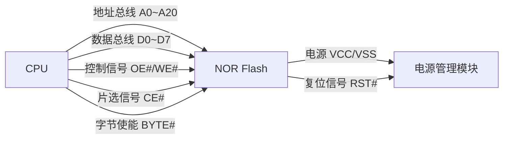
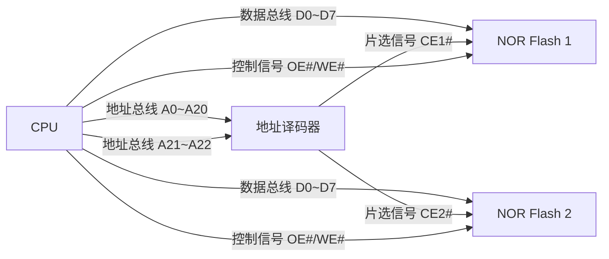
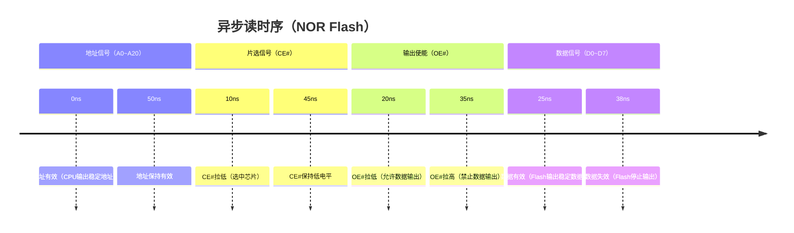
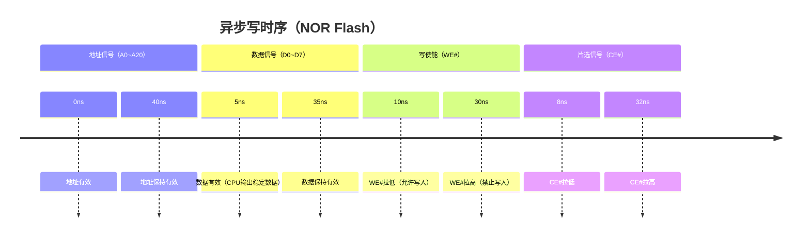
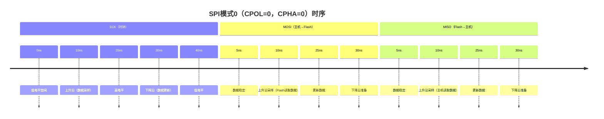
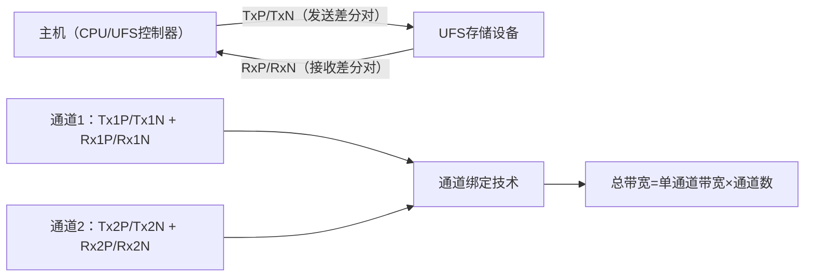

# 3. 硬件接口与电气特性

> 📊 **本节难度等级：** **I级**

---

### <strong>并行接口是NOR Flash的经典接口形式，核心特征是“地址线与数据线分离传输”，凭借“字节级随机访问”支撑XIP功能（关联2.1节）。其技术本质是“通过多根独立引脚同步传输地址、数据和控制信号”，设计重点在于“总线连接的正确性”“时序参数的匹配性”和“控制逻辑的可靠性”——这些直接决定了NOR Flash能否稳定响应CPU的访问请求，尤其在嵌入式设备的启动阶段（依赖NOR Flash存储Bootloader），并行接口的设计质量至关重要。</strong>

### <strong>地址数据总线的硬件连接方式</strong>

并行接口的核心硬件基础是“地址总线（AB）、数据总线（DB）、控制总线（CB）”的独立设计，三者协同实现CPU与NOR Flash的通信。NOR Flash作为并行接口的典型设备，其引脚定义与总线连接方式高度标准化，理解连接逻辑的关键是“明确各引脚的功能分工”和“多设备共存时的地址映射”。

#### 1. 核心引脚定义与功能分工
NOR Flash的并行接口引脚可分为三类，各引脚的功能直接决定连接逻辑：

| 引脚类型       | 典型引脚名          | 功能描述                                                                 | 连接对象                  |
|----------------|---------------------|--------------------------------------------------------------------------|---------------------------|
| 地址总线引脚   | A0~A(n-1)           | 传输CPU发出的地址信号，n为地址线数量（如A0~A20对应2MB容量：2²¹=2,097,152字节） | CPU地址总线（ADDR）       |
| 数据总线引脚   | D0~D(m-1)           | 双向传输数据（CPU读时Flash输出数据，CPU写时CPU输出数据），m为数据宽度（8/16位） | CPU数据总线（DATA）       |
| 控制总线引脚   | CE#（Chip Enable）  | 片选信号（低有效），拉低时选中该Flash芯片，高电平时芯片休眠                 | CPU控制总线或地址译码器    |
|                | OE#（Output Enable）| 输出使能（低有效），拉低时Flash将数据输出到数据总线                         | CPU控制总线（读控制信号）  |
|                | WE#（Write Enable） | 写使能（低有效），拉低时CPU将数据写入Flash                                 | CPU控制总线（写控制信号）  |
|                | BYTE#（或LB#/UB#）  | 字节使能（低有效），控制8/16位数据宽度切换（16位Flash必备）                 | CPU控制总线（字节控制信号）|

关键术语说明：引脚名后的“#”表示“低电平有效”，即引脚电压为0V时功能生效，3.3V时功能关闭——这是数字电路的常用规范，避免高电平干扰导致的误触发。

#### 2. 单芯片与多芯片的连接架构
嵌入式系统中，并行NOR Flash的连接分为“单芯片”和“多芯片”两种场景，核心差异在于是否需要地址译码器：

##### （1）单芯片连接架构（主流场景）
当系统仅需一片NOR Flash（如存储Bootloader）时，直接将Flash引脚与CPU总线对接，架构简洁：

连接关键要点：
- 地址线全映射：CPU的地址总线（如A0~A20）直接连接Flash的地址引脚，Flash的存储容量由地址线数量决定（容量=2^地址线数字节）；
- 数据线匹配：若CPU数据总线为32位，而Flash为16位，需通过CPU内部的“数据宽度适配模块”转换，无需额外硬件；
- 控制信号直接对接：CPU的读控制信号（如nGCS0）直接连接Flash的OE#，写控制信号（如nWE）连接WE#，片选信号（如nCS0）直接连接CE#。

##### （2）多芯片连接架构（扩展场景）
当系统需要多片NOR Flash（如主备启动介质）时，需增加“地址译码器”，通过地址线高位控制片选信号：

地址译码逻辑示例：
- 假设两片Flash均为2MB（A0~A20），用CPU的A21作为译码输入；
- 当A21=0时，地址译码器输出CE1#=0（选中Flash 1），地址范围为0x000000~0x1FFFFF；
- 当A21=1时，输出CE2#=0（选中Flash 2），地址范围为0x200000~0x3FFFFF；
- 核心目的：通过地址高位区分不同芯片的地址空间，避免地址冲突。

#### 3. 数据宽度适配（8位vs16位）
并行NOR Flash的常见数据宽度为8位（D0~D7）和16位（D0~D15），连接时需与CPU数据总线匹配：
- 8位宽度：数据总线仅用D0~D7，地址线A0对应字节地址，适合低端CPU或小容量存储；
- 16位宽度：数据总线用D0~D15，地址线A1对应字节地址（A0用于字节使能控制），读写速度比8位快一倍，适合中高端场景。

字节使能引脚的作用：16位Flash的LB#（低字节使能）和UB#（高字节使能）用于控制单个字节读写——比如仅写低8位数据时，拉低LB#、拉高UB#；写高8位时则相反，实现“字节级访问”的灵活性。 

### <strong>异步vs同步读写时序设计规范</strong>

并行接口的读写时序分为“异步”和“同步”两种，时序设计的核心是“确保地址、数据、控制信号的时序关系满足Flash芯片的要求”，避免因信号不稳定导致的数据错误。时序参数需严格参考Flash的数据手册，不同厂商的芯片参数略有差异，但设计逻辑一致。

#### 1. 异步读写时序（主流设计）
异步时序的核心是“无时钟同步”，信号的有效性依赖“电平保持时间”（建立时间和保持时间），设计简单、兼容性强，是嵌入式系统的主流选择。

##### （1）异步读时序（最常用场景，如XIP执行代码）
异步读时序的流程是“CPU送地址→Flash输出数据→CPU读取数据”，关键时序参数包括地址建立时间（tAA）、输出使能延迟（tOE）、数据保持时间（tOH）：

时序参数解释与设计要求：
- tAA（地址建立时间）：地址信号稳定后到OE#拉低的时间，典型值20~30ns——确保Flash有足够时间解码地址；
- tOE（输出使能延迟）：OE#拉低到数据稳定的时间，典型值10~20ns——Flash内部译码并输出数据的耗时；
- tOH（数据保持时间）：OE#拉高后数据仍有效的时间，典型值5~10ns——避免CPU读取时数据突然失效。

设计关键：CPU的读控制逻辑需确保各信号的时序满足上述参数，比如若Flash的tOE=20ns，OE#拉低后需等待20ns再读取数据总线，否则数据可能不稳定。

##### （2）异步写时序（较少用，如更新Bootloader）
异步写时序的流程是“CPU送地址→送数据→Flash写入数据”，关键时序参数包括地址建立时间（tAS）、写使能宽度（tWP）、数据保持时间（tDW）：

时序约束：
- tWP（写使能宽度）：WE#低电平的最小持续时间，典型值20~30ns——确保Flash有足够时间将数据写入存储单元；
- 写保护：部分NOR Flash有WP#（写保护）引脚，需拉高该引脚才能写入，设计时需注意避免误触发写保护。

#### 2. 同步读写时序（高速场景）
同步时序的核心是“以时钟信号（CLK）为基准”，所有信号的有效性与时钟边沿同步，速度比异步时序快30%~50%，适合高速读取场景（如高频CPU的XIP执行）。

同步读时序关键特征：
- 时钟信号（CLK）：CPU提供固定频率时钟（如50MHz），Flash的地址、控制信号在时钟上升沿有效；
- 流水线操作：Flash支持“地址流水线”，即当前数据输出的同时，可接收下一个地址，连续读取时速度大幅提升；
- 时序参数：核心参数为时钟周期（tCLK）、地址建立时间（tSU）、数据输出延迟（tCO），需确保时钟频率不超过Flash的最大同步频率（如66MHz）。

同步与异步时序对比：
| 对比维度       | 异步时序                          | 同步时序                          | 适配场景                          |
|----------------|-----------------------------------|-----------------------------------|-----------------------------------|
| 速度           | 慢（典型读速度20~50MB/s）         | 快（典型读速度50~80MB/s）         | 高速CPU、大容量代码XIP执行        |
| 设计复杂度     | 低（无需时钟同步）                | 高（需匹配时钟时序，避免 metastability） | 中高端嵌入式设备                  |
| 兼容性         | 强（支持所有CPU）                 | 弱（需CPU支持同步接口）            | 专用高性能嵌入式平台              | 

### <strong>硬件片选与字节使能控制逻辑（关联4.2节硬件连接实战）</strong>

片选（CE#）和字节使能（BYTE#/LB#/UB#）是并行接口的“控制核心”，片选负责“选中哪个芯片”，字节使能负责“访问哪个字节”，两者协同实现多芯片、多宽度的灵活访问，也是4.2节“工业级双存储备份设计”的核心控制逻辑。

#### 1. 片选控制逻辑：多芯片的地址空间划分
片选信号的核心作用是“激活目标NOR Flash芯片”，未被选中的芯片数据总线呈高阻态（不影响其他芯片）。片选控制的实现方式分为“CPU直接控制”和“地址译码器控制”：

##### （1）CPU直接控制（单芯片/少量芯片）
当系统仅1~2片Flash时，可直接使用CPU的专用片选引脚（如nCS0、nCS1）连接Flash的CE#。例如：
- CPU的nCS0连接Flash 1的CE#，地址空间0x000000~0x1FFFFF（2MB）；
- CPU的nCS1连接Flash 2的CE#，地址空间0x200000~0x3FFFFF（2MB）；
- 优势：设计简单，无需额外硬件；劣势：CPU片选引脚数量有限，无法扩展多芯片。

##### （2）地址译码器控制（多芯片扩展）
当需要3片以上Flash时，需用地址译码器（如74HC138、CPLD）将地址线高位转换为片选信号。以74HC138译码器为例，逻辑如下：
- 输入：CPU地址线高位（如A21、A22、A23）；
- 输出：8路片选信号（Y0#~Y7#），可控制8片Flash；
- 译码逻辑：A23A22A21=000时Y0#=0（选中Flash 1），001时Y1#=0（选中Flash 2），以此类推。

##### （3）片选控制的可靠性设计
嵌入式场景中，片选信号需避免“误触发”，关键设计要点：
- 上拉电阻：CE#引脚串联10kΩ上拉电阻，确保未选中时为高电平，避免总线干扰导致的误拉低；
- 复位期间控制：CPU复位时，片选信号应保持高电平，避免复位过程中误写Flash；
- 电源稳定后使能：通过电源管理模块的“电源就绪（PWR_OK）”信号控制片选，确保Flash电源稳定后再激活。

#### 2. 字节使能控制逻辑：灵活的访问宽度适配
字节使能信号用于控制16位（或32位）Flash的“字节级访问”，避免因数据宽度不匹配导致的访问错误，核心逻辑如下：

##### （1）16位Flash的字节使能引脚（LB#/UB#）
- LB#（Low Byte Enable，低有效）：控制低8位数据（D0~D7）的读写；
- UB#（Upper Byte Enable，低有效）：控制高8位数据（D8~D15）的读写；
- 访问模式控制：
  - 字节访问（读D0~D7）：LB#=0，UB#=1；
  - 字节访问（读D8~D15）：LB#=1，UB#=0；
  - 半字访问（读D0~D15）：LB#=0，UB#=0；

##### （2）字节使能与CPU的连接逻辑
CPU的“字节控制信号”（如nWBE0~nWBE3）直接连接Flash的LB#/UB#，例如32位CPU访问16位Flash时：
- CPU发出“读低字节”命令，nWBE0=0，nWBE1=1，通过字节使能控制Flash输出低8位数据；
- 若CPU不支持字节控制信号，需通过逻辑门电路将地址线A0转换为LB#/UB#信号（A0=0时LB#=0，A0=1时UB#=0）。

#### 3. 与4.2节工业级实战的关联应用
在4.2节“工业级可靠性存储设计（eMMC + NOR双启动）”中，片选与字节使能控制逻辑是“双启动切换”的核心：
- 正常启动：CPU通过片选信号选中eMMC的Boot分区，加载内核；
- 故障启动：当eMMC检测故障时，硬件电路自动切换片选信号，选中NOR Flash的应急启动分区，通过字节使能控制16位NOR Flash的字节级访问，确保应急程序正常执行；
- 核心价值：片选与字节使能的硬件控制逻辑，实现了“无软件干预的双启动切换”，提升工业设备的启动可靠性。 

### <strong>串行接口是嵌入式存储的主流接口形式，核心特征是“通过少量引脚分时/并行传输信号”，相比并行接口，具有“引脚少、抗干扰强、成本低、速度上限高”的优势。从简单的SPI NOR Flash到高速的UFS，串行接口的演进本质是“协议效率与传输速度的持续优化”——SPI适配小容量低速率场景，SD/eMMC平衡兼容性与性能，UFS满足高性能场景需求。理解本小节的核心价值，在于掌握“不同串行协议的通信逻辑”和“接口特性与场景的匹配方法”，这是嵌入式存储硬件连接、驱动调试的基础。</strong>

### <strong>SPI NOR Flash四线制（CS/SCK/MOSI/MISO）通信机制</strong>

SPI（串行外设接口，Serial Peripheral Interface）是最简单的串行通信协议，SPI NOR Flash采用“四线制”核心架构，凭借“时序简单、适配性强”成为低端嵌入式设备的首选存储接口。其协议本质是“主从式同步串行通信”，核心依赖“时钟同步”和“片选控制”实现数据可靠传输，重点解析“四线功能分工”“时序参数”和“典型通信流程”。

#### 1. 四线制核心引脚与功能分工
SPI NOR Flash的四线制接口仅需4根核心信号线，引脚定义与功能高度标准化，是其“硬件设计简单”的关键：

| 引脚名称       | 英文全称                | 功能描述                                                                 | 信号方向       | 核心作用                     |
|----------------|-------------------------|--------------------------------------------------------------------------|----------------|------------------------------|
| CS#（片选）    | Chip Select             | 低电平有效，拉低时选中目标Flash芯片，高电平时芯片进入高阻态（不响应通信） | 主机→从机（Flash） | 区分多SPI设备，避免通信冲突   |
| SCK（时钟）    | Serial Clock            | 主机提供的同步时钟信号，控制数据传输的速率和时序                          | 主机→从机       | 同步MOSI/MISO的数据传输节奏  |
| MOSI（数据入） | Master Out Slave In     | 主机向从机（Flash）发送数据/命令（如读命令、地址、写数据）                | 主机→从机       | 主机到Flash的单向数据通道    |
| MISO（数据出） | Master In Slave Out     | 从机（Flash）向主机返回数据/响应（如Flash ID、读数据、操作状态）          | 从机→主机       | Flash到主机的单向数据通道    |

关键说明：
- 部分SPI Flash支持“双向数据引脚（SDIO）”，可将MOSI和MISO合并为1根线，但嵌入式场景中仍以四线制为主，稳定性更高；
- CS#引脚需搭配上拉电阻（10kΩ~100kΩ），确保未选中时为高电平，避免总线干扰导致的误触发。

#### 2. 核心通信时序：时钟极性与相位（CPOL/CPHA）
SPI协议的时序核心是“时钟极性（CPOL）”和“时钟相位（CPHA）”，两者组合决定数据采样的时机，SPI NOR Flash通常支持四种时序模式，其中模式0（CPOL=0，CPHA=0）和模式3（CPOL=1，CPHA=1）最为常用：

时序参数解析：
- CPOL（时钟极性）：定义时钟信号的空闲状态——CPOL=0时，SCK空闲为低电平；CPOL=1时，SCK空闲为高电平；
- CPHA（时钟相位）：定义数据采样的时钟边沿——CPHA=0时，在时钟的“上升沿”采样数据；CPHA=1时，在时钟的“下降沿”采样数据；
- 时序匹配要求：主机（CPU/SPI控制器）的CPOL/CPHA必须与SPI Flash的配置一致，否则会出现数据采样错误——多数SPI Flash默认支持模式0，可通过配置寄存器修改时序模式。

#### 3. 典型通信流程：读Flash ID与读数据
SPI NOR Flash的通信严格遵循“片选激活→发送命令→传输数据→片选释放”的流程，以最常用的“读Flash ID”和“读数据”为例，解析协议交互逻辑：

##### （1）读Flash ID流程（获取芯片型号与厂商信息）
1. 主机拉低CS#（激活Flash芯片）；
2. 主机通过MOSI发送“读ID命令（0x90或0x03）”，命令高位在前；
3. 主机发送3个字节的地址（通常为0x000000，部分命令无需地址）；
4. Flash通过MISO返回3字节数据（前1字节为厂商ID，后2字节为产品ID，如Winbond W25Q64的ID为0xEF4017）；
5. 主机拉高CS#（释放芯片），通信结束。

##### （2）读数据流程（从指定地址读取数据）
1. 主机拉低CS#；
2. 主机通过MOSI发送“读数据命令（0x03，标准读）”；
3. 主机发送3字节地址（如0x001000，对应Flash的4KB偏移地址）；
4. Flash通过MISO连续返回数据，主机可根据需求读取任意长度（直到释放CS#）；
5. 主机拉高CS#，传输终止。

关键协议细节：
- 命令格式：SPI Flash的命令多为1字节（8位），部分高级命令（如块擦除、写使能）需搭配参数或地址；
- 写使能前置：执行写/擦除操作前，必须先发送“写使能命令（0x06）”，Flash内部的写使能锁存器置1后，才能接收后续操作命令，否则命令无效；
- 忙状态查询：擦除/写入操作执行时，Flash会进入忙状态，此时发送“读状态命令（0x05）”，通过MISO的第0位判断（0=空闲，1=忙），避免主机提前发送下一条命令。 

### <strong>SD/eMMC的CMD/DATA分时复用协议</strong>

SD卡和eMMC均基于MMC协议演进而来，核心创新是“CMD/DATA分时复用”——通过1根CMD线传输命令与响应，4/8根DATA线传输数据，在减少引脚数量的同时，兼顾兼容性与传输速度。两者的协议核心一致，差异仅在于物理接口（SD卡可插拔，eMMC嵌入式封装），重点解析“分时复用原理”“命令与响应格式”“数据传输模式”。

#### 1. 分时复用原理：CMD线与DATA线的功能分工
SD/eMMC的接口引脚比SPI复杂，但核心信号仍遵循“分时复用”逻辑，避免并行接口的多引脚弊端：

| 核心信号       | 功能描述                                                                 | 复用逻辑                     |
|----------------|--------------------------------------------------------------------------|------------------------------|
| CMD（命令线）  | 双向传输：主机发送命令（如读/写命令），从机（SD/eMMC）返回响应（如执行状态） | 命令与响应分时传输，同一时间仅传输一种 |
| DATA0~DATA3（数据总线） | 双向传输数据，支持单通道（DATA0）、四通道（DATA0~DATA3）切换             | 数据传输时占用，命令传输时闲置 |
| CLK（时钟线）  | 主机提供同步时钟（SD卡最高50MHz，eMMC 5.1最高200MHz）                    | 所有信号的时序基准           |
| VDD/VSS（电源） | 供电与地，支持1.8V/3.3V双电压（SDHC/SDXC及eMMC 5.0+）                   | 电压兼容决定协议版本适配     |

分时复用的核心优势：
- 引脚数量少：SD卡仅9pin，eMMC仅10/16pin（8通道eMMC），远少于并行接口的30+pin，大幅节省PCB空间；
- 扩展性强：通过增加DATA线数量（从4通道扩展到8通道）和提升时钟频率，可灵活提升传输速度，无需重构协议；
- 兼容性好：新协议版本（如eMMC 5.1）向下兼容旧版本（如eMMC 4.5），设备可无缝替换不同代际的SD/eMMC。

#### 2. 命令与响应格式：协议交互的核心
SD/eMMC的通信以“命令-响应”为基本单元，所有操作（初始化、读写、配置）均通过该交互完成，命令与响应的格式标准化：

##### （1）命令格式（主机→从机）
1字节命令码（CMDn）+ 4字节参数 + 1字节CRC校验，共6字节，关键字段：
- 命令码（CMDn）：第6位为“传输方向位”（0=主机→从机），第5~0位为命令编号（如CMD0=复位，CMD17=读单块）；
- 参数字段：根据命令类型携带地址、长度等信息（如读数据命令的参数为扇区地址）；
- CRC校验：确保命令传输的完整性，部分命令（如CMD0）可省略CRC。

##### （2）响应格式（从机→主机）
响应分为R1~R7共7种格式，长度1~13字节不等，核心包含：
- 状态位：指示命令执行结果（如R1响应的“ idle状态位”表示SD卡是否处于初始化状态）；
- 设备信息：如R7响应包含SD卡的电压兼容范围、卡类型（SDHC/SDXC）；
- CRC校验：验证响应数据的正确性。

#### 3. 数据传输模式：单块与多块传输
SD/eMMC的数据传输分为“单块传输”和“多块传输”，适配不同场景（小文件读取/大文件存储）：

##### （1）单块传输（如读单个扇区，512字节）
1. 主机发送“读单块命令（CMD17）”+ 扇区地址参数；
2. 从机返回R1响应（确认命令接收成功）；
3. 从机通过DATA线传输512字节数据，末尾附加2字节CRC校验；
4. 主机确认数据接收完成后，发送“数据结束信号”，传输终止。

##### （2）多块传输（如连续读多个扇区，导出日志数据）
1. 主机发送“读多块命令（CMD18）”+ 起始扇区地址参数；
2. 从机返回R1响应；
3. 从机连续传输多个扇区数据，每个扇区后附加2字节CRC；
4. 主机需终止传输时，发送“停止传输命令（CMD12）”，从机返回R1响应后停止数据输出。

SD与eMMC的协议差异补充：
- 物理接口：SD卡为可插拔接口，增加了CD（卡检测）、WP（写保护）引脚；eMMC为嵌入式BGA封装，无这两个引脚，写保护通过软件配置实现；
- 总线速度：eMMC支持更高时钟频率（eMMC 5.1最高200MHz，八通道传输速度达400MB/s），SD卡最高时钟频率50MHz（UHS-I模式，四通道速度达104MB/s）；
- 命令扩展：eMMC新增了“缓存预加载（CMD56）”“电源管理（CMD5）”等高级命令，适配嵌入式场景的低功耗需求。 

### <strong>UFS高速串行接口的信号传输优势</strong>

UFS（通用闪存存储）采用“PCIe+SCSI”的混合协议架构，是目前嵌入式存储的最高速串行接口，核心优势源于“串行差分传输”“全双工通信”和“协议栈优化”，相比eMMC，在速度、功耗、灵活性上实现质的飞跃。重点解析“信号传输机制”“协议栈架构”和“核心技术优势”。

#### 1. 信号传输机制：串行差分与通道绑定
UFS的物理层采用“串行差分传输”技术，核心信号为Tx（发送差分对）和Rx（接收差分对），部分高端UFS支持2/4通道绑定，进一步提升速度：

关键信号特性：
- 差分传输：每对信号通过TxP（正）和TxN（负）的电压差传输数据（电压摆幅0.2V~0.4V），抗电磁干扰（EMI）能力远强于单端信号（如eMMC的DATA线），适合高速传输；
- 通道绑定：支持1~4个通道并行传输，每个通道的单工速度达11.6Gbps（UFS 3.1），4通道全双工总带宽达92.8Gbps（约11.6GB/s）；
- 时钟嵌入：时钟信号嵌入在数据中（无需单独CLK线），通过“8b/10b编码”将时钟信息与数据一同传输，减少引脚数量的同时，避免时钟与数据的时序偏差。

#### 2. UFS协议栈架构：PCIe+SCSI的协同优化
UFS的协议栈分为三层，底层基于PCIe实现物理传输，上层基于SCSI实现存储命令交互，架构如下：

| 协议层         | 核心功能                                                                 | 底层支撑技术       |
|----------------|--------------------------------------------------------------------------|--------------------|
| 传输层（TL）   | 处理SCSI命令的封装与解封装，支持命令队列（最多32个命令）、数据分片与重组 | SCSI协议           |
| 链路层（LL）   | 实现数据的可靠传输，包括错误检测、重传机制、流量控制                     | UFS链路协议        |
| 物理层（PHY）  | 负责差分信号的发送与接收，支持通道绑定、速率协商、电源管理               | PCIe 3.0/4.0 PHY   |

协议栈的核心优势：
- 命令队列：支持32个命令并发处理，控制器可优化命令执行顺序（如将相邻地址的读命令合并），大幅提升随机读写性能（如AI模型加载、数据库访问）；
- 全双工通信：Tx通道和Rx通道独立工作，可同时进行读取和写入操作（如边加载模型边存储数据），而eMMC为半双工，只能分时读写；
- 低功耗管理：支持“链路休眠”“通道关闭”等多种功耗模式，闲置时自动降低链路速率或关闭通道，功耗仅为eMMC的1/3~1/2（适合电池供电设备）。

#### 3. 与eMMC的核心技术优势对比
UFS相比eMMC的优势集中在速度、功耗、灵活性三大维度，具体差异如下表：

| 技术指标       | UFS 3.1                          | eMMC 5.1                          | 优势体现场景                          |
|----------------|----------------------------------|-----------------------------------|---------------------------------------|
| 顺序读速度     | 最高2800MB/s                     | 最高400MB/s                       | 大模型加载、4K视频播放                |
| 顺序写速度     | 最高1200MB/s                     | 最高200MB/s                       | 4K视频录制、大量数据存储              |
| 随机读速度（4KB） | 最高150MB/s                     | 最高50MB/s                        | 应用启动、数据库查询                  |
| 传输模式       | 全双工                           | 半双工                           | 边缘AI设备的并发读写需求              |
| 功耗（空闲）   | 约1mW                            | 约3mW                            | 电池供电的便携式嵌入式设备            |
| 协议扩展性     | 支持PCIe 4.0、NVMe协议扩展       | 仅支持MMC协议升级                 | 未来高性能存储需求的适配              |

实际应用案例：某边缘AI设备采用UFS 3.1替代eMMC 5.1后，10GB AI模型的加载时间从40秒缩短至3.6秒，设备连续工作时间从8小时延长至12小时——这就是UFS高速与低功耗优势的直接体现。 

### <strong>电源是嵌入式存储的 “能量基础”，信号完整性是 “通信保障”—— 电源不稳定会导致存储芯片阈值电压漂移，引发读写错误；信号完整性差会导致总线干扰，出现数据传输丢包或误码。嵌入式存储场景中，无论是 SPI NOR 的低速通信还是 UFS 的高速传输，都依赖 “稳定的电源供给” 和 “可靠的信号传输路径”。本小节的核心价值在于 “将理论原理转化为可落地的设计规范”，解决实际开发中 “供电不兼容”“上电烧芯片”“通信丢包” 等高频问题。</strong>

### <strong>供电电压兼容性：1.8V/3.3V适配方案</strong>

嵌入式存储设备的供电电压分为 1.8V 和 3.3V 两大阵营：3.3V 是传统设备的主流（如早期 SPI NOR、SD 卡），1.8V 是高速设备的优选（如 UFS、高端 eMMC）—— 电压差异源于 “芯片工艺升级”（先进工艺芯片核心电压更低，功耗更小）。设计的核心是 “实现不同电压域的无缝适配”，避免因电平不匹配导致的通信失效或硬件损坏。
1. 电压差异的应用场景与核心矛盾
两种电压的适用场景与芯片特性强相关，设计前需明确设备的电压需求，避免 “一刀切” 选型：
电压规格 典型应用设备 核心优势 核心矛盾
3.3V SPI NOR、SDHC、早期 eMMC 4.5 兼容性强、电平裕量大（抗干扰） 功耗高、不支持高速设备（如 UFS）
1.8V UFS 3.0+、eMMC 5.1+、高端 SDXC 功耗低、支持高频传输（减少信号衰减） 电平裕量小（易受干扰）、与老设备不兼容
核心矛盾表现为两类：
“高电压设备接低电压系统”：如 3.3V SPI NOR 接 1.8V CPU，CPU 输出的 1.8V 信号无法触发 SPI Flash 的 3.3V 阈值，导致通信失效；
“低电压设备接高电压系统”：如 1.8V eMMC 接 3.3V CPU，3.3V 信号超过 eMMC 的耐压极限（通常 2.5V），长期使用会击穿芯片 IO 口，导致永久性损坏。
2. 三大适配方案与实操选型
根据场景的可靠性要求和成本预算，可选择 “电平转换”“软件配置”“电源分压” 三类方案，各方案的实操要点与适配场景如下：
（1）电平转换芯片方案（工业级首选）
核心逻辑：通过专用芯片实现 1.8V 与 3.3V 的双向电平转换，支持高频信号（最高 1GHz），可靠性最高，是工业控制、车载等强干扰场景的首选。

实操要点：
芯片选型：单通道选 74LVC1T45（支持 500MHz），多通道选 74LVC4245（8 通道，支持 200MHz），确保芯片速率不低于存储接口的最高频率（如 eMMC 5.1 的 200MHz）；
供电隔离：芯片的 VCCA（低电压端）接 CPU 电源，VCCB（高电压端）接存储设备电源，避免电源串扰；
布线要求：转换芯片靠近存储设备，缩短 3.3V 信号的传输距离，减少干扰。
（2）GPIO 软件配置方案（消费级优选）
核心逻辑：利用 CPU GPIO 的 “开漏输出 + 上拉电阻” 特性，通过软件配置实现电平兼容，无需额外硬件，成本最低，适合消费电子等中低速率场景（如 SPI NOR 的 10MHz 以下通信）。
适配原理：
3.3V 存储→1.8V CPU：CPU GPIO 配置为开漏输入，外接 1.8V 上拉电阻，存储输出的 3.3V 信号经上拉后被 CPU 识别为高电平（1.8V 系统中，高于 1.2V 即判定为高）；
1.8V CPU→3.3V 存储：CPU GPIO 配置为开漏输出，外接 3.3V 上拉电阻，CPU 输出低电平时拉低总线，输出高电平时由上拉电阻拉至 3.3V，存储可正常识别。
实操风险规避：
速率限制：开漏输出的上升沿由上拉电阻决定，电阻越大速率越低（10kΩ 上拉电阻最高支持 1MHz），需根据通信速率调整电阻值（如 1kΩ 支持 10MHz）；
总线冲突：多主设备场景下需避免同时输出高低电平，需配合片选信号（如 CS#）控制设备激活状态。
（3）LDO 分压适配方案（应急场景备用）
核心逻辑：通过低压差线性稳压器（LDO）将 3.3V 分压为 1.8V，或通过电阻分压实现电压适配，仅适用于 “静态信号” 或 “低速单向信号”（如片选信号 CE#），不建议用于数据总线。
实操限制：
动态信号禁用：数据总线等高频动态信号经分压后会出现波形失真，导致误码；
负载能力弱：LDO 分压输出电流通常小于 500mA，仅能驱动单个存储设备，无法带动多设备；
成本与可靠性：虽成本低，但比电平转换芯片多占用 PCB 空间，且分压电阻易受温度影响导致电压漂移，仅作为应急或实验场景备用方案。
上电 / 下电序列的硬件要求与风险规避
嵌入式存储与 CPU、电源管理模块的 “上电 / 下电时序” 直接决定硬件安全性与数据可靠性 —— 错误的时序会导致 “上电冲击电流烧芯片”“下电过快丢失数据” 等严重问题。其核心逻辑是 “按模块的供电优先级控制通断顺序”，确保各模块在电源稳定后再进行逻辑交互。 

### <strong>上电/下电序列的硬件要求与风险规避</strong>

上电 / 下电序列的硬件要求与风险规避
嵌入式存储与 CPU、电源管理模块的 “上电 / 下电时序” 直接决定硬件安全性与数据可靠性 —— 错误的时序会导致 “上电冲击电流烧芯片”“下电过快丢失数据” 等严重问题。其核心逻辑是 “按模块的供电优先级控制通断顺序”，确保各模块在电源稳定后再进行逻辑交互。
1. 上电序列的核心要求与典型流程
上电序列的本质是 “先给核心模块供电，再给外设模块供电”，避免外设未就绪时核心模块发出指令导致逻辑混乱。以 “CPU+eMMC+SPI NOR” 的典型系统为例，标准上电序列如下：
电源管理模块（PMIC）
0ms
启动主电源（输入12V转5V）
50ms
输出CPU内核电源（1.0V）
100ms
输出CPU IO电源（1.8V）
150ms
输出SPI NOR电源（3.3V）
200ms
输出eMMC电源（1.8V）
300ms
发送系统复位释放信号（nRST=高）
各模块状态
50ms
CPU内核开始初始化
100ms
CPU IO口进入高阻态
150ms
SPI NOR完成自检（就绪）
200ms
eMMC完成初始化（发送就绪响应）
300ms
CPU开始执行Bootloader（从SPINOR读取）
典型嵌入式系统上电序列
核心要求解析：
内核优先：CPU 内核电源（如 1.0V）必须最先上电，确保 CPU 的核心逻辑单元先进入稳定状态，避免 IO 电源先上电导致内核误触发；
外设滞后：存储设备（SPI NOR/eMMC）需在 CPU IO 电源稳定后上电，且上电后需预留 50-100ms 的自检时间（如 eMMC 的初始化时间），再让 CPU 发送命令；
复位同步：系统复位信号（nRST）需在所有电源稳定后再释放，避免电源未稳时 CPU 提前执行代码。
2. 下电序列的风险与规避方案
下电序列的重要性常被忽视，错误的下电流程会导致 “数据丢失” 或 “硬件损伤”，核心风险与规避措施如下：
风险类型 产生原因 规避方案
存储数据丢失 下电过快，eMMC/UFS 未完成数据写入（缓存未刷写） 1. 下电前 CPU 发送 “缓存刷写命令”（如 eMMC 的 CMD23）；2. 电源端并联 100μF 电容，延缓电压下降速度（维持 100ms 以上供电）
模块反向电流冲击 外设先下电，CPU 仍向其输出高电平，形成反向电流 下电序列与上电相反：先关外设（存储），再关 CPU IO，最后关内核电源
电源浪涌损坏芯片 下电时电感元件产生反向电动势 在电源输入端串联 TVS 管（瞬态抑制二极管），吸收浪涌电压
实操关键：工业级系统建议采用 “电源管理芯片（PMIC）+ 软件协同” 的方案 ——PMIC 硬件控制上电 / 下电时序，软件在系统关机前执行 “数据刷写 + 外设休眠” 流程，双重保障可靠性。
3. 常见时序错误与排查方法
实际开发中，上电 / 下电问题的排查需结合示波器测量，典型错误与排查思路：
错误 1：eMMC 初始化失败，CPU 读取不到设备 ID。排查：用示波器测量 eMMC 的 VCC 引脚，看是否在 CPU IO 电源稳定后上电，且电压稳定在 1.8V±0.1V；
错误 2：上电瞬间 SPI Flash 发热烧毁。排查：测量上电时的电流波形，若出现超过 1A 的冲击电流，需在电源端串联 2Ω 限流电阻，或调整上电顺序（让 Flash 晚于 CPU 上电）；
错误 3：下电后重启丢失配置数据。排查：用示波器测量 eMMC 的 VCC 引脚，看电压从 1.8V 降至 0.8V 的时间是否大于 100ms，不足则增加并联电容容量。 

### <strong>PCB布局要点：长度匹配、阻抗控制、ESD防护设计（关联4.3节实战）</strong>

PCB 布局要点：长度匹配、阻抗控制、ESD 防护设计（关联 4.3 节实战）
PCB（印刷电路板）布局是 “信号完整性落地” 的核心载体 —— 即使电源和时序设计正确，布局不合理仍会导致信号干扰、传输延迟等问题。嵌入式存储场景的布局需重点关注 “高速信号的完整性”，核心要点包括长度匹配、阻抗控制、ESD 防护，直接关联 4.3 节 “工业级 PCB 布局实战”。
1. 长度匹配：解决 “信号不同步” 问题
长度匹配的核心目的是 “让同一总线的多根信号线同时到达接收端”，避免因传输延迟差异导致的 “码间串扰”。不同接口的长度匹配要求不同，需区分并行与串行接口：
（1）并行接口（如 NOR Flash 并行总线）
并行总线（地址线 A0~A20、数据线 D0~D7）的信号需同步传输，长度匹配要求严格：
同组总线长度差≤5mil（1mil=0.0254mm）：例如 A0 与 A1 的长度差不能超过 5mil，D0 与 D7 的长度差也需控制在 5mil 内；
绕线原则：短的信号线需 “蛇形绕线” 增加长度，绕线时曲率半径≥1mm（避免锐角导致信号反射），且绕线区域远离电源平面；
测量工具：用 PCB 设计软件（如 Altium Designer）的 “长度测量工具” 实时测量，绕线后重新校验。
（2）串行接口（如 UFS 差分对、SPI 总线）
串行接口的长度匹配聚焦 “差分对” 和 “总线组”：
差分对长度差≤3mil：UFS 的 TxP/TxN、RxP/RxN 等差分信号对，需严格控制长度差，确保差分信号的相位同步（差分信号依赖相位差传输数据）；
SPI 总线组匹配：SPI 的 SCK、MOSI、MISO 为一组信号，组内长度差≤10mil，避免时钟与数据的时序偏差导致采样错误。
2. 阻抗控制：解决 “信号反射” 问题
阻抗不匹配会导致信号在传输线两端反射，出现 “信号过冲 / 欠冲”，高频场景（如 UFS 3.1 的 11.6Gbps）尤为明显。嵌入式存储的阻抗控制核心是 “让传输线阻抗与芯片引脚阻抗匹配”，常见要求：
单端信号：50Ω±10%（如 SPI 的 SCK、MOSI 引脚）；
差分信号：100Ω±10%（如 UFS 的 Tx 差分对、USB3.0 的差分对）。
实操控制方法：
线宽与线距：在 4 层 PCB（顶层信号、内层电源、内层地、底层信号）中，50Ω 单端信号的线宽约 0.8mm（FR4 板材，介质厚度 0.4mm）；100Ω 差分对的线宽 0.6mm，线距 0.4mm；
参考平面：传输线下方必须有完整的地平面（或电源平面），形成 “微带线” 结构，避免阻抗突变；
过孔最小化：过孔会引入额外的寄生电感，导致阻抗突变，高速信号（如 UFS）的传输路径上过孔数量≤2 个。
3. ESD 防护：解决 “静电损坏” 问题
ESD（静电放电）是嵌入式设备的隐形杀手，存储接口（如 SD 卡插槽、UFS 连接器）是静电侵入的主要路径 —— 人体携带的静电（可达数千伏）会击穿芯片的氧化层，导致永久性损坏。PCB 布局中的 ESD 防护要点：
外部接口（SD卡插槽）

TVS管（瞬态抑制二极管）

限流电阻（100Ω）

存储芯片（eMMC）

单点接地（地平面）

屏蔽罩（金属外壳）

防护器件靠近接口：TVS 管（如 SMBJ 系列）必须放置在外部接口的 PCB 入口处（距离接口引脚≤5mm），确保静电先经过 TVS 管泄放；
限流与接地：TVS 管后串联 100Ω 限流电阻，避免大电流冲击芯片；TVS 管的接地引脚需直接连接地平面，接地线长度≤3mm（短路径减少泄放电阻）；
隔离布局：接口区域与核心区域（CPU、存储芯片）之间预留 2mm 以上的 “隔离带”，避免静电通过 PCB 导线扩散；
屏蔽设计：SD 卡、UFS 等可插拔接口需设计金属屏蔽罩，屏蔽罩直接接地，阻断静电的空间耦合路径。
4. 与 4.3 节实战的关联要点
4.3 节 “工业级 PCB 布局实战” 会基于本小节原理，聚焦 “多存储设备共存” 的复杂场景，例如：
当系统同时存在 SPI NOR（3.3V）、eMMC（1.8V）、UFS（1.8V）时，需将 3.3V 与 1.8V 区域用隔离带分开，避免电压串扰；
高速 UFS 的差分对需远离电源走线（间距≥2mm），且不与其他信号交叉；
所有存储设备的地引脚需通过 “星形接地” 连接到地平面，避免地环路干扰。 

---
