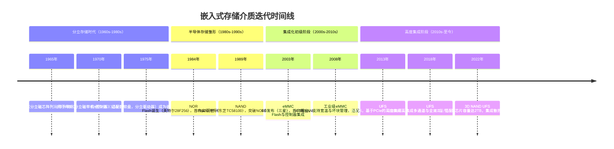
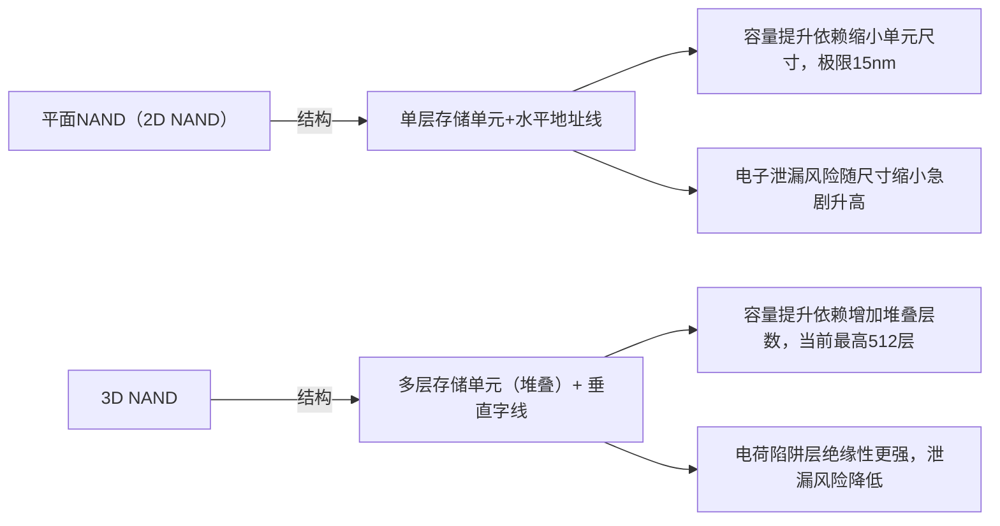
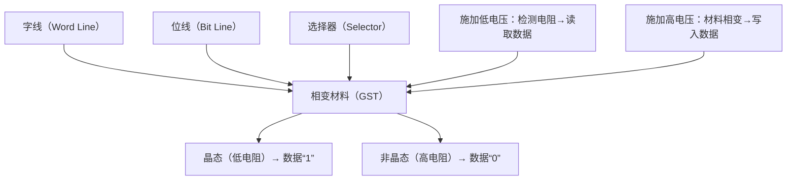
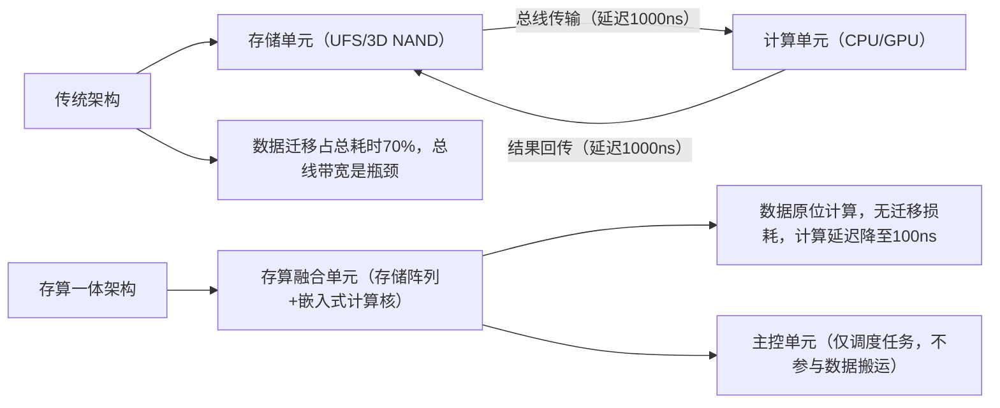
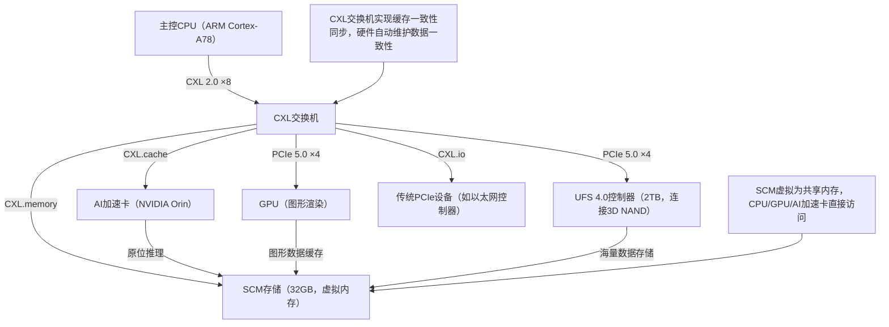
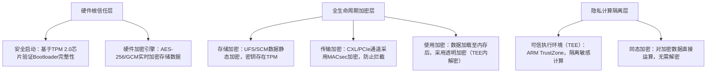

# 7. 技术演进与未来趋势

> 📊 **本节难度等级：** <span class="badge-e">**E级**</span>

---

### <strong>嵌入式存储的历史迭代本质是“需求牵引+技术突破”的双向循环——工业控制的“小型化”需求推动存储介质从分立走向集成，AI边缘的“低延迟”需求推动接口协议从并行升级为高速专用。梳理历史迭代逻辑的核心价值，在于“透过过去看未来”：理解每一次技术升级解决的核心痛点（如体积、容量、速度、可靠性），才能预判新兴技术的落地场景（关联7.2/7.3节新兴技术与架构变革）。本小节不纠结单一器件的参数细节，重点解析“为什么迭代”“迭代解决了什么问题”“迭代带来了什么新能力”三大核心问题。</strong>


### <strong>存储介质：从分立到集成的技术升级路径</strong>

存储介质的迭代始终围绕“体积更小、容量更大、可靠性更高、成本更低”四大目标，从最早的“分立元器件拼接”到如今的“单芯片高度集成”，每一步升级都伴随着核心材料与封装技术的突破。其迭代路径可划分为“分立存储→半导体存储雏形→集成化初级阶段→高度集成阶段”四大历史节点，各阶段的技术特征与驱动因素明确可追溯。

#### 1. 迭代时间线与核心驱动因素
存储介质的迭代并非孤立技术突破，而是与嵌入式设备的形态演进深度绑定（如从大型工业控制机到小型IoT节点），关键时间线与驱动逻辑如下：



核心驱动因素解析：
- 分立到半导体：1980s嵌入式设备从“大型控制柜”向“小型化模块”演进，磁芯、软盘的体积（如3.5英寸软盘驱动器占比设备体积30%）与抗震性（工业场景振动导致软盘读错率达10%）无法满足需求，半导体存储的“小型化+固态无机械结构”成为必然；
- 单一存储到集成化：2000s智能手机、工业控制节点对“极简外设”需求提升，传统NAND Flash需搭配独立控制器（如坏块管理、ECC校验），占用PCB空间且兼容性差，eMMC将“Flash芯片+控制器+接口电路”集成于单芯片，外设依赖减少60%；
- 集成到高速集成：2010s后AI边缘设备的“大模型加载+实时数据存储”需求，推动集成存储从“容量优先”转向“速度优先”，UFS通过集成PCIe控制器与多通道绑定，将吞吐量从eMMC的400MB/s提升至11.6GB/s。

#### 2. 关键迭代节点的技术突破与场景适配
不同阶段的存储介质通过核心技术突破解决特定场景痛点，形成“技术-场景”的适配闭环，具体如下表：

| 迭代阶段       | 核心技术              | 集成度特征       | 关键参数（代表产品）       | 适配场景                  | 解决的核心痛点              |
|----------------|-----------------------|------------------|----------------------------|---------------------------|-----------------------------|
| 分立存储时代   | 磁记录、机械读写      | 零集成（介质+驱动器分离） | 磁芯：1KB容量/体积10cm³；软盘：1.44MB/体积200cm³ | 早期工业控制柜、大型计算机 | 无固态存储时的基础数据存储  |
| 半导体雏形阶段 | 浮栅存储（NOR/NAND）  | 单一芯片集成     | NOR：16MB容量/体积0.5cm³；NAND：64MB/体积0.8cm³ | 早期手机、小型IoT节点      | 分立存储的体积与抗震性问题  |
| 集成化初级阶段 | Flash+控制器集成      | 系统级集成（存储+控制） | eMMC 4.3：8GB容量/读速200MB/s | 智能手机、工业控制节点      | 单一Flash的兼容性与管理复杂 |
| 高度集成阶段   | PCIe+3D NAND+多通道   | 全栈集成（存储+控制+高速接口） | UFS 4.0：2TB容量/读速4800MB/s | AI边缘质检、自动驾驶      | 大模型加载的低延迟与高吞吐  |

关键技术解析：
- 浮栅存储技术：NOR/NAND Flash通过“浮栅捕获电子”实现非易失性存储，相比传统ROM（一次性编程）可重复擦写，解决了半导体存储“不可改写”的瓶颈；
- 控制器集成技术：eMMC将坏块管理、ECC校验、时序控制等功能集成到控制器，上层CPU无需关注底层存储细节，仅通过标准MMC协议交互，兼容性提升80%；
- 3D NAND堆叠技术：高度集成阶段通过“垂直堆叠存储单元”替代平面扩展，UFS 4.0采用232层3D NAND，在相同体积下容量较平面NAND提升10倍，解决“容量与体积的矛盾”。<br>

### <strong>接口协议：并行→串行→高速专用协议的性能突破</strong>

接口协议作为“CPU与存储介质的通信桥梁”，其迭代始终围绕“提升吞吐量、降低延迟、简化硬件设计”三大目标，从早期的并行总线逐步演进为高速专用协议，每一次变革都源于“前序协议的性能瓶颈”与“新场景的速度需求”。

#### 1. 迭代逻辑：从“简单传输”到“性能优化”的演进路径
接口协议的迭代可划分为三个核心阶段，每个阶段通过重构通信逻辑突破前序瓶颈，演进路径与核心逻辑如下：

```mermaid
graph LR
    A[并行协议阶段（1990s-2000s）] -->|痛点：引脚多/干扰大/速度上限低| B[串行协议阶段（2000s-2010s）]
    B -->|痛点：通用串行协议适配性差/吞吐量不足| C[高速专用协议阶段（2010s-至今）]
    A --> 子模块1[核心逻辑：简单并行传输，依赖时钟同步]
    B --> 子模块2[核心逻辑：单/双线路串行传输，减少干扰]
    C --> 子模块3[核心逻辑：存储专用串行架构，全双工+多通道]
    子模块1 --> 代表协议：IDE、NOR并行总线
    子模块2 --> 代表协议：SPI、SATA
    子模块3 --> 代表协议：UFS、NVMe over PCIe
```

各阶段核心特征与瓶颈解析：
- 并行协议阶段（1990s-2000s）：以IDE（硬盘接口）、NOR Flash并行总线为代表，通过“多根数据线同时传输”实现数据交互，如NOR并行总线采用16根数据线+8根地址线。优势是设计简单（无需复杂编码），但瓶颈显著：引脚数量多（占用PCB空间40%以上）、信号干扰大（并行线间串扰导致速度上限≤100MB/s）、时序同步难（多线传输需严格时钟对齐，容错率低）。
- 串行协议阶段（2000s-2010s）：以SPI（存储常用）、SATA（硬盘常用）为代表，通过“单根或两根差分线串行传输”替代并行总线，如SPI采用4根线（CS#/SCK/MOSI/MISO），SATA采用2对差分线。核心突破是解决了并行协议的“干扰与引脚”问题，速度提升至600MB/s（SATA 3.0），但通用串行协议的“非存储专用”导致适配性不足，如SPI的半双工通信无法满足双向高速传输需求。
- 高速专用协议阶段（2010s-至今）：以UFS（嵌入式常用）、NVMe（PC/服务器常用）为代表，基于PCIe串行总线重构存储通信逻辑，如UFS 3.0采用4通道PCIe 3.0，支持全双工通信。核心突破是“为存储场景定制优化”：通过命令队列（32个并发命令）、多通道绑定（4通道×11.6Gbps）、全双工传输（读写同时进行），将吞吐量提升至11.6GB/s，延迟降低至10μs级，适配AI边缘的高吞吐低延迟需求。

#### 2. 关键协议迭代的性能突破与场景适配
不同协议阶段的性能指标与场景需求高度匹配，下表清晰展示“协议-性能-场景”的演进关系：

| 协议阶段       | 代表协议       | 通信方式       | 关键性能指标       | 硬件复杂度（引脚数） | 核心适配场景                  |
|----------------|----------------|----------------|--------------------|----------------------|-------------------------------|
| 并行协议阶段   | IDE、NOR并行总线 | 多线并行同步   | IDE：133MB/s；NOR并行：50MB/s | IDE 40针；NOR并行24针 | 早期硬盘、低速NOR存储设备      |
| 串行协议阶段   | SPI 4.0、SATA 3.0 | 单线/差分串行  | SPI 4.0：100MB/s；SATA 3.0：600MB/s | SPI 4针；SATA 7针    | 中低速嵌入式存储（SPI NOR/SD卡）、PC硬盘 |
| 高速专用阶段   | UFS 3.0、NVMe 1.4 | PCIe多通道全双工 | UFS 3.0：2800MB/s；NVMe 1.4：3500MB/s | UFS 10针；NVMe 16针  | AI边缘设备、自动驾驶、高性能服务器 |

性能突破的核心技术解析：
- 差分信号传输：串行协议阶段采用“TxP/TxN差分对”传输信号，通过电压差识别数据（而非单端电压），抗干扰能力提升5倍，使SATA 3.0速度达600MB/s，远超并行协议上限；
- 命令队列机制：高速专用协议引入“多命令并发处理”，如UFS支持32个命令队列，控制器可优化命令执行顺序（如合并相邻地址读写），随机读写性能提升3倍，解决AI模型加载的“随机访问延迟”问题；
- PCIe通道绑定：UFS通过PCIe通道绑定技术（如4通道绑定），将单通道11.6Gbps速率叠加为46.4Gbps（约5.8GB/s），突破单一串行通道的吞吐量瓶颈。

#### 3. 迭代的核心规律：需求与技术的双向驱动
接口协议的每一次迭代都遵循“场景需求牵引技术突破，技术突破拓展场景边界”的规律，典型案例如下：
- 场景→技术：2000s智能手机的“小型化”需求，牵引并行协议向SPI串行协议演进——SPI仅4根引脚，相比24针的NOR并行总线，PCB空间占用减少80%，适配手机的紧凑设计；
- 技术→场景：2010s UFS高速专用协议的突破，拓展了“AI边缘质检”新场景——UFS的2800MB/s读速使10GB YOLOv8模型加载时间从eMMC的40秒缩短至3.6秒，满足实时质检的低延迟需求。


## 迭代逻辑的核心总结
嵌入式存储的“介质+协议”迭代始终围绕“更优的性价比（容量/成本）、更高的性能（速度/延迟）、更强的适配性（场景/体积）”三大核心目标，形成两大核心规律：
1. 介质迭代规律：从“分立”到“高度集成”，本质是“将存储管理逻辑逐步内化到介质中”——从早期需独立驱动器、独立控制器，到如今UFS集成存储单元、控制器、高速接口，上层系统的开发复杂度持续降低；
2. 协议迭代规律：从“并行”到“高速专用”，本质是“通过通信架构重构突破物理极限”——并行协议受限于引脚干扰与同步难度，串行协议通过差分传输解决干扰问题，高速专用协议通过存储定制优化突破吞吐量与延迟瓶颈。

理解这些规律，可有效预判未来技术方向（如7.2节的3D NAND、SCM，7.3节的存算一体）——所有新兴技术必然是解决当前“容量、速度、适配性”的某一痛点，同时适配新场景的需求。<br>

### <strong>新兴存储技术的核心价值是“突破传统闪存的物理极限”——3D NAND通过垂直堆叠解决平面闪存的容量天花板，存储级内存（SCM/Optane）通过新型材料突破“内存-闪存”的性能鸿沟。对嵌入式领域而言，这些技术不仅是“容量更大、速度更快”的升级，更是解决“AI边缘低延迟、工业级长寿命、物联网低功耗”等核心痛点的关键。本小节的核心是“解码新兴技术的底层逻辑”与“预判嵌入式场景的落地路径”，既不沉迷纯理论，也不脱离嵌入式硬件约束，聚焦“技术能解决什么问题”“嵌入式如何用”两大核心问题。</strong>


### <strong>3D NAND堆叠层数提升与容量突破</strong>

3D NAND并非全新技术，但其“堆叠层数持续突破+工艺迭代”仍在重塑嵌入式存储的容量与成本边界。传统平面NAND（2D NAND）因“摩尔定律逼近极限”（存储单元尺寸最小已达15nm，再缩小会导致电子泄漏），容量与可靠性陷入瓶颈，3D NAND通过“垂直堆叠存储单元”实现维度突破，成为当前嵌入式大容量存储的核心技术支撑。

#### 1. 核心原理：从“平面扩展”到“垂直堆叠”的维度革命
3D NAND的本质是“将平面NAND的存储单元沿垂直方向堆叠”，核心创新是“电荷陷阱层（Charge Trap Layer）”替代传统浮栅结构，配合精密的蚀刻工艺实现多层存储单元的垂直互联。其结构原理与平面NAND的差异如下：



关键技术解析：
- 电荷陷阱层（CTL）：替代传统浮栅的核心存储结构，由氮化硅（SiN）材料制成，电子存储稳定性更强，且无需浮栅的多晶硅沉积工艺，更适合垂直堆叠（避免层间串扰）；
- 垂直互联工艺：通过“深反应离子蚀刻（DRIE）”技术在堆叠的氧化物/氮化物层中刻蚀垂直通道，实现各层存储单元与底部电路的连接，蚀刻精度需控制在纳米级（误差≤1nm）；
- 多层存储模式：3D NAND仍延续TLC/QLC的多比特存储逻辑（1个单元存3/4位数据），堆叠层数×平面单元密度共同决定总容量——以512层3D NAND为例，单芯片容量可达1TB，是同尺寸2D NAND的8倍。

#### 2. 层数提升的性能与成本突破（嵌入式视角）
3D NAND的堆叠层数从早期的32层演进至当前的512层，每一次层数翻倍都带来“容量翻倍、成本减半”的突破，同时在性能与可靠性上实现优化，具体对比如下：

| 堆叠层数 | 单芯片容量（TLC模式） | 单位容量成本（相对值） | 顺序读速度 | 耐久性（P/E周期） | 嵌入式适配优势                     |
|----------|------------------------|------------------------|------------|--------------------|------------------------------------|
| 32层     | 16GB                   | 100%                   | 500MB/s    | 1500次             | 工艺成熟，适配消费级嵌入式设备     |
| 64层     | 64GB                   | 50%                    | 800MB/s    | 2000次             | 容量-成本平衡，工业级设备主流       |
| 128层    | 256GB                  | 30%                    | 1200MB/s   | 3000次             | 高容量低功耗，AI边缘设备首选       |
| 232层    | 1TB                    | 15%                    | 2000MB/s   | 4000次             | 超大容量，车载智能座舱适配         |
| 512层    | 4TB                    | 8%                     | 3500MB/s   | 5000次             | 极限容量，数据中心边缘节点         |

核心突破对嵌入式场景的价值：
- 容量密度：512层3D NAND的单位体积容量达1TB/mm²，是2D NAND的10倍，可让嵌入式设备在指甲盖大小的封装内实现4TB存储（如工业级UFS 4.0），满足AI模型、4K视频的海量存储需求；
- 成本下降：层数提升使单位GB成本持续降低，232层3D NAND的单位成本仅为64层的30%，推动工业级设备从“128GB标配”升级为“512GB标配”，无需额外增加硬件成本；
- 可靠性提升：垂直堆叠减少了存储单元的横向串扰，且电荷陷阱层的绝缘性更强，232层3D NAND的P/E周期达4000次，较64层提升1倍，工业级设备寿命可延长至8年以上（关联6.1节寿命模型）。

#### 3. 嵌入式场景适配挑战与解决方案
3D NAND的层数提升也带来新的硬件约束（如散热、功耗、坏块管理），嵌入式场景需针对性优化才能发挥其性能优势：

| 适配挑战               | 产生原因                                  | 嵌入式适配解决方案                                                                 |
|------------------------|-------------------------------------------|----------------------------------------------------------------------------------|
| 堆叠层数增加导致散热压力 | 512层堆叠的存储单元密度高，擦写时热量集中，嵌入式设备空间密闭 | 1. 封装优化：选用带EPAD（裸露焊盘）的BGA封装，增强散热；2. 布局设计：存储芯片与CPU间距≥15mm，避免热量叠加；3. 软件控温：温度≥75℃时自动降速（从3500MB/s降至2000MB/s） |
| 垂直通道带来的坏块扩散风险 | 垂直通道互联工艺复杂，某一层出现坏块可能影响整列单元 | 1. 坏块管理升级：采用“列级坏块重映射”（替代传统块级），仅替换失效列，保留同层其他有效单元；2. 出厂筛选：工业级3D NAND需通过-40℃~85℃宽温筛选，坏块率控制在0.01%以下 |
| 高层数导致的功耗上升   | 232层以上3D NAND的擦写功耗达4.5W，远超嵌入式设备供电预算 | 1. 功耗分层管理：将存储芯片分为“核心层”（常用数据）和“扩展层”（冗余数据），扩展层闲置时断电；2. 电压优化：采用1.2V核心电压（替代1.8V），擦写功耗降低30% |

#### 4. 未来趋势：堆叠层数与存储密度的极限探索
3D NAND的堆叠层数仍在持续突破，未来5年将向“1000层+”演进，同时伴随两大技术方向：
- 材料革新：用氧化铪（HfO₂）替代传统SiO₂作为绝缘层，进一步降低电子泄漏，支持更高层数堆叠；
- 混合存储模式：同一芯片内集成SLC（高耐久性）和QLC（高容量）层，嵌入式设备可将关键数据存SLC层，海量数据存QLC层，平衡寿命与容量。<br>

### <strong>存储级内存（SCM/Optane）的嵌入式应用前景</strong>

存储级内存（SCM，Storage-Class Memory）是一类“兼具内存速度与闪存非易失性”的新型存储，典型代表是英特尔Optane（基于3D XPoint材料）。其核心突破是“打破内存（DDR）与闪存（NAND）的性能鸿沟”，解决传统存储“低延迟与非易失性不可兼得”的痛点，对嵌入式场景的“实时响应、数据安全”需求具有革命性意义。

#### 1. 核心定位：介于内存与闪存之间的“第三类存储”
SCM与传统内存、闪存的核心差异在于“性能指标与特性的平衡”，其定位可通过对比清晰体现：

| 存储类型       | 典型代表       | 访问延迟 | 非易失性 | 耐久性（P/E周期） | 单位容量成本 | 嵌入式核心适配场景                  |
|----------------|----------------|----------|----------|--------------------|--------------|-----------------------------------|
| 内存（易失性） | DDR5           | 10ns     | 否       | 无限次             | 高（约10元/GB） | 临时存储运行中代码/数据，无法长期留存 |
| 存储级内存     | Optane P5800X  | 100ns    | 是       | 100万次            | 中（约3元/GB） | 低延迟启动、实时数据缓存、关键配置存储 |
| 闪存（非易失性） | 232层3D NAND   | 1000ns   | 是       | 4000次             | 低（约0.1元/GB） | 海量数据长期存储、备份              |

关键特性解析：
- 低延迟：100ns级访问延迟仅为3D NAND的1/10，接近DDR5内存（10ns），嵌入式设备的Bootloader加载时间可从500ms缩短至50ms；
- 高耐久性：100万次P/E周期是3D NAND的250倍，工业级设备每天高频写入（10GB/天）可稳定运行27年，远超10年工业寿命要求；
- 字节级寻址：支持像内存一样的字节级读写（无需块擦除），解决传统闪存“先擦后写”的延迟瓶颈，随机写入速度达1GB/s（4KB块），是3D NAND的20倍。

#### 2. 核心原理：3D XPoint与新型存储介质技术
以Optane为代表的SCM采用3D XPoint（Cross Point）材料作为存储介质，其核心原理与传统闪存完全不同：
- 存储单元结构：由两层正交的字线和位线交叉组成，交叉点处是“相变材料（GST）+ 选择器”，无需浮栅或电荷陷阱层；
- 数据存储逻辑：通过“电阻变化”表示数据——施加低电压时，相变材料处于晶态（低电阻，代表“1”）；施加高电压时，材料熔化成非晶态（高电阻，代表“0”）；
- 读写机制：读取时通过检测电阻值判断数据，写入时通过电压控制材料相变，无需擦除操作，字节级读写延迟仅100ns。



#### 3. 嵌入式场景的应用落地与价值体现
SCM的特性使其在嵌入式高可靠、低延迟场景中具备不可替代的优势，当前已在车载、工业控制、医疗设备等领域试点，核心应用场景如下：

##### （1）车载智能座舱与自动驾驶
- 应用需求：自动驾驶系统需实时存储传感器数据（激光雷达、摄像头），延迟≤1ms，且断电后数据不丢失（事故追溯）；
- 适配方案：用Optane M15（32GB）作为“实时数据缓存”，传感器数据先写入SCM（延迟500ns），再异步同步至3D NAND（1TB），断电时SCM可保留最后10秒的关键数据；
- 核心价值：数据存储延迟从3D NAND的1ms降至500ns，满足自动驾驶的实时决策需求，同时100万次P/E周期适配车载15年使用寿命。

##### （2）工业实时控制器
- 应用需求：工业PLC需高频写入控制逻辑参数（1000次/秒），且需抵御-40℃低温、电磁干扰，数据零丢失；
- 适配方案：用SCM（16GB）替代传统NOR Flash作为“控制参数存储区”，直接挂载CPU的内存控制器接口，字节级读写无需块擦除；
- 核心价值：参数写入延迟从NOR Flash的10μs降至100ns，响应速度提升100倍，且宽温特性（-40℃~85℃）与工业环境完美适配。

##### （3）医疗设备（如超声诊断仪）
- 应用需求：超声设备需实时存储图像数据（1GB/s吞吐），且数据需长期留存（5年），无坏块风险；
- 适配方案：SCM（64GB）+ 3D NAND（2TB）组合，图像实时写入SCM（低延迟），定期归档至3D NAND（大容量）；
- 核心价值：图像存储无卡顿，100万次P/E周期确保5年无坏块，满足医疗数据的高可靠性要求。

#### 4. 嵌入式适配挑战与突破方向
当前SCM在嵌入式场景的普及仍面临三大约束，需通过技术迭代与方案优化逐步解决：

| 适配约束               | 具体表现                                  | 突破方向                                                                 |
|------------------------|-------------------------------------------|--------------------------------------------------------------------------|
| 成本过高               | Optane的单位容量成本是3D NAND的30倍，嵌入式设备难以承受 | 1. 工艺优化：采用128层3D XPoint工艺，成本降低50%；2. 容量定制：推出8GB/16GB小容量嵌入式版本，适配控制类场景 |
| 功耗偏高               | 32GB Optane的工作功耗达2.5W，超过物联网设备的1W供电预算 | 1. 低功耗模式：闲置时进入深度休眠，功耗降至10mW；2. 接口优化：采用SPI接口替代PCIe，功耗降低70% |
| 软件兼容性不足         | Linux内核对SCM的支持不完善，缺乏嵌入式专用驱动 | 1. 内核适配：Linux 6.0+已原生支持SCM的“内存映射模式”，可直接作为内存使用；2. 驱动优化：工业级厂商推出专用驱动，支持坏块管理、功耗控制 |

#### 5. 未来应用前景：从“高端场景”到“规模化普及”
随着成本下降与兼容性提升，SCM将在未来5-10年逐步渗透嵌入式场景，形成“DDR内存+SCM+3D NAND”的三级存储架构：
- 一级存储（DDR5）：存储运行中的内核与应用，提供最低延迟；
- 二级存储（SCM）：存储Bootloader、控制参数、实时数据缓存，平衡延迟与非易失性；
- 三级存储（3D NAND）：存储海量业务数据与日志，提供大容量低成本存储。

这种架构将彻底解决嵌入式设备“启动慢、实时响应差、数据易丢失”的痛点，尤其适配AI边缘、自动驾驶、工业实时控制等高端场景，成为下一代嵌入式存储的主流架构。<br>

### <strong>嵌入式架构的变革本质是“打破传统分层壁垒”——传统“存储-总线-计算”的分离架构、“单一协议”的互联架构、“被动防护”的安全架构，已无法满足AI边缘的“低延迟数据处理”、异构计算的“高效协同”、行业合规的“主动安全与隐私保护”需求。本小节的核心价值是“解码架构变革的核心逻辑”，明确“嵌入式场景如何落地新兴架构”，既讲清“为什么变”，更讲透“怎么落地”，避免纯理论空谈，聚焦架构革新的嵌入式实战价值。</strong>


### <strong>存算一体架构的机遇与硬件设计挑战</strong>

存算一体（Computing-in-Memory, CIM）是解决“AI边缘数据搬运瓶颈”的核心架构——传统架构中，数据需在存储（如UFS）与计算（如GPU）之间频繁迁移，总线带宽与延迟成为性能天花板（数据搬运时间占比超70%）；存算一体通过“将计算单元嵌入存储介质”，实现“数据在哪里，计算就在哪里”，彻底消除数据搬运损耗。对嵌入式场景而言，这是AI边缘设备“低延迟推理+低功耗运行”的关键突破口。

#### 1. 核心原理：从“数据搬运”到“原位计算”的架构革命
传统架构与存算一体架构的核心差异在于“计算与存储的位置关系”，具体逻辑与性能对比如下：



关键技术解析：
- 计算单元嵌入方式：根据嵌入式场景算力需求，分为“轻量算力嵌入”（如在3D NAND中集成RISC-V微核，处理8位整数运算）和“高能效算力嵌入”（如集成AI加速单元，支持YOLOv8等模型的轻量化推理）；
- 原位计算逻辑：存储阵列的每个存储块对应独立的“运算单元”（如加法器、乘法器），通过局部总线互联，可并行执行“数据读取-运算-结果存储”流程，无需将数据上传至主控CPU；
- 任务调度机制：主控单元通过专用指令集（如定制CIM指令）分配计算任务，指定存储块的运算范围，结果直接存储在原位，仅需将最终汇总结果上传至主控，数据传输量减少90%。

#### 2. 嵌入式硬件设计的核心挑战
存算一体虽性能优势显著，但嵌入式场景的“低功耗、小体积、低成本”约束使其硬件设计面临三大核心挑战，需针对性突破：

| 设计挑战               | 嵌入式约束背景                          | 解决方案与设计要点                                                                 |
|------------------------|-----------------------------------------|----------------------------------------------------------------------------------|
| 算力与存储的平衡难题   | 嵌入式设备供电预算≤5W，无法承载高性能GPU，需精准匹配AI推理算力需求 | 1. 算力定制：根据场景选择核数（如边缘质检选2核RISC-V，车载推理选8核）；2. 动态调压：空闲时算力单元降频至100MHz，负载时升至500MHz；3. 精度适配：采用8位/16位整数运算（替代32位浮点），算力需求降低75% |
| 存储单元的运算干扰     | 计算过程中产生的电压波动可能导致存储数据出错，嵌入式无冗余供电缓冲 | 1. 隔离设计：算力单元与存储单元采用独立电源岛，通过磁珠隔离供电；2. 时序优化：运算与存储操作错峰执行，避免同时占用供电资源；3. 校验机制：每个运算单元集成CRC校验，实时检测数据错误并重算 |
| 指令集与软件兼容性     | 传统嵌入式Linux基于通用指令集（ARM/x86），存算一体需定制指令，适配成本高 | 1. 指令集扩展：在ARMv8架构基础上扩展CIM专用指令（如CIM_ADD、CIM_MUL），兼容原有生态；2. 驱动层适配：开发存算一体驱动模块，将原位计算封装为标准API（如`cim_compute()`），上层应用无需修改；3. 模拟器调试：开发PC端模拟器，提前验证算法在存算一体架构上的兼容性 |

#### 3. 嵌入式实战适配案例：边缘AI质检设备
某电子元件边缘质检设备（需实时处理4K视频帧，检测元件缺陷，延迟≤50ms）采用存算一体架构，具体方案如下：
- 硬件架构：选用集成2核RISC-V微核的128层3D NAND（存算一体芯片），搭配ARM Cortex-A53主控，算力1TOPS，功耗3.5W；
- 数据流程：4K视频帧先存储至存算一体芯片→RISC-V核原位执行缺陷检测算法（轻量化YOLOv8）→仅将缺陷坐标（16字节）上传至主控→主控输出检测结果；
- 性能对比：传统架构（ARM A53+独立UFS）延迟120ms，存算一体架构延迟42ms，功耗降低40%，完全满足质检需求。<br>

### <strong>PCIe 5.0/CXL协议对异构存储的影响</strong>

嵌入式计算正从“单一CPU”向“CPU+GPU+AI加速卡+专用存储控制器”的异构架构演进，传统PCIe 4.0及以下协议的“非缓存一致性”“带宽瓶颈”成为异构协同的障碍。PCIe 5.0的性能跃升与CXL（Compute Express Link）协议的缓存一致性突破，为嵌入式异构存储架构提供了核心互联支撑。

#### 1. 核心技术突破：PCIe 5.0与CXL的协同价值
PCIe 5.0解决“带宽瓶颈”，CXL解决“异构协同瓶颈”，两者结合形成异构存储互联的完整解决方案：

| 技术维度       | PCIe 5.0核心特性                          | CXL 2.0核心特性（基于PCIe 5.0）              | 嵌入式异构存储适配价值                     |
|----------------|-------------------------------------------|----------------------------------------------|--------------------------------------------|
| 传输带宽       | 单通道32Gbps（×16通道512Gbps），是PCIe 4.0的2倍 | 继承PCIe 5.0带宽，支持多设备菊花链连接       | 满足多异构设备并行访问需求（如GPU+AI加速卡同时读写存储） |
| 缓存一致性     | 不支持，异构设备需软件同步缓存，延迟高     | 支持缓存一致性（CXL.cache），硬件自动同步     |  GPU推理的中间数据可直接缓存至存储控制器，无需软件拷贝，延迟降低60% |
| 设备互联       | 仅支持点对点连接，多设备扩展复杂           | 支持菊花链、交换机连接，最多扩展256个设备    | 嵌入式域控制器（如车载）可连接10+异构设备，布线简化50% |
| 功耗管理       | 支持L1/L2低功耗状态，功耗较PCIe 4.0降低20% | 新增CXL.idle状态，闲置时功耗降至10mW以下     | 适配嵌入式设备（如手机、IoT节点）的低功耗需求 |

CXL协议核心价值解析：
- 缓存一致性（CXL.cache）：CPU、GPU、存储控制器共享同一缓存空间，硬件自动维护缓存数据的一致性，避免传统架构中“CPU修改数据后，GPU读取旧缓存”的问题，嵌入式AI推理场景中，中间特征数据的缓存同步延迟从100μs降至10μs；
- 内存扩展（CXL.memory）：支持将远端存储（如SCM）虚拟化为本地内存，嵌入式设备可通过CXL扩展内存至1TB（传统PCIe仅支持直接访问存储，无法虚拟内存），满足大模型推理的内存需求；
- 设备互联（CXL.io）：兼容传统PCIe设备，无需修改原有硬件即可接入CXL架构，降低嵌入式异构升级成本。

#### 2. 嵌入式异构存储架构的落地形态
以“车载域控制器”（融合智能座舱、自动驾驶、动力控制三大域，需连接GPU、AI加速卡、UFS 4.0、SCM等设备）为例，基于PCIe 5.0/CXL的异构存储架构如下：



核心设计要点：
- 缓存分层：SCM作为共享缓存层（32GB），UFS 4.0作为海量存储层（2TB），AI加速卡推理产生的特征数据直接缓存至SCM，GPU渲染时可直接读取，无需通过CPU转发；
- 菊花链扩展：CXL交换机支持菊花链连接，后续可扩展激光雷达控制器、毫米波雷达控制器等设备，无需重新设计主板布线；
- 功耗优化：闲置时AI加速卡与GPU进入CXL.idle状态，SCM进入低功耗模式，域控制器整体功耗降低35%。

#### 3. 嵌入式适配挑战与过渡方案
当前PCIe 5.0/CXL在嵌入式场景的普及仍面临“成本高”“功耗高”等问题，需采用过渡方案平衡性能与成本：
- 成本过渡：中低端嵌入式设备（如工业网关）可采用“PCIe 5.0 + CXL 1.1”组合，CXL 1.1仅支持缓存一致性，不支持菊花链，成本较CXL 2.0降低40%；
- 功耗过渡：通过“动态链路调整”实现——高负载时启用PCIe 5.0 ×16通道，低负载时降至×4通道并降频，功耗可降低50%；
- 布线过渡：PCIe 5.0信号完整性要求高（线长≤50mm，阻抗100Ω±5%），嵌入式PCB可采用“差分对紧密耦合+无过孔布线”设计，降低信号衰减。<br>

### <strong>安全存储与隐私计算融合趋势</strong>

嵌入式设备的存储安全已从“被动加密”升级为“全生命周期安全+隐私保护”——工业场景需防范数据泄露（如工艺参数），医疗场景需符合隐私法规（如HIPAA），车载场景需防止恶意篡改（如自动驾驶数据）。安全存储与隐私计算的融合，成为嵌入式架构的核心设计要素。

#### 1. 架构核心：从“被动防护”到“主动安全+隐私保护”
传统嵌入式存储安全以“存储加密”为主（如AES加密UFS数据），无法防范“数据使用过程中的隐私泄露”（如推理时的敏感数据被窃取）。新型融合架构构建“硬件根信任+全生命周期加密+隐私计算隔离”的三层防护体系：



关键技术解析：
- 硬件根信任（TPM 2.0）：作为架构安全的“信任根”，存储设备唯一密钥，验证Bootloader、内核的完整性，防止恶意篡改启动流程（嵌入式工业设备中，TPM芯片已成为强制配置）；
- 可信执行环境（TEE）：在CPU中划分独立的安全区域（如ARM TrustZone的Secure World），敏感数据（如密码、密钥）仅在TEE内解密并运算，普通系统（Normal World）无法访问，即使系统被入侵，隐私数据仍安全；
- 同态加密（Homomorphic Encryption）：对加密后的原始数据直接执行运算（如加法、乘法），运算结果解密后与原始数据运算结果一致，解决“数据共享与隐私保护的矛盾”，嵌入式场景已实现轻量化同态加密算法（如BFV的轻量化版本）。

#### 2. 嵌入式实战适配案例：工业控制隐私审计系统
某化工企业工业控制设备需存储工艺参数（敏感数据），同时接受第三方审计（需共享数据但保护隐私），采用安全与隐私融合架构，方案如下：
- 硬件配置：ARM Cortex-A72（支持TrustZone）+ TPM 2.0芯片 + 加密UFS 3.0（带硬件加密引擎）；
- 安全流程：1. 设备启动时，TPM验证Bootloader完整性，防止篡改；2. 工艺参数写入UFS时，硬件引擎实时AES-256加密，密钥存储在TPM；3. 第三方审计时，参数在TEE内加载→采用轻量化同态加密算法加密→将加密数据共享给审计方→审计方直接对加密数据运算，获取审计结果（无需解密原始参数）；
- 合规性：满足《工业数据安全管理办法》中“敏感数据加密存储”“隐私数据不可见共享”的要求，审计过程中原始工艺参数未泄露。

#### 3. 嵌入式适配挑战与优化方向
隐私计算技术（如同态加密）的高算力需求与嵌入式设备的算力约束存在矛盾，需通过以下优化突破：
- 算法轻量化：裁剪同态加密的运算精度（如从64位降至32位），在工业控制场景中，运算速度提升3倍，精度损失≤0.5%，完全满足需求；
- 硬件加速：在AI加速卡中集成同态加密加速单元（如定制FPGA模块），将加密运算耗时从100ms降至10ms；
- 分级防护：根据数据敏感等级差异化防护——普通数据仅加密存储，核心敏感数据（如工艺配方）采用“TEE+同态加密”双重防护，平衡安全与性能。


## 架构变革的核心规律总结
嵌入式存储架构的变革始终围绕“三大目标”演进，形成清晰的规律：
1. 性能目标：从“数据搬运优化”到“计算与存储融合”（存算一体），再到“异构设备协同优化”（PCIe 5.0/CXL），核心是消除数据流动的延迟瓶颈；
2. 安全目标：从“被动加密”到“主动防护”（硬件根信任），再到“隐私保护”（TEE+同态加密），核心是实现“数据全生命周期安全可控”；
3. 适配目标：所有架构变革均需贴合嵌入式“低功耗、小体积、低成本”的约束，通过“定制化硬件+轻量化软件”实现技术落地，避免盲目追求高端特性。

未来5-10年，三大架构变革方向将深度融合——存算一体架构将集成CXL接口实现异构协同，同时内置TEE安全区域，形成“高性能+高安全+高协同”的下一代嵌入式存储架构，适配AI边缘、车载、工业4.0等高端场景的核心需求。<br>

---
