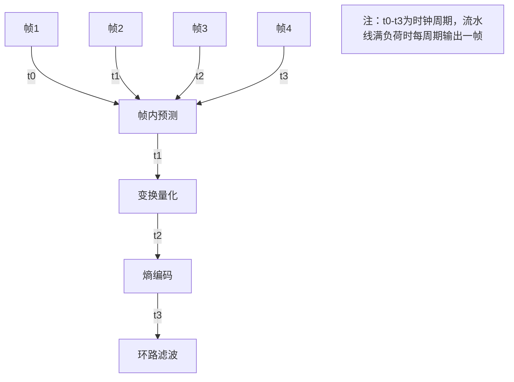

# 硬件加速器原理解析

> 📊 **本节难度等级：** <span class="badge-ie">**IE级**</span>

---

### <strong>硬件加速器的“高效性”并非凭空而来，而是源于其针对特定任务优化的硬件架构。无论是NPU、VPU还是DSP，尽管应用场景不同，但其核心架构遵循“**专用组件+高效协作**”的设计逻辑——用最少的硬件资源完成最多的目标计算。下面从“硬件核心组件”“工作模式”“与系统交互机制”三个维度解析其原理。</strong>


### <strong>硬件核心组件：从计算到数据的“专用链条”</strong>

任何硬件加速器的核心目标都是“高效处理特定计算任务”，因此其硬件组件必然围绕“计算单元”“数据存储”“数据传输”三个核心环节设计，且每个环节都高度适配目标任务的特性。  

#### 1. 运算单元阵列：计算能力的“发动机”  
运算单元是加速器的“算力源头”，其设计直接决定了加速器的核心能力。与CPU的通用运算单元（支持加减乘除、逻辑运算等）不同，加速器的运算单元是“专用定制”的——只保留目标任务最需要的计算逻辑，剔除无关功能以提高效率。  

- **NPU的MAC阵列**：神经网络推理的核心计算是“矩阵乘法”（如卷积层中输入特征与权重的乘积），而矩阵乘法可拆解为大量“乘法-累加”（Multiply-Accumulate, MAC）操作。因此NPU的运算单元是由数百至数千个MAC单元组成的阵列（如RK3588的NPU包含1024个MAC单元），这些单元可并行执行不同位置的MAC运算，例如一次完成“(a1*b1 + a2*b2 + ... + a16*b16)”的16路并行计算，效率是CPU通用单元的16倍以上。  

- **VPU的专用编码单元**：视频编码的核心步骤包括“运动估计”（寻找帧间相似区域）、“变换量化”（压缩像素数据）、“熵编码”（进一步压缩为二进制流）。VPU会为每个步骤设计专用运算单元：运动估计单元内置SAD（绝对差之和）计算器，专门比较像素块相似度；变换量化单元则固化DCT（离散余弦变换）电路，直接输出量化后的系数。  

- **DSP的乘加器与移位器**：数字信号处理（如滤波、傅里叶变换）中，“定点乘法+移位”是高频操作（例如IIR滤波器的递推计算）。DSP的运算单元会优化这类操作，支持单周期完成“(A*B)>>C”（乘法后右移），而CPU可能需要3-5个周期（乘法、移位、存储结果）。  

**核心特点**：运算单元阵列的“并行度”与“专用性”是加速器效率的基础——并行度决定“一次能算多少”，专用性决定“每次计算的硬件开销有多小”。  


#### 2. 专用寄存器：数据暂存的“高速站台”  
运算单元的高效计算依赖“快速数据供给”——如果数据需要从内存中读取（延迟通常为几十至几百个时钟周期），会严重拖慢运算速度。因此加速器会集成大量专用寄存器，作为运算单元与内存之间的“高速缓冲站”。  

- **配置寄存器**：存储加速器的工作参数（如NPU的推理精度（INT8/FP16）、VPU的编码帧率），CPU通过写入这些寄存器控制加速器的行为。例如，向VPU的“编码模式寄存器”写入0x01表示启用H.265，写入0x02表示启用H.264。  

- **数据输入/输出寄存器**：暂存待计算的数据（输入）和计算结果（输出）。例如，DSP处理音频信号时，输入寄存器会缓存最近16个采样点（滤波器的输入序列），运算单元计算完成后，结果直接写入输出寄存器，避免频繁访问内存。  

- **状态寄存器**：记录加速器的运行状态（如“忙”“空闲”“错误”）。CPU通过读取状态寄存器判断任务是否完成（如状态寄存器的bit0为1表示计算完成）。  

**与CPU缓存的区别**：CPU缓存是“通用缓存”（自动缓存任意内存数据），而加速器的专用寄存器是“定向缓存”——只存储与当前任务相关的数据，且由硬件或驱动程序显式控制（而非自动缓存），因此更节省硬件资源，延迟也更低（通常1-2个时钟周期即可访问）。  


#### 3. 数据通路：连接计算与存储的“专用车道”  
数据在加速器内部的传输路径（数据通路）直接影响效率——如果数据传输速度跟不上运算单元的计算速度，运算单元会频繁“等待数据”（称为“数据饥饿”），导致算力浪费。加速器的数据通路设计有两个核心优化：  

- **DMA直连内存**：大多数加速器会集成DMA（直接内存访问）控制器，允许数据从内存直接传输到加速器的输入寄存器（或从输出寄存器直接写入内存），无需CPU干预。例如，NPU推理时，输入图像数据通过DMA从内存传入输入寄存器，推理完成后，结果通过DMA直接写回内存，CPU只需在开始时配置DMA参数，全程不参与数据搬运，大幅降低CPU负载。  

- **内部数据环**：对于运算单元阵列（如NPU的MAC阵列），数据在阵列内部的传输会采用“环形总线”或“交叉开关”设计，避免数据拥堵。例如，某NPU的MAC阵列按4x4网格排列，每个MAC单元可直接向上下左右的单元传输数据（无需经过全局总线），适合矩阵乘法中“数据逐行传递”的需求。  

- **缓存交互机制**：部分高性能加速器（如GPU）会与CPU共享缓存（如L3缓存），当数据已在缓存中时，可直接从缓存读取（延迟比访问内存低10倍以上）。例如，ARM Mali GPU支持“缓存一致性”，CPU写入缓存的图像数据，GPU可直接读取，无需先刷回内存。<br>

### <strong>工作模式：让算力“跑起来”的协同逻辑</strong>

硬件加速器的高效不仅依赖硬件组件，更依赖这些组件的协同方式（工作模式）。针对不同任务的特性，加速器会采用“并行计算”“流水线处理”“任务队列”等模式，最大化利用率。  

#### 1. 并行计算架构：同时处理多个数据的“分身术”  
嵌入式场景的计算密集型任务（如AI推理、视频编码）往往具有“数据独立性”——同一操作需要重复应用于大量独立数据（如对图像中每个像素做相同的滤波）。并行计算架构正是为这类任务设计的，核心是“单指令多数据”（Single Instruction Multiple Data, SIMD）或“单指令多线程”（Single Instruction Multiple Threads, SIMT）。  

- **SIMD模式**：一条指令同时操作多个数据。例如，NPU的MAC阵列在执行“矩阵乘法”时，控制器会向所有MAC单元发送相同的“乘法-累加”指令，但每个单元处理不同位置的数据（如MAC1处理(a1*b1)，MAC2处理(a2*b2)），一次指令完成16组数据的计算（16路SIMD）。这种模式适合数据高度规整的任务（如矩阵运算），硬件控制逻辑简单。  

- **SIMT模式**：一条指令驱动多个线程（每个线程处理一个数据），线程可独立分支（但通常不建议，否则会降低效率）。GPU是SIMT的典型代表——例如Mali-G52有4个Shader核心，每个核心可同时运行32个线程，一条“像素着色”指令会被32个线程执行（每个线程处理一个像素），若某像素需要特殊处理（如分支），其他线程会等待，因此适合分支较少的图形渲染任务。  

**并行度的权衡**：并行度并非越高越好——过高的并行度会增加硬件复杂度和功耗。嵌入式加速器的并行度通常在8-256路（如NPU的128路SIMD），远低于服务器级加速器（如GPU的1024路以上），这是“性能-功耗”平衡的结果。  


#### 2. 流水线处理：分阶段协作的“生产车间”  
对于“步骤固定且可拆分”的任务（如视频编码、数据加密），加速器会采用流水线模式——将任务拆分为多个阶段，每个阶段由专用硬件处理，数据在各阶段间流水传递，实现“多组数据并行处理”。  

以VPU的H.265编码为例，任务被拆分为4个阶段：  
1. **帧内预测**：根据相邻像素预测当前块的像素值（减少冗余）；  
2. **变换量化**：将预测残差（实际值-预测值）转换为频域并量化（压缩数据）；  
3. **熵编码**：将量化后的数据转换为变长二进制码（进一步压缩）；  
4. **环路滤波**：消除块效应（让编码后的图像更平滑）。  

VPU会为每个阶段设计专用硬件单元，当第一帧数据进入“熵编码”阶段时，第二帧数据可进入“变换量化”阶段，第三帧数据进入“帧内预测”阶段（如图1所示）。理想情况下，流水线满负荷时，每个时钟周期都有一帧数据完成编码，吞吐量是单阶段处理的4倍。  


*图1：VPU编码流水线示意图*  

**流水线的挑战**：若某阶段处理时间过长（如复杂图像的帧内预测耗时是其他阶段的2倍），会成为“瓶颈”，导致后续阶段等待。因此嵌入式加速器的流水线设计会通过“硬件复制”（如复制2个帧内预测单元）平衡各阶段速度。  


#### 3. 算力调度逻辑：任务队列与优先级的“交通管制”  
当加速器需要处理多个任务（如同时处理两路摄像头的视频编码）时，需要通过“任务队列”和“优先级机制”避免冲突，确保高效调度。  

- **任务队列**：加速器内部会维护一个FIFO（先进先出）队列，CPU提交的任务（如“编码帧1”“编码帧2”）会先进入队列，加速器完成当前任务后自动从队列中取下一个任务执行。例如，工业相机的VPU支持8个任务队列，可同时缓存8路不同分辨率的视频编码任务，无需CPU频繁干预。  

- **优先级机制**：对于实时性要求不同的任务，队列支持优先级设置。例如，车载DVR中，“前视摄像头视频”（关系行车安全）的编码任务优先级高于“车内摄像头视频”，当队列拥堵时，加速器会优先处理高优先级任务，避免关键任务延迟。  

- **上下文切换**：当切换不同类型的任务时（如从“编码H.265”切换到“编码H.264”），加速器需要保存当前任务的配置参数（如量化参数、分辨率），加载新任务的参数，这个过程称为“上下文切换”。嵌入式加速器会优化切换速度（通常<100个时钟周期），避免频繁切换导致效率下降。<br>

### <strong>与系统交互机制：加速器如何“融入”嵌入式系统</strong>

硬件加速器无法独立工作，必须与CPU、内存、总线等系统组件协同，其交互机制的核心是“**低延迟通信+最小化CPU干预**”。  

#### 1. 总线接口：连接系统的“高速公路”  
加速器通过总线与CPU、内存连接，总线类型决定了数据传输速度和兼容性：  

- **AXI总线**：嵌入式SoC（片上系统）中最常用的总线（如ARM架构的芯片），支持32/64/128位数据宽度，最高速率可达10GB/s（128位@500MHz）。由于加速器通常与CPU集成在同一SoC内（如RK3588的NPU与Cortex-A76同片），AXI总线的“片内互联”特性可降低延迟（通常<10ns），适合中小数据量传输（如NPU的模型参数、VPU的配置指令）。  

- **PCIe总线**：用于外接加速器（如通过M.2接口连接的AI加速卡），支持更高带宽（PCIe 3.0 x4可达8GB/s），但延迟较高（通常>100ns），适合需要扩展算力的场景（如边缘服务器外接GPU加速卡）。  

- **专用硬件接口**：部分高性能加速器会采用定制接口（如NVIDIA的NVLink），但嵌入式场景极少使用（成本过高）。  


#### 2. 指令下发与数据传输：CPU与加速器的“对话方式”  
CPU与加速器的交互分为“指令交互”和“数据交互”两类，前者控制加速器的行为，后者传递计算所需的数据。  

- **指令下发**：CPU通过“内存映射IO”（Memory-Mapped IO, MMIO）访问加速器的寄存器（将寄存器地址映射到CPU的地址空间），向配置寄存器写入指令（如“启动推理”“设置编码分辨率”）。例如，CPU向NPU的“控制寄存器”写入0x01，触发NPU开始执行当前任务。  

- **数据传输**：计算所需的输入数据（如待推理的图像、待编码的视频帧）通常存储在内存中，加速器通过DMA读取内存数据；计算结果（如推理结果、编码后的码流）也通过DMA写回内存。CPU只需在任务开始时配置DMA的“源地址”“目的地址”“数据长度”，后续数据传输完全由硬件完成，大幅减少CPU的干预。  

**示例流程**：NPU处理一张图像的交互步骤  
1. CPU将图像数据从摄像头缓冲区复制到内存（地址0x80000000）；  
2. CPU通过MMIO向NPU的“输入地址寄存器”写入0x80000000，向“输出地址寄存器”写入0x80100000（推理结果存储地址）；  
3. CPU向NPU的“控制寄存器”写入0x01（启动任务）；  
4. NPU通过DMA读取0x80000000处的图像数据，执行推理；  
5. 推理完成后，NPU通过DMA将结果写入0x80100000，并触发中断通知CPU；  
6. CPU响应中断，读取0x80100000处的结果。  


### 小结：核心架构的“共性逻辑”  
尽管不同类型的加速器（NPU/VPU/DSP）在细节上差异很大，但其核心架构遵循三个共性原则：  
1. **专用化**：运算单元、寄存器、数据通路都针对目标任务优化，剔除无关功能；  
2. **并行化**：通过运算单元阵列、流水线、任务队列提高算力利用率；  
3. **低耦合**：与CPU的交互通过总线和DMA实现，最小化CPU干预，让双方专注于各自擅长的工作。  

理解这些原则，就能从本质上把握“为什么硬件加速器比CPU高效”——它不是简单地“跑得更快”，而是通过架构设计让“每一分硬件资源都用在刀刃上”。<br>

### <strong>硬件加速器的高效发挥，离不开Linux内核的“桥梁作用”——内核需要将硬件资源（如运算单元、内存、中断）抽象为软件接口，同时协调加速器与CPU、内存的协同（如避免资源冲突、保证数据一致性）。对于嵌入式场景，这种适配需兼顾“效率”（低延迟、高吞吐量）与“可靠性”（稳定调度、故障处理），核心机制围绕“驱动框架”“算力调度”“中断同步”三大维度展开。</strong>


### <strong>加速器驱动框架：内核与硬件的“翻译官”</strong>

Linux内核通过“驱动程序”实现对加速器的控制，驱动的核心作用是“将硬件特性转化为内核可识别的抽象接口”。根据加速器类型的不同，驱动可采用“通用框架”或“专用子系统”两种模式，前者适用于各类加速器，后者针对特定场景（如多媒体、加密）优化。  


#### 1. platform_driver通用框架：普适性加速器适配  
绝大多数嵌入式加速器（如NPU、DSP）集成在SoC内部，与CPU通过片内总线（如AXI）连接，这类设备适合用`platform_driver`框架（Linux设备模型的核心）适配。其核心是“设备-驱动匹配”——设备树中定义加速器的硬件属性（地址、中断、时钟），驱动通过`of_match_table`匹配设备，实现硬件初始化与控制。  

**核心步骤与代码片段**：  
- **设备树定义**：描述加速器的物理属性（寄存器地址、中断号、所需内存等）  
  ```dts
  npu: npu@fe800000 {
      compatible = "rockchip,rk3588-npu";  // 与驱动匹配的兼容属性
      reg = <0x0 0xfe800000 0x0 0x100000>;  // 寄存器地址范围
      interrupts = <GIC_SPI 120 IRQ_TYPE_LEVEL_HIGH>;  // 中断号与触发方式
      clocks = <&cru CLK_NPU>;  // 时钟源
      power-domains = <&power RK3588_PD_NPU>;  // 电源域
      memory-region = <&npu_cma>;  // 预留的CMA内存（见后续“算力调度”）
  };
  ```  

- **驱动初始化**：通过`platform_driver_register`注册驱动，实现`probe`（初始化硬件）、`remove`（释放资源）等回调  
  ```c
  static const struct of_device_id npu_of_match[] = {
      { .compatible = "rockchip,rk3588-npu" },  // 与设备树compatible匹配
      { }
  };
  MODULE_DEVICE_TABLE(of, npu_of_match);

  static struct platform_driver npu_driver = {
      .probe = npu_probe,        // 设备匹配成功后执行
      .remove = npu_remove,      // 设备移除时执行
      .driver = {
          .name = "rk3588-npu",
          .of_match_table = npu_of_match,  // 绑定设备树匹配表
      },
  };
  module_platform_driver(npu_driver);
  ```  

- **硬件初始化（probe函数）**：映射寄存器、使能时钟/电源、初始化DMA与中断  
  ```c
  static int npu_probe(struct platform_device *pdev) {
      struct device *dev = &pdev->dev;
      struct npu_dev *npu;
      int ret;

      // 1. 分配设备私有数据结构
      npu = devm_kzalloc(dev, sizeof(*npu), GFP_KERNEL);
      // 2. 映射寄存器地址（将物理地址转为内核虚拟地址）
      npu->base = devm_platform_ioremap_resource(pdev, 0);
      // 3. 使能时钟与电源
      npu->clk = devm_clk_get(dev, NULL);
      clk_prepare_enable(npu->clk);
      // 4. 申请中断（绑定中断处理函数）
      ret = devm_request_irq(dev, irq_of_parse_and_map(pdev->dev.of_node, 0),
                            npu_irq_handler, 0, "npu", npu);
      // 5. 初始化DMA引擎（后续数据传输用）
      npu->dma_chan = dma_request_chan(dev, "tx");
      // 6. 注册字符设备（提供用户态接口，见后续“用户态调用”）
      npu->cdev = ...;  // 字符设备注册逻辑
      return 0;
  }
  ```  

**适用场景**：NPU、DSP等通用计算加速器，无专用内核子系统适配时，`platform_driver`是最灵活的选择。  


#### 2. 专用子系统适配：多媒体与加密加速器的“快车道”  
对于视频编解码（VPU）、图形渲染（GPU）、加密（Crypto）等标准化场景，Linux内核已提供专用子系统（如V4L2、DRM、Crypto API），这些子系统预定义了统一的硬件抽象接口，驱动只需实现子系统要求的回调，无需从零构建用户态接口，大幅降低适配成本。  


- **V4L2子系统（VPU适配）**：视频编解码加速器（VPU）需遵循Video for Linux 2（V4L2）标准，该子系统将VPU抽象为“视频设备”（/dev/videoX），提供统一的“流IO”接口（如`VIDIOC_STREAMON`启动编码、`read`获取码流）。  
  驱动需实现`v4l2_file_operations`与`v4l2_ioctl_ops`，核心是“缓冲区管理”（通过DMA将内存中的原始图像传入VPU，编码后的数据写回内存）。例如，海思Hi3519的VPU驱动：  
  ```c
  static const struct v4l2_ioctl_ops hi3519_vpu_ioctl_ops = {
      .vidioc_reqbufs = vpu_reqbufs,  // 申请缓冲区
      .vidioc_querybuf = vpu_querybuf,  // 查询缓冲区状态
      .vidioc_qbuf = vpu_qbuf,  // 向VPU提交待编码缓冲区
      .vidioc_dqbuf = vpu_dqbuf,  // 从VPU获取编码完成的缓冲区
      .vidioc_streamon = vpu_streamon,  // 启动编码流
  };
  ```  


- **DRM子系统（GPU适配）**：图形加速器（GPU）通常通过DRM（Direct Rendering Manager）子系统适配，该系统负责管理显示缓冲区、控制GPU渲染命令，并与显示控制器（如HDMI）协同输出图像。驱动需实现DRM的“驱动操作集”（如`drm_driver`），核心是“命令提交”（将GPU渲染指令队列提交给硬件）。例如，ARM Mali GPU的DRM驱动：  
  ```c
  static const struct drm_driver mali_drm_driver = {
      .driver_features = DRIVER_GEM | DRIVER_MODESET,
      .gem_free_object = mali_gem_free,  // 释放GPU缓冲区
      .ioctls = mali_drm_ioctls,  // 提供用户态IOCTL接口（如提交渲染命令）
      .name = "mali-drm",
      .desc = "ARM Mali DRM Driver",
  };
  ```  


- **Crypto API（加密加速器适配）**：加密加速器需注册到内核Crypto框架，将硬件支持的算法（如AES、SHA）抽象为“加密算法接口”，供上层（如网络协议、文件系统）透明调用。驱动需实现`crypto_alg`结构体，定义算法的初始化、加密、解密函数。例如，NXP CAAM加密加速器的AES算法注册：  
  ```c
  static struct crypto_alg caam_aes_alg = {
      .cra_name = "cbc(aes)",  // 算法名称（与上层调用匹配）
      .cra_driver_name = "caam-cbc-aes",
      .cra_priority = 300,  // 优先级高于软件实现（软件通常为100）
      .cra_flags = CRYPTO_ALG_TYPE_BLKCIPHER,
      .cra_blocksize = AES_BLOCK_SIZE,
      .cra_type = &crypto_blkcipher_type,
      .cra_blkcipher = {
          .min_keysize = AES_MIN_KEY_SIZE,
          .max_keysize = AES_MAX_KEY_SIZE,
          .setkey = caam_aes_setkey,  // 设置密钥（硬件密钥加载）
          .encrypt = caam_aes_encrypt,  // 加密函数（调用硬件加速）
          .decrypt = caam_aes_decrypt,  // 解密函数
      },
  };
  crypto_register_alg(&caam_aes_alg);  // 注册到Crypto框架
  ```<br>

### <strong>算力调度接口：内核与用户态的“资源分配器”</strong>

加速器的算力（如NPU的MAC阵列、VPU的编码通道）是稀缺资源，内核需负责“资源分配”（如内存、硬件上下文），并提供“用户态调用接口”（让应用程序能触发加速任务）。  


#### 1. 内核态资源分配：为加速器“预留专用资源”  
嵌入式加速器对资源（内存、时钟）有强依赖，内核需在启动时预留或动态分配这些资源，避免与其他设备冲突。  


- **CMA连续内存分配**：加速器（如NPU、VPU）处理的图像、视频等数据通常需要“物理连续内存”（DMA传输要求），但Linux内存管理默认分配离散物理页。因此需通过CMA（Contiguous Memory Allocator）在启动时预留一块连续内存，专供加速器使用。  
  配置方式：  
  1. 内核配置开启`CONFIG_CMA`，并在设备树中定义CMA区域：  
     ```dts
     reserved-memory {
         #address-cells = <2>;
         #size-cells = <2>;
         ranges;

         npu_cma: cma@a0000000 {
             compatible = "shared-dma-pool";
             reg = <0x0 0xa0000000 0x0 0x40000000>;  // 预留1GB连续内存（0xa0000000~0xe0000000）
             reusable;  // 不使用时可临时分配给其他设备
             status = "okay";
         };
     };
     ```  
  2. 驱动中通过`dma_alloc_from_dev_coherent`从CMA区域分配内存：  
     ```c
     // 从npu_cma区域分配2MB连续内存（用于NPU输入图像）
     void *buf = dma_alloc_from_dev_coherent(dev, 2*1024*1024, &dma_addr, GFP_KERNEL);
     ```  


- **硬件上下文隔离**：多任务共享加速器时（如两个应用同时使用NPU），需通过“硬件上下文”隔离资源。例如，NPU可支持8个上下文（context），每个上下文包含独立的寄存器配置、任务队列，内核通过`context_id`区分不同任务，避免数据混淆。驱动需实现上下文的创建（`npu_create_ctx`）、销毁（`npu_destroy_ctx`）、切换（`npu_switch_ctx`）接口。  


#### 2. 用户态调用接口：应用程序如何“触发加速”  
用户态应用程序无法直接访问加速器硬件，需通过内核驱动提供的接口（字符设备、系统调用）触发加速任务，核心接口是`ioctl`（控制命令）与`mmap`（数据传输）。  


- **ioctl：控制加速器行为**  
  应用程序通过`ioctl`向驱动发送控制命令（如“启动推理”“设置编码参数”），驱动解析命令后操作硬件寄存器。例如，NPU应用的推理触发流程：  
  1. 用户态代码发送`NPU_IOCTL_RUN`命令，携带任务参数（输入数据地址、输出地址、模型ID）：  
     ```c
     struct npu_task task = {
         .input_dma = input_dma_addr,  // 输入数据的DMA地址（用户态通过mmap获取）
         .output_dma = output_dma_addr,
         .model_id = 0x123,  // 加载的模型ID
     };
     ioctl(npu_fd, NPU_IOCTL_RUN, &task);  // 触发NPU推理
     ```  
  2. 驱动的`ioctl`处理函数解析命令，配置NPU寄存器并启动任务：  
     ```c
     static long npu_ioctl(struct file *file, unsigned int cmd, unsigned long arg) {
         struct npu_dev *npu = file->private_data;
         struct npu_task task;

         copy_from_user(&task, (void __user *)arg, sizeof(task));  // 从用户态复制参数
         switch (cmd) {
             case NPU_IOCTL_RUN:
                 // 配置NPU输入/输出地址寄存器
                 writel(task.input_dma, npu->base + NPU_INPUT_ADDR_REG);
                 writel(task.output_dma, npu->base + NPU_OUTPUT_ADDR_REG);
                 // 启动NPU（写入控制寄存器）
                 writel(0x01, npu->base + NPU_CTRL_REG);
                 break;
             // 其他命令...
         }
         return 0;
     }
     ```  


- **mmap：高效数据传输**  
  加速器的输入/输出数据（如待编码的图像、推理结果）通常存储在内存中，应用程序通过`mmap`将内核管理的CMA内存映射到用户空间，直接读写数据（避免`read`/`write`的内存拷贝）。例如：  
  1. 驱动实现`mmap`回调，将CMA内存映射到用户态：  
     ```c
     static int npu_mmap(struct file *file, struct vm_area_struct *vma) {
         struct npu_dev *npu = file->private_data;
         // 将内核CMA内存（npu->buf）映射到用户态地址空间
         return dma_mmap_coherent(&npu->pdev->dev, vma, npu->buf, npu->dma_addr, vma->vm_end - vma->vm_start);
     }
     ```  
  2. 用户态应用映射并访问内存：  
     ```c
     // 映射1MB内存（与驱动中CMA分配大小一致）
     void *buf = mmap(NULL, 1024*1024, PROT_READ | PROT_WRITE, MAP_SHARED, npu_fd, 0);
     // 向映射的内存写入待推理图像数据（直接写入物理连续内存）
     memcpy(buf, image_data, 1024*1024);
     ```<br>

### <strong>中断与同步机制：确保任务可靠完成</strong>

加速器任务（如一次推理、一帧编码）的完成需通过“中断”通知CPU，而数据在CPU与加速器间的传输需保证“一致性”（避免缓存与内存数据不一致），这是内核适配的关键可靠性保障。  


#### 1. 加速器完成中断：任务结束的“信号灯”  
加速器完成任务后（如NPU推理结束、VPU编码完成），会触发硬件中断，内核通过中断处理函数通知用户态应用（如唤醒等待的线程）。中断处理需遵循“快进快出”原则——仅做必要的状态更新，复杂逻辑（如数据处理）放到线程化中断中。  

**示例：NPU中断处理流程**  
```c
// 顶半部：快速响应中断，清除中断标志
static irqreturn_t npu_irq_handler(int irq, void *dev_id) {
    struct npu_dev *npu = dev_id;
    u32 status = readl(npu->base + NPU_STATUS_REG);

    if (status & NPU_INT_DONE) {  // 任务完成中断
        writel(status & ~NPU_INT_DONE, npu->base + NPU_STATUS_REG);  // 清除标志
        tasklet_schedule(&npu->tasklet);  // 调度底半部处理
        return IRQ_HANDLED;
    }
    return IRQ_NONE;
}

// 底半部（tasklet）：处理后续逻辑，通知用户态
static void npu_tasklet_handler(unsigned long data) {
    struct npu_dev *npu = (struct npu_dev *)data;
    wake_up_interruptible(&npu->wait_queue);  // 唤醒等待的用户态线程
    // 更新任务状态（供用户态查询）
    npu->task_status = NPU_TASK_DONE;
}

// 用户态等待中断：通过poll/select或阻塞等待
int main() {
    int npu_fd = open("/dev/npu0", O_RDWR);
    // 等待任务完成（内核唤醒后返回）
    pollfd fds = {.fd = npu_fd, .events = POLLIN};
    poll(&fds, 1, -1);  // 阻塞等待中断通知
    // 读取结果
    read(npu_fd, result, sizeof(result));
}
```  


#### 2. 数据一致性保障：避免“缓存幻觉”  
CPU访问内存时会通过缓存（Cache）提高速度，而加速器（如NPU）通常直接访问物理内存（不经过CPU缓存），可能导致“数据不一致”——CPU修改了缓存中的数据但未刷回内存，加速器读取到的是旧数据；或加速器写入新数据到内存，CPU读取的仍是缓存中的旧数据。  

内核通过“缓存同步指令”解决该问题，驱动需在数据传输前后调用同步接口：  
- **CPU向加速器传输数据前**：将CPU缓存中的数据刷回内存（确保加速器读取最新数据），调用`dma_sync_single_for_device`：  
  ```c
  // 将input_buf中的数据从CPU缓存刷回内存，供NPU读取
  dma_sync_single_for_device(dev, input_dma_addr, input_size, DMA_TO_DEVICE);
  ```  
- **加速器向CPU传输数据后**：使CPU缓存中的旧数据失效（确保CPU读取内存中的新数据），调用`dma_sync_single_for_cpu`：  
  ```c
  // NPU写入结果后，使CPU缓存中output_buf对应的区域失效
  dma_sync_single_for_cpu(dev, output_dma_addr, output_size, DMA_FROM_DEVICE);
  ```  


### 小结：内核适配的“核心目标”  
Linux内核对硬件加速器的适配，本质是在“硬件专用性”与“系统通用性”之间建立平衡：  
- 通过“驱动框架”（platform_driver或专用子系统）让加速器融入内核设备模型，统一管理；  
- 通过“算力调度接口”（CMA内存、ioctl/mmap）高效分配资源，降低用户态调用门槛；  
- 通过“中断与同步机制”确保任务可靠完成，避免数据一致性问题。  

对于高级开发者，理解这些机制的关键是“穿透抽象看硬件”——任何内核接口最终都对应硬件操作（寄存器读写、DMA配置、中断控制），驱动的优化本质是让这些硬件操作更贴合加速器的物理特性（如减少上下文切换次数、最大化DMA带宽）。<br>

### <strong>对于刚接触嵌入式系统的开发者，首先需要解决的问题是：“系统里有哪些硬件加速器？它们是否正常工作？如何启用它们？” 这一节通过Linux系统自带的命令和文件接口，手把手教你完成这些基础操作，无需编写代码，只需终端执行命令即可。</strong>


### <strong>硬件识别命令：找到系统中的加速器</strong>

嵌入式系统中的硬件加速器（如NPU、VPU、Crypto引擎）通常通过两种方式接入：一是集成在SoC内部（如RK3588的NPU），二是通过PCIe接口外接（如边缘服务器的AI加速卡）。以下命令可快速识别这些设备。  


#### 1. lspci：识别PCIe接口加速器  
若加速器通过PCIe总线外接（如NVIDIA Jetson的GPU、Intel的神经加速卡），`lspci`命令可列出所有PCIe设备，通过“厂商ID+设备描述”定位加速器。  

**操作步骤**：  
在终端执行：  
```bash
lspci | grep -i "accelerator\|gpu\|video"
```  

**输出示例**：  
```bash
01:00.0 3D controller: NVIDIA Corporation GP10B [Jetson Nano GPU] (rev a1)  # 集成GPU加速器
02:00.0 Processing accelerators: Intel Corporation Neural Compute Stick 2 (rev 01)  # 外接NPU加速器
```  

**解读**：  
- 每行开头的“01:00.0”是PCIe设备地址（总线:设备.功能）；  
- “3D controller”“Processing accelerators”是设备类型，表明这是加速器；  
- 厂商名称（NVIDIA、Intel）和设备描述（Jetson Nano GPU、Neural Compute Stick 2）可直接确认加速器类型。  


#### 2. dmesg：从内核日志找加速器初始化信息  
集成在SoC内部的加速器（如NPU、VPU）通常通过片内总线（AXI）连接，`dmesg`命令可查看内核启动时的硬件初始化日志，判断加速器是否被正确识别。  

**操作步骤**：  
执行以下命令筛选加速器相关日志（关键词根据加速器类型调整）：  
```bash
dmesg | grep -i "npu\|vpu\|dsp\|crypto\|accelerator"
```  

**输出示例**：  
```bash
[    3.452123] rk3588-npu 30000000.npu: probed  # RK3588的NPU初始化成功（"probed"表示驱动匹配成功）
[    3.678901] vpu: hi3519v100 vpu driver loaded  # 海思Hi3519的VPU驱动加载成功
[    3.890123] crypto: caam - NXP CAAM crypto accelerator initialized  # NXP的Crypto加速器初始化成功
```  

**解读**：  
- 日志中出现“probed”“loaded”“initialized”通常表示加速器被正确识别；  
- 若出现“failed to probe”“timeout”等错误（如`[    3.452123] rk3588-npu 30000000.npu: probe failed`），说明加速器未正常工作（可能是驱动缺失或硬件故障）。  


#### 3. ls /sys/class/：通过sysfs接口确认设备节点  
Linux内核会为每个加速器创建设备节点（通常在`/sys/class/`目录下），通过这些节点可查看设备基本信息。不同类型的加速器可能在不同子目录下：  

**操作步骤**：  
执行以下命令查看常见加速器的设备节点：  
```bash
# 查看NPU相关节点（不同厂商路径可能不同）
ls /sys/class/accel/  
# 查看VPU/视频加速器节点
ls /sys/class/video4linux/  
# 查看Crypto加速器节点
ls /sys/class/crypto/  
```  

**输出示例**：  
```bash
# /sys/class/accel/ 输出（NPU节点）
npu0  # 第一个NPU设备，应用程序可通过/dev/accel/npu0访问

# /sys/class/video4linux/ 输出（VPU节点）
video0  video1  # video0可能对应VPU编码通道，video1对应解码通道

# /sys/class/crypto/ 输出（Crypto加速器支持的算法）
aes  sha256  # 表示Crypto加速器支持AES加密、SHA256哈希算法
```  

**解读**：  
- 设备节点是应用程序与加速器交互的入口（如打开`/dev/video0`调用VPU编码）；  
- 若对应目录下无节点，说明加速器未被内核识别（需检查驱动或设备树配置）。<br>

### <strong>驱动加载与启用：让加速器“跑起来”</strong>

硬件加速器需要对应的内核驱动才能工作。若驱动未自动加载（如内核未编译进驱动、设备树配置错误），需手动加载并验证。  


#### 1. modprobe：手动加载加速器驱动  
内核驱动通常以“内核模块”（.ko文件）形式存在，`modprobe`命令可加载指定模块，并自动解决依赖关系。  

**操作步骤**：  
首先确认驱动模块名称（通常与加速器型号相关，如`rk3588-npu.ko`对应RK3588的NPU），然后加载：  
```bash
# 加载NPU驱动（以瑞芯微RK3588为例）
sudo modprobe rk3588-npu  
# 加载VPU驱动（以海思Hi3519为例）
sudo modprobe hi3519-vpu  
# 查看是否加载成功
lsmod | grep -i "npu\|vpu"
```  

**输出示例**：  
```bash
# lsmod输出（驱动加载成功）
rk3588_npu            262144  0  # 模块名称、大小、被引用次数（0表示未被使用）
hi3519_vpu            131072  0  
```  

**常见问题排查**：  
- 若提示“modprobe: FATAL: Module xxx not found”：说明内核未编译该驱动，需重新编译内核并包含对应驱动（参考内核`make menuconfig`配置）；  
- 若加载后`lsmod`仍无输出：可能驱动加载失败，用`dmesg | tail`查看具体错误（如“invalid parameter”可能是设备树配置错误）。  


#### 2. 设备树配置检查：确保硬件信息正确  
集成在SoC内的加速器依赖设备树（DTS）配置（如寄存器地址、中断号），若配置错误，驱动会加载失败。新手无需修改设备树，但需知道如何查看关键配置。  

**操作步骤**：  
通过`cat /proc/device-tree/`查看设备树在内存中的映射，以NPU为例：  
```bash
# 查看RK3588 NPU的设备树配置
cat /proc/device-tree/npu@fe800000/compatible  # 查看兼容属性（需与驱动匹配）
cat /proc/device-tree/npu@fe800000/reg  # 查看寄存器地址范围
```  

**输出示例**：  
```bash
# compatible属性输出（需与驱动的of_match_table匹配）
rockchip,rk3588-npu  

# reg属性输出（十六进制，表示寄存器物理地址范围）
00 00 fe 80 00 00 00 10 00 00  # 对应物理地址0xfe800000，大小0x100000
```  

**解读**：  
- 驱动通过`compatible`属性匹配设备（如驱动中`of_match_table`包含“rockchip,rk3588-npu”才能识别该NPU）；  
- 若`/proc/device-tree/`中无对应加速器节点，说明设备树未包含该硬件配置，需重新编译设备树。<br>

### <strong>基础状态监控：了解加速器“工作状态”</strong>

加速器运行时，可通过sysfs接口查看占用率、温度、功耗等状态，判断其是否正常工作。  


#### 1. 占用率监控：查看加速器是否在工作  
部分加速器驱动会在`/sys/class/`下提供占用率接口，反映当前算力使用情况。  

**操作步骤**：  
```bash
# 查看NPU占用率（不同厂商路径可能不同）
cat /sys/class/accel/npu0/usage  
# 查看VPU编码通道占用率
cat /sys/class/video4linux/video0/stream_count  
```  

**输出示例**：  
```bash
# NPU占用率输出（百分比）
65  # 表示当前NPU使用率65%

# VPU stream_count输出（表示正在处理的流数量）
2  # 表示VPU正在同时编码2路视频流
```  


#### 2. 温度监控：避免过热导致性能下降  
加速器（尤其是GPU、NPU）运行时会发热，超过阈值可能触发降频。温度信息通常在`/sys/class/thermal/`下。  

**操作步骤**：  
```bash
# 查看所有 thermal zone（ thermal zone是内核定义的温度监控区域）
ls /sys/class/thermal/  
# 查看NPU对应的thermal zone温度（假设为thermal_zone5）
cat /sys/class/thermal/thermal_zone5/temp  
```  

**输出示例**：  
```bash
# thermal_zone5/temp输出（单位：毫摄氏度）
62000  # 表示当前温度为62℃
```  

**解读**：  
- 嵌入式加速器的正常工作温度通常为-40℃~85℃（工业级），超过85℃可能触发保护（如自动降频）；  
- 若温度持续过高，需检查散热设计（如散热片、风扇）。  


#### 3. 功耗监控：了解能量消耗  
部分高端嵌入式平台（如Jetson Xavier）支持通过PMIC（电源管理芯片）监控加速器功耗，接口通常在`/sys/class/power_supply/`。  

**操作步骤**：  
```bash
# 查看NPU电源域的功耗（假设为npu_power）
cat /sys/class/power_supply/npu_power/current_now  # 电流（微安）
cat /sys/class/power_supply/npu_power/voltage_now  # 电压（微伏）
```  

**输出示例**：  
```bash
current_now: 500000  # 500mA
voltage_now: 1000000  # 1V
```  

**计算功耗**：  
功耗（毫瓦）= 电流（毫安）× 电压（伏）= 500mA × 1V = 500mW  


### 小结：新手操作核心流程  
对于新手，识别与操作加速器的核心流程可总结为：  
1. 用`dmesg`或`ls /sys/class/`确认加速器是否被识别；  
2. 若未识别，用`modprobe`加载对应驱动（需提前确认驱动名称）；  
3. 用`/sys/class/`下的接口监控占用率、温度，判断是否正常工作。  

这些操作无需深入内核原理，通过终端命令即可完成，是后续学习加速器应用开发的基础。<br>

### <strong>在嵌入式系统中，硬件加速器的选型和配置直接决定了系统性能、功耗和稳定性。与通用计算机不同，嵌入式场景的资源限制（功耗、体积、成本）要求开发者在“性能”与“可行性”之间找到平衡——不是算力越强越好，而是“刚好满足需求且适配系统”。本节从选型指标和硬件配置两方面，讲解如何为特定场景选择并配置合适的加速器。</strong>


### <strong>选型核心指标：从需求倒推“合适”的加速器</strong>

选型的核心逻辑是“需求驱动”：先明确嵌入式场景的核心需求（如“工业缺陷检测需要每秒30帧推理，功耗<5W”），再对比加速器的指标是否匹配。以下四个指标是选型的关键。  


#### 1. 算力密度（TOPS/W）：嵌入式场景的“第一优先级”  
**定义**：算力密度是加速器的“每秒万亿次运算（TOPS）”与“功耗（W）”的比值，反映单位功耗能提供的算力。  
**为什么重要**：嵌入式设备通常受限于电池容量（如物联网终端）或散热能力（如车载模块），“低功耗”往往比“高算力”更关键。例如，两款NPU的算力都是10TOPS，A的功耗是10W（算力密度1 TOPS/W），B的功耗是2W（算力密度5 TOPS/W），在电池供电的边缘设备中，B显然更合适。  

**选型方法**：  
- 计算场景的“算力需求”：例如，工业图像分类（ResNet-18模型）每帧需要50亿次运算，若要求30帧/秒，则总需求为1500亿次/秒=1.5 TOPS；  
- 预留20%-50%的冗余算力（应对突发负载），即目标算力≥1.8 TOPS；  
- 在满足算力的前提下，选择算力密度更高的型号（如优先选2 TOPS/2W=1 TOPS/W，而非2 TOPS/5W=0.4 TOPS/W）。  

**典型场景参考**：  
| 场景                | 算力需求  | 建议算力密度 |  
|---------------------|-----------|--------------|  
| 智能家居语音识别    | 0.1-0.5 TOPS | ≥0.5 TOPS/W  |  
| 工业缺陷检测（1080P）| 1-5 TOPS  | ≥1 TOPS/W    |  
| 车载前视摄像头（4K）| 10-30 TOPS | ≥2 TOPS/W    |  


#### 2. 延迟（推理/编码耗时）：实时场景的“生死线”  
**定义**：延迟是加速器完成一次任务的耗时（如NPU推理一帧图像的时间、VPU编码一帧视频的时间）。  
**为什么重要**：嵌入式系统多为实时场景（如工业控制需<100ms响应、自动驾驶需<50ms障碍物识别），延迟过大会导致系统失效。例如，若电机控制的DSP延迟超过1ms，可能导致电机转速失控。  

**选型方法**：  
- 明确场景的“最大容忍延迟”（如工业视觉检测要求<200ms/帧）；  
- 测试加速器在目标任务下的实际延迟（需结合具体算法/分辨率，如NPU运行YOLOv5的延迟、VPU编码1080P@30fps的延迟）；  
- 注意“长尾延迟”：部分加速器平均延迟达标，但偶尔出现的“峰值延迟”（如缓存抖动导致）可能超过阈值，需通过厂商提供的“延迟分布数据”验证。  

**实测技巧**：  
在原型板上用简单程序测试延迟：  
```bash
# 示例：测试NPU推理延迟（伪代码）
start_time = get_timestamp()
npu_infer(image_data)  # 调用NPU推理接口
end_time = get_timestamp()
delay_ms = (end_time - start_time) / 1000  # 转换为毫秒
```  


#### 3. 接口兼容性：避免“硬件不匹配”陷阱  
加速器需与嵌入式系统的总线、电源、时钟等硬件资源兼容，否则可能无法物理连接或性能受限。  

**核心兼容点**：  
- **总线接口**：  
  - 片内集成加速器：需匹配SoC的内部总线（如ARM的AXI、RISC-V的TileLink），查看SoC数据手册确认是否支持（如RK3588的NPU仅支持AXI4总线）；  
  - 外接加速器：需匹配主板的PCIe版本（如PCIe 2.0 x1带宽4Gbps，若加速器需要8Gbps则需PCIe 3.0 x1），避免带宽瓶颈。  
- **电源需求**：确认加速器的电压（如3.3V/1.8V）和最大电流（如NPU峰值电流2A），确保主板电源模块能提供（避免供电不足导致重启）。  
- **物理尺寸**：嵌入式设备（如工业传感器）体积受限，需确认加速器的封装尺寸（如BGA封装是否适合主板布线、外接加速卡是否超过设备外壳尺寸）。  

**避坑案例**：某开发者为边缘设备选择了一款高性能NPU，但未注意其需要PCIe 3.0 x4接口，而主板仅支持PCIe 2.0 x1，导致NPU实际性能仅达理论值的1/8（带宽不足）。  


#### 4. 软件生态：决定“好不好用”的关键  
即使硬件指标完美，若软件生态不成熟（如驱动缺失、工具链复杂），也会导致开发周期延长。嵌入式场景尤其依赖稳定的软件支持（无专职驱动团队）。  

**评估维度**：  
- **驱动成熟度**：是否有Linux主线内核支持（避免依赖厂商私有内核）、是否通过工业级认证（如车规级需ISO 26262）；  
- **开发工具链**：是否提供易用的SDK（如NPU的模型转换工具、VPU的编码参数配置接口）、是否支持主流框架（如NPU支持TensorFlow Lite、VPU支持FFmpeg）；  
- **社区支持**：是否有活跃的开发者社区（如GitHub仓库、论坛），遇到问题时能否快速获取解决方案（避免厂商闭源导致卡壳）。  

**选型建议**：  
优先选择“大厂主流型号”（如瑞芯微RK3588 NPU、海思Hi3519 VPU），其软件生态通常更成熟；避免选择“小众定制芯片”（除非有厂商深度支持）。<br>

### <strong>硬件配置要点：让加速器“高效且稳定”运行</strong>

选好加速器后，需通过硬件配置（时钟、电源、DMA等）释放其性能，同时避免资源冲突。配置的核心是“平衡性能与稳定性”——过度追求性能可能导致功耗过高或干扰其他设备。  


#### 1. 时钟频率调节：性能与功耗的“调节阀”  
加速器的算力与时钟频率正相关（如MAC单元在1GHz时的算力是500MHz时的2倍），但功耗与频率的平方成正比（P∝f²），需根据场景动态调节。  

**配置方法**：  
- **静态配置（设备树）**：在设备树中设置默认时钟频率（平衡开机性能与功耗）：  
  ```dts
  npu: npu@fe800000 {
      ...
      clocks = <&cru CLK_NPU>;
      clock-frequency = <1000000000>;  // 默认1GHz（高性能模式）
      // 若侧重低功耗，可设为500000000（500MHz）
  };
  ```  
- **动态调节（运行时）**：通过sysfs接口实时调整（如负载低时降频省电，负载高时升频提性能）：  
  ```bash
  # 查看当前NPU时钟频率
  cat /sys/kernel/debug/clk/npu_clk/rate  
  # 动态设置为800MHz（需内核支持clk_set_rate接口）
  echo 800000000 | sudo tee /sys/kernel/debug/clk/npu_clk/rate  
  ```  

**注意事项**：  
- 时钟频率不可超过芯片手册的“最大额定频率”（如某NPU最大支持1.2GHz，超频可能导致数据错误）；  
- 降频需测试性能是否满足需求（如500MHz时延迟是否仍在阈值内）。  


#### 2. 电源域划分：防干扰的“隔离墙”  
嵌入式系统中，多个设备共享电源可能导致“干扰”（如电机启动时的电流波动影响NPU稳定性）。加速器（尤其是高精度计算的NPU、DSP）需独立电源域。  

**配置原则**：  
- **独立供电**：将加速器的电源与大功率设备（如电机驱动、摄像头模组）分开，通过PMIC（电源管理芯片）的独立LDO（低压差稳压器）供电；  
- **电源滤波**：在加速器电源引脚附近增加电容（如10μF电解电容+0.1μF陶瓷电容），滤除高频噪声；  
- **设备树配置**：通过电源域节点声明独立供电，确保内核正确管理电源状态：  
  ```dts
  npu: npu@fe800000 {
      ...
      power-domains = <&pmic 0x12>;  // 绑定PMIC的第0x12号电源域
      operating-points-v2 = <&npu_opp_table>;  // 电压-频率对应表（不同频率匹配不同电压）
  };
  npu_opp_table: opp-table {
      opp-500000000 { opp-hz = /bits/ 64 <500000000>; opp-microvolt = <1000000>; };  // 500MHz对应1.0V
      opp-1000000000 { opp-hz = /bits/ 64 <1000000000>; opp-microvolt = <1200000>; };  // 1GHz对应1.2V
  };
  ```  


#### 3. DMA通道分配：避免带宽冲突的“交通规则”  
加速器的数据传输依赖DMA（如NPU读取图像、VPU写入码流），若多个设备共享DMA通道，会导致带宽竞争（如VPU与ETH网卡同时用DMA，可能导致视频卡顿）。  

**配置方法**：  
- **独占高优先级通道**：为实时性要求高的加速器（如工业控制DSP）分配独立DMA通道，并设置高优先级；  
- **带宽限制**：通过设备树为非实时加速器（如Crypto引擎）配置最大带宽，避免占用过多总线资源：  
  ```dts
  vpu: vpu@fec00000 {
      ...
      dmas = <&dma 12>;  // 分配DMA控制器的12号通道（独占）
      dma-names = "tx";
      dma-maxburst = <32>;  // 单次DMA传输最大32字节（控制带宽）
  };
  ```  
- **总线监控**：通过`dmesg | grep dma`查看DMA冲突日志，若出现“dma channel busy”，需重新分配通道。<br>

### <strong>小结：选型与配置的“工程思维”</strong>

对中级开发者而言，加速器的选型与配置不是“选参数最高的”，而是“选最适配场景的”：  
- 选型时，用“算力密度×延迟×兼容性×生态”的四维模型过滤，优先满足核心需求（如工业实时场景优先看延迟，电池设备优先看算力密度）；  
- 配置时，通过“时钟调节×电源隔离×DMA分配”的三板斧，在释放性能的同时确保系统稳定。  

记住：嵌入式系统的“最优解”往往是“平衡解”——既不浪费硬件资源，也不牺牲场景需求。<br>

---
