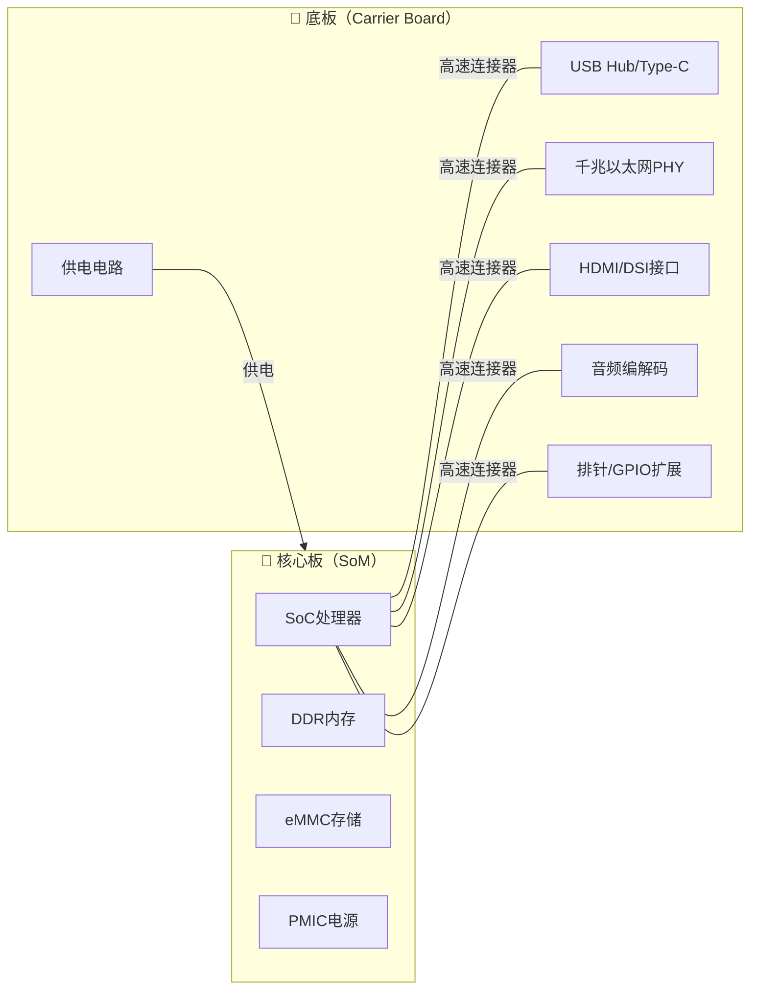

# 1.2.1 主流开发板形态一览

> 所属章节：第1章 认识你的开发板 > 1.2 开发板开箱与外观认识
> 难度：[B→I] | 预计阅读时间：15分钟

## 本节导读

当你打开购物网站搜索"嵌入式Linux开发板"时，会发现市面上有成百上千种产品。它们外观各异、大小悬殊，价格从几十元到上千元不等。本节将带你认识开发板的**两大基本形态**（核心板+底板 vs 一体板）、**主流尺寸标准**，以及**标准套件里应该有什么**。学完本节，你将能根据项目需求判断哪种形态更适合自己，并学会开箱时的标准检查流程。

---

## 知识点3：核心板+底板架构 vs 一体板 [B] ~800字

嵌入式开发板从物理结构上可以划分为两种形态：**核心板（Compute Module/SoM）+ 底板（Carrier Board）**的分体式架构，以及**所有元件集成在一块PCB上的一体板（All-in-One Board）**。

### 什么是核心板？

核心板（System on Module，简称SoM）是一块紧凑的小型电路板，上面集成了让Linux运行所必需的最核心元件：

- **SoC主芯片**：包含CPU、GPU、VPU等
- **DDR内存**：通常1GB~8GB
- **eMMC/存储芯片**：存放Bootloader、内核和文件系统
- **电源管理芯片（PMIC）**：给SoC和DDR提供精确的各路电压
- **晶振和基本阻容元件**

核心板通常通过**高密度连接器**（如B2B连接器、金手指、邮票孔）与底板对接，引脚数量从几十到几百不等。

### 什么是底板？

底板也叫载板、转接板，是一块较大的PCB，它的作用是：

- 把核心板上密密麻麻的引脚，转换成你能直接插线的接口（USB口、网口、HDMI、排针等）
- 提供额外功能模块的物理位置和供电（如以太网PHY、WiFi模块、CAN收发器、音频编解码器）
- 设计成符合特定工业标准的尺寸，方便装入机箱

[图1：核心板+底板分解图——展示一块核心板从底板连接器上拔下，以及两者各自的正面元件布局]

### 核心板+底板的模块化设计优势



**这种架构为什么被工业界广泛采用？**

| 优势 | 具体说明 | 场景举例 |
|------|----------|----------|
| **模块化复用** | 同一底板可搭配不同性能的核心板，无需重新设计外围电路 | 飞凌OKMX8MM-C底板可换i.MX6ULL/i.MX8M Mini核心板 |
| **快速换平台** | 原厂停产某SoC时，只换核心板即可延续产品生命周期 | 工业网关需要从RK3288升级到RK3568 |
| **降低研发风险** | 核心板由厂商完成高速信号设计，用户只需设计低速底板 | DDR布线对新手极难，核心板已帮你搞定 |
| **紧凑空间利用** | 核心板可做得很小，底板按产品外形定制 | 车载设备内部空间不规则 |
| **维护方便** | 现场可直接更换核心板排查故障 | 设备部署在偏远地区 |

**国产典型代表**：

- **正点原子**：α系列核心板（STM32MP157/i.MX6ULL）+ 多种底板，资料极其丰富，适合学习
- **飞凌嵌入式**：OKMX系列，工业级品质，提供10年以上供货承诺
- **友善之臂**：NanoPi系列，性价比高，社区活跃
- **迅为电子**：iTOP系列，RK3568/RK3588核心板，视频编解码能力强
- **北京翼辉/龙芯**：面向信创和特殊行业的国产化方案

### 一体板的优势与适用场景

一体板把所有元件焊在同一块PCB上，没有核心板+底板之间的连接器。

| 优势 | 具体说明 |
|------|----------|
| **成本低** | 省掉了核心板本身和连接器成本，同配置通常便宜20%~40% |
| **上手简单** | 开箱插电即用，不用研究核心板插哪、怎么固定 |
| **体积可控** | 不需要两层板叠在一起，整体可以做得更薄 |
| **信号完整性更好** | 没有连接器阻抗不连续问题，超高速信号（如PCIe 3.0、千兆网）更稳定 |

**典型代表**：树莓派全系列（Raspberry Pi 4B/5）、全志D1哪吒开发板、合宙Air系列、各种ESP32-S3/RP2040一体学习板。

**💡 提示**：如果你是**纯学习目的**，一体板（如树莓派）能让你最快看到运行效果；如果你是**要做自己的产品**，强烈建议从核心板+底板的架构入手，因为未来产品化时你的设计经验可以直接迁移。

⚠️ **陷阱**：不要误以为"核心板更贵就等于更好"。有些一体板在信号完整性上反而优于廉价的核心板方案，特别是千兆以太网和MIPI CSI/DSI信号。如果你要跑高带宽应用（4K视频、高速相机），务必查看底板的层数和高速信号走线质量。

---

## 知识点4：常见开发板尺寸标准 [B] ~600字

开发板的尺寸不是随便定的。成熟的尺寸标准意味着丰富的配件生态：外壳、散热器、电池模块、屏幕支架……只要尺寸匹配，这些配件可以即插即用。

### 主流尺寸标准一览

| 尺寸标准 | 典型尺寸 (mm) | 代表产品 | 核心特点 | 适用场景 |
|----------|---------------|----------|----------|----------|
| **树莓派 Model B** | 85 × 56 | 树莓派4B/5、Orange Pi 3B | 生态最丰富，配件最多 | 教育、原型验证、家庭服务器 |
| **树莓派 Zero** | 65 × 30 | 树莓派Zero 2W、Radxa Zero | 极小体积，功耗低 | 便携设备、可穿戴、无人机 |
| **NanoPi NEO** | 40 × 40 | NanoPi NEO2/NEO3、香橙派Zero | 正方形，廉价网关首选 | 软路由、轻量网关、数据采集 |
| **Pico-ITX** | 100 × 72 | 部分x86工控主板、高端ARM工控板 | 接近工业标准，可装机箱 | 工业HMI、边缘计算网关 |
| **3.5寸板型** | 146 × 102 | 多数工控ARM主板 | 兼容传统3.5寸硬盘安装孔位 | 工控机柜、替代x86方案 |
| **定制核心板** | 30×30 ~ 82×45 | 飞凌核心板、正点原子核心板 | 无固定标准，灵活度最高 | 最终产品内部集成 |

[图2：常见开发板尺寸对比——将树莓派4B、NanoPi NEO、Pico-ITX板型按真实比例并列展示，并在下方标注具体尺寸数字]

### 尺寸对散热和扩展性的影响

**散热方面**：

- **小尺寸板（<50×50mm）**：如NanoPi NEO系列，处理器和DDR颗粒堆叠紧密，被动散热面积小。如果满载运行，核心温度很容易突破80°C。💡 **提示**：这类板子通常需要额外贴散热片或配小风扇。
- **中等尺寸（~85×56mm）**：如树莓派4B，板面有足够空间放置大面积铜箔散热，配合官方外壳风道设计，通常可以无风扇运行。
- **大尺寸工控板（>100×100mm）**：通常有标准散热器安装孔位（如37×37mm间距），可以直接安装铝挤散热器甚至热管方案。

**扩展性方面**：

- **小尺寸板的妥协**：为了做小，厂商会砍掉某些接口。例如NanoPi NEO系列没有HDMI口，只能串口或网络登录配置；GPIO排针数量也可能减少到24pin或12pin。
- **大尺寸板的优势**：Pico-ITX和3.5寸板型通常同时提供：双网口、多路串口（RS232/485）、CAN总线、LVDS/EDP接液晶屏、SATA或M.2硬盘接口、miniPCIe插4G/5G模块。这些接口对工业应用至关重要。

⚠️ **陷阱**：选购时不要只看"板子越小越好"。如果项目需要接4G模块+摄像头+7寸触摸屏+RS485传感器，一块40×40mm的板子根本摆不下这么多接口电路，强行用扩展板会拖慢信号速度、增加故障点。

---

## 知识点5：开发板套件清单 [B] ~500字

当你下单购买开发板后，收到的快递盒里应该有什么？开箱时怎么检查是否有遗漏？这一节给出标准清单。

### 标准套件通常包含什么

不同厂商的"标配"差异很大。以下是一份**主流国产开发板的标准配置清单**：

| 物品 | 是否常见 | 作用说明 | 缺少时的替代方案 |
|------|----------|----------|------------------|
| **开发板本体** | ✅ 必有 | 核心板+底板（或一体板） | 无 |
| **电源适配器** | ✅ 多数有 | 通常为5V/2A或12V/2A，接口DC圆头或Type-C | 手机充电头（需确认电压电流匹配） |
| **USB数据线** | ⚠️ 部分有 | Type-A转Type-C/Micro-USB，用于供电+ADB/烧录 | 自行购买带数据线的（非充电-only线） |
| **SD卡/TF卡** | ⚠️ 部分有 | 预烧系统或空卡，容量通常16~64GB | 自行购买Class10/UHS-I级别 |
| **WiFi/BT天线** | ⚠️ 部分有 | 胶棒天线或IPEX接口天线 | 无天线时无线功能极弱甚至无法使用 |
| **散热片/风扇** | ❌ 少见 | 铝制散热片带背胶，或4010小风扇 | 自行购买导热系数高的散热片 |
| **串口线/USB转TTL** | ❌ 少见 | CH340/CP2102模块，用于查看启动日志 | 淘宝购买，约5~15元 |
| **说明书/快速入门卡片** | ✅ 多数有 | 引脚定义图、供电要求、官网资料链接 | 去厂商官网下载电子版 |
| **排针/杜邦线** | ❌ 少见 | 公对母、母对母杜邦线 | 自行购买40pin套装 |

### 开箱检查清单

收到快递后，建议按以下流程检查：

1. **外观检查**：开发板有无变形、PCB边缘有无磕碰、连接器有无压坏
2. **清点配件**：对照厂商页面的"产品清单"逐项核对
3. **确认核心板安装状态**：如果是核心板+底板结构，检查核心板是否已插好、固定螺丝是否拧紧（运输中可能松动）
4. **天线检查**：IPEX天线座子很脆弱，确认没有被压扁或脱落
5. **金手指/连接器检查**：如果有金手指接口，检查是否有氧化发黑

### 你很可能还需要额外购买的东西

```bash
# 串口调试必备：连接后检查设备是否识别
ls /dev/ttyUSB* /dev/ttyACM*
# 正常会输出类似 /dev/ttyUSB0
```

| 额外物品 | 预估价格 | 为什么需要 |
|----------|----------|------------|
| USB转TTL串口模块（CH340/CP2102/FT232） | ¥5~30 | 查看启动日志、调试Bootloader、救砖必备 |
| 高品质SD卡（SanDisk Extreme/Kingston Canvas Go） | ¥30~80 | 廉价SD卡读写慢、寿命短，会导致系统卡顿 |
| 网线（Cat5e以上） | ¥5~10 | 没有WiFi时，首次烧录和SSH登录需要 |
| HDMI线或MIPI屏幕 | ¥20~200 | 需要有显示输出才能体验桌面系统 |
| 读卡器（USB 3.0） | ¥15~30 | 烧录系统镜像到SD卡/eMMC需要 |
| 散热片套装（含导热硅脂片） | ¥10~30 | 长时间运行不降频的物理保障 |

🔴 **危险**：绝对不要混用不同电压的电源适配器！如果你有一块板子需要12V供电，而你的树莓派电源是5V的，插上去板子不会启动；反之，5V板子插12V电源，**冒烟就在一瞬间**。电源接口旁边的丝印通常会标注额定电压（如"5V⎓2A"或"DC 12V"），使用前务必核对。

💡 **提示**：建议准备一个**"嵌入式工具盒"**，把这些小配件统一收纳。后期项目一多，你会发现每次找不到串口线或读卡器是最耽误事的。

---

## 本节总结

| 概念 | 核心要点 | 实操建议 |
|------|----------|----------|
| **核心板+底板** | SoC+DDR+eMMC集成在核心板，底板负责引出接口；模块化可复用 | 做产品首选此架构，便于后续升级维护 |
| **一体板** | 所有元件在一块PCB上，成本低、上手快、信号好 | 学习实验首选，但产品化时需重新设计 |
| **尺寸标准** | 树莓派型、NanoPi型、Pico-ITX、3.5寸板型各有生态位 | 小尺寸≠更好，根据接口需求选尺寸 |
| **开箱检查** | 外观→配件→核心板安装→天线→金手指 | 按清单逐项核对，缺件第一时间联系卖家 |
| **额外必备** | 串口模块+优质SD卡+读卡器是救急三件套 | 提前购买，不要等板子到了才发现没法烧录 |

---

## 下一步

你已经了解了开发板的物理形态和开箱要点。接下来，在 `1.2.2 认识开发板上的接口与芯片` 中，我们将逐一认识板子上的每一个接口（USB、网口、HDMI、排针……）和每一颗重要芯片的作用，让你拿到任何一块新板子都能快速看懂它的功能布局。

---

## 配套资源

### 表格清单
- 表1：核心板+底板 vs 一体板的优势对比
- 表2：主流开发板尺寸标准对比表
- 表3：标准套件物品清单及替代方案
- 表4：开箱检查清单与额外购买推荐

### 图示清单
- 图1：核心板+底板分解图（展示核心板与底板的物理分离结构和连接器） [配图说明]
- 图2：常见开发板尺寸对比（树莓派4B、NanoPi NEO、Pico-ITX按真实比例并列） [配图说明]
- 图3：核心板+底板架构mermaid图（SoM与Carrier Board的功能划分关系图） [mermaid图]

### 代码清单
- 代码1：`ls /dev/ttyUSB* /dev/ttyACM*` — 检查串口模块是否被系统识别
