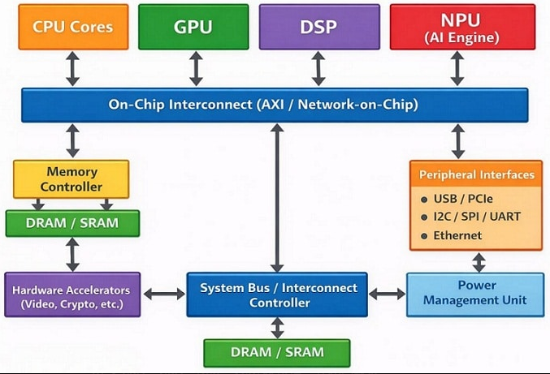
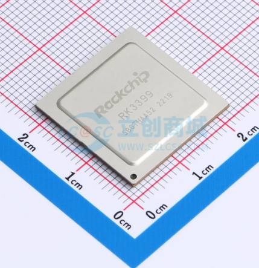
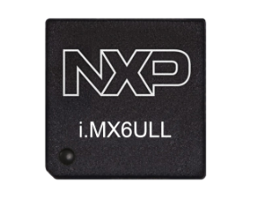
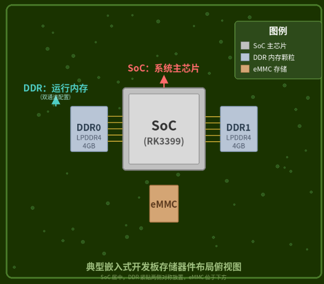
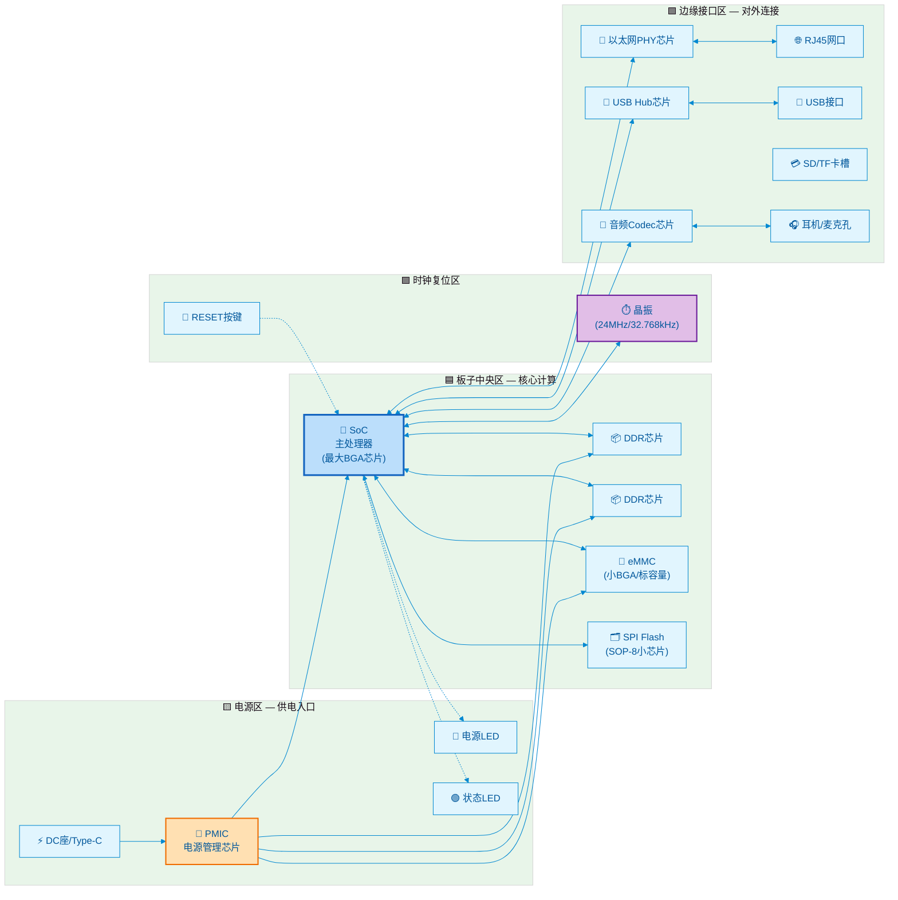

# 1.2.2 板上关键器件识别

> 所属章节：第1章 认识你的开发板 > 1.2 开发板开箱与外观认识
> 
> 难度：[B] | 预计阅读时间：25分钟

## 本节导读

本节是一堂"寻宝课"——拿起你的开发板，我们将一起在上面找到**SoC、内存、存储、电源、晶振**等关键器件。<BR>学完本节，你不仅能叫出这些芯片的名字，还能通过外观判断它们的类型和作用。带上你的板子，我们开始吧！

---

## <span class="blue">SoC——板子的"大脑" [B] 

### 6.1 SoC到底是什么？

SoC 的全称是 **System on Chip（片上系统）** [^1]。<BR>你可以把它理解为一颗"超级芯片", 把传统计算机里分散在主板上的多个芯片（CPU、GPU、内存控制器、USB控制器、网卡等）全部封装到一颗硅片里。

想象你组装过台式电脑：CPU插一个槽、显卡插一个槽、声卡、网卡各插各的。而嵌入式开发板上，这些功能全被塞进了SoC这一颗芯片里。这就是为什么一块巴掌大的板子，能跑完整的Linux系统。



### 6.2 常见的三种封装形式

拿到板子，怎么判断哪颗芯片是SoC？首先看**封装形式**。SoC常见三种封装，像三种不同形状的"房子"：

| 封装类型 | 外观特征 | 焊球/引脚数量 | 常见用途 | 识别难度 |
|---------|---------|-------------|---------|---------|
| **BGA** (Ball Grid Array) | 正面是光滑平面，背面是密密麻麻的焊球阵列，像围棋棋盘 |  hundreds~thousands | 高性能SoC（RK3399、i.MX6） | ⭐⭐⭐ |
| **LQFP** (Low-profile Quad Flat Package) | 四边伸出扁平引脚，像千足虫 |  48~208引脚 | 中低端MCU、SoC（STM32、部分全志） | ⭐⭐ |
| **QFN** (Quad Flat No-leads) | 四边有很小的金属焊盘，没有外露引脚 |  32~128引脚 | 小尺寸SoC、WiFi模组 | ⭐⭐ |

**识别口诀**：看到板子上**最大、最方正、焊点最密**的那颗芯片，90%就是SoC。很多开发板还会给SoC配一个散热片或金属屏蔽罩，让它看起来像个"小碉堡"。

### 6.3 找到SoC型号——看丝印

芯片表面会用激光刻上**丝印（Silkscreen）**，也就是型号标识。但因为芯片尺寸小，字也很小，通常需要用以下方法辨认：

1. **裸眼+侧光法**：把手机手电筒斜着照向芯片表面，利用光影对比读取文字
2. **手机拍照放大法**：用手机微距模式拍一张，放大后辨认
3. **查看原理图或官网**：如果丝印实在看不清，去开发板官网查规格书




SoC型号通常包含这些信息：

```
RK3399        ← 芯片型号
K  2130A      ← 批次/版本/产地码
              ← 第二行通常是生产批次
```

💡 **提示**：丝印第二行的字母数字组合通常是**生产批次代码**，不同批次不影响功能，不需要纠结。

### 6.4 主流嵌入式SoC速查

下面是你在国产开发板上最常见的几颗SoC，认识它们就像认识Linux界的"明星"：

| 厂商 | 型号 | 定位 | CPU架构 | 典型频率 | 常见板子 | 识别特征 |
|-----|------|------|--------|---------|---------|---------|
| Rockchip | **RK3399** | 高性能 | 双核A72+四核A53 | 1.8GHz | 友善NanoPC-T4、Firefly | BGA封装，常配散热片 |
| Rockchip | **RK3568** | 中端全能 | 四核A55 | 2.0GHz | 众多工控板、电视盒 | BGA封装，带NPU标志 |
| 全志(Allwinner) | **H6** | 中端多媒体 | 四核A53 | 1.8GHz | 橙子派Orange Pi | BGA封装，常印有"H6" |
| 全志(Allwinner) | **H616** | 入门多媒体 | 四核A53 | 1.5GHz | 电视盒、入门板 | 较小BGA，常配WiFi模组 |
| NXP | **i.MX6ULL** | 低功耗工业 | 单核A7 | 528/792MHz | 正点原子、野火 | LQFP封装，**最容易辨认** |

> ⚠️ **陷阱**：不要把**WiFi模组**当成SoC！很多板子在SoC旁边配一块写着"AP6212"或"RTL8821CS"的小模块——那是无线网络芯片，不是主处理器。

> ⚠️ **陷阱**：不要把**PMIC（电源管理芯片）**当成SoC！PMIC通常比SoC略小，丝印里有"PMIC"、"AXP"、"RK8"等字样。

### 6.5 上电确认SoC——软件视角

如果外观辨认有困难，上电后可以通过命令确认SoC型号：

```bash
# 方法1：读取CPU信息（通用）
cat /proc/cpuinfo | grep "Hardware\|Processor"

# 方法2：读取设备树型号（ARM板常用）
cat /proc/device-tree/model

# 方法3：读取Rockchip专有的CPU信息
cat /sys/devices/system/cpu/cpu0/cpufreq/scaling_available_frequencies
```

💡 **提示**：RK3399读出来的cpuinfo可能会显示6个核心（2个A72 + 4个A53），看到6核基本就能确认是RK3399了。

---

## <span class="blue">存储器件——DDR、eMMC和SD卡槽 [B] 

SoC是"大脑"，但大脑需要"短期记忆"和"长期记忆"。嵌入式板上的存储器件承担这两个角色。

### 7.1 DDR（运行内存）——"短期记忆" [B]

DDR（Double Data Rate SDRAM）是SoC的**临时工作内存**，系统运行时所有程序都加载到这里。断电后内容消失。

**外观识别**：
- 通常是**1片或2片**长方形的BGA芯片，并排放在SoC旁边
- 尺寸比SoC小，比eMMC大
- 丝印常见型号："K4B4G"、"MT41K"、"H5TC4G"、"NT5CC"
- 容量标识：丝印中往往包含"4G"、"2G"、"8G"字样，代表容量

```
典型布局：

┌─────────────┐
│    SoC      │
└─────────────┘
    ↓ 并排紧邻
┌─────┐ ┌─────┐
│DDR0 │ │DDR1 │   ← 两片DDR（双通道）
└─────┘ └─────┘
    ↓ 或只有一片
┌─────┐
│DDR0 │           ← 单通道配置
└─────┘
```


[图3：DDR芯片与SoC的位置关系俯视图——DDR芯片通常紧贴SoC两侧放置](images/DDR芯片与SoC的位置关系俯视图.png)

🔴 **危险**：DDR芯片的焊盘非常密，**切勿用手触摸或按压**。静电或物理损伤会导致内存不稳定，板子表现为"随机死机"或"无法启动"。

### 7.2 eMMC——"内置硬盘" [B]

eMMC（embedded MultiMediaCard）是板载的**闪存存储器**，相当于电脑的固态硬盘，存放操作系统、用户数据和应用程序。断电后数据保留。

**外观识别**：
- 尺寸很小，通常是**9mm×12mm**或**11.5mm×13mm**的BGA小方块
- 丝印会直接写容量："8GB"、"16GB"、"32GB"、"64GB"
- 常见型号前缀："KLM"（三星）、"MTFC"（镁光）、"THGB"（铠侠）
- 位置通常在SoC的另一侧，和DDR分居SoC两边

[图4：eMMC芯片实物大小对比图——与SD卡、一元硬币的尺寸对比]

### 7.3 SD卡槽与SPI Flash——"外置/备用存储" [B]

**SD卡槽（TF卡槽）**：
- 板子边缘最常见的**金属弹片槽**
- 旁边通常印有"TF"或"SD"字样
- 用来外接SD卡启动系统或扩展存储
- 部分板子支持**从SD卡优先启动**——这是救砖神器！

**SPI Flash（Nor Flash）**：
- 非常小，通常是**SOP-8封装**（两边各4个脚）
- 容量小（4MB~32MB），存放**Bootloader（U-Boot）**
- 位置不固定，有时靠近SoC，有时靠近电源区域
- 丝印常见型号："W25Q128"、"MX25L6405"

[图5：SD卡槽与SPI Flash位置示意图——展示板子边缘的SD卡槽和小型8脚Flash]

### 7.4 存储容量速查表

| 存储器件 | 典型容量 | 速度 | 作用 | 断电保存 |
|---------|---------|------|------|---------|
| DDR3/DDR4 | 512MB ~ 4GB | 极快（GB/s级） | 运行内存 | ❌ 不保存 |
| eMMC | 8GB ~ 128GB | 中等（100~300MB/s） | 系统+数据存储 | ✅ 保存 |
| SD卡 | 8GB ~ 256GB | 较慢（20~90MB/s） | 外扩存储/启动 | ✅ 保存 |
| SPI Flash | 4MB ~ 32MB | 慢（10~50MB/s） | 存放Bootloader | ✅ 保存 |

⚠️ **陷阱**：不要把eMMC和DDR搞混！记住：**写容量数字的是eMMC（长期存储），写型号字母的是DDR（运行内存）**。

---

## 知识点8：电源管理——让板子"吃饱饭" [B] ~700字

### 8.1 电源输入接口识别 [B]

没有电，再好的SoC也是块塑料。板子上的供电入口通常有以下几种：

| 接口类型 | 外观 | 常见参数 | 所在位置 |
|---------|------|---------|---------|
| **DC圆孔座** | 圆柱形金属孔，中心有针 | 5V/2A、12V/2A | 板子边缘 |
| **Type-C口** | 椭圆形，上下对称 | 5V/3A（支持PD） | 板子边缘 |
| **Micro-USB** | 梯形扁口 | 5V/2A | 板子边缘（老板子） |
| **排针供电** | 2~4根插针，标VCC/GND | 5V | 靠近电源区域 |

[图6：三种常见电源接口对比图——DC圆孔、Type-C、Micro-USB的俯视图]

🔴 **危险**：**严禁接错电压！** 大部分开发板用**5V供电**，如果误接12V，板子可能在几秒内烧毁。供电前务必确认：
1. 电源适配器输出电压（看铭牌上的"Output"）
2. 开发板丝印标注的输入电压（板子边缘通常印有"5V"或"12V"）
3. 两者必须匹配！

### 8.2 PMIC芯片——"供电管家" [B]

PMIC（Power Management IC）是电源管理芯片，负责把外部输入的5V转换成SoC、DDR、eMMC各自需要的电压（1.1V、1.8V、3.3V等）。

**外观识别**：
- 通常是**QFN封装**的方形小芯片
- 位置在电源接口附近
- 丝印有明确线索：
  - 全志平台常见："AXP805"、"AXP2101"
  - Rockchip平台常见："RK808"、"RK818"、"RK809"
  - 通用型号："ACT8846"、"SY8088"

[图7：PMIC芯片位置示意图——位于电源接口和SoC之间的供电路径上]

💡 **提示**：PMIC周围通常有一圈**小电感**（黑色或银色的小方块，上面标"100"、"4R7"）和**电容**，这是PMIC的"外挂"元件，看到一堆电感围着一个芯片，十有八九就是PMIC。

### 8.3 电源指示灯 [B]

板子上通常有**1~3颗LED指示灯**，不同颜色代表不同状态：

| LED颜色 | 常见含义 | 状态解读 |
|--------|---------|---------|
| 🔴 红色 | 电源指示 | 常亮=已通电；不亮=未供电或短路 |
| 🟢 绿色 | 系统/运行状态 | 闪烁=系统运行中；常亮=启动完成；不亮=未启动 |
| 🟡 黄色/蓝色 | 自定义功能 | 常为网络活动或用户可控LED |

⚠️ **陷阱**：红灯亮但绿灯不亮≠板子坏了！红灯只说明有电进来，绿灯不亮可能是系统没启动成功，需要排查镜像或串口输出。

---

## 知识点9：晶振与复位——板子的"心跳"和"重启键" [B] ~600字

### 9.1 晶振——提供"心跳节拍" [B]

晶振（Crystal Oscillator）是一块石英晶体，通电后会产生稳定的振动频率，给整个电路提供时间基准。就像乐队的节拍器，没有它所有模块都会乱套。

**无源晶振（两脚金属壳）**：
- 外观：**圆柱形或扁长方形金属外壳**，像小银胶囊
- 只有**两个引脚**
- 旁边通常有**两颗小电容**（贴片的棕色或黑色小方块）
- 常见频率：24MHz、32.768kHz
- 成本最低，但需要SoC内部集成振荡电路

**有源晶振（四脚方形）**：
- 外观：**长方形金属壳，通常是4个引脚**
- 比无源晶振大，尺寸约5mm×7mm
- 常见频率：24MHz、27MHz、50MHz
- 内部集成了振荡电路，输出更稳定的方波
- 丝印会写频率："24.000"、"27.000"

[图8：无源晶振（两脚）与有源晶振（四脚）对比图——展示外观和旁边电容的配置]

💡 **提示**：24MHz晶振是最常见的"主时钟"，给SoC提供基本节拍。32.768kHz晶振则专用于**实时时钟（RTC）**，即使关机也能维持时间走动。

⚠️ **陷阱**：晶振怕摔！如果开发板从高处跌落，晶振可能内部断裂，症状是**上电后完全无反应**，或串口输出乱码。维修时可用示波器测量晶振引脚是否有正弦波形。

### 9.2 复位按键——"重启按钮" [B]

复位按键（RESET）通常是一个**小型贴片按钮**，位于板子边缘。按下后电路复位，SoC重新从头启动。

**识别特征**：
- 旁边丝印标着"RESET"或"RST"
- 比旁边的电源键小（如果有的话）
- 按下后电源LED会短暂熄灭再亮起，表示重启生效

[图9：复位按键与电源按键的位置示意图——通常位于板子同一侧，RESET标在旁边]

⚠️ **陷阱**：RESET和POWER键不要搞混！有些板子POWER键短按是"休眠/唤醒"，长按才是"关机"；RESET键则是"立即重启"。开机状态下按RESET不会损坏数据，但正在写入文件时重置可能导致文件损坏。

---

## 知识点10：其他外设芯片——板子的"五官" [B] ~500字

### 10.1 以太网PHY芯片——有线网络的"翻译官" [B]

SoC内部集成了MAC（媒体访问控制器），负责处理网络数据包。但SoC不能直接驱动网线，需要一颗**PHY芯片**做信号转换。

**外观识别**：
- 位置：**RJ45网口附近**
- 常见型号："IP1001M"、"RTL8211E"、"KSZ9031"
- 封装通常是QFN-48或LQFP
- 和网口之间通常有**网络变压器**（黑色方块，4~6个）

[图10：以太网区域器件布局——RJ45网口→网络变压器→PHY芯片→SoC]

### 10.2 USB Hub芯片——USB口的"扩展器" [B]

SoC自带的USB控制器数量有限，如果板子有4个USB口，很可能用了一颗**USB Hub芯片**来扩展。

**外观识别**：
- 位置：**USB口附近**
- 常见型号："FE1.1s"、"GL850G"、"USB2514"
- 封装通常是LQFP-48
- 丝印常带有"HUB"或"USB"字样

💡 **提示**：如果某个USB口速度明显慢于其他口，可能是因为它连在Hub上而不是直连SoC的USB控制器。

### 10.3 音频Codec芯片——声音的"编解码员" [B]

Codec（Coder-Decoder）负责把数字音频信号转换成模拟信号（输出到耳机/扬声器），以及反向转换（从麦克风输入）。

**外观识别**：
- 位置：**耳机孔和麦克风孔附近**
- 常见型号："ES8316"、"WM8960"、"ALC5651"
- 封装通常是QFN-32
- 旁边会有音频相关的电容和电阻

[图11：音频区域器件布局——耳机孔→Codec芯片→SoC]

---

## 本节总结

我们逛完了开发板上的"核心景点"。下表总结了本节所有关键器件：

| 器件类别 | 芯片/器件 | 外观识别要点 | 位置规律 | 常见丝印关键词 |
|---------|----------|------------|---------|--------------|
| **SoC** | 主处理器 | 最大、焊点最密的BGA/LQFP | 板子中央 | RK3399、H6、i.MX6 |
| **DDR** | 运行内存 | 1~2片长方形BGA，比SoC小 | SoC两侧紧邻 | K4B、MT41K、H5TC |
| **eMMC** | 闪存存储 | 最小BGA，标有容量数字 | SoC附近 | 8GB、16GB、KLM |
| **SD卡槽** | 外置存储 | 金属弹片槽，标TF/SD | 板子边缘 | — |
| **SPI Flash** | Bootloader存储 | SOP-8封装，8个引脚 | 靠近SoC或电源区 | W25Q、MX25L |
| **PMIC** | 电源管理 | QFN封装，周围一圈电感 | 电源接口附近 | RK808、AXP805 |
| **晶振** | 时钟源 | 金属壳，2脚或4脚 | SoC附近 | 24.000、32.768 |
| **PHY** | 以太网收发 | QFN/LQFP，网口旁 | RJ45附近 | RTL8211、IP1001 |
| **USB Hub** | USB扩展 | LQFP，USB口附近 | USB口旁边 | FE1.1s、GL850G |
| **Codec** | 音频编解码 | QFN，耳机孔旁 | 音频接口附近 | ES8316、WM8960 |

---

## 下一步

现在你已经能叫出板子上每颗芯片的名字了。但光看不够——下一节 `1.2.3 核心接口与跳线说明` 将带你认识板子上的**按键、排针、跳线帽**这些"人机交互"接口，学会如何通过它们控制板子的启动方式和功能。

---

## 配套资源

### 表格清单
- **表1**：SoC常见封装对比表（BGA/LQFP/QFN的外观与引脚数量对比）
- **表2**：主流嵌入式SoC速查表（Rockchip/全志/NXP的参数对比）
- **表3**：存储器件类型对比表（DDR/eMMC/SD/SPI Flash的容量与速度对比）
- **表4**：电源接口类型对比表（DC/Type-C/Micro-USB的电压与电流规格）
- **表5**：本节器件全清单总表（十类器件的外观、位置、丝印速查）

### 图示清单
- **图1**：SoC内部结构概念图 [配图说明：展示一颗芯片内部集成CPU、GPU、各类控制器的概念示意图]
- **图2**：SoC丝印实拍示意图 [配图说明：展示RK3399与i.MX6ULL芯片表面的丝印文字特写]
- **图3**：DDR与SoC位置关系俯视图 [配图说明：开发板俯视图，标注SoC和两侧DDR芯片的位置]
- **图4**：eMMC芯片尺寸对比图 [配图说明：eMMC芯片与SD卡、一元硬币的并排尺寸对比]
- **图5**：SD卡槽与SPI Flash位置示意图 [配图说明：板子边缘区域，标注SD卡槽和SOP-8封装的SPI Flash]
- **图6**：三种电源接口对比图 [配图说明：DC圆孔座、Type-C口、Micro-USB口的俯视图对比]
- **图7**：PMIC芯片位置示意图 [配图说明：电源接口到SoC之间的供电路径，标注PMIC和周围电感]
- **图8**：无源晶振与有源晶振对比图 [配图说明：两脚圆柱形晶振与四脚方形晶振的外观对比]
- **图9**：复位按键位置示意图 [配图说明：板子边缘的RESET按键和POWER按键，标注丝印文字]
- **图10**：以太网区域器件布局图 [配图说明：RJ45网口到PHY芯片之间的网络变压器和信号路径]
- **图11**：音频区域器件布局图 [配图说明：耳机孔到Codec芯片再到SoC的连接路径]

### 开发板器件位置总览图（Mermaid）



### 代码清单
- **代码1**：通过 `/proc/cpuinfo` 和 `/proc/device-tree/model` 读取SoC型号
- **代码2**：通过 `lsblk` 查看eMMC和SD卡设备节点
- **代码3**：通过 `dmesg | grep -i "regulator\|pmic\|power"` 查看PMIC日志

---

[^1]: System on Chip（SoC）的概念最早于1990年代由半导体行业提出，指将完整电子系统集成到单颗芯片上的设计方法。
