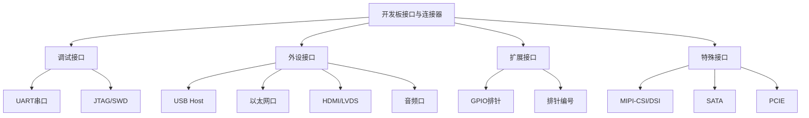

# 1.2.3 板上接口与连接器

> 所属章节：第1章 认识你的开发板 > 1.2 开发板开箱与外观认识
> 难度：[B→B] | 预计阅读时间：25分钟

## 本节导读

本节带你逐个认识开发板上的"门和窗"——各种接口与连接器。学完本节，你能像老手一样在板子上准确定位调试口、外设口和扩展口，知道每个接口长什么样、用来干什么，再也不会对着一排排针脚发呆。

## 接口全景分类

在深入每个接口之前，先建立一个整体认知。开发板上的接口按用途可以分为三大类：调试接口、外设接口和扩展接口。



**图1：开发板接口分类全景图** [mermaid图]

上图就是我们本节的"导航地图"。接下来，我们从最最重要的调试接口开始，逐个拆解。

---

## 知识点1：调试接口——开发板的"诊断窗口" [B] ~1,000字

拿到一块新开发板，第一件事不是插电，而是找到**调试接口**。调试接口是你在系统出问题时唯一能"开口说话"的通道。没有它，板子黑屏了你连报错信息都看不到。

### UART串口排针：调试的"第一窗口"

**为什么UART是调试的第一窗口？** 因为嵌入式Linux启动时，内核的启动日志（boot log）默认就是从串口输出的。你可以把它理解为板子的"自言自语"——从通电第一秒开始，CPU就把自己在做什么、遇到了什么错误，一字一句地通过串口说出来。只要接上一根USB转串口线，在电脑上打开终端软件，你就能实时看到这一切。

**UART排针长什么样？** 在开发板上，UART排针通常有以下几种形态：

| 形态 | 引脚数 | 引脚定义 | 常见位置 |
|------|--------|----------|----------|
| 3针排针 | 3针 | TX / RX / GND | 小型开发板边缘 |
| 4针排针 | 4针 | VCC / TX / RX / GND | 标准开发板，最常见 |
| 4针排针（另一种顺序）| 4针 | GND / TX / RX / VCC | 树莓派等板子常见 |
| 2.54mm排母 | 4针以上 | 多路UART | 工控板、全志/瑞芯微方案板 |

**表1：常见UART串口排针形态对比**

🔴 **危险：VCC针脚接错会烧板！**

UART排针上通常有4个信号，它们的含义是：

| 信号名 | 方向 | 颜色（常见）| 说明 |
|--------|------|-----------|------|
| VCC | 电源输出 | 红线 | 3.3V或5V供电，**不是必须接** |
| TX | 板子→电脑 | 绿线 | 板子发送数据，接USB转串口线的RX |
| RX | 电脑→板子 | 白线 | 板子接收数据，接USB转串口线的TX |
| GND | 共地 | 黑线 | **必须接**，信号参考地 |

**表2：UART排针信号定义与接线规则**

⚠️ **陷阱：TX和RX要交叉接！** 很多初学者直接把板子的TX接转接线的TX，这是错的。记住口诀：**"TX接RX，RX接TX"**，因为一方发送要接另一方接收。

💡 **提示：VCC可以不接！** 如果你的开发板已经独立供电（插了电源适配器），UART只接TX、RX、GND三根线就够了。多接VCC反而有反灌电烧板的风险。

### 操作步骤：找到并连接UART串口

1. **在板子上找丝印**：用肉眼或放大镜找板子边缘的排针，丝印通常标有 `UART0`、`DEBUG`、`CONSOLE` 或 `TX/RX/GND` 字样。
2. **确认电平**：大多数ARM开发板是 **3.3V电平**，少数老板子是5V。买USB转TTL串口线时一定要选 **3.3V版本**。
3. **交叉接线**：板子TX → 转接线RX；板子RX → 转接线TX；GND → GND。
4. **电脑上装驱动**：Windows通常需要CH340/CP2102/FT232驱动；Linux一般免驱。
5. **打开串口终端**：

```bash
# Linux/Mac 下使用 screen 或 minicom
# 先确认串口设备名
ls /dev/ttyUSB* /dev/ttyACM*

# 用 screen 连接，115200 是常见波特率
screen /dev/ttyUSB0 115200

# 或者用 picocom（更推荐，退出方便）
picocom -b 115200 /dev/ttyUSB0
```

```bash
# Windows 下可以用 PuTTY 或 MobaXterm
# 在设备管理器中找到 COM 口号（如 COM3）
# PuTTY 配置：Serial, COM3, 115200 baud, 8 data bits, 1 stop bit, no parity
```

### JTAG/SWD接口：硬件调试的"手术刀"

如果说UART是看"日志输出"，那JTAG/SWD就是"打断点、单步执行"——这是真正的硬件级调试。

**JTAG接口长什么样？** 最常见的有两种：

- **20针JTAG排针**：两排各10针，2.54mm间距，体积较大，带一个方形缺口防呆。常见于PowerPC、早期ARM9板子。
- **10针/14针JTAG排针**：体积较小，同样带缺口。
- **20针SWD接口（ARM标准）**：2×10排列，1.27mm半间距，更小巧，带缺口和定位柱防呆。STM32、i.MX、RK等现代ARM板常用。

**[图2：20针JTAG排针实物图，标注缺口位置和引脚1方向]** [配图说明]

⚠️ **陷阱：JTAG接口的缺口就是" north star "！** 缺口旁边的是引脚1，所有引脚编号都从缺口处开始逆时针数。接错方向可能烧调试器或板子。

**什么时候需要JTAG？** 新手90%的时间用UART就够了。JTAG只在以下场景出场：
- 系统刚移植，串口还没通，需要JTAG看CPU是否在执行
- 内核崩溃（panic）后需要看寄存器状态
- 调试裸机程序或Bootloader

💡 **提示：初学者先别买JTAG调试器。** 一个正版J-Link要几百到上千元。先用UART+打印调试法，等遇到UART解决不了的问题再考虑JTAG。

---

## 知识点2：常用外设接口——开发板的"五官" [B] ~800字

调试接口是"对内"的，外设接口则是"对外"的——让你的开发板能连键盘、能上网、能显示画面、能播放声音。

### USB Host接口

**长什么样：** 最熟悉的矩形扁口，A型母座，和电脑上的USB口一模一样。高端板子可能有多个，还会配USB Hub芯片扩展出更多口。

**干什么用：** 接键盘、鼠标、U盘、USB摄像头、USB转串口线、USB网卡等。一句话：只要是USB设备，理论上都能插。

💡 **提示：注意USB版本。** 丝印或原理图上会标 USB2.0 或 USB3.0。USB3.0口通常是蓝色的，速度更快。如果你要外接USB硬盘或高速摄像头，优先插USB3.0口。

### 以太网口（RJ-45）

**长什么样：** 比USB口更宽更扁的方形接口，带两个LED指示灯（黄色/绿色）。旁边通常会标 `ETH0`、`LAN`、`100M` 或 `1000M`。

**干什么用：** 上网、ssh远程登录、传文件（scp/nfs）、NTP对时。做网络设备或需要联网的开发板，网口是标配。

**[图3：RJ-45网口LED指示灯含义说明图]** [配图说明]

| LED颜色 | 状态 | 含义 |
|---------|------|------|
| 绿色 | 常亮 | 物理链路已连接（网线插好了）|
| 绿色 | 闪烁 | 有数据收发 |
| 黄色 | 常亮 | 千兆速率协商成功（1000Mbps）|
| 黄色 | 不亮 | 百兆或十兆速率 |

**表3：网口LED指示灯状态速查**

### HDMI / LVDS / MIPI-DSI显示接口

**HDMI长什么样：** 和电脑显示器上的一模一样，梯形扁口，19针。这是最常见的显示接口，即插即用。

**LVDS长什么样：** 扁平的软排线接口（FPC座），带一个卡扣压住排线。工业屏、车载屏常用LVDS。

**干什么用：** 接显示器、触摸屏。嵌入式Linux桌面环境、 kiosk（自助机）界面、视频监控画面都需要显示输出。

⚠️ **陷阱：HDMI线别硬拔！** 很多开发板的HDMI座是贴片焊接在板子上的，用力过猛会把座子从板子上扯下来。拔的时候捏住插头，左右轻微摇晃再拔出。

### 音频接口

**长什么样：** 3.5mm圆形耳机孔，和手机上的一样。板上可能有一个（耳机输出）或两个（再加一个麦克风口）。丝印通常标 `HP OUT`、`LINE OUT`、`MIC IN`。

**干什么用：** 播放提示音、语音播报、录音输入。智能家居中控、语音交互设备会用到。

---

## 知识点3：GPIO排针——扩展的"万能接口" [B] ~600字

如果说前面的接口都是"专用通道"，那GPIO（General Purpose Input/Output，通用输入输出）就是一块自由土地——你可以把它配置成输入来读按钮，配置成输出来点灯，甚至可以模拟I2C、SPI、UART等通信协议。

### GPIO排针的物理形态

GPIO排针通常以 **双排针座** 的形式出现，常见的有：

- **2×20排针（40针）**：树莓派标准，最经典
- **2×13排针（26针）**：树莓派早期版本
- **2×25或更多**：工控板、扩展性强的开发板

排针间距通常是 **2.54mm**，这是杜邦线的标准间距，可以直接插。

**[图4：GPIO双排针座实物图，标注引脚1的位置和编号方向]** [配图说明]

### 排针编号规则

这是新手最容易晕的地方。GPIO排针的编号有两种体系，一定要分清：

**物理编号（Pin Number）：** 就是排针座上的物理位置，从1开始数。树莓派的40针排针编号如下：

```
         引脚1（方形焊盘/有缺口标识）
         ↓
    3.3V (1)  ●  ●  (2)  5V
    GPIO2 (3)  ●  ●  (4)  5V
    GPIO3 (5)  ●  ●  (6)  GND
    GPIO4 (7)  ●  ●  (8)  GPIO14 (UART TX)
      GND (9)  ●  ●  (10) GPIO15 (UART RX)
    ...
```

💡 **提示：找引脚1的秘诀。** 板子上的双排针座，**引脚1通常标有方形的焊盘**（其他引脚是圆形），或者旁边有丝印数字"1"，或者排针座本体有一个斜角/缺口。记住：引脚1所在的那一排是**奇数排**（1,3,5,7...），对面是偶数排（2,4,6,8...），同一列的两个引脚是对着的。

**BCM编号 / SoC引脚号：** 这是芯片内部的真实GPIO编号。比如树莓派的GPIO17（BCM17）对应物理引脚11。写程序控制GPIO时用的是这个编号，而不是物理引脚号。

⚠️ **陷阱：别把GPIO口直接接5V！** 绝大多数ARM芯片的GPIO耐压是3.3V。如果你把5V信号直接接到GPIO口上，轻则端口损坏，重则芯片烧毁。要用电平转换模块或至少串个电阻限流。

### 为什么GPIO是扩展的"万能接口"

有了GPIO，你可以：
- 接LED指示灯（输出高低电平）
- 接按键（读取输入电平）
- 接继电器控制电机（配合驱动电路）
- 接DHT11温湿度传感器（单总线协议）
- 接I2C设备（如OLED屏、RTC时钟）
- 接SPI设备（如TFT屏、SD卡模块）

几乎所有电子模块都有至少一个GPIO可控制的信号线。

---

## 知识点4：其他特殊接口——高级扩展通道 [B] ~400字

前面介绍的接口在绝大多数开发板上都能找到。还有一些"高端接口"，不是所有板子都有，但遇到特定场景时非常有用。

### MIPI-CSI（摄像头接口）和 MIPI-DSI（显示屏接口）

**长什么样：** 扁平的软排线座（FPC/ZIF座），带一个翻盖卡扣，排线很薄。CSI座旁边常标 `CAM`、`MIPI-CSI`；DSI座标 `LCD`、`MIPI-DSI`。

**干什么用：** CSI接摄像头模组（做机器视觉、人脸识别）；DSI接MIPI接口的LCD屏（手机屏那种，超薄）。

💡 **提示：MIPI排线有方向！** 排线一面的触点是露出来的，另一面有绝缘层。插反了或触点面朝下会导致接触不良或短路。翻盖卡扣要轻轻掀开，插好排线后再压紧。

### SATA接口

**长什么样：** 和电脑主板上的SATA数据口一模一样，L形扁口，7针。旁边可能还有SATA电源口（15针，更大更扁）。

**干什么用：** 接2.5寸机械硬盘或SSD。做NAS（网络存储）、视频监控录像、大数据采集时，SATA能提供大容量存储。

### PCIE接口

**长什么样：** 有两种形态：
- **标准PCIE插槽**：和电脑上的短PCIe x1槽一样，有卡扣。
- **M.2插槽**：更小巧，像一个大号的内存槽，2242/2280规格。

**干什么用：** 扩展WiFi6模块、4G/5G模块、高速SSD、AI加速卡（如Coral TPU）。需要高速数据传输或特殊外设时才会用到。

⚠️ **陷阱：PCIE/M.2也有KEY之分！** M.2接口按缺口位置分B-Key、M-Key、E-Key等，不同的Key对应不同的协议（SATA/PCIe/NVMe）。买模块时必须和板子的Key匹配，否则插不上或无法工作。

---

## 本节总结

| 接口类别 | 核心接口 | 识别要点 | 新手优先级 |
|----------|----------|----------|------------|
| 调试接口 | UART 4针排针 | 找TX/RX/GND丝印，TX/RX交叉接 | ⭐⭐⭐ 最先找 |
| 调试接口 | JTAG/SWD 20针/10针 | 找缺口，缺口旁是引脚1 | ⭐⭐ 进阶再用 |
| 外设接口 | USB Host | 标准USB-A母座 | ⭐⭐⭐ 必用 |
| 外设接口 | RJ-45网口 | 带LED的方形宽口 | ⭐⭐⭐ 必用 |
| 外设接口 | HDMI / LVDS | 梯形扁口 / FPC软排线座 | ⭐⭐ 有显示需求时用 |
| 外设接口 | 3.5mm音频口 | 圆形耳机孔 | ⭐⭐ 有音频需求时用 |
| 扩展接口 | GPIO双排针 | 2.54mm间距，找方形焊盘定引脚1 | ⭐⭐⭐ 必学 |
| 特殊接口 | MIPI-CSI/DSI | FPC翻盖座，标CAM/LCD | ⭐ 机器视觉/显示用 |
| 特殊接口 | SATA / PCIE | L形7针 / M.2插槽 | ⭐ 存储/高速扩展用 |

**表4：开发板接口速查总表**

---

## 下一步

现在你已经能在板子上找到所有接口了。但找到接口只是第一步——下一节 **1.2.4 开发板供电与上电准备** 会教你：如何正确给开发板供电？电源怎么选？第一次上电要注意什么？只有把"电"的问题搞明白了，你才能真正让板子跑起来。

---

## 配套资源

### 表格清单
- 表1：常见UART串口排针形态对比
- 表2：UART排针信号定义与接线规则
- 表3：网口LED指示灯状态速查
- 表4：开发板接口速查总表

### 图示清单
- 图1：开发板接口分类全景图 [mermaid图]
- 图2：20针JTAG排针实物图，标注缺口位置和引脚1方向 [配图说明]
- 图3：RJ-45网口LED指示灯含义说明图 [配图说明]
- 图4：GPIO双排针座实物图，标注引脚1的位置和编号方向 [配图说明]

### 代码清单
- 代码1：Linux/Mac 下串口终端连接命令（screen / picocom）
- 代码2：Windows 下 PuTTY 串口配置说明
- 代码3：树莓派40针GPIO物理编号示意

### 检查清单（上板前核对）

```markdown
□ 找到UART排针位置，确认TX/RX/GND/VCC丝印
□ 确认UART电平是3.3V还是5V
□ USB转串口线已准备（3.3V版本）
□ 确认TX-RX交叉接线，GND连通
□ 确认不需要接VCC（如果板子独立供电）
□ 找到网口、USB口、HDMI口位置
□ 如用GPIO扩展，确认引脚1位置和编号规则
□ 电源适配器电压/电流规格已核对（下一节详述）
```

---

*文档版本：v1.0 | 最后更新：2024年*
