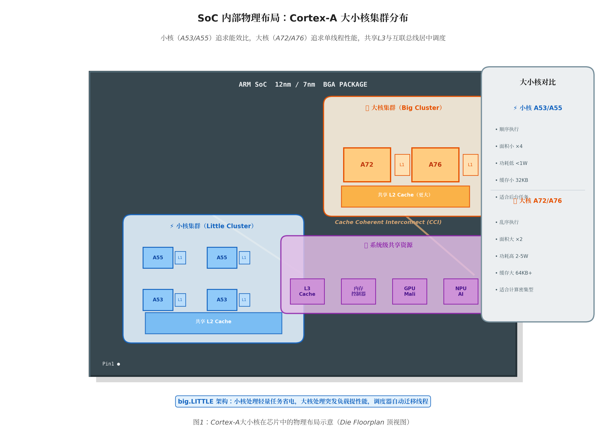
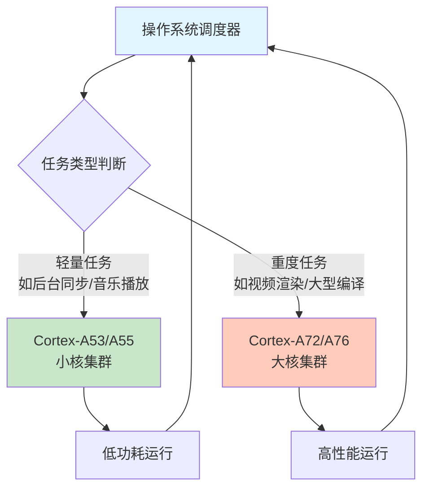
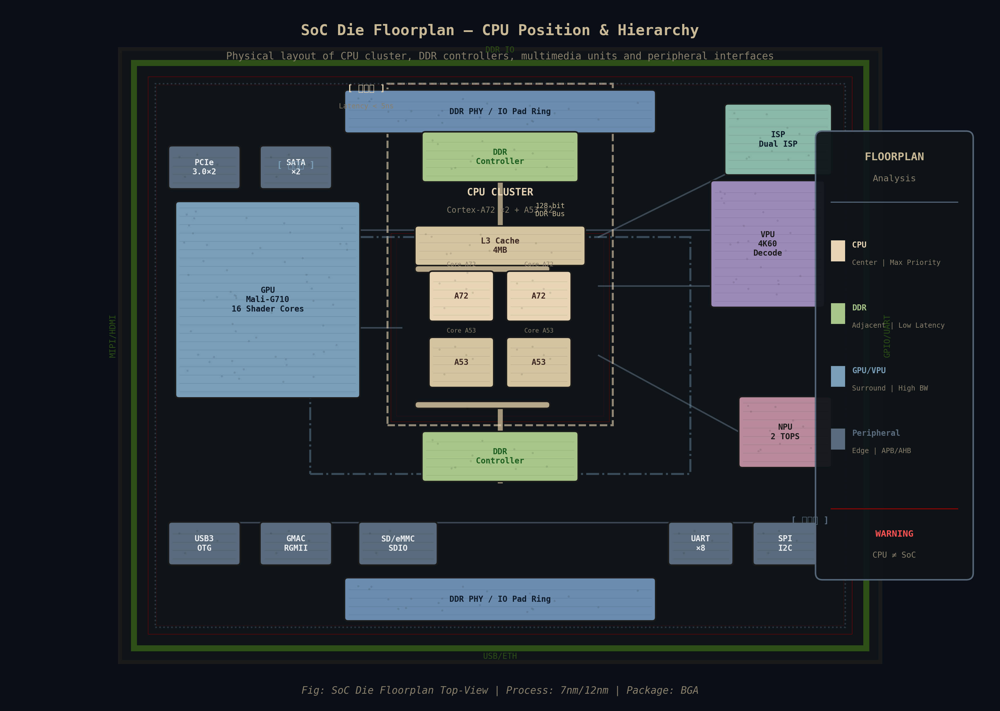
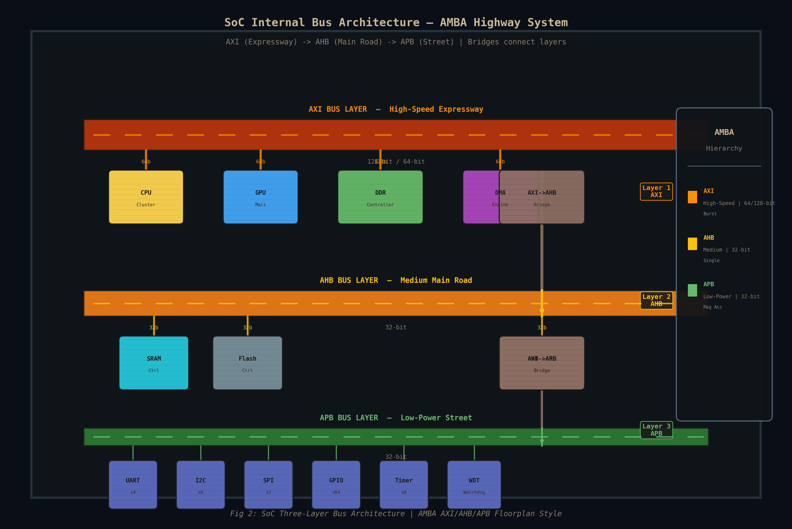

# 1.3.1 SoC内部架构初探

> 所属章节：第1章 认识你的开发板 > 1.3 核心硬件模块详解
> 
> 难度：[B→I] | 预计阅读时间：25分钟

## 本节导读

上一节我们认识了开发板上的"看得见摸得着"的元器件，现在让我们把视线转向那颗黑色的"心脏"——SoC芯片的内部。<BR>本节将带你揭开SoC的"黑盒子"，了解ARM处理器核心、内部总线、内置外设控制器和启动相关硬件的工作原理。<BR>学完本节，你将理解为什么一颗指甲盖大小的芯片能运行完整的Linux系统，以及处理器是如何与内存、外设协调工作的。

---

## <span class="blue">ARM处理器核心——SoC的"大脑" [I]

如果把SoC比作一座城市，那么ARM处理器核心就是这座城市的"行政中心"——所有的决策、计算、调度都在这里完成。<BR>市面上的嵌入式SoC绝大多数都采用ARM架构的处理器核心，这是嵌入式Linux生态能够繁荣的重要基础。

### 15.1 Cortex-A系列：面向复杂操作系统的设计

ARM的Cortex-A系列处理器是专为运行Linux、Android等复杂操作系统而设计的。<BR>**Cortex-A后面的数字越大，通常代表架构越新、性能越强**，但这不是绝对的，关键还要看具体的设计目标。

> 💡 **提示**：不要把"Cortex-A53"和"Cortex-A9"简单按数字大小比较——A53比A9新得多，数字命名并不完全按性能排序。

在嵌入式开发板中，最常见的两类核心是**高能效小核**和**高性能大核**：

**小核代表：Cortex-A53 / A55**

- 设计哲学：在足够的性能下追求极致的能效比
- 特点：顺序执行（按顺序一条一条执行指令）、面积小、功耗低、发热少
- 典型应用场景：长时间运行的后台任务、轻量级计算、电池供电设备
- 常见于：树莓派3/4、RK3328、全志H3/H5等芯片

**大核代表：Cortex-A72 / A76 / A78**

- 设计哲学：追求单线程性能最大化
- 特点：乱序执行（可以打乱指令顺序执行以提高效率）、流水线更深、缓存更大
- 典型应用场景：图形渲染、视频编解码、复杂计算密集型任务
- 常见于：RK3399（A72）、高端手机SoC、高性能开发板



### 15.2 big.LITTLE架构：大小核协同工作的智慧

 ARM推出了一项称为 **big.LITTLE**（大.小）的架构技术，核心理念非常直观：

> **"简单任务用小核省电，复杂任务用大核提速"**

想象一个快递公司：送小件包裹用电动车（省钱），送大件重物用货车（效率高）。big.LITTLE就是同样的道理，一个SoC中同时集成大核和小核，操作系统根据任务负载动态决定用哪种核心。



**图1：big.LITTLE架构的任务调度示意**

例如，瑞芯微RK3399芯片就采用了**双核Cortex-A72 + 四核Cortex-A53**的架构：

- 看视频、浏览网页时，主要用四颗A53小核，省电且安静
- 编译代码、播放4K视频时，唤醒两颗A72大核，提供强劲算力

> 💡 **提示**：Linux内核从3.10版本开始就支持big.LITTLE调度，现在的主流发行版都能自动管理大小核切换，开发者通常无需手动干预。

### 15.3 核心数量怎么看

当你看到"四核"、"八核"的宣传时，需要明白这背后的两种常见配置：

| 核心配置 | 典型代表 | 说明 |
|---------|---------|------|
| 4× A53 | 全志H5、RK3328 | 四颗同型号小核，均衡稳定 |
| 2× A72 + 4× A53 | RK3399 | big.LITTLE六核，大小搭配 |
| 4× A76 + 4× A55 | 高端手机SoC | 现代主流八核配置 |
| 8× A53 | 服务器/网络设备 | 多核并行处理网络流量 |

**表1：常见嵌入式SoC的CPU核心配置对比**

> ⚠️ **陷阱**："八核"不一定比"四核"快！如果八颗都是低频小核，其单线程性能可能远不如四颗大核。评价CPU性能要看**具体场景**：编译代码看单核性能，并行计算看多核协同。

### 15.4 CPU在SoC中的位置

在整个SoC芯片中，CPU核心集群通常占据**面积最大、位置最核心**的区域。现代SoC的典型布局是：

- **中心区域**：CPU核心集群 + 共享L2/L3缓存
- **紧邻区域**：内存控制器（DDR接口）
- **周围区域**：GPU、视频编解码器、ISP（图像处理）
- **边缘区域**：各种外设控制器（UART、USB、网口等）

这种布局不是随意的——CPU需要最高速、最低延迟地访问内存，所以内存控制器必须离CPU最近。而外设速度较慢，可以放在边缘通过总线连接。



> 🔴 **危险**：初学者常误以为"CPU = SoC"。实际上CPU只是SoC内部的一个模块（尽管是最重要的模块）。没有DDR内存控制器、没有电源管理单元、没有外设控制器，CPU自己什么也干不了。

---

## <span class="blue"> SoC内部总线架构——芯片里的"高速公路系统" [I]

### 16.1 为什么需要总线

一颗SoC内部可能有几十个甚至上百个功能模块：CPU、GPU、内存控制器、USB控制器、DMA控制器……它们之间需要不断交换数据。如果每两个模块之间都拉一条专用数据线，芯片内部的连线会密如蛛网，既浪费面积又难以设计。

**总线（Bus）**就是解决这个问题的核心机制——它像城市的公共交通系统，所有模块共享几条"主干道"，通过统一的规则（协议）来"乘车"（传输数据）。

> 💡 类比：想象一个大型机场。如果每个登机口之间都修一条私人通道，机场会变成迷宫。现实中的做法是修建几条主通道（总线），所有旅客（数据）按指示牌（地址）找到正确的目的地。

### 16.2 AXI / AHB / APB 三层总线架构

ARM公司定义了一套名为**AMBA（Advanced Microcontroller Bus Architecture）**的总线标准，现代SoC几乎都在用这套体系。<BR>它采用**分层设计**，就像我们城市的道路系统分为不同等级：

| 总线类型 | 速度等级 | 类比道路 | 典型连接对象 | 数据宽度 |
|---------|---------|---------|------------|---------|
| **AXI** | 高速 | 城市快速路/高架 | CPU、GPU、DDR控制器、DMA | 64/128位 |
| **AHB** | 中速 | 城市主干道 | 内存映射外设、SRAM控制器、Flash控制器 | 32位 |
| **APB** | 低速 | 街区支路 | UART、I2C、GPIO、定时器、看门狗 | 32位 |

**表2：AMBA三层总线对比**

**AXI（Advanced eXtensible Interface）** —— 芯片内部的"高铁"

- 支持多通道并行传输（读写可以同时跑）
- 支持突发传输（一次说好多地址，连续传数据）
- 连接的都是"大客户"：CPU要取指令、GPU要读写显存、DMA要搬数据
- 设计复杂、面积大、功耗高，但速度快

**AHB（Advanced High-performance Bus）** —— 可靠的"城际公路"

- 单通道传输（同一时间只能读或写）
- 适合中等速度的设备，如内部SRAM、NOR Flash控制器
- 比AXI简单省电，性能也够用

**APB（Advanced Peripheral Bus）** —— 慢悠悠的"社区小路"

- 最简单、最低功耗
- 连接的"小客户"不需要高速：串口每次传1字节、GPIO只是开关电平、定时器只是计数
- 通常通过"桥接器"挂在AHB或AXI上



### 16.3 总线如何影响你的开发

作为嵌入式Linux开发者，理解总线架构有以下实际意义：

1. **理解性能瓶颈**：如果USB传输速度上不去，可能是DMA没有正确配置，数据走CPU中转而不是直接走AXI总线搬运
2. **理解设备树（Device Tree）**：Linux中很多外设的描述涉及总线层级，如`apb`上的`uart0`
3. **调试问题定位**：APB总线上的寄存器可以直接读写调试；AXI总线上的DDR内存问题则需要更复杂的分析

> 💡 **提示**：大多数嵌入式开发板厂商会提供SoC的**技术参考手册（TRM）**，里面有完整的总线架构图。遇到性能或启动问题时，这张图是你的"城市地图"。

---

## 知识点17：内置外设控制器——芯片自带的"工具箱" [I] ~800字

### 17.1 控制器 vs 物理接口

初学者最容易混淆的一个概念是：**SoC内部的"控制器"和开发板上的"物理接口"不是一回事**。

- **控制器（Controller）**：SoC内部的一个硬件模块，负责实现某种通信协议的逻辑。比如UART控制器负责把并行数据转换成串行比特流、管理波特率、处理奇偶校验。
- **物理接口（Physical Interface）**：开发板上暴露出来的实际引脚或插座，比如一个4针的排针、一个USB Type-A母座。

它们之间的关系可以用这个类比理解：

> 💡 类比：控制器就像你电脑里的"声卡芯片"，物理接口就像机箱后面的"音频插孔"。声卡负责处理声音信号，插孔只是让你能插上耳机。SoC内置了UART控制器，但开发板厂商决定要不要把对应的引脚引出来做成排针。

[图3：SoC内部UART控制器与开发板物理接口的关系示意]

### 17.2 常见内置外设一览

现代SoC就像一个"瑞士军刀"，内部集成了种类繁多的外设控制器。以下是嵌入式开发板中最常见的几类：

| 外设类型 | 控制器功能 | 典型用途 | Linux设备名示例 |
|---------|-----------|---------|---------------|
| UART | 串行通信，支持异步收发 | 调试串口、连接GPS/蓝牙模块 | `/dev/ttyS0` |
| SPI | 高速同步串行，全双工 | 连接Flash、显示屏、传感器 | `/dev/spidev0.0` |
| I2C | 两线串行，多设备共享 | 连接RTC、温度传感器、触摸屏 | `/dev/i2c-0` |
| USB | 通用串行总线主机/设备 | 连接U盘、键盘、摄像头 | `/dev/bus/usb/001/001` |
| SDIO | SD/MMC卡接口 | 连接SD卡、WiFi模块 | `/dev/mmcblk0` |
| Ethernet MAC | 以太网媒体访问控制 | 有线网络通信 | `eth0` |
| PWM | 脉冲宽度调制 | 电机控制、LED调光 | `/sys/class/pwm` |
| ADC | 模拟信号转数字 | 读取传感器电压 | `/sys/bus/iio` |

**表3：SoC常见内置外设控制器**

### 17.3 如何查看你的SoC有哪些外设

在运行中的Linux系统上，你可以通过设备树（Device Tree）或系统日志来查看SoC暴露的外设。

```bash
# 查看设备树中描述的所有外设节点
find /proc/device-tree -type f | head -30

# 查看系统启动时识别到的所有平台设备
dmesg | grep "platform"

# 查看当前注册的所有串口设备
ls /dev/tty*

# 查看SoC的compatible信息（可推断具体型号）
cat /proc/device-tree/compatible | tr '\0' '\n'
```

**代码1：查看SoC外设和设备的常用命令**

💡 **提示**：不同开发板即使使用相同的SoC，暴露出的物理接口也可能不同。开发板厂商通过电路设计决定哪些控制器的信号引到板边接口上。这就是为什么同样是RK3399芯片，有的板子有双网口，有的只有一个。

---

## 知识点18：启动相关硬件——芯片上电后的"第一口奶" [I] ~700字

当你按下开发板的电源键，在Linux内核启动之前，有一段"暗无天日"的硬件启动过程。理解这段过程对排查启动失败问题至关重要。

### 18.1 BootROM：芯片出厂就固化好的"启动基因"

**BootROM**是SoC内部一小块只读存储器（ROM），在芯片制造时就把代码固化进去了。它有以下关键特性：

- **不可修改**：用户无法重写，保证了最底层启动的可靠性
- **上电即运行**：CPU复位后的第一条指令地址就指向BootROM
- **极其精简**：通常只有几KB到几十KB，只做一件事——找到并加载下一级启动代码

BootROM的工作流程像一位"门房大爷"：
1. 上电后检查几个预定义的启动源（如SPI Flash、eMMC、SD卡、USB）
2. 按优先级尝试从这些设备读取第一级启动代码（通常叫SPL或idbloader）
3. 如果找到了，就加载到内部SRAM并跳转执行
4. 如果都找不到，就进入**USB烧录模式**或**串口下载模式**，等待外部刷机

> 💡 类比：BootROM就像你家的"防盗门智能锁"——它不管家里装修如何，只负责确认"你是不是主人"，然后开门。哪怕你把系统刷坏了，BootROM永远都在，让你有机会重新刷机。

### 18.2 SRAM：芯片内部的小内存

**SRAM（Static RAM）**是SoC内部集成的一小块高速内存，通常只有几十KB到几MB。它的特点：

- **无需初始化**：上电就能直接用（不像DDR需要复杂的初始化序列）
- **速度极快**：紧邻CPU，访问延迟极低
- **容量很小**：成本高，所以只放最关键的代码

启动时序中SRAM的角色：
1. BootROM将第一级启动代码加载到SRAM
2. 这段代码负责初始化DDR内存控制器
3. 初始化完成后，把更大体量的启动代码（如U-Boot）加载到外部DDR中运行

🔴 **危险**：如果你的开发板启动时连U-Boot的串口输出都看不到，问题很可能出在BootROM或SRAM阶段——比如eMMC没有正确焊接、启动引脚电平配置错误。这时候需要检查硬件或尝试强制进入烧录模式。

### 18.3 eFuse：一次性可编程的"配置开关"

**eFuse（电子熔丝）**是一种特殊的存储单元，每个"熔丝"只能烧录一次（从0变为1，不可逆）。它的用途包括：

| eFuse用途 | 说明 | 典型场景 |
|----------|------|---------|
| 启动配置 | 选择默认启动设备 | 从eMMC启动 vs 从SPI Flash启动 |
| 安全启动 | 存储公钥哈希，验证启动签名 | 防止刷入未授权固件 |
| 设备标识 | 写入唯一序列号 | 产品溯源、授权管理 |
| 功能裁剪 | 屏蔽部分硬件功能 | 同一芯片做高低配区分 |

**表4：eFuse常见用途**

⚠️ **陷阱**：eFuse一旦烧写就**永远无法撤销**。开发阶段千万不要随意烧写安全启动相关的eFuse，否则可能把开发板变成"砖头"——只能运行签名的固件，而你的测试固件没有签名。

---

## 本节总结

| 概念 | 核心要点 | 实际意义 |
|------|---------|---------|
| Cortex-A核心 | 小核(A53/A55)省电，大核(A72/A76)性能强；big.LITTLE让它们协同工作 | 选购开发板时关注核心配置是否符合场景 |
| AMBA总线 | AXI高速连CPU/GPU/DDR，AHB中速连存储，APB低速连外设 | 调试性能问题时理解数据流向 |
| 内置外设控制器 | SoC内部实现通信协议，板级引出物理接口 | 同样是RK3399，不同板子的接口差异很大 |
| BootROM | 出厂固化，上电先执行，负责找到下一级代码 | 系统砖了也能靠它恢复 |
| SRAM | 内部小内存，无需初始化，用于启动早期 | 容量虽小，却是启动链条的关键一环 |
| eFuse | 一次性可编程，配置启动和安全策略 | 开发阶段慎烧，生产阶段用于产品定制 |

**表5：本节核心概念速查**

---

## 下一步

现在你已经了解了SoC内部的"城市布局"——大脑（CPU）、道路（总线）、工具箱（外设控制器）和启动基因（BootROM/SRAM）。下一节（1.3.2）我们将深入探讨SoC与外部世界的连接——DDR内存和Flash存储系统，理解为什么"内存不够"和"存储太慢"是嵌入式开发最常见的两类瓶颈。

---

## 配套资源

### 表格清单
- 表1：常见嵌入式SoC的CPU核心配置对比
- 表2：AMBA三层总线对比（AXI/AHB/APB）
- 表3：SoC常见内置外设控制器
- 表4：eFuse常见用途
- 表5：本节核心概念速查

### 图示清单
- 图1：big.LITTLE架构的任务调度示意 [mermaid流程图]
- 图2：SoC内部三层总线架构示意 [mermaid架构图]
- 图3：SoC内部UART控制器与开发板物理接口的关系示意 [配图说明]

### 代码清单
- 代码1：查看SoC外设和设备的常用命令（shell命令集）
