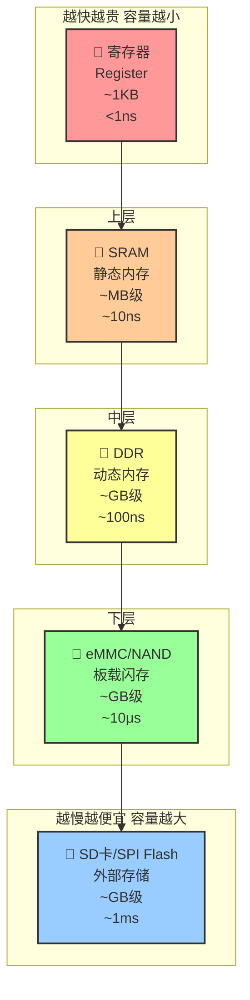
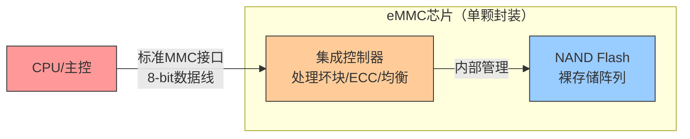

# 1.3.2 存储系统层次

> 所属章节：第1章 认识你的开发板 > 1.3 核心硬件模块详解
> 难度：[B→I] | 预计阅读时间：25分钟

## 本节导读

本节从"看得见摸得着"的存储芯片出发，带你认识嵌入式系统中从快到慢、从小到大、从贵到便宜的完整存储层次。学完本节，你将能读懂开发板上各类存储芯片的型号标识，理解为什么系统需要DDR内存才能运行，以及eMMC、SD卡、SPI Flash各自承担什么角色。

## 知识点1：存储金字塔——CPU的记忆系统 [I] ~1,200字

想象你正在做一道复杂的数学题：大脑需要同时记住当前步骤、中间结果和公式，这就是**短期记忆**；而公式本身来自课本，是**长期记忆**。CPU的工作方式与此惊人地相似——它需要一套完整的"记忆系统"来存储正在处理的数据（短期记忆）和永久保存的程序（长期记忆）。

嵌入式系统的存储层次，正是一座从快到慢、从贵到便宜的金字塔：



[图1：嵌入式系统存储金字塔——从寄存器到外部存储的速度与容量权衡]

### 各层存储的定位与类比

| 存储层级 | 典型容量 | 访问延迟 | 每GB成本 | 人体类比 | 核心作用 |
|---------|---------|---------|---------|---------|---------|
| 寄存器 | 32~64个×64bit | < 1 ns | 极贵 | 大脑瞬时记忆 | 存放当前运算的数据 |
| SRAM (片内/片外) | 256KB~8MB | ~10 ns | 很贵 | 工作台面 | Cache缓存，加速数据访问 |
| DDR 内存 | 512MB~8GB | ~100 ns | 中等 | 短期记忆 | 程序运行的主战场 |
| eMMC/NAND | 4GB~128GB | ~10 μs | 便宜 | 笔记本 | 持久存储操作系统和应用 |
| SD卡/SPI Flash | 1GB~512GB | ~1 ms | 最便宜 | 图书馆 | 可移动存储、备份、固件 |

表1：嵌入式系统存储层次对比——速度、容量、成本的全景图

### 为什么需要这么多层？

核心原因只有一个：**快的不便宜，便宜的不快**。CPU的运行速度以纳秒计，而闪存的访问速度以微秒甚至毫秒计，两者相差上千倍。如果没有中间层次的"缓冲"，CPU大部分时间都会在等待数据，造成巨大浪费。

```bash
# 在Linux开发板上查看各层存储的实际信息
# 1. 查看DDR内存容量和类型
cat /proc/meminfo | head -5

# 2. 查看CPU缓存（SRAM层）信息
lscpu | grep -E "Cache|Architecture"

# 3. 查看eMMC/SD卡存储信息
lsblk

# 4. 查看SPI Flash（如有）
cat /proc/mtd 2>/dev/null || echo "无SPI Flash分区表"
```

### 访问延迟的直观感受

如果把CPU访问寄存器的1纳秒比作1秒钟，那么：
- 访问SRAM约等于10秒（稍等一下）
- 访问DDR内存约等于100秒（一首歌的时间）
- 访问eMMC约等于2.7小时
- 访问SD卡约等于11.5天

这种巨大的速度差距，正是存储层次设计存在的根本理由。SRAM和DDR作为"中间缓冲层"，把CPU急需的数据提前准备好，就像厨师把常用调料放在手边，而非每次去仓库取。

⚠️ **陷阱**：很多初学者认为"存储空间越大系统越快"，这是错误的。决定系统流畅度的是**DDR内存的容量**和**CPU缓存的命中率**，而不是eMMC或SD卡的大小。一台64GB eMMC但只有512MB DDR的开发板，运行多任务时会非常卡顿。

💡 **提示**：在嵌入式开发中，如果程序运行缓慢，优先检查DDR内存是否足够（是否触发Swap交换），而不是盲目增加eMMC容量。运行 `free -h` 查看内存使用情况是排查性能问题的第一步。

## 知识点2：DDR内存——系统运行的"工作台" [I] ~1,000字

### 为什么系统运行"必须"有内存？

开发板上电后，CPU首先执行的BootROM代码（固化在芯片内部）非常短小，通常只有几十KB。但完整的Linux内核有几十MB，应用程序也有数MB，这些代码不可能全部放在CPU内部的寄存器或SRAM中——容量太小且成本太高。

DDR（Double Data Rate，双倍数据速率）内存就是解决这个问题的**核心工作台**：
1. 上电后，BootROM从eMMC/SD卡把Bootloader加载到DDR
2. Bootloader再把Linux内核加载到DDR
3. 内核运行后，应用程序也在DDR中执行
4. CPU通过地址总线实时读写DDR中的指令和数据

没有DDR，就像厨师没有操作台面——食材（程序）再多也无法烹饪（运行）。

### DDR3 vs DDR4 vs LPDDR4

| 参数 | DDR3 | DDR4 | LPDDR4 |
|------|------|------|--------|
| 标准电压 | 1.5V | 1.2V | 1.1V |
| 典型频率 | 800~2133 MHz | 1600~3200 MHz | 1600~4266 MHz |
| 单引脚速率 | 好 | 更好 | 与DDR4相近 |
| 功耗 | 较高 | 中等 | **低**（移动端首选） |
| 封装尺寸 | 标准BGA | 标准BGA | **更小** |
| 典型应用 | 旧款工控板 | 高性能开发板 | **手机、平板、嵌入式** |

表2：DDR内存类型对比——LPDDR4是嵌入式设备的"宠儿"

💡 **提示**：LPDDR4中的"LP"是Low Power（低功耗）的缩写。嵌入式设备常选用LPDDR4而非标准DDR4，因为它在保持性能的同时大幅降低功耗和发热，对无风扇设计的开发板尤为重要。树莓派4、Jetson Nano等热门开发板均采用LPDDR4。

### 如何读懂DDR芯片上的型号？

拿起开发板，找到那些长方形黑色小芯片，上面印着类似"K4B4G1646E"的字符。这串代码蕴含了芯片的完整规格信息。

以 **三星 K4B4G1646E** 为例拆解：

| 代码段 | 含义 | 本例值 |
|-------|------|--------|
| K4 | 三星存储芯片前缀 | 三星 |
| B | 存储类型 = DDR3 SDRAM | DDR3 |
| 4G | 芯片容量 = 4Gb（千兆比特） | 4Gb |
| 16 | 数据位宽 = ×16bit | 16bit |
| 4 | Bank数量 = 8个Bank | 8 Bank |
| 6E | 速度等级/版本 | DDR3-1866 |

### 容量计算实战

**关键公式：总容量(GB) = 芯片Gb数 ÷ 8 × 芯片数量**

K4B4G1646E 单颗容量为 **4Gb**，换算：
- 4Gb = 4 × 1024 Mb = 4096 Mb
- 4096 Mb ÷ 8 = **512 MB**（单颗容量）

如果你的开发板上有4颗这样的芯片，总容量就是：
- 512MB × 4 = **2GB**

再看另一个例子 **H5TQ4G63CFR**（海力士/Hynix）：
- H5 = 海力士
- TQ = DDR3
- 4G = 4Gb
- 63 = ×16bit，8 Bank
- CFR = 速度等级
- 单颗容量同样是 4Gb ÷ 8 = 512MB

⚠️ **陷阱**：厂商标称的"4G"可能是4Gb（比特）而非4GB（字节），两者相差8倍！购买DDR芯片或查看开发板规格书时务必确认单位是Gb还是GB。曾有开发者误以为板载"4G"内存是4GB，实际只有512MB。

🔴 **危险**：更换或升级DDR芯片时，必须严格匹配原芯片的电压（1.5V/1.35V/1.2V）、位宽和速度等级。混用不同规格的DDR会导致系统不稳定甚至烧毁芯片。DDR3与DDR4的缺口位置不同，物理上不可混插。

💡 **提示**：在Linux中运行 `dmidecode -t memory`（x86平台）或查看设备树 `/proc/device-tree/memory`（ARM平台），可以直接读取DDR的配置信息，无需手动解码芯片丝印。

## 知识点3：板载闪存——eMMC与NAND的关系 [I] ~900字

### eMMC的本质：带"管家"的NAND

在开发板上，除了DDR内存芯片，你还会看到另一颗体积较大的BGA封装芯片（通常是153球或169球），这就是**eMMC**（embedded MultiMediaCard）。

要理解eMMC，先认识它的"内核"——**NAND Flash**：
- NAND Flash是一种非易失性存储器，断电后数据不丢失
- 它的存储单元以"块"为单位组织，读写特性与DDR完全不同
- 写入前必须先擦除（Erase），擦除单位是较大的"块"（通常128KB~2MB）
- 每个块的擦写次数有限（SLC约10万次，MLC约5000次，TLC约1000次）
- 裸NAND直接暴露给主控使用时，需要主控处理坏块管理、ECC校验、磨损均衡等复杂逻辑

eMMC的聪明之处，是在NAND Flash上叠加了一个**集成控制器**：



[图2：eMMC内部架构——控制器为CPU屏蔽了NAND的复杂性]

| 特性 | 裸NAND Flash | eMMC |
|------|-------------|------|
| 接口复杂度 | 高（需处理时序、命令队列） | 低（标准MMC/SD协议） |
| 坏块管理 | 主控负责 | **控制器自动处理** |
| ECC校验 | 主控实现 | **控制器内置** |
| 磨损均衡 | 主控实现 | **控制器自动处理** |
| 驱动开发量 | 大（需适配不同NAND） | 小（通用MMC驱动） |
| 开发板选型 | 较少见 | **主流方案** |

表3：裸NAND vs eMMC——为什么eMMC成为嵌入式开发板的"标配"

### 为什么eMMC更常用？

嵌入式开发板选择eMMC而非裸NAND，核心原因是**降低系统设计复杂度**：

1. **硬件简化**：CPU只需引出标准MMC接口（CMD + CLK + 8根DAT线），无需直连NAND的复杂控制线（CLE、ALE、RE、WE、IO0~IO7等十几根线）
2. **软件简化**：Linux内核已有成熟的mmc子系统，eMMC驱动基本"开箱即用"；裸NAND需要针对不同厂商、不同工艺的芯片定制驱动
3. **可靠性提升**：专业控制器实现的磨损均衡算法，通常优于各厂商自行实现的方案，能有效延长存储寿命
4. **升级便捷**：同容量的eMMC可以来自不同厂商，控制器兼容层屏蔽了底层差异，供应链更灵活

💡 **提示**：eMMC和SD卡在协议层面同根同源（都基于MMC标准）。理解这一点有助于融会贯通——Linux中它们都被`mmcblk`设备节点管理。eMMC通常是`mmcblk0`，SD卡插入后可能是`mmcblk1`。

### eMMC容量标识解读

eMMC芯片上的型号（如KLM8G1GETF）遵循类似DDR的编码规则：
- **KLM**：三星eMMC前缀
- **8G**：容量 = 8GB（这里注意是GB，不是Gb！）
- **1G**：工艺世代
- **ETF**：封装和速度等级

常见的eMMC容量等级：4GB、8GB、16GB、32GB、64GB、128GB。对于运行完整Linux系统的开发板，**8GB是起步配置**，16GB较为舒适。

⚠️ **陷阱**：eMMC容量标注通常直接使用GB（如8GB、16GB、32GB），而DDR芯片标注使用Gb。阅读数据手册时务必看清单位！曾有工程师把DDR的"4Gb"当成"4GB"下单，导致实际容量只有预期的1/8。

## 知识点4：外部存储接口——SD卡槽与SPI Flash座 [B] ~600字

开发板边缘通常预留一些可插拔或焊接的存储扩展位置，最常见的有两种。

### SD卡槽：可移动的"系统盘"与数据仓库

SD卡槽几乎是最醒目的外部存储接口，它的设计目的非常明确：

**1. 作为系统启动介质**
很多嵌入式开发板支持从SD卡启动。这在开发调试阶段极其便利——你可以：
- 在PC上编译好系统镜像，直接写入SD卡
- 插入开发板即可启动测试
- 刷坏了系统？换张SD卡重新来过，无需触碰板载eMMC
- 对比测试不同版本的系统，只需准备多张SD卡

**2. 作为可移动数据存储**
现场采集的数据（日志、图像、音频）可以写入SD卡，方便取出后在PC上分析。这比通过网络传输更直接可靠。

💡 **提示**：SD卡按速度分为Class 2/4/6/10和UHS-I/II/III等级。嵌入式启动建议至少Class 10（10MB/s写入）或UHS-I，否则系统启动会很慢。Class 4的卡启动Linux可能需要几分钟，而Class 10只需几十秒。

⚠️ **陷阱**：SD卡的寿命受写入次数限制（典型的TLC颗粒约1000~3000次全盘写入）。不要把SD卡当作持续写入的循环日志存储，否则会很快损坏。对于高频写入场景，使用eMMC或外接SSD更可靠。工业应用应选用专门的"高耐久"（High Endurance）SD卡。

### SPI Flash座：小容量固件的"保险箱"

SPI Flash是一种通过SPI总线连接的NOR Flash，容量通常只有 **2MB~32MB**，看似很小，但它的独特价值在于：

**1. 存放Bootloader或固件**
很多开发板用SPI Flash存放SPL（Secondary Program Loader，二级加载器）或U-Boot。上电后CPU从SPI Flash加载第一级启动代码，再由它初始化DDR并加载后续系统。

**2. 独立可靠**
SPI Flash是NOR型，支持按字节寻址，读取稳定可靠。即使板载eMMC损坏或系统镜像被破坏，只要SPI Flash正常，系统仍有机会启动到恢复模式或U-Boot命令行进行修复。

**3. 成本低**
对于只需要几MB存储空间的简单应用（如单片机级别的裸机程序），SPI Flash比eMMC便宜得多，且不需要复杂的eMMC控制器。

```bash
# 在Linux中查看SPI Flash分区（如果存在）
cat /proc/mtd
dev:    size   erasesize  name
mtd0: 00080000 00010000 "spl"
mtd1: 00100000 00010000 "uboot"
mtd2: 00010000 00010000 "env"
```

上面的输出显示了一个典型的SPI Flash分区：256KB放SPL，1MB放U-Boot，64KB放环境变量。

🔴 **危险**：SPI Flash的擦写次数通常只有10万次左右，且擦除必须以整个扇区（如64KB）为单位。频繁擦写某个区域会导致该区域提前磨损失效。不要在SPI Flash上实现高频率的日志写入。修改U-Boot环境变量时也要节制。

💡 **提示**：如果你看到开发板上有8脚的小型芯片（通常为SOP-8或WSON-8封装），那很可能就是SPI Flash。常见的型号前缀有W25Q（华邦）、MX25L（旺宏）、GD25Q（兆易创新）等，容量标识中数字直接表示Mb（如W25Q128 = 128Mb = 16MB）。

## 本节总结

| 概念 | 核心要点 | 实操检查 |
|------|---------|---------|
| 存储金字塔 | 速度越快越贵容量越小，分层设计平衡性能与成本 | 用`lscpu`和`lsblk`查看本机存储层次 |
| DDR内存 | 系统运行的"工作台"，程序必须在DDR中才能执行 | 读芯片丝印计算总容量，确认电压匹配 |
| eMMC | 带控制器的NAND，简化软硬件设计 | 用`lsblk`查看`/dev/mmcblk*`设备 |
| SD卡 | 可移动启动介质和数据存储，注意速度和寿命 | 选用Class 10以上，避免高频循环写入 |
| SPI Flash | 小容量可靠存储，适合放Bootloader | 查看`/proc/mtd`了解分区布局 |

## 下一步

认识了存储系统的层次后，接下来你将学习1.3.3节——**电源管理与时钟树**，理解为什么开发板需要多个电压等级的电源芯片，以及晶振和PLL如何为整个系统提供"心跳节拍"。

---

## 配套资源

### 表格清单
- 表1：嵌入式系统存储层次对比（速度、容量、成本、用途）
- 表2：DDR内存类型对比（DDR3/DDR4/LPDDR4）
- 表3：裸NAND vs eMMC特性对比
- 表4：DDR芯片型号拆解（K4B4G1646E示例）

### 图示清单
- 图1：嵌入式系统存储金字塔 [mermaid图]
- 图2：eMMC内部架构（控制器+ NAND Flash） [mermaid图]

### 代码清单
- 代码1：查看存储层次信息的Linux命令（meminfo/lscpu/lsblk/mtd）
- 代码2：查看SPI Flash分区表的命令
