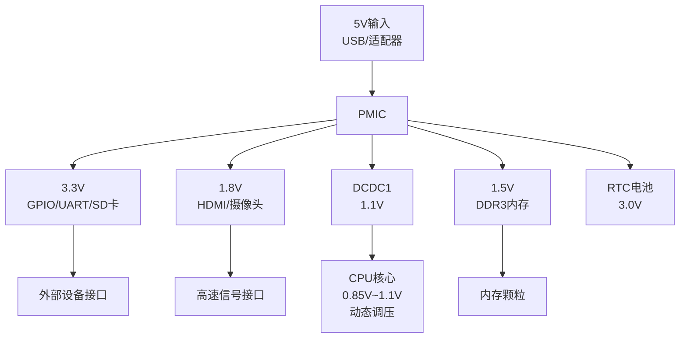
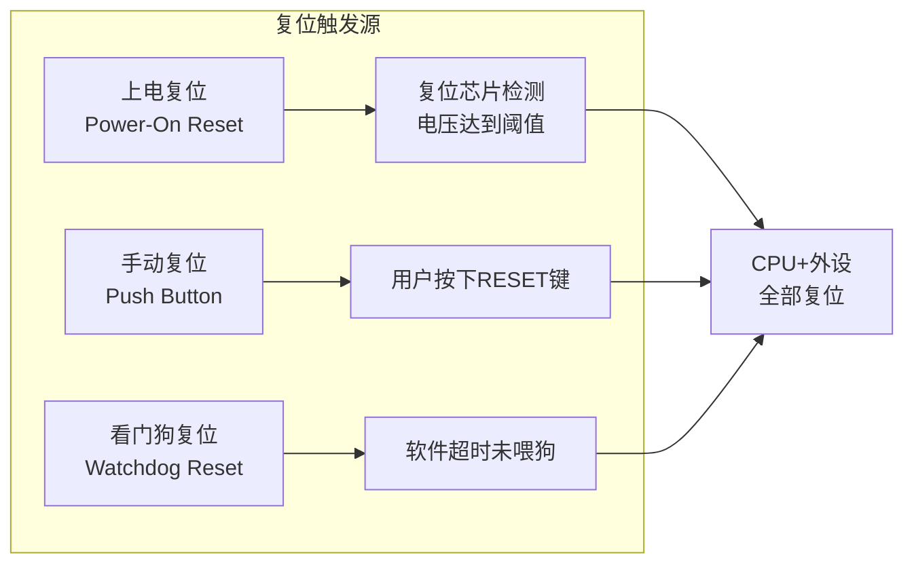

# 1.3.3 电源与时钟系统

> 所属章节：第1章 认识你的开发板 > 1.3 核心硬件模块详解
> 难度：[B→I] | 预计阅读时间：18分钟

## 本节导读

本节带你认识开发板上"看不见的两条生命线"——电源和时钟。学完本节，你能看懂电源树的电压分配逻辑、理解为什么一颗24MHz晶振能驱动1GHz的CPU，以及学会正确使用复位按键。

## 知识点23：电源树（Power Tree） [I] ~800字

想象你搬进一个新家，入户只有一根220V的总线，但家里需要给空调、冰箱、手机充电器、LED灯提供不同电压。这时你需要配电箱：220V→空调专线、220V→插座、220V→照明回路。

开发板的供电原理一模一样。**PMIC（Power Management IC，电源管理芯片）** 就是开发板上的"配电箱"。它接收一个外部输入电压（通常是5V，来自USB或电源适配器），然后产生多路不同的电压，分别送给CPU、内存、GPIO、网口等不同模块。

### 为什么需要PMIC？

不同芯片需要不同的"饭量"（电压）：
- **DDR内存** 吃1.5V或1.35V的"细粮"
- **CPU核心** 吃0.85V~1.1V的"精密餐"
- **GPIO引脚** 吃3.3V的"标准餐"
- **HDMI接口** 吃1.8V的"小灶"

如果你不给每个芯片喂对电压，轻则工作不稳定，重则直接烧毁。PMIC的作用就是**一颗芯片管理所有电源**，精确配餐。

### 电源树的层次结构

以典型的ARM开发板为例，电源从外到内逐级降压：

[图1：电源树框图]



*图1：典型开发板电源树框图——5V输入经PMIC分配为多路电压*

### 各电压的用途

| 电压值 | 供电对象 | 允许偏差 | 备注 |
|--------|----------|----------|------|
| 5V | 整机输入 | ±5% | USB Type-C/DC接口输入 |
| 3.3V | GPIO、UART、SD卡、SPI Flash | ±3% | 最常用的外设电压 |
| 1.8V | HDMI、摄像头CSI、eMMC | ±3% | 高速信号接口电平 |
| 1.5V / 1.35V | DDR3 / DDR3L内存 | ±2% | 内存对电压极其敏感 |
| 1.1V→0.85V | CPU核心（DVFS） | ±1% | 动态调压， idle时降压省电 |
| 3.0V | RTC实时时钟 | — | 纽扣电池备用供电 |

*表1：开发板常见电压分配表*

### 操作步骤：查看当前电压

Linux内核通过 **regulator** 子系统管理PMIC。你可以查看各路电压状态：

```bash
# 查看内核日志中PMIC的初始化信息
dmesg | grep -i "regulator\|pmic\|power"

# 查看已注册的电压调节器
ls /sys/class/regulator/

# 查看某一路电压的名称和状态（以regulator.0为例）
cat /sys/class/regulator/regulator.0/name
cat /sys/class/regulator/regulator.0/microvolts
```

### 常见错误

⚠️ **错误1：用3.3V给1.8V接口供电**

> 某同学把传感器接到I2C接口，但传感器的VCC接了3.3V，而开发板I2C引脚是1.8V电平。结果：传感器一直无法识别，且长时间运行后接口芯片发热异常。
>
> **正确做法**：接外设前，先查原理图确认对应GPIO组的IO电平（通常是3.3V或1.8V bank）。

⚠️ **错误2：忽略上电时序**

> CPU核心必须在内存之前上电，否则CPU启动时找不到内存。PMIC内部已经固化了这个时序，但如果手动外接电源替代PMIC，顺序错了会导致系统无法启动。
>
> **正确做法**：非极端调试场景，不要绕过PMIC手动供电。

💡 **提示**：很多开发板上有**电源指示灯**（通常是红色LED）。上电后先观察这个灯——灯不亮，说明5V都没进来；灯亮但系统不跑，说明PMIC后面的某一路电压有问题。

## 知识点24：时钟源 [I] ~700字

如果把CPU比作心脏，**时钟**就是心跳。每"跳"一下，CPU执行一步操作。心跳越快，CPU跑得越快——但心跳也不能无限快，否则"心脏"会罢工。

### 晶振：系统的"心跳发生器"

开发板上能看到一个小小的银色金属壳元件，上面印着"24.000"或"32.768"，这就是**晶振（Crystal Oscillator）**。它利用石英晶体的压电效应，产生非常稳定的周期性电信号。

但这里有个矛盾：
- 晶振频率通常只有 **24MHz** 或 **32.768kHz**
- CPU主频却高达 **1GHz** 甚至更高

24MHz 怎么变成 1GHz？答案是 **PLL（Phase-Locked Loop，锁相环）**。

### PLL：频率的"倍增器"

PLL是一个硬件电路，它的作用可以理解为"频率倍增器"：

[图2：PLL倍频原理示意图]

1. 晶振提供24MHz的基准频率（非常稳定但太慢）
2. PLL将这个频率乘以一个整数倍（如 ×40 = 960MHz，接近1GHz）
3. 输出高频时钟送给CPU核心

倍频系数不是随便设的——它由**时钟初始化代码**（通常在U-Boot或TF-A中）写入PLL配置寄存器。不同运行场景下，系统会动态切换PLL倍频系数，实现"降频省电"或"超频性能"。

### 为什么需要多个晶振？

一块开发板上通常有2~3颗晶振，因为它们各司其职：

| 晶振频率 | 典型用途 | 精度要求 | 特点 |
|----------|----------|----------|------|
| 24MHz | 主系统时钟源 | ±30ppm | 经PLL倍频后供给CPU、总线 |
| 32.768kHz | RTC实时时钟 | ±20ppm | 超低功耗，掉电后由电池维持 |
| 25MHz | 以太网PHY | ±50ppm | 独立供给网口，避免与主时钟耦合 |

*表2：开发板常见晶振对比表*

💡 **提示**：32.768kHz 不是随便选的数字。32768 = 2¹⁵，这个数值可以被2的幂次精确分频，最容易产生1秒脉冲，是RTC芯片的行业标准频率。

### 操作步骤：查看系统时钟频率

```bash
# 查看CPU当前运行频率（Linux内核cpufreq子系统）
cat /sys/devices/system/cpu/cpu0/cpufreq/scaling_cur_freq

# 查看CPU支持的所有频率档位
cat /sys/devices/system/cpu/cpu0/cpufreq/scaling_available_frequencies

# 查看当前使用的时钟源
cat /sys/devices/system/clocksource/clocksource0/current_clocksource
```

💡 **提示**：`scaling_cur_freq` 显示的数值单位是 **kHz**。如果看到 `1008000`，表示当前CPU运行在 1008MHz（约1GHz）。

### 常见错误

⚠️ **错误：以为晶振坏了导致系统不启动**

> 系统不启动时，初学者常怀疑晶振问题。实际上，主晶振损坏的概率极低。更常见的是：电源不稳、DDR焊接不良、SD卡接口虚焊。
>
> **排查建议**：用示波器测量晶振两引脚，应该有漂亮的正弦波（幅度约0.5V~1V）。如果没有波形，再怀疑晶振或起振电容。

## 知识点25：复位电路 [B] ~500字

复位（Reset）就是让CPU从"头"开始执行程序——相当于电脑的重启按钮。开发板上有三种复位方式，效果各不相同。

### 三种复位方式对比

[图3：三种复位方式的触发源与影响范围]



*图3：三种复位方式的触发源——最终结果都是CPU重新从启动地址执行*

| 复位类型 | 触发条件 | 复位范围 | 数据是否保留 | 典型场景 |
|----------|----------|----------|-------------|----------|
| 上电复位 | 电源从0V上升到稳定值 | 全局 | 全部丢失 | 第一次上电 |
| 手动复位 | 按下RESET按键 | 全局 | 内存丢失，Flash保留 | 程序卡死 |
| 看门狗复位 | 软件喂狗超时 | 全局 | 内存丢失，Flash保留 | 系统死锁自恢复 |

*表3：三种复位方式对比表*

### 上电复位（Power-On Reset, POR）

当你插上电源线的那一刻，电压从0V慢慢爬升到5V。这个过程中，电压会有抖动，CPU不能在这些"不稳定"的阶段开始工作。**复位芯片**（一个几毛钱的小器件，如MAX809）会持续监控电压，等所有电压都稳定后，再释放复位信号，CPU才开始执行第一条指令。

🔴 **危险**：如果快速反复插拔电源（"暴力重启"），电压抖动可能导致eMMC或SD卡中的文件系统损坏，就像电脑断电导致硬盘数据丢失一样。

### 手动复位

开发板上有一个标着 **RESET** 或 **RST** 的小按键。按下时，CPU的复位引脚被拉低，松开后CPU重新开始执行。

⚠️ **陷阱**：RESET按键不是"暂停键"，按下时CPU是彻底重启的，内存中的数据全部清零。如果你正在调试程序，按下RESET后，之前设置的断点、变量值都不存在了。

### 看门狗复位

看门狗（Watchdog）是CPU内部的一个定时器。系统正常工作时，软件需要定期"喂狗"（重置定时器）。如果程序卡死，软件无法喂狗，定时器超时后会自动触发复位——这是嵌入式系统的"自恢复保险"。

💡 **提示**：在Linux中，看门狗通常由 `watchdog` 内核模块管理。开发调试时，如果系统频繁无故重启，可能是看门狗超时时间设置太短，或某个内核模块阻塞了喂狗进程。

## 本节总结

本节围绕开发板的"生命线"——电源与时钟，讲解了三个核心概念：

| 概念 | 核心要点 | 实操建议 |
|------|----------|----------|
| 电源树 | PMIC将5V分配为多路电压，每路对应不同模块 | 外接设备前先确认IO电平是3.3V还是1.8V |
| 时钟源 | 低频晶振（24MHz）经PLL倍频到高频（1GHz） | 用 `scaling_cur_freq` 查看当前CPU频率 |
| 复位电路 | 上电复位、手动复位、看门狗复位三种方式 | 优先使用手动复位，避免暴力断电 |

记住两个数字：**24MHz** 是晶振的心跳，**5V** 是电源的入口。它们经过各自的"转换器"后，才变成CPU能用的1GHz和0.85V。

## 下一步

1.3.4节将介绍 **存储系统（eMMC、SD卡、SPI Flash）**，你会发现存储芯片的供电电压（3.3V或1.8V）和时钟频率（SDR/DDR模式）与本节内容紧密相关——读数据的速度，既取决于时钟，也取决于电压驱动的信号质量。

---

## 配套资源

### 表格清单
- 表1：开发板常见电压分配表——5V输入到各路输出的用途与精度
- 表2：开发板常见晶振对比表——24MHz主时钟、32.768kHz RTC时钟、25MHz网口时钟
- 表3：三种复位方式对比表——触发条件、复位范围、数据保留情况

### 图示清单
- 图1：典型开发板电源树框图（mermaid图）——5V→PMIC→多路电压输出的层级关系
- 图2：PLL倍频原理示意图——24MHz晶振如何通过PLL倍频为1GHz CPU主频
- 图3：三种复位方式的触发源与影响范围（mermaid图）——上电/手动/看门狗的触发路径

### 代码清单
- 代码1：查看PMIC和regulator信息的Shell命令（`dmesg | grep regulator`、`cat /sys/class/regulator/...`）
- 代码2：查看CPU当前频率和可用频率档位的Shell命令（`cat scaling_cur_freq`、`cat scaling_available_frequencies`）
