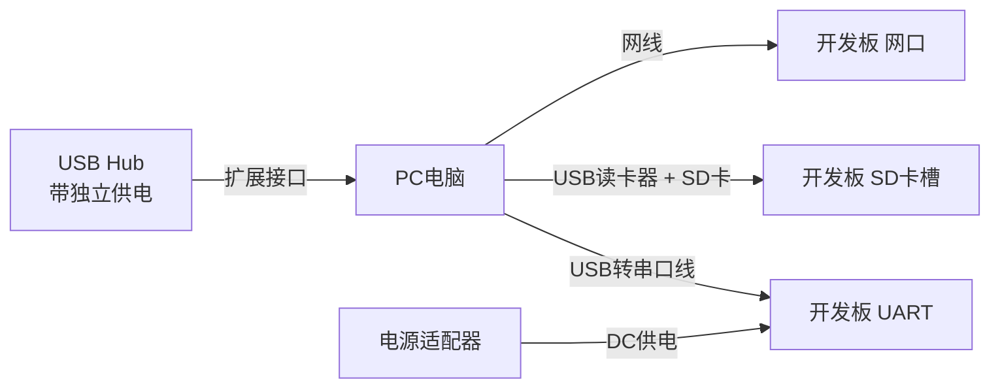

# 1.4.1 必备硬件工具

> 所属章节：第1章 认识你的开发板 > 1.4 开发环境准备
> 难度：[B→I] | 预计阅读时间：30分钟

## 本节导读

本节带你从"认识硬件"过渡到"动手准备"，逐一讲解嵌入式Linux开发真正需要的硬件工具——电源怎么选、串口线怎么买、还需要哪些小配件。学完本节，你将拥有一份可直接照着买的硬件清单。

## 开发板连接关系总览

在深入每个工具之前，先看看典型的开发环境长什么样。你的PC需要通过哪些线缆与开发板建立联系？



**图1：开发板硬件连接关系总览** [mermaid图]

如上图所示，一个完整的嵌入式开发工作站至少需要四类连接：电源、串口、网络、存储。接下来我们逐一讲解。

---

## 知识点26：电源适配器选择：电压、电流、接口规格的匹配 [B] ~1,000字

电源是开发板的"心脏"，也是新手最容易踩坑的地方。选错电源不是"能不能用"的问题，而是"会不会冒烟"的问题。

### 如何读懂电源适配器的参数

拿起任何一个电源适配器，标签上通常会印有这样一行字：

```
OUTPUT: DC 5V === 2A
或
输出：直流 5V ⎓ 2A
```

这行字包含三个关键信息：

| 参数 | 含义 | 对开发板的影响 |
|------|------|----------------|
| **DC** | 直流电（Direct Current） | 开发板只能用直流电，不能直接用交流电 |
| **5V** | 输出电压为5伏特 | **必须严格匹配**开发板的标称电压 |
| **2A** | 最大输出电流为2安培 | 只要 **≥** 开发板最大需求即可，越大越有裕量 |

> 💡 **一句话记住**：电压必须**相等**，电流必须**大于或等于**。

### 为什么电压必须匹配？

这是一个非常反直觉的事实：**电源标称5V，实际空载电压可能是5.2V；标称12V的电源，实际输出约12.5V**。电子元件对电压极为敏感：

- 开发板设计为5V供电，内部降压芯片把5V转成3.3V给CPU用
- 如果你插了12V电源，降压芯片会直接过载烧毁，甚至波及周边电路
- 反过来说，5V板子用3.3V供电，板子根本启动不了，串口没任何输出

🔴 **危险：电压不匹配 = 烧板**  
**绝对禁止**用12V电源给5V开发板供电。这不是"性能下降"的问题，而是几分钟内就能看到焦糊味的问题。如果手头只有不匹配的电源，**宁可不买板子，也不要冒险上电**。

### 电流的选择：为什么要留有余量？

假设你的开发板手册写着 "典型功耗 500mA，峰值 1A"，你该选多大的电源？

**正确做法**：选 **2A 或更高** 的电源。

原因有三：
1. **启动峰值**：开发板上电瞬间，电容充电、芯片初始化，电流会瞬间飙升到峰值
2. **外设扩展**：你很快会插上USB鼠标、U盘、摄像头，每一个都在额外消耗电流
3. **电源老化**：适配器使用久了实际输出能力下降，留有裕量可以延长稳定工作年限

公式很简单：

```
电源标称电流 ≥ 开发板峰值电流 × 1.5
```

例如板子峰值1A，那选1.5A~2A的电源最合适。

### USB供电 vs DC适配器供电

| 供电方式 | 适用场景 | 优点 | 缺点 |
|----------|----------|------|------|
| USB供电（电脑USB口） | 临时调试、低功耗板子 | 方便，无需额外电源 | 电流受限（500mA~900mA），不稳定 |
| USB供电（手机充电头） | 小型开发板长期运行 | 随处可得 | 质量参差不齐，电压可能不准 |
| DC适配器供电 | 绝大多数正式开发场景 | 电流充足、电压稳定 | 需确认接口和极性 |

💡 **提示**：正式调试一律使用DC适配器供电。USB供电仅在 "确认板子没问题，临时跑个小程序" 时使用。

### 操作步骤：检查你的开发板电源需求

1. **查看开发板参数**：翻到开发板手册的第一页或背面丝印，找到 `Power Supply`（电源输入）信息。常见写法有：
   - `5V/2A` — 5伏特、2安培
   - `DC 12V/3A` — 直流12伏特、3安培
   - `5V via Micro-USB` — 通过Micro-USB供电

2. **确认接口规格**：检查电源接口类型，常见有：
   - DC圆口（外径5.5mm，内径2.1mm或2.5mm）
   - Type-C 接口
   - Micro-USB 接口

3. **核对极性**：DC圆口需要确认**内正外负**还是**内负外正**。绝大多数开发板为内正外负，但务必以手册为准。

### 代码示例：查看树莓派电源要求
```bash
# 以下信息来自 Raspberry Pi 4 官方文档
# 供电要求：5V / 3A (Type-C接口)
# 注意：使用低电流电源会导致USB设备无法工作或系统不稳定
```

### 常见错误

⚠️ **陷阱：用12V电源给5V板子供电**  
这会把开发板直接烧毁。如果手头没有匹配的电源，**宁可用USB临时供电，也不要混用电源**。

🔴 **危险：忽视电源极性**  
DC圆口插反极性轻则烧坏电源芯片，重则烧毁整个主板。不确定时，用万用表测一下。

💡 **提示：USB供电的隐藏问题**  
电脑USB 2.0口通常只提供500mA，USB 3.0口约900mA。如果开发板标称需要1A以上，**不要依赖电脑USB口**，请使用独立电源适配器或带额外供电的USB Hub。

[图2：电源适配器参数标签特写，标注电压、电流、极性符号]

---

## 知识点27：USB转串口线：识别芯片与安装驱动 [B] ~800字

串口（Serial Port，也叫UART口）是嵌入式开发最重要的调试通道。开发板启动时的所有启动信息都会从串口输出，没有串口线，你就如同闭着眼睛调试。由于现代电脑不再配备物理串口，我们需要一根 **USB转串口线**（也叫USB转TTL线、USB转UART线）来连接。

### 三种主流芯片对比

市面上的USB转串口线主要使用三种芯片方案：

| 芯片型号 | 厂商 | 价格 | 驱动安装难度 | 稳定性 | 最高波特率 |
|----------|------|------|--------------|--------|------------|
| CH340 | 南京沁恒 | 最低（<10元） | 简单 | 一般 | 2Mbps |
| CP2102 | Silicon Labs | 中等（10-20元） | 简单 | 良好 | 1Mbps |
| FT232 | FTDI | 较高（20-40元） | 需手动 | 优秀 | 3Mbps |

> 💡 **提示**：初学者建议直接买 **CH340** 或 **CP2102** 的线，便宜够用。如果你经常做高速数据传输，再考虑FT232。

### 如何识别你的转串口线用的是什么芯片

拿到转串口线后，有三种方法确认芯片型号：

**方法1：看产品标题/包装**  
电商平台购买时，标题通常会写 "USB转TTL CH340模块" 或 "CP2102串口线"。

**方法2：看PCB上的丝印**  
把线拿近看，芯片表面通常印有型号，如 `CH340G`、`CP2102`、`FT232RL`。

**方法3：插上电脑看系统识别（最可靠）**  

### 操作步骤：安装驱动并验证

**Windows 系统：**

1. 将USB转串口线插入电脑USB口
2. 打开"设备管理器" → 查看"端口(COM和LPT)"
3. 如果出现黄色感叹号，说明需要手动安装驱动
4. 根据芯片型号下载对应驱动：
   - CH340：搜索 "CH340驱动 沁恒官网"
   - CP2102：搜索 "CP2102驱动 Silicon Labs"
   - FT232：搜索 "FTDI VCP驱动"
5. 安装完成后，设备管理器中应显示 `USB-SERIAL CH340 (COM3)` 之类的条目

**Linux 系统（Ubuntu/Debian）：**

```bash
# 插入转串口线后，查看系统日志识别
$ dmesg | tail -20
[ 1234.567] usb 1-2: new full-speed USB device number 5 using xhci_hcd
[ 1234.678] usb 1-2: New USB device found, idVendor=1a86, idProduct=7523
[ 1234.789] usbcore: registered new interface driver ch341
[ 1234.890] usbserial: USB Serial support registered for ch341-uart
[ 1234.901] ch341 1-2:1.0: ch341-uart converter now attached to ttyUSB0

# 确认设备节点已生成
$ ls -l /dev/ttyUSB*
/dev/ttyUSB0
```

💡 **提示**：现代Linux内核（5.x以上）通常已内置CH340/CP2102/FT232驱动，**即插即用**。

**Mac 系统：**

Mac通常也内置支持。插入后打开终端运行 `ls /dev/tty.usbserial*` 即可看到设备。

### 常见错误

⚠️ **陷阱：买了RS232电平的串口线**  
电脑用的RS232电平是 ±12V，而开发板串口是 3.3V TTL电平。如果直接连接会烧坏开发板！**务必购买标注 "USB转TTL" 或 "3.3V电平" 的线**。

⚠️ **陷阱：驱动装不上，原来是用了盗版FT232芯片**  
某些廉价FT232线是盗版芯片，新版Windows驱动会将其识别为 "FT232R USB UART" 但无法正常工作。遇到这种情况，建议直接换一根CH340线。

---

## 知识点28：网线、SD卡读卡器等其他辅助工具 [B] ~600字

除了电源和串口线，以下几样工具也是开发过程中的常客，提前准备好能让调试过程顺畅很多。

### 网线：网络调试的桥梁

以太网是嵌入式Linux开发板最常用的高速通信方式，一根网线的作用远超你的想象：

- **TFTP/NFS 启动**：通过网络加载内核和根文件系统，无需反复烧录SD卡
- **SSH 远程登录**：不用串口也能登录开发板执行命令
- **scp 传输文件**：电脑和开发板之间快速拷贝文件

**规格建议**：普通 Cat5e（超五类）网线即可，长度1~3米，带水晶头。如果你的电脑没有网口，再准备一个 **USB转网口适配器**。

### SD卡读卡器：烧录镜像的必备

绝大多数开发板支持从SD卡启动。烧录系统镜像到SD卡，有两种方式：

1. **USB读卡器 + 电脑烧录**：最常用，兼容性好
2. **开发板自带的SD卡槽直连电脑**（部分开发板支持USB Mass Storage模式）

💡 **提示**：建议买一个 **USB 3.0高速读卡器**，烧录8GB镜像时，USB 2.0可能需要半小时，而USB 3.0只要几分钟。

### USB Hub：扩展你的接口

开发过程中，PC通常需要同时连接：
- USB转串口线（1个口）
- USB读卡器（1个口）
- USB转网口（可能没有多余网口，再占1个）
- 给开发板供电的USB线（1个口）

轻薄笔记本的USB口往往不够。**买一个带独立供电的USB 3.0 Hub**（注意：要外接电源的那种），能解决所有接口焦虑。

⚠️ **陷阱：不要用无源USB Hub给开发板供电**  
不带额外电源的USB Hub会把一个USB口的电流分给多个设备。如果Hub上接了一堆设备，开发板可能因供电不足反复重启。

| 工具 | 用途 | 选购建议 | 优先级 |
|------|------|----------|--------|
| 网线（Cat5e） | 网络调试、NFS启动 | 长度2米，带水晶头 | 必需 |
| SD卡读卡器 | 烧录系统镜像 | USB 3.0高速款 | 必需 |
| USB Hub（带供电） | 扩展USB接口 | 4口以上，独立电源适配器 | 推荐 |
| Type-C数据线 | 部分新板子供电/调试 | 支持数据传输（非充电-only） | 按需 |
| 杜邦线（母对母） | 临时连接GPIO | 一排40根，多色 | 推荐 |

[图3：常见辅助工具实物排列 — 网线、USB读卡器、USB Hub、杜邦线]

---

## 知识点29：万用表：验证供电的"火眼金睛"（可选） [B] ~400字

万用表是所有电子工程师的"听诊器"。对于初学者来说，你不需要花几百块买高端表，一个 **30~50元的入门级数字万用表** 就够用了。它能帮你做一件至关重要的事：**验证供电是否真的正常**。

### 万用表测直流电压的操作步骤

1. **选择档位**：将旋钮拨到直流电压档（标有 `DCV` 或 `V⎓`），选择比待测电压稍大的量程（测5V选20V档）
2. **插入表笔**：红表笔插入 `VΩmA` 孔，黑表笔插入 `COM` 孔
3. **测量电源适配器输出**：
   - 红表笔接触DC插头中心（正极）
   - 黑表笔接触DC插头外壁（负极/地）
   - 读数应在标称电压的 ±5% 范围内（5V电源读4.75V~5.25V都算正常）
4. **测量开发板上的电压**：开发板通电后，找板子上的 `3.3V` 或 `5V` 测试点，黑表笔接 `GND`（地），红表笔接电压测试点

### 典型验证场景

```
场景1：开发板通电后无任何反应（电源灯不亮）
→ 用万用表测电源适配器输出，看是不是适配器坏了

场景2：串口有乱码
→ 测开发板3.3V测试点，如果只有2.1V，说明供电不足，电压被拉低了

场景3：开发板插上USB设备就重启
→ 测5V rail在带载时的电压，如果掉到4.3V以下，说明电源功率不够
```

🔴 **危险：不要测带电的220V交流电！**  
初学者用万用表只测直流低压（5V、3.3V）即可。如果需要测市电，务必在专业人员指导下操作。

⚠️ **陷阱：选错档位烧保险丝**  
如果误将表笔插在电流档（`A` 或 `mA`）去测电压，可能烧坏万用表保险丝。测电压前确认红表笔插在 `VΩ` 孔。

[图4：万用表测量开发板3.3V测试点的示意图，红表笔接测试点，黑表笔接GND螺丝孔]

---

## 本节总结

本节介绍了嵌入式Linux开发的四大类必备硬件工具。下面用一张总表帮你快速梳理：

| 工具类别 | 核心要点 | 关键检查项 | 常见翻车点 |
|----------|----------|------------|------------|
| 电源适配器 | 电压必须匹配，电流留余量 | 电压、电流、接口极性 | 12V插5V板；极性接反；电流不够 |
| USB转串口线 | CH340/CP2102性价比最高 | 芯片型号、驱动安装、电平标准 | 买成RS232电平；盗版FT232芯片 |
| 网线/读卡器/Hub | 网络调试和镜像烧录的基础 | 网线连通性、读卡器速度、Hub是否带供电 | 用无源Hub导致供电不足 |
| 万用表 | 验证供电是否正常的终极手段 | 直流电压档、红黑表笔接法 | 测电压时表笔插在电流孔 |

学完本节，你应该已经：
1. ✅ 能读懂电源适配器的参数标签，选出匹配的电源
2. ✅ 能识别USB转串口线的芯片型号，并完成驱动安装
3. ✅ 知道需要准备哪些辅助工具
4. ✅ 了解万用表测电压的基本方法（可选）

---

## 下一步

硬件工具准备就绪后，接下来进入 **1.4.2 必备软件工具**，我们将安装：
- 串口终端工具（PuTTY/Minicom/Screen）
- TFTP服务器和NFS服务器
- 交叉编译工具链
- 镜像烧录工具（如 balenaEtcher）

这些软件工具配合本节准备的硬件，才能构成完整的开发环境。

---

## 配套资源

### 表格清单
- 表1：三种USB转串口芯片对比（CH340 / CP2102 / FT232）
- 表2：辅助工具选购清单（网线 / SD卡读卡器 / USB Hub / 杜邦线）
- 表3：本节总结检查表（核心要点与翻车点对照）

### 图示清单
- 图1：开发板硬件连接关系总览 [mermaid图]
- 图2：电源适配器参数标签特写，标注电压、电流、极性符号 [配图说明]
- 图3：常见辅助工具实物排列 [配图说明]
- 图4：万用表测量开发板电压示意图 [配图说明]

### 代码清单
- 代码1：`dmesg` 查看Linux系统识别CH340串口设备
- 代码2：万用表典型验证场景速查
