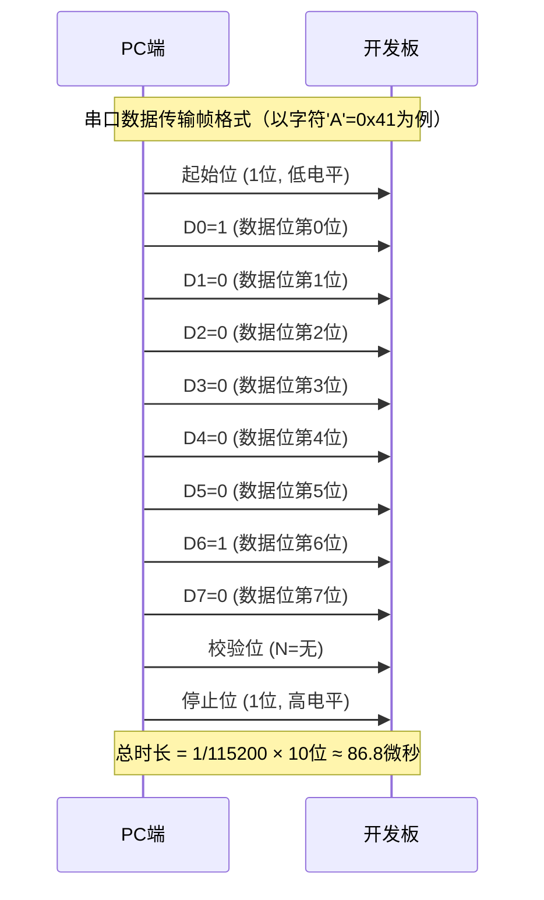

# 1.4.2 PC端软件环境

> 所属章节：第1章 认识你的开发板 > 1.4 开发环境准备
> 难度：[B] | 预计阅读时间：25分钟

## 本节导读

本节介绍PC端与开发板通信必备的串口终端工具。学完本节，你将能够在Windows、Linux或Mac上安装串口驱动、选择合适的终端工具，并正确配置115200 8N1参数与开发板建立连接。

---

## 知识点30：串口终端工具选择 [B] ~900字

嵌入式开发中，开发板通常没有独立的显示器和键盘，我们需要通过"串口"让PC充当开发板的"屏幕"和"键盘"——在PC上输入命令，开发板执行后把结果回显到PC屏幕上。实现这个功能的软件就是**串口终端工具**（Serial Terminal）。

### 各平台主流工具介绍

**Windows平台**

| 工具 | 特点 | 推荐指数 | 获取方式 |
|------|------|----------|----------|
| MobaXterm | 功能全能，内置串口+SSH+SFTP，标签页管理 | ⭐⭐⭐⭐⭐ | 官网免费版 |
| PuTTY | 经典轻量，仅串口/SSH，绿色免安装 | ⭐⭐⭐⭐ | 官网免费 |
| SecureCRT | 商业软件，功能强大但收费 | ⭐⭐⭐ | 付费购买 |

💡 **提示**：初学者强烈建议选择 **MobaXterm**。它不仅支持串口，后续学习SSH远程登录、FTP传文件时都能用同一个工具完成，避免来回切换。

**Linux平台**

Linux自带多个命令行串口工具，无需额外安装：

- **picocom**：最轻量，用法简单，适合快速调试
- **minicom**：功能较全，支持文件传输（Zmodem）
- **screen**：多用途终端复用工具，也能当串口终端用

**Mac平台**

- **screen**：系统自带命令行工具，终端直接可用
- **Serial**（App Store）：图形界面，体验接近Windows工具
- **CoolTerm**：免费图形工具，支持十六进制显示

### 选择建议

| 你的情况 | 推荐工具 |
|----------|----------|
| Windows新手 | MobaXterm |
| Windows极简主义者 | PuTTY |
| Linux用户 | picocom（简单场景）/ minicom（复杂场景） |
| Mac用户 | screen（命令行）/ Serial（图形界面） |

⚠️ **陷阱**：不要用Windows自带的"超级终端"（HyperTerminal）或记事本直接打开串口设备文件，它们不是串口终端工具，无法正确处理串口控制信号。

### 操作步骤：安装MobaXterm（Windows示例）

1. 访问官网 `https://mobaxterm.mobatek.net`，下载 **Home Edition（Installer版）**
2. 双击安装，一路点击"Next"即可
3. 打开MobaXterm，点击左上角菜单 **Session → Serial**
4. 选择COM口号、波特率115200，点击OK连接

### 操作步骤：安装picocom（Linux示例）

```bash
# Ubuntu/Debian安装
$ sudo apt-get install picocom

# 连接串口（假设设备是 /dev/ttyUSB0）
$ picocom -b 115200 /dev/ttyUSB0

# 退出picocom按 Ctrl+A 再按 Ctrl+X
```

---

## 知识点31：串口参数配置——波特率115200与8N1 [B] ~700字

连接串口前，必须确保PC端和开发板端的参数完全一致，否则看到的是乱码或根本无响应。

### 什么是波特率

**波特率**（Baud Rate）表示每秒传输的比特位数。可以把串口线想象成一根水管，波特率就是水流的速度——两边速度不一致，数据就会"呛水"变成乱码。

开发板默认波特率通常为 **115200**，含义是每秒传输115200个比特（约14KB/s文本数据）。常见波特率还有9600（老式设备）、38400、57600等。

### 8N1的含义

串口传输一个字符时，除了数据本身，还需要一些"包裹材料"来标记边界。8N1是最常用的配置组合：

```
起始位 | 数据位(8位) | 校验位(N=无) | 停止位(1位)
   0   |  D7~D0    |     无      |     1
```

| 参数 | 缩写 | 含义 | 常用值 |
|------|------|------|--------|
| 数据位 | 8 | 每个字符传输8位二进制数据 | 8（几乎固定） |
| 校验位 | N | No parity，无校验 | N（无）、E（偶）、O（奇） |
| 停止位 | 1 | 每个字符后跟1位停止位 | 1（几乎固定） |

因此 **8N1 = 8数据位 + 无校验 + 1停止位**。开发板文档通常写"115200 8N1"，意思就是波特率115200、8位数据、无校验、1位停止位。

### 数据帧格式图示

下图展示一个字符'A'（ASCII码0x41，二进制01000001）在串口线上的实际传输形态：



[图1：串口数据帧时序图，展示起始位+8数据位+无校验+1停止位的传输顺序]

### 各工具配置方法

**MobaXterm**：Session → Serial → 直接选择Speed为115200，Data bits=8、Parity=None、Stop bits=1默认已选中。

**picocom**：命令行指定 `-b 115200`，默认就是8N1无需额外参数。

**PuTTY**：Connection type选Serial → 填写Speed=115200、Data bits=8、Stop bits=1、Parity=None。

⚠️ **陷阱**：如果看到满屏乱码（如""），90%的原因是波特率不匹配。先检查开发板文档确认其波特率，再检查工具设置是否一致。

💡 **提示**：大多数ARM开发板默认都是115200 8N1。如果你不确定，先尝试这个组合，成功率最高。

---

## 知识点32：USB转串口驱动安装 [B] ~500字

现在的PC很少自带物理串口，都是通过USB转串口芯片（如CH340、CP2102、FT232、PL2303）把USB口虚拟成串口。插上USB线后，操作系统需要安装对应的驱动才能识别。

### Windows：通过设备管理器查看

1. 右键"此电脑" → 管理 → 设备管理器
2. 展开"端口（COM和LPT）"
3. 插入USB转串口线，观察新出现的设备，例如：
   ```
   USB-SERIAL CH340 (COM3)
   Silicon Labs CP210x USB to UART Bridge (COM4)
   ```
4. 记住括号里的COM口号（如COM3），在终端工具中选择它。

⚠️ **陷阱**：如果设备管理器里显示"未知设备"或带黄色感叹号，说明驱动未安装。去芯片厂商官网下载对应驱动（CH340去南京沁恒官网，CP2102去Silicon Labs官网）。

### Linux：通过设备文件查看

插入USB线后，在终端执行：

```bash
# 查看USB转串口芯片生成的设备节点
$ ls /dev/ttyUSB*
/dev/ttyUSB0

# 某些芯片（如STM32内置USB）会显示为ttyACM
$ ls /dev/ttyACM*
/dev/ttyACM0

# 不确定时，可以插拔前后对比，看新增了哪个设备
$ ls /dev/tty* | sort > before.txt
# （插拔USB线）
$ ls /dev/tty* | sort > after.txt
$ diff before.txt after.txt
```

🔴 **危险**：在Linux下操作串口设备需要权限。普通用户直接打开`/dev/ttyUSB0`可能会提示"Permission denied"。解决办法：

```bash
# 临时方案：修改设备权限
$ sudo chmod 666 /dev/ttyUSB0

# 永久方案：将当前用户加入dialout组
$ sudo usermod -a -G dialout $USER
# 注销并重新登录后生效
```

### Mac：通过终端查看

```bash
# 查看所有串口设备
$ ls /dev/tty.*
/dev/tty.usbserial-1410
/dev/tty.Bluetooth-Incoming-Port

# 带usbserial的通常就是USB转串口设备
```

💡 **提示**：Mac和Linux的命令行工具（screen、picocom）都直接用设备文件路径（如`/dev/ttyUSB0`）来指定串口，不需要记住COM编号这种Windows概念。

---

## 本节总结

| 概念 | 要点 | 操作 |
|------|------|------|
| 串口终端工具 | PC充当开发板的屏幕和键盘 | Windows选MobaXterm，Linux选picocom，Mac选screen |
| 波特率 | 数据传输速度，需两端一致 | 默认选115200 |
| 8N1 | 8数据位+无校验+1停止位 | 绝大多数工具默认就是8N1 |
| USB转串口驱动 | 识别虚拟串口号 | Windows看设备管理器COM号，Linux看`/dev/ttyUSB*`，Mac看`/dev/tty.*` |
| 权限问题 | Linux需访问串口设备权限 | 加入dialout组解决 |

---

## 下一步

串口连接成功后，你应该能在终端窗口看到开发板的启动信息（或一个命令提示符）。下一节（1.4.3）我们将进行第一次串口连接实战——给开发板上电、观察启动日志、进入交互式命令行。

---

## 配套资源

### 表格清单
- 表1：Windows串口终端工具对比表
- 表2：按平台选择串口工具建议表
- 表3：串口参数8N1含义表
- 表4：本节核心内容总结表

### 图示清单
- 图1：串口数据帧时序图 [mermaid图] —— 展示起始位+8数据位+无校验+1停止位的完整传输时序

### 代码清单
- 代码1：Linux下picocom安装与连接命令
- 代码2：Linux下查看串口设备文件命令
- 代码3：Linux下串口权限配置命令
- 代码4：Mac下查看串口设备命令
