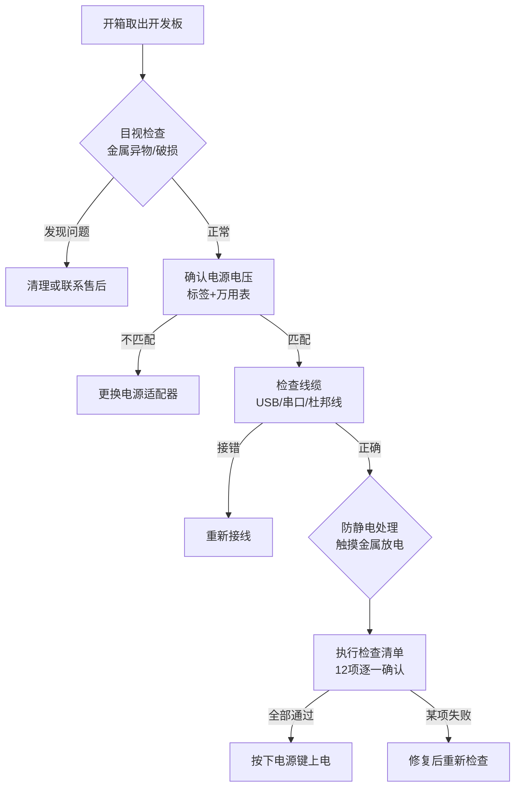

# 1.5.1 上电前的安全检查

> 所属章节：第1章 认识你的开发板 > 1.5 第一次上电：看到启动信息
> 
> 难度：[B→I] | 预计阅读时间：12分钟

## 本节导读

上电前花5分钟做检查，能挽救几百元的板子和数小时的排查时间。你会学到一套系统化的安全检查流程，以及为什么防静电是"必选项"而非"可选项"。

## <span class="blue"> 上电检查清单 [B]

### 目视检查：排除短路隐患 [B]

打开包装后，在**光线充足**的环境下扫视板子：

1. **金属异物**：螺丝孔周围、USB口、网口等区域最容易藏金属碎屑。一颗螺丝就能让电源和地线直接短路。
2. **焊锡飞溅**：廉价PCB偶尔会有焊锡珠飞溅到引脚之间，造成隐蔽短路。
3. **破损元件**：电容鼓包、芯片引脚弯折、接口破裂都会导致后续故障。

> 💡 **提示**：用手机闪光灯放大拍照，镜头有时比肉眼更容易发现细碎的金属异物。

### 电压确认：别让5V变成12V [B]

开发板丝印上的供电电压是**硬要求**，不是建议。

| 标称电压 | 典型耐受范围 | 送入12V电源的后果 |
|---------|-------------|-----------------|
| 5V ±5% | 4.75V ~ 5.25V | PMIC击穿，主板冒烟 |
| 3.3V ±5% | 3.14V ~ 3.46V | GPIO和逻辑芯片过压损坏 |

> 🔴 **危险**：禁止用笔记本电源（常见19V）或路由器电源（常见12V/9V）给5V开发板供电。电压不匹配不是"可能会坏"，而是"一定会坏"。

确认电压三步走：

1. 读电源适配器外壳上的输出规格标签
2. 用万用表直流档（DCV）实测空载电压
3. 确认极性：中心为正还是中心为负

### 线缆检查：松动和反接 [B]

- **USB供电线**：劣质线材会导致电压跌落（5V跌到4.2V），板子反复重启。
- **串口线**：TX和TX对接是初学者最常见的错误。正确接法是 **开发板TX → 电脑RX**，**开发板RX → 电脑TX**，GND直连。
- **杜邦线**：GPIO扩展口排针密集，逐根核对引脚定义。

> ⚠️ **陷阱**：有些USB Type-C口仅用于数据传输，不能供电。用它供电开机毫无反应，新手常误以为板子损坏。

### 上电前检查清单

| 序号 | 检查项 | 检查方法 | 合格标准 |
|-----|--------|---------|---------|
| 1 | 板面无金属异物 | 目视 + 闪光灯辅助 | 无螺丝、碎屑、焊锡珠 |
| 2 | 板面无破损元件 | 目视检查电容、芯片 | 无鼓包、裂纹、弯折引脚 |
| 3 | 电源电压匹配 | 读标签 + 万用表实测 | 与板子丝印一致 |
| 4 | 电源极性正确 | 看接头标识或万用表 | 中心极性与要求一致 |
| 5 | 电源线无破损 | 目视外皮和接头 | 无裸露铜线、无折断 |
| 6 | USB数据线完好 | 插拔测试 | 电脑能识别设备 |
| 7 | 串口线连接正确 | 核对接线图 | TX-RX交叉，GND直连 |
| 8 | 杜邦线无错位 | 逐根核对引脚定义 | 对应正确GPIO编号 |
| 9 | 散热片已安装 | 查看手册说明 | CPU区域有散热措施 |
| 10 | SD卡/启动盘已就绪 | 检查存储介质 | 插入到位，方向正确 |
| 11 | 无静电风险 | 触摸金属水龙头放电 | 身体无静电感 |
| 12 | 周围无导电液体 | 目视桌面 | 无水杯、潮湿物品 |



## <span class="blue"> 防静电注意事项 [B] 

### 静电对芯片的危害 [B]

人体在地毯上行走后积累的静电可达 **15,000V**，而现代芯片的栅极氧化层击穿电压可能只有 **100V**。这意味着：你可能感觉不到刺痛，但芯片内部已被击穿。

静电损伤有两个特点：

1. **隐蔽性**：芯片可能先"受伤"，表现为间歇性死机，几周后才彻底失效。
2. **不可逆性**：击穿的是物理结构，软件修复不了，只能换硬件。

### 防静电措施 [B]

**零成本方案（初学者入门）：**

```bash
# 每次触摸开发板前执行
# 步骤1：找可靠接地金属物（自来水管、金属窗框、暖气片）
# 步骤2：用手指持续触摸3秒钟
# 步骤3：再接触开发板
```

**进阶方案（建议经常玩板子者购买）：**

- **防静电手环**：戴手腕，夹子夹接地金属物（约10-30元）
- **防静电垫**：铺在桌面，板子始终放在垫上（约30-50元）

### 环境要求 [B]

| 环境 | 风险等级 | 建议 |
|------|---------|------|
| 铺地毯的房间 | 🔴 高 | 避免裸手操作板子 |
| 塑料桌面 | 🟡 中 | 铺报纸或防静电袋隔离 |
| 水泥/瓷砖地面 | 🟢 低 | 基本安全，仍建议先放电 |
| 暖气房（湿度<30%） | 🔴 高 | 加湿至50%或用手环 |
| 穿化纤毛衣操作 | 🔴 高 | 换棉质衣物 |

> 💡 **提示**：听到"噼啪"声或触摸门把手有电击感——环境静电严重，**立即停止操作**，先改善环境再继续。

> ⚠️ **陷阱**：开发板的防静电运输袋**不是普通塑料袋**，表面有导电涂层。**不要扔掉它**——拆装芯片或长期存放时，把板子放回袋中是最佳保护。

## <span class="blue"> 本节总结

| 概念 | 要点 | 操作 |
|------|------|------|
| 目视检查 | 金属碎屑是短路元凶 | 开箱后用闪光灯扫一遍板子 |
| 电压确认 | 5V板子接12V = 立即烧毁 | 看标签、用万用表、对丝印 |
| 线缆检查 | TX/RX要交叉，杜邦线不能错位 | 对照引脚图逐根核对 |
| 静电防护 | 人体静电15kV vs 芯片耐压百伏级 | 触摸金属放电，干燥环境用手环 |
| 环境选择 | 地毯+化纤衣+暖气房 = 高危 | 换环境、加湿、换棉质衣物 |

## 下一步

完成检查清单全部12项并确认无误后，即可放心上电。下一节（1.5.2）将讲解如何连接串口、识别启动信息，判断开发板是否成功启动。

---


