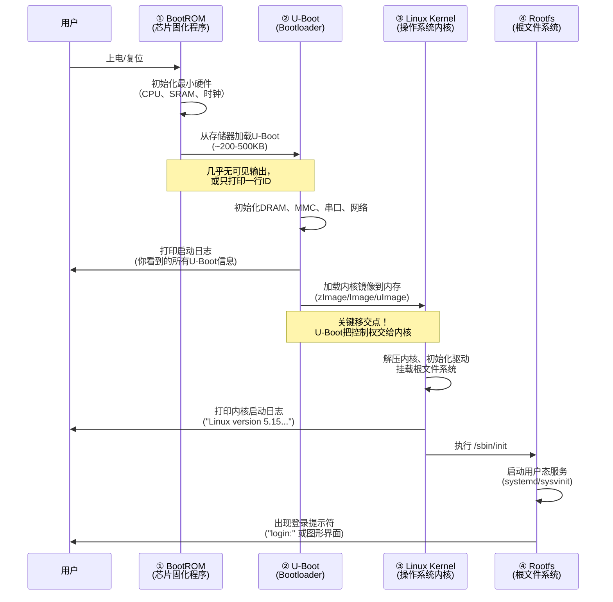

# 1.5.2 上电观察与启动信息解读

> 所属章节：第1章 认识你的开发板 > 1.5 第一次上电：看到启动信息
> 难度：[B→I] | 预计阅读时间：20分钟

## 本节导读

按下开发板的电源键（或插上电源线）那一刻，你应该在串口终端前紧张地等待。几秒钟后，屏幕上开始滚动出一行行文字——这就是**启动日志**，是开发板在用"语言"向你介绍自己。本节将逐行解读这些日志，让你读懂开发板在说什么，并建立起"启动阶段"的全局概念。

---

## 知识点38：Bootloader启动日志解读 [B] ~1500字

当你看到串口终端第一行文字跳出来时，恭喜你——你和开发板的"对话"正式开始了。这些滚动的日志不是乱码，而是 **Bootloader**（启动引导程序，最常见的是 **U-Boot**）在工作时的"自言自语"。每一行都在告诉你：我是谁、我有什么硬件、我正在做什么。

让我们用一块基于 **Rockchip RK3399** 芯片的开发板（如 Orange Pi 4、NanoPC-T4 等常见板子）的真实上电日志来逐行学习。

### 真实启动日志示例

```text
U-Boot 2022.04-gd3xxxx (Feb 15 2023 - 08:23:17 +0800)

SoC: Rockchip rk3399
Reset cause: POR
Model: Orange Pi 4
DRAM:  4 GiB
PMIC:  RK808
Core:  243 devices, 24 uclasses, devset 0
MMC:   mmc@fe320000: 1, mmc@fe330000: 0
Loading Environment from MMC... OK
In:    serial
Out:   serial
Err:   serial
Model: Orange Pi 4
Net:   eth0: ethernet@fe300000
Hit any key to stop autoboot:  3
```

### 逐行解读

#### 第1行：`U-Boot 2022.04-gd3xxxx (Feb 15 2023 - 08:23:17 +0800)`

这是**上电后你看到的第一行文字**（如果BootROM阶段没有额外输出的话）。

- `U-Boot`：这是Bootloader的名字，全称 Universal Boot Loader，是目前嵌入式领域最常用的开源Bootloader。
- `2022.04`：U-Boot的版本号，表示这是2022年4月发布的版本。
- `gd3xxxx`：编译时生成的commit hash，标识这是哪一份代码编译出来的。
- `(Feb 15 2023 - 08:23:17 +0800)`：编译时间戳。

💡 **提示**：版本号很重要。如果你以后需要查找资料，别人问"你用的U-Boot版本是多少？"，你就回答"2022.04"就行。

#### 第2行：`SoC: Rockchip rk3399`

U-Boot开始"自我介绍"了。它在告诉你：它检测到自己运行在一块 **Rockchip RK3399** 芯片上。

- `SoC`（System on Chip，片上系统）：把CPU、GPU、内存控制器、各种外设控制器集成在一个芯片里。
- `Rockchip`：瑞芯微，一家中国芯片设计公司。
- `rk3399`：具体的芯片型号，双核A72+四核A53，6核心设计。

#### 第3行：`Reset cause: POR`

告诉你这次复位的原因。

- `POR` = Power-On Reset（上电复位）。这是最常见的复位原因，表示芯片刚刚通上电。
- 其他常见值：`RST`（硬件复位按钮）、`WDOG`（看门狗复位——系统卡住后自动重启）。

#### 第4行：`Model: Orange Pi 4`

开发板的具体型号。U-Boot通过读取板上的EEPROM或者根据特定GPIO电平组合来识别这是哪一款板子。

#### 第5行：`DRAM: 4 GiB` ⭐ 关键行

**内存初始化成功的标志**！

- `DRAM`（Dynamic Random Access Memory，动态随机存取存储器）：开发板上的运行内存。
- `4 GiB`：检测到有4GB内存可用。

🔴 **危险**：如果这一行显示的数字不对（比如你的板子明明是4GB，却显示`DRAM: 2 GiB`或`DRAM: 0 MiB`），说明内存初始化失败，系统大概率会崩溃。内存初始化是Bootloader最核心、最复杂的任务之一。

⚠️ **陷阱**：注意单位是 `GiB`（Gibibyte，基于1024），不是 GB（Gigabyte，基于1000）。4 GiB ≈ 4.29 GB，这是正常的。

#### 第6行：`PMIC: RK808`

- `PMIC`（Power Management IC，电源管理芯片）：负责给CPU、内存、外设提供各种不同电压的电源。
- `RK808`：Rockchip自家的配套电源管理芯片型号。

#### 第7行：`Core: 243 devices, 24 uclasses, devset 0`

U-Boot在枚举系统中所有设备。`243 devices`表示发现了243个设备节点，`24 uclasses`表示这些设备分属24个类别（如GPIO、I2C、SPI、MMC等）。这一行通常一闪而过，说明设备树（Device Tree）加载和解析正常。

#### 第8行：`MMC: mmc@fe320000: 1, mmc@fe330000: 0`

**存储控制器初始化**。

- `MMC`（MultiMediaCard）：泛指SD卡/eMMC等闪存存储接口。
- `mmc@fe320000`：内存映射地址，表示SDMMC控制器0的寄存器基地址。
- `: 1` 和 `: 0`：U-Boot分配的设备编号。

💡 **提示**：在U-Boot命令行里，你会用 `mmc 0` 或 `mmc 1` 来操作不同的存储设备。这里的编号就是后面要用的。

#### 第9行：`Loading Environment from MMC... OK`

U-Boot从eMMC/SD卡中加载**环境变量**（Environment）。环境变量是U-Boot的"配置文件"，里面存放了启动延迟时间、默认启动命令、网络参数等。

- `... OK`：加载成功。如果看到 `... Failed`，U-Boot会使用编译时硬编码的默认环境变量，通常也能启动，但可能不是你要的配置。

#### 第10~13行：`In: serial / Out: serial / Err: serial`

U-Boot设置标准输入/输出/错误通道。`serial` 表示使用串口。这意味着：
- 你敲的键盘输入 → 通过串口传给U-Boot
- U-Boot的输出信息 → 通过串口传给你的终端

#### 第14行：`Net: eth0: ethernet@fe300000`

网络接口初始化。如果你的板子接了网线，后面可能会看到DHCP请求、TFTP下载等网络相关的日志。

#### 第15行：`Hit any key to stop autoboot:  3` ⭐ 关键行

**最激动人心的一行！** U-Boot告诉你："我正在倒计时，3秒后自动启动内核。如果你想打断我、进入U-Boot命令行，现在就按任意键！"

- 倒计时通常从3秒或1秒开始。
- 如果你在这时候按下键盘上的任意键，倒计时停止，你会看到U-Boot提示符：`=>`
- 如果你什么都不做，U-Boot会继续执行默认的启动命令（通常是 `bootcmd`），加载Linux内核。

💡 **提示**：很多新手第一次上电时手忙脚乱，倒计时结束了还没看清楚日志。别慌，下次上电时准备好手指放在键盘上，看到倒计时立刻按键就能进入U-Boot命令行。

### 启动日志关键行速查表

| 日志行 | 含义 | 如果出错会怎样 |
|--------|------|----------------|
| `U-Boot 2022.04` | U-Boot版本和编译信息 | 看不到这行说明BootROM没加载U-Boot |
| `SoC: Rockchip rk3399` | 检测到的芯片型号 | 型号不对可能导致后续驱动初始化失败 |
| `DRAM: 4 GiB` | 内存容量检测 | 显示`0 MiB`或容量不对，系统会崩溃 |
| `PMIC: RK808` | 电源管理芯片识别 | 失败可能导致供电不稳定 |
| `MMC: ...` | 存储控制器初始化 | 失败则无法加载内核镜像 |
| `Loading Environment... OK` | 加载U-Boot配置 | `Failed`会使用默认配置，通常可启动 |
| `Hit any key to stop autoboot` | 启动倒计时 | 按任意键可进入U-Boot命令行 |

[表1：U-Boot启动日志关键行速查表]

---

## 知识点39：启动阶段划分 [I] ~1200字

刚才你看到的是U-Boot阶段的日志。但从你按下电源键到Linux内核开始运行，中间其实经历了**四个阶段**。理解这四个阶段，就像理解一台汽车从拧钥匙到发动机正常运转的完整过程。

### 四个启动阶段全景图



[图1：嵌入式Linux启动阶段时序图]

### 每个阶段详解

#### 阶段①：BootROM（片上ROM程序）

**这是你无法控制、也无法修改的阶段。**

BootROM是芯片出厂时就固化在芯片内部的一段只读程序（通常几十KB）。上电后，CPU第一个执行的就是它。

BootROM的"最小使命"：
1. 初始化CPU到最基本的工作状态
2. 从某个固定的存储位置（如eMMC、SD卡、SPI Flash）加载U-Boot
3. 把控制权交给U-Boot

💡 **提示**：BootROM阶段通常**没有输出**（或者只打印一行芯片ID如`DDR Version 1.24`）。如果你看到的是空白，别慌——这是正常的。

⚠️ **陷阱**：不同厂家的BootROM行为差异很大。Rockchip会打印DDR初始化信息，NXP i.MX系列通常静默，Allwinner会输出`U-Boot SPL`。不要拿A板子的经验套B板子。

#### 阶段②：U-Boot（Bootloader）

**这就是你刚才看到的那些日志！**

U-Boot是开源的、可配置的，也是你打交道最多的启动阶段。它的核心任务：
- 初始化所有硬件（内存、存储、串口、网络等）
- 提供命令行调试环境
- 找到Linux内核镜像并加载到内存
- 把启动参数传给内核
- **跳转到内核入口点，把CPU控制权交给内核**

#### 阶段③：Linux Kernel（内核）

当U-Boot执行 `bootcmd` 后，你会看到日志风格突变——出现类似这样的输出：

```text
Starting kernel ...

[    0.000000] Booting Linux on physical CPU 0x0000000000 [0x410fd034]
[    0.000000] Linux version 5.15.25-rockchip64 (builder@armbian) 
[    0.000000] Machine model: Orange Pi 4
[    0.000000] earlycon: uart8250 at MMIO32 0x00000000ff1a0000 (options '')
[    0.000000] printk: bootconsole [uart8250] enabled
```

注意几个变化：
- 时间戳变成了 `[ 0.000000]` 格式——这是内核的"时间轴"，从0秒开始。
- 输出前缀变成了 `Linux version`——这是内核自己的日志格式。
- 内容开始详细描述CPU核心、内存布局、设备驱动初始化。

这说明**控制权已经移交到Linux内核了**！U-Boot完成了它的历史使命，内核开始接管一切。

#### 阶段④：Rootfs（根文件系统）

内核启动的最后一步是挂载**根文件系统**（Root Filesystem），然后执行里面的第一个用户程序（通常是 `/sbin/init` 或 `/lib/systemd/systemd`）。

从这一刻起，系统进入"用户态"，你开始看到：
- 各种服务启动：`Starting Network Manager...`
- 登录提示符：`board login:`
- 或者直接进入图形桌面

### 各阶段标志性输出对比

| 阶段 | 在日志中的"标志性输出" | 时间 |
|------|------------------------|------|
| BootROM | `DDR Version x.xx` / `SPL` / 无输出 | 0~0.5秒 |
| U-Boot | `U-Boot 2022.04...` | 0.5~3秒 |
| Kernel | `[ 0.000000] Booting Linux...` | 3~5秒 |
| Rootfs | `Starting xxx service...` / `login:` | 5~30秒 |

[表2：各启动阶段标志性输出对比]

💡 **提示**：学会在日志中"找分界点"。看到 `Starting kernel ...` 就知道U-Boot阶段结束了；看到 `[ 0.000000]` 就知道内核阶段开始了。

---

## 知识点40：启动失败的常见现象与初步判断 [B] ~600字

上电后没有看到预期的日志？别慌，先看现象、再定位原因。以下是四种最常见的启动失败现象。

### 现象1：串口终端完全空白，没有任何输出

**最可能的原因：**

1. **电源问题** 🔌
   - 电源线没插紧、电源适配器功率不够、Type-C线不支持供电
   - 检查：板子上的电源指示灯是否亮起？用万用表测量供电电压。

2. **串口接反** 🔌
   - TX/RX接反了。开发板的TX要接USB转串口的RX，RX要接USB转串口的TX。
   - 💡 **提示**：口诀"TX对RX，RX对TX，GND对GND"。

3. **波特率不对**
   - 大多数RK3399板子使用1500000（1.5Mbps），不是常见的115200。
   - 检查你的串口工具波特率设置。

4. **串口线驱动没装**
   - Windows下需要CH340/CP210x/FT232的驱动。
   - 检查设备管理器里是否出现了COM口。

### 现象2：输出是乱码（如`~`或随机字符）

**最可能的原因：波特率不对。**

⚠️ **陷阱**：RK3399等较新的芯片为了加快启动速度，Bootloader和内核常常使用 **1500000 baud**（1.5Mbps），而不是传统嵌入式常用的115200。如果你的终端设置成115200，就会看到乱码。

**解决**：在串口工具中把波特率改为1500000。如果还是乱码，尝试750000、115200，逐个试。

### 现象3：日志正常打印，但到某一行后卡住不动

**示例：**
```text
U-Boot 2022.04
SoC: Rockchip rk3399
DRAM:  4 GiB
MMC:   mmc@fe320000: 1
```
然后**卡住**。

**分析**：卡在`MMC`这行，说明存储控制器初始化失败，U-Boot无法读取eMMC/SD卡。

**可能原因**：
- eMMC芯片虚焊或损坏
- SD卡没插好、或SD卡本身损坏
- 设备树（Device Tree）中存储控制器的配置与硬件不匹配

### 现象4：反复重启，日志打印到一半就从头再来

**典型表现**：看到日志滚动几行，然后突然从头开始打印`U-Boot 2022.04...`

**最可能的原因**：

1. **电源不稳** 🔴
   - 电源适配器功率不足。启动瞬间电流需求增大，电压被拉低，芯片复位。
   - 尤其是通过USB口供电时很常见。
   - **解决**：换更大功率的电源（如从5V/2A换到5V/3A），或使用专门的DC电源适配器。

2. **Bootloader损坏**
   - BootROM加载了损坏的U-Boot镜像，U-Boot运行到一半崩溃，芯片复位，BootROM再次加载，进入死循环。
   - **解决**：需要重新烧写U-Boot（见后续章节）。

3. **看门狗超时**
   - 某些板子的看门狗没有被正确喂狗，导致自动复位。

### 启动故障排查快速决策树

```text
上电后观察：
├─ 完全无输出？ → 检查电源灯 → 灯不亮：电源问题
│                              → 灯亮：检查串口接线/波特率/驱动
├─ 乱码？ → 改波特率为1500000（或115200）
├─ 卡在某行？ → 看卡在哪一行 → DRAM行：内存问题
│                              → MMC行：存储问题
│                              → Net行：网络驱动问题
└─ 反复重启？ → 换大功率电源 → 仍重启：Bootloader损坏，需重烧
```

---

## 本节总结

| 概念 | 要点 | 遇到问题时 |
|------|------|------------|
| BootROM | 芯片固化程序，负责加载U-Boot | 通常看不到输出，无输出是正常的 |
| U-Boot | 初始化硬件，加载内核 | 看`DRAM:`行判断内存；按任意键进命令行 |
| 内核启动 | `Booting Linux...` 是分水岭 | 时间戳`[0.000000]`表示内核接管 |
| 根文件系统 | 用户态服务启动，出现登录提示 | 卡在内核后通常是根分区问题 |
| 无输出 | 先查电源和串口接线 | TX/RX不能接反，波特率常见1500000 |
| 乱码 | 99%是波特率不对 | 尝试1500000、115200 |
| 反复重启 | 先换大功率电源 | 再考虑Bootloader损坏 |

---

## 下一步

你已经学会了"读日志"——这是嵌入式开发最重要的基本功。下一节 `1.5.3 如何中断启动进入U-Boot命令行`，我们将趁热打铁，在倒计时那3秒钟按下键盘，进入U-Boot的交互式命令行，真正"动手控制"你的开发板。

---

## 配套资源

### 表格清单
- 表1：U-Boot启动日志关键行速查表
- 表2：各启动阶段标志性输出对比

### 图示清单
- 图1：嵌入式Linux启动阶段时序图（mermaid sequenceDiagram）
- 图2：启动故障排查快速决策树（文本流程图）
- 图3（需配图）：串口接线实物图——TX/RX/GND三根杜邦线的正确接法
- 图4（需配图）：U-Boot倒计时截图——`Hit any key to stop autoboot: 3` 的终端实际效果

### 代码清单
- 代码1：Rockchip RK3399真实U-Boot启动日志完整示例
- 代码2：Linux内核接管后的标志性日志示例
- 代码3：启动故障排查决策树（文本格式）
