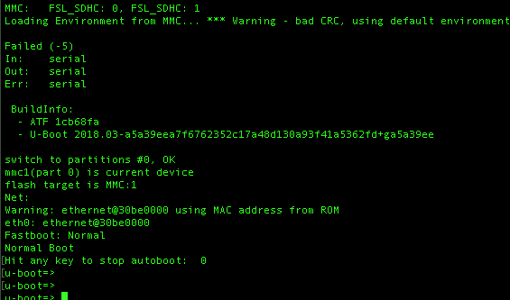
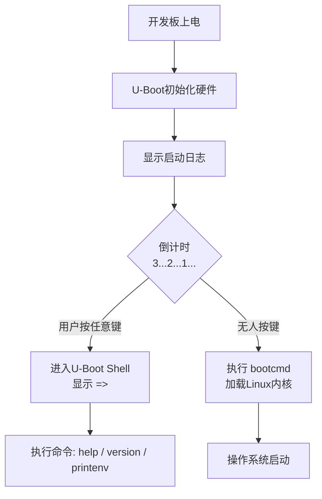
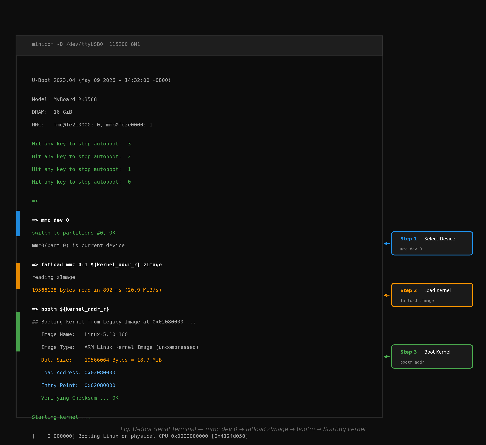

# 1.5.3 认识Bootloader交互界面

> 所属章节：第1章 认识你的开发板 > 1.5 第一次上电：看到启动信息
> 
> 难度：[B] | 预计阅读时间：15分钟

## <span class="blue"> 本节导读
上一节你看到了开发板上电后刷屏的启动日志，那是Bootloader和操作系统在"自言自语"。<BR>
本节你将学会在正确的时间按下键盘，打断自动启动，进入U-Boot的命令行界面。学完本节，你能像一个调试工程师那样，与U-Boot这个嵌入式"BIOS"直接对话，查看版本信息、板子配置和启动参数。

---

## <span class="blue"> U-Boot命令行——按任意键进入交互世界 [B]

还记得上节末尾那个3秒倒计时吗？

```
Hit any key to stop autoboot:  3
```

这个倒计时是U-Boot给你的"机会窗口"。<BR>在倒计时归零之前，只要在串口终端上**按下键盘上的任意键**（空格、回车、任意字母都行），U-Boot就会停止自动启动内核，而是停留在一个交互式的命令行界面中，等待你的指令。这就像是PC开机时狂按`Del`或`F2`进入BIOS设置界面。

### 操作步骤

1. **重新给开发板上电**（或按下复位键），观察串口终端输出
2. **盯着屏幕**，当看到 `Hit any key to stop autoboot:` 出现时，立即**连续敲击空格键**（或任意键）
3. 如果成功，倒计时会停止，屏幕出现一行提示后，显示 `=> `

> 🔴 **危险**：如果错过了倒计时，U-Boot会自动加载Linux内核并启动操作系统。没关系，等系统启动完成后，你可以再次复位或重新上电来重试。

### U-Boot提示符 "=> " 的含义

当你看到 `=> ` 时，恭喜你！你现在正站在U-Boot的命令行面前。这个提示符就像Linux的`$`或Windows的`C:\>`，告诉你："系统准备好了，请输入命令。"



### 第一个命令：`help`

在 `=> ` 后面输入 `help` 并回车，U-Boot会列出所有它能执行的命令。每个命令后面跟着简短的说明。这就像拿到一份菜单,你还不知道每道菜的味道，但至少知道了有什么可选。

```bash
=> help
?       - alias for 'help'
base    - print or set address offset
bdinfo  - print Board Info structure
boot    - boot default, i.e., run 'bootcmd'
bootd   - boot default, i.e., run 'bootcmd'
bootm   - boot application image from memory
cmp     - memory compare
cp      - memory copy
crc32   - checksum calculation
dhcp    - boot image via network using DHCP/TFTP
echo    - echo args to console
editenv - edit environment variable
env     - environment handling commands
exit    - exit script
...（此处省略数十行）...
```

> 💡 **提示**：你的U-Boot版本不同，列出的命令数量和名称可能略有差异。这是正常的:U-Boot支持数百个命令，实际编译进你开发板的只是其中一部分。

### 第二个命令：`version`

输入 `version`，你会看到类似这样的输出：

```bash
=> version
U-Boot 2020.10 (Jan 15 2021 - 08:32:15 +0800)

arm-linux-gnueabihf-gcc (GNU Toolchain for the A-profile Architecture 8.3-2019.03 ...)
```

第一行告诉你U-Boot的版本号和编译时间。第二行告诉你这个U-Boot是用什么编译器、在什么时间编译的。这些信息在排查兼容性问题时非常有用——就像你问"这是什么版本的BIOS"。



[图2：U-Boot启动与交互流程图] — 展示了上电后如何进入U-Boot命令行，以及错过时会发生什么

⚠️ **陷阱：按键时机不对**

- 按得太早（U-Boot还没初始化串口）：按键被忽略，没有任何反应
- 按得太晚（倒计时已结束，内核已开始加载）：按键被忽略，只能等下次复位重来
- 解决方案：从看到 "Hit any key" 就开始连续敲击空格键，提高命中率

⚠️ **陷阱：终端没有焦点**

- 如果你的串口工具窗口没有获得键盘焦点，按键不会发送到开发板
- 解决方案：鼠标点击一下终端窗口，确保光标在终端内闪烁

---

## <span class="blue"> 常用U-Boot命令速览 [B] 

U-Boot有几十个命令，但你现阶段只需要认识四个最常用的"侦察兵"命令。它们帮你摸清这个系统的底细，却不做任何破坏性操作——你可以放心地逐个尝试。

### `help` — 查看命令帮助

单独输入 `help` 列出所有命令。如果想看某个命令的具体用法，输入 `help 命令名`：

```bash
=> help printenv
printenv - print environment variables

Usage:
printenv [-a] [-d] [name ...]
    - print values of all/environment variables
    -a          print all variables including active and default
    -d          print default variables
    name ...    print only these variables
```

这种用法在之后学习新命令时非常有用,不用翻手册，直接问U-Boot自己。

### `printenv` — 查看环境变量

这是本节最重要的命令之一。输入 `printenv`（或简写为 `pri` 或 `env print`），U-Boot会打印出一大串 `变量名=值` 的列表。这些就是U-Boot的"配置信息"，存储在板子的Flash中。

```bash
=> printenv
baudrate=115200
board_name=MYBOARD
board_rev=1.0
bootargs=console=ttyS0,115200 root=/dev/mmcblk0p2 rw rootwait
bootcmd=mmc dev 0; fatload mmc 0:1 ${kernel_addr_r} zImage; bootm ${kernel_addr_r}
bootdelay=3
ethaddr=00:11:22:33:44:55
...（此处省略多行）...
Environment size: 2044/8188 bytes
```

> 💡 **提示**：如果输出刷屏太快看不清，没关系。后面会教你如何用 `printenv 变量名` 只看某一个变量。

### `version` — 查看版本信息

前面已经体验过。补充一点：有些U-Boot还会显示编译时的Git提交哈希，形如 `git: abc1234`，这能精确定位你用的是代码仓库中的哪个版本。

### `bdinfo` — 查看板子硬件信息

这是四个命令中最"硬核"的一个。输入 `bdinfo`（简写为 `bdi`），你会看到板子的硬件配置详情：

```bash
=> bdinfo
arch_number = 0x00000000
boot_params = 0x20000100
DRAM bank   = 0x00000000
-> start    = 0x20000000
-> size     = 0x20000000 (512 MiB)
current eth = ethernet@1c30000
ethaddr     = 00:11:22:33:44:55
IP addr     = <NULL>
baudrate    = 115200 bps
TLB addr    = 0x2FFF0000
relocaddr   = 0x3F720000
reloc off   = 0x1F720000
irq_sp      = 0x2F8FEFA0
sp start    = 0x2F8FEF90
...（部分内容因板子而异）...
```

重点看 `DRAM bank` 下的 `size`——它告诉你这块开发板有多少内存（上面显示512 MiB）。

### 四个常用命令速查表

| 命令 | 简写 | 作用 | 危险程度 | 常用场景 |
|------|------|------|----------|----------|
| `help` | `?` | 列出所有命令或查看某个命令的用法 | 🟢 无害 | 忘记命令怎么用时自查 |
| `version` | `ver` | 查看U-Boot版本和编译信息 | 🟢 无害 | 确认固件版本是否匹配 |
| `printenv` | `pri` | 打印所有或指定环境变量 | 🟢 无害 | 查看系统配置和启动参数 |
| `bdinfo` | `bdi` | 查看板子硬件信息（内存、MAC地址等） | 🟢 无害 | 确认硬件配置是否正确 |

> 💡 **提示**：U-Boot支持命令简写，只要输入的字符足以区分不同命令即可。例如 `pri` 和 `print` 都能被识别为 `printenv`。但这只在命令不冲突时有效——如果有 `printenv` 和 `printf`，你就不能只输 `prin`。

> ⚠️ **陷阱：`printenv`输出太长被截断**
> 
> - 如果环境变量很多，`printenv` 的输出可能刷屏。此时可以用 `printenv 变量名` 只看一个，例如 `printenv bootcmd`。

---

## <span class="blue"> 环境变量初识——bootcmd与bootargs [B] 

前面 `printenv` 输出了一大串变量，其中有两个最重要，理解它们等于理解了U-Boot"自动启动"的秘密。

### 什么是环境变量

你可以把环境变量理解为U-Boot的"记事本"——它把配置信息（比如从哪里加载内核、用什么参数启动）持久化存储在板子的Flash里。下次上电，U-Boot读这个记事本，就知道该怎么干活。

环境变量和Linux的环境变量概念类似，都是 `键=值` 的格式。但U-Boot的环境变量是存在Flash里的，Linux的是存在内存里的。

### `bootcmd`：自动启动的命令序列

在上一节，你看到倒计时结束后U-Boot自动加载了内核。它怎么知道该干什么？答案就是 `bootcmd` 这个变量。

```bash
=> printenv bootcmd
bootcmd=mmc dev 0; fatload mmc 0:1 ${kernel_addr_r} zImage; bootm ${kernel_addr_r}
```

这行内容的含义是：

1. `mmc dev 0` — 选中第0个MMC/SD卡设备
2. `fatload mmc 0:1 ${kernel_addr_r} zImage` — 从SD卡第1分区的FAT文件系统中，加载名为 `zImage` 的内核文件到内存地址 `${kernel_addr_r}`
3. `bootm ${kernel_addr_r}` — 从该内存地址启动内核

多个命令之间用分号 `;` 隔开。当U-Boot倒计时结束时，它会自动执行 `bootcmd` 里的这串命令——这就是自动启动的真相。



### `bootargs`：传递给Linux内核的启动参数

`bootargs` 是另一个关键变量，它的值会原封不动地传给Linux内核，告诉内核"你该怎么启动"。

```bash
=> printenv bootargs
bootargs=console=ttyS0,115200 root=/dev/mmcblk0p2 rw rootwait
```

这行内容的含义是：

- `console=ttyS0,115200` — 内核把串口 `ttyS0` 当作控制台，波特率115200
- `root=/dev/mmcblk0p2` — 根文件系统在第0个MMC设备的第2分区
- `rw` — 以读写模式挂载根文件系统
- `rootwait` — 如果根文件系统还没准备好，内核耐心等它出现

> 🔴 **危险**：本节只教**查看**环境变量，不教修改。`bootcmd` 和 `bootargs` 写错会导致板子无法启动，新手阶段"只看不动"是铁律。

⚠️ **陷阱：把bootcmd和bootargs搞混**

- `bootcmd` 是U-Boot**自己执行的命令**（告诉U-Boot该干什么）
- `bootargs` 是U-Boot**传给内核的参数**（告诉内核该干什么）
- 一个在内核之前执行，一个给内核当"启动说明书"

> 💡 **提示**：你可以用 `printenv` 同时查看多个变量，用空格隔开：`printenv bootcmd bootargs`

---

## <span class="blue"> 本节总结

| 概念 | 要点 | 推荐操作 |
|------|------|----------|
| 进入U-Boot | 在`Hit any key`倒计时期间按任意键 | 连续敲击空格提高成功率 |
| U-Boot提示符 | `=> ` 表示命令行就绪 | 看到提示符再输入命令 |
| `help` | 查看命令列表和用法 | `help` 或 `help 命令名` |
| `version` | 查看U-Boot版本信息 | 确认固件版本是否匹配 |
| `printenv` | 查看环境变量（配置存储） | `printenv` 或 `printenv 变量名` |
| `bdinfo` | 查看板子硬件信息 | 重点看DRAM size（内存大小） |
| `bootcmd` | U-Boot自动执行的启动命令序列 | 理解它就知道自动启动的原理 |
| `bootargs` | 传给Linux内核的启动参数 | 包含控制台、根文件系统等关键信息 |

---

*本节完。恭喜你，你已经成功与嵌入式系统的"BIOS"——U-Boot——进行了第一次对话。*
