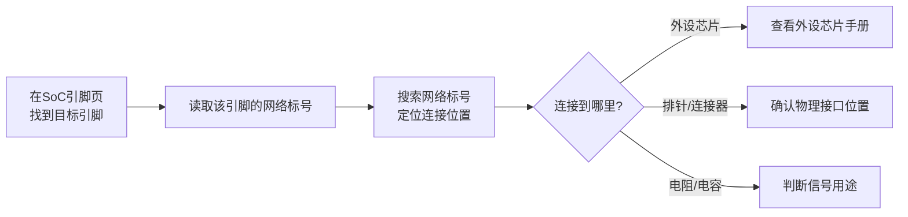

# 1.6.1 阅读原理图入门

> 所属章节：第1章 认识你的开发板 > 1.6 开发板的硬件资源地图
> 难度：[B→I] | 预计阅读时间：25分钟

## 本节导读
本节将教会你从"看开发板实物"过渡到"看懂电路原理图"，学会追踪SoC引脚与外设之间的连接关系，并掌握关键页面的速查技巧。学完本节，你将能够独立在原理图中找到任意一个外设连接到了SoC的哪个引脚——这是后续调试硬件问题的必备技能。

---

## 知识点44：原理图的基本阅读方法 [I] ~1,200字

### 原理图是什么？

原理图（Schematic）是电路设计的"地图"。如果说开发板实物是一栋已经建好的楼房，那么原理图就是这栋楼房的施工图纸。实物板上的芯片、电阻、电容在原理图中用**符号**表示；板上的铜线走线在原理图中用**连线**表示。工程师先画原理图，再依据原理图生产PCB电路板。

对于嵌入式学习者来说，看懂原理图有两大实际用途：

1. **知道某个外设接到了SoC的哪个引脚**——配置设备树或驱动时，必须知道硬件连接关系
2. **排查硬件问题**——当串口没输出、GPIO不翻转时，原理图能帮你确认是软件配错了还是硬件本身的问题

### 原理图的四大组成要素 [B]

看懂原理图不需要电学深厚的功底，只需要认识四个"路标"：

| 要素 | 实物对应 | 图示 | 说明 |
|------|---------|------|------|
| **元件符号** | 芯片、电阻、电容 | [图1：元件符号示例] | 芯片画成长方形带引脚，电阻是锯齿线，电容是两条平行线 |
| **连线** | PCB上的铜线 | [图2：连线与交叉示例] | 直接相连的引脚用直线连接 |
| **网络标号** | 同一根铜线的不同位置 | [图3：网络标号示例] | 两个引脚标了相同的名称（如`UART0_TXD`），就表示它们在电路板上是连通的 |
| **页码/端口** | 跨页走线 | [图4：跨页端口示例] | 电路太复杂时，原理图会分多页，跨页连接用特殊符号标注目标页码 |

💡 **提示**：原理图中最重要的是**网络标号**。两个引脚之间即使没有画连线，只要标了相同的网络标号，就说明它们在PCB上是连接在一起的。这让复杂的原理图避免了满屏的"蜘蛛网"走线。

### 核心追踪思路：从SoC到外设 [I]

追踪信号路径是阅读原理图的核心技能。其基本逻辑只有三步：



[图5：原理图信号追踪流程图]

**以追踪UART0_TXD为例：**

假设你想确认开发板的调试串口（UART0）的发送引脚（TXD）从SoC芯片出来后，最终连到了板子上的哪个位置。按照"三步追踪法"操作：

**第一步：定位SoC引脚**
打开原理图的SoC引脚定义页（通常是第2~4页，页码标有"CPU"或"SoC"字样），在密密麻麻的引脚中找到`UART0_TXD`。你会看到它标注在SoC的某个GPIO引脚旁边，例如`GPIO1_12/UART0_TXD`——这说明这个引脚可以复用为UART0的发送功能。

🔴 **危险**：很多SoC引脚有**复用功能**（MUX），一个物理引脚可以配置为UART、GPIO、SPI等不同功能。原理图上会把所有可能的功能都列出来，但实际当前连接的是哪个功能，要看网络标号跟到哪条线。如果网络标号是`UART0_TXD`，说明这个引脚当前是作为串口发送使用的。

**第二步：读取网络标号**
在SoC引脚旁边，你会看到引出的连线旁边标着`UART0_TXD`。这就是**网络标号**。注意：这条连线可能画得很短，很快就在页面上"消失"了——它并没有真的消失，而是通过页码端口跳转到了其他页面，或者通过网络标号与远处另一个元件引脚关联。

**第三步：搜索并定位连接位置**
使用PDF阅读器的搜索功能（按`Ctrl+F`），输入`UART0_TXD`进行全文搜索。搜索结果通常会指向两个关键位置：

1. **SoC引脚页**：信号起点
2. **连接器页**：信号终点（连接到一个排针引脚，如`P1-3`）

搜索时你会发现，`UART0_TXD`可能还经过一个**串接电阻**（如22Ω），再连到排针。这个电阻的作用是阻抗匹配和限流保护，对软件开发者来说不需要特别关心，确认信号"通到排针"即可。

### 实战追踪示例

下面是一个简化的追踪结果展示（基于典型ARM开发板）：

```
SoC芯片 (Page 2)
  └── Pin GPIO1_12 ──[网络标号 UART0_TXD]──┐
                                          │
电阻页 (Page 5)                           │
  └── R12 (22Ω) ──[网络标号 UART0_TXD]───┤
                                          │
连接器页 (Page 8)                        ▼
  └── P1 排针 Pin3 ── UART0_TXD (Debug UART TX)
```

💡 **提示**：有的原理图会用**全局网络标号**（不带箭头，直接写名字）或**页间端口**（带箭头，旁边标注页码如`-> P5`）。两种都表示跨页连接，搜索功能对它们都有效。

⚠️ **陷阱**：搜索网络标号时，注意区分大小写。原理图中`uart0_txd`和`UART0_TXD`可能被当成不同的网络。建议关闭PDF搜索的"区分大小写"选项。

⚠️ **陷阱**：有些网络标号名字相似但含义不同，例如`UART0_TXD`和`UART1_TXD`、`UART0_RTS`、`UART0_CTS`。追踪时务必核对完整的标号名称，看漏一个数字会导致引脚定位完全错误。

---

## 知识点45：关键页面速查 [I] ~800字

原理图通常不是一页，而是像一本书一样分很多页。以一块典型的四层板ARM开发板为例，原理图PDF可能有**10~30页**不等。知道每页大概讲什么，能让你快速定位要找的信息。

### 原理图页面速查表

| 页面类型 | 典型页码 | 核心内容 | 查找时机 | 阅读技巧 |
|---------|---------|---------|---------|---------|
| **封面/目录** | 第1页 | 总页数、版本号、项目名 | 刚打开文件时 | 确认版本与手中的板子一致 |
| **SoC/CPU引脚定义** | 第2~5页 | SoC所有引脚的名称、编号、复用功能 | 追踪某个信号从SoC哪里出发 | 善用PDF搜索，不要逐行看 |
| **电源系统** | 第6~9页 | DC-DC芯片、LDO、电容、电源网络 | 排查上电问题、确认电平 | 关注网络标号如`VCC_3V3`、`VDD_5V` |
| **DDR/内存** | 第10~13页 | DDR芯片与SoC的连线 | 排查内存初始化失败 | 地址/数据线是总线形式，成组查看 |
| **存储（eMMC/SD/NAND）** | 第14~16页 | 存储芯片连接 | 排查启动问题 | 注意启动模式选择引脚 |
| **连接器/排针** | 第17~20页 | 排针P1/P2定义、各类接口 | 想接线或测信号时 | 看每个排针引脚的网络标号，反查到SoC |
| **外设接口** | 第21~25页 | 以太网PHY、USB Hub、WiFi模块 | 对应外设不工作时 | PHY芯片型号很关键，用它找驱动 |
| **杂项** | 最后几页 | LED、按键、蜂鸣器 | 调试简单IO | 通常直接连到SoC GPIO |

[图6：原理图页面结构示意图，展示从封面到各功能页的组织方式]

### SoC引脚定义页的阅读技巧

SoC引脚定义页是最"吓人"的一页：几百个引脚排成阵列，每个引脚可能有3~4个复用功能标注。阅读技巧：

1. **不要逐行读，用搜索**：直接`Ctrl+F`搜你要找的引脚名或信号名
2. **理解引脚编号规则**：BGA封装的SoC引脚命名通常是`行+列`，如`A12`、`B5`、`AA34`。原理图上会把这种物理位置标注出来，方便与BGA焊球位置对应
3. **关注"Ball Name"和"Signal Name"两列**：Ball Name是物理位置（如A12），Signal Name是功能名（如`UART0_TXD`）

### 电源页的阅读技巧

电源页看起来满眼都是电容和DC-DC芯片，但对嵌入式开发者来说，只需要关注三个要点：

1. **电平确认**：找到网络标号如`VCC_3V3`（3.3V）、`VDD_5V`（5V）、`VDDIO_1V8`（1.8V）。这些决定了GPIO的输出高电平是多少伏——接错电平会烧芯片。
2. **上电顺序**：部分SoC要求内核先上电，外设后上电。原理图上会用箭头或文字标注顺序。
3. **关键测试点**：电源页通常会标出`TP`（Test Point，测试点），用万用表测量这些点可以快速判断板子供电是否正常。

🔴 **危险**：如果你要给开发板外接3.3V模块，务必先在电源页确认对应排针的网络标号确实是`3.3V`而不是`5V`。把5V接到3.3V模块上，瞬间就能闻到焦糊味。

### 连接器页的阅读技巧

连接器页展示了开发板对外的接口——排针、USB插座、网口、HDMI座等。阅读方法：

1. **从排针反查SoC**：看到排针`P1-3`标着`UART0_TXD`，搜`UART0_TXD`就能找到它连到了SoC的哪个引脚
2. **注意复用标记**：排针页经常标注某引脚"默认功能"和"扩展功能"，比如某引脚默认是GPIO，但可通过跳线帽选择为I2C
3. **确认地线位置**：排针上的`GND`引脚是万用表测量的基准，也是示波器夹子的接地点

💡 **提示**：把连接器页打印出来贴在显示器旁边，调试时随时查看——这是最常被翻查的页面。

⚠️ **陷阱**：有的开发板原理图把排针的引脚顺序画成**从上往下**或**从左往右**，但实物丝印可能方向不同。接线前务必核对丝印编号，不要只看原理图上的排列顺序。

---

## 知识点46：器件手册（Datasheet）的定位 [B] ~600字

### Datasheet是什么？

如果说原理图是"地图"，那么Datasheet就是地图中每个"地标"（芯片）的**详细说明书**。它由芯片厂商编写，记录了这颗芯片的一切关键信息：引脚功能、电气特性、工作时序、寄存器定义、封装尺寸等。

嵌入式开发者查阅Datasheet的典型场景：
- 配置设备树时，不确定某个GPIO的复用功能编号——看SoC的Datasheet "Pin MUX"章节
- 以太网不通——看PHY芯片的Datasheet，确认复位时序和寄存器默认值
- 要确认GPIO能承受多大的驱动电流——看"Electrical Characteristics"（电气特性）章节

### 在哪里找到Datasheet？

| 渠道 | 网址/方法 | 优点 | 缺点 |
|------|----------|------|------|
| **芯片厂商官网** | 如ti.com、nxp.com、allwinner.com | 最权威、最新 | 需翻墙，搜索界面复杂 |
| **立创商城** | lceda.cn 搜索芯片型号 | 中文界面，PDF可直接下载 | 部分冷门芯片没有 |
| **开发板资料包** | 板子附带的光盘/网盘链接 | 厂商已整理好相关Datasheet | 版本可能不是最新 |
| **搜索引擎** | Google/Bing搜索 "芯片型号 PDF" | 快速 | 注意区分是否是官方文档 |

💡 **提示**：优先从**开发板资料包**里找Datasheet。开发板厂商通常已经把原理图上用到的所有芯片的Datasheet打包好了，而且版本经过验证与该开发板匹配。

### 快速查找参数的实战技巧

Datasheet动辄几百页，不需要通读。掌握"关键词速查法"，30秒内定位到你要的内容：

**目标：找SoC的UART0_TXD引脚编号**
1. 打开SoC的Datasheet PDF
2. 按`Ctrl+F`，搜索`UART0_TXD`
3. 通常在"Pin Functions"或"Signal Descriptions"章节找到结果
4. 记录它对应的Ball Map位置（如`A12`）和MUX配置值（如`MUX_MODE0`）

**目标：确认某个LDO的输出电流能力**
1. 打开电源芯片的Datasheet
2. 搜索"Electrical Characteristics"或"Output Current"
3. 在表格中找到`Iout(max)`一行

```bash
# 示例：使用wget从立创下载一个常见的LDO手册（SY8088）
# 实际URL需从立创页面获取，这里展示搜索流程
$ curl -s "https://www.lceda.cn/search?wd=SY8088" | grep -o 'href="[^"]*pdf[^"]*"'
# 然后访问搜索结果中的PDF链接进行下载
```

[图7：Datasheet典型章节结构示意图，标注了Pin Definition、Electrical Characteristics、Timing Diagram的位置]

⚠️ **陷阱**：搜索Datasheet时，不要把**Datasheet**和**Reference Manual**混淆。Datasheet描述的是一颗具体芯片的引脚和电气特性；Reference Manual（参考手册）描述的是SoC内部模块的寄存器级编程细节。配置设备树时两者可能都要看。

💡 **提示**：善用PDF阅读器的**书签/目录面板**（通常按`F4`或点击侧边栏）。正规厂商的Datasheet都有详细的层级书签，比全文搜索更系统。

🔴 **危险**：不同版本的芯片可能对应不同版本的Datasheet。原理图上会标注芯片的具体型号后缀（如`AM3358BZCZA100`与`AM3358BZCZA80`的区别）。核对型号后缀，确保下载的Datasheet与板上的芯片完全一致，特别是关于电源电压和时序的参数。

---

## 本节总结

| 概念 | 核心要点 | 实战操作 |
|------|---------|---------|
| **原理图组成** | 符号=元件，连线=铜线，网络标号=同一网络的不同位置 | 看到相同名字的网络标号就知道它们是连通的 |
| **信号追踪三步法** | SoC引脚 → 网络标号 → 搜索定位 | `Ctrl+F`搜网络标号，跨页追踪信号去向 |
| **关键页面** | SoC页、电源页、连接器页是开发者的"黄金三页" | 优先打印连接器页贴墙，电源页确认电平 |
| **Datasheet定位** | 芯片的说明书，从厂商官网/立创/资料包获取 | 善用PDF搜索和书签，不要通读，带着问题去查 |
| **常见陷阱** | 引脚复用、网络标号大小写、排针方向与丝印不一致、芯片型号后缀 | 追踪时逐项核对，不要凭印象 |

---

## 下一步

学会了原理图追踪，下一节（1.6.2）我们将进入实战——用本节的方法，在你的开发板上追踪调试串口、网口和SD卡三个关键外设的信号路径，并画出属于自己的"开发板硬件连接速查图"。

---

## 配套资源

### 表格清单
- 表1：原理图四大组成要素对照表
- 表2：原理图页面速查表
- 表3：Datasheet获取渠道对比表
- 表4：本节核心概念总结表

### 图示清单
- 图1：元件符号示例 [配图说明：展示电阻、电容、芯片的符号样式]
- 图2：连线与交叉示例 [配图说明：展示T型连接、十字交叉（带点=连接，不带点=不连接）]
- 图3：网络标号示例 [配图说明：展示两个不相连的引脚通过相同网络标号UART0_TXD关联]
- 图4：跨页端口示例 [配图说明：展示页码箭头标注，如-> P5]
- 图5：原理图信号追踪流程图 [mermaid图]
- 图6：原理图页面结构示意图 [配图说明：展示原理图PDF从目录页到各功能页的层次结构]
- 图7：Datasheet典型章节结构示意图 [配图说明：标注Pin Definition、Electrical Characteristics等关键章节位置]

### 代码清单
- 代码1：UART0_TXD信号追踪路径示意（文本层级图）
- 代码2：从立创商城搜索并下载Datasheet的wget/curl命令示例
