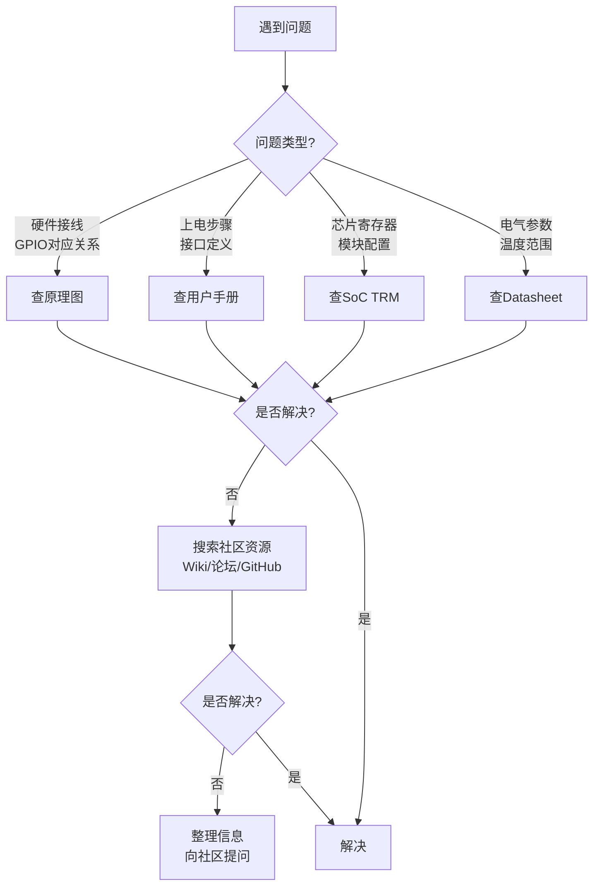

# 1.6.2 开发板手册的高效使用

> 所属章节：第1章 认识你的开发板 > 1.6 开发板的硬件资源地图
> 难度：[B] | 预计阅读时间：20分钟

## 本节导读
拿到开发板后，新手常犯的错误是漫无目的地翻手册。本节教你建立"文档地图"意识——知道有哪些文档、它们各管什么、遇到问题该查哪一本，以及善用开源社区补充厂商资料的缺口。

---

## 知识点47：板级文档体系——四本"地图"的分工 [B] ~800字

一块开发板出厂时，厂商通常会提供一整套文档。它们看似繁杂，实则各司其职。把四本核心文档的关系搞清楚，能让你在排查问题时少走弯路。

### 四本核心文档的作用

**1. 原理图（Schematic）**
原理图是硬件工程师的"电路设计蓝图"，它告诉你每个元器件是如何连接的。对于嵌入式开发者来说，原理图的核心价值在于：确认GPIO引脚最终连到了哪里、外设挂在了哪条总线上、某个LED或按键对应哪个GPIO编号。当你写代码点亮LED没反应时，原理图能帮你确认"代码里的GPIO号"和"实际连线"是否一致。

**2. PCB图（Layout / 位号图）**
PCB图展示的是元器件在电路板上的物理位置。它通常以PDF形式提供，带有元器件位号（如R12、C5、U3）。当你需要测量某个引脚的实际电压、或者确认芯片在板子上的具体位置时，PCB图比原理图更直观。很多厂商会提供交互式PDF，点击元器件即可跳转到原理图的对应位置。

**3. BOM表（Bill of Materials）**
BOM表是物料清单，列出了板上所有元器件的型号、规格和厂商。它的作用比较"后勤"：当你需要替换某个损坏的电阻、或者想了解主控芯片的具体速度等级时，BOM表是权威来源。初学者用得较少，但建议保存一份备用。

**4. 用户手册（User Manual）**
用户手册是面向开发者的"快速上手指南"，内容通常包括：板上资源概览、跳线帽/拨码开关功能、上电步骤、出厂固件说明、接口定义表。这是你拿到板子后应该**最先阅读**的文档。但注意：用户手册通常不会深入到寄存器级别，那些细节在TRM里。

### 文档对比与选择指南

| 文档类型 | 主要内容 | 典型格式 | 何时使用 | 获取难度 |
|---------|---------|---------|---------|---------|
| 用户手册 | 资源概览、接口定义、上电指南 | PDF | **入门首选**；查跳线/接口定义 | 易，官网直接下载 |
| 原理图 | 电路连接关系、引脚走向 | PDF / ORCAD | 排查GPIO接线、确认总线连接 | 中，部分厂商需注册 |
| PCB位号图 | 元器件物理位置、坐标 | PDF | 测量电压、找芯片位置、焊接 | 中，常与原理图打包 |
| BOM表 | 元器件型号、规格、厂商 | PDF / Excel | 替换元件、确认芯片速度等级 | 中 |

### 文档获取渠道

**厂商官网**：大多数厂商（如飞凌、正点原子、野火）会在产品页面的"下载中心"或"资料下载"区提供全套文档。通常需要注册账号。

**GitHub仓库**：越来越多厂商将设计文件开源在GitHub上。搜索关键词：`开发板型号 + schematic` 或 `开发板型号 + hardware`。

**随板光盘/网盘链接**：部分开发板仍附带光盘，或提供百度网盘/夸克网盘链接。注意检查文件日期，有时网盘内容比官网更新。

### 操作步骤
1. 拿到开发板后，先下载**用户手册**通读一遍，建立整体印象
2. 同时下载**原理图**，与手册中的"接口定义"章节交叉验证
3. 将四本文档存放在统一目录，建议按 `厂商/板型/文档类型/` 组织

### 常见错误
⚠️ **错误1**：跳过用户手册直接读原理图。原理图信息密度极高，新手容易迷失在网表连接中。始终先读用户手册建立宏观认知。

⚠️ **错误2**：把"快速入门指南"当成完整用户手册。很多厂商会单独提供一个几页的快速上手指南，它不等于用户手册，缺少大量接口细节。

💡 **提示**：善用PDF阅读器的"书签/目录"面板。大部分原理图PDF自带书签，点击即可跳转到CPU、电源、DDR等不同功能区块。

[图1：四种板级文档的关系示意图——从抽象到具体的分层]

```
用户手册（做什么）
    ↓
原理图（怎么连）
    ↓
PCB图（在哪放）
    ↓
BOM表（用什么零件）
```

---

## 知识点48：SoC参考手册（TRM）的定位与查阅方法 [B] ~600字

板级文档告诉你"板子怎么用"，而SoC文档告诉你"芯片怎么工作"。其中最重要的一本叫TRM。

### TRM是什么

**TRM（Technical Reference Manual，技术参考手册）** 是SoC厂商编写的芯片"百科全书"。它详细描述了芯片内部每一个功能模块的工作原理、寄存器定义、时序要求和配置流程。当你需要编写底层驱动、配置时钟树、理解中断控制器的工作方式时，TRM是唯一权威来源。

与TRM相关的还有**Datasheet（数据手册）**，两者常被混淆：

- **Datasheet** = "芯片的身份证"。包含电气特性（工作电压、温度范围、功耗）、封装信息、引脚列表、订购型号。它的读者群体是硬件工程师和采购人员。
- **TRM** = "芯片的使用说明书"。包含寄存器详细定义、模块功能描述、编程流程。它的读者群体是软件开发者和BSP工程师。

简单来说：**硬件选型看Datasheet，软件开发看TRM。**

### 如何在TRM中快速找到寄存器定义

TRM通常动辄上千页，直接从头到尾阅读不现实。你需要掌握以下查阅技巧：

**1. 利用目录结构**：TRM通常按模块组织章节（如Chapter 12: GPIO Controller, Chapter 15: UART）。先在目录中定位到目标模块。

**2. 寄存器表阅读法**：每个模块的末尾通常有"Register Map"或"Register Description"小节。典型的寄存器描述包含：
   - 寄存器名称和偏移地址（Offset）
   - 位域（Bit field）定义，如 `[31:24]` 表示第31到24位
   - 读写属性（RW = 可读可写，RO = 只读，WO = 只写）
   - 复位值（Reset Value）

**3. 善用PDF搜索**：使用PDF阅读器的搜索功能，输入寄存器名称（如 `GPIO_DR` 或 `GDIR`）快速跳转到定义页。部分厂商提供HTML版本TRM，更适合浏览器内搜索。

### 代码示例：用命令行搜索TRM中的寄存器定义

如果你下载的是文本可搜索的PDF，可以用 `pdfgrep` 工具批量搜索：

```bash
# 安装 pdfgrep（Ubuntu/Debian）
sudo apt-get install pdfgrep

# 在TRM中搜索某个寄存器名称
pdfgrep -n -i "GPIO_GDIR" i.MX6ULL_Reference_Manual.pdf

# 输出示例：
# i.MX6ULL_Reference_Manual.pdf:4023:GPIO_GDIR — GPIO direction register
# i.MX6ULL_Reference_Manual.pdf:4024:Table 28-3. GPIO_GDIR Field Descriptions
```

```bash
# 如果没有 pdfgrep，可以先用 pdftotext 转换再 grep
pdftotext i.MX6ULL_Reference_Manual.pdf - | grep -n -i "GPIO_GDIR" | head -20
```

### 常见错误
⚠️ **错误1**：在Datasheet里找寄存器定义。Datasheet通常不包含详细的寄存器位域说明，找了也白找。

⚠️ **错误2**：忽略寄存器的复位值。很多外设上电后处于禁用状态，需要显式写寄存器启用。如果不知道复位值，可能写错掩码。

💡 **提示**：同时下载TRM的**Revision History**（修订历史）。它告诉你哪些章节最近更新过——这些往往是开发者踩坑最多的地方，厂商在持续修正。

---

## 知识点49：开源社区资源：Wiki、论坛、GitHub仓库的利用 [B] ~500字

厂商文档再全面，也总有覆盖不到的角落：某个内核配置项的作用、社区驱动的移植经验、特定外设的搭配建议。这时开源社区就是你的"外脑"。

### 常见的社区资源

**Wiki**：很多开发板有社区维护的Wiki页面（如ELinux Wiki、厂家自建Wiki）。Wiki内容通常比手册更贴近实战，包含排错记录和FAQ。

**论坛**：国内如电子发烧友、正点原子论坛、野火论坛；国外如Stack Overflow、NXP Community、TI E2E。论坛适合搜索前人踩过的坑。

**GitHub仓库**：BSP源码、设备树文件、示例程序、甚至硬件设计文件都托管在这里。一个典型的BSP仓库结构如下：

```
my-board-bsp/
├── README.md              # 仓库说明、编译步骤
├── docs/                  # 补充文档
├── u-boot/               # 引导加载器源码或补丁
├── linux/                # 内核源码或设备树
├── rootfs/               # 根文件系统构建脚本
├── examples/             # 示例程序（GPIO/LED/ADC等）
└── tools/                # 烧录工具、调试脚本
```

### 如何高效搜索和提问

**搜索技巧**：
- 在GitHub搜索：`topic:imx6ull board-support` 或 `topic:rk3568 embedded`
- 在Google搜索：`site:github.com 开发板型号 uboot移植`
- 用英文关键词搜索往往结果更多：`IMX6ULL GPIO interrupt example`

**提问原则（避免"被无视"）**：
1. 先搜索，确认问题未被解答过
2. 提供环境信息：板型、内核版本、操作步骤、**完整错误日志**（不是截图，是文本）
3. 说明已尝试的排查步骤，展示你的努力
4. 一次只问一个具体问题

### 代码示例：克隆一个典型的BSP仓库并查看文档

```bash
# 克隆BSP仓库（以某i.MX6ULL仓库为例）
git clone https://github.com/example-org/imx6ull-bsp.git
cd imx6ull-bsp

# 查看README获取编译说明
cat README.md

# 查看设备树文件位置
find . -name "*.dts" -o -name "*.dtsi" | head -10

# 查看某个外设的示例代码
ls examples/gpio/
cat examples/gpio/led_blink.c
```

### 常见错误
⚠️ **错误1**：不看仓库的README和Issue列表就直接提问。80%的新手问题已经在Closed Issue里有了答案。

⚠️ **错误2**：直接下载GitHub仓库的ZIP压缩包而非用 `git clone`。ZIP包缺少 `.git` 目录，你无法查看提交历史来追踪某段代码的变更原因。

💡 **提示**：关注仓库的 **Releases** 页面而非只下载默认分支。Releases通常包含经过测试的稳定版本和发布说明。

---

## 本节总结



[图2：文档查找决策流程图——遇到问题时按此路径选择文档]

本节介绍了开发板相关的文档体系和使用方法。下表总结核心要点：

| 场景 | 首选文档 | 关键内容 | 备选/补充 |
|------|---------|---------|----------|
| 刚拿到板子，不知道接口在哪 | 用户手册 | 接口定义表、跳线说明 | 原理图交叉验证 |
| GPIO操作没反应 | 原理图 + TRM | 引脚复用关系、GPIO寄存器 | 社区搜索相同问题 |
| 写底层驱动（UART/SPI等） | SoC TRM | 寄存器位域、初始化流程 | 厂商SDK示例代码 |
| 芯片选型/电源设计 | Datasheet | 电气特性、封装、功耗 | 厂商FAE支持 |
| 板子不启动/异常重启 | 用户手册 → 原理图 | 电源时序、启动配置引脚 | 论坛排查帖 |
| 找不到某功能的实现 | GitHub BSP仓库 | 设备树、驱动补丁、示例 | 社区Wiki |

---

## 下一步

1.6.3节将讲解**如何用万用表和示波器验证硬件状态**——当你已经会查原理图、知道该量哪个引脚时，就需要实际动手测量了。掌握"查文档→定位引脚→测量验证"的闭环，是硬件排查的基本功。

---

## 配套资源

### 表格清单
- 表1：四种板级文档对比表（用户手册、原理图、PCB位号图、BOM表）

### 图示清单
- 图1：四种板级文档的分层关系示意（从抽象到具体）
- 图2：文档查找决策流程图（mermaid流程图）

### 代码清单
- 代码1：用 `pdfgrep` 在TRM中搜索寄存器定义
- 代码2：用 `pdftotext + grep` 替代方案搜索PDF
- 代码3：克隆BSP仓库并查看示例代码

### 推荐资源链接
- NXP i.MX文档中心：https://www.nxp.com/design/design-center/software/documentation:DOCUMENTATION
- TI E2E支持论坛：https://e2e.ti.com/
- ELinux Wiki（嵌入式Linux百科）：https://elinux.org/
- Linux内核文档（官方）：https://www.kernel.org/doc/html/latest/
- 正点原子资料下载页（示例厂商资料站）：http://www.alientek.com/download
