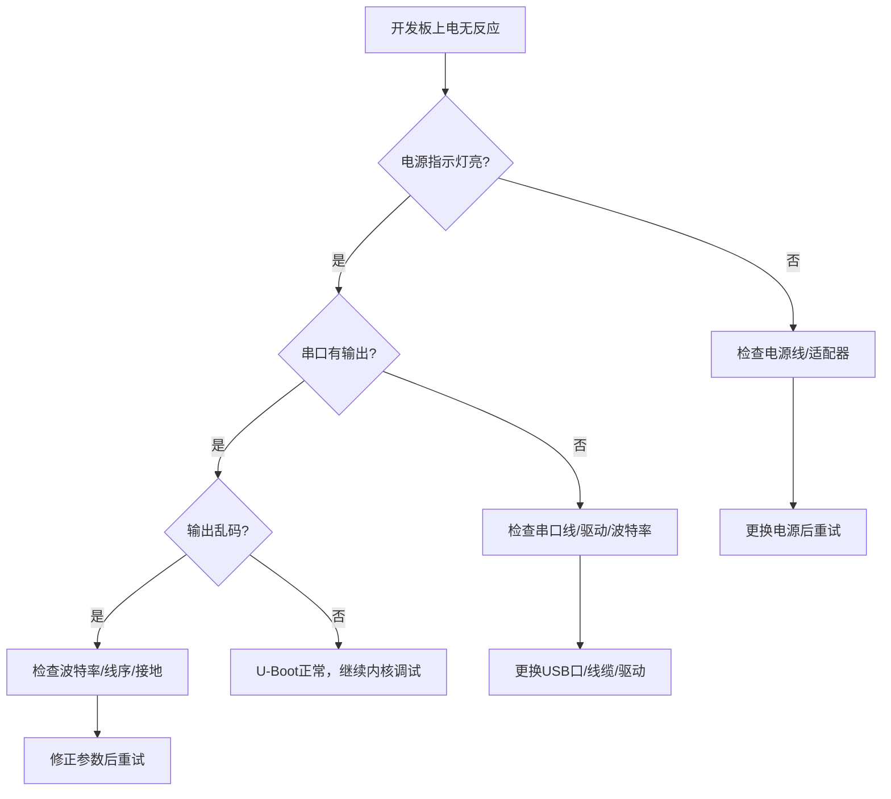

# 1.7.2 常见问题FAQ

> 所属章节：第1章 认识你的开发板 > 1.7 本章小结与进阶指引
> 难度：[B] | 预计阅读时间：15分钟

## 本节导读
本节汇集第1章读者最常遇到的10个硬件连接与串口调试问题，提供按症状排查的具体步骤，助你5分钟内定位并解决“板子不动”的困境。

## 故障排查总流程 [B]

遇到开发板无反应时，不要慌张，按以下顺序排查，80%的问题可在前两步解决：



[图1：开发板上电故障排查流程图]

---

## 10个高频FAQ [B] ~1000字

### Q1：找不到串口设备怎么办？

**症状**：`ls /dev/ttyUSB*` 或 `ls /dev/ttyACM*` 没有任何输出。

**排查步骤**：
1. 拔插USB线，观察系统是否有新设备提示音/日志
2. Linux下执行：`dmesg | tail -20` 查看内核识别日志
3. Windows下打开"设备管理器"→"端口(COM和LPT)"查看
4. 若无"USB转串口"项，安装对应驱动（CH340/CP2102/FT232等芯片驱动）

### 代码示例
```bash
# Linux：实时监控设备插入
dmesg -w

# 拔插USB线后，搜索新出现的tty设备
ls -lt /dev/tty* | head -10
```

💡 **提示**：部分板子使用USB CDC/ACM协议，设备名是 `/dev/ttyACM0` 而非 `ttyUSB0`。

---

### Q2：上电后没有任何输出

**症状**：串口终端一片空白，连一个字符都没有。

**排查步骤**：
1. 确认电源指示灯是否亮起（最基本的第一步）
2. 确认串口参数：115200波特率、8N1、无流控
3. 尝试交换TX/RX线（有些板子丝印标注的是CPU视角）
4. 用万用表测量板子供电电压是否在标称值（常见5V或3.3V）

⚠️ **陷阱**：很多新手把串口线接到了JTAG/SWD调试口，而非UART串口，请对照原理图确认丝印。

---

### Q3：输出是乱码

**症状**：有输出，但显示为"锟斤拷"或随机字符。

**排查步骤**：
1. 最常见原因：**波特率不匹配**。检查终端设置是否与板子一致（通常是115200）
2. 检查波特率倍频：有些板子要求57600或921600
3. 确认GND接地线已连接（浮地会导致信号不稳、乱码）
4. 换一根质量更好的杜邦线/数据线，排除接触不良

---

### Q4：U-Boot倒计时太快，来不及按键

**症状**：屏幕飞快闪过"Hit any key to stop autoboot"，按键盘没反应。

**排查步骤**：
1. 在倒计时期间**狂按空格键**（不是只按一次）
2. 在终端设置中关闭"本地回显"和"流控(CTS/RTS)"
3. 修改U-Boot环境变量延长倒计时：`setenv bootdelay 10; saveenv`
4. 若完全无法打断，可按住板子上的"BOOT"按键再上电，强制进入下载模式

---

### Q5：电源指示灯不亮

**症状**：接上电源后，板子上的LED无任何反应。

**排查步骤**：
1. 确认电源适配器输出电压与电流满足板子要求（常见5V/2A）
2. 检查USB线是否只是充电线（无数据线芯），更换为**数据线**
3. 检查电源插座是否有电，可换一个插座或USB口
4. 检查板子上的电源跳帽/拨码开关是否处于正确位置

🔴 **危险**：切勿用超过板子额定电压的电源供电，可能永久烧毁稳压芯片。

---

### Q6：如何判断我的板子是否损坏？

**排查步骤**：
1. **看指示灯**：电源灯不亮可能是供电问题，不代表板子坏
2. **测电流**：正常上电后板子应有几十到几百毫安电流，若电流为0或几安，异常
3. **摸温度**：上电5分钟后，SoC区域应微温；若冰凉（无电流）或烫手（短路），需进一步排查
4. **闻味道**：有明显焦糊味则大概率有元件烧毁
5. **换设备交叉验证**：将板子换到另一台电脑/另一根线上测试

---

### Q7：串口线连接后PC识别不到

**症状**：设备管理器/Linux设备列表中始终没有新增串口。

**排查步骤**：
1. 确认使用的是**USB转串口模块/线**，而非普通USB延长线
2. Linux下检查是否缺少驱动：`lsusb` 查看是否有对应VID/PID的设备
3. 手动加载常见驱动试试：`sudo modprobe cp210x` 或 `sudo modprobe ch341`
4. 更换USB端口（建议直接用主板后置USB口，而非HUB）

### 代码示例
```bash
# 查看USB设备VID/PID
lsusb | grep -i "UART\|Serial\|CH34\|CP210"
# 示例输出：Bus 001 Device 005: ID 1a86:7523 QinHeng Electronics CH340 serial converter
```

---

### Q8：开发板发热严重是否正常？

**判断标准**：
- **正常**：SoC表面温热（40~50°C），可以长时间手指接触（约3秒）
- **异常**：烫手无法触碰（>60°C），或某个小局部急剧发热

**排查步骤**：
1. 对比同型号板子的发热情况
2. 检查是否有短路：断电后测电源正负极间电阻是否过低
3. 检查是否有GPIO被错误配置为输出高电平却接到了地
4. 确保板子放在通风处，不要放在易燃物上

🔴 **危险**：若闻到焦味或看到冒烟，立即断电！不要再尝试上电。

---

### Q9：可以用手机充电器供电吗？

**答案**：可以，但要满足三个条件：

| 条件 | 要求 | 验证方法 |
|------|------|----------|
| 电压匹配 | 5V（常见）或按板子标称 | 看充电器标签上的"Output" |
| 电流充足 | ≥板子标称电流（通常1A~2A） | 电流不足会导致反复复位 |
| 线材合格 | 非劣质充电线，线阻不能过大 | 板子USB口电压应≥4.8V |

💡 **提示**：部分快充充电器在低负载时电压会高于5V（如9V），请先确认充电器非快充协议或板子支持宽压输入。

---

### Q10：如何确认我的SoC型号？

**排查步骤**：
1. **看丝印**：芯片表面通常有激光刻字，如"Allwinner H3"、"i.MX6ULL"等
2. **看文档**：查看开发板厂商提供的"快速开始指南"或硬件规格书
3. **看启动日志**：串口输出第一行通常包含SoC名称和版本号
4. **看设备树文件**：启动到Linux后执行 `cat /proc/device-tree/compatible`

### 代码示例
```bash
# 进入Linux后查看SoC信息
cat /proc/cpuinfo | grep -i "model name\|Hardware\|Processor"
cat /proc/device-tree/compatible | tr '\0' '\n' | head -5
```

---

## FAQ速查表

| 症状 | 最可能原因 | 首要解决方法 |
|------|-----------|-------------|
| 找不到串口设备 | 驱动未安装/线材仅为充电线 | 安装CH340/CP2102驱动，换数据线 |
| 上电无任何输出 | 波特率错误或TX/RX接反 | 确认115200 8N1，尝试交换TX/RX |
| 输出乱码 | 波特率不匹配/GND未接 | 统一波特率，确认GND已连接 |
| U-Boot倒计时太快 | 默认bootdelay太短 | 狂按空格键，或setenv bootdelay 10 |
| 电源灯不亮 | 供电不足/线材问题 | 检查适配器电压电流，换USB数据线 |
| 板子疑似损坏 | 供电/GND/短路问题 | 交叉验证，测电流，闻味道 |
| PC识别不到串口线 | 缺少驱动/USB HUB问题 | lsusb查VID/PID，换直连USB口 |
| 发热严重 | 短路或GPIO冲突 | 断电测电阻，检查GPIO配置 |
| 手机充电器供电 | 快充协议/电流不足 | 确认输出5V/≥1A，非快充头 |
| 不知道SoC型号 | 未查看芯片丝印/文档 | 看芯片表面刻字，读启动日志 |

[表1：开发板常见问题速查表]

## 本节总结

本节10个FAQ覆盖了第1章最常见的硬件连接困境。核心记住三条：

1. **先查电源，再查串口** — 灯不亮永远是第一步
2. **波特率、线序、GND** — 串口三要素，占乱码/无输出的90%原因
3. **交叉验证** — 换线、换口、换电脑，快速定位是板子问题还是环境问题

## 下一步

完成第1章全部内容后，你已具备：**给开发板供电、连接串口、观察启动日志、进入U-Boot交互**。第2章将教你搭建交叉编译环境，为后续编译U-Boot和Linux内核做准备。

---

## 配套资源

### 表格清单
- 表1：开发板常见问题速查表（症状→原因→解决方法）
- 表2：手机充电器供电条件检查表

### 图示清单
- 图1：开发板上电故障排查流程图 [mermaid图]
- 图2：串口引脚正确连接示意图（TX→RX，RX→TX，GND→GND）[配图说明]
- 图3：设备管理器中查看COM端口的截图位置 [配图说明]

### 代码清单
- 代码1：`dmesg | tail` / `ls -lt /dev/tty*` — Linux下查找串口设备
- 代码2：`lsusb | grep -i "UART\|Serial"` — 确认USB转串口芯片被识别
- 代码3：`cat /proc/device-tree/compatible` — Linux下查看SoC型号

### 参考文档
- CH340驱动下载：沁恒微电子官网
- CP2102驱动下载：Silicon Labs官网
- 各开发板厂商《快速开始指南》硬件连接章节
