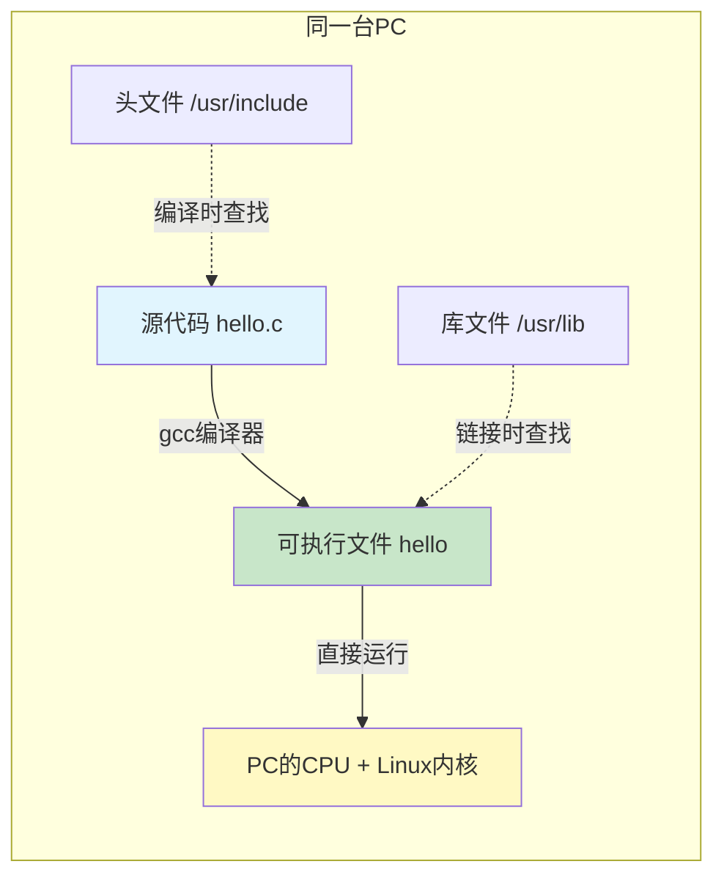

# 2.1.1 同构编译：你在PC上做的事

> 所属章节：第2章 交叉编译与工具链 > 2.1 为什么需要交叉编译
> 难度：[B] | 预计阅读时间：15分钟

## 本节导读

本节带你回顾最熟悉的"本地编译"过程——在PC上写代码、在PC上编译、在PC上运行。理解这个看似理所当然的模式，是理解"为什么需要交叉编译"的第一步。学完本节，你能用`file`命令看懂编译产物，并发现本地编译背后隐藏的四个假设。

---

## 知识点1：用`file`命令读懂编译产物 [B] ~300字

在Linux PC上写C程序，最常见的流程是：

```bash
# 1. 写一个简单的C程序
$ cat > hello.c << 'EOF'
#include <stdio.h>
int main(void)
{
    printf("Hello, Embedded Linux!\n");
    return 0;
}
EOF

# 2. 用gcc编译
$ gcc -o hello hello.c

# 3. 用file命令查看编译产物
$ file hello
hello: ELF 64-bit LSB executable, x86-64, version 1 (SYSV),
       dynamically linked, interpreter /lib64/ld-linux-x86-64.so.2,
       BuildID[sha1]=..., for GNU/Linux 3.2.0, not stripped
```

### `file`输出解读

| 字段 | 含义 | 说明 |
|------|------|------|
| `ELF 64-bit` | 文件格式 | ELF（Executable and Linkable Format），64位版本 |
| `LSB` | 字节序 | 小端序（Least Significant Byte first） |
| `x86-64` | 目标架构 | 该程序只能运行在x86-64（AMD64）处理器上 |
| `dynamically linked` | 链接方式 | 运行时依赖动态库（如libc.so） |
| `interpreter /lib64/ld-linux-x86-64.so.2` | 动态加载器 | 程序启动时由这个加载器负责加载依赖库 |
| `for GNU/Linux 3.2.0` | 目标系统 | 编译时面向的操作系统/ABI版本 |

💡 **提示**：`file`命令不依赖文件扩展名，它读取文件头部的魔术字节（magic bytes）来判断类型。即使你把`hello`改名为`hello.jpg`，`file`依然能正确识别它是ELF可执行文件。

⚠️ **陷阱**：初学者常把"编译成功"和"能运行"混为一谈。`gcc`编译成功只代表语法正确，不代表能在其他设备上运行——`x86-64`的程序放到ARM开发板上会直接报"cannot execute binary file: Exec format error"。

---

## 知识点2：本地编译的隐含假设 [B] ~400字

上面的`gcc -o hello hello.c`看似简单，实际上隐藏了四个"同一台机器"的假设：



[图1：本地编译的单机闭环——编译器、头文件、库文件、运行环境都在同一台机器上]

### 四个隐含假设拆解

| 环节 | 假设内容 | 在PC上的具体表现 |
|------|----------|------------------|
| **编译器** | 编译器本身能在当前机器运行 | `gcc`是x86-64程序，调用x86-64汇编器和链接器 |
| **头文件** | 头文件与当前系统匹配 | 使用`/usr/include`下的头文件，对应本机内核版本和glibc版本 |
| **库文件** | 库文件与当前架构匹配 | 链接`/usr/lib/x86_64-linux-gnu/libc.so`，不是ARM版本 |
| **运行环境** | 编译产物能在当前机器直接执行 | PC的CPU理解x86-64指令，内核是Linux，能加载ELF |

在PC开发时，这四个条件天然满足，你甚至不会意识到它们的存在。但当你面对一块ARM开发板时——它的CPU不认识x86-64指令、它的系统路径里没有`/lib64/ld-linux-x86-64.so.2`——这些假设全部崩塌。

这就是**交叉编译**要解决的问题：编译器在PC上运行（x86-64），但产出的程序要在开发板上运行（ARM）。编译环境和运行环境分离了，四个假设不再成立。

🔴 **危险**：不要尝试直接把PC编译的ELF二进制文件`scp`到ARM开发板上执行。这不仅不会工作，还可能因为字节序、ABI差异等问题产生误导性错误信息，浪费大量调试时间。先用`file`命令确认目标架构再传输。

---

## 本节总结

| 概念 | 核心要点 | 实操检验 |
|------|----------|----------|
| ELF文件 | Linux可执行文件的标准格式，包含架构、字节序、链接方式等元信息 | `file <可执行文件>` |
| 本地编译的四个假设 | 编译器、头文件、库文件、运行环境都在同一台机器上 | 在PC上编译并运行`hello`，观察每一步的依赖 |
| 同构 vs 异构 | 同构编译 = 编译环境和运行环境架构相同；异构/交叉编译 = 架构不同 | 对比`file hello`输出的`x86-64`与开发板的`ARM` |

## 下一步

既然本地编译的四个假设在开发板上不成立，我们就需要一个"在PC上运行、却能生成ARM程序"的编译器。下一节（2.1.2）将介绍这个神奇的工具——**交叉编译器**（Cross Compiler）的工作原理。

---

## 配套资源

### 表格清单
- 表1：`file`命令输出字段解读表（ELF格式各字段含义）
- 表2：本地编译四个隐含假设拆解表

### 图示清单
- 图1：本地编译的单机闭环图 [mermaid流程图] —— 展示编译器、头文件、库文件、运行环境在同一台PC内的闭环关系

### 代码清单
- 代码1：最小C程序（hello.c）
- 代码2：gcc编译 + file命令查看ELF信息的完整shell命令
