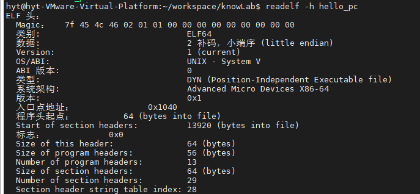
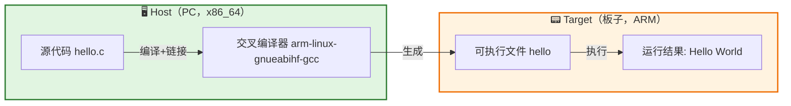

# 2.1.2 异构编译：你在PC上为板子做的事

> 所属章节：第2章 开发环境搭建 > 2.1 交叉编译 toolchain
> 
> 难度：[B→B] | 预计阅读时间：12分钟

## 本节导读
本节解答一个最直观的疑问：为什么你不能直接把PC上编译好的程序拿到板子上跑？通过动手验证和对比分析，你将建立"Host-Target"双机模型的认知框架，为理解交叉编译扫清第一个障碍。

---

## <span class="blue"> 为什么PC的程序不能直接放到板子上跑？——三个根本原因 [B] 

很多初学者第一次接触嵌入式开发时，都会犯同一个错误：在PC上编译了一个`hello`程序，通过U盘或`scp`拷贝到开发板，然后直接运行，结果看到一行刺眼的红字：

```bash
$ ./hello
-bash: ./hello: cannot execute binary file: Exec format error
```

这并不是你的程序写错了，而是**PC和嵌入式板子是两套完全不同的世界**。就像你把柴油加到汽油车里，引擎根本不认识这种"燃料"。根本原因可以归结为两个字：**异构**（Heterogeneous）。

### 原因一：CPU架构不同 —— "方言"不通 [B]

你的PC大概率是Intel或AMD的x86_64处理器，而嵌入式板子通常是ARM Cortex-A系列或RISC-V核心。这两种CPU的"母语"完全不同：

| 维度 | x86_64（PC） | ARM/RISC-V（嵌入式板） |
|------|-------------|----------------------|
| 指令集 | CISC，指令长度可变 | RISC，指令长度固定（32位/16位Thumb） |
| 寄存器数量 | 16个通用寄存器 | ARM有31个，RISC-V有32个 |
| 字节序 | 小端（Little-endian） | 通常小端，但部分MCU为大端 |
| 特权级 | Ring 0~3 | EL0~EL3（异常级别） |

编译器把C代码翻译成目标CPU能识别的机器码。在x86_64上编译出来的二进制，里面全是x86的`mov`、`call`、`ret`指令；ARM板子上的CPU看到这些字节流，完全不知道该如何解码执行。这就好比你把一份中文合同递给只懂法语的人——文件在手里，但内容无法解读。

### 动手验证：用`readelf`看二进制"身份证"

**步骤1**：在PC上编译一个最简单的程序

```bash
# 在PC（x86_64）上执行
$ echo 'int main(){ return 0; }' > hello.c
$ gcc hello.c -o hello_pc
```

**步骤2**：查看PC编译结果的文件头

```bash
$ readelf -h hello_pc | grep -E "Class|Machine|Type"
  Class:                             ELF64
  Machine:                           Advanced Micro Devices X86-64
  Type:                              EXEC (Executable file)
```

**步骤3**：如果你有一块ARM开发板（如树莓派、全志H6），在板子上编译同样的程序

```bash
# 在ARM开发板上执行
$ gcc hello.c -o hello_arm
$ readelf -h hello_arm | grep -E "Class|Machine|Type"
  Class:                             ELF32  # 或ELF64
  Machine:                           ARM
  Type:                              EXEC (Executable file)
```



**步骤4**：把PC版`hello_pc`拷贝到ARM板子上运行

```bash
# 在ARM开发板上执行
$ ./hello_pc
-bash: ./hello_pc: cannot execute binary file: Exec format error
```

> ⚠️ **陷阱**：不要混淆"无法执行"和"找不到文件"。如果提示`No such file or directory`，但实际文件存在，那通常是因为缺少动态链接器（后续2.3节会讲）；而`Exec format error`则明确告诉你——**CPU架构不认识这个二进制格式**。

### 原因二：性能与资源差异 —— "跑车"与"拖拉机" [B]

PC拥有4GHz以上的主频、16GB以上的内存、数百GB的SSD；而典型的嵌入式板子可能只有1GHz、512MB RAM、8GB eMMC。你当然可以在板子上装GCC、make、kernel源码，然后本地编译一个Linux内核——但可能需要**几十个小时**，而且板子的存储空间根本放不下完整的源码树。

交叉编译的核心逻辑是：**利用PC的强大算力，为资源受限的板子生产代码**。就像你在工厂的流水线上（PC）组装好零件，再运到工地（板子）直接使用，而不是把整套工厂搬到工地现场去。

### 原因三：运行环境缺失 —— "水土不服" [B]

即使架构相同（比如在x86 PC上编译另一个x86程序），程序运行还依赖操作系统提供的**系统调用接口**和**动态链接库**。嵌入式板子通常运行裁剪过的Linux系统，缺少PC上常见的glibc版本、X11图形库、甚至是64位支持。一个为PC的Ubuntu 22.04编译的程序，拿到板子的Buildroot/Yocto系统上，很可能因为库版本不匹配而崩溃。

> 💡 **提示**：你可以把"交叉编译"理解为**在A地为B地的人准备行李**。你需要知道B地的气候（架构）、行李重量限制（性能）、当地能买到的日用品（库环境），才能打包出一份"到了就能用"的行李。

---

## <span class="blue"> Host vs Target —— 建立双机模型认知 [B] 

理解了"为什么不能直接跑"，现在我们需要一套术语来描述这两台机器的角色。在交叉编译的语境中，有两台（甚至是三台）机器参与。

### Host：编译环境（你的PC）

**Host**是程序被**编译、链接**的地方。它通常是一台x86_64架构的PC，拥有完整的开发工具链（gcc、make、ld等）、海量存储、高速CPU。Host不关心最终程序能不能在自己身上跑——它的任务只是"把代码翻译好、打包好"。

### Target：运行环境（你的板子）

**Target**是程序最终要**执行**的地方。它可能是ARM、RISC-V或MIPS架构的嵌入式设备，资源有限，通常只保留运行程序所需的最小环境，不安装编译器。

### Build/Host/Target 三重区分（进阶了解）

GNU Autotools文档中定义了更精确的三元组：

- **Build**：执行编译操作的那台机器（通常是Host本身）
- **Host**：编译器将运行在哪个平台上（交叉编译时，Host ≠ Build）
- **Target**：编译器生成的程序将运行在哪个平台上

对我们初学者来说，记住一个简化模型即可：



[图1：Host-Target 双机模型——源代码在Host上编译，生成二进制在Target上运行]

在**本地编译**（Native Compile）场景中，Host和Target是同一台机器——你在PC上编译，在PC上运行。而在**交叉编译**（Cross Compile）场景中，Host和Target是不同架构的两台机器，中间由交叉编译器这座"桥梁"连接。

💡 **提示**：以后你在源码编译时看到`./configure --host=...`或`make ARCH=arm`这样的参数，就是在告诉构建系统："我在为另一台机器编译，请按那台机器的规则来翻译代码。"

🔴 **危险**：初学者最容易混淆的是"Host"这个词。在日常口语中，"主机"通常指PC；但在某些文档中，"Host"也可能指代板子（比如USB Gadget模式下，PC是"Device"，板子是"Host"）。**在交叉编译语境中，Host永远指编译环境的那台机器**。

---

## 本节总结

| 概念 | 核心要点 | 实操验证 |
|------|---------|---------|
| 架构不同 | x86_64与ARM/RISC-V指令集互不兼容 | `readelf -h`查看Machine字段对比 |
| 性能差异 | 板子算力弱、存储小，不适合本地编译 | 在板子上编译内核，观察耗时 |
| 环境缺失 | 库版本、系统调用接口不同 | 拷贝PC二进制到板子，观察运行错误 |
| Host | 编译发生的地方（你的PC） | 安装交叉编译器，执行编译 |
| Target | 程序最终运行的地方（你的板子） | 将编译产物拷贝到板子执行 |
| 双机模型 | Host编译 → 产物传输 → Target运行 | 理解整个交叉编译的数据流 |

---

## 下一步

你已经建立了"Host为Target编译"的基本认知模型。但交叉编译器如何知道自己该生成哪种格式的二进制？答案藏在一个叫**"Target Triple"**的字符串里——它精确描述了目标平台的架构、厂商、操作系统和ABI。2.1.3节将带你解剖这个字符串，读懂`arm-linux-gnueabihf`或`aarch64-linux-gnu`背后的每一层含义。

---

## 配套资源

### 表格清单
- 表1：x86_64 vs ARM/RISC-V 架构对比表（知识点2.1.2.a）
- 表2：本节核心概念与实操对照表（本节总结）

### 图示清单
- 图1：Host-Target 双机模型流程图 [mermaid图]

### 代码清单
- 代码1：PC上编译hello.c并查看ELF头（`readelf -h`对比）
- 代码2：ARM板上运行PC编译产物，观察`Exec format error`
