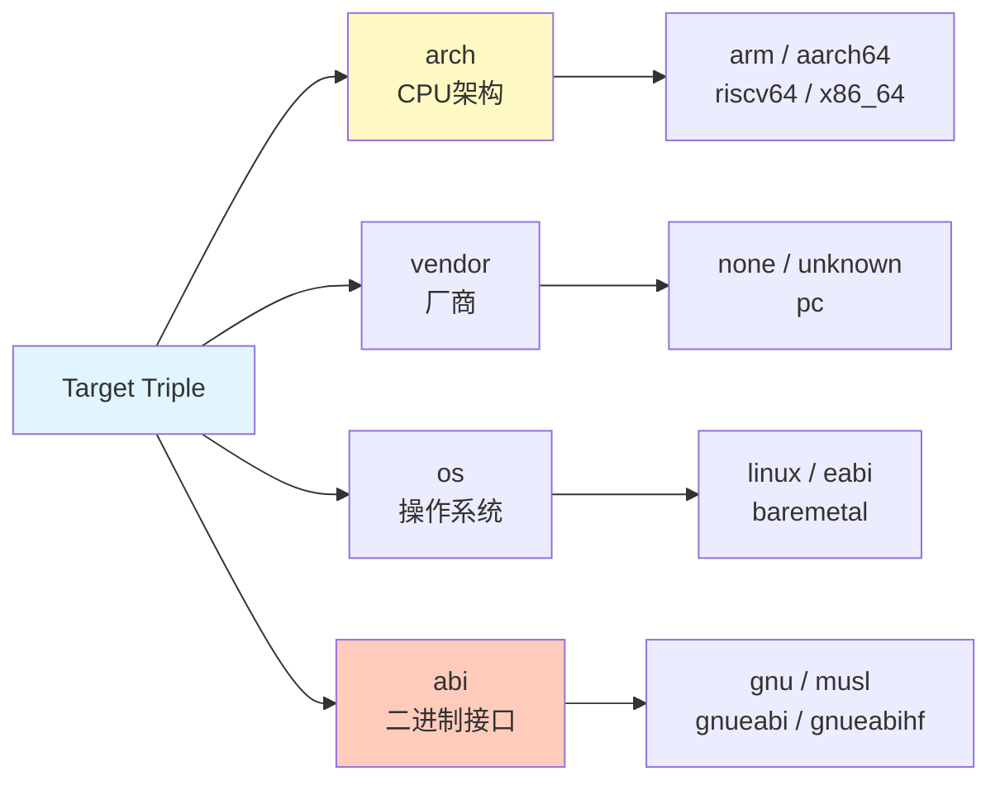

# 2.1.3 Target Triple：工具链的身份证

> 所属章节：第2章 嵌入式开发环境搭建 > 2.1 交叉编译工具链
> 
> 难度：[B→B] | 预计阅读时间：15分钟

## <span class="blue"> 本节导读

本节教你"看懂"交叉编译器名字里藏着的密码。<BR>学完你将能从一个Target Triple字符串（如`arm-linux-gnueabihf`）中，准确判断出它为目标芯片、目标操作系统和目标ABI而生，再也不会装错工具链。

---

## <span class="blue"> Target Triple四段式解析 [B] 

当你在Ubuntu里敲`sudo apt install gcc-arm-linux-gnueabihf`时，那个冗长的包名并不是随便起的。它遵循一个被GCC、LLVM、Binutils等所有主流工具共同遵守的命名规范, **Target Triple**（目标三元组，实际是四段，但历史名称沿用至今）。

它的格式像一把精确的尺子：

```
arch-vendor-os-abi
```

| 字段 | 含义 | 示例值 | 说明 |
|------|------|--------|------|
| **arch** | CPU架构 | `arm`、`aarch64`、`riscv64`、`x86_64` | 决定生成哪种指令集 |
| **vendor** | 厂商/供应商 | `none`、`unknown`、`pc` |  often可忽略；`none`表示裸机 |
| **os** | 目标操作系统 | `linux`、`eabi`（裸机ABI）、`windows` | 决定系统调用/启动方式 |
| **abi** | 应用二进制接口 | `gnu`、`gnueabihf`、`musl` | 决定库类型和浮点调用规则 |

[图1：Target Triple四段式结构解析]



下面这张表是嵌入式开发中最常遇到的四个Target Triple，建议你贴在显示器旁边：

**表1：常见嵌入式Target Triple速查表**

| Target Triple | arch | vendor | os | abi | 适用场景 |
|---------------|------|--------|-----|-----|----------|
| `arm-none-eabi` | ARM 32位 | none | eabi（裸机） | eabi | 无操作系统裸机（STM32、NXP LPC等MCU） |
| `arm-linux-gnueabihf` | ARM 32位 | unknown | linux | gnueabihf | 带Linux的ARM板子（树莓派Zero、i.MX6） |
| `aarch64-linux-gnu` | ARM 64位 | unknown | linux | gnu | 64位ARM Linux（树莓派4/5、RK3588） |
| `riscv64-linux-musl` | RISC-V 64位 | unknown | linux | musl | 轻量级RISC-V Linux（如某些RV64开发板） |

> 💡 **记忆口诀**：先看`arch`认芯片，再看`os`认有无Linux，最后看`abi`尾巴认浮点。

### 操作步骤：快速判断你手里的工具链

打开你的终端，执行以下命令：

```bash
# 方法1：查看环境变量（开发板SDK通常会自动设置）
echo ${CROSS_COMPILE}
# 输出示例：aarch64-linux-gnu-

# 方法2：查看已安装交叉编译器的前缀
ls /usr/bin/*-gcc* 2>/dev/null | head -5
# 输出示例：/usr/bin/arm-linux-gnueabihf-gcc

```

### 常见错误

> ⚠️ **陷阱1：把裸机工具链用于Linux编译**<BR>
`arm-none-eabi-gcc`是为没有操作系统的MCU设计的，它编译出来的程序无法在Linux上运行，因为缺少Linux系统调用入口。反过来，`arm-linux-gnueabihf-gcc`编译的代码也无法在裸机上跑，因为它会尝试链接`libc.so`。

> 💡 **提示**：如果你看到`none`出现在vendor或os位置，立刻联想到"裸机"二字。

---

## <span class="blue">  ABI后缀解读——浮点里的"大坑" [B] 

Target Triple的最后一个字段（或最后一部分）藏着工具链最关键的"脾气"：它用哪种方式处理**浮点运算**。

| ABI后缀 | 全称 | 浮点方式 | 典型场景 |
|---------|------|----------|----------|
| `eabi` | Embedded ABI | 软浮点（软件模拟） | 无FPU的MCU |
| `gnueabi` | GNU EABI | 软浮点 + Linux | 老ARM9/无FPU的ARM Linux |
| `gnueabihf` | GNU EABI Hard Float | **硬浮点**（FPU指令） | 有FPU的ARM Linux |
| `gnu` / `musl` | 默认ABI | 通常硬浮点 | 64位架构默认带FPU |

### 软浮点 vs 硬浮点：一句话区分

- **软浮点（soft float）**：没有FPU的芯片，浮点运算用整数指令模拟。慢，但兼容性好。
- **硬浮点（hard float，hf）**：芯片内置FPU（如ARM的VFPv3/v4），直接用`vadd.f32`等浮点指令。快，但要求芯片有硬件。

### 关键判断：你的板子有没有FPU？

```bash
# 在目标板（或开发机qemu）上执行
cat /proc/cpuinfo | grep -i "features"
# ARM 32位板子如果看到"vfp"或"neon"字样 → 有FPU，用hf
# 如果空白或只有"thumb" → 无FPU，用非hf

uname -m
# 输出：aarch64  ← 就是64位
# 输出：armv7l   ← 就是32位

uname -a
# 会包含 aarch64 或 armv7l
```

> ⚠️ **静默惩罚陷阱（最危险的错误）**

> - 用`gnueabihf`工具链编译代码，然后在**没有FPU**的板上运行, 程序不会报错，不会崩溃，而是进入一种"慢动作"状态：Linux内核检测到非法FPU指令后，陷入内核用软件模拟每条浮点指令。**你的程序能跑，但浮点运算慢10~100倍**，而且你很难察觉。

> 🔴 **危险**：这个陷阱之所以叫"静默惩罚"，是因为它不会触发任何明显错误。很多初学者在性能调优阶段才偶然发现这个问题，此前已经浪费了数周时间。

> 💡 **黄金法则**：**芯片手册 > 一切猜测**。翻到SoC数据手册的"Features"页，搜索"FPU"或"VFP"，确认存在后再选`hf`工具链。
> 
>  aarch64的板子默认aarch64-linux-gnu-

---

## 本节总结

| 概念 | 核心要点 | 操作建议 |
|------|----------|----------|
| Target Triple格式 | `arch-vendor-os-abi`四段式 | 逐段拆解，先看arch再看abi |
| `arm-none-eabi` | 裸机、无OS、软浮点 | MCU开发选它 |
| `arm-linux-gnueabihf` | Linux、ARM 32位、硬浮点 | 树莓派/i.MX等带FPU的板子 |
| `aarch64-linux-gnu` | Linux、ARM 64位 | 现代64位ARM开发板 |
| ABI中的`hf` | 表示硬浮点，要求芯片有FPU | **查手册确认FPU后再选hf** |
| 静默惩罚 | 无FPU跑hf代码 → 内核软模拟 | 性能暴跌但不报错，最难排查 |

## 下一步

你已经学会了"读"工具链的身份证。<br>下一节（2.1.4）我们将动手**安装一套真实的交叉编译工具链**，并验证它能否为你的目标板生成正确的二进制文件。

---
