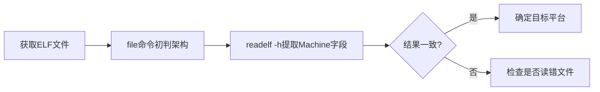

# 2.1.4 验证你的理解

> 所属章节：第2章 嵌入式Linux开发环境搭建 > 2.1 认识交叉编译工具链
> 难度：[B→I] | 预计阅读时间：8分钟

## 本节导读
本节是一个动手练习——你拿到一个编译好的程序文件，却不知道它是给电脑还是给开发板用的。用`readelf`和`file`两个工具交叉验证，你就能像侦探一样"破案"。

---

## 知识点1：用readelf和file交叉验证 [B] ~300字

[B] 拿到一个陌生的二进制文件，如何判断它是为谁编译的？本节教你在30秒内定位答案。

### 操作步骤

**第一步：file命令快速初筛**

```bash
file hello_arm
```

典型输出：
```
hello_arm: ELF 32-bit LSB executable, ARM, EABI5 version 1 (SYSV), statically linked
```

`file`命令会直接告诉你文件的架构和位数——这是第一重判断。

**第二步：readelf -h提取关键字段**

```bash
readelf -h hello_arm
```

重点关注ELF头部中的以下字段：

| 字段名 | 含义 | 示例值 | 判断要点 |
|--------|------|--------|----------|
| Magic | 文件魔数 | `7f 45 4c 46` | 所有ELF文件开头都是`.ELF` |
| Class | 字长 | `ELF32` / `ELF64` | 32位还是64位 |
| Machine | **目标架构** | `ARM` / `x86-64` | **最关键字段** |
| OS/ABI | 操作系统ABI | `UNIX - System V` | 常为System V |
| Entry point | 入口地址 | `0x10300` | 启动地址（不同架构范围不同） |

[表1：readelf -h关键字段速查表]

**第三步：交叉比对**

把`file`和`readelf`的结果放在一起对比——两者必须一致才能下结论。例如file说是ARM，readelf的Machine也必须是ARM。



[图1：ELF文件交叉验证流程]

### 常见错误

⚠️ **陷阱**：readelf显示`Machine: ARM`，你却试图在x86电脑上直接运行——这是不可能的！交叉编译产生的二进制只能在对应架构上执行（或使用qemu模拟器）。

⚠️ **陷阱**：忘记加`-h`参数，`readelf`会输出所有段信息，屏幕被几百行数据刷满。始终用`readelf -h`只看头部。

💡 **提示**：把这两个命令写进你的检查清单。以后拿到陌生二进制，5秒就能知道它是为谁编译的。

---

## 本节总结

| 工具 | 作用 | 关键命令 | 看哪个字段 |
|------|------|----------|------------|
| file | 快速识别文件类型 | `file <文件名>` | 输出中的架构名 |
| readelf -h | 读取ELF头部 | `readelf -h <文件名>` | Machine字段 |

核心心法：**单一工具不可信，交叉验证才可靠。** file说它是ARM，readelf也说它是ARM——这才是铁证。

---

## 下一步

你已经掌握了交叉编译产物的识别方法。下一节（2.2）我们将深入认识**QEMU模拟器**，学习如何在x86电脑上"假装"成ARM开发板来运行刚才验证过的二进制文件——无需硬件也能测试！

---

## 配套资源

### 表格清单
- 表1：readelf -h关键字段速查表

### 图示清单
- 图1：ELF文件交叉验证流程 [mermaid流程图]
- 图2：readelf -h实际输出截图 [配图说明：展示一个ARM ELF文件的readelf -h输出，高亮Machine字段]

### 代码清单
- 代码1：file命令初判文件类型
- 代码2：readelf -h查看ELF头部
