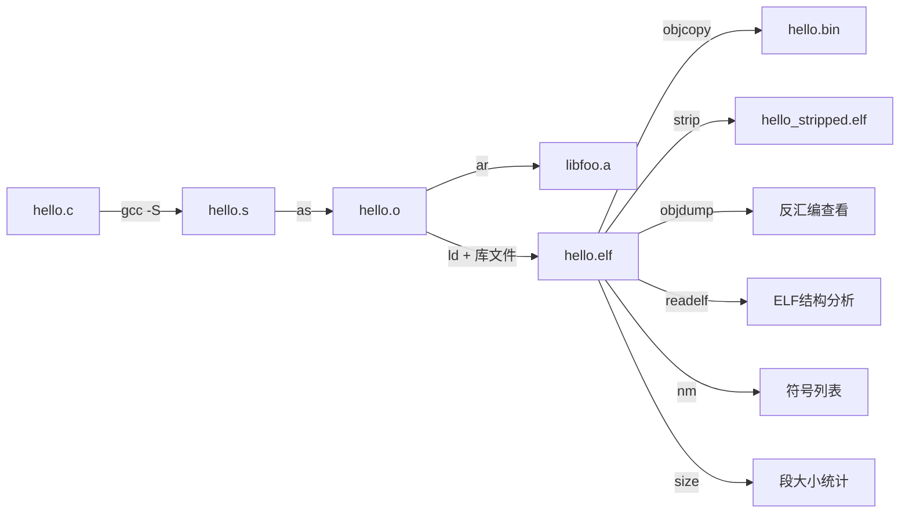
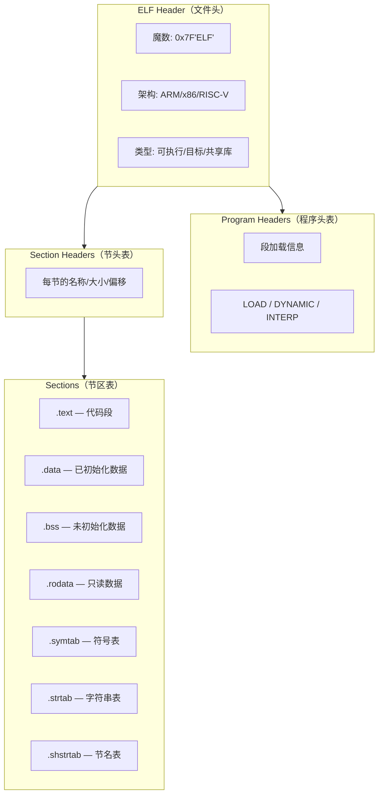

# 2.2.2 binutils：厨房工具（二进制工具集）

> 所属章节：第2章 嵌入式Linux工具链 > 2.2 工具链铁三角
> 
> 难度：[B→B] | 预计阅读时间：20分钟

## <span class="blue"> 本节导读

本节用"厨房工具"比喻讲解 GNU binutils 二进制工具集。<BR>gcc这位"厨师"做完切配后，还需要一套趁手的工具来完成后续的"烧制、装盘、质检"工序。你将认识 binutils 八大核心工具，并亲手用 objdump 和 readelf 解剖一个 ELF 可执行文件。

---

## <span class="blue"> 核心工具一览——binutils八大金刚 [B] 

### 1.1 什么是 binutils？

**binutils = Binary Utilities（二进制工具集）**，是 GNU 项目下的一组处理二进制文件的工具程序。如果把 gcc 比作"厨师"，那 binutils 就是厨房里的一套专业工具：切菜刀、炒锅、盘子、食品检测仪……gcc 把食材（C代码）切配好后，要靠这些工具把"半成品"变成"成品菜"。

在嵌入式开发中，binutils 的交叉编译版本名称前缀会带上目标架构，例如：

- `aarch64-linux-gnu-objdump`
- `arm-linux-gnueabihf-readelf`
- `riscv64-linux-gnu-nm`

### 1.2 八大核心工具速查表

| 工具 | 全称/含义 | 厨房比喻 | 核心作用 | 嵌入式典型场景 |
|------|-----------|----------|----------|----------------|
| **as** | Assembler（汇编器） | 炒锅 | 把 `.s` 汇编代码编译成 `.o` 机器码 | gcc 自动调用，交叉编译时对应 `aarch64-linux-gnu-as` |
| **ld** | Linker（链接器） | 拼盘师 | 把多个 `.o` 文件合并成可执行文件 | 定制链接脚本（Linker Script）控制内存布局 |
| **objdump** | Object Dump | X光机 | 反汇编 `.o`/可执行文件，查看机器码 | 分析崩溃现场指令、验证编译优化效果 |
| **readelf** | Read ELF | 食品成分分析仪 | 解析 ELF 文件头、段、符号表、动态段 | 查看动态库依赖、检查 ELF 架构属性 |
| **nm** | Name List | 食材标签机 | 列出目标文件/库中的符号（函数/变量名） | 快速查看某个函数是否在 `.a` 静态库中 |
| **objcopy** | Object Copy | 食品包装机 | 复制并转换目标文件格式 | `.elf` → `.bin`/`.hex` 烧录格式转换 |
| **ar** | Archiver | 食品收纳盒 | 创建和管理静态库（`.a` 文件） | 将多个 `.o` 打包成 `libfoo.a` |
| **strip** | Strip | 去皮刀 | 移除符号表和调试信息，瘦身 | 发布前减小可执行文件体积 |
| **size** | Size | 秤 | 列出各段（text/data/bss）占用大小 | 评估固件体积，检查 RAM 占用 |

### 1.3 它们在实际编译中的位置

gcc 调用这些工具的顺序可以用一条流水线表示：



> 💡 **提示**：平时用 `gcc hello.c -o hello` 一条命令就完事了，gcc 在背后默默调用了 as 和 ld。但当出了问题（链接报错、段错误、文件体积过大）时，你就需要手动使用 binutils 来排查。

### 常见错误

⚠️ **错误1**：以为 binutils 只有 `ld` 和 `as`
> 实际上 objdump、readelf、nm 才是日常调试最频繁使用的三个工具。

⚠️ **错误2**：用本地版本的 `objdump` 分析交叉编译出来的 `.o` 文件
> 本地 `objdump` 默认按 x86-64 解析 ARM 二进制文件会报错或输出乱码。务必使用对应架构的交叉 objdump，如 `arm-linux-gnueabihf-objdump`。

💡 **提示**：不知道某个工具的全名？在工具链目录下搜索：`ls $(dirname $(which aarch64-linux-gnu-gcc))/aarch64-linux-gnu-*`

---

## <span class="blue"> as和ld的实际角色——gcc的"幕后搭档" [B] 

### 2.1 gcc 为什么不自己做汇编和链接？

gcc 是"前端编译器"，只负责把 C 代码变成汇编（`.s`）。接下来两步 gcc 选择"外包"给专业工具：

| 阶段 | 工具 | gcc 选项 | 类比 |
|------|------|----------|------|
| 汇编（`.s` → `.o`） | **as** | `-c` | 炒锅把配菜炒熟 |
| 链接（`.o` → `ELF`） | **ld** | 无选项 | 拼盘师把多道菜拼成套餐 |

### 2.2 亲眼看看 gcc 如何自动调用它们

```bash
# 用 -v 选项查看 gcc 编译全过程的详细日志
gcc -v hello.c -o hello 2>&1 | grep -E "(as|ld|collect2)"
 /usr/lib/gcc/x86_64-linux-gnu/11/cc1 ...        ← gcc 前端
 as -v ... -o /tmp/ccxxx.o /tmp/ccxxx.s          ← gcc 调用 as
 collect2 ... -o hello /tmp/ccxxx.o ...          ← collect2 调用 ld
```

`collect2` 是 gcc 的一个 wrapper，它在真正调用 `ld` 之前还要做一些初始化工作（如执行 `__attribute__((constructor))` 函数）。

### 2.3 为什么要单独了解 as 和 ld？

- **链接脚本**：嵌入式系统内存布局特殊（Flash 在 0x08000000、RAM 在 0x20000000），必须用 `ld` 配合链接脚本 `.ld` 文件来指定段放在哪里。
- **裸机启动**：没有操作系统的 MCU 程序，第一条指令地址由 `ld` 决定，链接脚本是启动代码正常运行的关键。

> 💡 **提示**：即使 gcc 自动调用 as/ld，你也该知道它们的存在。当遇到 `undefined reference to xxx` 或 `section overlap` 报错时，排查对象是 ld，不是 gcc。

---

## <span class="blue"> objdump与readelf实战：解剖ELF文件 [B] 

### 3.1 ELF 文件是什么？

ELF（Executable and Linkable Format）是 Linux 世界的"通用容器"，可执行文件、目标文件（`.o`）、共享库（`.so`）、静态库（`.a` 内部成员）都是 ELF 格式。理解 ELF 结构是嵌入式调试的"基本功"。

### 3.2 ELF 文件结构示意图



[图2：ELF文件内部结构——从文件头到节头表的层次关系]

> 🔴 **危险**：嵌入式中经常遇到"段重叠"或"段超出 Flash 范围"的错误，根源就是链接脚本指定的段地址与 ELF 的 Program Headers 不匹配。readelf 可以帮助你验证链接结果是否符合预期。

### 3.3 objdump 实战：反汇编查看机器码

```bash
# 1. 编译一个测试程序
$ cat > test.c << 'EOF'
int add(int a, int b) { return a + b; }
int main(void) { return add(1, 2); }
EOF
$ gcc -g test.c -o test

# 2. 反汇编整个可执行文件（最常用）
$ objdump -d test > test.dis

# 3. 带源代码混合显示（调试神器）
$ objdump -d -S test > test.dis_with_src

# 4. 只看某个函数的汇编
$ objdump -d test | grep -A 20 "<add>:"

# 5. 查看 ELF 文件头信息
$ objdump -f test
```

> 💡 **提示**：`-d -S` 组合是调试段错误（Segmentation Fault）的利器。拿到崩溃地址后，用 `objdump -d -S` 找到对应源码行号。

### 3.4 readelf 实战：全面解析 ELF 元数据

```bash
# 1. 查看 ELF 文件头（确认架构、大小端、类型）
$ readelf -h test

# 2. 查看所有节区（段）信息
$ readelf -S test

# 3. 查看符号表（函数名、全局变量）
$ readelf -s test

# 4. 🔥 查看动态链接依赖（嵌入式排查库缺失的神器）
$ readelf -d /path/to/target_app
Dynamic section at offset 0x1234:
  NEEDED               libc.so.6        ← 依赖 libc.so.6
  NEEDED               libm.so.6        ← 依赖 libm.so.6
  SONAME               myapp.so
```

> 💡 **提示**：`readelf -d | grep NEEDED` 是嵌入式移植时必跑的命令。如果目标板报错 "cannot open shared object file"，先用 readelf 确认程序到底依赖哪些库。

### 常见错误

⚠️ **错误3**：objdump 输出看不到 C 源代码
> 原因：编译时没加 `-g` 选项生成调试信息。objdump 的 `-S` 需要调试符号才能关联源码。

⚠️ **错误4**：把 `readelf -s` 和 `readelf -S` 搞混
> `-s`（小写）看**符号表**（symbol table）；`-S`（大写）看**节区表**（section headers）。记住：`s` = symbol，`S` = Section。

---

## <span class="blue"> 本节总结

| 概念 | 要点 | 必会命令 |
|------|------|----------|
| as | 汇编器，`.s` → `.o` | `gcc -v` 可观察自动调用 |
| ld | 链接器，合并 `.o` + 库 → 可执行文件 | 嵌入式需掌握链接脚本 `.ld` |
| objdump | 反汇编 + 文件头查看 | `objdump -d -S`（源码级反汇编） |
| readelf | ELF 元数据全面解析 | `readelf -d`（动态依赖）、`-h`（文件头）、`-S`（节区表） |
| nm | 符号列表 | `nm libfoo.a \| grep my_func` |
| objcopy | 格式转换 | `objcopy -O binary a.elf a.bin` |
| ar | 静态库打包 | `ar rcs libfoo.a a.o b.o` |
| strip | 移除符号，瘦身 | `strip --strip-debug a.elf` |
| size | 统计各段大小 | `size a.elf` |

> 💡 **一句话记忆**：gcc 是厨师切配，binutils 是厨房全套工具: 炒锅（as）、拼盘师（ld）、X光机（objdump）、成分分析仪（readelf），缺一不可。

---

## <span class="blue"> 下一步

2.2.3 节将介绍工具链铁三角的最后一位成员: **glibc（C库）**。如果说 gcc 负责"做菜"、binutils 负责"装盘"，那 glibc 就是"餐厅的标准调料包"——它定义了你的程序能调用哪些系统函数。

---
