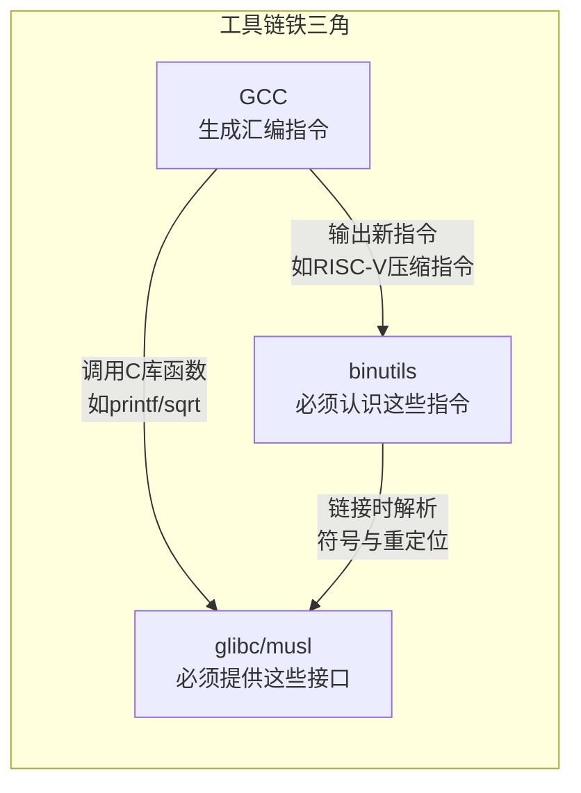

# 2.2.4 版本耦合关系：不是随便搭配的

> 所属章节：第2章 嵌入式Linux工具链 > 2.2 工具链铁三角
> 难度：[B→I] | 预计阅读时间：10分钟

## 本节导读

前面三节你已经认识了工具链铁三角的三位成员——gcc厨师、`as`锅匠、`ld`服务员，以及libc这位"餐具供应商"。本节揭示一个残酷真相：**这四个人不是随便就能搭班干活的**。版本不匹配的悲剧每天都在发生，读完本节你会知道为什么升级GCC后编译突然报错，以及如何选对一套能用的版本组合。

---

## 知识点1：铁三角的版本约束 [I] ~600字

### 1.1 为什么版本不能各升各的？

工具链三位核心成员之间的依赖关系，像是一个三人乐队——每个人必须会弹同一个调的曲子：



[图1：工具链铁三角版本耦合关系——GCC输出新指令需要binutils认识，调用libc接口需要版本兼容]

**关键约束有三条：**

| 约束方向 | 核心问题 | 不遵守的后果 |
|----------|----------|--------------|
| GCC → binutils | GCC生成的新汇编指令，binutils必须能识别和编码 | 汇编器报错：`unrecognized opcode` |
| GCC → libc | GCC编译时依赖的C库头文件和运行时接口 | 链接报错：`undefined reference` 或运行时崩溃 |
| binutils → libc | 链接时需要解析libc中的符号和重定位信息 | 链接失败或生成损坏的可执行文件 |

💡 **一句话理解**：GCC是"出题人"，binutils和libc是"答题人"。答题人必须能看懂出题人的题目。

### 1.2 常见版本组合速查表

下面的表格列出了经过验证的常用搭配。不要混搭相邻列的版本：

| 组合名称 | GCC 版本 | binutils 版本 | glibc 版本 | 适用场景 |
|----------|----------|---------------|------------|----------|
| 经典稳定版 | 9.5.0 | 2.34 | 2.31 | 保守项目，追求稳定 |
| 主流推荐版 | 11.4.0 | 2.38 | 2.35 | 大多数嵌入式项目首选 |
| 现代进阶版 | 12.3.0 | 2.40 | 2.36 | 需要新语言特性（C++20） |
| 前沿实验版 | 13.2.0 | 2.41 | 2.38 | 最新硬件支持（如新RISC-V扩展） |
| 轻量musl版 | 12.3.0 | 2.40 | musl 1.2.4 | 小体积系统（容器/路由器） |

💡 **提示**：表格里的版本是"大致对应"关系。实际构建时，**交叉编译工具链（如Linaro、Bootlin、crosstool-ng）已经帮你配好了**，直接用它们的发布包最省心。

### 1.3 动手验证：你的工具链版本搭不搭？

用三行命令快速检查你手头的工具链版本：

```bash
# 查看GCC版本
$ aarch64-linux-gnu-gcc --version
aarch64-linux-gnu-gcc (Ubuntu 11.4.0-1ubuntu1~22.04) 11.4.0

# 查看binutils版本（as和ld是一套的）
$ aarch64-linux-gnu-as --version | head -1
GNU assembler (GNU Binutils for Ubuntu) 2.38

# 查看glibc版本（通过编译一个小程序来探测）
$ aarch64-linux-gnu-gcc -x c - -o /dev/null -Wl,-verbose 2>&1 | grep "libc.so" | head -1
```

如果GCC是11.4，但binutils是2.30（低于2.34），你就要警惕了——**GCC 11可能生成binutils 2.30不认识的指令**。

### 1.4 真实案例：升级GCC的代价

⚠️ **案例**：某团队把交叉GCC从9.5升级到12.3，以为"新版本性能更好"，却没升级binutils。编译一个RISC-V项目时，GCC 12生成了新的`Zcb`压缩指令扩展的汇编代码，交给binutils 2.34处理时，汇编器直接抛出：

```
Error: unrecognized opcode `c.lbu a0,0(a1)'
```

**根因**：GCC 12默认启用的新指令扩展，需要binutils 2.38+才能识别。旧版binutils看到不认识的新"方言"，直接罢工。

**修复方案**：要么降级GCC（放弃新特性），要么**整套升级binutils到2.40+**。只升级一个组件等于拆东墙补西墙。

### 常见错误

⚠️ **错误1：从源码只升级GCC，忽略binutils**
> 编译GCC时，`configure`脚本会检查binutils版本，但检查的是**构建机器上的本地binutils**，不是你的交叉工具链！交叉编译场景下，这个检查形同虚设。你必须手动确保交叉as/ld的版本匹配。

⚠️ **错误2：混用不同来源的工具链组件**
> 例如从Ubuntu仓库装了GCC 11，从Linaro官网下载了binutils 2.34，从Yocto拿了glibc 2.31。三个组件各自为政，链接时会出现`undefined reference to '__libc_single_threaded'`之类的诡异错误——因为glibc 2.31根本没这个符号，但GCC 11编译时认为它有。

🔴 **危险：生产环境偷偷替换工具链中的一个组件**
> 团队里有人"顺手"升级了编译服务器上的GCC，没通知其他人。其他人的代码编译通过，但运行时偶发崩溃。排查三天发现是glibc版本不匹配导致`memcpy`行为差异。**工具链升级必须全团队同步、全组件配套升级**。

💡 **提示**：不确定版本是否匹配？用`crosstool-ng`或`buildroot`自动构建工具链。它们内置了版本兼容性矩阵，会拒绝不合法的组合，帮你守住底线。

---

## 本节总结

| 概念 | 核心要点 | 实操检查 |
|------|----------|----------|
| GCC → binutils | GCC的新指令需要binutils能识别 | `gcc --version` vs `as --version` |
| GCC → libc | 编译时头文件和运行时接口必须一致 | 用已知项目测试编译+链接+运行 |
| 升级原则 | **整套升级**，绝不单升一个组件 | 升级前备份原工具链，留好退路 |
| 省心方案 | 用预构建的交叉工具链发行包 | Linaro/Bootlin/crosstool-ng已验证搭配 |

💡 **一句话记忆**：工具链三兄弟是连体婴——动一个，另外两个必须一起动。

---

## 下一步

2.2.5节将介绍工具链的"身份证"与安装路径——Target Triple如何决定你的交叉编译器叫什么名字，以及`sysroot`如何让你的工具链找到远在另一套目录树里的头文件和库。

---

## 配套资源

### 表格清单
- 表1：工具链三组件版本约束方向与后果
- 表2：常见版本组合速查表（稳定版/主流版/进阶版/前沿版/musl版）

### 图示清单
- 图1：工具链铁三角版本耦合关系 [mermaid依赖关系图]

### 代码清单
- 代码1：`gcc --version` + `as --version` 快速检查版本搭配
- 代码2：glibc版本探测命令（通过链接器verbose输出）
