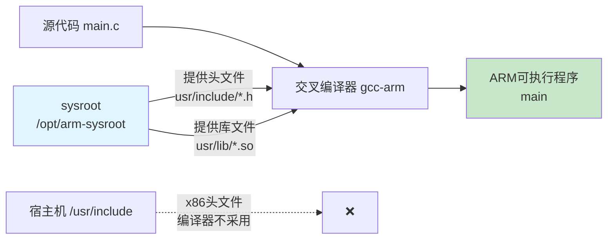

# 2.3.1 什么是sysroot

> 所属章节：第2章 交叉编译工具链 > 2.3 工具链的核心概念
> 
> 难度：[B→B] | 预计阅读时间：8分钟

## <span class="blue"> 本节导读
本节用"沙盘模型"的比喻带你理解sysroot：交叉编译器查找头文件和库的"虚拟根目录"，并动手查看你本地工具链的sysroot路径和内容。

---

## <span class="blue"> sysroot概念 [B]

交叉编译器运行在**宿主机（x86电脑）**上，但它编译出来的程序要运行在**目标机（ARM开发板）**上。这就带来一个核心问题：编译器去哪里找目标机的头文件和库？

### "沙盘预览版"的比喻

想象一下你要在A城市（宿主机）建造一座给B城市（目标机）使用的图书馆。你不能真的跑到B城市去翻书架，于是B城市给你寄来了一个**缩微沙盘模型**<BR>——里面有B城市图书馆的完整目录结构，只是没有真正的书和读者。工程师在A城市对照这个沙盘就能知道书架该放哪里、书该怎么分类。

**sysroot就是这个"沙盘模型"**：它是目标板根文件系统的一个精简副本，包含编译所需的目录结构、头文件（`.h`）和库文件（`.so`/`.a`），但不包含运行时需要的可执行程序、设备节点、启动脚本等。

当交叉编译器需要查找`#include <stdio.h>`时，它不会在你的电脑`/usr/include`里找（那是x86的头文件），而是去sysroot下的`usr/include`里找ARM版本的头文件。

### sysroot的目录结构

一个典型的sysroot目录结构如下：

```
/opt/arm-sysroot/                    ← sysroot根目录
├── lib/
│   ├── libc.so.6                    ← ARM版glibc动态库
│   └── ld-linux-armhf.so.3          ← ARM动态链接器
├── usr/
│   ├── include/
│   │   ├── stdio.h                  ← ARM版标准C头文件
│   │   ├── pthread.h                ← 线程库头文件
│   │   └── ...
│   └── lib/
│       ├── libc.a                   ← ARM版glibc静态库
│       └── libm.so                  ← 数学库
└── ...
```

### sysroot在编译中的角色



> **图1：sysroot在编译中的角色**: 交叉编译器只认sysroot里的内容，完全忽略宿主机自身的系统目录。

⚠️ **陷阱**：sysroot里的库和头文件必须与目标板实际运行的系统版本严格匹配。如果sysroot里是glibc 2.31而目标板只有2.28，编译出来的程序在板子上会报`version 'GLIBC_2.31' not found`错误。

💡 **提示**：你可以把sysroot理解为"目标板开发环境的离线镜像"，有了它，交叉编译器就能在宿主机上"假装"自己运行在目标板上。

---

## <span class="blue"> 查看工具链sysroot [B] 

你的交叉编译器一定自带了一个sysroot，只是平时藏在安装目录里不显眼。本节教你把它找出来。

### 操作步骤

**步骤1：确认编译器路径**

```bash
# 先找到你的交叉编译器在哪里
which arm-linux-gnueabihf-gcc
# 输出示例：/usr/bin/arm-linux-gnueabihf-gcc
```

**步骤2：查询sysroot路径**

交叉编译器GCC有一个专用选项来暴露这个信息：

```bash
arm-linux-gnueabihf-gcc -print-sysroot
```

常见输出情况：

| 场景 | 输出示例 | 含义 |
|------|----------|------|
| 独立工具链 | `/opt/gcc-arm-10.3/arm-linux-gnueabihf/libc` | sysroot是独立目录 |
| 系统包管理器安装 | `/usr/arm-linux-gnueabihf` | sysroot分散在系统目录 |
| 空输出 | （无输出） | 编译器使用内置默认路径 |

> 💡 **提示**：如果`-print-sysroot`没有输出，不代表没有sysroot，而是编译器把路径硬编码在内部了。可以用`arm-linux-gnueabihf-gcc -v`查看详细的搜索路径。

**步骤3：查看sysroot内容**

```bash
# 将上面得到的sysroot路径代入
SYSROOT=$(arm-linux-gnueabihf-gcc -print-sysroot)
ls -la "$SYSROOT"

# 查看头文件目录
cd "$SYSROOT/usr/include" && ls | head -20

# 查看库文件目录
cd "$SYSROOT/usr/lib" && ls *.so | head -10
```

你看到的`stdio.h`、`pthread.h`都是ARM版本的；那些`.so`文件用`file`命令查看会显示`ARM EABI`而不是x86：

```bash
file "$SYSROOT/usr/lib/libc.so.6"
# 输出：ELF 32-bit LSB shared object, ARM, EABI5 version 1 (GNU/Linux), ...
```

> 🔴 **危险**：永远不要直接修改sysroot里的文件！如果需要添加自定义库，应该复制一份sysroot到自己的工作目录，用`--sysroot=`参数指定新路径，避免破坏系统工具链。

---

## 本节总结

| 对比项 | sysroot（编译用） | 真实根文件系统（运行用） |
|--------|-------------------|--------------------------|
| **存在位置** | 宿主机硬盘上 | 目标板存储（eMMC/SD/NAND） |
| **核心内容** | 头文件、静态库、动态库符号链接 | 完整目录树、可执行程序、设备节点 |
| **是否需要启动** | 不需要，纯静态文件 | 需要引导启动、挂载根文件系统 |
| **大小** | 通常10~50 MB（精简） | 通常数十MB到数百MB（完整） |
| **修改风险** | 🔴 高（破坏工具链） | 中（可通过刷机恢复） |
| **与编译器关系** | 编译器通过`--sysroot`参数指定 | 运行时被内核挂载为`/` |

## 下一步

理解了sysroot是什么，下一节（2.3.2）我们将学习**如何自己构建一个sysroot**: 从目标板提取库文件、制作最小sysroot，让你的工具链能够编译出与目标板完美兼容的程序。

---
