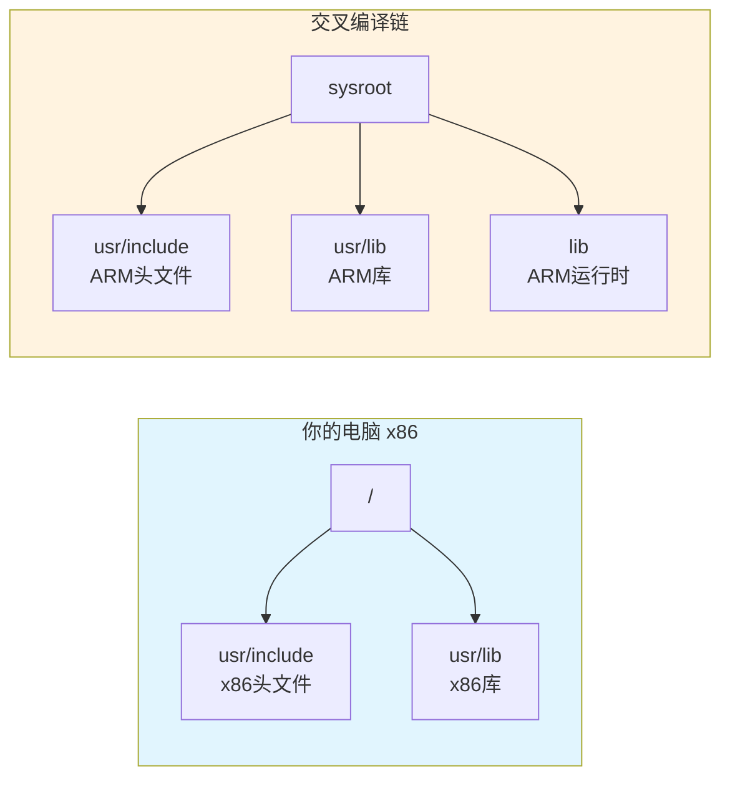
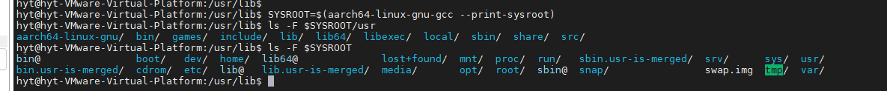

# 2.3.2 sysroot的目录结构

> 所属章节：第2章 开发环境准备 > 2.3 交叉编译链与sysroot
> 
> 难度：[B→I] | 预计阅读时间：10分钟

## <span class="blue"> 本节导读
打开交叉编译链的"工具箱抽屉": sysroot目录，看清每个文件夹的用途。<BR>学完本节，你能准确找到交叉编译所需的头文件和库文件。

## <span class="blue"> sysroot目录结构 [B] 

交叉编译链中有个关键目录叫 **sysroot**（系统根目录），它是一个"迷你Linux文件系统"，专门给交叉编译器使用。

### 为什么需要sysroot？

在x86电脑上编译ARM程序时，编译器需要`stdio.h`等头文件和`libc.so`等系统库。但PC上的是x86版本，直接拿会编译出x86程序。sysroot**为交叉编译器提供目标架构的专属目录**，让编译器只从这里查找文件，完全隔离PC本地系统文件。

### sysroot与PC本地/usr的类比

sysroot就是目标系统的"根目录替身"，对应关系如下：

| PC本地路径 | sysroot对应路径 | 存放内容 |
|-----------|----------------|---------|
| `/usr/include` | `sysroot/usr/include` | C/C++头文件（.h） |
| `/usr/lib` | `sysroot/usr/lib` | 主要系统库文件（.a/.so） |
| `/lib` | `sysroot/lib` | 基础运行时库 |



### 三个核心子目录

**`usr/include`**：存放C/C++标准库头文件。当你写`#include <stdio.h>`时，编译器就到这里找。

**`usr/lib`**：存放静态库（`.a`）和动态库（`.so`），如`libc.a`、`libm.so`。链接阶段编译器从这里提取代码。

**`lib`**：存放运行时必需的基础库，通常是`libc.so`和动态链接器副本。

> 💡 **提示**：sysroot中的`usr`是Unix System Resources的缩写，不是"用户"的意思。

> ⚠️ **陷阱**：有些sysroot藏在深层路径如`aarch64-linux-gnu/libc/`下。找不到时，用`find`搜索`libc.so`定位。

## <span class="blue"> 动手查看sysroot内容 [I] 

打开终端，查看交叉编译链的sysroot内容。

### 操作步骤

#### 步骤1：定位sysroot目录

```bash
# 让gcc告诉我们sysroot在哪里
aarch64-linux-gnu-gcc --print-sysroot
# 输出示例：/opt/gcc-arm-10.3/aarch64-linux-gnu/libc

# 备选：find搜索
find /opt -name "libc.so" 2>/dev/null
```

#### 步骤2：浏览目录结构

```bash
SYSROOT=$(aarch64-linux-gnu-gcc --print-sysroot)
ls -F $SYSROOT
# 输出：lib/  usr/

ls -F $SYSROOT/usr
# 输出：bin/  include/  lib/
```



#### 步骤3：用file命令确认文件架构

确认库是目标架构的：

```bash
# sysroot中的libc.so
file $SYSROOT/lib/libc.so
# ELF 64-bit ... ARM aarch64 ...

# PC本地的libc
file /lib/x86_64-linux-gnu/libc.so.6
# ELF 64-bit ... x86-64 ...
```

如果sysroot中的库显示`ARM aarch64`，PC本地显示`x86-64`，说明sysroot正确隔离了目标架构的库。

#### 步骤4：查看头文件

```bash
ls $SYSROOT/usr/include | head -20
ls $SYSROOT/usr/include/stdio.h
```

### 常见错误

⚠️ **错误1**：`file`显示库是`x86-64`而不是ARM。
> 你查看的是PC本地库，不是sysroot里的。检查路径。

⚠️ **错误2**：`--print-sysroot`返回空。
> 编译链未配置sysroot。用`aarch64-linux-gnu-gcc -v`查看搜索路径，或用`find`定位`libc.so`。

💡 **提示**：若sysroot结构不完整（缺`usr/include`），需安装额外开发包。Ubuntu上搜索`apt search aarch64-linux-gnu`找`libc-dev`包。

## 本节总结

| 概念 | 要点 | 操作 |
|------|------|------|
| sysroot本质 | 目标架构的"迷你根目录"，隔离PC本地文件 | `gcc --print-sysroot` |
| usr/include | C/C++头文件（.h） | `ls sysroot/usr/include` |
| usr/lib | 静态库和动态库 | `ls sysroot/usr/lib` |
| lib | 运行时基础库和动态链接器 | `ls sysroot/lib` |
| 架构验证 | 确认库属于目标架构 | `file sysroot/lib/libc.so` |

## 下一步

现在你已经熟悉了sysroot的"地形图"。下一节（2.3.3）将学习**交叉编译器的工作原理**: `aarch64-linux-gnu-gcc`如何在sysroot中搜索头文件和库文件。

---