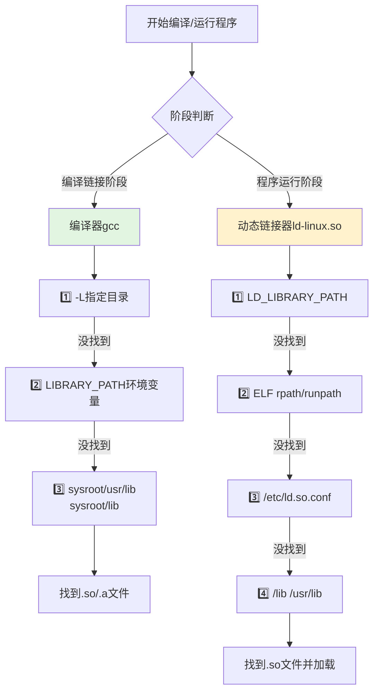

# 2.3.4 库文件搜索路径全景

> 所属章节：第2章 交叉编译环境 > 2.3 交叉编译工具链
> 难度：[B→I] | 预计阅读时间：15分钟

## 本节导读
本节带你理清一个让新手最头疼的问题：编译程序时gcc到底去哪里找库文件？链接时和运行时搜索路径为什么是两回事？以及嵌入式开发中该如何在静态链接和动态链接之间做选择。学完本节，你将能独立解决"找不到库文件"的报错，并为嵌入式场景做出合理的链接策略。

---

## 知识点1：gcc库文件搜索路径 [I] ~700字

当你使用交叉编译器`arm-linux-gnueabihf-gcc`编译程序时，经常会遇到两类"找不到库"的错误：

- 编译时报错：`cannot find -lxxx`
- 运行时报错：`error while loading shared libraries: libxxx.so: cannot open shared object file`

这两种错误看似相同，但发生阶段完全不同——前者发生在**编译链接时**，后者发生在**程序运行时**。

### 编译链接时的搜索路径

编译器在链接阶段（把`.o`文件合成可执行文件时）需要找到库文件。gcc按以下优先级查找：

1. **`-L`指定的目录**：优先级最高，显式告诉gcc"先去这里找"
2. **环境变量`LIBRARY_PATH`**：很少用，通常被`-L`覆盖
3. **编译器内置路径**：交叉编译器的`sysroot/usr/lib`、`sysroot/lib`

`sysroot`是交叉编译器的"虚拟根目录"。当编译器安装后，它把目标板的文件系统视图嵌套在自己的目录下。例如`arm-linux-gnueabihf-gcc`的sysroot通常是：

```
/usr/arm-linux-gnueabihf/
├── lib/          # 核心C库（libc.so等）
└── usr/lib/      # 第三方库、数学库等
```

### 运行时的搜索路径

动态链接的程序在**目标板上启动时**，动态链接器`ld-linux.so`负责找到并加载所需的`.so`文件。搜索顺序是：

1. **`LD_LIBRARY_PATH`环境变量**：最常用于调试，临时指定库路径
2. **可执行文件的`rpath/runpath`**：编译时硬编码到ELF文件中的路径
3. **`/etc/ld.so.conf`配置**：系统级库路径配置文件
4. **默认路径**：`/lib`、`/usr/lib`

### 关键区别

| 维度 | 编译/链接时路径 | 运行时路径 |
|------|----------------|-----------|
| 控制者 | gcc编译器 | 动态链接器`ld-linux.so` |
| 主要手段 | `-L`选项 | `LD_LIBRARY_PATH`、`rpath`、`ld.so.conf` |
| 查找的文件 | `.so`文件（可能还需要`.a`） | `.so`文件（必须是目标板上的） |
| 影响范围 | 仅本次编译 | 影响所有动态链接程序 |
| 交叉编译场景 | 使用编译器sysroot中的库 | 使用目标板上的库 |

[图1：库文件搜索流程图]



### 操作步骤

**步骤1：查看交叉编译器的内置搜索路径**

```bash
# 查看gcc链接时的默认搜索路径
arm-linux-gnueabihf-gcc -print-search-dirs

# 查看sysroot位置
arm-linux-gnueabihf-gcc -print-sysroot
```

**步骤2：使用-L和-l链接自定义库**

```bash
# 假设库文件在 /home/user/mylib/libtest.so
# 编译main.c并链接libtest
arm-linux-gnueabihf-gcc main.c -o myapp \
    -L/home/user/mylib -ltest
```

**步骤3：运行时指定库路径**

```bash
# 在目标板上临时指定运行时库路径
export LD_LIBRARY_PATH=/opt/custom_lib:$LD_LIBRARY_PATH
./myapp
```

### 常见错误

⚠️ **陷阱1：混淆编译时路径和运行时路径**

很多人在交叉编译时用`-L`指定了自定义库路径，编译通过了，但把程序放到目标板上运行时仍然报"找不到共享库"。这是因为他们忘了：`-L`只解决**编译时**的问题，运行时库必须也存在于目标板上，或通过`LD_LIBRARY_PATH`指定。

⚠️ **陷阱2：交叉编译时混用主机库和目标板库**

```bash
# 错误示例：-L指向了x86的库目录！
arm-linux-gnueabihf-gcc main.c -L/usr/lib -lfoo   # 危险！
```

💡 **提示**：交叉编译时，`/usr/lib`下是主机的x86库，目标板库在编译器的sysroot里。不要混用！

💡 **提示**：使用`-Wl,-rpath,/opt/lib`可以在编译时就把运行时库路径硬编码到可执行文件中，这样目标板上就不需要设置`LD_LIBRARY_PATH`：

```bash
arm-linux-gnueabihf-gcc main.c -o myapp \
    -L/home/user/mylib -ltest \
    -Wl,-rpath,/home/user/mylib
```

---

## 知识点2：静态链接 vs 动态链接的选择 [I] ~500字

库文件有两种形态：

- **静态库**（`.a`文件）：链接时把库代码完整复制到可执行文件中
- **动态库**（`.so`文件）：链接时只记录依赖关系，运行时再去加载

### 嵌入式场景为什么倾向静态链接

在嵌入式开发中，静态链接往往是更稳妥的选择，原因有三：

1. **减少运行时依赖**：静态链接生成的可执行文件自带所有代码，复制到目标板上就能直接跑，不用担心目标板缺库
2. **简化部署**：不需要考虑库的兼容版本问题，不用维护`/lib`下的.so文件
3. **启动确定性**：动态链接可能在启动时因找不到库而失败，静态链接消除了这个不确定性

当然，静态链接的代价是**可执行文件体积变大**。如果多个程序都静态链接同一个库，每个程序都包含一份库的完整副本，会浪费存储空间。在Flash只有几十MB的嵌入式设备上，这需要权衡。

### 交叉编译时的静态链接方法

gcc默认优先链接动态库（`.so`）。如果你想强制静态链接，有两种方式：

**方式一：全静态链接**

```bash
# 完全静态链接，生成的可执行文件不依赖任何.so
arm-linux-gnueabihf-gcc main.c -o myapp_static \
    -L/home/user/mylib -ltest \
    -static
```

使用`-static`后，甚至连`libc`也会被静态链接进去。生成的文件可以用`file`命令验证：

```bash
file myapp_static
# 输出：myapp_static: ELF 32-bit LSB executable, ARM, EABI5 version 1 (SYSV), 
#       statically linked, for GNU/Linux 3.2.0
```

**方式二：仅指定某个库静态链接**

有时你希望大部分库动态链接，但某个特定库静态链接（比如你不确定目标板上是否有这个库）：

```bash
# 混合链接：libtest用静态(.a)，其他用动态(.so)
arm-linux-gnueabihf-gcc main.c -o myapp \
    -L/home/user/mylib \
    -Wl,-Bstatic -ltest -Wl,-Bdynamic \
    -lpthread
```

`-Wl,-Bstatic`告诉链接器"接下来的库用静态版本"，`-Wl,-Bdynamic`恢复动态链接模式。

### 常见错误

⚠️ **陷阱：静态链接glibc的问题**

静态链接glibc时，某些依赖动态加载的功能（如`gethostbyname`、NSS）可能无法正常工作，因为glibc内部有些模块是通过dlopen动态加载的。如果你的程序依赖这些功能，全静态链接`-static`可能不是最佳选择。

💡 **提示**：在嵌入式Linux中，如果存储空间有限，一个折中方案是：把程序自身静态链接（`-static-libgcc`或手动指定关键库），但保留对glibc的动态链接依赖，因为目标板上通常都有glibc。

---

## 本节总结

| 概念 | 要点 | 操作 |
|------|------|------|
| `-L` | 编译时指定库搜索目录 | `gcc ... -L/path/to/lib` |
| `-l` | 指定要链接的库名（省略lib前缀和.so/.a后缀） | `gcc ... -ltest` 链接libtest.so或libtest.a |
| `LD_LIBRARY_PATH` | 运行时动态库搜索路径 | `export LD_LIBRARY_PATH=/opt/lib` |
| `sysroot` | 交叉编译器的虚拟根目录 | `gcc -print-sysroot`查看 |
| `-static` | 强制全静态链接 | `gcc main.c -static -o app` |
| `-Wl,-rpath` | 编译时硬编码运行时库路径 | `gcc ... -Wl,-rpath,/opt/lib` |

## 下一步

掌握了库文件搜索路径后，下一节我们将学习**交叉编译器版本选择与ABI兼容性**（2.3.5），了解不同工具链版本（如gnueabi vs gnueabihf、ARMv7 vs ARMv8）之间的差异，避免因ABI不兼容导致的段错误和链接失败。

---

## 配套资源

### 表格清单
- 表1：编译时 vs 运行时库搜索路径对比 [知识点2.3.4.a]

### 图示清单
- 图1：库文件搜索流程图 [mermaid图] — 展示编译链接时与运行时的搜索路径优先级
- 图2：sysroot目录结构示意图 [配图说明] — 展示交叉编译器sysroot下lib/和usr/lib/的层级关系

### 代码清单
- 代码1：查看gcc搜索路径命令（`-print-search-dirs`、`-print-sysroot`）
- 代码2：使用-L和-l链接自定义库的编译命令
- 代码3：运行时设置LD_LIBRARY_PATH的命令
- 代码4：带`-Wl,-rpath`的编译命令
- 代码5：全静态链接命令（`-static`）
- 代码6：混合静态/动态链接命令（`-Wl,-Bstatic`/`-Wl,-Bdynamic`）
