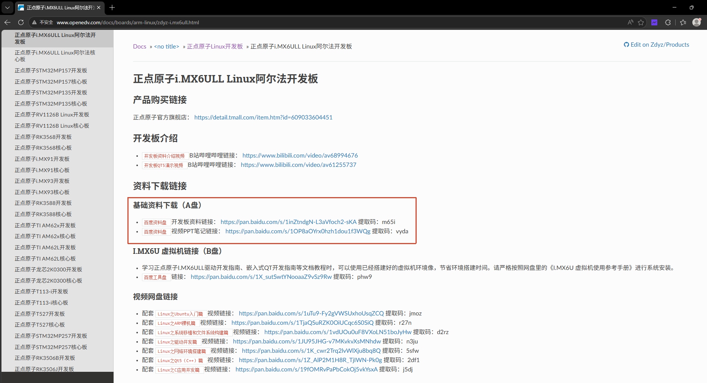
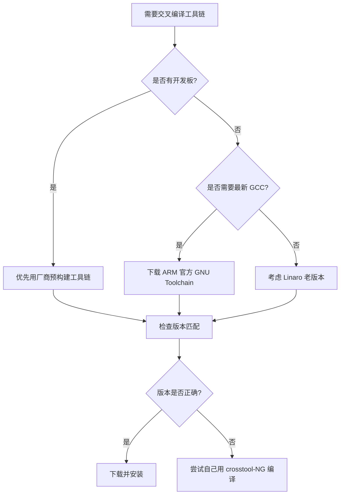

# 2.4.1 工具链安装与环境配置

> 所属章节：第2章 开发环境搭建 > 2.4 节 交叉编译工具链
> 
> 难度：[B→I] | 预计阅读时间：20分钟

## <span class="blue"> 本节导读
本节教你如何把交叉编译器"请"进你的电脑里，让它在 x86 电脑上替你的 ARM 开发板编译程序。<br>学完本节，你将掌握工具链的获取渠道选择、安装部署、以及环境变量的正确配置。

---

## <span class="blue"> 工具链获取渠道 [B]

交叉编译工具链（Cross-compilation Toolchain）不是单一程序，而是一整套"工具家族"：包含编译器 `gcc`、汇编器 `as`、链接器 `ld`、库文件 `libc`、以及调试用的 `gdb` 等。你要替 ARM 芯片编译程序，就得有一套能在 x86 电脑上运行的 ARM 版工具链。

问题来了：**去哪里找这套工具链？** 初学者常在这里犯难。下面四条路，按推荐程度排列：

### 路线一：开发板厂商预构建工具链（首选）

如果你手头有一块开发板（比如正点原子 i.MX6ULL、飞凌 OKMX6ULL、野火 STM32MP1），厂商通常会把配套的工具链打包放在光盘镜像或官网下载区里。

> 💡 **提示**：厂商工具链不是随意挑的，而是经过适配的。 `gcc` 版本、内核头文件版本、GLIBC 版本都和板子上跑的系统一一对应。用错版本，编译出来的程序很可能跑不起来。

**获取方式**：官网下载页 → 开发板型号 → "Linux 工具链" → 下载 `.tar.gz` 或 `.tar.xz` 压缩包。

1. 官网 → 技术支持/下载中心
2. 按开发板型号筛选
3. 找 **"Linux SDK"**、**"开发环境"**、**"虚拟机镜像"** 或 **"A盘/B盘资料"**
4. 工具链通常以 `gcc-xxx-arm-linux-gnueabihf.tar.xz` 这样的文件名藏在里面
5. 如果页面只有 **"SDK 光盘镜像"**（一个 `.iso` 文件），下载后挂载 ISO，在里面的 `toolchain` 或 `tools` 目录找



> 💡 **提示**：如果官网下载慢，优先找厂商提供的百度网盘/迅雷镜像链接。厂商工具链通常藏在 SDK 光盘镜像里，下载后挂载 ISO 即可找到 `toolchain` 目录。

### 路线二：ARM 官方 GNU Toolchain

ARM 公司自己维护了一套开源工具链，支持 ARM32（arm-none-linux-gnueabihf）和 ARM64（aarch64-none-linux-gnu）。

- 官网地址：https://developer.arm.com/downloads/-/arm-gnu-toolchain-downloads
- 阿里云：https://mirrors.aliyun.com/armbian-releases/_toolchain/
- 清华：https://mirrors.tuna.tsinghua.edu.cn/armbian-releases/_toolchain/
- 特点：版本最新、编译优化好、支持较新的 ARM 架构扩展
- 适合场景：芯片厂商没有提供工具链，或者你需要尝试最新 GCC 特性

### 路线三：Linaro 社区工具链

Linaro 是一个专注于 ARM Linux 的开源协作工程，历史上提供了很多预编译工具链。

- 官网地址：https://releases.linaro.org/components/toolchain/binaries/
- 特点：稳定性经过大量项目验证，老版本长期保留
- ⚠️ **陷阱**：Linaro 近年更新放缓，部分旧版工具链的内核头文件较老，编译新版内核时可能报错。
- 如果你要编译 Linux 5.10.x，点 7.5-2019.12；如果要编译 Linux 6.x，不要在这个页面折腾，直接去 ARM 官方下 GCC 12/13/14。


### 路线四：自己编译（终极方案）

使用 `crosstool-NG` 或 `Buildroot` 从零构建一套完全定制的工具链。这需要你对 GCC、Binutils、Glibc 的版本兼容性有较深的理解，属于进阶技能，本节暂不展开。

---

### 四条路线对比

| 获取渠道 | 获取难度 | 版本匹配度 | 维护活跃度 | 推荐场景 |
|------|------|------|------|------|
| 厂商预构建 | 低（官网直接下） | 高（适配板子） | 中（厂商维护） | **初学者首选**，有开发板时 |
| ARM 官方 | 低 | 中（通用型） | 高（持续更新） | 无厂商工具链，或需要新版 GCC |
| Linaro 社区 | 中 | 中 | 低（近年放缓） | 需要特定老版本稳定工具链 |
| 自己编译 | 高 | 完全可控 | 自己维护 | 高级定制，学习原理 |

> 🔴 **危险**：千万不要从网上不明来源下载工具链！工具链中的编译器是特权的, 它编译出来的程序最终会在目标板上运行，恶意修改过的编译器可能在程序里植入后门。始终从**厂商官网**或**ARM 官方**获取。

[图1：工具链获取决策树]



---

## <span class="blue"> 工具链安装步骤 [B] 

拿到工具链压缩包后，接下来就是安装和配置。嵌入式 Linux 领域的惯例是把第三方工具链安装在 `/opt` 目录下——这是行业约定俗成的位置，方便管理和查找。

### 操作步骤

**步骤一：创建工作目录**

用 `sudo` 在 `/opt` 下新建一个专属目录：

```bash
sudo mkdir -p /opt/toolchain
```

`/opt` 目录是 Linux 系统中专门用来放"可选第三方软件"的地方，和系统自带的 `/usr/bin` 井水不犯河水。

**步骤二：解压工具链**

假设你从正点原子官网下载了文件 `gcc-linaro-4.9.4-2017.01-x86_64_arm-linux-gnueabihf.tar.xz`，执行解压：

```bash
cd /opt/toolchain
sudo tar xvJf ~/Downloads/gcc-linaro-4.9.4-2017.01-x86_64_arm-linux-gnueabihf.tar.xz
```

> ⚠️ **陷阱**：解压时路径要写对！如果少写了一层目录，所有文件会散落在 `/opt/toolchain` 根目录下，非常混乱。建议解压前先用 `tar tvJf` 预览一下压缩包里的目录结构。

解压完成后，你会得到一个类似这样的路径：

```
/opt/toolchain/gcc-linaro-4.9.4-2017.01-x86_64_arm-linux-gnueabihf/
├── arm-linux-gnueabihf/       # 目标架构相关的库和头文件
├── bin/                       # 编译器本体（gcc、ld、g++ 等）
├── include/                   # 工具链自身的头文件
├── lib/                       # 工具链运行依赖的库
└── share/                     # 文档和 locale
```

**步骤三：配置 PATH 环境变量**

现在编译器已经躺在 `/opt/toolchain/.../bin/` 目录里了，但你在终端里输入 `arm-linux-gnueabihf-gcc` 时，系统会回答 "command not found"——因为系统不知道去那里找。

你需要把工具链的 `bin` 目录加入 `PATH` 环境变量。有两种方式：

**临时生效**（当前终端窗口）：

```bash
export PATH=$PATH:/opt/toolchain/gcc-linaro-4.9.4-2017.01-x86_64_arm-linux-gnueabihf/bin
```

**永久生效**（推荐，写入 `~/.bashrc`）：

```bash
echo 'export PATH=$PATH:/opt/toolchain/gcc-linaro-4.9.4-2017.01-x86_64_arm-linux-gnueabihf/bin' >> ~/.bashrc
source ~/.bashrc
```

> 💡 **提示**：也可以把工具链路径写成一个变量，方便后续脚本引用：

```bash
echo 'export CROSS_COMPILE=arm-linux-gnueabihf-' >> ~/.bashrc
echo 'export ARCH=arm' >> ~/.bashrc
source ~/.bashrc
```

这样，以后在编译 U-Boot 或内核时，直接 `$CROSS_COMPILE` 就能引用前缀，不用每次都敲全称。

**步骤四：验证安装**

终端里执行以下命令：

```bash
arm-linux-gnueabihf-gcc -v
```

如果配置正确，你会看到类似这样的输出：

```
Using built-in specs.
COLLECT_GCC=arm-linux-gnueabihf-gcc
COLLECT_LTO_WRAPPER=.../libexec/gcc/.../lto-wrapper
Target: arm-linux-gnueabihf
Configured with: ...
Thread model: posix
gcc version 4.9.4 (Linaro GCC 4.9-2017.01)
```

重点检查三行：
1. `Target: arm-linux-gnueabihf` —— 确认目标架构正确
2. `gcc version 4.9.4` —— 确认版本是你期望的
3. 没有 "command not found" 报错 —— 确认 PATH 生效

再进一步验证：编译一个最简单的 "Hello World" 看看产物是不是 ARM 程序。

```bash
cat > /tmp/test.c << 'EOF'
#include <stdio.h>
int main() {
    printf("Hello ARM!\n");
    return 0;
}
EOF
arm-linux-gnueabihf-gcc /tmp/test.c -o /tmp/test_arm
file /tmp/test_arm
```

输出应该是：

```
/tmp/test_arm: ELF 32-bit LSB executable, ARM, EABI5 version 1 (SYSV), ...
```

看到 `ELF 32-bit ... ARM` 就说明大功告成——这个程序虽然在你的 x86 电脑上编译出来，但它是给 ARM 芯片跑的！

> ⚠️ **陷阱**：如果你不小心用系统的 `gcc` 编译（没写前缀），`file` 命令会显示 `x86-64`。这就是交叉编译的意义：在 x86 上产出 ARM 可执行文件。

> 🔴 **危险**：`PATH` 的顺序很重要！不要把工具链路径放在 `PATH=$PATH:...` 前面变成 `PATH=...:$PATH`，否则如果工具链里碰巧有个和系统同名的命令（比如 `ld`），会优先调用工具链版本，可能破坏系统编译。始终用 `PATH=$PATH:/opt/...` 追加到末尾。

---

## <span class="blue"> 本节总结

| 概念 | 要点 | 操作 |
|------|------|------|
| 厂商工具链 | 版本与板子匹配，省心 | 官网下载 → 解压到 `/opt` |
| ARM 官方工具链 | 最新最通用 | 官网下载 → 注意架构前缀 |
| PATH 配置 | 让系统找到交叉编译器 | 追加到 `~/.bashrc` 后 `source` |
| 验证安装 | 确认编译器版本和目标架构 | `gcc -v` + `file` 检查 ELF 格式 |

> 💡 **提示**：在一台开发电脑上可以同时安装多套工具链（不同版本、不同架构），只要把它们放在 `/opt/toolchain/` 下的不同子目录，按需切换 `PATH` 或写脚本切换即可。

---

## <span class="blue"> 下一步

工具链就绪后，下一节 `2.4.2` 我们将动手编译一个最简单的嵌入式 "Hello World"，把它放到开发板上真正跑起来——检验本节安装的工具链是否真的能产出可执行的 ARM 程序。

---
