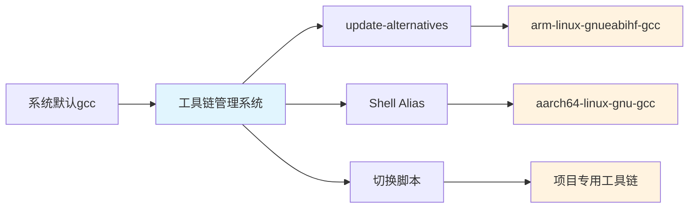

# 2.4.2 版本匹配与冲突解决

> 所属章节：第2章 开发环境搭建 > 2.4 交叉编译工具链
> 难度：[I] | 预计阅读时间：15分钟

## 本节导读
本节讲解如何在同一台开发机上管理多个交叉编译工具链，以及遇到版本冲突时的排查和解决方法。学完本节，你将能够安全地在多个项目间切换工具链，避免"调用了错误的编译器"这类常见问题。


[图1：多工具链共存管理架构——通过不同机制将系统默认编译器导向正确的交叉编译器]

## 知识点1：多个工具链共存管理 [I] ~600字

嵌入式开发中，你可能同时维护ARM32、ARM64甚至MIPS等多个平台的项目。如果每次手动输入完整路径调用编译器，不仅繁琐还容易出错。下面介绍三种成熟的共存管理方案。

### 1. update-alternatives（Debian/Ubuntu系统）

这是Debian系发行版提供的通用版本切换工具，原理是在`/usr/bin/`下创建软链接，通过统一入口跳转到不同版本的工具链。

**操作步骤：**

1. 查看当前`gcc`的 alternatives 配置：
```bash
update-alternatives --display gcc
```

2. 注册一个交叉编译工具链（假设已安装在`/opt/gcc-arm-10.3`）：
```bash
sudo update-alternatives --install /usr/bin/arm-gcc arm-gcc \
    /opt/gcc-arm-10.3/bin/arm-linux-gnueabihf-gcc 100
```

3. 在不同工具链间切换：
```bash
sudo update-alternatives --config arm-gcc
```

### 2. 自定义 Shell Alias

对于不想修改系统配置的场景，在用户目录下配置 alias 是最轻量的方案。

**操作步骤：**

1. 编辑`~/.bashrc`，添加以下内容：
```bash
# ARM32 工具链
alias arm32-gcc='/opt/gcc-arm-10.3/bin/arm-linux-gnueabihf-gcc'
alias arm32-ld='/opt/gcc-arm-10.3/bin/arm-linux-gnueabihf-ld'

# ARM64 工具链
alias arm64-gcc='/opt/gcc-arm-11.2/bin/aarch64-linux-gnu-gcc'
alias arm64-ld='/opt/gcc-arm-11.2/bin/aarch64-linux-gnu-ld'
```

2. 使配置生效：
```bash
source ~/.bashrc
```

3. 验证：
```bash
arm32-gcc --version   # 应显示 ARM32 工具链版本
arm64-gcc --version   # 应显示 ARM64 工具链版本
```

### 3. 项目级切换脚本

当团队多人协作时，推荐为每个项目编写一个环境加载脚本，将工具链路径临时注入当前Shell。

```bash
#!/bin/bash
# 文件：env-setup.sh（放在项目根目录）
export CROSS_COMPILE=arm-linux-gnueabihf-
export PATH="/opt/gcc-arm-10.3/bin:$PATH"
export ARCH=arm

echo "工具链已切换："
which ${CROSS_COMPILE}gcc
${CROSS_COMPILE}gcc --version | head -n 1
```

使用时只需在当前终端执行：
```bash
source ./env-setup.sh
```

⚠️ **陷阱**：务必使用`source`命令执行脚本，若直接用`./env-setup.sh`运行，`export`的变量只在子Shell中生效，父Shell的`PATH`不会被修改。

💡 **提示**：可以在`env-setup.sh`末尾输出工具链版本和路径，每次切换时一目了然，避免"我以为切了但其实没切"的隐形错误。

## 知识点2：典型冲突场景与解决 [I] ~600字

工具链冲突往往不是安装时暴露的，而是在编译到一半、链接报错时才发现。掌握以下典型场景的排查方法，能帮你快速定位问题。

### 场景1：PATH顺序错误，调用了PC版gcc

这是新手最常见的错误。你把工具链路径加到了`PATH`，却放在了系统路径**后面**。

**问题复现：**
```bash
# 错误示范：系统路径在前，工具链路径在后
export PATH="/usr/bin:/usr/local/bin:/opt/gcc-arm-10.3/bin"
which gcc   # 输出 /usr/bin/gcc —— 这是PC版！
```

**原理分析：**
Shell 从左到右搜索`PATH`中的目录，遇到第一个匹配的`gcc`就停止。如果`/usr/bin`排在前面，系统自带的`x86_64`版`gcc`会被优先找到，导致你编译出的二进制文件是x86格式，根本无法在ARM板上运行。

**解决方法：**
```bash
# 正确示范：工具链路径在前
export PATH="/opt/gcc-arm-10.3/bin:$PATH"
which gcc   # 此时应输出 /opt/gcc-arm-10.3/bin/arm-linux-gnueabihf-gcc
```

🔴 **危险**：如果你先错误配置了`PATH`并执行了`make`，编译生成的`.o`文件和目标文件可能是混合架构的（部分ARM、部分x86）。务必执行`make clean`后重新编译，否则链接阶段会报无法识别的机器格式错误。

### 场景2：工具链位数与目标平台不匹配

64位Linux PC上运行64位编译器编译32位ARM目标，这本身没问题。问题在于**工具链的位数选择**和**库文件路径**。

**问题描述：**
你下载了一个`aarch64-linux-gnu-gcc`工具链（64位编译器，编译64位ARM目标），但你的板子是32位ARMv7（如ARM Cortex-A9）。此时编译出的可执行文件在板子上运行会报：`cannot execute binary file: Exec format error`。

**排查步骤：**

1. 确认目标CPU架构：
```bash
# 在目标板子上执行
uname -m   # 输出 armv7l 表示32位ARM
```

2. 确认工具链默认输出的架构：
```bash
arm-linux-gnueabihf-gcc -dumpmachine
# 正确输出：arm-linux-gnueabihf
# 若输出 aarch64-linux-gnu，说明工具链选错了
```

3. 确认生成的可执行文件格式：
```bash
file myapp
# 正确输出：ELF 32-bit LSB executable, ARM, EABI5 version 1
# 错误输出：ELF 64-bit LSB executable, ARM aarch64
```

**解决策略：**

| 冲突场景 | 现象 | 根因 | 解决方案 |
|---------|------|------|---------|
| PATH顺序错误 | `gcc`编译出x86可执行文件 | 系统gcc优先级高于交叉gcc | `export PATH="/工具链路径:$PATH"` |
| 工具链位数不匹配 | 板子报`Exec format error` | 64位工具链编译了64位ARM目标，但板子是32位 | 下载`arm-linux-gnueabihf`（32位）工具链替代 |
| 库文件版本冲突 | 链接报错`undefined reference` | 工具链与板子libc版本不一致 | 使用与板子根文件系统相同版本的工具链，或静态链接 |
| 多工具链混用 | 部分对象文件格式不匹配 | 中途切换工具链未清理 | `make clean`后重新完整编译 |

[表1：典型工具链冲突场景与解决方案速查表]

⚠️ **陷阱**：有些工具链名称带有`hf`后缀（hard-float），有些没有。如果你的板子硬件支持VFP/NEON浮点单元，应选用`arm-linux-gnueabihf-gcc`；若为软浮点老旧芯片，则需`arm-linux-gnueabi-gcc`。混用会导致浮点运算段错误。

💡 **提示**：在项目的`Makefile`开头显式声明编译器变量，而不是依赖系统默认`gcc`：
```makefile
CROSS_COMPILE ?= arm-linux-gnueabihf-
CC = $(CROSS_COMPILE)gcc
```
这样即使`PATH`配置有问题，`make CROSS_COMPILE=...`也能强行指定正确工具链。

## 本节总结

| 概念 | 要点 | 推荐操作 |
|------|------|---------|
| update-alternatives | 系统级软链接管理 | 适合Debian/Ubuntu，多版本系统工具链共存 |
| Shell Alias | 用户级快捷命令 | 轻量、不影响系统，适合个人开发机 |
| 项目切换脚本 | 临时修改当前Shell环境 | 团队协作首选，配合`source`命令使用 |
| PATH顺序 | 工具链路径必须在前 | 每次配置后用`which gcc`验证 |
| 位数匹配 | 工具链必须与目标CPU同位数 | 用`-dumpmachine`和`file`命令双重确认 |

## 下一步
本节解决了"如何安全切换工具链"和"出错了怎么排查"的问题。接下来在2.4.3节，我们将动手完成一个完整的工具链安装流程，从下载、解压到验证编译出第一个ARM程序，让你建立对交叉编译的全流程体感。

---

## 配套资源

### 表格清单
- 表1：典型工具链冲突场景与解决方案速查表（包含PATH顺序错误、位数不匹配、库版本冲突、多工具链混用4种场景）

### 图示清单
- 图1：多工具链共存管理架构图 [mermaid图]——展示update-alternatives、Shell Alias、切换脚本三种机制如何将系统默认gcc导向正确的交叉编译器

### 代码清单
- 代码1：`update-alternatives`注册与切换交叉编译工具链命令
- 代码2：`~/.bashrc`中配置ARM32/ARM64工具链Alias示例
- 代码3：项目级环境切换脚本`env-setup.sh`（含`source`调用方式与安全提示）
- 代码4：PATH顺序错误与正确配置对比示例（含`which gcc`验证方法）
- 代码5：目标架构确认命令组合（`uname -m`、`-dumpmachine`、`file`）
- 代码6：Makefile中显式声明交叉编译器变量的防御性写法
