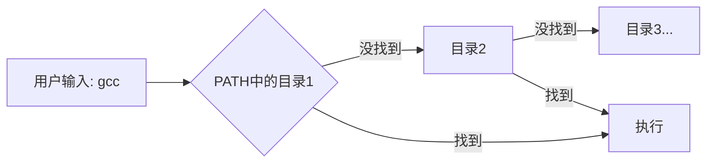

# 2.4.3 PATH与别名优化

> 所属章节：第2章 开发环境搭建 > 2.4 交叉编译工具链
> 
> 难度：[B→I] | 预计阅读时间：15分钟

## <span class="blue"> 本节导读
本节教你如何通过**PATH环境变量**、**CROSS_COMPILE变量**和**Shell别名**三个小技巧，让交叉编译命令变得"信手拈来", 不再需要输入冗长的工具链路径和文件名。

---

## <span class="blue"> PATH设置最佳实践 [B] 

### 为什么需要设置PATH
当你安装交叉编译器后，工具链的可执行文件通常位于类似 `/opt/arm-toolchain-12.2/bin/` 的深层目录中。<BR>每次编译都要输入完整路径非常繁琐：

```bash
# 没有设置PATH时，编译命令长这样
/opt/arm-toolchain-12.2/bin/aarch64-linux-gnu-gcc hello.c -o hello
```

PATH环境变量告诉Shell："去这些目录里找可执行文件"。把工具链的`bin`目录加入PATH后，直接输入`aarch64-linux-gnu-gcc`即可。

### PATH的工作原理
PATH是一组用冒号`:`分隔的目录列表。当你输入命令时，Shell会**按顺序**从左到右遍历这些目录，找到第一个匹配的可执行文件就执行。



### 操作步骤

**步骤1：临时生效（当前终端会话）**

```bash
# 追加到PATH头部（优先查找新目录）
export PATH=/opt/arm-toolchain-12.2/bin:$PATH

# 验证是否生效
echo $PATH
aarch64-linux-gnu-gcc --version
```

**步骤2：永久生效（推荐写入~/.bashrc）**

```bash
# 编辑用户配置文件
nano ~/.bashrc

# 在文件末尾添加以下内容
export PATH="/opt/arm-toolchain-12.2/bin:${PATH}"

# 使配置立即生效
source ~/.bashrc
```

### 常见错误

⚠️ **陷阱：覆盖PATH而不是追加**

错误的写法会抹掉系统原有的PATH，导致`ls`、`cat`等基础命令都找不到：

```bash
# ❌ 危险！系统命令将全部失效
export PATH=/opt/arm-toolchain-12.2/bin

# ✅ 正确：追加模式，保留原有路径
export PATH=/opt/arm-toolchain-12.2/bin:$PATH
```

> 🔴 **危险提示**：如果你不小心覆盖了PATH，当前终端中所有命令都会失效。此时可以用绝对路径调用命令恢复：`/usr/bin/nano ~/.bashrc` 或重新打开一个终端。

> 💡 **提示**：把工具链目录放在`$PATH`前面（`:/new/path:$PATH`），可以优先使用新工具链；放在后面（`:$PATH:/new/path`）则让系统工具优先。

---

## <span class="blue"> CROSS_COMPILE变量设置 [B] 

### 什么是CROSS_COMPILE
交叉编译工具链的所有命令都有一个**共同前缀**，例如 `aarch64-linux-gnu-`：

| 完整命令 | 前缀 | 工具名 |
|---------|------|--------|
| `aarch64-linux-gnu-gcc` | `aarch64-linux-gnu-` | `gcc` |
| `aarch64-linux-gnu-ld` | `aarch64-linux-gnu-` | `ld` |
| `aarch64-linux-gnu-as` | `aarch64-linux-gnu-` | `as` |
| `aarch64-linux-gnu-ar` | `aarch64-linux-gnu-` | `ar` |
| `aarch64-linux-gnu-strip` | `aarch64-linux-gnu-` | `strip` |

嵌入式Linux项目（如U-Boot、内核、BusyBox）的Makefile使用`CROSS_COMPILE`变量统一管理这个前缀。设置一次，所有编译工具自动匹配。

### 操作步骤

**步骤1：设置环境变量**

```bash
# 注意末尾的连字符不能漏！
export CROSS_COMPILE=aarch64-linux-gnu-

# 验证
echo $CROSS_COMPILE
```

**步骤2：在Makefile中使用**

```makefile
# Makefile片段
CC      = $(CROSS_COMPILE)gcc
LD      = $(CROSS_COMPILE)ld
AR      = $(CROSS_COMPILE)ar
STRIP   = $(CROSS_COMPILE)strip

all:
	$(CC) main.c -o main.elf
	$(STRIP) main.elf
```

**步骤3：编译U-Boot/Linux内核时的典型用法**

```bash
# 进入源码目录，先清理再配置
make distclean
make CROSS_COMPILE=aarch64-linux-gnu- <board_defconfig>
make CROSS_COMPILE=aarch64-linux-gnu- -j$(nproc)
```

### 常见错误

⚠️ **错误：遗漏末尾连字符**

```bash
# ❌ 错误：编译时会变成 aarch64-linux-gnugcc
export CROSS_COMPILE=aarch64-linux-gnu

# ✅ 正确：保留末尾的 -
export CROSS_COMPILE=aarch64-linux-gnu-
```

> 💡 **提示**：把`CROSS_COMPILE`和`ARCH`变量一起写入`~/.bashrc`，是嵌入式开发的标准习惯。后续学习内核编译时，你会发现这能节省大量重复输入。

---

## <span class="blue"> Shell alias简化 [B] 

### alias是什么
alias（别名）是给长命令起"绰号"。设置后，你输入绰号，Shell自动替换成完整命令。最适合简化那些**高频使用**又**冗长难记**的交叉编译命令。

### 操作步骤

**步骤1：定义别名**

```bash
# 当前终端临时生效
alias armgcc='aarch64-linux-gnu-gcc'
alias armld='aarch64-linux-gnu-ld'
alias armobj='aarch64-linux-gnu-objdump'
alias armstrip='aarch64-linux-gnu-strip'

# 测试
armgcc hello.c -o hello_arm
```

**步骤2：永久写入配置**

```bash
# 编辑 ~/.bashrc，在文件末尾添加
cat >> ~/.bashrc << 'EOF'

# ===== 嵌入式开发常用别名 =====
alias armgcc='aarch64-linux-gnu-gcc'
alias armld='aarch64-linux-gnu-ld'
alias armobj='aarch64-linux-gnu-objdump -d'
alias armstrip='aarch64-linux-gnu-strip'
alias armread='aarch64-linux-gnu-readelf -h'
# ================================
EOF

source ~/.bashrc
```

**步骤3：查看和管理别名**

```bash
alias              # 列出当前所有别名
unalias armgcc     # 删除单个别名
```

### 常见错误

⚠️ **陷阱：别名中包含空格时忘记引号**

```bash
# ❌ 错误：空格导致解析失败
alias armobj=aarch64-linux-gnu-objdump -d

# ✅ 正确：用单引号包裹整个命令
alias armobj='aarch64-linux-gnu-objdump -d'
```

> 💡 **提示**：alias只在当前Shell（交互式终端）中生效，在Makefile和脚本中**不会**生效。脚本中请始终使用完整命令或变量。

---

## 本节总结

本节介绍的三个技巧是嵌入式开发的"日常基本功"。下面是环境变量速查表：

| 变量/技巧 | 作用 | 设置位置 | 示例值 | 注意事项 |
|----------|------|---------|--------|----------|
| `PATH` | 告诉Shell去哪里找命令 | `~/.bashrc` | `/opt/toolchain/bin:$PATH` | ⚠️ 用追加`:$PATH`，切勿覆盖 |
| `CROSS_COMPILE` | 统一交叉编译器前缀 | `~/.bashrc`或命令行 | `aarch64-linux-gnu-` | ⚠️ 末尾必须带`-` |
| `ARCH` | 指定目标CPU架构 | `~/.bashrc`或命令行 | `arm64` / `arm` | 常与CROSS_COMPILE配合使用 |
| `alias` | 给长命令起绰号 | `~/.bashrc` | `armgcc='...'` | ⚠️ 脚本中不可用 |


---

## 下一步

环境变量设置完成后，下一节我们将进入**编译实战**：用交叉编译器编译一段简单的C程序，并通过`file`命令验证生成的确实是ARM可执行文件，而非x86程序。

---
