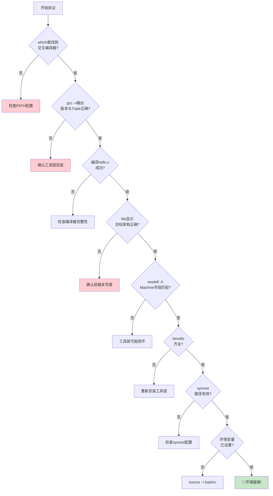

# 2.4.4 开发环境验证清单

> 所属章节：第2章 开发环境搭建 > 2.4 交叉编译工具链
> 难度：[B→B] | 预计阅读时间：15分钟

## 本节导读
本节提供一份**可逐项打勾的验证清单**，帮助你系统确认交叉编译环境的每一个关键环节都没有问题。学完本节，你将拥有一条自动化的验证脚本，一键确认环境是否就绪。

---

## 知识点1：逐项验证清单 [B][M] ~600字

安装和配置完成后，不要急着编译大项目。花5分钟做一遍系统检查，能避免后续数小时的诡异报错。下面这份清单把验证工作拆解成5个环节、10个检查点。

### 环节一：确认编译器"找得到"

**检查点1：which 能定位到交叉编译器**

```bash
which aarch64-linux-gnu-gcc
```

期望输出类似 `/opt/arm-toolchain-12.2/bin/aarch64-linux-gnu-gcc`。如果提示 `not found`，说明 PATH 没配好，回去检查 2.4.3。

**检查点2：确认没有"同名冲突"**

```bash
type -a aarch64-linux-gnu-gcc
```

`type -a` 会列出 PATH 中所有同名命令。如果系统自带了一个旧版本，它会显示多行。确保第一行是你刚安装的那个。

### 环节二：确认编译器"身份正确"

**检查点3：gcc -v 查看版本和 Target Triple**

```bash
aarch64-linux-gnu-gcc -v 2>&1 | tail -n 5
```

重点核对 `gcc version`（版本号）和 `Target:`（目标三元组）。例如 `Target: aarch64-linux-gnu` 表示这是为 64 位 ARM Linux 编译的工具链。关于 Target Triple 的详细解读，参见 2.1.3。

**检查点4：-dumpmachine 快速确认身份**

```bash
aarch64-linux-gnu-gcc -dumpmachine
```

直接输出编译器的目标平台字符串，例如 `aarch64-linux-gnu`。如果输出和你的目标板不匹配，说明装错了工具链。

### 环节三：编译并验证产物

**检查点5：编译最小测试程序**

```bash
cat > /tmp/hello.c << 'EOF'
#include <stdio.h>
int main() {
    printf("Hello ARM!\\n");
    return 0;
}
EOF
aarch64-linux-gnu-gcc /tmp/hello.c -o /tmp/hello_arm
```

**检查点6：file 命令确认 ELF 架构**

```bash
file /tmp/hello_arm
```

期望看到 `ELF 64-bit LSB executable, ARM aarch64`（或对应你目标板的架构）。如果显示 `x86-64`，说明你调用了系统自带的 gcc，交叉编译器的前缀没写对。

**检查点7：readelf -h 确认目标平台字段**

```bash
aarch64-linux-gnu-readelf -h /tmp/hello_arm | grep -E "Machine|Class|OS/ABI"
```

`readelf` 是 Binutils 家族的工具（详见 2.2.2），`-h` 读取 ELF 头部。`Machine` 字段显示目标 CPU 架构（如 `AArch64`），`OS/ABI` 字段显示目标操作系统类型。

### 环节四：确认辅助工具齐全

**检查点8：确认 binutils 工具链完整**

```bash
for tool in ld ar objdump readelf strip; do
    which aarch64-linux-gnu-${tool}
done
```

编译、链接、打包、调试都离不开这些工具。如果哪一行提示 `not found`，说明工具链安装不完整或 PATH 漏了。

**检查点9：确认 sysroot 存在**

```bash
aarch64-linux-gnu-gcc -print-sysroot
```

输出 sysroot 的绝对路径。如果输出为空或非预期目录，编译时找头文件和库文件就会出问题。sysroot 的详细结构见 2.3.1。

### 环节五：确认环境变量生效

**检查点10：CROSS_COMPILE 和 ARCH 已设置**

```bash
echo "CROSS_COMPILE=${CROSS_COMPILE}"
echo "ARCH=${ARCH}"
```

这两个变量后续编译 U-Boot、内核时几乎每次都会用到。提前确认它们写入到了 `~/.bashrc` 并已 source 生效。

---

## 知识点2：环境就绪确认——一键验证脚本 [B] ~400字

手动逐项检查虽然可靠，但每次新开终端都要重来一遍未免麻烦。下面这份完整的 Bash 脚本把 10 个检查点全部自动化，运行一次就能看到环境是否"全绿"。

### 完整验证脚本

```bash
#!/bin/bash
# ==========================================================
# 嵌入式Linux交叉编译环境验证脚本
# 用法: bash verify-toolchain.sh
# ==========================================================

# ---- 请根据你的实际工具链修改以下变量 ----
CROSS_PREFIX="aarch64-linux-gnu-"
TARGET_TRIPLE="aarch64-linux-gnu"
# -------------------------------------------

ERRORS=0

check() {
    local desc="$1"
    local cmd="$2"
    local expect="$3"
    
    echo -n "[CHECK] $desc ... "
    result=$(eval "$cmd" 2>&1)
    
    if echo "$result" | grep -q "$expect"; then
        echo "✅ PASS"
    else
        echo "❌ FAIL"
        echo "    命令输出: $result"
        echo "    期望包含: $expect"
        ((ERRORS++))
    fi
}

echo "========== 交叉编译环境验证清单 =========="
echo "检查前缀: ${CROSS_PREFIX}"
echo "目标平台: ${TARGET_TRIPLE}"
echo "=========================================="

# 环节一：找得到
check "编译器在PATH中" \
    "which ${CROSS_PREFIX}gcc" \
    "${CROSS_PREFIX}gcc"

# 环节二：身份正确
check "GCC版本信息正确" \
    "${CROSS_PREFIX}gcc -v 2>&1 | tail -n 1" \
    "gcc version"
check "Target Triple匹配" \
    "${CROSS_PREFIX}gcc -dumpmachine" \
    "${TARGET_TRIPLE}"

# 环节三：编译产物正确
cat > /tmp/verify_test.c << 'EOF'
#include <stdio.h>
int main(){ printf("OK\n"); return 0; }
EOF
${CROSS_PREFIX}gcc /tmp/verify_test.c -o /tmp/verify_test 2>/dev/null

check "file命令确认ARM架构" \
    "file /tmp/verify_test" \
    "ARM"
check "readelf确认Machine字段" \
    "${CROSS_PREFIX}readelf -h /tmp/verify_test | grep Machine" \
    "AArch64"

# 环节四：辅助工具齐全
check "链接器ld存在" \
    "which ${CROSS_PREFIX}ld" \
    "${CROSS_PREFIX}ld"
check "归档器ar存在" \
    "which ${CROSS_PREFIX}ar" \
    "${CROSS_PREFIX}ar"

# 环节五：sysroot
check "sysroot路径已设置" \
    "${CROSS_PREFIX}gcc -print-sysroot" \
    "/"

echo "=========================================="
if [ $ERRORS -eq 0 ]; then
    echo "🎉 全部通过！环境已就绪，可以开始交叉编译。"
    exit 0
else
    echo "⚠️  共 ${ERRORS} 项未通过，请根据上方提示排查。"
    exit 1
fi
```

### 操作步骤

1. 复制脚本内容到 `verify-toolchain.sh`
2. 修改脚本开头的 `CROSS_PREFIX` 和 `TARGET_TRIPLE` 为你实际使用的值
3. `bash verify-toolchain.sh` 一键运行
4. 全部显示 `✅ PASS` 即代表环境就绪

⚠️ **陷阱**：脚本的 `expect` 字段用的是 `grep -q` 模糊匹配。如果你的 Target Triple 是 `arm-linux-gnueabihf`，而脚本里写的是 `aarch64-linux-gnu`，检查点 4 会失败。务必修改脚本开头的两个变量。

💡 **提示**：把这份脚本保存在 `~/bin/` 目录下并命名为 `verify-arm-env`，需要时随时调用。也可以在每次重启电脑后、开始大项目编译前，习惯性执行一次。

---

## 本节总结

本节把环境验证拆解成一份可逐项执行的清单，并提供了一键化脚本。核心内容汇总如下：

| 环节 | 检查点 | 命令/方法 | 通过标准 | 失败原因 |
|------|--------|-----------|----------|----------|
| 1.找得到 | which 定位 | `which xx-gcc` | 输出完整路径 | PATH 未配置 |
| 1.找得到 | 无同名冲突 | `type -a xx-gcc` | 第一行为预期路径 | 存在多个版本 |
| 2.身份对 | 版本确认 | `gcc -v` | 版本号符合预期 | 装错版本 |
| 2.身份对 | Triple确认 | `gcc -dumpmachine` | 输出与目标板匹配 | 工具链架构错误 |
| 3.产物对 | 编译测试 | 编译 hello.c | 无报错生成可执行文件 | 编译器损坏 |
| 3.产物对 | ELF架构 | `file` | 显示目标架构（如ARM） | 误用系统gcc |
| 3.产物对 | ELF头信息 | `readelf -h` | Machine/OS/ABI正确 | 严重不匹配 |
| 4.工具齐 | binutils齐全 | `which ld/ar/objdump` | 全部能找到 | 安装不完整 |
| 4.工具齐 | sysroot存在 | `gcc -print-sysroot` | 输出有效目录 | 配置错误或缺失 |
| 5.变量对 | 环境变量 | `echo $CROSS_COMPILE` | 已设置且正确 | ~/.bashrc未source |

[图1：10步验证流程图——从PATH检查到编译产物的完整验证链路]



---

## 下一步

环境验证全部通过后，你的交叉编译工具链已经真正"可用"。下一节我们将进入**编译实战**，动手编译一个稍复杂的程序，并学习如何把编译产物下载到开发板上运行。

---

## 配套资源

### 表格清单
- 表1：10步验证清单汇总表（本节总结）——含环节、检查点、通过标准与失败原因

### 图示清单
- 图1：10步验证流程图 [mermaid图] —— 展示从PATH检查到编译产物验证的完整决策链路
- 图2：脚本运行效果截图 [配图说明——展示终端中运行一键验证脚本后，各检查点显示✅PASS或❌FAIL的效果]

### 代码清单
- 代码1：完整一键验证脚本 `verify-toolchain.sh`（知识点2）
- 代码2：`file` 与 `readelf -h` 验证命令（知识点1）
- 代码3：`type -a` 检测同名冲突命令（知识点1）
