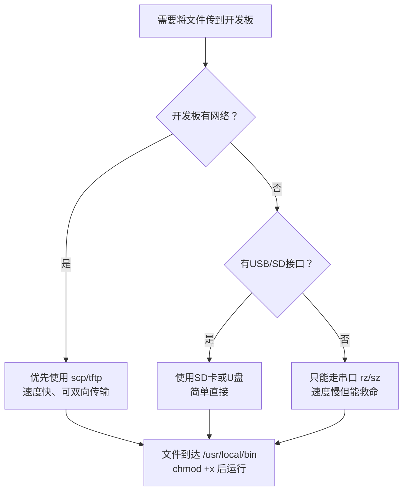

# 2.5.2 手动部署到开发板

> 所属章节：第2章 快速上手 > 2.5 程序部署
> 难度：[B] | 预计阅读时间：15分钟

## 本节导读

编译好的程序只有放到开发板上才能真正跑起来。本节介绍几种最基础的文件传输方式和开发板上的基本文件操作，让你不依赖复杂工具链也能完成部署。

---

## 知识点1：传输文件到开发板 [B] ~700字

嵌入式开发中，开发板和PC是分开的两个"世界"。程序在PC上编译，必须传送到开发板才能运行。下面介绍四种最常用的手动传输方法。

### 方法一：SD卡拷贝（最无脑）

把编译好的可执行文件复制到SD卡的根目录，然后将SD卡插入开发板。开发板启动后，SD卡通常自动挂载到 `/run/media/mmcblk0p1` 或类似路径。

```bash
# 在PC上：复制文件到SD卡（假设挂载到 /media/user/SDCARD）
cp ./hello /media/user/SDCARD/

# 在开发板上：查看并运行
cd /run/media/mmcblk0p1
./hello
```

💡 **提示**：SD卡是FAT32格式时，文件会丢失可执行权限，需要用 `chmod +x` 重新添加（见知识点2）。

### 方法二：U盘挂载（插拔即用）

U盘和SD卡原理相同，但开发板通常不会自动挂载U盘，需要手动操作。

```bash
# 在开发板上：查看U盘设备名（通常是 /dev/sda1）
fdisk -l | grep /dev/sd

# 手动挂载到 /mnt（/mnt是嵌入式Linux的标准外挂点）
mkdir -p /mnt/usb
mount /dev/sda1 /mnt/usb

# 复制文件到开发板本地
cp /mnt/usb/hello /usr/local/bin/
```

⚠️ **陷阱**：拔出U盘前必须先执行 `umount /mnt/usb`，否则可能损坏文件系统。

🔴 **危险**：不要挂载到已有系统目录（如 `/bin`、`/etc`），会覆盖系统文件导致无法启动。

### 方法三：串口传输 rz/sz（没网时的救命稻草）

当开发板没有以太网、没有USB Host时，只剩下串口这一根"救命稻草"。借助Zmodem协议，可以通过串口传输文件。

PC端和开发板端都需要安装 lrzsz 工具：

```bash
# 开发板端（接收文件）：
rz
# 此时在PC的串口终端（如minicom）中按 Ctrl+A 然后按 S，选择文件发送

# 开发板端（发送文件到PC）：
sz /etc/os-release
```

💡 **提示**：minicom发送文件的快捷键是 `Ctrl+A`，再按 `S`（Send）。

⚠️ **陷阱**：串口波特率通常是115200，传一个大文件可能需要几分钟，只适合应急。

### 方法四：网络传输 scp/tftp（最快最优雅）

如果开发板和PC在同一局域网，网络传输是最舒适的方式。

**scp**（基于SSH，需要开发板有SSH服务）：

```bash
# PC → 开发板（开发板IP为192.168.1.100）
scp ./hello root@192.168.1.100:/usr/local/bin/

# 开发板 → PC
scp root@192.168.1.100:/var/log/messages ./
```

**tftp**（更轻量，适合嵌入式）：

```bash
# 在PC上搭建tftp服务器（Ubuntu示例）
sudo apt install tftpd-hpa
# 把文件放到 /srv/tftp/ 目录

# 在开发板上拉取文件
tftp -g -r hello 192.168.1.10
tftp -p -l log.txt -r log.txt 192.168.1.10   # 上传
```

💡 **提示**：scp需要知道开发板的IP地址，可用 `ip addr` 或 `ifconfig` 在开发板上查看。

---

### 四种方法对比

| 传输方式 | 前提条件 | 速度 | 适用场景 | 推荐指数 |
|---------|---------|------|---------|---------|
| SD卡拷贝 | 有SD卡槽 | 快 | 单次部署、无网络 | ★★★ |
| U盘挂载 | 有USB Host | 快 | 临时传输、文件较大 | ★★★ |
| rz/sz串口 | 有串口即可 | 极慢（~10KB/s） | 无网络的最后手段 | ★☆☆ |
| scp/tftp | 网络连通 | 很快 | 日常开发首选 | ★★★★★ |

[图1：传输方法选择决策图]



---

## 知识点2：开发板文件系统操作 [B] ~500字

文件传到开发板后，还要知道怎么查看、挂载和运行。下面三个命令是嵌入式Linux的"基本功"。

### mount：查看当前挂载了哪些存储

开发板的存储空间通常很小，内部Flash只有几百MB。外部存储（SD卡、U盘）都需要挂载才能访问。

```bash
# 查看所有已挂载的文件系统
mount | grep -E '(mmc|sd|usb)'

# 典型输出：
# /dev/mmcblk0p2 on / type ext4 (rw,relatime)        ← 根文件系统
# /dev/mmcblk0p1 on /boot type vfat (rw)             ← boot分区
# /dev/sda1 on /mnt/usb type vfat (rw)               ← U盘
```

💡 **提示**：`mount` 不带参数就是"查看"，带参数才是"挂载"。初学者容易混淆。

### /mnt：专门为"外来"设备准备的目录

Linux有一个约定俗成的规矩：`/mnt` 和 `/media` 是用来挂载外部设备的目录，内部系统目录（`/bin`、`/sbin`、`/etc`）绝不动。

```bash
# 好习惯：在/mnt下创建子目录，用完即走
mkdir -p /mnt/sdcard
mount /dev/mmcblk0p1 /mnt/sdcard

# 查看/mnt下的内容
ls /mnt/sdcard/

# 用完卸载
umount /mnt/sdcard
```

⚠️ **陷阱**：不要把U盘挂载到 `/`、`/usr` 这种系统目录，否则会暂时"覆盖"原有内容，导致命令找不到，系统看似"坏了"。

### chmod：给文件"开绿灯"

从FAT32/exFAT格式的SD卡或U盘拷贝来的文件，权限默认是 `644`（所有者可读写，其他人只读），没有执行权限。

```bash
# 查看文件权限（最左边一列）
ls -l hello
# -rw-r--r-- 1 root root 12345 Jan 10 09:00 hello   ← 没有x，不能运行

# 添加可执行权限
chmod +x hello
# -rwxr-xr-x 1 root root 12345 Jan 10 09:00 hello   ← 有x了，可以运行

# 一步到位：拷贝同时设置权限
cp /mnt/usb/hello /usr/local/bin/ && chmod +x /usr/local/bin/hello
```

💡 **提示**：`chmod 755 hello` 和 `chmod +x hello` 效果类似，前者更明确地设置了完整权限。

🔴 **危险**：不要给不明来源的文件随意添加 `setuid` 权限（如 `chmod 4755`），这是嵌入式系统的安全隐患。

---

## 本节总结

| 概念 | 要点 | 操作 |
|------|------|------|
| SD卡拷贝 | 最无脑的方式，FAT32会丢权限 | `cp` 到SD卡 → 插入开发板 → 挂载点找文件 |
| U盘挂载 | 需手动mount/umount | `mount /dev/sda1 /mnt/usb` → 用完 `umount` |
| rz/sz串口 | 无网络时的最后手段 | 开发板执行 `rz`，PC端串口工具发文件 |
| scp/tftp | 有网络时的首选 | `scp file root@ip:/path` 或 `tftp -g -r file ip` |
| mount | 查看或挂载存储设备 | `mount` 查看，`mount 设备 目录` 挂载 |
| /mnt | 外部设备的标准挂载点 | 在 `/mnt` 下建子目录，不污染系统目录 |
| chmod +x | 给文件添加执行权限 | `chmod +x 文件名`，尤其从FAT拷贝来的 |

---

## 下一步

手动部署虽然直观，但效率不高。下一节 `2.5.3 NFS网络文件系统` 将教你把开发板的根目录直接"映射"到PC上，修改文件后开发板立刻生效，不再需要反复传输文件。

---

## 配套资源

### 表格清单
- 表1：四种文件传输方式对比（前提条件、速度、适用场景、推荐指数）

### 图示清单
- 图1：传输方法选择决策流程 [mermaid图]
- 图2：开发板典型挂载点示意图 [配图说明：展示 `/`、`/boot`、`/mnt`、`/run/media` 之间的关系]

### 代码清单
- 代码1：SD卡拷贝与运行命令
- 代码2：U盘挂载完整命令链
- 代码3：rz/sz串口传输命令
- 代码4：scp和tftp网络传输命令
- 代码5：mount查看与chmod授权命令
