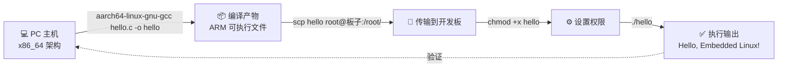

# 2.5.3 运行并验证

> 所属章节：第2章 工具链实战搭建 > 2.5 交叉编译并验证第一个程序
> 
> 难度：[B] | 预计阅读时间：15分钟

## 本节导读

你已经成功编译出了嵌入式程序 `hello`，并通过 `scp` 将它送到了开发板上。这一节是第2章的高潮——我们即将在板子上按下回车键，看到程序运行起来的那一刻。<br>这一节的目标很明确：运行程序、解决可能遇到的错误，最终确认整个交叉编译的闭环彻底打通。

---

## <span class="blue"> 在板子上运行程序 [B] 

恭喜，你站在了第2章最关键的节点上。前面所有的环境准备、工具链安装、编译命令、文件传输，都是为了这一刻——让代码在真实的嵌入式硬件上跑起来。

### 操作步骤

1. **登录开发板**（如果还没登录的话）
   ```bash
   ssh root@192.168.1.100
   ```

2. **确认文件已到位**
   先查看一下文件是否在预期的目录里：
   ```bash
   ls -l /root/hello
   ```
   你应该能看到 `hello` 这个文件，大小大约几 KB 到几十 KB。

3. **赋予执行权限**
   `scp` 传输过来的文件默认是有执行权限的，但如果是通过其他方式（比如 U 盘拷贝）传过来的，可能会丢失权限。保险起见，执行一次：
   ```bash
   chmod +x /root/hello
   ```

4. **运行程序！**
   ```bash
   cd /root
   ./hello
   ```

5. **观察输出**
   如果一切顺利，你会在屏幕上看到：
   ```
   Hello, Embedded Linux!
   ```

这一刻意味着：**交叉编译的完整闭环已经打通**。<BR>你在 PC 上用 `aarch64-linux-gnu-gcc` 编译出的程序，成功在 ARM 处理器上运行并输出了结果。

### 检查程序属性

在运行之后，你可以顺便验证一下这个程序确实是 ARM 架构的：

```bash
file /root/hello
```

输出应该类似这样：
```
hello: ELF 64-bit LSB executable, ARM aarch64, version 1 (SYSV), dynamically linked, interpreter /lib/ld-linux-aarch64.so.1
```

这说明三个关键信息：
- 文件格式是 ELF（Linux 可执行文件标准格式）
- 架构是 ARM aarch64
- 程序是动态链接的

### 常见错误

> ⚠️ **权限不足**：如果执行 `./hello` 时报 `Permission denied`，说明文件没有执行权限。用 `chmod +x hello` 修复。

> 💡 **提示**：在嵌入式 Linux 上，`.`（当前目录）**不在**默认的 `PATH` 搜索路径里，所以必须写 `./hello`，不能直接写 `hello`。

---

## <span class="blue"> 常见运行错误 [B] 

不是所有第一次运行都能一次成功。嵌入式环境资源有限、库文件路径不统一，很容易遇到运行时问题。下面是最常见的三种错误，以及如何排查。

### 错误1：找不到共享库

如果运行 `./hello` 时报错：
```
./hello: error while loading shared libraries: libc.so.6: cannot open shared object file: No such file or directory
```

这说明程序需要某个动态库，但板子上找不到它。

**排查方法**：
```bash
# 查看程序依赖了哪些库
ldd /root/hello
```

输出示例：
```
linux-vdso.so.1 (0x0000ffff8a180000)
libc.so.6 => /lib/libc.so.6 (0x0000ffff89f00000)
/lib/ld-linux-aarch64.so.1 => /lib/ld-linux-aarch64.so.1
```

如果某一行显示 `not found`，就是这个库缺失了。解决方案有两个方向：

- **短期方案**：把工具链里的对应 `.so` 文件也 `scp` 传到板子的 `/lib` 或 `/usr/lib` 目录
- **长期方案**：编译时加上 `-static` 参数，做静态链接（生成的文件会大一些，但不再依赖外部库）

### 错误2：找不到动态链接器（interpreter）

报错信息类似：
```
-bash: ./hello: No such file or directory
```

这个报错很迷惑——文件明明就在那里！真相是：**动态链接器不存在**。程序头部的 ELF interpreter 指定了 `/lib/ld-linux-aarch64.so.1`，但板子上没有这个文件。

**排查方法**：
```bash
ls -l /lib/ld-linux-aarch64.so.1
```

如果不存在，可以从工具链目录复制：
```bash
# 在PC端执行
scp /usr/lib/aarch64-linux-gnu/libc-2.31.so root@192.168.1.100:/lib/
# 并创建符号链接
ssh root@192.168.1.100 "ln -s /lib/libc-2.31.so /lib/ld-linux-aarch64.so.1"
```

> 💡 **提示**：复制库文件时要特别注意版本匹配，最好使用和编译工具链同一套 glibc 版本的库。

### 错误3：架构不匹配

如果报错：
```
./hello: cannot execute binary file: Exec format error
```

说明你把 `x86_64` 版本的程序传到了 ARM 板子上。检查一下：
```bash
file /root/hello
```

### 运行错误快速排查表

| 报错信息 | 可能原因 | 排查命令 | 解决方案 |
|---------|---------|---------|---------|
| `Permission denied` | 缺少执行权限 | `ls -l hello` | `chmod +x hello` |
| `cannot execute binary file` | 架构不匹配 | `file hello` | 重新用交叉编译器编译 |
| `No such file or directory`（文件明明存在） | 动态链接器缺失 | `ls /lib/ld-linux-aarch64.so.1` | 从工具链复制 glibc 并创建符号链接 |
| `library not found` | 缺少共享库 | `ldd hello` | 复制对应 `.so` 文件或改用静态编译 |

---

## <span class="blue"> 验证闭环完成 [B] 

当你看到 `Hello, Embedded Linux!` 出现在终端上时，实际上已经亲手完成了一件很有技术含量的事情。

### 交叉编译闭环流程

整个流程可以用下图清晰地表示：



[图1：交叉编译完整闭环流程图 — 从 PC 编译到开发板执行的全链路]

这个闭环的每个环节都已经在前面的章节里详细讲解过：

- **2.2 节**：你安装了交叉编译工具链
- **2.3 节**：你确认工具链可用
- **2.4 节**：你编写了 `hello.c`
- **2.5.1 节**：你用交叉编译器编译成功
- **2.5.2 节**：你把程序传到了开发板
- **2.5.3 节（本节）**：你执行并验证了程序

### 为什么这很重要

嵌入式开发的核心特征之一就是**宿主-目标架构分离**。<br>你的 PC 是 x86_64，开发板是 ARM——两个完全不同的 CPU 架构，指令集互不兼容。交叉编译就是跨越这道鸿沟的桥梁。

你刚才亲手走完了这座桥。

> 💡 **提示**：建议你把这个 `hello` 程序保留在开发板上，作为后续章节验证开发板环境是否正常的"试金石"。当你后面遇到环境问题时，运行 `./hello` 可以快速判断开发板本身是否正常。

---

## <span class="blue"> 本节总结

| 概念 | 要点 | 操作 |
|------|------|------|
| 运行程序 | 使用 `./程序名` 执行，注意当前目录不在 PATH 中 | `chmod +x hello` → `./hello` |
| 架构验证 | 用 `file` 命令确认是 ARM 可执行文件 | `file hello` |
| 库依赖排查 | `ldd` 列出程序需要的所有共享库 | `ldd hello` |
| 执行权限 | 文件必须有可执行位才能运行 | `chmod +x hello` |
| 静态链接 | 编译时加 `-static` 消除运行时库依赖 | `aarch64-linux-gnu-gcc -static hello.c -o hello` |
| 闭环验证 | PC 编译 → 传输 → 板子上执行 → 看到输出 | 按 mermaid 流程图走完全程 |

---

## <span class="blue"> 下一步

第 2 章到此圆满收尾。你已经完成了：

1. ✅ 理解交叉编译的概念
2. ✅ 安装并验证交叉编译工具链
3. ✅ 编写第一个 C 程序
4. ✅ 交叉编译成功
5. ✅ 将程序传输到开发板
6. ✅ **在开发板上运行并验证**

第 3 章我们将进入嵌入式 Linux 系统启动的世界。 从按下电源键的那一刻开始，内核是如何被加载、初始化，最终把控制权交给用户空间的。你即将理解 Bootloader、内核镜像、设备树这些核心概念。准备好继续探索吧！

---
