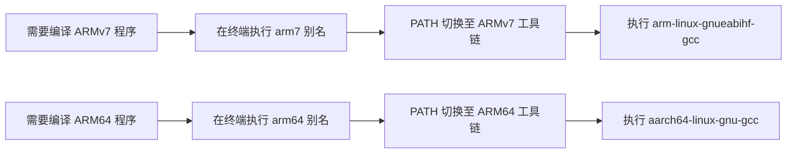

# 2.6.2 常见问题 FAQ

> 所属章节：第2章 交叉编译环境搭建 > 2.6 常见问题与排查
> 
> 难度：[B] | 预计阅读时间：12分钟

## 本节导读
本节汇总交叉编译新手最常踩的10个坑，涵盖编译失败、链接报错、运行时错误和工具链管理四大类。<br>读完这10个问答，你将能独立排查80%的入门级编译问题。

---

## <span class="blue"> 10个高频问题速查 [B] 

### Q1：gcc 命令找不到
**现象**：终端输入 `arm-linux-gnueabihf-gcc` 提示 `command not found`

**排查步骤**：
```bash
# 1. 确认工具链是否安装
which arm-linux-gnueabihf-gcc

# 2. 若未找到，手动指定路径
export PATH=$PATH:/opt/gcc-linaro-7.5.0/bin

# 3. 验证
echo $PATH | tr ':' '\n'
```

> ⚠️ **陷阱**：`export` 只对当前终端有效，新开窗口就失效。永久生效请写入 `~/.bashrc`。

---

### Q2：`file` 显示 "not stripped" 是什么意思
**解答**：

```bash
$ file hello
hello: ELF 32-bit LSB executable, ARM, EABI5 version 1, not stripped
```

- **not stripped**：程序里还保留着调试符号（函数名、变量名等），体积偏大，但方便调试。
- **stripped**：符号已被 `strip` 命令剥离，体积更小，适合放到板子上运行。

> 💡 **提示**：发布到嵌入式板子时执行 `arm-linux-gnueabihf-strip hello`，可缩小 30%~60% 体积。

---

### Q3：编译报错 "No such file or directory"（头文件找不到）
**现象**：`fatal error: xxx.h: No such file or directory`

**排查方法**：

```bash
# 查看编译器在哪些目录搜索头文件
arm-linux-gnueabihf-gcc -xc -E -v /dev/null
```

常见根因：

- 系统头文件路径缺少对应库（如 `libnl-3` 的头文件）
- 交叉编译时误用了 PC 版的库头文件

> 💡 **提示**：用 `-I/path/to/include` 手动指定头文件路径，或用 `pkg-config --cflags` 获取。

---

### Q4：链接报错 "cannot find -lc"
**现象**：`ld: cannot find -lc`

**解答**：这是链接器找不到 C 运行时库。通常意味着：

1. 工具链的 `sysroot` 配置不完整
2. 指定了错误的链接路径（如 PC 的 `/usr/lib`）

```bash
# 查看工具链默认搜索路径
arm-linux-gnueabihf-gcc -print-search-dirs

# 查看 sysroot 位置
arm-linux-gnueabihf-gcc -print-sysroot
```

> ⚠️ **陷阱**：不要用 `-L/usr/lib` 给交叉编译器指路，那是你 PC 的库，不是 ARM 的。

---

### Q5：程序在板子上报 "Exec format error"
**现象**：`./hello` 返回 `-bash: ./hello: cannot execute binary file: Exec format error`

**根因**：编译目标架构与板子 CPU 不匹配。

```bash
# 在 PC 上确认可执行文件架构
$ file hello
hello: ELF 32-bit LSB executable, ARM, EABI5...

# 在板子上确认 CPU 架构
$ uname -m
armv7l
```

> 🔴 **危险**：强行运行错误架构的程序不会报错提示，直接格式错误。务必用 `file` 核对。

---

### Q6：如何查看工具链支持的 C 标准版本
```bash
# 查看默认 C 标准
arm-linux-gnueabihf-gcc -dM -E - < /dev/null | grep __STDC_VERSION__

# 显式指定标准编译
arm-linux-gnueabihf-gcc -std=c11 hello.c -o hello
```

> 💡 **提示**：较老工具链（如 gcc 4.x）可能不支持 C11。项目迁移前先确认版本。

---

### Q7：静态链接后程序体积太大
**现象**：`gcc -static` 生成的可执行文件有 500KB 甚至更大。

**对策**：

```bash
# 方法一：用 strip 缩小
arm-linux-gnueabihf-strip --strip-unneeded hello

# 方法二：改用动态链接（推荐，除非系统没有 libc）
arm-linux-gnueabihf-gcc hello.c -o hello
```

> 💡 **提示**：嵌入式 Linux 通常已有 libc，优先用动态链接。静态链接只在无 libc 的裸板场景才需要。

---

### Q8：多个工具链怎么切换
**解答**：不要在 `~/.bashrc` 里把多个工具链的 `bin` 目录同时写入 `PATH`，否则命令冲突。

```bash
# 推荐：用别名隔离
alias arm7='export PATH=/opt/arm7-toolchain/bin:$PATH'
alias arm64='export PATH=/opt/arm64-toolchain/bin:$PATH'
```

[图1：多工具链切换最佳实践]


> ⚠️ **陷阱**：不要把两个工具链都放进 `~/.bashrc` 永久生效，否则命令名冲突时优先级不可控。

---

### Q9：厂商工具链和主线工具链选哪个

| 场景 | 推荐选择 | 理由 |
|------|----------|------|
| 学习通用技能 | 主线（Linaro / ARM 官方） | 通用性好，社区资源丰富 |
| 特定 SoC 量产 | 厂商工具链 | 可能包含硬件加速库、GPU 驱动、编解码优化 |
| 内核/根文件系统编译 | 厂商推荐版本 | 避免 ABI 不兼容导致内核 panic |

> 💡 **提示**：新手先学主线工具链，掌握原理后再根据芯片手册切到厂商版本。

---

### Q10：工具链升级后程序行为变了
**现象**：同样的代码，换到新版 gcc 后输出异常，甚至运行崩溃。

**常见原因**：

1. **优化器更激进**：`-O2` 或 `-Os` 的优化策略变化，触发了代码里的未定义行为
2. **ABI 变化**：新版工具链使用新的 hard-float ABI，旧库文件不匹配
3. **链接顺序变化**：新版 `ld` 对库依赖顺序更严格

**对策**：

```bash
# 对比两个版本的默认行为差异
old-gcc -Q --help=target > old.txt
new-gcc -Q --help=target > new.txt
diff old.txt new.txt
```

> ⚠️ **陷阱**：不要在新工具链上直接跑所有历史项目，升级后先用最小测试程序验证行为一致性。

---
## <span class="blue"> 下一步

恭喜你完成了第 2 章的全部内容！你已经掌握了：

- 交叉编译的基本原理与术语
- 如何获取、安装、配置交叉工具链
- 编译、链接、运行过程中的常见问题排查
