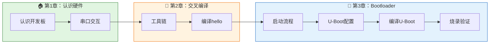

# 2.6.3 下一步预告

> 所属章节：第2章 嵌入式Linux交叉编译与工具链 > 2.6 本章回顾
> 难度：[B] | 预计阅读时间：5分钟

## 本节导读
你已经会用工具链交叉编译程序了。但程序是怎么"从无到有"跑起来的？下一章，我们回到系统启动的源头——Bootloader。

---

## 知识点1：第3章预告——系统启动的第一段代码 [B] ~500字

### 第2章，你已经做到的事

- 理解了**交叉编译**的本质——为什么PC编译的程序不能直接在ARM板子上跑
- 认识了工具链的"铁三角"：**GCC**、**Binutils**、**libc**
- 安装并配置了交叉编译工具链，用 `gcc --version` 验证通过
- 亲手交叉编译 `hello.c`，在开发板上运行成功
- 掌握了 `CROSS_COMPILE`、sysroot、Target Triple 等核心概念

### 第3章，你将学到什么

开发板上电后，第一个运行的程序不是Linux内核，也不是 `hello`——而是一段叫 **Bootloader** 的代码。它是整个系统的"点火器"：初始化内存、设置时钟、加载内核，然后把控制权交出去。

在第3章，你将面对嵌入式世界最流行的开源 Bootloader——**U-Boot**。



[图1：学习旅程图——从认识硬件到交叉编译，再到掌握系统启动全貌]

| 主题 | 你将学会 | 意义 |
|------|---------|------|
| **启动流程** | BootROM → SPL → U-Boot → 内核 的完整链条 | 看懂开机日志的每一行 |
| **U-Boot配置** | 用 `make menuconfig` 裁剪功能 | 理解"按需编译" |
| **编译U-Boot** | 交叉编译出自己的Bootloader | 从"用别人的"变成"自己做" |
| **烧录验证** | 把U-Boot烧写到SD卡/Flash | 真正掌控启动的"第一棒" |

U-Boot 相当于电脑的 BIOS/UEFI——上电后它第一个醒来，做各种"起床准备工作"，然后叫醒Linux内核。在第3章，当你看到开发板上打印出**你自己编译的** U-Boot 版本号时，成就感将无与伦比。

⚠️ **陷阱**：Bootloader烧录风险比普通程序更高。操作失误可能导致开发板"变砖"无法启动。第3章每一步都会强调**先备份、再操作**，请务必遵守。

💡 **提示**：开始第3章前，请准备：一张空闲SD卡+读卡器、原厂固件备份。这些是Bootloader实验的"安全网"。

---

## 本节总结

| 回顾 | 第2章成就 | 第3章衔接 |
|------|----------|----------|
| 交叉编译 | 能为ARM编译程序 | 为编译U-Boot做好准备 |
| 工具链 | 安装并验证通过 | 用同一把"武器"编译Bootloader |
| hello实验 | 打通编译→传输→运行的闭环 | 理解普通程序与启动程序的区别 |
| CROSS_COMPILE | 掌握交叉编译前缀 | U-Boot编译同样需要它 |

---

## 下一步

第3章从 **BootROM与启动流程** 开始。我们一起打开开发板上电瞬间的黑匣子，看看0.1秒内到底发生了什么——从芯片内部的只读存储器，到SPL，再到完整的U-Boot。

*第2章完。你已拥有为嵌入式设备编译代码的能力。接下来，让我们回到一切开始的地方——系统启动的第一秒。*

---

## 配套资源

### 表格清单
- 表1：第3章核心内容预览表
- 表2：本节总结表（第2章成就与第3章衔接）

### 图示清单
- 图1：学习旅程图 [mermaid图] — 第1章→第2章→第3章的进阶路径

### 代码清单
- 代码1：第3章U-Boot编译命令预览

```bash
# 第3章你将执行的命令预览
export CROSS_COMPILE=arm-linux-gnueabihf-
make ARCH=arm menuconfig      # 配置U-Boot
make ARCH=arm -j$(nproc)      # 编译U-Boot
# 将生成的 u-boot.bin 烧录到SD卡...
```
